# An Enhanced Fe–28Mn–9Al–0.8C Lightweight Steel by Coprecipitation of Nanoscale Cu-Rich and κ-Carbide Particles

Lei Yang, Zhiming Li, Xiang Li, Yunhu Zhang, Ke Han, Changjiang Song,* and Qijie Zhai

Fe–Mn–Al–C austenitic matrix lightweight steels show a high ultimate tensile strength and total elongation but a relatively low yield strength. The yield strength is increased by coprecipitation of nanoscale Cu-rich and κ-carbide particles. For lightweight steel, strips of Fe–28Mn–9Al–0.8C (wt%) are prepared in near-rapid solidification conditions, the addition of Cu up to 5 wt% leads to the coprecipitation of nanoscale Cu-rich and κ-carbide particles in certain heat-treating conditions. The formation of Cu-rich particles has promoted the precipitation of nanosized κ-carbide particles. The yield strength of particle-strengthened Fe–28Mn–9Al–0.8C–5Cu (wt%) austenitic matrix steel reaches 808 MPa with total elongation greater than 20%. Thus, the addition of 5 wt% Cu increases the yield strength of heat-treated austenitic matrix lightweight steel without seriously deteriorating its plasticity by coprecipitation of nanoscale Cu-rich and κ-carbide particles.

# 1. Introduction

The weight reduction of vehicles is a key issue in the automotive industry.[1–5] Researchers have been interested in Fe–Mn–Al–C steels because of their good mechanical properties and low density. The matrix of lightweight steels can be either ferrite or austenite, depending on the content of alloying elements.[6] Austenitic matrix Fe–Mn–Al–C lightweight steels ([15–30 wt%] Mn–[8–12 wt%]Al–[0.5–1.3 wt%]C) show a high ultimate tensile strength (800–1000 MPa) and large elongation (50%).[7–10] However, the yield strength of 360–540 MPa[11–16] is low.

For austenitic matrix Fe–Mn–Al–C steels, it is well known that the precipitated κ-carbide particles can improve the yield strength and have been extensively studied.[17–20] However, the yield

L. Yang, Z. Li, X. Li, Prof. Y. Zhang, Dr. C. Song, Prof. Q. Zhai Center for Advanced Solidification Technology (CAST)

School of Materials Science and Engineering

Shanghai University

333 Nanchen Road, Baoshan District, Shanghai 200444, P. R. China

E-mail: riversong@shu.edu.cn, riversxiao@163.com

Prof. K. Han

National High Magnetic Field Laboratory

Florida State University

Tallahassee, FL 32310, USA

The ORCID identification number(s) for the author(s) of this article can be found under https://doi.org/10.1002/srin.201900665.

DOI: 10.1002/srin.201900665

strength enhanced by κ-carbide particles is sometimes not enough for high Mn austenitic matrix lightweight steels. The nanoscale Cu-rich particles in steel have many advantages, such as precipitation strengthening,[21] promoting deformability without losing ductility,[22] improving corrosion resistance,[23] and increasing resistance to fatigue crack growth.[24] For example, Cu added in low-carbon steel could compensate for the reduced strength caused by the decrease in carbon content without deteriorating its weldability.[25–27] In addition, the coprecipitation of nanoscale Cu-rich and other particles can achieve better effects.[28,29] For example, 1.5Cu–3.25Ni–Al–Mn steels with coprecipitation of Cu-rich and Ni(Al, Mn) particles possess strengths of 1300 MPa and a total elongation of 11%.[28]

Kapoor et al. developed a ferritic steel enhanced by the coprecipitation of nanoscale Cu and B2–NiAl phase, whose strength could reach 1600 MPa.[30]

Therefore, in this work, the coprecipitation of nanoscale Cu-rich and κ-carbide particles was used to improve the strength of austenitic matrix Fe–Mn–Al–C lightweight steels.

# 2. Experimental Section

The compositions of studied steels were Fe–28Mn–9Al–0.8C– (0, 3, 5)Cu(wt%), which were referred to as 0Cu, 3Cu, and 5Cu steel for convenience, respectively. The near-rapid solidification technology was a simple, efficient method to directly obtain high-performance strips.[31,32] It has advantages of refining the structure, reducing segregation, and expanding solidsolution limit. In this work, centrifugal casting in the near-rapid solidification condition was used to prepare the three types of steel strips ( [33]). The ingots were prepared by a vacuum Figure 1induction furnace. Then, the ingots were remelted, and molten metal flowed through the graphite funnel into a copper mold rotated at a speed of 600 r min1 . Eventually, the molten metal rapidly solidified in a rotating copper mold with the maximum cooling rate of about $1 0 ^ { 3 } \mathrm { K } \mathrm { s } ^ { - 1 } . ^ { [ 3 4 ] }$ The size of fabricated strips was 75 mm 60 mm 2.5 mm. The whole experiment was conducted in argon atmosphere. Some strips were heat treated at 500 C for 6 h and 20 h by a tubular vacuum furnace (104 Pa), then cooled to room temperature in the furnace. The chemical

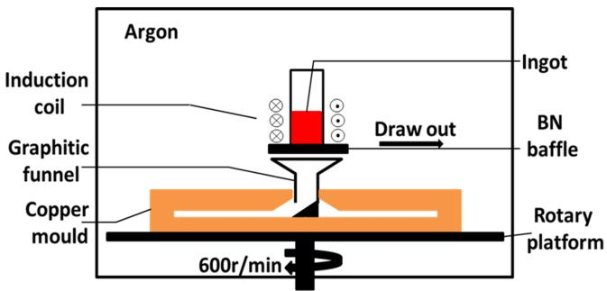  
Figure 1. Schematic illustration of centrifugal casting equipment.[33] Reproduced with permission.[33] 2019, Elsevier.

compositions of the studied lightweight steels were measured using inductively coupled plasma-atomic emission spectrometry (ICP-AES). The measured results were as follows: 27.88wt%Mn, 8.10wt%Al, 0.84wt%C, 63.18wt%Fe for 0Cu steel strip; 26.67wt%Mn, 8.41wt%Al, 0.81wt%C, 2.82wt%Cu, 61.56wt%Fe for 3Cu steel strip; 27.71wt%Mn, 8.31wt%Al, 0.83wt%C, 4.75wt%Cu, and 58.40wt%Fe for 5Cu steel strip.

Microstructures of the strips were observed by an optical microscope (OM) and a scanning electron microscope (SEM, Hitachi SU-1500, Japan). The strips for structure observation were polished and etched at $7 0 ^ { \circ } \mathrm { C }$ for 30 s in a mixed solution

of supersaturated picric acid (94 mL), 10% hydrochloric acid (3 mL), and dodecyl benzene sulfonic acid (3 mL). The constituent phase of the strips was identified by X-ray diffraction (XRD, Rigaku D/max-2200 , Cu Kα target operated at 40 kV and 60 mA) and a transmission electron microscope (TEM, JEM-2010 F operated at 200 kV, Japan). The strips for TEM analysis were mechanically polished to a thickness of 50 μm, punched to disk strips (diameter 3 mm), using a disk cutter, and then electrothinned to thin foils using a twin-jet electropolishing apparatus in a 10 vol% perchloric acid 90 vol% ethyl alcohol solution at temperature ranging from $- 2 8 { \mathrm { ~ t o ~ } } - 3 2 { \mathrm { ~ } } ^ { \circ } { \mathrm { C } }$ using a voltage of 40 V. Tensile tests were conducted at room temperature with a constant strain rate of $1 0 ^ { - 3 } \mathrm { s } ^ { - 1 }$ using MTS Criterion Model 44 of 10 kN capacity. Strain measurement was achieved by an extensometer placed on the tensile specimen, and total elongation was automatically obtained. The gauge width and length of tensile strips were 4 and 12 mm, respectively. At least three specimens were tested for each state to ensure repeatability and accuracy for mechanical properties.

# 3. Results

# 3.1. Microstructure

XRD patterns showed that all as-cast strips mainly consisted of a major face-centered cubic (FCC) phase (γ, austenite) and

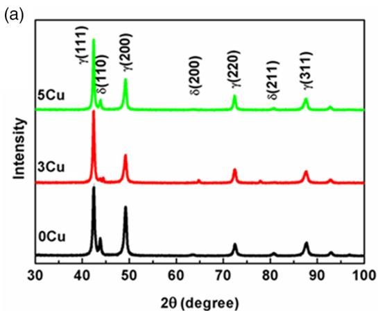

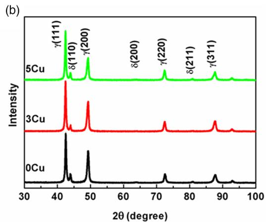

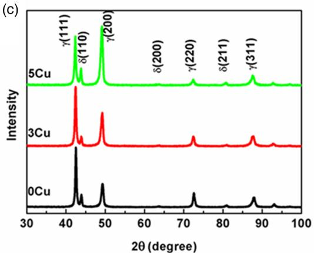  
Figure 2. XRD results of the strips: a) as cast, b) heat treated at 500 C for 6 h, c) heat treated at 500 C for 20 h. The FCC phase is denoted as γ and the BCC phase is denoted as δ.

a body-centered cubic (BCC) phase (δ, ferrite) ( a),[35] Figure 2γ usually has more Mn and C, and δ has more Al element.[6] An addition of Cu had no noticeable effect on the constituent phase in Fe–28Mn–9Al–0.8C (wt%) strips. After heat treatment at 500 C for 6 h and 20 h, the XRD results also showed no clear change in the constituent phase (Figure 2b,c, respectively.).

For OM micrographs of the 0Cu, 3Cu, and 5Cu strips in the as-cast condition, irregular ferrite was uniformly distributed in the austenitic matrix ( a–c). When 3wt%Cu was Figure 3added, bulk ferrite almost disappeared, whereas zebraic ferrite increased. However, when Cu content increased to 5wt%Cu, some dendritic ferrites appeared. According to the quantitative analysis (an Image Pro Plus software was used to measure the area proportion of ferrite in four metallographic pictures and finally gave the mean content), the ferrite contents of the 0Cu, 3Cu, and 5Cu strips were 13 1%, 8 1%, and 10 2%, respectively. It indicated that an addition of Cu slightly decreased ferrite content but significantly influenced its morphology.

Compared with the as-cast strips, heat treatment at 500 C for 6 h or 20 h had a clear effect on ferritic morphology and content (Figure 3d–h,j). Dendritic ferrite of the 5Cu strip gradually changed into fine granivorous ferrite after heat treatment.

The content of ferrite increased after heat treatment in all strips. Even addition of 5wt%Cu did not increase the austenite content compared with the 0Cu strip in the same condition. The main reason was that these steel strips were prepared in near-rapid solidification conditions, as described in Experimental Section, and its constituent phase was a nonequilibrium phase, which was not only related to thermodynamics but also kinetics.[36] Thus, the constituent phase and phase content gradually changed during heat treatment at $5 0 0 ^ { \circ } \mathrm { C }$ .

# 3.2. Mechanical Properties

The engineering stress–strain curves of all strips are shown in . The yield strength, ultimate tensile strength, and total Figure 4elongation of the 0Cu as-cast strip were 538  19 MPa, 877 28 MPa, and 35 3%, respectively (Figure 4a). An addition of Cu reduced the yield strength and ultimate tensile strength of the steel strips by about 20–50 MPa. The total elongation increased from 35  3% to 38  6% for the 3Cu strip, whereas it decreased to 27  5% for the 5Cu strip.

After heat treatment at 500 C for 6 h, the yield strengths of the 0Cu, 3Cu, and 5Cu strips increased to 690 24, 695 5,

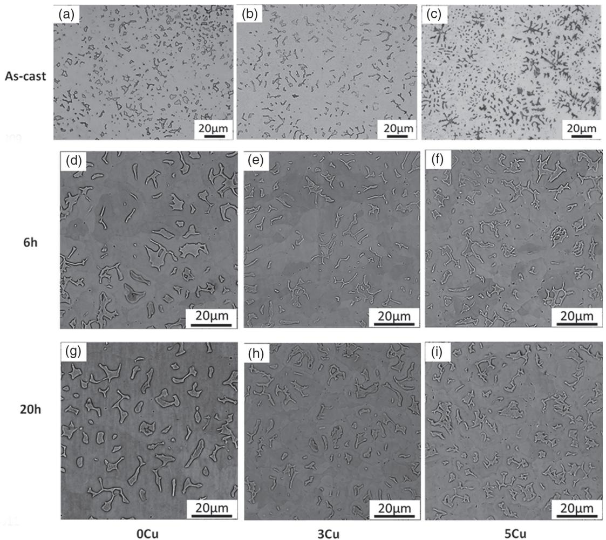  
Figure 3. Microstructures of the strips: a) 0Cu, b) 3Cu, and c) 5Cu for as cast; d) 0Cu, e) 3Cu, and f) 5Cu for heat treatment at 500 C for 6 h; g) 0Cu, h) 3Cu, and i) 5Cu for heat treatment at 500 C for 20 h.

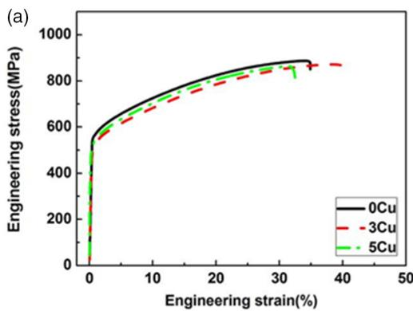

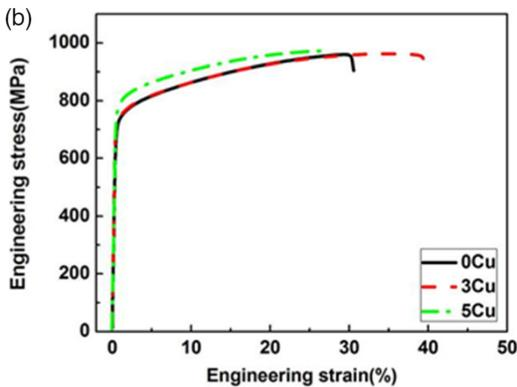

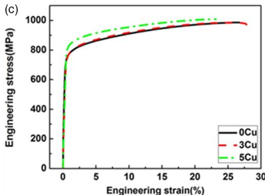  
Figure 4. Room-temperature engineering stress–strain curves of the strips: a) as-cast, b) heat treated at $5 0 0 ^ { \circ } \mathsf { C }$ for 6 h, and c) heat treated at $5 0 0 ^ { \circ } \mathsf C$ for 20 h.

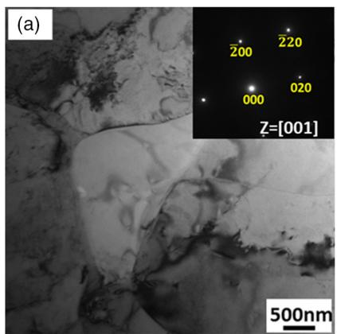

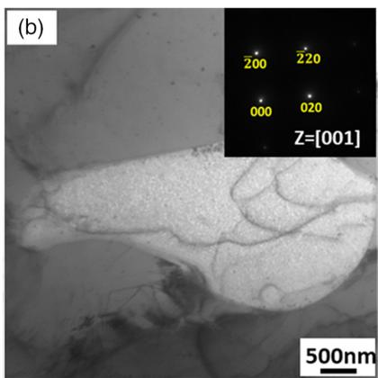

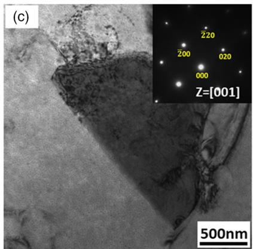  
Figure 5. TEM images for the as-cast steel strips: a) 0Cu, b) 3Cu, c) 5Cu, and the inset is the corresponding electron diffraction pattern of the matrix [001].

and $7 6 6 \pm 4 \mathrm { M P a } ,$ , respectively (Figure 4b). The increase in the yield strengths of the three strips was about 152, 205, and 257 MPa, respectively. The ultimate tensile strength of three strips increased to 927 48, 945 19, and 960 18 MPa, respectively. The total elongation of the 3Cu steel strip was still $3 9 \pm 2 \%$ , but the 0Cu and 5Cu steel strips decreased to $2 7 \pm 5 \%$ and 26  2%, respectively.

When a longer heat treatment (20 h) was conducted on the 0Cu, 3Cu, and 5Cu steel strips, the yield strength further increased to 766  35, 751  6, and 808  10 MPa, respectively. The corresponding increments were 239, 261, and 289 MPa,

respectively. The ultimate tensile strength increased to $9 8 7 \pm 2 1 , 9 8 5 \pm 3 ,$ and $1 0 0 8 \pm 1 2 \mathrm { M P a } ,$ , respectively, and the increments were 110, 143, and 169 MPa, respectively. The total elongation of three strips decreased to $2 3 \pm 5 \% , 2 6 \pm 2 \%$ , and $2 3 \pm 3 \%$ . It could be seen that after heat treatment at $5 0 0 ^ { \circ } \mathrm { C } ,$ for 6 h and 20 h, the increment of yield strength in Cu-containing steel strips was greater than that of the Cu-free steel strip, and total elongation of the Cu-containing steel strips was not clearly lower than that of the Cu-free steel strip.

It could be concluded that an addition of Cu had an influence on the mechanical properties of Fe–28Mn–9Al–0.8C (wt%)

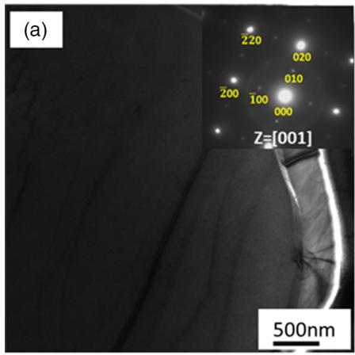

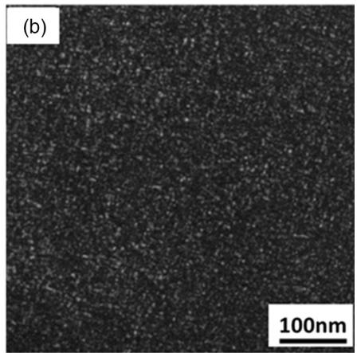

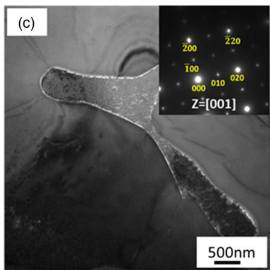

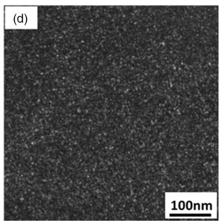

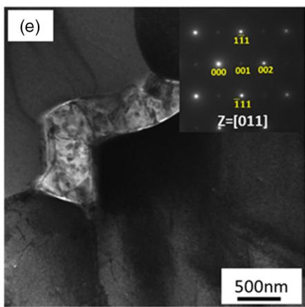

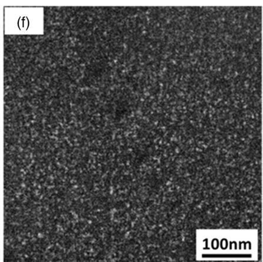  
Figure 6. TEM images for the strips heat treated at 500 C for 20 h: a) 0Cu, b) 3Cu, and c) 5Cu and dark-field images of κ-carbide particles: d) $0 \mathsf { C u } , \mathsf { e } )$ 3Cu, and f) 5Cu. TEM images for samples heat treated for 6 h are similar.

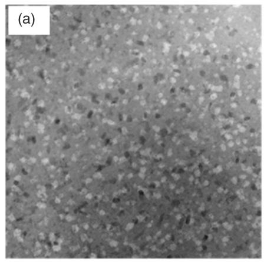

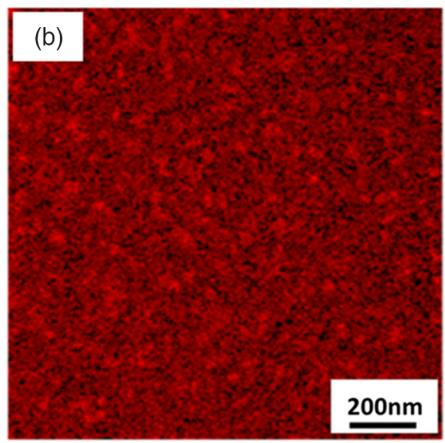

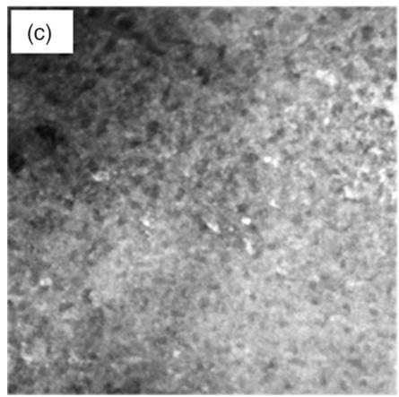

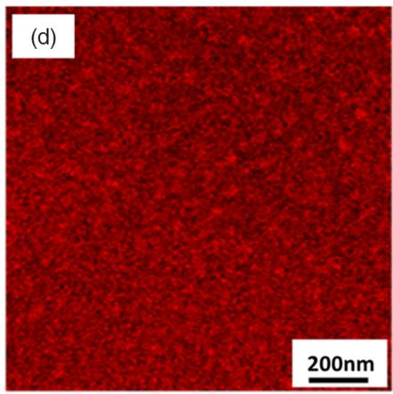  
Figure 7. TEM–EDS mapping of the strips heat treated at 500 C for 20 h: a,b) for 3Cu steel strip and c,d) for 5Cu steel strip.

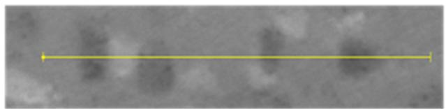

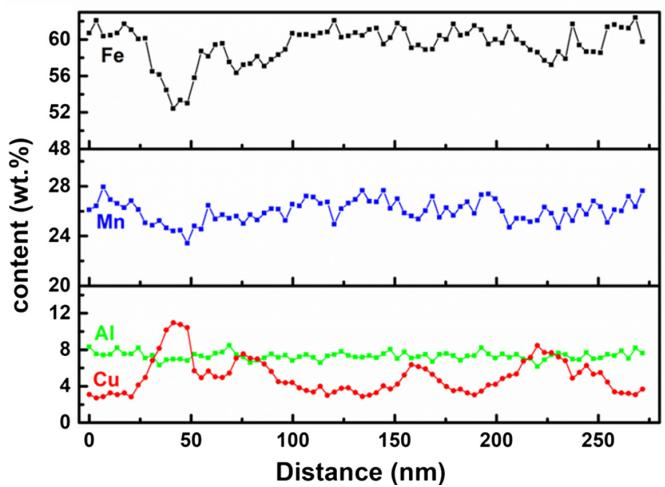  
Figure 8. TEM–EDS line profiles of the 3Cu steel strip heat treated at 500 C for 20 h. The line scan showed distributions of Fe, Mn, Al, and Cu in 3Cu steel strip heat treated at 500 C for 20 h. It indicated that Cu atoms were enriched in Cu-rich particles, and Fe and Mn atoms were rejected from them during heat treatment.

austenitic matrix lightweight steel strips, especially the strength of the strip was obviously improved by adding 5wt%Cu with suitable heat treatment. In contrast, the total elongation of the 3Cu steel strip was higher than that of the Cu-free steel strip because it had an obviously higher content of austenite.

# 3.3. TEM Analysis

TEM was used to study the Cu-strengthening mechanism.

# 3.3.1. As-Cast Strips

Microstructures of the as-cast 0Cu, 3Cu, and 5Cu steel strips are shown in . There was not an observed difference in aus-Figure 5tenite matrix between Cu-free and Cu-containing strips. According to the selected-area diffraction (SAD) pattern, there was no other diffraction spot except the austenite matrix. However, the lattice constant of the crystal gradually increased from 0.36982 to 0.37261 nm and 0.37440 nm with the increase in Cu content. As the radius of the Cu atom is larger than that of the Fe atom, the lattice constant is distorted by the addition of the Cu atom.

# 3.3.2. Matrix of the Heat-Treated Strips

TEM data of the strips heat treated at 500 C for 6 h and 20 h were similar. The fine spots in SAD patterns demonstrated the

existence of κ-carbide particles in all heat-treated strips ( ). Dark-field images showed that the amount and size Figure 6of κ-carbide particles increased slightly with the increase in Cu content (Figure 6b,d,f). Our measurements showed that the average size of κ-carbide particles increased from 6.6 2.6 nm for 0Cu to $7 . 8 \pm 3 . 0$ nm for 3Cu and to $8 . 2 \pm 4 . 0$ nm for 5Cu. A TEM and energy-dispersive spectrometer (TEM–EDS) were used to find the Cu-rich particle ( ). Cu-rich precipitates were Figure 7found mainly in the austenite matrix of heat-treated Cu-containing steel strips (Figure 7). Our measurements showed that the sizes of Cu-rich particles were 30 9 and 33 10 nm in 3Cu and 5Cu strips, respectively.

The EDS line scan of 3Cu sample heat treated at 500 C for 20 h indicated that Cu was rich in precipitate particles, and Fe and Mn atoms were rejected from them during heat treatment, which might provide favorable conditions for the growth of κ-carbide particles and make κ-carbide particles larger in the Cu-containing heat-treated steel strips (Figure 6 and ).

8To identify the structure of Cu-rich particles, nanobeam diffraction (NBD) of the selected area was conducted, as shown in . Figure 9a shows the morphology of Cu-rich particles Figure 9at a higher magnification, which showed that the Cu-rich particle was mainly of irregular oval shape. The NBD of a Cu-rich particle showed that the structure of the Cu-rich particle was an FCC structure, being the same as that of the pure Cu, as

shown in Figure 9b. Figure 9c shows the high-resolution image of Cu-rich particles, and the corresponding fast Fourier transform (FFT) result is shown in Figure 9d. It was found that the crystal plane spacing (002) was 0.181 nm, which ¯ was consistent with that of Cu in FCC structure.[37] Therefore, for the Cu-containing steel strips heat treated at $5 0 0 ^ { \circ } \mathrm { C }$ for 20 h, the Cu-rich particle with an FCC structure occured in the austenite matrix.

# 3.3.3. Ferrite of Heat-Treated Strips

As mentioned earlier, all strips also contained a certain amount of ferrite in addition to austenitic matrix. After heat treatment, an ordered DO3 phase was found in both Cu-free and Cucontaining steel strips, and Cu-rich particles also appeared in ferrite of the Cu-containing steel strips.  shows the Figuresults of the 5Cu steel strip heat treated at $5 0 0 ^ { \circ } \mathrm { C }$ for 20 h. From the bright-field image of ferrite (Figure 10a), many small black particles could be found in ferrite. In the SAD pattern, superlattice spots belonging to the DO3 phase were found. The corresponding dark-field result of the DO phase is shown in Figure 10b. In the EDS result (Figure 10c), a certain amount of Cu-rich particles appeared in the ferrite of the 5Cu steel strip after heat treatment.

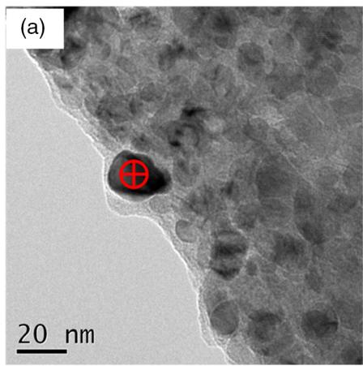

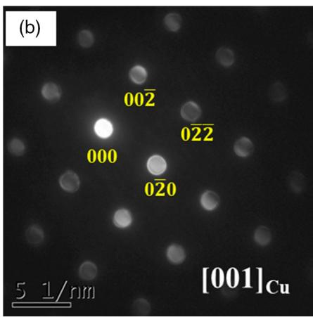

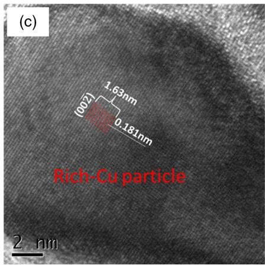

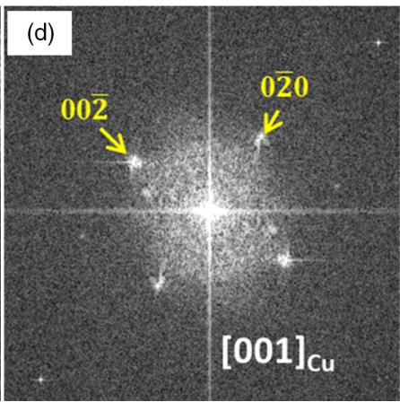  
Figure 9. TEM images of the 5Cu steel strip heat treated at 500 C for 20 h: a) Cu-rich particle morphology; b) NBD of Cu-rich particle; c) the high-resolution transmission electron microscopy (HRTEM) image of the Cu-rich particle; d) FFT image of the Cu-rich particle.

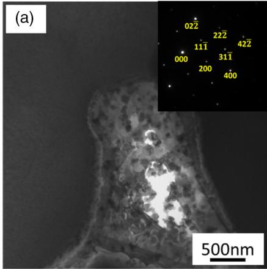

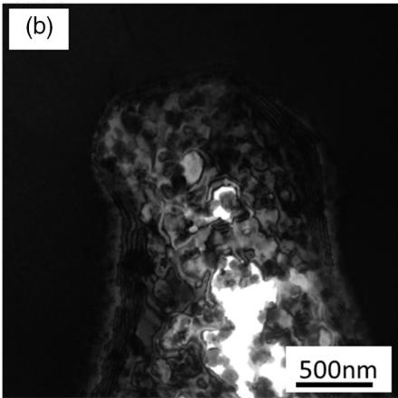

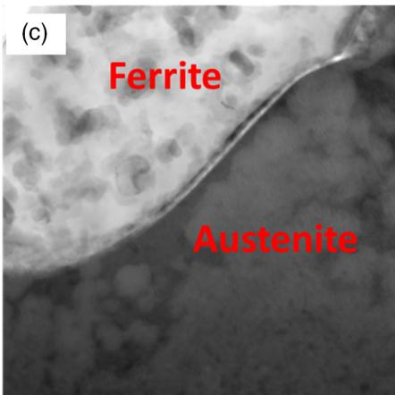

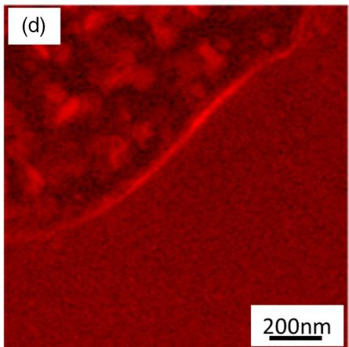  
Figure 10. TEM and EDS images of the 5Cu steel strip heat treated at 500 C for 20 h: a) bright-field image, b) dark-field image, and c,d) TEM–EDS mapping of Cu.

# 4. Discussion

# 4.1. As-Cast Steel Strips

For the as-cast strips, both the addition of 3 and 5wt%Cu decreased the yield strength of the near-rapidly solidified Fe–28Mn–9Al–0.8C (wt%) steel strips. But the yield strength of steel strips with the addition of 5wt%Cu was slightly higher than that of the strip with the addition of 3wt%Cu. The reasons for the change in yield strength were analyzed as following. First, an addition of Cu element increased the austenitic content, which could lead to the decrease in strength because austenite is softer than ferrite in this steel.[6] In 5Cu strip, the morphology of ferrite changed to dendritic, which also decreased the strength.[38] Second, an addition of Cu to Fe–Mn–C steels would cause a softening effect in terms of increasing stacking fault energy (SFE).[39,40] The increase in SFE would reduce the width between the partial dislocations that contain stacking faults, and the two partial dislocations more likely to combine to form a perfect dislocation, which could cross-slip to another slip plane to prevent accumulation of a large number of dislocations on the same sliding plane.[41] Third, Cu element, as a solid-solution element, could improve strength by solid-solution strengthening. When 3wt%Cu was added, the strength of the as-cast steel strip decreased due to increase in austenite content and SFE of

austenite matrix. While solid-solution strengthening increased with the added Cu increasing from 3 to 5 wt%, it resulted in increase in strength.

# 4.2. Heat-Treated Steel Strips

A large amount of nanosized κ-carbide particles precipitated in the heat-treated Cu-free steel strips, leading to an increase in yield strength. According the Fe–Cu phase diagram,[42] the solubility of Cu in austenite could be calculated by the following equation.

$$
\log [ \mathrm {C u} ] _ {\gamma} = 2. 6 5 4 - \frac {2 4 6 2}{T} \quad (T = 1 1 1 6 - 1 3 7 1 \mathrm {K}) \tag {1}
$$

where Cu is the solid solubility of Cu in austenite and T is the absolute temperature. The solid solubility of Cu in austenite at 1116 K $( 8 4 3 ^ { \circ } \mathrm { C } )$ is 2.8 wt%, which is lower than 3 wt%. Therefore, when the 3Cu strip and 5Cu strip were heat treated at $5 0 0 ^ { \circ } \mathrm { C } ,$ Cu was in a supersaturated state. Moreover, the Fe–Cu system had a large positive enthalpy of mixing[43] and an immiscibility of Cu and Fe. Therefore, Cu atoms were easily separated out from the supersaturated austenitic matrix and formed Cu-rich clusters or particles, and the high Cu content would yield a higher chemical driving force for the precipitation of Cu-rich

particles during the heat-treating process.[44] More and more Cu atoms were aggregated in the Cu-rich particles, and the displaced atoms were rejected from the Cu-rich particles.[28,30,45,46] As a result, other elements were enriched around the Cu-rich particles, which were favorable for the formation of other precipitated phases. Therefore, the formation of Cu-rich particles could promote the precipitation of κ-carbide particles. As the result, the addition of 3 wt% and 5 wt% Cu in the steel strips caused a higher increment in yield strength than that of the Cu-free steel strip after heat treatment. The ultimate tensile strength of the steel strip with 5wt%Cu addition was clearly more than that of the Cu-free steel strip due to a high Cu content.

The mechanism of precipitation strengthening of the Cu-rich particles is related to their size.[47] Generally, when the Cu-rich particles are less than 70 nm, the dislocation cutting mechanism is dominant.[47] The increase in yield strength caused by Cu-rich particles is proportional to the particle size and volume fraction.[41] Due to higher Cu addition, more Cu-rich particles precipitated in the 5Cu steel strip than the 3Cu steel strip. Therefore, the increment in the yield strength of the 5Cu steel strip was greater than that of the 3Cu steel strip.

# 5. Conclusions

This article reports our studies of Cu addition on a high-Mn, austenitic matrix, lightweight steel (Fe–28Mn–9Al–0.8C–(0,3,5) Cu(wt%)). 1) In a Fe–28Mn–9Al–0.8C(wt%) steel strip prepared under near-rapid solidification, an addition of 3 or 5wt%Cu decreased the ferrite content slightly and changed its morphology, leading to a reduced yield strength. 2) After heat treatment at 500 C for 20 h, a large number of nanosized Cu-rich and κ-carbide particles were coprecipitated in the Cu-containing steel strips. The formation of Cu-rich particles promoted the precipitation of κ-carbide particles. The heat treatment for 20 h enhanced the yield strength of the 5Cu steel strip by about 289 MPa. 3) An addition of 5wt%Cu increased yield strength of Fe–28Mn–9Al–0.8C (wt%) austenitic matrix steel strips by coprecipitation of Cu-rich and κ-carbide particles without significantly reducing plasticity.

# Acknowledgements

This work was financially supported by the National Natural Science Foundation of China (nos. 51974184 and 51574162), Joint Fund of Iron and Steel Research (no. U1660103), and National MCF Energy R&D Program of China (no. 2018YFE0306102). TEM tests were conducted in the Instrumental Analysis and Research Center at Shanghai University. The authors would like to express sincere thanks for the staff support at the Center.

# Conflict of Interest

The authors declare no conflict of interest.

# Keywords

austenitic matrix lightweight steels, coprecipitates, Cu-rich particles, yield strengths, κ-carbides

Received: December 18, 2019

Revised: February 20, 2020

Published online: March 11, 2020