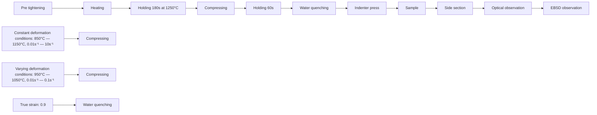

# Quantification of multi-stage recrystallization in low-alloy steel under varying deformation conditions using inhomogeneous-dislocation-density 3D cellular automaton


Jiawei Xu a , Lifeng Lu a , Xueze Jin a , He Wu b,\* , Qiwei He a , Daolei Yang a , Jingchao Yao a , Weiqiang Zhao a , Shaoshun Bian c , Bin Guo a , Debin Shan a,\* Wenchen Xu a,\*

a School of Materials Science and Engineering & National Key Laboratory for Precision Hot Processing of Metals, Harbin Institute of Technology, Harbin 150001, PR China

b School of Electromechanical Engineering, Guangdong University of Technology, Guangzhou 510006, China

c Lianyungang JARI Automation CO., LTD., Lianyungang 222006, China

# A R T I C L E I N F O

Keywords:

Low-alloy steel

Dynamic recrystallization

Varying deformation conditions

Constitutive model

3D cellular automaton

Inhomogeneous dislocation density

# A B S T R A C T

In the thermoforming process, alloys experience severe plastic deformation under varying tem peratures and strain rates, complicating dynamic recrystallization (DRX) behavior. Current DRX models developed under constant deformation conditions have limited accuracy in predicting complex stress and microstructure evolutions. This work develops a 3D cellular automaton (CA) model to precisely predict the DRX microstructure and flow stress of low-alloy steel under varying deformation conditions. The model incorporates dislocation density gradients and grainboundary sliding to quantify dislocation density evolutions in matrix and multi-stage recrystallization grains during hot compression. Parameter variables related to dislocation accumulation and annihilation are derived from a new phenomenological constitutive model, in which the variation of the time for 50 % DRX fraction and the residual softening induced by the first-stage recrystallization are considered. CA simulation results illustrate that the stress softening following peak stress after transiently increasing the Zener-Hollomon parameter $Z _ { P }$ is attributed to the refinement of matrix and first-stage DRX grains (DRXGs ) resulting from dislocation differences. DRXGsI cannot be fully refined due to delayed nucleation of second-stage DRX grains (DRXGsII), resulting in a greater final grain size. After decreasing $Z _ { P } ,$ even if the DRX fraction increases to levels under constant conditions, some matrix still exhibits higher dislocation density due to an inhomogeneous-dislocation-density distribution. This accelerates DRXGs growth to a size similar to that under the constant condition, producing a stress-decreasing rate that closely matches experimental findings. The proposed simulation framework not only contributes to visualizing multi-stage recrystallization but also aids in quantitative microstructure control during hot forging.

# List of symbols

Greek symbols

<table><tr><td> $\alpha$ </td><td>material constant applied for the calculation of  $Z$ </td></tr><tr><td> $\alpha_{dis}$ </td><td>dislocation interaction term</td></tr><tr><td> $\gamma$ </td><td>grain boundary energy between cell  $i$  and its neighbor,  $J/m^{2}$ </td></tr><tr><td> $\gamma_{m}$ </td><td>grain boundary energy of a high angle boundary,  $J/m^{2}$ </td></tr><tr><td> $\delta D_{ob}$ </td><td>product of boundary thickness and diffusion coefficient,  $m^{3}/s$ </td></tr><tr><td> $\Delta\varepsilon$ </td><td>strain increment</td></tr><tr><td> $\Delta\epsilon_{slip}^{r}(i,j,k)$ </td><td>strain increment of the cell with coordinates  $(i,j,k)$  in the grain  $r$  associated with dislocation slipping</td></tr><tr><td> $\Delta t$ </td><td>time step of CA models</td></tr><tr><td> $\Delta\rho^{r}(i,j,k)$ </td><td>net change of dislocation density of a cell with coordinates  $(i,j,k)$  in the grain  $r$  caused by WH and DRV</td></tr><tr><td> $\Delta\sigma_{0}$ </td><td>net change of the yield stress caused by deformation condition variations, MPa</td></tr><tr><td> $\varepsilon$ </td><td>effective strain</td></tr><tr><td> $\varepsilon_{c}$ </td><td>critical strain for the onset of DRX</td></tr><tr><td> $\dot{\varepsilon}$ </td><td>effective strain rate,  $s^{-1}$ </td></tr><tr><td> $\dot{\varepsilon}_{GBS}^{r}(i,j,k)$ </td><td>GBS strain rate of the cell with coordinates  $(i,j,k)$  in the grain  $r$ </td></tr><tr><td> $\zeta_{v}$ </td><td>coefficient corresponding to DRV</td></tr><tr><td> $\theta_{0}$ </td><td>initial WH rate</td></tr><tr><td> $\theta_{i}$ </td><td>grain boundary misorientation angle between the cell  $i$  and its neighbor</td></tr><tr><td> $\theta_{m}$ </td><td>grain boundary misorientation angle of a high angle boundary</td></tr><tr><td> $\mu$ </td><td>temperature-dependent shear modulus, MPa</td></tr><tr><td> $\mu_{0}$ </td><td>the shear modulus when the temperature is 300 K, MPa</td></tr><tr><td> $\rho_{av}$ </td><td>the average dislocation density of the RVE</td></tr><tr><td> $\rho_{c}$ </td><td>critical dislocation density</td></tr><tr><td> $\rho_{max}$ </td><td>maximum dislocation density of all cells at any given time</td></tr><tr><td> $\rho_{sat}$ </td><td>saturation value of the average dislocation density</td></tr><tr><td> $\rho^{r}(i,j,k)$ </td><td>dislocation density of the cell with coordinates  $(i,j,k)$  in the grain  $r$ </td></tr><tr><td> $\sigma$ </td><td>effective stress, MPa</td></tr><tr><td> $\sigma_{v}$ </td><td>flow stress corresponding to WH and DRV, MPa</td></tr><tr><td> $\sigma_{0}$ </td><td>yield stress, MPa</td></tr><tr><td> $\sigma_{s}$ </td><td>saturation stress, MPa</td></tr><tr><td> $\sigma_{ss}$ </td><td>steady-state stress, MPa</td></tr><tr><td> $\sigma_{c}$ </td><td>critical stress for the onset of DRX, MPa</td></tr><tr><td> $\sigma_{p}$ </td><td>peak stress, MPa</td></tr><tr><td> $\sigma_{a}$ </td><td>athermal stress, MPa</td></tr><tr><td> $\sigma_{\eta0}, \sigma_{\eta s}, \sigma_{\eta ss}$ </td><td>material constants of the equivalent thermal component applied for the calculation of characteristic stresses, MPa</td></tr><tr><td> $\tau$ </td><td>the dislocation line energy</td></tr><tr><td> $\nu$ </td><td>Poisson&#x27;s ratio</td></tr><tr><td> $\varphi_{d}$ </td><td>transient DRX fraction caused exclusively by DRX</td></tr><tr><td> $\phi_{d}$ </td><td>net change of the flow stress caused by DRX, MPa</td></tr><tr><td> $\psi$ </td><td>material constant applied for the calculation of  $t_{0.5}$ </td></tr><tr><td colspan="2">Arabic symbols</td></tr><tr><td> $A, A_{GB}$ </td><td>material constants</td></tr><tr><td> $A_{0}, A_{c}, A_{s}, A_{ss}$ </td><td>thermally activated coefficients applied for the calculation of characteristic stresses</td></tr><tr><td> $b$ </td><td>Burgers vector</td></tr><tr><td> $C$ </td><td>dislocation density coefficient</td></tr><tr><td> $C_{drx}$ </td><td>material constant applied for the calculation of nucleation rate</td></tr><tr><td> $d_{r}$ </td><td>diameter of the  $r$ -th grain in the RVE</td></tr><tr><td> $d_{ave}$ </td><td>average grain diameter in the RVE</td></tr><tr><td> $d_{2D}$ </td><td>average 2D grain size</td></tr><tr><td> $d_{3D}$ </td><td>average 3D grain size</td></tr><tr><td> $d\rho_{WH}$ </td><td>net change of the average dislocation density caused by WH</td></tr><tr><td> $d\rho_{WH}^{r}(i,j,k)$ </td><td>net change of dislocation density of a cell with coordinates  $(i,j,k)$  in the grain  $r$  caused by WH</td></tr><tr><td> $E$ </td><td>diffusion activation energy, J/mol</td></tr><tr><td> $f$ </td><td>driving force of grain growth</td></tr><tr><td> $H$ </td><td>stored energy related to dislocation density</td></tr><tr><td> $H_{GB}$ </td><td>diffusion coefficient applied for the calculation of GBS strain rate</td></tr></table>

$H_{0}$ material constant applied for the calculation of diffusion coefficient $k_{bd}^{r}$ number of cells belonging to the grain boundary of the grain r $k_{d}, k_{d0}$ material constants applied for the calculation of $\varphi_{d}$ $k_{s}$ softening coefficient in saturation stress $k_{1}$ average WH coefficient $k_{2}$ average DRV coefficient
K Boltzmann constant $K_{T}, K_{T0}$ material constants applied for the calculation of initial WH rate
l dislocation mean free path $L_{p}^{r}(i,j,k)$ distance from a cell with coordinates $(i, j, k)$ to the p-th grain boundary in the grain r $L_{0}$ size of a cell $m_{0}, m_{c}, m_{s}, m_{ss}$ thermally activated exponents applied for the calculation of characteristic stresses
M grain boundary mobility
n, $n_{Av0}, n_{c}, n_{GB}$ material constants $n_{Av}$ Avrami exponent $\dot{n}$ nucleation rate $N_{total}$ a total number of cells $p_{GB}$ material constant for the calculation of GBS strain rate $P_{nuc}$ nucleation probability
q material constant applied for the calculation of $t_{0.5}$ $Q_{0}, Q_{c}, Q_{p}, Q_{s}, Q_{ss}$ deformation activation energies at different points of the flow curve, J/mol $Q_{Av}, Q_{kd}, Q_{KT}$ material constants $Q_{drx}$ DRX activation energy, J/mol
R gas constant, J/(mol K) $s_{2D}$ standard deviation in 2D $s_{3D}$ standard deviation in 3D $S_{r}$ area of the r-th grain $t_{0.5}$ time for a 50 % DRX fraction, s
t the total time of thermoforming, s
T absolute temperature, K $T_{m}$ melting point, K $V_{n}$ volume in which the DRX nucleus can appear $V_{m}$ molar volume $V_{r}$ volume of the r-th grain
Z Zener-Hollomon parameter related to flow stress, $s^{-1}$ $Z_{0}, Z_{s}, Z_{ss}$ temperature-compensated strain rate $Z_{p}$ Zener-Hollomon parameter solved according to the peak stress point

# 1. Introduction

High-temperature plastic deformation plays an important role in the production of metal components. It not only lowers the deformation load of the material but also refines the microstructure to improve the mechanical properties (Xie et al., 2023; Yang et al., 2020). In thermomechanical processing (TMP), dynamic recrystallization (DRX), as the main mechanism of stress softening and microstructural refinement, attracts much attention from researchers (Popova et al., 2015; Yang et al., 2025; Zecevic et al., 2020).

Several constitutive models have been developed to simulate hot working with DRX. Mourad et al. (2017) developed a constitutive framework with mechanical threshold strength to capture the influence of the DRX behavior and thermal softening on the adiabatic shear band formation. Alvarez ´ Hostos et al. (2018) investigated the differences in prediction accuracy between differential and integrated constitutive descriptions when simulating the inhomogeneous deformation of a 20MnCr5 steel during hot compression using an element-free Galerkin method. To better capture the physical mechanisms behind hot deformation behavior, the evolutions of grain size and dislocation density were integrated as a few internal state variables (ISVs) into these constitutive models. Wang et al. (2016) incorporated DRX and solute-dislocation interaction effects into a constitutive model to investigate the effect of Joule heating on the electrically-assisted deformation behavior of the AZ31 magnesium alloy. To precisely characterize the promoting effects of the second phases and grain boundaries on continuous DRX (CDRX) in aluminum alloys, Tian et al. (2022) developed a physical-based constitutive model incorporating the subgrain dislocation density evolution. In addition, various mesoscopic simulations have been conducted to analyze the DRX evolution (An et al., 2023; Wang et al., 2022b; Zhang et al., 2020b; Zhao et al., 2016). These methods effectively capture the coupled effects of mechanical response and recrystallization evolution in homogenous or heterogeneous deformation processes by defining dislocation slip associated with grain-level deformation and mechanisms for DRX grain nucleation and growth on a representative volume element (RVE). Zhao et al. (2018) proposed a fast Fourier transform based crystal plasticity (CP-FFT) model integrated with phase field (PF) to investigate stress redistribution resulting from the initiation of DRX grains in polycrystalline copper. To accurately evaluate the effects of DRX on the forming limit diagrams of magnesium alloys at warm temperatures, Nagra et al. (2020)

established a CP-FFT model coupled with cellular automaton (CA). Based on the probabilistic CA technique, Liu et al. (2021) developed a CDRX model to predict the substructure evolution of aluminum alloys, including subgrain growth nucleation rate and subgrain boundary migration. Despite the advancements of both constitutive and mesoscopic models, most were developed based on tensile or compression tests under constant deformation conditions. This limitation makes it challenging to establish a quantitative relationship between flow behavior and microstructure under complex deformation histories.

During the manufacturing process (e.g., forging, flexible rolling and ring rolling), alloys always experience severe plastic deformation under varying temperatures and strain rates (He et al., 2018; Puchi-Cabrera et al., 2017). When forging with a screw press or hammer, the speed of the top die can continuously decrease due to energy consumption, resulting in a corresponding change in the strain rate (P´erez, 2018). Additionally, the high deformation temperatures of steel and superalloy forgings can lead to unavoidable heat exchange with the environment and dies, causing a progressive decrease in temperature during TMP. To prevent a rapid temperature decline, TMP often employs a high forming speed, leading to a rise in temperature (Wen et al., 2024). Moreover, in the flexible rolling inline work-roll replacement process, when worn rolls are withdrawn and replaced with new rolls, it is necessary to immediately adjust the rolling speed among the mills to ensure quality and reliability (Liu et al., 2022, 2023a). This adjustment can cause a transient change in the strain rate. Under the above complex deformation conditions, Graetz et al. (2014) and Wang et al. (2020a) found that both peak stress and steady stress were lower than those observed under constant temperatures and strain rates. Chen et al. (2019) revealed that the DRX behavior of an austenitic alloy was accelerated significantly with a larger fraction than that under constant deformations due to the strain rate jump. These findings suggest that the DRX characteristics after varying deformation conditions can differ significantly from those under constant conditions due to the influence of DRX softening before varying deformation conditions. Therefore, researching the influence of the varying deformation parameters on flow stress and microstructure evolution to perform a precise quantification of DRX behaviors induced by these processes is of significant interest for industrial production and scientific research.

The physical-based constitutive models are always used to describe the influence of varying deformation conditions (He et al., 2022; Wang et al., 2022a). However, these constitutive models contain many ISVs that must be calibrated using various forms of data. This can evidently lower the computational effectiveness and convergence of the finite element method (FEM) when simulating severe plastic deformation, thereby limiting the industrial application. Compared to the physical-based constitutive model, the phenomenological constitutive model is simpler and more practical, such as Hansel-Spittel (HS), Johnson and Cook (JC) and Arrhenius-type models. The HS model describes the flow stress as a function of strain, strain rate, and temperature using an exponential-based formulation (Harris et al., 2017). In this model, the flow stress is determined by multiplying a power function of the true strain with exponential functions of temperature and strain rate (Chadha et al., 2017). The JC model represents flow stress as the product of three terms: a power-law strain hardening term, a logarithmic strain rate sensitivity term, and a thermal softening term based on normalized temperature (Mishra et al., 2008). The Arrhenius-type model defines strain rate as a function of flow stress, incorporating an exponential temperature-dependent term related to activation energy (Yang and Li, 2015). However, these models only treat stress as a nonlinear correlation among temperature, strain rate and strain. As a result, the influence of previous recrystallization behaviors on subsequent flow stress is lost because the history of recrystallization evolution cannot be recorded, leading to low prediction accuracy, as mentioned by Puchi-Cabrera et al. (2017, 2018). To solve the problem, Puchi-Cabrera et al. (2018) expressed the laws of WH, DRV, and DRX in differential form to model the stress evolution of R260 steel under both constant and varying strain rates. Nevertheless, Liu et al. (2023b) found that the phenomenological constitutive model in this differential form above was not effective in predicting stress softening resulting from sudden decreases in strain rate or temperature. To address this limitation, Liu et al. (2023b) divided the constitutive model into two parts. The differential form was employed to capture the flow stress evolution after transiently increasing Zener-Hollomon parameters, while a conventional form of the constitutive model (Liu et al., 2023a) was utilized to predict the stress evolution after transiently decreasing Zener-Hollomon parameters. Although this approach is helpful for predicting flow stress under varying deformation conditions, it also highlights the significant difficulty in developing a unified constitutive model of phenomena.

Both physical-based and phenomenological constitutive models are unable to adequately reflect the visible evolution of the virtual microstructure of materials under varying deformation conditions. CA is a commonly used method for investigating the DRX behavior of materials during TMP owing to its high computational efficiency and flexibility (Ding and Guo, 2001; Shankar et al., 2024). To reduce the computational complexity in 3D CA, Łach et al. (2018) developed a frontal CA model by modifying the direction of information flow in cells. Chen et al. (2021a) discussed the application of the multilevel 3D CA model in predicting the discontinuous DRX evolution during the hot extrusion process of pure copper. The multilevel 3D CA model was further extended by incorporating misorientation changes of subgrains to simulate CDRX evolution and macroscopic mechanical response in the hot working of aluminum alloys (Chen et al., 2022). Nevertheless, these 3D CA models were calibrated under constant deformation conditions and lacked a unified description of flow stress and microstructure evolution under varying deformation conditions. Although Zhang et al. (2022) constructed a 2D CA model by optimizing nucleation probability to investigate the impacts of the transient changes in strain rate or temperature on DRX evolution, the differences in peak stress and steady-state stress under the varying and constant deformation conditions were not addressed. Moreover, in our previous study (Xu et al., 2023), if the initial mixed-grain microstructure was refined unevenly, the grain size in the side section differed significantly from that in the top section in a 3D perspective view. This highlights the limitations of 2D CA.

In most CA models, the assumption of the uniform dislocation density is commonly used to simulate microstructure evolution. However, Li et al. (2022) discovered that when the microstructure exhibited a mixed-grain state, the coarse grains displayed a preferential and continuous deformation characteristic, resulting in a higher dislocation density. Consequently, more recrystallization grains nucleated at the grain boundaries of coarse grains during the annealing process (Li et al., 2021). Previous studies have


<details>
<summary>flowchart</summary>


</details>


<details>
<summary>line</summary>

| True strain | Strain rate (s⁻¹) | Condition         |
| ----------- | ----------------- | ----------------- |
| 0.2         | 0.10              | ε̇₁ = 0.1 s⁻¹      |
| 0.2         | 0.05              | Transient decrease |
| 0.4         | 0.10              | ε̇₁ = 0.1 s⁻¹      |
| 0.4         | 0.05              | Transient increase |
| 0.6         | 0.10              | ε̇₁ = 0.1 s⁻¹      |
| 0.6         | 0.05              | Transient decrease |
| 0.8         | 0.10              | ε̇₁ = 0.1 s⁻¹      |
| 0.8         | 0.05              | Transient increase |
| 1.0         | 0.10              | ε̇₁ = 0.1 s⁻¹      |
| 1.0         | 0.05              | Transient decrease |
| 1.0         | 0.00              | ε̇₁ = 0.01 s⁻¹     |
| 1.0         | 0.00              | ε̇₂ = 0.01 s⁻¹     |
| 1.0         | 0.00              | ε̇₃ = 0.01 s⁻¹     |
| 1.0         | 0.00              | ε_total          |
</details>


<details>
<summary>line</summary>

| True strain | Temperature (°C) - Strain rate 0.01s⁻¹ T₁ = 1050°C | Temperature (°C) - Strain rate 0.01s⁻¹ T₂ = 950°C |
| ----------- | ---------------------------------------------------- | ---------------------------------------------------- |
| 0.2         | 1050                                                 | 950                                                  |
| 0.4         | 1050                                                 | 950                                                  |
| 0.6         | 1050                                                 | 950                                                  |
| 0.8         | 1050                                                 | 950                                                  |
| 1.0         | 1050                                                 | 950                                                  |
</details>

Fig. 1. Experimental procedure and conditions: (a) experimental procedure under constant and varying deformation conditions; (b) experimental conditions for transient strain rate variation at 0.2 or 0.4 strains; (c) experimental conditions for continuous temperature variation at strain ranges of 0.2–0.3 or 0.4–0.5.

frequently employed a combination of CP finite element method (CPFEM) and CA to analyze the impact of uneven dislocation density distribution on DRX evolution (Fan et al., 2022; Li et al., 2016; Sun et al., 2024). Nevertheless, the primary shortcomings of CPFEM-CA are the limitation in computational efficiency and difficulties in simulating industry-scale deformation processes (Liu et al., 2024). Therefore, it is necessary to develop a new CA model that can more efficiently describe the quantitative relationship between flow behavior and microstructure under complex deformation conditions.

This work developed a 3D CA model with inhomogeneous dislocation density to precisely predict the flow stress and microstructure evolution in low-alloy steel under varying deformation conditions. This model incorporated a gradient distribution of dislocation density and grain-boundary sliding (GBS) to quantify the dislocation density evolutions of the matrix and multi-stage recrystallization grains under varying temperatures and strain rates. To improve the accuracy of the CA model, the parameters governing the accumulation and annihilation of dislocation density were calibrated using a new phenomenological constitutive model. This constitutive model employed the varying time for 50 % DRX fraction $\left( t _ { 0 . 5 } \right)$ caused by transient stress and the softening effect (ks) resulting from the DRX evolution in the first stage (before varying conditions) to optimize the calculation of DRX fraction and characteristic stresses in the second stage (after varying conditions), which was validated using FEM analysis. To confirm the accuracy of the CA model, the predicted changes in flow stress and microstructure under both constant and varying conditions were compared with the corresponding experimental results in hot compression. The study analyzed the impacts of varying temperature and strain rate on flow stress, DRX fraction, and microstructural changes in low-alloy steel from the perspective of inhomogeneous dislocation density at different stages.

# 2. Experimental procedure

The hot compression test under constant and varying deformation conditions was conducted in the Gleeble 1500 thermomechanical simulator using the samples of the low-alloy steel with the following composition (wt.%): 0.398 C, 0.87 Mn, 0.31 Si, 0.024 S, 0.01 P, 0.05 Ni, 0.16Cr, 0.01 W, 0.1 V, 0.03 Mo, 0.002 Ti, 0.13 Cu and rem. Fe. This material is mainly applied for the production of automobile hub bearings, and it was provided in the form of hot rolled round bars. The cylindrical specimens (ϕ 6 mm × 9 mm) were cut along the rolling direction from the bars, and were polished to facilitate the welding of the thermocouple, as shown in Fig. 1a. Tantalum foil, 0.1 mm in thickness, was placed between the ends of the specimen and the indenter to prevent interfacial melting and to minimize friction. The prepared samples of the investigated alloy were heated up to $1 2 5 0 ^ { \circ } \mathrm { C }$ at a rate of $1 0 ^ { \circ } \mathrm { C } / s$ and held for 180 s to homogenize the austenite phase. The temperature was then cooled to the corresponding deformation temperature at a rate of $1 0 ^ { \circ } \mathrm { C } / s$ and kept for 60 s to reduce the temperature fluctuations. The mechanical tests under constant deformation conditions were carried out at temperatures in the range of $8 5 0 { - } 1 1 5 0 ~ ^ { \circ } \mathrm { C }$ and effective strain rates in the span of $0 . 0 1 { - } 1 0 \ s ^ { - 1 }$ . Fig. 1b shows the experimental schemes under varying strain rate conditions. The mechanical characterization at strain rate transient variation was divided into two stages during the single-pass hot compression process. In the first stage, the sample was deformed to the fixed strains (εI) of 0.2 or 0.4 at the constant temperature $( 9 5 0 ~ ^ { \circ } \mathrm { C } )$ and strain rate $( \dot { \varepsilon } _ { I } { = } 0 . 0 1 ~ s ^ { - 1 } ~ { \mathrm { o r } } ~ 0 . 1 ~ s ^ { - 1 } )$ . The strain rate was then transiently increased or decreased by the indenter, and the specimen was compressed to a final strain $( \varepsilon _ { t o t a l } )$ of 0.9 at a new strain rate $( \dot { \varepsilon } _ { I I } = 0 . 1 s ^ { - 1 }$ $\operatorname { o r } 0 . 0 1 s ^ { - 1 } )$ . Fig. 1c shows experimental schemes under varying temperature conditions at a strain rate of $0 . 0 1 s ^ { - 1 }$ . They were similar to the test under the varying strain rate condition, except that the temperature was continuously increased or decreased to the corresponding temperature $( T _ { I I } { = } 1 0 5 0 ~ ^ { \circ } \mathrm { C }$ or $9 5 0 ~ ^ { \circ } \mathrm { C } )$ in the strain ranges of 0.2–0.3 or 0.4–0.5. Each specimen was quenched in water immediately to freeze the high-temperature microstructure morphology after constant and varying deformations.

All the deformed specimens were precisely split along the axial directions to observe the microstructure at the center of the side section, as shown in Fig. 1. Before performing the optical observation using an Olympus-GX71 optical microscope, these sections were ground with SiC papers, and polished with 1 μm and $0 . 2 5 \mu \mathrm { m }$ diamond pastes, and then chemically etched using an abluent solution of saturation picric acid. The Image Pro Plus software was used to calculate the equivalent diameter of each prior austenite grain (PAG) based on the corresponding area in the metallography. Besides, the EBSD samples were electrolytically polished by a 10 % perchlorate alcohol solution at 30 V and 0.25A for 30 s after grinding and mechanical polishing. SU5000 scanning electron microscopy (SEM) equipped with an EBSD detector was employed to conduct the as-quenched martensitic microstructure characterization with a step size of 0.65 - 1.3 μm. Because the magnitude of the imparted strain may cause the failure of the standard etching method for the sizes of PAGs determination from as-quenched martensite, the ARPGE software was used to reconstruct PAGs from EBSD diagrams based on the Greninger-Troiano (GT) orientation relationship concerning the work of Cayron (2007) and Xu et al. (2023). The reconstructed austenite EBSD maps were then applied to distinguish recrystallized grains from deformed ones from the AZtecCrystal software according to GOS values (Kubota et al., 2016), and the threshold was defined at 3◦ according to the research of Aashranth et al. (2017), Kr¨amer et al. (2018) and Truong et al. (2023). In addition, the equivalent diameter of each PAG was calculated based on the reconstructed EBSD inverse pole figure (IPF) maps taking into account boundaries with misorientation angles higher than 10◦.

DEFORM 3D software was applied to simulate the high-temperature deformation behavior during the hot compression process. The constitutive model was embedded in the software using the Fortran language. By comparing the experimental results, the accuracy of the simulation was verified in constant and varying deformation conditions.

# 3. Dynamic recrystallization softening models

# 3.1. Constitutive models under varying deformation conditions

# 3.1.1. Effects of working hardening, dynamic recovery and dynamic recrystallization

Before the initiation of DRX, the flow stress is controlled by transient work hardening (WH) and dynamic recovery (DRV) in hot working operations. Zeng et al. (2019) proposed the differential form of the recovery stress $\left( \sigma _ { \nu } \right)$ based on the Taylor dislocation theory, which was written as:

$$
\frac {d \sigma_ {v}}{d \varepsilon} = \theta_ {0} \frac {\sigma_ {0}}{\sigma_ {v}} \frac {\sigma_ {s} ^ {2}}{\sigma_ {s} ^ {2} - \sigma_ {0} ^ {2}} - \theta_ {0} \sigma_ {0} \frac {\sigma_ {v}}{\sigma_ {s} ^ {2} - \sigma_ {0} ^ {2}} \tag {1}
$$

where the first term means WH and the second term means DRV; $\theta _ { 0 }$ represents the initial WH rate; $\sigma _ { 0 }$ represents yield stress (MPa); $\sigma _ { s }$ represents saturation stress (MPa). Here, $\theta _ { 0 }$ is expressed as (Puchi-Cabrera et al., 2013):

$$
\theta_ {0} = \mu / K _ {T} \tag {2}
$$

$$
\left\{ \begin{array}{c} \mu = \mu_ {0} \left(1 - 0. 9 1 \left(\frac {T - 3 0 0}{T _ {m}}\right)\right) \\ K _ {T} = K _ {T 0} \exp \left(- \frac {Q _ {K T}}{R T}\right) \end{array} \right. \tag {3}
$$

where $\mu$ is the temperature-dependent shear modulus (MPa); $K _ { T }$ is the temperature-dependent constant; $\mu _ { 0 } , K _ { T 0 }$ and $Q _ { K T }$ are material constants; $T _ { m }$ is the melting point (K); R is set to 8.314 J/(mol K).

$\sigma _ { 0 }$ and $\sigma _ { s s }$ represent yield stress and steady-state stress in the stress curve, which can be satisfactorily described using the Sellars− Tegart− Garofalo (STG) model as follows:

$$
\sigma_ {0} = \sigma_ {a} + \sigma_ {\eta 0} \sinh^ {- 1} \left[ \left(\frac {Z _ {0}}{A _ {0}}\right) ^ {m _ {0}} \right] \text { and } Z _ {0} = \dot {\varepsilon} \exp \left(\frac {Q _ {0}}{R T}\right) \tag {4}
$$

$$
\sigma_ {s s} = \sigma_ {\eta s s} \sinh^ {- 1} \left[ \left(\frac {Z _ {s s}}{A _ {s s}}\right) ^ {m _ {s s}} \right] \text { and } Z _ {s s} = \dot {\varepsilon} \exp \left(\frac {Q _ {s s}}{R T}\right) \tag {5}
$$

where $\sigma _ { a }$ is athermal stress (MPa); subscripts 0 and ss refer to the yield stress and steady-state stress; $\sigma _ { \eta 0 }$ and $\sigma _ { \eta s s }$ are material constants of the equivalent thermal component (MPa); $m _ { 0 }$ and $m _ { s s }$ are the thermally activated exponents; $A _ { 0 }$ and $A _ { s s }$ are the thermally activated coefficients; $Q _ { 0 }$ and $Q _ { s s }$ are deformation activation energies at different points of the flow curve. The physical meanings of $Z _ { 0 }$ and $Z _ { s s }$ represent the temperature-compensated strain rate (Zeng et al., 2019).

Similar to the aforementioned, the saturation stress in Eq. (1) was defined using the STG model as follows:

$$
\sigma_ {s} = \sigma_ {\eta s} \sinh^ {- 1} \left[ \left(\frac {Z _ {p}}{A _ {s}}\right) ^ {m _ {s}} \right] \text { and } Z _ {p} = \dot {\varepsilon} \exp \left(\frac {Q _ {p}}{R T}\right) \tag {6}
$$

As before, $\sigma _ { \eta s }$ is the material constant of the equivalent thermal component (MPa). $A _ { s }$ and $m _ { s }$ respectively represent the thermally activated coefficient and exponent. Here, $Z _ { P }$ represents the Zener-Hollomon parameter solved by the deformation activation energy $Q _ { p }$ at the peak stress point $\sigma _ { p }$ .

In the present work, a different expression for the critical stress $\sigma _ { c }$ proposed by Liu et al. (2017) was adapted as follows:

$$
\sigma_ {c} = k _ {c} \sigma_ {s} \tag {7}
$$

$$
k _ {c} = A _ {c} \left\{\ln \left[ \dot {\varepsilon} e x p \left(\frac {Q _ {c}}{R T}\right) \right] \right\} ^ {m _ {c}} \tag {8}
$$

where $k _ { c }$ is a proportion parameter smaller than 1; $A _ { c }$ and $m _ { c }$ are the thermally activated coefficient and exponent, respectively; $Q _ { c }$ represents the deformation activation energy at critical stress points of the flow curve.

It is usually known that the occurrence of DRX grains can produce a corresponding stress softening when the dislocation density exceeds a critical value. In constant deformation conditions, the critical strain $\varepsilon _ { c }$ was often implemented to predict the start of DRX (Wu et al., 2024). However, when varying deformation conditions, the complicated evolution of dislocation density makes $\varepsilon _ { c }$ no longer accurately reflect its critical value. Thus, Puchi-Cabrera et al. (2014) assumed that DRX could happen if the following condition was satisfied:

$$
\sigma_ {v} \geq \sigma_ {c} \tag {9}
$$

where $\sigma _ { c }$ is the critical stress.

The time for a 50 % DRX fraction was generally employed to calculate the DRX fraction evolution, which could be defined as

(Puchi-Cabrera et al., 2014, 2018):

$$
t _ {0. 5} = \psi Z _ {p} ^ {- q} \exp \left(\frac {Q _ {d r x}}{R T}\right) \tag {10}
$$

where ψ and q are material constants; $Q _ { d r x }$ is the DRX activation energy.

Nevertheless, in the varying deformation conditions, the complex deformation history can cause significant changes in the time for a 50 % DRX fraction. Once $t _ { 0 . 5 }$ is calculated using $Z _ { p }$ solved by the peak activation energy (Eq. (6)), it means that $t _ { 0 . 5 }$ in the second stage can only be influenced by the temperature and strain rate present at that stage, ignoring the influence of the deformation history in the first stage. In the hot deformation process, the evolution of dislocation density reflects the effect of the deformation history on the microstructure. And based on this, some researchers developed physical-based constitutive models to describe the DRX evolution under varying deformation conditions (He et al., 2022; Liu et al., 2023b; Wang et al., 2022a). Generally, the flow stress is considered to be proportional to the square root of the dislocation density according to the Taylor’s dislocation density theory (Zeng et al., 2019). Therefore, to account for the influence of dislocation density evolution caused by deformation history on the nucleation and growth of DRX grains, a definition of the Zener-Hollomon parameter Z related to the stress evolution was used as follows (Medina’ and Hernandez’, 1996):

$$
Z = A \left[ \sinh (\alpha \sigma) \right] ^ {n} \tag {11}
$$

where A, α and n are material constants. Eq. (11) was used instead of $Z _ { p }$ in Eq. (6) to calculate $t _ { 0 . 5 }$ in Eq. (10). In this way, t0.5 represents the time required for a 50 % DRX fraction under the control of the transient deformation activation energy, and it varies with the stress evolution. Consequently, the equation of DRX fraction $\varphi _ { d }$ evolution in the differential form of the Avrami equation could be adjusted as (Puchi-Cabrera et al., 2014, 2018):

$$
\left\{ \begin{array}{c} \frac {d \varphi_ {d}}{d \varepsilon} = \frac {\ln k _ {d}}{\dot {\varepsilon} t _ {0 . 5} ^ {n _ {A v}}} n _ {A v} (1 - \varphi_ {d}) \left[ \frac {t _ {0 . 5} ^ {n _ {A v}} \ln \left(\frac {1}{1 - \varphi_ {d}}\right)}{\ln k _ {d}} \right] ^ {1 - \frac {1}{n _ {A v}}} \\ t _ {0. 5} = \psi Z ^ {- q} \exp \left(\frac {Q _ {d r x}}{R T}\right) \\ k _ {d} = k _ {d 0} \exp \left(- \frac {Q _ {k d}}{R T}\right) \\ n _ {A v} = n _ {A v 0} \exp \left(- \frac {Q _ {A v}}{R T}\right) \end{array} \right. \tag {12}
$$

where $k _ { d 0 } , n _ { A \nu 0 } , Q _ { k d }$ and $Q _ { A \nu }$ represent material constant.

The net change of the flow stress caused by DRX was written as:

$$
\phi_ {d} = - \left(\sigma_ {s} - \sigma_ {s s}\right) \frac {d \varphi_ {d}}{d \varepsilon} \tag {13}
$$

Based on Eq. (1), (8), and (13), the flow stress undergoing WH, DRV and DRX was expressed by means of the differential form:


Fig. 2. Schematic diagram of flow stress evolution under varying deformation conditions.

$$
\left\{ \begin{array}{l} \frac {d \sigma_ {\nu}}{d \varepsilon} = \theta_ {0} \frac {\sigma_ {0}}{\sigma_ {\nu}} \frac {\sigma_ {s} ^ {2}}{\sigma_ {s} ^ {2} - \sigma_ {0} ^ {2}} - \theta_ {0} \sigma_ {0} \frac {\sigma_ {\nu}}{\sigma_ {s} ^ {2} - \sigma_ {0} ^ {2}} \\ \frac {d \sigma}{d \varepsilon} = \frac {d \sigma_ {\nu}}{d \varepsilon}, \text {if} \sigma_ {\nu} <   \sigma_ {c} \\ \frac {d \sigma}{d \varepsilon} = \frac {d \sigma_ {\nu}}{d \varepsilon} - (\sigma_ {s} - \sigma_ {s s}) \frac {d \varphi_ {d}}{d \varepsilon}, \text {if} \sigma_ {\nu} \geq \sigma_ {c} \end{array} \right. \tag {14}
$$

Liu et al. (2023b) noted that the resistance to initial slip of dislocations, directly related to the temperature and strain rate, was influenced by transient condition changes and should be reflected in constitutive models using the net change of the yield stress $\Delta \sigma _ { 0 }$ . Therefore, Eq. (14) was modified as follows:

$$
\left\{ \begin{array}{l} \frac {d \sigma_ {\nu}}{d \varepsilon} = \theta_ {0} \frac {\sigma_ {0}}{\sigma_ {\nu}} \frac {\sigma_ {s} ^ {2}}{\sigma_ {s} ^ {2} - \sigma_ {0} ^ {2}} - \theta_ {0} \sigma_ {0} \frac {\sigma_ {\nu}}{\sigma_ {s} ^ {2} - \sigma_ {0} ^ {2}} + \Delta \sigma_ {0} \\ \frac {d \sigma}{d \varepsilon} = \frac {d \sigma_ {\nu}}{d \varepsilon}, \text {if} \sigma_ {\nu} <   \sigma_ {c} \\ \frac {d \sigma}{d \varepsilon} = \frac {d \sigma_ {\nu}}{d \varepsilon} - (\sigma_ {s} - \sigma_ {s s}) \frac {d \varphi_ {d}}{d \varepsilon}, \text {if} \sigma_ {\nu} \geq \sigma_ {c} \end{array} \right. \tag {15}
$$

# 3.1.2. Optimization of constitutive models

Fig. 2 illustrates a schematic diagram of the flow stress evolution under varying deformation conditions. $Z _ { p }$ in Eq. (6) is employed to characterize the transient variation in deformation conditions. After transiently decreasing $Z _ { p }$ (increasing T or decreasing ˙ε) at $\varepsilon _ { I } ,$ the flow stress can rapidly drop to a level lower than that observed under the corresponding constant deformation conditions (Graetz et al., 2014). Besides, after transiently increasing $Z _ { p }$ (decreasing T or increasing $\dot { \varepsilon } )$ at $\varepsilon _ { I } ,$ , the flow stress can gradually grow to a peak lower than that of the constant deformation condition. As the deformation continues, the flow curve then exhibits a decline, and the steady-state stress is lower than that under the corresponding constant condition (Wang et al., 2020b). The deformation behavior above suggests that the saturation stress and steady-state stress in the second stage are severely influenced by the DRX state in the first stage. In the work conducted by Zeng et al. (2019), the saturation stress and steady-state stress in the second pass were significantly lower than those in the first pass due to the effects of the deformation and holding-time history of the first pass during the double-pass compression test. This phenomenon is quite similar to the behavior under varying deformation conditions, where the initial complex deformation history results in notable softening of the characteristic stress during the second stage of the hot deformation process. Accordingly, this paper used a similar method to establish the stress relationship between constant and varying deformation conditions as follows:

$$
\sigma_ {s} ^ {(v)} - \sigma_ {s s} ^ {(v)} = \sigma_ {s} - \sigma_ {s s} \tag {16}
$$

where the superscript v represents varying deformation conditions.

Due to the low stacking fault energy of the studied alloy, saturation stress was usually approximate to peak stress of DRX-type curve. As a result, the above experimental phenomenon also meant that the saturation stress in the second stage of the varying condition was significantly different from the corresponding result under the constant condition. Thus, a stress softening coefficient $k _ { s }$ $( k _ { s } \le 1 )$ was used to define the saturation stress under the varying condition as follows:

$$
\left\{ \begin{array}{c} \sigma_ {s} ^ {(v)} (\varepsilon + \Delta \varepsilon) = \sigma_ {s} ^ {(v)} (\varepsilon) + \Delta \sigma_ {s} ^ {(v)} \\ \Delta \sigma_ {s} ^ {(v)} = \left(\sigma_ {s} (\varepsilon + \Delta \varepsilon) - \sigma_ {s} (\varepsilon)\right) \times k _ {s} (\varepsilon + \Delta \varepsilon), \text {   if   } \sigma_ {s} (\varepsilon + \Delta \varepsilon) \geq \sigma_ {s} (\varepsilon) \\ \Delta \sigma_ {s} ^ {(v)} = \left(\sigma_ {s} (\varepsilon + \Delta \varepsilon) - \sigma_ {s} (\varepsilon)\right) \times (2 - k _ {s} (\varepsilon + \Delta \varepsilon)), \text {   if   } \sigma_ {s} (\varepsilon + \Delta \varepsilon) <   \sigma_ {s} (\varepsilon) \end{array} \right. \tag {17}
$$


<details>
<summary>surface_3d</summary>

| lnZ_p^(l(l)) (ε+Δε) | φ_d^(l) | k_s(ε+Δε) |
| --------------------- | ------- | --------- |
| 34                    | 1       | 0.8       |
| 32                    | 0.8     | 0.6       |
| 30                    | 0.6     | 0.4       |
| 28                    | 0.4     | 0.2       |
| 26                    | 0.2     | 0.4       |
| 24                    | 0.0     | 0.6       |
| 22                    | -0.2    | 0.8       |
| 20                    | -0.4    | 1         |
| 18                    | -0.6    | 0.8       |
| 16                    | -0.8    | 0.6       |
| 14                    | -1       | 0.4       |
| 12                    | -0.8    | 0.2       |
| 10                    | -0.6    | 0.4       |
| 8                     | -0.4    | 0.6       |
| 6                     | -0.2    | 0.8       |
| 4                     | 0       | 1         |
| 2                     | -0.2    | 0.8       |
| 0                     | -0.4    | 0.6       |
| -2                    | -0.6    | 0.4       |
| -4                    | -0.8    | 0.2       |
| -6                    | -1       | 0.4       |
| -8                    | -0.8    | 0.6       |
| -10                   | -0.6    | 0.8       |
| -12                   | -0.4    | 1         |
| -14                   | -0.2    | 0.8       |
| -16                   | 0       | 0.6       |
| -18                   | -0.2    | 0.4       |
| -20                   | -0.4    | 0.2       |
| -22                   | -0.6    | 0.4       |
| -24                   | -0.8    | 0.6       |
| -26                   | -1       | 0.8       |
| -28                   | -0.8    | 1         |
| -30                   | -0.6    | 0.8       |
| -32                   | -0.4    | 0.6       |
| -34                   | -0.2    | 0.4       |
| -36                   | 0       | 0.2       |
</details>

Fig. 3. The variation in the stress softening coefficient $k _ { s }$ with $Z _ { p }$ of the two stages and DRX fraction.

where $\sigma _ { s } ^ { ( \nu ) } ( \varepsilon )$ and $\sigma _ { s } ^ { ( \nu ) } ( \varepsilon + \Delta \varepsilon )$ represent the new saturation stress at ε and $\varepsilon + \Delta \varepsilon$ strains during varying deformation conditions; $\sigma _ { s } ( \varepsilon )$ and ${ \sigma } _ { s } ( \varepsilon + \Delta \varepsilon )$ are calculated using Eq. (6) based on different $Z _ { p }$ at ε and $\varepsilon + \Delta \varepsilon$ strains under varying conditions.

In the analysis of Liu et al. (2023b), as the variation in $Z _ { p }$ of the two stages increased, the difference between the flow law in the second stage and corresponding results in constant deformation conditions became more severe. Moreover, the DRX condition in the first stage can significantly affect the stress softening in the second stage. Thus, the stress softening coefficient $k _ { s }$ was defined as follows:

$$
k _ {s} (\varepsilon + \Delta \varepsilon) = \left(\frac {\ln Z _ {P} ^ {(I)} + \ln Z _ {P} ^ {(I I)} (\varepsilon + \Delta \varepsilon)}{2 M a x \left(\ln Z _ {P} ^ {(I)} , \ln Z _ {P} ^ {(I I)} (\varepsilon + \Delta \varepsilon)\right)}\right) ^ {\frac {n _ {c} \varphi_ {d} ^ {(I)} \sqrt {\left(\ln Z _ {P} ^ {(I I)} (\varepsilon + \Delta \varepsilon) - \ln Z _ {P} ^ {(I)}\right) ^ {2}}}{\ln Z _ {P} ^ {(I)}}} \tag {18}
$$

where $Z _ { P } ^ { ( I ) }$ represents the value of $Z _ { p }$ in the first stage (before varying deformation conditions); $Z _ { P } ^ { ( I I ) } ( \varepsilon + \Delta \varepsilon )$ represents the value of $Z _ { p }$ at ε + Δε strain in the second stage (under varying deformation conditions); $\frac { \sqrt { \left( l n Z _ { P } ^ { ( I I ) } ( \varepsilon + \Delta \varepsilon ) - l n Z _ { P } ^ { ( I ) } \right) ^ { 2 } } } { l n Z _ { p } ^ { ( I ) } }$ represents the relative variation in $Z _ { p }$ of the two stages; $M a x \big ( l n Z _ { P } ^ { ( I ) } , l n Z _ { P } ^ { ( I I ) } ( \varepsilon + \Delta \varepsilon ) \big )$ represents the maximum value in $l n Z _ { P } ^ { ( I ) }$ and $\begin{array} { r } { l n Z _ { P } ^ { ( I I ) } ( \varepsilon + \Delta \varepsilon ) ; \frac { l n Z _ { P } ^ { ( I ) } + l n Z _ { P } ^ { ( I I ) } ( \varepsilon + \Delta \varepsilon ) } { 2 M a x \left( l n Z _ { P } ^ { ( I ) } , \ l n Z _ { P } ^ { ( I I ) } ( \varepsilon + \Delta \varepsilon ) \right) } } \end{array}$ is the normalized value and used to ensure $k _ { s } \leq 1 ; \varphi _ { d } ^ { ( I ) }$ represents the DRX fraction in the first stage; $n _ { c }$ is material constant.

Fig. 3 shows the variation in the stress softening coefficient $k _ { s }$ with $Z _ { p }$ of the two stages and DRX fraction. It can be observed that $k _ { s }$ equals 1 under the non-recrystallization $( \varphi _ { d } ^ { ( I ) } = 0 )$ , indicating that the net change $\Delta \sigma _ { s } ^ { ( \nu ) }$ in the saturation stress remains unaffected by varying conditions. Moreover, under the constant deformation conditions $( l n Z _ { P } ^ { ( I ) } = l n Z _ { P } ^ { ( I I ) } ( \varepsilon + \Delta \varepsilon ) )$ , $k _ { s }$ is also equals to 1. Therefore, a convergence analysis was conducted as follows:


<details>
<summary>text_image</summary>

(a)
166.00 µm
100 µm
127.63 µm
100 µm
131.59 µm
100 µm
Z
Y
X
</details>


<details>
<summary>text_image</summary>

(b)
74.0 = 159.75 µm
d_m2 = 133.82 µm
d_v2 = 126.45 µm
100 µm
100 µm X direction
100 µm
</details>


<details>
<summary>bar</summary>

Metallograph
| Grain size (μm) | Frequency |
|---|---|
| 0-40 | 0.13 |
| 40-80 | 0.29 |
| 80-120 | 0.36 |
| 120-160 | 0.15 |
| 160-200 | 0.06 |
| 200-240 | 0.01 |
| 240-280 | 0.02 |
</details>


<details>
<summary>histogram</summary>

CA
| Grain size (μm) | Frequency |
|---|---|
| 0-40 | 0.06 |
| 40-80 | 0.26 |
| 80-120 | 0.40 |
| 120-160 | 0.18 |
| 160-200 | 0.10 |
| 200-240 | 0.01 |
| 240-280 | 0.01 |
AGS in 2D: 140.01 μm SD in 2D: 51.88 μm Min in 2D: 7.46 μm Max in 2D: 270.78 μm
</details>


<details>
<summary>histogram</summary>

CA
AGS in 3D: 143.78 µm SD in 3D: 58.25 µm Min in 3D: 6.45 µm Max in 3D: 283.29 µm
Grain size (µm) on X-axis, Frequency on Y-axis
The data shows a right-skewed distribution with the highest frequency occurring between 80–120 µm grain size, followed by a sharp decline beyond 160 µm.
</details>

Fig. 4. Experimental and simulated results of initial mixed-grain microstructure: (a) optical results; (b) simulated microstructure; (c) experimental and simulated grain size distributions.

$$
\left\{\begin{array}{c}\lim _ {\varphi_ {d} ^ {(I)} \rightarrow 0} k _ {s} \rightarrow 1\\\lim _ {\ln Z _ {p} ^ {(I I)} (\varepsilon + \Delta \varepsilon) \rightarrow \ln Z _ {p} ^ {(I)}} k _ {s} \rightarrow 1\end{array}\right. \tag {19}
$$

When varying deformation conditions, the softening effect on the saturation stress can be enhanced with the increasing difference between $Z _ { p }$ of the two stages and rising $\varphi _ { d } ^ { ( I ) }$ , which is exhibited as a decline in $k _ { s }$ in Fig. 3.

In the work of Zeng et al. (2019), the initial hardening rate $\theta _ { 0 }$ could be expressed as:

$$
\theta_ {0} = \frac {\zeta_ {v} \left(\sigma_ {s} ^ {2} - \sigma_ {0} ^ {2}\right)}{2 \sigma_ {0}} \tag {20}
$$

where $\zeta _ { \nu }$ represents a coefficient corresponding to DRV and is only affected by deformation parameters. In Eqs. (2) and (3), it can be found that $\theta _ { 0 }$ is mainly influenced by the deformation temperature. Therefore, the initial hardening rate ${ \theta _ { 0 } } ^ { ( \nu ) }$ under the varying conditions was considered to be equal to the corresponding results under the constant conditions, which was written as

$$
\theta_ {0} ^ {(v)} = \theta_ {0} \tag {21}
$$

After substituting Eq. (21) into Eq. (20), the yield stress $\sigma _ { 0 } ^ { ( \nu ) }$ under varying deformation conditions was expressed as follows:

$$
\left\{ \begin{array}{c} \sigma_ {0} ^ {(v)} = \frac {- 2 f _ {s} + \sqrt {4 f _ {s} ^ {2} + 4 \left(\sigma_ {s} ^ {(v)}\right) ^ {2}}}{2} \\ f _ {s} = \frac {\left(\sigma_ {s}\right) ^ {2} - \left(\sigma_ {0}\right) ^ {2}}{2 \sigma_ {0}} \end{array} \right. \tag {22}
$$

In this paper, the saturation stress $\sigma _ { s } ^ { ( \nu ) }$ under the varying condition was first calculated using Eq. (17) and (18). The critical stress $\sigma _ { c } ^ { ( \nu ) }$ , steady-state stress $\sigma _ { s s } ^ { ( \nu ) }$ and yield stress $\sigma _ { 0 } ^ { ( \nu ) }$ were then obtained based on Eqs. $( 7 ) ,$ (16) and (22). Finally, the above characteristic stresses were substituted into Eq. (15) to calculate the net change of the flow stress under the varying deformation condition. The calculation flowchart of constitutive models and boundary conditions in the FEM are shown in Appendix A1 of the supplementary material.

# 3.2. 3D cellular automaton models with inhomogeneous dislocation density

# 3.2.1. Assumptions

During the modelling process, the following assumptions have been made to simplify CA models:

(1) The initial dislocation density under all deformation conditions is uniform and set as $1 0 ^ { 1 1 } \mathrm { m } ^ { - 2 }$ based on the work of Galindo-Nava and Rivera-Díaz-del-Castillo (2012), Sun et al. (2021a) and Xu et al. (2024).
(2) During the deformation process, there is a gradient dislocation density in all grains of the RVE.
(3) The DRX nucleation only takes place on grain boundaries when the dislocation density reaches the critical value (Chen et al., 2021a).

Generally, CA models ignore the variability of the dislocation density distribution and apply the assumption of a uniform dislocation density distribution because they assume the initial microstructure to be ideally homogeneous (Zhang et al., 2020a). However, during the heating process, the real microstructure always displays a mixed-grain state owing to the existence of secondary phases or inclusions (Wu et al., 2018). Fig. 4a and 4c show the optical results and experimental grain size distribution. The representative areas on different sections were all 550 $\mu \mathrm { m } \times 5 5 0 \mu \mathrm { m }$ . The average grain sizes (AGSs) and standard deviations (SDs) in 2D and 3D could be calculated using area and volume weights as follows:

$$
\left\{ \begin{array}{l} d _ {2 D} = \frac {\sum A _ {r} d _ {r}}{\sum A _ {r}} \\ d _ {3 D} = \frac {\sum V _ {r} d _ {r}}{\sum V _ {r}} \end{array} \right. \tag {23}
$$

$$
\left\{ \begin{array}{l} s _ {2 D} = \sqrt {\frac {\sum A _ {r} (d _ {r} - d _ {2 D}) ^ {2}}{\sum A _ {r}}} \\ s _ {3 D} = \sqrt {\frac {\sum V _ {r} (d _ {r} - d _ {3 D}) ^ {2}}{\sum V _ {r}}} \end{array} \right. \tag {24}
$$

where $d _ { 2 D }$ and $d _ { 3 D }$ represent the AGSs in 2D and 3D; d represents the diameter of the r-th grain in the RVE; A represents the area of the r-th grain; $V _ { r }$ represents the volume of the r-th grain; s2D and $s _ { 3 D }$ represent the SDs in 2D and 3D

Experimental results show that the maximum grain size was 265.20 µm and the minimum size was 10.22 µm, resulting in a mixedgrain distribution in Fig. 4c. For the mixed grains of 316LN steel, Li et al. (2021, 2022) found that the coarse ones among them had the priority of plastic deformation, which resulted in intense strain and stress localizations. The higher dislocation density near the grain boundaries of coarse grains could meet the deformation energy requirement of the static recrystallization process at a limited deformation condition. Besides, our previous work (Xu et al., 2023) revealed that incorporating a relationship between the nucleation probability and grain size in 3D CA could more accurately obtain the DRX evolution of the mixed-grain microstructure. These findings indicate that it is inappropriate to assume a uniform distribution of dislocation density when simulating the DRX process of a mixed-grain microstructure. The CPFEM combined with CA was always used to predict the influence of the microstructural inhomogeneity on DRX evolution (Li et al., 2016; Sun et al., 2021b). Nevertheless, the primary drawbacks of CA-CPFEM are the limi tations in mesh distortion and computational efficiency during the simulation processes of industry-scale deformation. Therefore, a rule for the inhomogeneous distribution of dislocation density that accounts for dislocation gradient and GBS is first introduced into a 3D CA model to effectively simulate the DRX evolution of mixed-grain microstructure under varying deformation conditions.

# 3.2.2. Evolution of inhomogeneous dislocation density

During the hot deformation process, the evolution of flow stress was mainly affected by the accumulations and annihilations of the dislocation density. Therefore, the flow stress model could be expressed as (Chen et al., 2017)

$$
\left\{ \begin{array}{l} \sigma = \sigma_ {0} ^ {(v)} + \alpha_ {\text {dis}} \mu b \sqrt {\rho_ {a v}} \\ \rho_ {a v} = \frac {1}{N _ {\text {total}}} \sum \rho^ {r} (i, j, k) \end{array} \right. \tag {25}
$$

where $\boldsymbol { \sigma _ { 0 } } ^ { ( \nu ) }$ is calibrated based on modified constitutive models in Section 3.1.2; $\alpha _ { d i s }$ represents a dislocation interaction term which is equal to 0.5 for most metals (Chen et al., 2021b); b is Burgers vector; $\rho _ { a \nu }$ is the average dislocation density of the RVE; $N _ { t o t a l }$ is a total number of cells; $\rho ^ { r } ( i , j , k )$ represents the dislocation density of the cell with coordinates $( i , j , k )$ in the grain r.

In the present study, the Kocks-Mecking (KM) model was employed to describe the evolution of the average dislocation density (Balaji et al., 2022; Wang et al., 2022b):

$$
\left\{ \begin{array}{c} \frac {d \rho_ {a v}}{d \varepsilon} = d \rho_ {W H} - k _ {2} \rho_ {a v} \\ d \rho_ {W H} = k _ {1} \sqrt {\rho_ {a v}} \\ k _ {2} = \frac {2 \theta_ {0}}{\sigma_ {s} ^ {(v)}} \\ k _ {1} = \frac {\sigma_ {s} ^ {(v)} k _ {2}}{0 . 5 \mu b} \end{array} \right. \tag {26}
$$

where $d \rho _ { w H }$ represents the net change of the average dislocation density caused by WH; $k _ { 1 }$ and $k _ { 2 }$ represent the average WH coefficient and DRV coefficient; $\sigma _ { s } ^ { ( \nu ) }$ is calibrated based on modified constitutive models in Section 3.1.2.

The saturation value of the average dislocation density could then be written as

$$
\rho_ {s a t} = \left(\frac {k _ {1}}{k _ {2}}\right) ^ {2} \tag {27}
$$

In the previous literature (Feng et al., 2024; Li et al., 2016; Sun et al., 2024), both experimental and CPFEM results showed an uneven distribution of the dislocation density in the microstructure. Specifically, the dislocation density near the grain boundary was found to be higher, while the density inside the grain was lower. Consequently, based on the research conducted by Guan and Yu (2017), it was hypothesized that the dislocation density of any cell decreased with its increasing distance from the grain boundary. The effect of WH on any cell’s dislocation density in the RVE could be calculated as follows:

$$
d \rho_ {W H} ^ {r} (i, j, k) = C d \rho_ {W H} \left(\frac {d _ {r}}{d _ {\text {ave}}}\right) \left[ \frac {1}{k _ {b d} ^ {r}} \sum_ {p = 1} ^ {k _ {b d} ^ {r}} \left(\frac {L _ {p} ^ {r} (i , j , k)}{L _ {0}}\right) ^ {- 2} + r a n d (i, j, k) \right] \tag {28}
$$

where C is used to ensure that the average accumulation of all dislocation density caused by WH is $d \rho _ { w H }$ in each strain increment; $d _ { a \nu e }$ represents the AGS calculated by Eq. (24); $\frac { d _ { r } } { d _ { o v e } }$ represents the effect of intense strain localizations brought by different grain sizes in mixed grains on the dislocation density; $k _ { b d } ^ { r }$ is the number of cells belonging to the grain boundary of the grain r; $L _ { p } ^ { r } ( i , j , k )$ is the distance from a cell with coordinates $( i , j ,$ k) to the p-th grain boundary in the grain $r ; L _ { 0 }$ is the size of a cell; $\begin{array} { r } { \frac { 1 } { k _ { b d } ^ { r } } \sum _ { p = 1 } ^ { k _ { b d } ^ { r } } \left( \frac { L _ { p } ^ { r } ( i , j , k ) } { L _ { 0 } } \right) ^ { - 2 } } \end{array}$ represents the distribution of dislocation density in the grain r and decreases with the increasing distance from the grain boundary; rand(i, j, k) represents the influences of deformed microstructure, including microbands (Ren et al., 2025) and cellular structures (Cai et al., 2025), on the distribution of dislocation density. To simplify the model calculation, it is defined as a random variable between 0 and 1, in reference to the definition of non-uniform stored energy in the Monte Carlo model proposed by Wang et al. (2009).

In this paper, the effect of the grain size distribution on DRV was ignored, and the average DRV coefficient $k _ { 2 }$ was employed for the calculation of cells’ dislocation density drop. Thus, the evolution of any cell’s dislocation density resulting from WH and DRV was written as

$$
d \rho^ {r} (i, j, k) = d \rho_ {W H} ^ {r} (i, j, k) - k _ {2} \rho^ {r} (i, j, k) \tag {29}
$$

Regarding the impact of the grain size on the dislocation density, Lin et al. (2005) proposed that the dislocation density of small grains increased more slowly in the hot deformation due to less grain rotation and GBS. Xu et al. (2020) revealed that with the increase of temperature from ${ } ^ { 2 5 } \ ^ { \circ } \mathrm { C }$ to $8 0 0 ~ ^ { \circ } \mathrm { C } ,$ the deformation mechanism in coarse-grained austenitic stainless steel varied from transformation-induced plasticity (TRIP) at $2 5 \ { } ^ { \circ } \mathrm { C } ,$ , twinning-induced plasticity (TWIP) at $2 0 0 ^ { \circ } \mathrm { C } ,$ dislocation slip at $6 0 0 ^ { \circ } \mathrm { C }$ to DRX + GBS at $8 0 0 ^ { \circ } \mathrm { C } .$ Ma et al. (2023) found that although no significant recrystallization grains occurred in the microstructure at $1 1 0 0 ^ { \circ } \mathrm { C }$ and $0 . 0 1 { - } 0 . 1 \ s ^ { - 1 }$ , GBS still led to significant stress softening during the hot compression process of Ti–22Al–25Nb alloy. Koike et al. (2003) measured the GBS strain of AZ31 magnesium alloys at different deformation temperatures. In their work, the GBS strain rate was expressed as

$$
\left\{ \begin{array}{c} \dot {\varepsilon} _ {G B S} ^ {r} (i, j, k) = \frac {A _ {G B} H _ {G B} \mu b}{K T} \left(\frac {b}{d ^ {r}}\right) ^ {p _ {G B}} \left(\frac {\sigma_ {0} ^ {(v)}}{\mu}\right) ^ {n _ {G B}} \\ H _ {G B} = H _ {0} \exp \left(- \frac {E}{R T}\right) \end{array} \right. \tag {30}
$$

where $\dot { \varepsilon } _ { G B S } ^ { r } ( i , j , k )$ is the GBS strain rate of the cell with coordinates $( i , j , k )$ in the grain r; $H _ { G B }$ is the diffusion coefficient; K is the Boltzmann constant; AGB, pGB, nGB, $H _ { 0 }$ are material constants; E is diffusion activation energy (J/mol).

Therefore, the strain increment associated with the dislocation slipping was written as

$$
\Delta \varepsilon_ {s l i p} ^ {r} (i, j, k) = \Delta \varepsilon - \dot {\varepsilon} _ {G B S} ^ {r} (i, j, k) \frac {\Delta \varepsilon}{\dot {\varepsilon}} \tag {31}
$$

where $\Delta \varepsilon _ { s l i p } ^ { r } ( i , j , k )$ is the strain increment of the cell with coordinates (i, j, k) in the grain r associated with dislocation slipping.

In each strain increment, the net change in any cell’s dislocation density resulting from WH and DRV could finally be described as

$$
\Delta \rho^ {r} (i, j, k) = d \rho^ {r} (i, j, k) \Delta \varepsilon_ {\text { slip }} ^ {r} (i, j, k) \tag {32}
$$

where $\Delta \rho ^ { r } ( i , j , k )$ is the net change of dislocation density of a cell with coordinates $( i , j , k )$ in the grain r caused by WH and DRV.

When the initiation of DRX grains, these grains could be greatly affected by GBS due to their smaller sizes. Before reaching full growth, their accumulations of dislocation density were lower, leading to a significant stress softening.

# 3.2.3. Inhomogeneous DRX nucleation and grain growth

As mentioned in Assumption 3, the DRX nucleation cannot happen at the grain boundary until the dislocation density reaches a threshold value $( \rho _ { c } )$ during the hot deformation process. After substituting Eq. (25) into Eq. $( 7 ) ,$ , the critical dislocation density $( \rho _ { c } )$ could be described as

$$
\rho_ {c} = \left(\frac {(k _ {c} - 1) \sigma_ {0} ^ {(\nu)} + k _ {c} \alpha_ {d i s} \mu b \sqrt {\rho_ {s a t}}}{\alpha_ {d i s} \mu b}\right) ^ {2} \tag {33}
$$

In CA models, nucleation rate determined whether DRX grains could nucleate if dislocation density reached a critical value, which was performed by (Li et al., 2016):

$$
\dot {n} = C _ {d r x} \dot {\varepsilon} \exp \left(- \frac {Q _ {d r x}}{R T}\right) \tag {34}
$$

where $C _ { d r x }$ represents the material constant.

Jiang et al. (2016) found that a higher dislocation density could result in an increase in the local orientation gradient, hence promoting the initiation of DRX nucleation. Nevertheless, Eq. (34) was suggested based on the uniform-dislocation-density assumption, and it failed to explain the variation in nucleation rate caused by inhomogeneous dislocation density. Thus, the stored energy related to dislocation density was used to define the nucleation rate in reference to the work of Sitko and Madej (2021), which could be expressed as

$$
\left\{ \begin{array}{c} \dot {n} = C _ {d r x} H V _ {n} \exp \left(- \frac {Q _ {d r x}}{R T}\right), \text {   if   } \rho^ {r} (i, j, k) \geq \rho_ {c} \\ \dot {n} = 0, \text {   if   } \rho^ {r} (i, j, k) <   \rho_ {c} \end{array} \right. \tag {35}
$$

where $V _ { n }$ is the volume fraction in which the DRX nucleus can appear; H represents the stored energy related to dislocation density and is written as (Zheng et al., 2009)

Inhomogeneous-dislocation-density 3D CA framework


<details>
<summary>flowchart</summary>

```mermaid
graph TD
    A["Inputs"] --> B["Load condition"]
    B --> C["First stage"]
    B --> D["Second stage"]
    C --> E["Step n"]
    D --> E
    E --> F{ε ≥ ε₁}
    F -->|Y| G["Parameters by constitutive calibration"]
    F -->|N| H["Average dislocation density evolution based on Eq.(26)"]
    H --> I["Inhomogeneous dislocation density accumulation based on Eq.(28)"]
    I --> J["Strain increment associated with dislocation slipping based on Eq. (30) and (31)"]
    J --> K["Dislocation density evolution based on Eq.(29) and Eq.(32)"]
    K --> L["Output simulation results"]

    M["Initial microstructure"] --> N["Grain orientation"]
    M --> O["Grain size"]
    M --> P["Dislocation density"]
    M --> Q["End strain"]

    R["Model parameters"] --> S["Initial WH rate in Eq.(2) and (3)"]
    R --> T["Saturation stress in Eq.(6)"]
    R --> U["DRX activation energy in Eq.(12)"]

    V["Parameters by constitutive calibration"] --> W["θ₀ = μ/K_T"]
    V --> X["σₛ = σηₛsinh⁻¹[(Zₚ/Aₛ)mₛ"]]
    V --> Y["σₛ = σηₛsinh⁻¹[(Zₚ/Aₛ)mₛ"]]

    Z["Inhomogeneous dislocation density evolution"] --> AA["Stress softening coefficient kₓ"]
    Z --> AB["Varying saturation stress σₛ⁽ᵛ⁾"]

    AC["Next step n=n+1"] --> AD["Step n"]
    AD --> AE["Parameters by constitutive calibration"]
    AE --> AF["Stress softening coefficient kₓ"]
    AE --> AG["Varying saturation stress σₛ⁽ᵛ⁾"]

    AH["ρ ≥ ρc"] --> AI["Inhomogeneous nucleation happens based on Eq.(35) and (36)"]
    AH --> AJ["Update dislocation density and grain orientation of nucleation sites"]
    AH --> AK["Calculate the migrations of grain boundaries based on Eq.(37)-(41)"]
    AH --> AL["Update all state variables of cells"]
    AH --> AM["Last step"]
    AM --> AN["Output simulation results"]
```
</details>

Fig. 5. Flowchart of a 3D CA model based on inhomogeneous dislocation density.

$$
H = \tau \rho^ {r} (i, j, k) V _ {m} \tag {36}
$$

where $\begin{array} { r } { \tau = \frac { \mu b ^ { 2 } } { 2 } } \end{array}$ is the dislocation line energy; $V _ { m }$ represents molar volume.

In Eq. (35) and Eq. (36), a higher dislocation density produced more stored energy, which greatly improved the nucleation rate at the grain boundary and finally led to the inhomogeneous nucleation.

The growth of DRX grains was influenced by the migration velocity of grain boundaries, and could be expressed as (Wu et al., 2020)

$$
v = M f \tag {37}
$$

where f represents the driving force of spherical recrystallized grains, and is described as (Liu et al., 2015)

$$
f = \tau \Delta \rho - \frac {4 \gamma}{d _ {r}} \tag {38}
$$

Here, $\Delta \rho$ represents the difference in dislocation density between growing grains and their neighboring grains. The grain boundary energy γ is calculated by (Chen et al., 2021a)

$$
\gamma = \left\{ \begin{array}{c} \gamma_ {m}, \text {   if   } \theta_ {i} \geq 1 0 ^ {\circ} \\ \gamma_ {m} \frac {\theta_ {i}}{\theta_ {m}} \left[ 1 - \ln \left(\frac {\theta_ {i}}{\theta_ {m}}\right) \right], \text {   if   } \theta_ {i} <   1 0 ^ {\circ} \end{array} \right. \tag {39}
$$

where $\theta _ { m }$ represents the grain boundary misorientation angle of a high angle boundary with a critical value set at $^ { 1 0 ^ { \circ } }$ (Popova et al., $2 0 1 5 ) ; \theta _ { i }$ is the grain boundary misorientation angle between the cell i and its neighbor, which is calculated by the difference between its orientation and that of its neighboring grains in reference to the work of Wang et al. (2024); $\gamma _ { m }$ represents the grain boundary energy of a high angle boundary:

$$
\gamma_ {m} = \frac {\mu b \theta_ {m}}{4 \pi (1 - v)} \tag {40}
$$

In Eq. (37), M represents the mobility of grain boundary, and is calculated by

$$
M = \frac {\delta D _ {o b} b}{K T} \exp \left(- \frac {E}{R T}\right) \tag {41}
$$

where $\delta D _ { o b }$ is the product of boundary thickness and diffusion coefficient $( \mathrm { m } ^ { 3 } / \mathrm { s } )$ .

The time step based on the average dislocation density was required to be correlated with real-world time, and could be expressed by the following equation proposed by OuYang et al. (2015):

$$
\Delta t = \frac {L _ {0}}{\rho_ {\text { sat }} \tau M} \tag {42}
$$

However, due to the inhomogeneous dislocation density, the local dislocation density might be higher than saturation value $\rho _ { s a t }$ of the average dislocation density. Eq. (42) represents the minimal time required for the migration distance of the DRX grain boundary to be equal to the size of a cell. Therefore, the above time step was modified as

Table 1 Material parameters in the constitutive model.

<table><tr><td>Symbols</td><td>Value</td><td>Equation number</td><td>Reference</td></tr><tr><td> $\mu_0$  (MPa)</td><td> $7.89 \times 10^{10}$ </td><td>Eq. (3)</td><td>Zhang et al. (2016b)</td></tr><tr><td> $T_m$  (K)</td><td>1800</td><td>Eq. (3)</td><td>Xu et al. (2023)</td></tr><tr><td> $K_{T0}$ </td><td>680.912</td><td>Eq. (3)</td><td>Appendix A2</td></tr><tr><td> $Q_{KT}$ </td><td>23,134.8</td><td>Eq. (3)</td><td>Appendix A2</td></tr><tr><td> $\psi$ </td><td> $9.92 \times 10^{-3}$ </td><td>Eq. (10)</td><td>Appendix A2</td></tr><tr><td>q</td><td>0.867</td><td>Eq. (10)</td><td>Appendix A2</td></tr><tr><td> $Q_{drx}$  (J/mol)</td><td>326,922</td><td>Eq. (10)</td><td>Appendix A2</td></tr><tr><td> $Q_p$  (J/mol)</td><td>314,300</td><td>Eq. (6)</td><td>Appendix A2</td></tr><tr><td>A</td><td> $7.3214 \times 10^{11}$ </td><td>Eq. (11)</td><td>Appendix A2</td></tr><tr><td>α</td><td>0.0089</td><td>Eq. (11)</td><td>Appendix A2</td></tr><tr><td>n</td><td>6.3742</td><td>Eq. (11)</td><td>Appendix A2</td></tr><tr><td> $k_{d0}$ </td><td>4.442</td><td>Eq. (12)</td><td>Appendix A2</td></tr><tr><td> $Q_{kd}$ </td><td>728.468</td><td>Eq. (12)</td><td>Appendix A2</td></tr><tr><td> $n_{Av0}$ </td><td>18.097</td><td>Eq. (12)</td><td>Appendix A2</td></tr><tr><td> $Q_{Av}$ </td><td>21,895.1</td><td>Eq. (12)</td><td>Appendix A2</td></tr><tr><td> $n_c$ </td><td>55.563</td><td>Eq. (18)</td><td>Appendix A2</td></tr></table>


<details>
<summary>line</summary>

| Time (s) | Experimental (0.01 s⁻¹) | Simulated (0.01 s⁻¹) | Experimental (0.1 s⁻¹) | Simulated (0.1 s⁻¹) | Experimental (1 s⁻¹) | Simulated (1 s⁻¹) | Experimental (10 s⁻¹) | Simulated (10 s⁻¹) |
| -------- | ------------------------ | --------------------- | ----------------------- | ------------------- | --------------------- | ----------------- | ---------------------- | ------------------ |
| 0.001    | 0.0                      | 0.0                   | 0.0                     | 0.0                 | 0.0                   | 0.0               | 0.0                    | 0.0                |
| 0.01     | 0.0                      | 0.0                   | 0.0                     | 0.0                 | 0.0                   | 0.0               | 0.0                    | 0.0                |
| 0.1      | 0.2                      | 0.2                   | 0.2                     | 0.2                 | 0.2                   | 0.2               | 0.2                    | 0.2                |
| 1        | 0.4                      | 0.4                   | 0.4                     | 0.4                 | 0.4                   | 0.4               | 0.4                    | 0.4                |
| 10       | 0.6                      | 0.6                   | 0.6                     | 0.6                 | 0.6                   | 0.6               | 0.6                    | 0.6                |
| 100      | 0.8                      | 0.8                   | 0.8                     | 0.8                 | 0.8                   | 0.8               | 0.8                    | 0.8                |
</details>


<details>
<summary>line</summary>

| Time (s) | Experimental (0.01s⁻¹) | Simulated (0.01s⁻¹) | Experimental (0.1s⁻¹) | Simulated (0.1s⁻¹) | Experimental (1s⁻¹) | Simulated (1s⁻¹) | Experimental (10s⁻¹) | Simulated (10s⁻¹) |
| -------- | ---------------------- | ------------------- | --------------------- | ------------------ | ------------------- | ---------------- | -------------------- | ----------------- |
| 0.001    | 0.0                    | 0.0                 | 0.0                   | 0.0                | 0.0                 | 0.0              | 0.0                  | 0.0               |
| 0.01     | 0.0                    | 0.0                 | 0.0                   | 0.0                | 0.0                 | 0.0              | 0.0                  | 0.0               |
| 0.1      | 0.0                    | 0.8                 | 0.0                   | 0.8                | 0.0                 | 0.8              | 0.7                  | 0.7               |
| 1        | 0.0                    | 1.0                 | 0.6                   | 1.0                | 0.6                 | 1.0              | 0.8                  | 0.8               |
| 10       | 1.0                    | 1.0                 | 1.0                   | 1.0                | 1.0                 | 1.0              | 1.0                  | 1.0               |
| 100      | 1.0                    | 1.0                 | 1.0                   | 1.0                | 1.0                 | 1.0              | 1.0                  | 1.0               |
</details>


<details>
<summary>line</summary>

| Time (s) | 0.01s⁻¹ (Experimental) | 0.01s⁻¹ (Simulated) | 0.1s⁻¹ (Experimental) | 0.1s⁻¹ (Simulated) | 1s⁻¹ (Experimental) | 1s⁻¹ (Simulated) | 10s⁻¹ (Experimental) | 10s⁻¹ (Simulated) |
| -------- | ------------------------ | --------------------- | ---------------------- | ------------------- | ------------------- | ----------------- | --------------------- | ------------------ |
| 0.001    | 0.0                      | 0.0                   | 0.0                    | 0.0                 | 0.0                 | 0.0               | 0.0                   | 0.0                |
| 0.01     | 0.0                      | 0.0                   | 0.0                    | 0.0                 | 0.0                 | 0.0               | 0.0                   | 0.0                |
| 0.1      | 0.0                      | 0.9                   | 0.0                    | 0.9                 | 0.0                 | 0.9               | 0.9                   | 0.9                |
| 1        | 0.0                      | 1.0                   | 0.4                    | 1.0                 | 0.4                 | 1.0               | 1.0                   | 1.0                |
| 10       | 0.4                      | 1.0                   | 0.8                    | 1.0                 | 0.8                 | 1.0               | 1.0                   | 1.0                |
| 100      | 1.0                      | 1.0                   | 1.0                    | 1.0                 | 1.0                 | 1.0               | 1.0                   | 1.0                |
</details>


<details>
<summary>line</summary>

| Time (s) | Experimental (0.01s⁻¹) | Simulated (0.01s⁻¹) | Experimental (1s⁻¹) | Simulated (1s⁻¹) | Experimental (10s⁻¹) | Simulated (10s⁻¹) |
| -------- | ------------------------ | --------------------- | --------------------- | ----------------- | ---------------------- | ------------------ |
| 0.001    | 0.0                      | 0.0                   | 0.0                   | 0.0               | 0.0                    | 0.0                |
| 0.01     | 0.0                      | 0.0                   | 0.0                   | 0.0               | 0.0                    | 0.0                |
| 0.1      | 0.0                      | 0.0                   | 0.0                   | 0.0               | 0.0                    | 0.0                |
| 1        | 0.0                      | 0.0                   | 0.0                   | 0.0               | 0.0                    | 0.0                |
| 10       | 0.4                      | 0.8                   | 0.6                   | 0.9               | 0.7                    | 0.9                |
| 100      | 1.0                      | 1.0                   | 1.0                   | 1.0               | 1.0                    | 1.0                |
</details>

Fig. 6. Experimental and simulated variations of DRX fractions with time at different deformation temperatures: (a) 850 ◦C; (b) 950 ◦C; (c) 1050 ◦C; (d) 1150 ◦C.


<details>
<summary>line</summary>

| True strain | Experimental (850°C_0.01s⁻¹) | Simulated (850°C_0.01s⁻¹) | Experimental (850°C_1s⁻¹) | Simulated (850°C_1s⁻¹) | Experimental (850°C_10s⁻¹) | Simulated (850°C_10s⁻¹) |
| ----------- | ----------------------------- | -------------------------- | -------------------------- | ---------------------- | ---------------------------- | ------------------------ |
| 0.0         | 70                            | 70                         | 105                        | 105                    | 140                          | 140                      |
| 0.1         | 105                           | 105                        | 140                        | 140                    | 210                          | 210                      |
| 0.2         | 130                           | 130                        | 165                        | 165                    | 225                          | 225                      |
| 0.3         | 145                           | 145                        | 180                        | 180                    | 230                          | 230                      |
| 0.4         | 155                           | 155                        | 190                        | 190                    | 235                          | 235                      |
| 0.5         | 160                           | 160                        | 195                        | 195                    | 240                          | 240                      |
| 0.6         | 165                           | 165                        | 200                        | 200                    | 245                          | 245                      |
| 0.7         | 170                           | 170                        | 205                        | 205                    | 245                          | 245                      |
| 0.8         | 175                           | 175                        | 210                        | 210                    | 245                          | 245                      |
</details>


<details>
<summary>line</summary>

| True strain | Experimental (950°C_0.01s⁻¹) | Simulated (950°C_0.01s⁻¹) | Experimental (950°C_1s⁻¹) | Simulated (950°C_1s⁻¹) | Experimental (950°C_10s⁻¹) | Simulated (950°C_10s⁻¹) |
| ----------- | ----------------------------- | -------------------------- | ------------------------- | ---------------------- | --------------------------- | ------------------------ |
| 0.0         | 60                            | 60                         | 60                        | 60                     | 60                          | 60                       |
| 0.1         | 80                            | 120                        | 90                        | 120                    | 160                         | 180                      |
| 0.2         | 85                            | 130                        | 100                       | 130                    | 170                         | 185                      |
| 0.3         | 85                            | 135                        | 105                       | 135                    | 175                         | 190                      |
| 0.4         | 85                            | 140                        | 110                       | 140                    | 180                         | 195                      |
| 0.5         | 85                            | 145                        | 115                       | 145                    | 185                         | 200                      |
| 0.6         | 85                            | 145                        | 120                       | 145                    | 185                         | 200                      |
| 0.7         | 85                            | 145                        | 120                       | 145                    | 185                         | 200                      |
| 0.8         | 85                            | 145                        | 120                       | 145                    | 185                         | 200                      |
</details>


<details>
<summary>line</summary>

| True strain | Experimental (1050°C_0.01s⁻¹) | Simulated (1050°C_0.01s⁻¹) | Experimental (1050°C_1s⁻¹) | Simulated (1050°C_1s⁻¹) | Experimental (1050°C_10s⁻¹) | Simulated (1050°C_10s⁻¹) |
| ----------- | ------------------------------ | --------------------------- | -------------------------- | ----------------------- | ----------------------------- | ------------------------- |
| 0.0         | 45                             | 45                          | 65                         | 65                      | 85                            | 85                        |
| 0.1         | 55                             | 55                          | 75                         | 75                      | 105                           | 105                       |
| 0.2         | 60                             | 60                          | 85                         | 85                      | 125                           | 125                       |
| 0.3         | 65                             | 65                          | 95                         | 95                      | 135                           | 135                       |
| 0.4         | 70                             | 70                          | 105                        | 105                     | 140                           | 140                       |
| 0.5         | 75                             | 75                          | 110                        | 110                     | 145                           | 145                       |
| 0.6         | 80                             | 80                          | 115                        | 115                     | 148                           | 148                       |
| 0.7         | 85                             | 85                          | 120                        | 120                     | 150                           | 150                       |
| 0.8         | 90                             | 90                          | 125                        | 125                     | 152                           | 152                       |
</details>


<details>
<summary>line</summary>

| True strain | Experimental (1150°C_0.01s⁻¹) | Simulated (1150°C_0.01s⁻¹) | Experimental (1150°C_1s⁻¹) | Simulated (1150°C_1s⁻¹) | Experimental (1150°C_10s⁻¹) | Simulated (1150°C_10s⁻¹) |
| ----------- | ------------------------------ | --------------------------- | -------------------------- | ----------------------- | ----------------------------- | ------------------------- |
| 0.0         | ~45                            | ~60                         | ~65                        | ~80                     | ~70                           | ~90                       |
| 0.1         | ~48                            | ~65                         | ~75                        | ~85                     | ~80                           | ~100                      |
| 0.2         | ~47                            | ~63                         | ~78                        | ~88                     | ~85                           | ~105                      |
| 0.3         | ~46                            | ~62                         | ~79                        | ~89                     | ~88                           | ~108                      |
| 0.4         | ~45                            | ~61                         | ~78                        | ~88                     | ~89                           | ~109                      |
| 0.5         | ~44                            | ~60                         | ~77                        | ~87                     | ~90                           | ~110                      |
| 0.6         | ~43                            | ~59                         | ~76                        | ~86                     | ~90                           | ~110                      |
| 0.7         | ~42                            | ~58                         | ~75                        | ~85                     | ~90                           | ~110                      |
| 0.8         | ~41                            | ~57                         | ~74                        | ~84                     | ~90                           | ~110                      |
</details>

Fig. 7. Experimental and simulated flow stress-strain curves at different deformation temperatures: (a) 850 ◦C; (b) 950 ◦C; (c) 1050 ◦C; (d) 1150 ◦C.

Table 2 The accuracy evaluation of flow stress and load simulated by the modified constitutive model under constant deformation conditions.

<table><tr><td></td><td>RMSE</td><td> $R^2$ </td><td>AARE</td></tr><tr><td>Flow stress (constant conditions)</td><td>4.8944 MPa</td><td>0.9909</td><td>3.91 %</td></tr><tr><td>Load (constant conditions)</td><td>274.6820 N</td><td>0.9918</td><td>6.65 %</td></tr></table>

$$
\Delta t = \frac {L _ {0}}{\rho_ {\max} \tau M} \tag {43}
$$

During each time step, if the cell’s dislocation density was greater than or equal to $\rho _ { c }$ and the generated random number was less than or equal to the nucleation probability $P _ { n u c } = \dot { n } L _ { 0 } { } ^ { 3 } \Delta t ,$ the cell would transition into the DRX nucleus state (Asgharzadeh et al., 2022; Chen et al., 2021b). Once a DRX grain nucleated at the grain boundary and its product of v and Δt exceeded the size of a cell, it selected one of the neighboring cells for transformation, calling the grain growth.

# 3.2.4. Fundamental framework of 3D cellular automaton models

Fig. 5 schematically depicts the flowchart of a 3D CA simulation for the DRX evolution based on inhomogeneous dislocation density. The experimental load condition needed to be input to establish the boundary condition before simulation. The RVE of 550 µm $\times 5 5 0 \mu \mathrm { m } \times 5 5 0$ µm was applied in the DRX simulation, and the size $L _ { 0 }$ of a cell was set to 2.5 µm, as shown in Fig. 4b It can be observed that the AGSs obtained from the three simulated surfaces closely matched the experimental results. Besides, the simulated AGS and SD were also in good agreement with the experimental findings, as illustrated in Fig. 4c. The minimum and maximum grain sizes in both 2D and 3D were comparable to the experimental measurements, indicating that the created RVE could effectively reflect the initial mixed-grain state.

In the CA model, each cubic lattice cell included six state variables as follows (Zhang et al., 2020a): (1) Grain orientation variable;


<details>
<summary>line</summary>

| True strain | Experimental (0.01s⁻¹-0.1s⁻¹(0.2 strain)) | Simulated (Model 1) (0.01s⁻¹-0.1s⁻¹(0.2 strain)) | Experimental (0.1s⁻¹) | Simulated (Model 1) (0.1s⁻¹) |
| ----------- | ------------------------------------------ | -------------------------------------------------- | ---------------------- | ----------------------------- |
| 0.1         | ~60                                        | ~60                                                | ~60                    | ~60                           |
| 0.2         | ~85                                        | ~85                                                | ~85                    | ~85                           |
| 0.3         | ~105                                       | ~105                                               | ~105                   | ~105                          |
| 0.4         | ~105                                       | ~105                                               | ~105                   | ~105                          |
| 0.5         | ~105                                       | ~105                                               | ~105                   | ~105                          |
| 0.6         | ~105                                       | ~105                                               | ~105                   | ~105                          |
| 0.7         | ~105                                       | ~105                                               | ~105                   | ~105                          |
| 0.8         | ~105                                       | ~105                                               | ~105                   | ~105                          |
| 0.9         | ~105                                       | ~105                                               | ~105                   | ~105                          |
</details>


<details>
<summary>line</summary>

| True strain | 0.01s⁻¹-0.1s⁻¹(0.2 strain) | 0.01s⁻¹-0.1s⁻¹(0.4 strain) | Experimental | Simulated (Model 2) |
| ----------- | -------------------------- | -------------------------- | ------------ | ------------------- |
| 0.1         | ~75                        | ~75                        | ~65          | ~65                 |
| 0.2         | ~105                       | ~85                        | ~80          | ~80                 |
| 0.3         | ~110                       | ~90                        | ~75          | ~75                 |
| 0.4         | ~105                       | ~95                        | ~70          | ~70                 |
| 0.5         | ~105                       | ~100                       | ~70          | ~70                 |
| 0.6         | ~105                       | ~105                       | ~70          | ~70                 |
| 0.7         | ~105                       | ~105                       | ~70          | ~70                 |
| 0.8         | ~105                       | ~105                       | ~75          | ~75                 |
| 0.9         | ~105                       | ~105                       | ~80          | ~80                 |
</details>


<details>
<summary>line</summary>

| True strain | Experimental (0.1s⁻¹-0.01s⁻¹(0.2 strain)) | Simulated (Model 1) (0.1s⁻¹-0.01s⁻¹(0.2 strain)) | Experimental (0.1s⁻¹-0.01s⁻¹(0.4 strain)) | Simulated (Model 1) (0.1s⁻¹-0.01s⁻¹(0.4 strain)) |
| ----------- | ------------------------------------------ | -------------------------------------------------- | ------------------------------------------ | -------------------------------------------------- |
| 0.1         | ~75                                        | ~75                                                | ~75                                        | ~75                                                |
| 0.2         | ~105                                       | ~105                                               | ~105                                       | ~105                                               |
| 0.3         | ~115                                       | ~115                                               | ~115                                       | ~115                                               |
| 0.4         | ~118                                       | ~118                                               | ~118                                       | ~118                                               |
| 0.5         | ~75                                        | ~75                                                | ~75                                        | ~75                                                |
| 0.6         | ~75                                        | ~75                                                | ~75                                        | ~75                                                |
| 0.7         | ~75                                        | ~75                                                | ~75                                        | ~75                                                |
| 0.8         | ~75                                        | ~75                                                | ~75                                        | ~75                                                |
| 0.9         | ~75                                        | ~75                                                | ~75                                        | ~75                                                |
</details>


<details>
<summary>line</summary>

| True strain | Experimental (0.1s⁻¹-0.01s⁻¹) | Simulated (Model 2) (0.1s⁻¹) | Experimental (0.1s⁻¹) | Simulated (Model 2) (0.1s⁻¹) | Experimental (0.1s⁻¹) | Simulated (Model 2) (0.1s⁻¹) | Experimental (0.1s⁻¹) | Simulated (Model 2) (0.1s⁻¹) |
| ----------- | ------------------------------ | ----------------------------- | --------------------- | ----------------------------- | ---------------------- | ----------------------------- | ---------------------- | ----------------------------- |
| 0.1         | ~75                            | ~75                           | ~75                   | ~75                           | ~75                    | ~75                           | ~75                    | ~75                           |
| 0.2         | ~105                           | ~105                          | ~105                  | ~105                          | ~105                   | ~105                          | ~105                   | ~105                          |
| 0.3         | ~115                           | ~115                          | ~115                  | ~115                          | ~115                   | ~115                          | ~115                   | ~115                          |
| 0.4         | ~75                            | ~75                           | ~75                   | ~75                           | ~75                    | ~75                           | ~75                    | ~75                           |
| 0.5         | ~75                            | ~75                           | ~75                   | ~75                           | ~75                    | ~75                           | ~75                    | ~75                           |
| 0.6         | ~75                            | ~75                           | ~75                   | ~75                           | ~75                    | ~75                           | ~75                    | ~75                           |
| 0.7         | ~75                            | ~75                           | ~75                   | ~75                           | ~75                    | ~75                           | ~75                    | ~75                           |
| 0.8         | ~75                            | ~75                           | ~75                   | ~75                           | ~75                    | ~75                           | ~75                    | ~75                           |
| 0.9         | ~80                            | ~80                           | ~80                   | ~80                           | ~80                    | ~80                           | ~80                    | ~80                           |
</details>

Fig. 8. Experimental and simulated evolution of flow stress with transient strain rate variations at different $\varepsilon _ { 1 } \colon ( \mathsf { a } )$ and (b) $T { = } 9 5 0 \ { ^ { \circ } } \mathrm { C } , \ i _ { \varepsilon } { = } 0 . 0 1 \ s ^ { - 1 } ,$ , $\stackrel { \cdot } { \varepsilon } _ { I I } { = } 0 . 1 \ s ^ { - 1 } , \varepsilon _ { I } { = } 0 . 2 \ \mathrm { o r } \ 0 . 4 ; \ ( \mathrm { c } )$ and (d) $T { = } 9 5 0 \ ^ { \circ } \mathrm { C } , \dot { \varepsilon } _ { I } { = } 0 . 1 \ s ^ { - 1 } , \dot { \varepsilon } _ { I I } { = } 0 . 0 1 \ s ^ { - 1 } , \varepsilon _ { I } { = } 0 . 2 \ \mathrm { o r } \ 0 . 4$ . Here (a) and (c) correspond to the simulation using Model 1 while (b) and (d) correspond to the simulation using Model 2.


<details>
<summary>line</summary>

| True strain | 1050°C-950°C(0.2 strain) | 1050°C-950°C(0.4 strain) | Experimental | Simulated (Model 1) |
| ----------- | ------------------------ | ------------------------ | ------------ | ------------------- |
| 0.1         | ~60                      | ~60                      | ~45          | ~45                 |
| 0.2         | ~78                      | ~78                      | ~58          | ~58                 |
| 0.3         | ~75                      | ~75                      | ~55          | ~55                 |
| 0.4         | ~73                      | ~73                      | ~52          | ~52                 |
| 0.5         | ~74                      | ~74                      | ~50          | ~50                 |
| 0.6         | ~75                      | ~75                      | ~48          | ~48                 |
| 0.7         | ~76                      | ~76                      | ~47          | ~47                 |
| 0.8         | ~78                      | ~78                      | ~46          | ~46                 |
| 0.9         | ~80                      | ~80                      | ~45          | ~45                 |
</details>


<details>
<summary>line</summary>

| True strain | Experimental (1050°C-950°C(0.2 strain)) | Simulated (Model 2) (1050°C-950°C(0.2 strain)) | Experimental (950°C) | Simulated (Model 2) (950°C) |
| ----------- | ---------------------------------------- | --------------------------------------------- | --------------------- | ---------------------------- |
| 0.1         | ~60                                      | ~60                                           | ~60                   | ~60                          |
| 0.2         | ~78                                      | ~78                                           | ~78                   | ~78                          |
| 0.3         | ~75                                      | ~75                                           | ~75                   | ~75                          |
| 0.4         | ~65                                      | ~65                                           | ~65                   | ~65                          |
| 0.5         | ~60                                      | ~60                                           | ~60                   | ~60                          |
| 0.6         | ~65                                      | ~65                                           | ~65                   | ~65                          |
| 0.7         | ~70                                      | ~70                                           | ~70                   | ~70                          |
| 0.8         | ~75                                      | ~75                                           | ~75                   | ~75                          |
| 0.9         | ~80                                      | ~80                                           | ~80                   | ~80                          |
</details>


<details>
<summary>line</summary>

| True strain | Experimental (950°C-1050°C(0.2 strain)) | Simulated (Model 1) (950°C-1050°C(0.2 strain)) | Experimental (950°C-1050°C(0.4 strain)) | Simulated (Model 1) (950°C-1050°C(0.4 strain)) |
| ----------- | ---------------------------------------- | --------------------------------------------- | ---------------------------------------- | --------------------------------------------- |
| 0.1         | ~60                                      | ~60                                           | ~60                                      | ~60                                           |
| 0.2         | ~85                                      | ~85                                           | ~85                                      | ~85                                           |
| 0.3         | ~75                                      | ~75                                           | ~75                                      | ~75                                           |
| 0.4         | ~65                                      | ~65                                           | ~65                                      | ~65                                           |
| 0.5         | ~60                                      | ~60                                           | ~60                                      | ~60                                           |
| 0.6         | ~60                                      | ~60                                           | ~60                                      | ~60                                           |
| 0.7         | ~60                                      | ~60                                           | ~60                                      | ~60                                           |
| 0.8         | ~60                                      | ~60                                           | ~60                                      | ~60                                           |
| 0.9         | ~60                                      | ~60                                           | ~60                                      | ~60                                           |
</details>


<details>
<summary>line</summary>

| True strain | 950°C-1050°C(0.2 strain) | 950°C-1050°C(0.4 strain) | Experimental | Simulated (Model 2) |
| ----------- | ------------------------ | ------------------------ | ------------ | ------------------- |
| 0.1         | ~60                      | ~60                      | ~58          | ~58                 |
| 0.2         | ~88                      | ~88                      | ~59          | ~59                 |
| 0.3         | ~75                      | ~75                      | ~57          | ~57                 |
| 0.4         | ~70                      | ~70                      | ~56          | ~56                 |
| 0.5         | ~65                      | ~65                      | ~55          | ~55                 |
| 0.6         | ~65                      | ~65                      | ~55          | ~55                 |
| 0.7         | ~65                      | ~65                      | ~55          | ~55                 |
| 0.8         | ~65                      | ~65                      | ~55          | ~55                 |
| 0.9         | ~65                      | ~65                      | ~55          | ~55                 |
</details>

Fig. 9. Experimental and simulated evolution of flow stress with varying temperatures at different ε : (a) and $\mathrm { ( b ) } \stackrel { \cdot } { \varepsilon } = 0 . 0 1 \ s ^ { - 1 } , T _ { I } = 1 0 5 0 \ ^ { \circ } \mathrm { C } , T _ { I I } = 9 5 0$ ◦C, εI=0.2 or 0.4; (c) and $\mathrm { ( d ) } \ { \dot { \varepsilon } } = 0 . 0 1 \ s ^ { - 1 } , T _ { I } = 9 5 0 \ { } ^ { \circ } \mathrm { C } , T _ { I I } = 1 0 5 0 \ { } ^ { \circ } \mathrm { C } , \varepsilon _ { I } = 0 . 2$ or 0.4. Here (a) and (c) correspond to the simulation using Model 1 while (b) and (d) correspond to the simulation using Model 2.

Table 3 The accuracy evaluation of flow stress using both models under varying deformation conditions.

<table><tr><td></td><td>Model 1(varying conditions)</td><td>Model 2(varying conditions)</td></tr><tr><td>RMSE (MPa)</td><td>6.4554</td><td>3.0399</td></tr><tr><td> $R^2$ </td><td>0.8239</td><td>0.9507</td></tr><tr><td>AARE</td><td>7.36 %</td><td>3.11 %</td></tr></table>


<details>
<summary>line</summary>

| Stroke (mm) | 0.01s⁻¹-0.1s⁻¹(0.2 strain) | 0.1s⁻¹-0.01s⁻¹(0.2 strain) | Experimental | Model1 | Model2 |
|-------------|-----------------------------|-----------------------------|--------------|--------|--------|
| 0           | 0                           | 0                           | 0            | 0      | 0      |
| 1           | ~3000                       | ~3500                       | ~3500        | ~3500  | ~3500  |
| 2           | ~4500                       | ~4500                       | ~4500        | ~4500  | ~4500  |
| 3           | ~6000                       | ~5500                       | ~5500        | ~5500  | ~5500  |
| 4           | ~7500                       | ~6500                       | ~6500        | ~6500  | ~6500  |
| 5           | ~8500                       | ~7500                       | ~7500        | ~7500  | ~7500  |
</details>


<details>
<summary>line</summary>

| Stroke (mm) | 0.01s⁻¹-0.1s⁻¹(0.4 strain) - Experimental | 0.01s⁻¹-0.1s⁻¹(0.4 strain) - Model1 | 0.01s⁻¹-0.1s⁻¹(0.4 strain) - Model2 | 0.1s⁻¹-0.01s⁻¹(0.4 strain) - Experimental | 0.1s⁻¹-0.01s⁻¹(0.4 strain) - Model1 | 0.1s⁻¹-0.01s⁻¹(0.4 strain) - Model2 |
| ----------- | ---------------------------------------- | ----------------------------------- | ----------------------------------- | ---------------------------------------- | ----------------------------------- | ----------------------------------- |
| 0           | 0                                        | 0                                   | 0                                   | 0                                        | 0                                   | 0                                   |
| 1           | ~2500                                    | ~2800                               | ~3000                               | ~2500                                    | ~2800                               | ~3000                               |
| 2           | ~3500                                    | ~4000                               | ~4500                               | ~3500                                    | ~4000                               | ~4500                               |
| 3           | ~4500                                    | ~5000                               | ~5500                               | ~4500                                    | ~5000                               | ~5500                               |
| 4           | ~6500                                    | ~7500                               | ~8000                               | ~6500                                    | ~7500                               | ~8000                               |
| 5           | ~8500                                    | ~9500                               | ~10000                              | ~8500                                    | ~9500                               | ~10000                              |
</details>


<details>
<summary>line</summary>

| Stroke (mm) | 1050°C-950°C(0.2 strain) - Experimental | 1050°C-950°C(0.2 strain) - Model1 | 1050°C-950°C(0.2 strain) - Model2 | 950°C-1050°C(0.2 strain) - Experimental | 950°C-1050°C(0.2 strain) - Model1 | 950°C-1050°C(0.2 strain) - Model2 |
| ----------- | ---------------------------------------- | ---------------------------------- | ---------------------------------- | ---------------------------------------- | ---------------------------------- | ---------------------------------- |
| 0           | 0                                        | 0                                  | 0                                  | 0                                        | 0                                  | 0                                  |
| 1           | ~1800                                    | ~2000                              | ~2200                              | ~1800                                    | ~2200                              | ~2400                              |
| 2           | ~2500                                    | ~3000                              | ~3200                              | ~2500                                    | ~3000                              | ~3200                              |
| 3           | ~3500                                    | ~4500                              | ~4800                              | ~3500                                    | ~4500                              | ~4800                              |
| 4           | ~4500                                    | ~5500                              | ~5800                              | ~4500                                    | ~5500                              | ~5800                              |
| 5           | ~5500                                    | ~6500                              | ~6800                              | ~5500                                    | ~6500                              | ~6800                              |
</details>


<details>
<summary>line</summary>

| Stroke (mm) | 1050°C-950°C(0.4 strain) | 950°C-1050°C(0.4 strain) | Experimental | Model1 | Model2 |
|-------------|--------------------------|--------------------------|--------------|--------|--------|
| 0           | 0                        | 0                        | 0            | 0      | 0      |
| 1           | ~1800                    | ~2000                    | ~1800        | ~1800  | ~1800  |
| 2           | ~2000                    | ~2800                    | ~2000        | ~2800  | ~2800  |
| 3           | ~2200                    | ~3200                    | ~2200        | ~3200  | ~3200  |
| 4           | ~3500                    | ~3800                    | ~3500        | ~3800  | ~3800  |
| 5           | ~5500                    | ~5200                    | ~5500        | ~5200  | ~5200  |
</details>

Fig. 10. Force-stroke comparisons between both simulated results using different models under varying deformation conditions: (a) and (b) T=950 $\begin{array} { r } { ^ { \mathrm { { s } } } \mathrm { C } , \dot { \varepsilon } _ { l } = 0 , 0 1 \mathrm { ~ o r ~ } 0 , 1 \leq ^ { 1 } , \dot { \varepsilon } _ { l } = 0 . 1 \mathrm { ~ o r ~ } 0 . 0 1 \mathrm { ~ s } ^ { 1 } , \dot { \varepsilon } _ { l } = 0 . 2 \mathrm { ~ o r ~ } 0 . 4 \mathrm { ; ~ } ( \mathrm { c } ) \mathrm { ~ a n d ~ } ( \mathrm { d } ) \dot { \varepsilon } = 0 . 0 1 \mathrm { ~ s } ^ { - 1 } , T _ { l } = 1 0 5 0 \mathrm { ~ o r ~ } 9 5 0 ^ { \circ } \mathrm { C } , T _ { l } = 9 5 0 \mathrm { ~ o r ~ } 1 0 5 0 ^ { \circ } \mathrm { C } , \varepsilon _ { l } = 0 . 2 \mathrm { ~ o r ~ } 0 . 4 \mathrm { . } } \end{array}$

(2) DRX round variable used to record the recrystallization times of a cell; (3) Index variable of a boundary cell used to reflect whether the cell located at the grain boundary; (4) Grain size variable of a cell used to calculate the net change of dislocation density; (5) Dislocation density variable employed to evaluate DRX nucleation and grain growth; (6) Migration distance variable used to store the accumulated moving distance of grain boundary. Besides, some model parameters calibrated from the constitutive model in Section 3.1, including the initial WH rate, saturation stress, DRX activation energy and others, were employed to accurately calculate the flow stress evolution and DRX nucleation, as shown in Fig. 5. The uniform topology deformation technique, as mentioned by Xiao et al. (2008), was utilized to monitor the alteration in grain topology.

After inputting the initial boundary condition and model parameters, a CA loop was employed to simulate the whole DRX process in Fig. 5. Initially, the total strain was compared with the first-stage strain $\varepsilon _ { I }$ to determine whether the deformation condition varied transiently. If an instantaneous variation in the deformation condition occurred, the stress softening coefficient $k _ { s } ,$ calibrated by the constitutive model in Eq. (18), was used to obtain the varying saturation stress in Eq. (17). The evolution of the average dislocation density under the varying deformation condition was then calculated based on the new saturation stress by Eq. (26). Next, the evolution of inhomogeneous dislocation density was computed according to the uneven accumulation law and strain increment associated with dislocation slipping, as detailed in Eqs. (26)-(32). Once meeting the critical nucleation condition, the nucleation rate based on inhomogeneous dislocation density was achieved to determine whether nucleation occurred according to Eq. (35) and (36). The dislocation density and grain orientation of nucleation sites were then updated in the microstructure. After nucleation, the migration distance of grain boundaries was obtained using Eqs. (37)-(41), and corresponding cells’ characteristics could be further updated. The 3D CA loop was not able to terminate until it reached the end strain. Finally, the simulation results, such as grain orientation dis tribution and dislocation density distribution, were output for further analysis.

# 4. Experimental and simulated results

# 4.1. Validation of phenomenological constitutive models

# 4.1.1. Validation under constant deformation conditions

The solution process for the characteristic stresses in Section 3.1.1 is presented in Appendix A2 of the supplementary material. These characteristic stresses exhibited the strong temperature and strain rate dependencies, which could be expressed as follows:

$$
\left\{ \begin{array}{c} \sigma_ {0} = 1 7. 7 1 6 + 1 0 5. 4 0 8 \sinh^ {- 1} \left\{\left[ \frac {\dot {\varepsilon} e x p \left(\frac {3 2 1 6 7 1}{R T}\right)}{4 . 9 6 \times 1 0 ^ {1 4}} \right] ^ {0. 1 4 6} \right\} \\ \sigma_ {s s} = 2 9 2. 8 4 8 \sinh^ {- 1} \left\{\left[ \frac {\dot {\varepsilon} e x p \left(\frac {3 1 9 6 6 2}{R T}\right)}{1 . 6 7 \times 1 0 ^ {1 5}} \right] ^ {0. 1 7 0} \right\} \\ \sigma_ {s} = 1 6 0. 8 5 4 \sinh^ {- 1} \left\{\left[ \frac {\dot {\varepsilon} e x p \left(\frac {3 1 4 3 0 0}{R T}\right)}{6 . 2 8 \times 1 0 ^ {1 3}} \right] ^ {0. 1 4 6} \right\} \\ \sigma_ {c} = 1 1 1. 6 6 1 \left\{\ln \left[ \dot {\varepsilon} e x p \left(\frac {3 7 6 4 7 5}{R T}\right) \right] \right\} ^ {0. 0 9 3} \sinh^ {- 1} \left\{\left[ \frac {\dot {\varepsilon} e x p \left(\frac {3 1 4 3 0 0}{R T}\right)}{6 . 2 8 \times 1 0 ^ {1 3}} \right] ^ {0. 1 4 6} \right\} \end{array} \right. \tag {44}
$$

The values of $\mathrm { K } _ { \mathrm { T 0 } } , Q _ { K T } , \psi , q , Q _ { d r x } , Q _ { p } , \mathrm { A } , \alpha , n , \mathrm { k } _ { \mathrm { d 0 } } , Q _ { k d } , \mathrm { n } _ { \mathrm { A v 0 } } , Q _ { A \nu }$ and $n _ { c }$ in the constitutive model were obtained using the genetic algorithm (GA) optimization method. The solution process is detailed in Appendix A2 of the supplementary material. The parameters were determined as appropriate values when the global objective function was minimized, as shown in Table 1.

Fig. 6 illustrates the experimental and simulated evolutions of the DRX fractions with time at different temperatures and strain rates. The DRX fraction of experimental curves was calculated as follows (Geng et al., 2021; Lin and Chen, 2011):

$$
\varphi_ {d} = \frac {\sigma_ {v} - \sigma}{\sigma_ {s} - \sigma_ {s s}} \tag {45}
$$

In ${ \mathrm { F i g . ~ } } 6 ,$ the DRX fraction increased slowly in the beginning after the recovery stress was larger than the critical stress. More DRX nucleation and grain growth then improved the evolution rate of the DRX fraction with the increasing strain. Eventually, its evolution rate could gradually slow down when the DRX fraction was close to 1. It can also be observed that the final DRX fraction became greater with the higher temperature and lower strain rate. The predicted evolution of the DRX fraction matched the experimental results well, proving the reliability of the improved Eq. (12) applied in the kinetics calculation of DRX process under constant deformation conditions.

Fig. 7 illustrates the comparison between the experimental and simulated curves at different deformation temperatures. There are some errors between the predicted and experimental curves at 10 s -1. At a high strain rate, DRX grains are difficult to undergo the nucleation and growth. The dislocation multiplication rate caused by WH plays a dominant role, resulting in no obvious stress soft ening in the initial stage. As deformation progresses, the increase in friction on the contact surface leads to a marked rise in flow stress. Consequently, the flow curve exhibits a trend of initial slow increase followed by rapid growth, as reported by Zhang et al. (2016a), Wang et al. (2017) and Li et al. (2024). The FEM was employed to validate the accuracy of the constitutive model, as presented in Appendix A3 of the supplementary material (Liu et al., 2023b; Wu et al., 2020). Three metrics, including the root mean square error (RMSE), the correlation coefficient $( R ^ { 2 } )$ and the average absolute relative error (AARE), were utilized to evaluate the credibility of the constructed model, as detailed in Table 2. The results indicate a strong correlation between the experimental and simulated data, with correlation coefficients exceeding 0.99 under constant deformation conditions. Furthermore, both RMSE values were low, and the AAREs were calculated as 3.91 % and 6.65 %, indicating a small difference between the experimental and predicted values.

# 4.1.2. Validation under varying deformation conditions

Fig. 8 compares the accuracy of simulated stress for transient strain rate variation at 0.2 and 0.4 strains using different models. Here, Model 1 represents a constitutive model that does not modify the saturation stress and $t _ { 0 . 5 } ~ ( \mathrm { E q . } ~ ( 1 0 ) )$ , as proposed by Puchi-Cabrera et al. (2013, 2014). The constitutive model using modified $t _ { 0 . 5 }$ and softening coefficient k (Eqs. (12) and (18)) is named Model 2. The DRX fraction in Model 1 was defined as

$$
\left\{ \begin{array}{c} t _ {0. 5} = 0. 0 0 9 9 2 Z _ {p} ^ {- 0. 9 1 7 3 4} \exp \left(\frac {3 4 1 9 6 3}{R T}\right) \\ \frac {d \varphi_ {d}}{d \varepsilon} = \frac {\ln k _ {d}}{\dot {\varepsilon} t _ {0 . 5} ^ {n _ {A v}}} n _ {A v} (1 - \varphi_ {d}) \left[ \frac {t _ {0 . 5} ^ {n _ {A v}} \ln \left(\frac {1}{1 - \varphi_ {d}}\right)}{\ln k _ {d}} \right] ^ {1 - \frac {1}{n _ {A v}}} \\ k _ {d} = 9 3. 7 7 2 \exp \left(- \frac {3 4 9 3 1}{R T}\right) \\ n _ {A v} = 1 7. 3 1 5 \exp \left(- \frac {2 1 4 5 3}{R T}\right) \end{array} \right. \tag {46}
$$

To evaluate the prediction accuracy of Model 1 under constant temperatures and strain rates, three metrics were calculated: RMSE, R² and AARE, yielding values of 5.5881 MPa, 0.9882, and 4.01 %, respectively. These results indicated that the prediction accuracy of Model 1 under constant deformation conditions was slightly lower than that of Model 2 in Table 2.

In Fig. 8a, when suddenly improving the strain rate from $0 . 0 1 s ^ { - 1 } ( \dot { \varepsilon } _ { I } ) \mathrm { t o } 0 . 1 s ^ { - 1 } ( \dot { \varepsilon } _ { I I } ) ,$ the experimental stress gradually reached a lower peak compared to that observed under the constant deformation condition. As the deformation continued, the flow curve then exhibited a significant decrease, and the steady-state stress was lower than that under the corresponding constant condition. Notably, the greater the strain where the strain rate transiently increased, the lower the peak stress and steady-state stress in the second stage became. When simulating the stress evolution under the transiently increasing strain rate by Model 1, the steady-state stress predicted by Model 1 tended to be almost similar in Fig. 8a, different from the experimental findings. Nevertheless, because Model 2 took the effect of the softening coefficient $k _ { s }$ on the characteristic stresses into account, the steady-state stress declined more significantly in Fig. 8b. In Fig. 8c, when the strain rate transiently declined from 0.1 $s ^ { - 1 } ( \dot { \varepsilon } _ { I } )$ to $0 . 0 1 s ^ { - 1 } ( \dot { \varepsilon } _ { \pi } ) .$ , the experimental stress fell to a level lower than that of the constant deformation condition in the about 0.04 strain interval. The greater the strain where the strain rate transiently decreased, the faster the stress descended to a lower level, consistent with the results reported by He et al. (2022). Model 1 exhibited a remarkable delay in predicting the stress softening, while Model 2 proved to be more accurate in simulating the evolution of flow stress caused by a sudden fall in strain rate in Fig. 8d. A similar delay in stress softening was also reported by Liu et al. (2023b). Besides, different from the experimental curves, Model 1 could not predict a lower steady-state stress than that of the constant deformation condition $( 0 . 0 1 \ s ^ { - 1 } )$ .

Fig. 9 illustrates the comparison of simulated stress accuracy with varying temperatures at different $\varepsilon _ { 1 }$ . In Fig. 9a, when the temperature decreases from $1 0 5 0 \ ^ { \circ } \mathbf { C } \ ( T _ { I } )$ to $9 5 0 \ ^ { \circ } \mathbf { C } \ ( T _ { I I } )$ within a 0.1 strain interval, the strengthening WH brought an increase in experimental stress. And at the end of the temperature-decreasing process, a new peak lower than that of the constant deformation condition occurred in the second stage. The stress then decreased briefly, followed by a significant boost caused by interfacial friction. It can also be observed that when the strain where the temperature started to decrease became greater, the peak stress level in the second stage was lower. In the stress simulation under the decreasing temperature using Model 1, the predicted stress softening was weaker than the experimental findings in Fig. 9a, similar to the results observed during the transient increase in strain rate. Fig. 9c illustrates that the rising temperature from $9 5 0 \ ^ { \circ } \mathrm { C } \left( T _ { I } \right)$ to $1 0 5 0 ~ ^ { \circ } \mathbf { C } ~ ( T _ { I I } )$ in the 0.1 strain interval resulted in the experimental stress gradually decreasing to a lower level lower than that of the constant deformation condition. Similar to the case with the transient decrease in the strain rate, the greater the strain where the temperature began to increase, the stronger the softening effect at the temperature variation and the lower the stress level. It can be observed from the simulation results that the stress curve obtained by Model 1 still had a delay in the prediction of the stress softening under the increasing temperature in Fig. 9c. Compared with Model 1, Model 2 showed a higher prediction accuracy in stress softening caused by decreasing and increasing temperatures at different $\varepsilon _ { I }$ in Fig. 9b and 9d

Table 3 shows the accuracy evaluation of flow stress using both models under varying deformation conditions. Compared to Model 1, Model 2 exhibited a higher $R ^ { 2 } { \mathrm { : } }$ , as well as lower RMSE and AARE, indicating superior performance under varying conditions. To further validate the reliability of both models for industrial applications, the finite element simulation of the hot compression under varying deformation conditions was conducted to compare with experimental results, as shown in Fig. 10. Due to the delay in forecasting the decline in flow stress following an abrupt decrease in strain rate or a temperature rise using Model 1 in Fig. 8c and 9c, the decrease velocity of the predicted force in the second stage was obviously lower than experimental results. Moreover, it can be observed that the second-stage force forecasted by Model 1 significantly exceeded the experimental curves, while Model 2 better captured the evolution of the force under varying deformation conditions. It demonstrates that optimizing the $t _ { 0 . 5 }$ and characteristic stresses can improve the accuracy of load prediction in the constitutive model, making it more reliable in industrial applications.

Table 4 Material parameters in a 3D CA model.

<table><tr><td>Symbols</td><td>Value</td><td>Equation number</td><td>Reference</td></tr><tr><td> $K$  (J/K)</td><td> $1.38 \times 10^{-23}$ </td><td>Eq. (30)</td><td>Liu et al. (2024)</td></tr><tr><td> $C_{drx}$ </td><td> $1.99 \times 10^{10}$ </td><td>Eq. (35)</td><td>Appendix B1</td></tr><tr><td> $b$  (m)</td><td> $2.45 \times 10^{-10}$ </td><td>Eq. (30)</td><td>Xu et al. (2023)</td></tr><tr><td> $v$ </td><td>0.33</td><td>Eq. (40)</td><td>Wu et al. (2020)</td></tr><tr><td> $E$  (J/mol)</td><td>305,200</td><td>Eq. (30)</td><td>Appendix B1</td></tr><tr><td> $\delta D_{ob}$  (m3/s)</td><td> $5 \times 10^{-10}$ </td><td>Eq. (41)</td><td>Zhang et al. (2016b)</td></tr><tr><td> $A_{GB}$ </td><td>37.5</td><td>Eq. (30)</td><td>Appendix B1</td></tr><tr><td> $H_0$ </td><td> $2.63 \times 10^{-7}$ </td><td>Eq. (30)</td><td>Appendix B1</td></tr><tr><td> $P_{GB}$ </td><td>2</td><td>Eq. (30)</td><td>Appendix B1</td></tr><tr><td> $n_{GB}$ </td><td>2</td><td>Eq. (30)</td><td>Kocks and Mecking (2003)</td></tr><tr><td> $V_m$ </td><td> $7.18 \times 10^{-6}$ </td><td>Eq. (36)</td><td>Zheng et al. (2009)</td></tr><tr><td> $α_{dis}$ </td><td>0.5</td><td>Eq. (25)</td><td>Zhang et al. (2016b)</td></tr></table>


Fig. 11. Simulation results of dislocation density distributions and flow behaviors under different deformation conditions.

# 4.2. Cellular automaton simulation and experimental results

# 4.2.1. Comparison between simulation and experimental results under constant deformation conditions

As the constitutive model was inadequate for describing the microstructure evolution under hot deformation, a 3D CA with inhomogeneous dislocation density was constructed in this paper. Some parameters were obtained by calibrating the constitutive model, such as the characteristic stresses and DRX activation energy $Q _ { d r x }$ . The values of $K , b , \upsilon , \delta D _ { o b } , n _ { G B } , V _ { m }$ and $\alpha _ { \mathrm { d i s } }$ in Table 4 were determined with references to previous research (Koike et al., 2003; Liu et al., 2024; Xu et al., 2023; Zhang et al., 2016b; Zheng et al., 2009). The values of $C _ { d r x }$ E, A , H and $P _ { G B }$ were solved by the GA optimization method. The solution procedure is detailed in Appendix B1 of the supplementary material. When the global objective function was minimized, the parameters, including $C _ { d r x } ,$ E, AGB, $H _ { O }$ and $P _ { G B } ,$ , were determined as appropriate values, as shown in Table 4.

Fig. 11 shows the simulated stress behaviors at a low temperature $( 8 5 0 ~ ^ { \circ } \mathrm { C } )$ and different strain rates $( 0 . 0 1 \ s ^ { - 1 }$ and $1 \ s ^ { - 1 } )$ . The predicted flow stress using a modified 3D CA well matched the experimental results at a low strain rate. However, at a high strain rate, the interfacial friction and increased WH caused an evident upwarp in the experimental curve’s last segment (Ye et al., 2020), which differed somewhat from the simulated result. The uneven distributions of simulated dislocation density are also exhibited in Fig. 11. In the initial stage, the higher distortion energy (Eq. (36)) caused by the strain concentration at the grain boundaries of large grains led to the preferential nucleation of DRX grains (Eq. (35)). There was less dislocation density in the initial recrystallization grains than in the


<details>
<summary>line</summary>

| True strain | Average grain size(3D CA) (μm) | DRX fraction(Eq.(45)) (μm) | DRX fraction(3D CA) (μm) |
| ----------- | ------------------------------ | -------------------------- | ------------------------ |
| 0.0         | 150                            | 0.0                        | 0.0                      |
| 0.2         | 145                            | 0.1                        | 0.1                      |
| 0.4         | 130                            | 0.3                        | 0.3                      |
| 0.6         | 90                             | 0.5                        | 0.5                      |
| 0.8         | 40                             | 0.7                        | 0.7                      |
| 1.0         | 34.53                          | 0.8                        | 0.8                      |
</details>


<details>
<summary>line</summary>

| True strain | Average grain size(3D CA) (μm) | DRX fraction(Eq.(45)) (μm) | DRX fraction(3D CA) (μm) |
| ----------- | ------------------------------ | -------------------------- | ------------------------ |
| 0.0         | 150                            | 0.0                        | 0.0                      |
| 0.2         | 145                            | 0.0                        | 0.0                      |
| 0.4         | 140                            | 0.0                        | 0.0                      |
| 0.6         | 125                            | 0.2                        | 0.2                      |
| 0.8         | 100                            | 0.4                        | 0.4                      |
| 0.9         | 75                             | 0.6                        | 0.6                      |
| 1.0         | 50                             | 0.8                        | 0.8                      |
</details>


<details>
<summary>text_image</summary>

Side section: 34.01±4.71µm
0.9 strain
100 µm
</details>


<details>
<summary>text_image</summary>

Side section: 61.38±7.41µm
0.9 strain
100 µm
</details>


<details>
<summary>heatmap</summary>

| DRX fraction | Value |
| ------------ | ----- |
| 79.3%        | 0     |
</details>


<details>
<summary>heatmap</summary>

| Region | DRX fraction (%) |
|---|---|
| Top Left | 42.8 |
| Bottom Right | 100 μm (approximate) |
</details>


<details>
<summary>text_image</summary>

2D(YZ surface) 32.94µm
76.4%
100 µm
</details>

（a）


<details>
<summary>text_image</summary>

2D(YZ surface): 59.08µm
38.7%
100 µm
</details>

(b)
Fig. 12. Comparisons of DRX fraction and grain size between the experimental and simulated results at 850 ◦C and different strain rates: (a) 0.01 $\mathbf { s } ^ { - 1 } \mathbf { ; }$ ; (b) 1 s -1.

matrix, so at 0.45 strain, the flow stress started to fall. As deformation progressed, the accumulation of dislocation density in DRX grains was significantly lower than that in the matrix, attributed to their considerably lower grain sizes (Eqs. (28) and (30)), resulting in a continuous decline in flow stress. Finally, the dislocation annihilation resulting from recrystallization was close to the increase in dislocation density of the large matrix, hence progressively bringing the stress into a steady state at 0.9 strain. By comparing simulation results for different strain rates, it can be seen that the DRX grains experienced greater difficulty in nucleation and growth at 1 $s ^ { - 1 }$ due to the increasing $\rho _ { c }$ and decreasing deformation time. And the matrix finally remained more on the surfaces of a 3D CA model, as shown in Fig. 11. In addition, even after reducing the strain rate t $_ { ) 0 . 0 1 s ^ { - 1 } }$ and further refining the matrix, the initial mixed-grain microstructure still caused the microstructure to remain uneven on different surfaces in ${ \mathrm { F i g } } .$ . 11. Due to the inability to completely refine the larger matrix, its area on the XY surface rose greatly during the compression process, leading to different morphologies on side and top surfaces, as mentioned in our previous study (Xu et al., 2023).

Fig. 12 shows the comparisons of DRX fraction and grain size between the experimental and simulated results at $8 5 0 ~ ^ { \circ } \mathrm { C }$ and different strain rates $_ { ( 0 . 0 1 s ^ { - 1 } }$ and $1 s ^ { - 1 } )$ . The simulation results indicated that the DRX fraction initially increased slowly, followed by a rapid acceleration. As deformation progressed, the majority of the matrix could be gradually refined, leading to a decline in the growth rate of DRX fraction in Fig. 12a. This trend was similar to the experimental rule obtained from flow stress (Eq. (45)). As the strain rate increased, there was a lower occurrence of nucleation and growth of DRX grains, which led to a notable acceleration in the final AGS and a significant decline in the DRX fraction. The simulated microstructure on the YZ surface at 0.9 strain in Fig. 11 was intercepted for 2D observation and compared with reconstructed results on the side sections, as depicted in Fig. 12. The corresponding martensite IPF maps are exhibited in Fig. C1 (see Appendix C1 of the supplementary material). At $8 5 0 ~ ^ { \circ } \mathrm { C }$ and $0 . 0 1 \ s ^ { - 1 }$ , the elongated matrix was still visible in the experimental findings, despite the fact that the low strain rate promoted DRX nucleation and grain growth. The simulated AGS and DRX fraction in 2D (YZ surface) and 3D closely matched the reconstructed results, indicating that the modified CA model effectively predicted the incomplete recrystallization under constant deformation conditions. The simulated section and 3D microstructures had some differences in the AGS and DRX fraction due to the uneven refinement of the mixed-grain microstructure under the above deformation conditions. When decreasing the strain rate to $0 . 0 1 \ s ^ { - 1 }$ , the matrix was refined more, and the gap between section and 3D simulation results became lower. Moreover, the evolutions of flow stress and DRX fraction simulated by 3D CA models at


<details>
<summary>line</summary>

| True strain | Stress (MPa) - 0.01s⁻¹-0.1s⁻¹(0.2 strain) | Stress (MPa) - 0.01s⁻¹-0.1s⁻¹(0.4 strain) | Stress (MPa) - 0.1s⁻¹ | Experimental | Simulated (3D CA) |
| ----------- | ------------------------------------------ | ------------------------------------------ | --------------------- | ------------- | ------------------ |
| 0.1         | ~65                                        | ~65                                        | ~65                   | ~65           | ~65                |
| 0.2         | ~115                                       | ~85                                        | ~115                  | ~85           | ~85                |
| 0.3         | ~110                                       | ~75                                        | ~110                  | ~75           | ~75                |
| 0.4         | ~105                                       | ~75                                        | ~105                  | ~75           | ~75                |
| 0.5         | ~105                                       | ~90                                        | ~105                  | ~75           | ~75                |
| 0.6         | ~105                                       | ~95                                        | ~105                  | ~75           | ~75                |
| 0.7         | ~105                                       | ~95                                        | ~105                  | ~75           | ~75                |
| 0.8         | ~105                                       | ~95                                        | ~105                  | ~75           | ~75                |
| 0.9         | ~105                                       | ~95                                        | ~105                  | ~75           | ~75                |
</details>


<details>
<summary>line</summary>

| True strain | Experimental (0.1s⁻¹-0.01s⁻¹(0.2 strain)) | Simulated (3D CA) (0.1s⁻¹-0.01s⁻¹(0.2 strain)) | Experimental (0.1s⁻¹-0.01s⁻¹(0.4 strain)) | Simulated (3D CA) (0.1s⁻¹-0.01s⁻¹(0.4 strain)) |
| ----------- | ------------------------------------------ | ----------------------------------------------- | ------------------------------------------ | ----------------------------------------------- |
| 0.1         | ~75                                        | ~75                                             | ~75                                        | ~75                                             |
| 0.2         | ~115                                       | ~115                                            | ~115                                       | ~115                                            |
| 0.3         | ~118                                       | ~118                                            | ~118                                       | ~118                                            |
| 0.4         | ~75                                        | ~75                                             | ~75                                        | ~75                                             |
| 0.5         | ~75                                        | ~75                                             | ~75                                        | ~75                                             |
| 0.6         | ~75                                        | ~75                                             | ~75                                        | ~75                                             |
| 0.7         | ~75                                        | ~75                                             | ~75                                        | ~75                                             |
| 0.8         | ~75                                        | ~75                                             | ~75                                        | ~75                                             |
| 0.9         | ~75                                        | ~75                                             | ~75                                        | ~75                                             |
</details>


<details>
<summary>line</summary>

| True strain | Experimental (1050°C) | Simulated (3D CA) (1050°C) | Experimental (950°C) | Simulated (950°C) |
| ----------- | --------------------- | -------------------------- | -------------------- | ----------------- |
| 0.1         | ~60                   | ~60                        | ~85                  | ~85               |
| 0.2         | ~60                   | ~60                        | ~85                  | ~85               |
| 0.3         | ~60                   | ~60                        | ~75                  | ~75               |
| 0.4         | ~60                   | ~60                        | ~75                  | ~75               |
| 0.5         | ~60                   | ~60                        | ~75                  | ~75               |
| 0.6         | ~60                   | ~60                        | ~75                  | ~75               |
| 0.7         | ~60                   | ~60                        | ~75                  | ~75               |
| 0.8         | ~60                   | ~60                        | ~75                  | ~75               |
| 0.9         | ~60                   | ~60                        | ~75                  | ~75               |
</details>


<details>
<summary>line</summary>

| True strain | Experimental (950°C-1050°C(0.2 strain)) | Simulated (3D CA) (950°C-1050°C(0.2 strain)) | Experimental (950°C-1050°C(0.4 strain)) | Simulated (3D CA) (950°C-1050°C(0.4 strain)) |
| ----------- | -------------------------------------- | ------------------------------------------ | -------------------------------------- | ------------------------------------------ |
| 0.1         | ~60                                    | ~60                                        | ~60                                    | ~60                                        |
| 0.2         | ~85                                    | ~85                                        | ~85                                    | ~85                                        |
| 0.3         | ~75                                    | ~75                                        | ~75                                    | ~75                                        |
| 0.4         | ~65                                    | ~65                                        | ~65                                    | ~65                                        |
| 0.5         | ~60                                    | ~60                                        | ~60                                    | ~60                                        |
| 0.6         | ~60                                    | ~60                                        | ~60                                    | ~60                                        |
| 0.7         | ~60                                    | ~60                                        | ~60                                    | ~60                                        |
| 0.8         | ~60                                    | ~60                                        | ~60                                    | ~60                                        |
| 0.9         | ~60                                    | ~60                                        | ~60                                    | ~60                                        |
</details>

Fig. 13. Evolutions of flow stress with transient variations in strain rate and temperature at different $\varepsilon _ { 1 }$ predicted by 3D CA models: (a) ${ \cal T } = 9 5 0 ^ { \circ } { \bf C } ,$ , $\begin{array} { r } { \iota _ { \varepsilon = 0 , 0 1 } ^ { \circ } 1 \ s ^ { 1 } , \varepsilon _ { \mu = 0 , 1 } \ s ^ { 1 } , \varepsilon _ { \iota } = 0 , 2 \operatorname { o r o } \ 0 . 4 ; ( \mathbf { b } ) \ T = 9 5 0 ^ { \circ } \subset \mathcal { C } , \varepsilon _ { \iota } = 0 . 1 \ s ^ { 1 } , \varepsilon _ { \mu = 0 , 0 1 } \ s ^ { 1 } , \varepsilon _ { \iota } = 0 . 0 \wedge 0 \ s ^ { 1 } , \varepsilon _ { \iota } = 0 . 0 \wedge 0 \ s ^ { 1 } \ , \ T _ { \iota } = 1 0 5 0 ^ { \circ } \subset \mathcal { C } , T _ { \iota } = 9 5 0 ^ { \circ } \subset \mathcal { C } , \varepsilon _ { \iota } = 0 . 2 \operatorname { o r } 0 . 4 ; ( \mathbf { d } ) } \end{array}$ $\dot { \varepsilon } = 0 . 0 1 \ s ^ { - 1 } , T _ { I } = 9 5 0 \ ^ { \circ } \mathrm { C } , T _ { I I } = 1 0 5 0 \ ^ { \circ } \mathrm { C } , \varepsilon _ { I } = 0 . 2 \ \mathrm { o r } \ 0 . 4 .$


Fig. 14. Comparisons of DRX fraction evolution simulated by different models under varying deformation conditions: (a) $T { \mathrm { = } } 9 5 0 \ { ^ { \circ } } \mathrm { C } , \ { \dot { \varepsilon } } _ { I } { = } 0 . 0 1 \ s ^ { - 1 } ,$ , $\begin{array} { r }  \frac { \dot { \varepsilon } _ { \mu } } { \varepsilon _ { \mu } } = 0 . 1 \mathrm { s } ^ { 1 } , \varepsilon _ { \nu } = 0 . 2 \mathrm { o r } 0 . 4 ; ( \mathrm { b } ) \ T = 9 5 0 ^ { \circ } \mathrm { C } , \dot { \varepsilon } _ { \mu } = 0 . 1 \mathrm { s } ^ { 1 } , \dot { \varepsilon } _ { \mu } = 0 . 0 1 \mathrm { s } ^ { 1 } , \varepsilon _ { \nu } = 0 . 2 \mathrm { o r } 0 . 4 ; ( \mathrm { c } ) \dot { e } = 0 . 0 1 \mathrm { s } ^ { 1 } , T _ { \mu } = \mathrm { { 0 . 0 5 } 0 ^ { \circ } \mathrm { C } , T _ { \mu } = 9 5 0 ^ { \circ } \mathrm { C } , \varepsilon _ { \nu } = 0 . 2 \mathrm { o r } 0 , 4 ; ( \mathrm { d } ) \dot { e } = 0 . 0 1 \mathrm { s } ^ { 1 } \mathrm { ~ } } \end{array}$ , $T _ { \scriptscriptstyle { I } } \mathrm { = } 9 5 0 \ ^ { \circ } \mathrm { C } , T _ { \scriptscriptstyle { I I } } \mathrm { = } 1 0 5 0 \ ^ { \circ } \mathrm { C } , \varepsilon _ { \scriptscriptstyle { I } } \mathrm { = } 0 . 2 \ \mathrm { o r } \ 0 . 4 .$ .


<details>
<summary>line</summary>

| True strain | DRX fraction (0.01s⁻¹(Constant)) | DRX fraction (0.1s⁻¹(Constant)) | DRX fraction (0.1s⁻¹-0.01s⁻¹(0.2 strain)) | DRX fraction (0.1s⁻¹-0.01s⁻¹(0.4 strain)) |
| ----------- | ---------------------------------- | -------------------------------- | ------------------------------------------ | ------------------------------------------ |
| 0.2         | ~0.0                               | ~0.0                             | ~0.0                                       | ~0.0                                       |
| 0.4         | ~0.8                               | ~0.6                             | ~0.5                                       | ~0.4                                       |
</details>


<details>
<summary>line</summary>

| True strain | DRX fraction (950°C Constant) | DRX fraction (1050°C Constant) | DRX fraction (950°C-1050°C(0.2 strain)) | DRX fraction (950°C-1050°C(0.4 strain)) |
| ----------- | ----------------------------- | ------------------------------ | -------------------------------------- | -------------------------------------- |
| 0.2         | 0.2                           | 0.2                            | 0.2                                    | 0.2                                    |
| 0.3         | 0.6                           | 0.8                            | 0.6                                    | 0.7                                    |
| 0.4         | 0.8                           | 0.9                            | 0.8                                    | 0.9                                    |
| 0.5         | 1.0                           | 1.0                            | 1.0                                    | 1.0                                    |
</details>

Fig. 15. DRX fraction evolutions simulated by Model 1 when transiently decreasing $Z _ { p } { \mathrm { : } }$ (a) $T \mathrm { = } 9 5 0 \ ^ { \circ } \mathrm { C } , \ { \dot { \varepsilon } } _ { I } \mathrm { = } 0 . 1 \ { \mathrm { s } } ^ { - 1 } , \ { \dot { \varepsilon } } _ { I I } \mathrm { = } 0 . 0 1 \ { \mathrm { s } } ^ { - 1 } , \ \varepsilon _ { I } \mathrm { = } 0 . 2 \ \mathrm { o r } \ 0 . 4 { \mathrm { ; } } \ \mathrm { ( b ) }$ $\dot { \varepsilon } = 0 . 0 1 \ s ^ { - 1 } , T _ { I } = 9 5 0 \ ^ { \circ } \mathrm { C } , T _ { I I } = 1 0 5 0 \ ^ { \circ } \mathrm { C } , \varepsilon _ { I } = 0 . 2 \ \mathrm { o r } \ 0 . 4 $ .


<details>
<summary>line</summary>

| True strain | Average grain size(μm) | Error |
| ----------- | ---------------------- | ----- |
| 0.2         | 125                    | 5     |
| 0.3         | 110                    | 5     |
| 0.4         | 65                     | 5     |
| 0.5         | 60                     | 5     |
| 0.8         | 35                     | 5     |
</details>


<details>
<summary>line</summary>

| True strain | Experiment (μm) | 3D CA (μm) | 0.1s⁻¹-0.01s⁻¹(0.2 strain) (μm) | 0.1s⁻¹-0.01s⁻¹(0.4 strain) (μm) |
| ----------- | --------------- | ---------- | ------------------------------- | ------------------------------- |
| 0.2         | 135             | 145        | 145                             | 145                             |
| 0.3         | 100             | 115        | 105                             | 110                             |
| 0.4         | 85              | 75         | 80                              | 75                              |
| 0.5         | 55              | 50         | 55                              | 50                              |
| 0.9         | 50              | 50         | 50                              | 50                              |
</details>


<details>
<summary>line</summary>

| True strain | Experiment (μm) | 3D CA (μm) | 1050°C-950°C(0.2 strain) (μm) | 1050°C-950°C(0.4 strain) (μm) |
| ----------- | --------------- | ---------- | ----------------------------- | ----------------------------- |
| 0.2         | 118             | 145        | 118                           | 145                           |
| 0.3         | 95              | 100        | 95                            | 100                           |
| 0.4         | 80              | 85         | 80                            | 85                            |
| 0.5         | 75              | 78         | 75                            | 78                            |
| 0.9         | 60              | 62         | 60                            | 62                            |
</details>


<details>
<summary>line</summary>

| True strain | Experiment (μm) | 950°C-1050°C(0.2 strn) (μm) | 950°C-1050°C(0.4 strn) (μm) |
| ----------- | --------------- | --------------------------- | --------------------------- |
| 0.2         | 125             | 130                         | 140                         |
| 0.3         | 75              | 80                          | 70                          |
| 0.4         | 65              | 75                          | 60                          |
| 0.5         | 60              | 70                          | 55                          |
| 0.9         | 80              | 75                          | 70                          |
</details>

Fig. 16. Comparisons between experimental and simulated AGSs with transient variations in strain rate and temperature at different $\varepsilon _ { 1 } \colon \left( \mathsf { a } \right) T { = } 9 5 0$ $\mathtt { r } _ { \mathtt { C } , \mathtt { c } _ { 7 } = 0 , \mathtt { O } 1 } \mathtt { l } _ { \mathtt { S } } ^ { \mathtt { - 1 } } , \mathtt { r } _ { \mathtt { N } _ { l } = 0 , 1 } \mathtt { 1 } _ { \mathtt { S } } ^ { \mathtt { - 1 } } , \mathtt { r } _ { \mathtt { f } = 0 , 2 } , \mathtt { o } \mathtt { r } _ { 0 } , \mathtt { d } _ { \mathtt { S } } ^ { \mathtt { + } } ( \mathtt { b } ) T = 9 5 0 ^ { \mathtt { c } } \mathtt { c } _ { \mathtt { c } , \mathtt { f } = 0 , 1 } \mathtt { s } ^ { \mathtt { - } } , \mathtt { r } _ { \mathtt { f } = 0 , 0 } \mathtt { o } \mathtt { n } _ { \mathtt { i } } \mathtt { s } ^ { 1 } , \mathtt { e } _ { l } = 0 . 0 \mathtt { o } \mathtt { r } \mathtt { o } , \mathtt { d } _ { \mathtt { S } } ^ { \mathtt { + } } ( \mathtt { c } ) \mathtt { c } = 0 . 0 \mathtt { 1 } _ { \mathtt { S } } ^ { \mathtt { - } } , \mathtt { f } _ { l } = 1 0 5 0 ^ { \mathtt { > } } \mathtt { c } , \mathtt { f } _ { l } = 9 5 0 ^ { \mathtt { - } } \mathtt { c } , \mathtt { e } _ { l } = 0 . 2 \mathtt { o } \mathtt { r } \mathtt { o } , \mathtt { d } _ { \mathtt { i } }$ (d) $\dot { \varepsilon } = 0 . 0 1 ~ \mathrm { s } ^ { - 1 } , ~ T _ { I } = 9 5 0 ~ ^ { \circ } \mathrm { C } , ~ T _ { I I } = 1 0 5 0 ~ ^ { \circ } \mathrm { C } , ~ \varepsilon _ { I } = 0 . 2 ~ \mathrm { o r } ~ 0 . 4 .$ .


Fig. 17. Experimental and simulated microstructure evolutions under increasing and constant strain rates at 950 ◦C: (a) comparisons of reconstructed microstructure and corresponding GOS maps at 0.9 strain resulting from a constant strain rate of $0 . 1 \ s ^ { - 1 }$ and transiently increasing strain rates at different $\varepsilon _ { I } ;$ (b) a comparison of reconstructed microstructure resulting from transiently increasing strain rates from $0 . 0 1 \ \mathrm { { \dot { s } } ^ { - 1 } }$ to 0.1 $s ^ { \check { - 1 } }$ at 0.4 strain and a constant strain rate of $0 . 1 \ s ^ { - 1 } ;$ (c) simulated microstructure evolution at $0 . 1 \ s ^ { - 1 } ;$ (d) and (e) simulated microstructure evolutions when transiently increasing strain rates from 0.01 $\mathsf { s } ^ { - 1 }$ to 0.1 $s ^ { - 1 }$ at 0.2 and 0.4 strains.

different deformation temperatures $( 9 5 0 ~ ^ { \circ } \mathrm { C }$ and $1 0 5 0 ^ { \circ } \mathrm { C } )$ and strain rates (0.01 $s ^ { - 1 }$ and $0 . 1 \ s ^ { - 1 } )$ are presented in Appendix B2 of the supplementary material. These results demonstrate that the modified CA could precisely obtain the incomplete and complete recrystallization states of the initial mixed-grain microstructure under constant conditions.

# 4.2.2. Flow stress and DRX kinetics under varying conditions

Fig. 13 shows the evolutions of flow stress with transient variations in strain rate and temperature at different $\varepsilon _ { 1 }$ predicted by 3D CA models. In this paper, $Z _ { p }$ in Eq. (6) was used to characterize the combined effect of strain rate and temperature on the microstructure during the hot deformation process (Alvarez ´ Hostos et al., 2018; Pan et al., 2024; Singh et al., 2022). It is clear that the CA model effectively described the peak stress and subsequent stress decline in the second stage after transiently increasing $Z _ { p }$ in Fig. 13a and 13c. And the predicted reduction velocity of flow stress agreed better with experimental results compared to Model 2 after transiently decreasing $Z _ { p }$ in Figs. 8d, 9d, 13b and 13d. To further investigate the stress softening caused by transient changing $Z _ { p } ,$ the comparisons of DRX fraction evolution simulated by two models under varying deformation conditions are presented in Fig. 14. In Model $^ { 2 , }$ the DRX fraction remained unchanged temporarily due to the failure to reach $\sigma _ { c }$ after transiently increasing the strain rate. And after about 0.04 strain, the DRX fraction was able to continue to rise, as shown in Fig. 14a. In the CA model, although the increase in $\rho _ { c }$ due to the elevated strain rate led to a fall in the number of nucleation grains, the DRX fraction still kept increasing because the DRX grains generated in the first stage could continue to grow. Compared to the corresponding simulation results under constant conditions, the DRX fraction’s growth rate was lower at the start of the second stage because of the limitation of nucleation. Besides, although the DRX fraction evolutions obtained by both models differed in the early stage of varying strain rate, their subsequent DRX fractions were all lower than corresponding results under the constant conditions in the latter part of the second stage in Fig. 14a. This same rule was also observed after decreasing temperature, as illustrated in Fig. 14c. Combined with the predicted flow stress evolutions using both models in Figs. 8b, 9b, 13a and 13c, it can be found that whereas both models predicted similar changes in DRX evolution after transiently increasing $Z _ { p } ,$ , CA models produced a more obvious peak stress as well as subsequent stress softening, better aligning with the experimental findings. The above DRX fraction evolution would be further discussed in Section 5.1.

Fig. 14b and 14d show the DRX fraction evolutions simulated by different models after transiently decreasing $Z _ { p } .$ . It can be observed that a decline in $Z _ { p }$ could result in a greater growth rate of DRX fraction compared to the corresponding simulation result under the constant condition at the beginning of the second stage. To further research the effect of the growth rate of DRX fraction on the reduction velocity of flow stress, the DRX fractions simulated by Model 1 following a transient decrease in $Z _ { p }$ were presented in Fig. 15. It can be seen that the growth rate of DRX fraction after suddenly decreasing $Z _ { p }$ was identical to the corresponding result under the constant condition. Combining the flow stress simulated by three models in Figs. 8c, 8d, 9c, 9d, 13b and 13d, it is evident that a higher growth rate of DRX fraction could lead to a more rapid drop in the simulated stress at the onset of the second stage, better matching experimental findings. In Model 1, t0.5 was calculated according to Eq. (10) and mainly affected by $Z _ { p } ~ ( { \mathrm { E q . ~ } } ( 6 ) )$ . This implies that regardless of the softening effect in the first stage, t0.5 in the second stage could only be influenced by temperature and strain rate of that stage. This is why the simulated growth rate of the DRX fraction was almost consistent with that observed under the corresponding


<details>
<summary>bar</summary>

| True strain | Experiment (Increasing ε̇ at 0.4 strain) | Experiment (Decreasing ε̇ at 0.4 strain) | 3D CA (Increasing ε̇ at 0.4 strain) | 3D CA (Decreasing ε̇ at 0.4 strain) |
|---|---|---|---|---|
| 0.4 | 0.757 | 0.395 | 0.769 | 0.429 |
| 0.5 | 0.846 | 0.955 | 0.859 | 0.991 |
| 0.9 | 0.958 | 0.975 | 0.979 | 0.998 |
</details>


<details>
<summary>bar</summary>

| True strain | Experiment (DRX fraction) | 3D CA (DRX fraction) |
|---|---|---|
| 0.4 | 0.914 | 0.943 |
| 0.5 | 0.963 | 0.954 |
| 0.9 | 0.98 | 0.986 |
| 0.4 | 0.757 | 0.769 |
| 0.5 | 0.979 | 0.995 |
| 0.9 | 0.99 | 0.998 |
</details>

Fig. 18. Experimental and simulated evolutions of DRX fraction after varying deformation conditions at 0.4 strain: (a) varying strain rate; (b) varying temperature.


Fig. 19. Experimental and simulated microstructure evolutions under constant and decreasing temperatures at $0 . 0 1 \ s ^ { - 1 } \colon ( \mathbf { a } )$ comparisons of reconstructed microstructure and corresponding GOS maps at 0.9 strain resulting from a constant temperature of $9 5 0 ^ { \circ } \mathrm { C }$ and decreasing temperature at different $\varepsilon _ { I } ; ( \mathbf { b } )$ a comparisons of reconstructed microstructure resulting from decreasing temperature from 1050 ◦C to $9 5 0 ^ { \circ } \mathrm { C }$ in a strain range of $0 . 4 \mathrm { - } 0 . 5$ and a constant temperature of $9 5 0 ^ { \circ } \mathrm { C }$ at 0.5 strain; (c) simulated microstructure evolution at $9 5 0 ^ { \circ } \mathrm { C } ;$ (d) simulated microstructure evolution when decreasing temperature from $1 0 5 0 ~ ^ { \circ } \mathrm { C }$ to $9 5 0 ~ ^ { \circ } \mathrm { C }$ in a strain range of 0.4–0.5.


Fig. 20. Experimental and simulated microstructure evolutions resulting from transiently decreasing strain rates from $0 . 1 \ s ^ { - 1 } \ t o \ 0 . 0 1 \ s ^ { - 1 } \mathrm { a t } \ 0 . 4$ strain and $9 5 0 ~ ^ { \circ } \mathrm { C } { : }$ (a) IPF and GOS maps; (b) simulation results.

constant condition in Fig. 15. In Model 2, t0.5 was optimized based on stress evolution to consider the effect of the first-stage deformation condition on the changes in DRX fraction during the second stage (Eqs. (11) and (12)). Compared to Model 1, the stress predictions using Model 2 agreed better with the experimental results in Figs. 8d and 9d Besides, it can be observed from Fig. 14b and 14d that the DRX fraction in the second stage simulated by CA could gradually exceed the corresponding findings under constant conditions, which would be further discussed in Section 5.1.

# 4.2.3. Microstructure evolution under varying conditions

Fig. 16 shows the comparisons between experimental and simulated AGSs with transient variations in strain rate and temperature at different $\varepsilon _ { 1 } .$ In Fig. 16a and 16c, it can be observed that the experimental AGS at 0.9 strain after transiently increasing $Z _ { p }$ became greater with the rising $\varepsilon _ { 1 } .$ . Conversely, the final AGSs in experimental results were almost similar after transiently decreasing $Z _ { p }$ at different $\varepsilon _ { 1 }$ in Fig. 16b and 16d. Additionally, after suddenly decreasing the strain rate at 0.4 strain in Fig. 16b, the experimental AGS at 0.5 strain was almost close to the final AGS. In Fig. 16d, as temperature increased at 0.4 strain, the experimental microstructure underwent an initial refinement followed by coarsening. Comparing the experimental and simulation results, the 3D CA model effectively captures the variation in AGS under varying deformation conditions. To further investigate the effect of varying deformation conditions on the microstructure, the PAGs under both constant and varying deformation conditions were reconstructed, as illustrated in Figs. 17 and 19–21.

Fig. 17 shows the experimental and simulated microstructure evolutions under increasing and constant strain rates at $9 5 0 ^ { \circ } \mathrm { C } .$ The corresponding martensite IPF maps are exhibited in Fig. C2 (see Appendix C2 of the supplementary material). The reconstructed results in Fig. 17a indicate that the AGS in the second stage at $0 . 2 ~ \varepsilon _ { 1 }$ was slightly higher than the corresponding one under the constant condition at 0.9 strain. And as $\varepsilon _ { 1 }$ increased to $0 . 4 ,$ the difference between both AGSs became greater. From the GOS maps, it is evident that the DRX fractions exceeded 94 % under constant and increasing strain rates, indicating that the microstructure closely resembled the complete recrystallization state. The simulation results agreed well with the experimental rules in Fig. 17c, 17d and 17e. Notably, the first-stage DRX grains (DRXGsI), marked as green, finally remained more with rising $\varepsilon _ { 1 } .$ . In Fig. 17b, after suddenly increasing strain rate at 0.4 strain, the experimental microstructure began to refine further at 0.5 strain. However, its AGS was still greater than the result observed at a constant strain rate of $0 . 1 \ s ^ { - 1 }$ . Fig. 18a shows the experimental and simulated evolutions of DRX fraction after transiently increasing strain rate at 0.4 strain. The experimental DRX fraction increased from 75.7 % at 0.4 strain to 84.6 % at 0.5 strain after increasing strain rate. Combined with Fig. 17e, it is evident that only a few second-stage DRX grains (DRXGsII), marked as red, began nucleation with a 0.1 strain interval. This limited microstructure refinement and an increase in the DRX fraction. Consequently, the simulated AGS after transiently increasing strain rate at 0.4 strain was larger than that at a constant rate of $0 . 1 \ s ^ { - 1 }$ at 0.5 strain in Fig. 17c. As deformation progressed, the newly formed red recrystallization grains gradually refined the matrix and DRXGsI. Finally, the DRX fraction of simulated microstructure approached 1.


Fig. 21. Experimental and simulated microstructure evolutions under constant and increasing temperatures at $0 . 0 1 \ s ^ { - 1 } \colon ( \mathsf { a } )$ comparisons of reconstructed microstructure and corresponding GOS maps at 0.5 strain resulting from a constant temperature of $1 0 5 0 ~ ^ { \circ } \mathrm { C }$ and increasing temperature from 950 ◦C to 1050 ◦C in a strain range of 0.4–0.5; (b) a comparison of reconstructed microstructure at 0.9 strain resulting from a constant temperature of $1 0 5 0 ~ ^ { \circ } \mathrm { C }$ and increasing temperature from $9 5 0 ~ ^ { \circ } \mathrm { C }$ to $1 0 5 0 ~ ^ { \circ } \mathrm { C }$ in a strain range of $0 . 4 \mathrm { - } 0 . 5 ;$ (c) simulated microstructure evolution at $1 0 5 0 ^ { \circ } \mathrm { C } ;$ (d) simulated microstructure evolution when increasing temperature from $9 5 0 ~ ^ { \circ } \mathrm { C }$ to $1 0 5 0 ~ ^ { \circ } \mathrm { C }$ in a strain range of 0.4–0.5.
Table 5 The accuracy evaluation of flow stress, AGS and DRX fraction using 3D CA under varying deformation conditions.

<table><tr><td></td><td>RMSE</td><td> $R^2$ </td><td>AARE</td></tr><tr><td>Flow stress (varying conditions)</td><td>3.3118 MPa</td><td>0.9589</td><td>4.57 %</td></tr><tr><td>AGS (varying conditions)</td><td>4.0169 μm</td><td>0.9777</td><td>4.11 %</td></tr><tr><td>DRX fraction (varying conditions)</td><td>0.0229</td><td>0.9784</td><td>2.47 %</td></tr></table>

Fig. 19 presents experimental and simulated microstructure evolutions under constant and decreasing temperatures at $0 . 0 1 s ^ { - 1 }$ . The corresponding martensite IPF maps are exhibited in Fig. C3 (see Appendix C2 of the supplementary material). In Fig. 19a, a drop in temperature led to an increase in the final AGS compared to the results obtained at a constant temperature of $9 5 0 ~ ^ { \circ } \mathrm { C }$ and 0.9 strain while both DRX fractions were almost close, similar to experimental findings at the transiently rising strain rate. Fig. 19b depicts that the microstructure underwent a slight refinement at the end of decreasing temperature (0.5 strain). Nevertheless, the AGS remained significantly higher than that at the constant temperature of $9 5 0 ^ { \circ } \mathrm { C }$ and 0.5 strain. Fig. 18b illustrates the experimental and simulated evolutions of DRX fraction after decreasing temperature at 0.4 strain. The experimental recrystallization fraction increased slowly. The simulated DRX fraction increased more weakly compared to the experimental findings. It can be observed from Fig. 19d that at the end of decreasing temperature (0.5 strain), new red DRX grains appeared at the boundaries of the initial green recrystallization grains, leading to a slight decline in the AGS. As compared to simulation at the constant temperature of $9 5 0 ^ { \circ } \mathrm { C }$ and 0.5 strain in Fig. 19c, the AGS was significantly greater, which aligned with the experimental rules mentioned in Fig. 19b Moreover, the simulation results suggest that the final AGS after suddenly decreasing the temperature when $\varepsilon _ { 1 }$ was 0.4 exceeded that at the corresponding constant condition, similar to the experimental findings presented in Fig. 19a.


<details>
<summary>line</summary>

| True strain | DRX fraction (950°C) - Total | DRX fraction (950°C) - First stage | DRX fraction (950°C) - Second stage | DRX fraction (0.1s⁻¹-0.1s⁻¹) - Total | DRX fraction (0.1s⁻¹-0.1s⁻¹) - First stage | DRX fraction (0.1s⁻¹-0.1s⁻¹) - Second stage |
| ----------- | ---------------------------- | ----------------------------------- | ------------------------------------ | -------------------------------------- | ------------------------------------------- | --------------------------------------------- |
| 0.2         | 0.0                          | 0.0                                 | 0.0                                  | 0.0                                    | 0.0                                         | 0.0                                           |
| 0.3         | 0.2                          | 0.2                                 | 0.2                                  | 0.3                                    | 0.3                                         | 0.3                                           |
| 0.4         | 0.4                          | 0.3                                 | 0.3                                  | 0.6                                    | 0.6                                         | 0.6                                           |
| 0.5         | 0.6                          | 0.3                                 | 0.4                                  | 0.8                                    | 0.7                                         | 0.7                                           |
| 0.6         | 0.8                          | 0.3                                 | 0.5                                  | 0.9                                    | 0.8                                         | 0.8                                           |
| 0.7         | 0.9                          | 0.2                                 | 0.6                                  | 0.95                                   | 0.9                                         | 0.9                                           |
| 0.8         | 0.95                         | 0.1                                 | 0.7                                  | 0.98                                   | 0.95                                        | 0.95                                          |
| 0.9         | 0.98                         | 0.1                                 | 0.8                                  | 1.0                                    | 1.0                                         | 1.0                                           |
</details>


<details>
<summary>line</summary>

| True strain | Total (ε: 0.01s⁻¹) | First stage (ε: 0.2) | Second stage (ε: 0.2) | Total (Variation(1050°C-950°C)) | First stage (Variation(1050°C-950°C)) | Second stage (Variation(1050°C-950°C)) |
| ----------- | ------------------ | -------------------- | --------------------- | ---------------------------------- | -------------------------------------- | -------------------------------------- |
| 0.2         | 0.3                | 0.3                  | 0.0                   | 0.0                                | 0.0                                    | 0.0                                    |
| 0.3         | 0.6                | 0.6                  | 0.0                   | 0.9                                | 0.9                                    | 0.0                                    |
| 0.4         | 0.7                | 0.6                  | 0.1                   | 0.95                               | 0.95                                   | 0.0                                    |
| 0.5         | 0.8                | 0.5                  | 0.2                   | 0.98                               | 0.98                                   | 0.0                                    |
| 0.6         | 0.85               | 0.4                  | 0.3                   | 0.99                               | 0.99                                   | 0.1                                    |
| 0.7         | 0.9                | 0.3                  | 0.4                   | 0.995                              | 0.995                                  | 0.2                                    |
| 0.8         | 0.9                | 0.2                  | 0.5                   | 0.998                              | 0.998                                  | 0.3                                    |
| 0.9         | 0.9                | 0.1                  | 0.6                   | 1.0                                | 1.0                                    | 0.4                                    |
</details>


<details>
<summary>line</summary>

| True strain | Matrix grains (ε₁=0.2) | DRXGs₁ (ε₁=0.2) | DRXGsₜₜ (ε₁=0.2) | Matrix grains (ε₁=0.4) | DRXGs₁ (ε₁=0.4) | DRXGsₜₜ (ε₁=0.4) |
| ----------- | ---------------------- | --------------- | ---------------- | ---------------------- | --------------- | ---------------- |
| 0.2         | ~4                     | ~1              | ~1               | ~3                     | ~1              | ~1               |
| 0.3         | ~8                     | ~4              | ~2               | ~2                     | ~2              | ~1               |
| 0.4         | ~8                     | ~6              | ~3               | ~2                     | ~3              | ~1               |
| 0.5         | ~7                     | ~7              | ~4               | ~5                     | ~5              | ~1               |
| 0.6         | ~6                     | ~7              | ~5               | ~5                     | ~6              | ~2               |
| 0.7         | ~5                     | ~7              | ~5               | ~4                     | ~6              | ~3               |
| 0.8         | ~4                     | ~7              | ~5               | ~4                     | ~6              | ~3               |
| 0.9         | ~4                     | ~7              | ~5               | ~4                     | ~6              | ~3               |
</details>


<details>
<summary>line</summary>

| True strain | Matrix grains (ε₁: 0.01s⁻¹) | DRXGs₁ (ε₁: 0.01s⁻¹) | DRXGs₂ (ε₁: 0.01s⁻¹) | DRXGs₃ (ε₁: 0.01s⁻¹) | Matrix grains (εᵢ: 0.4) | DRXGs₁ (εᵢ: 0.4) | DRXGs₂ (εᵢ: 0.4) | DRXGs₃ (εᵢ: 0.4) |
| ----------- | ---------------------------- | --------------------- | --------------------- | --------------------- | ------------------------ | ----------------- | ----------------- | ----------------- |
| 0.2         | ~1.0                         | ~0.5                  | ~0.0                  | ~0.0                  | ~1.0                     | ~0.5              | ~0.0              | ~0.0              |
| 0.3         | ~1.2                         | ~1.5                  | ~0.8                  | ~0.6                  | ~0.8                     | ~1.2              | ~0.8              | ~0.6              |
| 0.4         | ~1.3                         | ~1.7                  | ~1.0                  | ~0.8                  | ~0.2                     | ~1.5              | ~1.0              | ~0.8              |
| 0.5         | ~1.2                         | ~1.6                  | ~1.1                  | ~0.9                  | ~0.6                     | ~1.6              | ~1.1              | ~0.9              |
| 0.6         | ~1.1                         | ~1.5                  | ~1.2                  | ~1.0                  | ~0.8                     | ~1.5              | ~1.2              | ~1.0              |
| 0.7         | ~1.0                         | ~1.4                  | ~1.3                  | ~1.1                  | ~0.9                     | ~1.4              | ~1.3              | ~1.1              |
| 0.8         | ~0.9                         | ~1.3                  | ~1.4                  | ~1.2                  | ~0.8                     | ~1.3              | ~1.4              | ~1.2              |
| 0.9         | ~0.8                         | ~1.2                  | ~1.5                  | ~1.3                  | ~0.7                     | ~1.2              | ~1.5              | ~1.3              |
</details>

Fig. 22. Simulated evolutions of DRX fraction and average dislocation density resulting from $ { \mathrm { D R X G s } } _ { \mathrm { I } }$ and $ { \mathrm { D R X G s } } _ {  { \mathrm { I I } } }$ when transiently increasing $Z _ { P }$ using CA models: the evolutions of (a) DRX fraction and (c) average dislocation density caused by the transiently increasing strain rate from 0.01 $s ^ { - 1 }$ to $0 . { \overset { \cdot } { 1 } } { s ^ { \cdot 1 } }$ at 0.2 or 0.4 strains at $9 5 0 ^ { \circ } \mathrm { C } ;$ the evolutions of (b) DRX fraction and (d) average dislocation density caused by the decreasing temperatures from $1 0 5 0 ~ ^ { \circ } \mathrm { C }$ to $9 5 0 ~ ^ { \circ } \mathrm { C }$ in strain ranges of 0.2–0.3 or 0.4–0.5 at $0 . 0 1 \ s ^ { - 1 }$ .

Fig. 20a shows the experimental microstructure evolution resulting from transiently decreasing strain rates from $0 . 1 s ^ { - 1 } \mathrm { t o } 0 . 0 1 s ^ { - 1 }$ at 0.4 strain and $9 5 0 ~ ^ { \circ } \mathrm { C } .$ . The corresponding martensite IPF maps are exhibited in Fig. C4 (see Appendix C2 of the supplementary material). After suddenly decreasing the strain rate at 0.4 strain, the microstructure of incomplete recrystallization rapidly transitioned into a nearly full recrystallization state during a strain interval of 0.1. The CA model exactly predicted the experimental DRX evolution, as presented in Fig. 18a. Besides, the microstructure at 0.5 strain in Fig. 20a was almost identical to that at a constant strain rate of 0.01 $s ^ { - 1 }$ and 0.9 strain in Fig. 19a. As the deformation continued, the final AGS underwent a little drop in Fig. 20a. In Fig. 20b, a sudden decrease in strain rate caused the DRX grains generated during the first stage $( 9 5 0 ~ ^ { \circ } \mathrm { C }$ and $0 . 1 \ s ^ { - 1 } )$ to grow rapidly. At 0.5 strain, the matrix was almost completely refined, and the AGS was slightly lower than the simulation results at the constant strain rate of $0 . 0 1 s ^ { - 1 }$ and 0.9 strain in Fig. 19c. This was consistent with the experimental findings in Fig. 20a. With the rising strain, the simulated AGS could slowly fluctuate to the level at the constant strain rate of $0 . 0 1 \ s ^ { - 1 }$ , as shown in Fig. 16b

Fig. 21 shows the experimental and simulated microstructure evolutions under constant and increasing temperatures at $0 . 0 1 \ s ^ { - 1 }$ . The corresponding martensite orientation maps are exhibited in Fig. C5 (see Appendix C2 of the supplementary material). From Fig. 17b and $\mathrm { F i g . } 2 1 \mathbf { a } ,$ it can be seen that at the end of the temperature rise, the AGS decreased slightly from 65.33 µm at 0.4 strain (at 950 ◦C and $0 . 0 1 \ s ^ { - 1 } )$ to 62.63 µm at 0.5 strain. To further investigate this phenomenon, the experimental and simulated evolutions of DRX fraction after varying deformation conditions are presented in Fig. 18b The experimental results in Fig. 18b indicate a significant increase in the DRX fraction from 75.7 % at 0.4 strain to 97.9 % at 0.5 strain after increasing the temperature. This suggests that the matrix experienced a recrystallization refinement during the temperature rise process. Combined with the simulated evolution of AGS in Fig. 16d, it can be found that the microstructure initially underwent refinement and then coarsening, resulting in AGSs at 0.5 and 0.4 strains that were nearly identical. Besides, the simulation results indicate that the AGS at 0.5 strain under increasing temperature was lower than that at a constant temperature of $1 0 5 0 ^ { \circ } \mathrm { C }$ due to the onset of microstructure coarsening. The simulation results in Fig. 21c and 21d were consistent with the experimental results in Fig. 21a. The CA model effectively captured the microstructure evolution following the increase in temperature, with the predicted final microstructure closely matching the experimental results.


Fig. 23. Simulated evolutions of microstructure and dislocation density distribution on YZ surface caused by the transient increase of $Z _ { P } { : }$ the transient increase in strain rate from $0 . 0 1 \ s ^ { - 1 }$ to 0.1 s -1 at (a) 0.2 strain and (b) 0.4 strain under $9 5 0 ^ { \circ } \mathrm { C } ;$ (c) the decreasing temperature from $1 0 5 0 ^ { \circ } \mathrm { C }$ to $9 5 0 ~ ^ { \circ } \mathrm { C }$ in a strain range of 0.4–0.5 at 0.01 s-1.

Table 5 presents the accuracy evaluation of flow stress, AGS and DRX fraction using 3D CA under varying deformation conditions. The 3D CA model not only effectively predicted the variations in flow stress but also accurately captured the evolution of AGS and the DRX fraction.


<details>
<summary>line</summary>

| True strain | DRX fraction (Total) | DRX fraction (First stage) | DRX fraction (Second stage) |
| ----------- | -------------------- | -------------------------- | ---------------------------- |
| 0.2         | 0.0                  | 0.0                        | 0.0                          |
| 0.3         | ~0.4                 | ~0.3                       | ~0.2                         |
| 0.4         | ~0.8                 | ~0.4                       | ~0.3                         |
| 0.5         | ~0.9                 | ~0.5                       | ~0.4                         |
| 0.6         | ~0.9                 | ~0.4                       | ~0.5                         |
| 0.7         | ~0.9                 | ~0.3                       | ~0.6                         |
| 0.8         | ~0.9                 | ~0.2                       | ~0.7                         |
| 0.9         | ~0.9                 | ~0.1                       | ~0.8                         |
</details>


<details>
<summary>line</summary>

| True strain | Total (ε: 0.01s⁻¹) | First stage (ε: 0.01s⁻¹) | Second stage (ε: 0.01s⁻¹) | Total (ε: 0.4) | First stage (ε: 0.4) | Second stage (ε: 0.4) |
| ----------- | ------------------ | ------------------------ | ------------------------- | -------------- | --------------------- | ---------------------- |
| 0.2         | ~0.0               | ~0.0                     | ~0.0                      | ~0.0           | ~0.0                  | ~0.0                   |
| 0.3         | ~0.9               | ~0.6                     | ~0.4                      | ~0.6           | ~0.4                  | ~0.2                   |
| 0.4         | ~0.9               | ~0.4                     | ~0.6                      | ~0.8           | ~0.6                  | ~0.4                   |
| 0.5         | ~0.9               | ~0.2                     | ~0.7                      | ~0.9           | ~0.8                  | ~0.6                   |
| 0.6         | ~0.9               | ~0.1                     | ~0.8                      | ~0.9           | ~0.9                  | ~0.7                   |
| 0.7         | ~0.9               | ~0.0                     | ~0.9                      | ~0.9           | ~0.9                  | ~0.8                   |
| 0.8         | ~0.9               | ~0.0                     | ~0.9                      | ~0.9           | ~0.9                  | ~0.8                   |
| 0.9         | ~0.9               | ~0.0                     | ~0.9                      | ~0.9           | ~0.9                  | ~0.8                   |
</details>


<details>
<summary>line</summary>

| True strain | T: 950°C Matrix grains | Constant(0.01s⁻¹) | 0.1s⁻¹-0.01s⁻¹(0.2 strain) | 0.1s⁻¹-0.01s⁻¹(0.4 strain) | DRXGS_I | DRXGS_II |
| ----------- | ---------------------- | ------------------ | -------------------------- | -------------------------- | ------- | -------- |
| 0.2         | ~8                     | ~4                 | ~8                         | ~12                        | ~1      | ~0       |
| 0.3         | ~6                     | ~3                 | ~6                         | ~10                        | ~2      | ~1       |
| 0.4         | ~4                     | ~2                 | ~4                         | ~8                         | ~2      | ~1       |
| 0.5         | ~3                     | ~2                 | ~3                         | ~6                         | ~2      | ~1       |
| 0.6         | ~3                     | ~2                 | ~3                         | ~6                         | ~2      | ~1       |
| 0.7         | ~3                     | ~2                 | ~3                         | ~6                         | ~2      | ~1       |
| 0.8         | ~3                     | ~2                 | ~3                         | ~6                         | ~2      | ~1       |
| 0.9         | ~3                     | ~2                 | ~3                         | ~6                         | ~2      | ~1       |
</details>


<details>
<summary>line</summary>

| True strain | Constant(1050°C) | 950°C-1050°C(0.2 strain) | 950°C-1050°C(0.4 strain) | DRXGS₁ | DRXGS₂ | DRXGS₃ |
| ----------- | ---------------- | ------------------------ | ------------------------ | ------ | ------ | ------ |
| 0.2         | 1.2              | 3.5                      | 4.5                      | 0.8    | 0.6    | 0.2    |
| 0.3         | 0.8              | 2.5                      | 3.5                      | 1.0    | 0.4    | 0.1    |
| 0.4         | 0.6              | 1.5                      | 2.5                      | 0.6    | 0.3    | 0.05   |
| 0.5         | 0.4              | 1.0                      | 1.5                      | 0.4    | 0.2    | 0.02   |
| 0.6         | 0.3              | 0.8                      | 1.0                      | 0.3    | 0.15   | 0.01   |
| 0.7         | 0.2              | 0.6                      | 0.8                      | 0.2    | 0.1    | 0.01   |
| 0.8         | 0.1              | 0.4                      | 0.6                      | 0.1    | 0.05   | 0.01   |
| 0.9         | 0.1              | 0.3                      | 0.5                      | 0.1    | 0.05   | 0.01   |
</details>

Fig. 24. Simulated evolutions of DRX fraction and average dislocation density resulting from DRXGsI and $ { \mathrm { D R X G s } } _ {  { \mathrm { I I } } }$ when transiently decreasing $Z _ { P }$ using CA models: the evolutions of (a) DRX fraction and (c) average dislocation density caused by the transiently decreasing strain rate from 0.1 $s ^ { - 1 }$ to 0.01 $\mathsf { s } ^ { - 1 }$ at 0.2 or 0.4 strains at $9 5 0 ~ ^ { \circ } \mathrm { C } ;$ the evolutions of (b) DRX fraction and (d) average dislocation density caused by the increasing temperatures from 950 ◦C to $1 0 5 0 ~ ^ { \circ } \mathrm { C }$ in strain ranges of 0.2–0.3 or 0.4–0.5 at $0 . 0 1 \ s ^ { - 1 }$ .

# 5. Discussion

# 5.1. Role of inhomogeneous dislocation density in dynamic softening under varying deformation conditions

Based on the analysis above, a 3D CA with inhomogeneous dislocation density could more precisely capture the variations of dynamic softening in the second stage. Fig. 22 shows the simulated evolutions of DRX fraction and average dislocation density resulting from $ { \mathrm { D R X G s } } _ { \mathrm { I } }$ and $ { \mathrm { D R X G s } } _ {  { \mathrm { I I } } }$ when transiently increasing $Z _ { P } .$ It can be observed that the DRX fraction in the second stage could begin to increase significantly after a period of time, especially when transiently increasing strain rate. The rise in the total DRX fraction during this period mostly relied on the growth of DRXGsI. Liu et al. (2017) referred to the phenomenon of only DRX grains growing in the microstructure during the hot deformation process as ‘pseudo-metadynamic recrystallization’. Obviously, this led to a lower growth rate of the total DRX fraction at the start of the second stage than that under the corresponding constant deformation condition in Fig. 14a and 14c. It can also be seen from Fig. 22a and 22b that the DRX fraction in the first stage gradually decreased as the DRX fraction in the second stage increased. This indicates that the DRXGsII not only refined the matrix but also the DRXGsI, influencing the growth rate of the total DRX fraction. Additionally, the critical dislocation density increased as a result of $Z _ { P }$ elevation, which resulted in a delay in the nucleation of the DRXGsII. Consequently, the total DRX fraction in the latter part of the second stage after $Z _ { P }$ elevation was always lower than the corresponding result under the constant condition, as illustrated in Fig. 14a and 14c.

To further investigate the stress softening caused by the above DRX fraction changes, the simulated evolutions of average dislocation density resulting from matrix and DRX grains at different stages when increasing $Z _ { P }$ were obtained for further discussion in Fig. 22c and 22d. It can be found that the average dislocation density of the $ { \mathrm { D R X G s } } _ {  { \mathrm { I I } } }$ was not only lower than that of the matrix, but also lower than that of the DRXGsI. Consequently, the driving force provided by the dislocation density difference could promote the $ { \mathrm { D R X G s } } _ {  { \mathrm { I I } } }$ to refine the matrix and ${ \bf D R X G s } _ { \mathrm { I } } ,$ resulting in the above DRX fraction evolutions in Fig. 22a and 22b. Fig. 23a shows the simulated evolutions of the microstructure and dislocation density distributions on the YZ surface after transiently increasing strain rate when $\varepsilon _ { I }$ was 0.2. It can be seen that the $ { \mathrm { D R X G s } } _ {  { \mathrm { I I } } }$ could first nucleate at the grain boundary of the matrix due to greater distortion energy caused by dislocation density at 0.4 strain. As deformation progressed, the matrix was gradually refined, and the difference in the dislocation density between $ { \mathrm { D R X G s } } _ { \mathrm { I } }$ and $ { \mathrm { D R X G s } } _ {  { \mathrm { I I } } }$ was higher in Fig. 23c. This caused the $\mathrm { D R X G s } _ { \mathrm { I I } }$ to begin to refine the $ { \mathrm { D R X G s } } _ { \mathrm { I } }$ at 0.6 strain, as shown in Fig. 23a. Therefore, in the initial part of the second stage after transiently increasing strain rate at 0.2 strain, the stress softening was mostly attributed to the refinement of the matrix by DRX grains, which was consistent with the reason for the stress decline under constant deformation conditions. Both Model 2 and CA models well captured the stress evolution in Figs. 8b and 13a. After transiently increasing $Z _ { P }$ at 0.4 strain, the refinement of the DRXGs mainly took place at this stage due to less residual matrix in Fig. 23b and 23c. It can be found that a few $ { \mathrm { D R X G s } } _ {  { \mathrm { I I } } }$ had already nucleated near the grain boundaries of DRXGs at 0.6 strain, thereby causing the initial stress softening in the second stage. These new DRX grains could progressively refine the DRXGsI as the deformation proceeded, resulting in a continuous decline in flow stress. Nevertheless, in Model 2, the stress softening was just attributed to the matrix’s refinement by DRX grains. It means that when the total recrystallization fraction tended to 1, the flow stress could approach a steady-state value. Therefore, the predicted flow stress could only approach the steady-state stress, without displaying a peak stress followed by a decrease in Figs. 8b and 9b, because the total recrystallization fraction predicted by Model 2 was close to 1 after transiently increasing $Z _ { P }$ at 0.4 strain in Fig. 14a and 14c.


Fig. 25. Simulated evolutions of microstructure and dislocation density distribution on YZ surface under the transiently decreasing and constant strain rates at $9 5 0 ~ ^ { \circ } \mathrm { C } { : }$ : (a) the transiently decreasing strain rate from 0. 1 $\mathsf { s } ^ { - 1 }$ to $0 . 0 1 \ s ^ { - 1 }$ at 0.4 strain; (b) the constant strain rate of $0 . 0 1 \ s ^ { - 1 }$ at 0.42 strain.

In Fig. 14b and ${ 1 4 \mathsf { d } } ,$ the transient decrease of $Z _ { P }$ could lead to a significant increase in the growth rate of DRX fraction, and soon their DRX fractions all surpassed corresponding simulation results under the constant conditions in CA models. However, the DRX fraction predicted by Model 2 could not exceed simulation results under the constant conditions although it also had a rapid growth rate after transiently decreasing $Z _ { P }$ in Fig. 14b and 14d. By comparing the flow stress predicted by both models in Figs. 8d, 9d, 13b and 13d, it is evident that the stress softening predicted by CA models was more consistent with experimental results. He et al. (2018) revealed that the temperature rise could enhance the migration of vacancies and atoms during two-stage hot forming, which improved the grain boundary mobility. Thus, it promoted the growth of DRX grains and stress softening in the second stage. Fig. 24a and 24b show the evolutions of DRX fraction resulting from DRXGs and DRXGs when transiently decreasing $Z _ { P } .$ It can be observed that the DRX fraction of the first stage initially rose rapidly after sudden decreasing $Z _ { P ; }$ , and then declined gradually due to the refinement of $\scriptstyle \mathrm { D R X G s } _ { \mathrm { I I } } .$ Fig. 24c and 24d illustrate the evolutions of the average dislocation density in the matrix and DRX grains after transiently decreasing $Z _ { P } .$ . It can be found that an increase in DRV (Eq. (26)) caused by $Z _ { P }$ drop could result in a decline in the average dislocation density of the DRXGsI and matrix in the initial part of the second stage (Zhou et al., 2023). In addition to the influence of the enhanced DRV, the DRX grain refinement could also promote a decrease in the average dislocation density of matrix in Fig. 24c and $2 4 \mathbf { d } ,$ , resulting in a faster fall in flow stress to a level under the constant deformation condition in $\mathrm { F i g } .$ . 13b and 13d. To further investigate the reason for the rapid increase in DRX fraction, the simulated evolutions of microstructure and dislocation density distribution after transiently decreasing $Z _ { P }$ were obtained in Figs. 25 and 26.


<details>
<summary>heatmap</summary>

| Strain Size | Grain Type | DRX Fraction (×10¹³ m⁻²) | Percentage (%) |
|-------------|------------|--------------------------|---------------|
| 0.2         | White      | 1.00                     | 57.7          |
| 0.2         | Green      | 2.984                    | 2.894         |
| 0.2         | Red        | 3.067                    | 3.067         |
| 0.3         | White      | 100                      | 45.0          |
| 0.3         | Green      | 100                      | 45.0          |
| 0.3         | Red        | 100                      | 45.0          |
</details>

Fig. 26. Simulated evolutions of microstructure and dislocation density distribution on YZ surface under the increasing and constant temperatures at 0.01 $\mathbf { s } ^ { - 1 } \colon$ : (a) the increasing temperature from 950 ◦C to 1050 ◦C in a strain range of 0.2–0.3; (b) the constant temperature of 1050 ◦C at 0.23 strain.

Fig. 25 shows the simulated evolutions of microstructure and dislocation density distribution on the YZ surface under transiently decreasing and constant strain rates at $9 5 0 ^ { \circ } \mathrm { C } .$ . After transiently decreasing strain rate at 0.4 strain, the DRXGsI could grow rapidly due to the increasing growth time at 0.42 strain in Fig. 25a. However, despite the fact that the total recrystallization fraction was close to that at a constant strain rate of 0.01 $s ^ { - 1 }$ in Fig. 25b, both dislocation density distributions were evidently different. The dislocation density of the matrix grains, including grains A, B and $\mathrm { C } ,$ still remained much higher than that under a constant strain rate of $0 . 0 1 s ^ { - 1 }$ at 0.42 strain after suddenly decreasing strain rate. Consequently, the $ { \mathrm { D R X G s } } _ { \mathrm { I } }$ underwent further growth, which led to a higher DRX fraction. Fig. 26a displays the simulated evolutions of microstructure and dislocation density distribution on YZ surface when increasing temperature from $9 5 0 ~ ^ { \circ } \mathrm { C }$ to $1 0 5 0 ~ ^ { \circ } \mathrm { C }$ in a strain range of 0.2–0.3 at $0 . 0 1 \ s ^ { - 1 }$ . It can be observed that the total DRX fraction nearly approached that under a constant temperature of 1050 ◦C at 0.23 strain in Fig. 26b. However, the dislocation density of matrix, such as grains $\mathbf { A } ,$ B and $\mathrm { C } ,$ was still higher, similar to the simulation results under the transiently decreasing strain rate. Currently, the significant disparity in dislocation density and the ongoing rise in temperature promoted the growth of DRX grains generated in the first stage and the nucleation of DRX grains in the second stage. Therefore, the DRX fraction increased quickly to nearly 1 at 0.3 strain, as depicted in ${ \mathrm { F i g } } .$ . 14d. Obviously, incorporating an inhomogeneous dislocation density into CA allows for a more precise simulation of the stress softening following an immediate $Z _ { P }$ change.


<details>
<summary>line</summary>

| True strain | Constant(950 °C) ε̇: 0.01s⁻¹, εᵢ: 0.2, First stage(1050 °C) | Constant(950 °C) ε̇: 0.01s⁻¹, εᵢ: 0.4, First stage(1050 °C) | Constant(950 °C) ε̇: 0.01s⁻¹, εᵢ: 0.2, Second stage(950 °C) | Constant(950 °C) ε̇: 0.01s⁻¹, εᵢ: 0.4, First stage(1050 °C) | Constant(950 °C) ε̇: 0.01s⁻¹, εᵢ: 0.4, Second stage(950 °C) |
|---|---|---|---|---|---|
| 0.2 | 60 | 55 | 10 | 95 | 15 |
| 0.3 | 65 | 60 | 12 | 98 | 25 |
| 0.4 | 70 | 65 | 15 | 100 | 35 |
| 0.5 | 68 | 62 | 18 | 95 | 45 |
| 0.6 | 65 | 60 | 20 | 90 | 50 |
| 0.7 | 62 | 58 | 22 | 85 | 52 |
| 0.8 | 60 | 55 | 25 | 80 | 55 |
| 0.9 | 58 | 53 | 28 | 75 | 58 |
</details>


<details>
<summary>line</summary>

| True strain | Constant(0.01s⁻¹) | First stage(0.1s⁻¹) | Second stage(0.01s⁻¹) |
| ----------- | ----------------- | ------------------- | --------------------- |
| 0.2         | ~68               | ~35                 | ~0                    |
| 0.3         | ~70               | ~65                 | ~35                   |
| 0.4         | ~70               | ~68                 | ~65                   |
| 0.5         | ~68               | ~65                 | ~65                   |
| 0.6         | ~67               | ~63                 | ~65                   |
| 0.7         | ~66               | ~62                 | ~65                   |
| 0.8         | ~65               | ~61                 | ~65                   |
| 0.9         | ~65               | ~60                 | ~65                   |
</details>


<details>
<summary>line</summary>

(d)
| True strain | Constant(1050°C) (ε: 0.01s⁻¹, εi: 0.2) | First stage(950°C) (ε: 0.01s⁻¹, εi: 0.2) | Second stage(1050°C) (ε: 0.01s⁻¹, εi: 0.2) | Constant(1050°C) (ε: 0.01s⁻¹, εi: 0.4) | First stage(950°C) (ε: 0.01s⁻¹, εi: 0.4) | Second stage(1050°C) (ε: 0.01s⁻¹, εi: 0.4) |
|---|---|---|---|---|---|---|
| 0.2 | ~95 | ~60 | ~15 | ~95 | ~60 | ~15 |
| 0.3 | ~98 | ~85 | ~75 | ~98 | ~65 | ~75 |
| 0.4 | ~95 | ~75 | ~10 | ~95 | ~65 | ~10 |
| 0.5 | ~95 | ~70 | ~65 | ~95 | ~70 | ~65 |
| 0.6 | ~95 | ~65 | ~75 | ~95 | ~75 | ~75 |
| 0.7 | ~95 | ~60 | ~75 | ~95 | ~75 | ~75 |
| 0.8 | ~95 | ~55 | ~75 | ~95 | ~75 | ~75 |
| 0.9 | ~95 | ~50 | ~75 | ~95 | ~75 | ~75 |
</details>

Fig. 27. Simulated evolutions of AGS resulting from $ { \mathrm { D R X G s } } _ { \mathrm { I } }$ and $\mathrm { D R X G s } _ { \mathrm { I I } }$ under varying deformation conditions using CA models: (a) the transiently increasing strain rate from 0.01 $\mathsf { s } ^ { - 1 } \mathrm { t o } 0 . 1 \mathsf { s } ^ { - 1 }$ at 0.2 or 0.4 strains at 950 ◦C; (b) the decreasing temperatures from $1 0 5 0 ^ { \circ } \mathrm { C } 1$ to 950 ◦C in strain ranges of 0.2–0.3 or 0.4–0.5 at $0 . 0 1 \ s ^ { - 1 } ;$ (c) the transiently decreasing strain rate from $0 . 1 \ s ^ { - 1 }$ to 0.01 s -1 at 0.2 or 0.4 strains at $9 5 0 ~ ^ { \circ } \mathrm { C } ;$ (d) the increasing temperatures from $9 5 0 ~ ^ { \circ } \mathrm { C }$ to $1 0 5 0 ~ ^ { \circ } \mathrm { C }$ in strain ranges of 0.2–0.3 or 0.4–0.5 at 0.01 $\mathbf { s } ^ { - 1 } .$ .

Table 6 AGS evolutions at 0.9 strain under constant conditions and increasing $Z _ { P } ,$ .

<table><tr><td>Deformation conditions</td><td>AGS of DRXGsI(μm)</td><td>Volume fraction of DRXGsI</td><td>AGS of DRXGsII(μm)</td><td>Volume fraction of DRXGsII</td><td>AGS of final microstructure (μm)</td></tr><tr><td>950 °C, 0.1 s-1</td><td>—</td><td>—</td><td>—</td><td>—</td><td>31.07</td></tr><tr><td>950 °C, 0.01–0.1 s-1(0.2 strain)</td><td>36.82</td><td>0.07</td><td>32.93</td><td>0.91</td><td>33.77</td></tr><tr><td>950 °C, 0.01–0.1 s-1(0.4 strain)</td><td>42.46</td><td>0.34</td><td>33.73</td><td>0.64</td><td>37.12</td></tr><tr><td>950 °C, 0.01 s-1</td><td>—</td><td>—</td><td>—</td><td>—</td><td>52.52</td></tr><tr><td>1050–950 °C, 0.01 s-1(0.2 strain)</td><td>42.90</td><td>0.04</td><td>54.41</td><td>0.94</td><td>53.71</td></tr><tr><td>1050–950 °C, 0.01 s-1(0.4 strain)</td><td>63.29</td><td>0.37</td><td>55.48</td><td>0.61</td><td>58.30</td></tr></table>

# 5.2. DRX behavior in multi-stage varying deformation conditions

In Figs. 17 and 19–21, it is clear that the transient change of $Z _ { P }$ generates two types of DRX grains. However, since both types are DRX grains, distinguishing between them by experimental methods is challenging when researching their effects on the AGS of the final microstructure. Therefore, it is necessary to use CA for further discussion. Fig. $\mathbf { 2 7 a }$ and 27b show the evolutions of AGS resulting from DRX grains of the first and second stages when transiently increasing $Z _ { P } .$ . Observably, the $ { \mathrm { D R X G s } } _ { \mathrm { I } }$ were larger than the $\scriptstyle \mathrm { D R X G s } _ { \mathrm { I I } } .$ . The dislocation density in $ { \mathrm { D R X G s } } _ {  { \mathrm { I I } } }$ could accumulate more slowly due to the effect of GBS $( \operatorname { E q }$ . (30)) (Zhao et al., 2022). Moreover, larger grains in the mixed-grain microstructure were more inclined to deform and resulted in stress localizations (Eq. (28)) (Li et al., 2021). These two factors contributed to the significant difference in dislocation density between the DRX grains in both stages, as shown in Fig. 22c and 22d. Table 6 presents the AGS evolutions at 0.9 strain under constant conditions and increasing $Z _ { P } .$ . Combined with Fig. 27a and $^ { 2 7 \mathbf { b } , }$ it can be observed that the AGS of $ { \mathrm { D R X G s } } _ {  { \mathrm { I I } } }$ was almost close to the corresponding results under constant conditions at 0.9 strain. Nevertheless, the AGS of $\scriptstyle \mathrm { { D R X G } }$ was much greater especially when $\varepsilon _ { 1 }$ was $_ { 0 . 4 . }$ The remaining volume fraction and AGS of DRXGsI could rise with increasing $\varepsilon _ { 1 }$ in Table 6, leading to a larger AGS in the final microstructure after transiently increasing $Z _ { P }$ .

Table 7 AGS evolutions at 0.9 strain under constant conditions and decreasing $Z _ { P } ,$

<table><tr><td>Deformation conditions</td><td>AGS of DRXGsI(μm)</td><td>Volume fraction of DRXGsI</td><td>AGS of DRXGsII(μm)</td><td>Volume fraction of DRXGsII</td><td>AGS of final microstructure (μm)</td></tr><tr><td>950 °C, 0.01 s-1</td><td>—</td><td>—</td><td>—</td><td>—</td><td>52.52</td></tr><tr><td>950 °C, 0.1–0.01 s-1(0.2 strain)</td><td>34.82</td><td>0.02</td><td>52.57</td><td>0.97</td><td>52.10</td></tr><tr><td>950 °C, 0.1–0.01 s-1(0.4 strain)</td><td>46.11</td><td>0.24</td><td>54.32</td><td>0.76</td><td>52.58</td></tr><tr><td>1050 °C, 0.01 s-1</td><td>—</td><td>—</td><td>—</td><td>—</td><td>79.89</td></tr><tr><td>950–1050 °C, 0.01 s-1(0.2 strain)</td><td>43.57</td><td>0.01</td><td>78.62</td><td>0.99</td><td>78.50</td></tr><tr><td>950–1050 °C, 0.01 s-1(0.4 strain)</td><td>61.89</td><td>0.13</td><td>77.83</td><td>0.86</td><td>75.90</td></tr></table>

Unlike the results under the suddenly increasing $Z _ { P ; }$ , there was no obvious difference in the final grain size after transiently decreasing $Z _ { P }$ in the experiment and simulation. To explore this phenomenon further, Table 7 presents the AGS evolutions at 0.9 strain under constant conditions and decreasing $Z _ { P } .$ . Compared to the simulation results under increasing $Z _ { P }$ in Table 6, the remaining volume fraction of DRXGsI was significantly lower, especially when $\varepsilon _ { 1 }$ was 0.4. Even when the remaining volume fraction of DRXGsI was the highest in Table 7, the difference between the AGS of DRXGs and that of the constant condition was lower than the result observed after transiently increasing $Z _ { P }$ in Table 6. Fig. 27c and 27d illustrate the evolutions of AGS resulting from $ { \mathrm { D R X G s } } _ { \mathrm { I } }$ and $ { \mathrm { D R X G s } } _ {  { \mathrm { I I } } }$ when transiently decreasing $Z _ { P } ,$ . It is evident that the $ { \mathrm { D R X G s } } _ { \mathrm { I } }$ could grow rapidly to a size nearly identical to that observed under the corresponding constant condition after an instantaneous decrease in $Z _ { P } .$ . This suggests that even if some $ { \mathrm { D R X G s } } _ { \mathrm { I } }$ remained, the difference between their AGS and that under the constant condition was not very great. And due to a higher residual dislocation density in the microstructure following a transient decrease in $Z _ { P } ,$ , the $ { \mathrm { D R X G s } } _ {  { \mathrm { I I } } }$ also nucleated and grew quickly in Fig. 24a and 24b, different from the delay of the $ { \mathrm { D R X G s } } _ {  { \mathrm { I I } } }$ nucleation after transiently increasing $Z _ { P }$ in $\mathrm { F i g . }$ . 22a and 22b. The $ { \mathrm { D R X G s } } _ { \mathrm { I } }$ was thus refined more, and the AGS of $ { \mathrm { D R X G s } } _ {  { \mathrm { I I } } }$ soon surpassed that of $ { \mathrm { D R X G s } } _ { \mathrm { I } }$ to a level under the corresponding constant condition in Fig. 27c and 27d.

The above discussion suggests that the DRXGsI can grow quickly to an almost similar size under the corresponding constant condition in a very low strain interval after transiently decreasing $Z _ { P }$ in Fig. 27c and $^ { 2 7 \mathrm { d } , }$ , accelerating the microstructure refinement in Fig. 14b and Fig. 14d. Therefore, this research contributes to a simulation framework for visualizing multi-stage recrystallization, and offers a quantitative design strategy for multi-stage hot forging by varying $Z _ { P }$ to achieve both microstructure homogeneity and high production efficiency.

# 5.3. The applicability of inhomogeneous-dislocation-density cellular automaton

The 3D CA model incorporating inhomogeneous dislocation density can quantify the multi-stage evolution of discontinuous dynamic recrystallization (DDRX) under varying deformation conditions. This model is applicable to predict recrystallization softening and microstructural evolution in low alloy steels as well as other materials, such as Ni-based superalloys, as illustrated in Appendix D of the supplementary material. However, the current simulations have a few limitations that should be addressed in our future work. First, it is essential to include the effects of recrystallization texture on the subsequent stress response in the developed CA model under varying deformation conditions (Chen et al., 2020; Ma et al., 2023). Second, introducing anisotropic grain boundary properties can lead to more realistic DRX grain shapes and kinetics during growth (Zhao et al., 2018). Third, the initial microstructure is constructed based on a 2D section view, which can introduce inaccuracies. To address this, we will employ the 3D EBSD technique to obtain the initial grain orientations and size distributions. These data can then be mapped into the cell space to obtain a more accurate depiction of microstructure evolution under varying deformation conditions (Witzen et al., 2020). Finally, the distribution of dislocation density plays a significant role in progressing of DRX. We will further consider the influence of deformation microbands and cellular structures on the dislocation in the developed CA to construct a more realistic spatial distribution of dislocation density (Cai et al., 2025; Ren et al., 2025; Sun et al., 2023; Wang et al., 2019).

# 6. Conclusions

An inhomogeneous-dislocation-density 3D CA model for the multi-stage recrystallization behavior of low-alloy steel under varying deformation conditions has been developed in this paper. The Zener-Hollomon parameter $Z _ { P }$ is employed to characterize the combined effect of varying strain rates and temperatures. The critical conclusions can be drawn as follows:

(1) In a new phenomenological constitutive model, the time for 50 % DRX fraction varies with stress evolution, and the residual softening effect resulting from the DRX evolution in the first stage (before varying conditions) is taken into consideration. Compared to the original one, the updated model shows a significant improvement, with $R ^ { 2 }$ increasing from 0.82 to 0.95. Besides, the RMSE decreases from 6.46 MPa to 3.04 MPa, and the AARE drops from 7.36 % to 3.11 %. Thus, it can more accurately predict the decrease in peak stress resulting from an increase in ZP and the decrease rate of flow stress following a sudden decline in $Z _ { P }$ .
(2) The variables calibrated from the modified constitutive model can be employed to guarantee the reliability of dislocation accumulation and annihilation calculation in a 3D CA model with dislocation density gradients and GBS. The CA simulation results show that when the DRX fraction in the first stage is very high, due to a significant difference in dislocation density between DRX grains generated in different stages after transiently increasing $Z _ { P } ,$ the DRX grains formed in the first stage are refined by those nucleated in the second stage, causing the stress softening similar to experimental findings.
(3) The simulated distribution of dislocation density reveals that when the DRX fraction after transiently decreasing $Z _ { P }$ increases to the level under the constant deformation condition, some matrix grains still exhibit higher dislocation density compared to results under constant conditions due to an inhomogeneous dislocation distribution. The greater dislocation density promotes the growth of DRX grains in both stages. Consequently, the DRX fraction under the transient decrease of $Z _ { P }$ can exceed that under the constant condition, leading to a more accurate prediction of the stress decrease rate compared to the simulation results using a modified constitutive model.
(4) The experimental results show that a transient increase in $Z _ { P }$ significantly increases the final AGS with rising $\varepsilon _ { 1 } { _ { \mathrm { : } } }$ , while a transient decrease in $Z _ { P }$ has little effect on the final AGS. The $\mathtt { C A }$ simulation results reveal that after transiently increasing $Z _ { P } ,$ , DRXGsI cannot be refined completely due to a delay in the DRXGsII nucleation. And as $\varepsilon _ { 1 }$ increases, the larger DRXGsI remain more, resulting in a greater final AGS. After transiently decreasing $Z _ { P } ,$ the remaining higher dislocation density allows DRX grains in both stages to grow successively to sizes that are nearly identical to those under the corresponding constant conditions soon. Finally, the DRXGs remain low, and the AGS keeps the same.

# CRediT authorship contribution statement

Jiawei Xu: Writing – review & editing, Writing – original draft, Software, Methodology, Investigation, Conceptualization. Lifeng Lu: Validation, Investigation, Data curation. Xueze Jin: Writing – original draft, Methodology. He Wu: Writing – review & editing, Software, Methodology, Funding acquisition. Qiwei He: Validation, Software, Investigation, Data curation. Daolei Yang: Investi gation, Data curation. Jingchao Yao: Data curation. Weiqiang Zhao: Data curation. Shaoshun Bian: Resources. Bin Guo: Resources. Debin Shan: Supervision, Project administration, Funding acquisition. Wenchen Xu: Writing – review & editing, Writing – original draft, Supervision, Funding acquisition, Conceptualization.

# Declaration of competing interest

The authors declare that they have no known competing financial interests or personal relationships that could have appeared to influence the work reported in this paper.

# Acknowledgment

This work was supported by the National Natural Science Foundation of China (No. 52275327), the National Natural Science Foundation of China (No. 52205378), and the National Key Research and Development Program of China (No. 2018YFB1309100).

# Supplementary materials

Supplementary material associated with this article can be found, in the online version, at doi:10.1016/j.ijplas.2025.104353.

# Data availability

Data will be made available on request.
