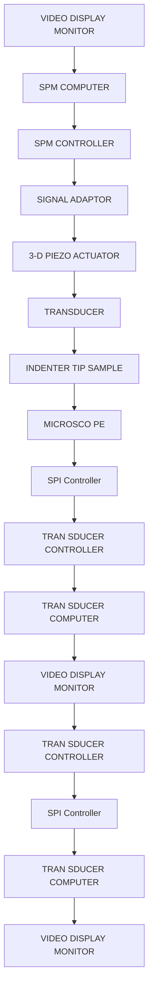

# Evaluation of change in material properties due to plastic deformation

M. Yang∗, Y. Akiyama, T. Sasaki

Department of Mechanical Engineering, Tokyo Metropolitan University, 1-1 Minami-osawa, Hachioji-shi, Tokyo 192-0397, Japan

# Abstract

In sheet metal forming, quantitative evaluation of the spring-back phenomenon is one of the most important issues. In this study, in order to clarify the influence of plastic deformation on the changes of material properties such as the elastic modulus, both macroscopic and microscopic experiments were performed. The change in the elastic modulus was measured before and after plastic deformation using a precision tensile test. The microscopic variation in the elastic modulus was investigated by nano-indentation testing, by means of which micro regional material properties can be obtained. Both macroscopic and microscopic measurements show that the elastic moludi decreases according to increasing plastic strain and that the decrease of the elastic modulus affects the spring-back significantly.

© 2004 Elsevier B.V. All rights reserved.

Keywords: Change in elastic modulus; Spring-back; Nano-indentation test

# 1. Introduction

In sheet metal forming, the accuracy of the products is one of the most significant issues, and relates to strongly the spring-back characteristics of the material. The spring-back of sheet metal depends on the mechanical properties of the material such as elastic modulus, the dimensions of the workpiece and the deformation process, but furthermore, the material properties such as the elastic modulus change with large plastic deformation. Precise measurement for the material properties and spring-back is strongly required [1].

On the other hand, the numerical simulation technique has progressed remarkably. Nowadays in sheet metal forming, FE simulations are used increasingly, the main purpose being in-advance assessment of the formability. Although the spring-backed shape can be predicted by FE simulation, the accuracy is not enough for making use of it practically. Therefore further study of material modelling is necessary in order to be able to achieve a more precise prediction [2].

Up to now many constitutive equations have been proposed to describe deformation behaviour in the forming processes. However, most of them are based on continuum mechanics and experimental results such as tensile and compression tests from macroscopic aspects, which are not accurate enough to respond to the variation in the material properties.

In this study, in order to evaluate the influence of plastic deformation on spring-back, the elastic modulus was measured before and after plastic deformation for the evaluation of its change. Furthermore, a microscopic measurement of the modulus and hardness in a grain was carried out by a nano-indentation test. A link should be established between the microscopic properties of the material and changes in the macroscopic behaviour such as spring-back.

# 2. Measurement of the elastic modulus after large deformation

A precision extensometer was developed by the authors, and a tensile test using the extensometer and the strain gages was carried out for measuring the elastic modulus of SPCE sheet metal before and after large deformation [3]. The stress–strain curve was monitored while the workpiece was loaded to a given plastic strain of maximum 25% and then unloaded. The elastic modulus was measured from the stress–strain curve at initial elastic deformation and unloading curve after the given plastic deformation.

Fig. 1 shows the variation in Young’s modulus as a function of tensile strain determined using the precision extensometer.

It is found that Young’s modulus decreases with plastic strain, the decrease being more than 20% after a deformation of 25% plastic strain. Furthermore, prediction of spring-back after V-bending was simulated with the variation of elastic modulus by an FEM code.

line

| True strain | Variation in elastic modulus δE=E/E0 [%] |
| ----------- | ---------------------------------------- |
| 0.00        | 100.0                                    |
| 0.02        | 92.0                                     |
| 0.04        | 88.0                                     |
| 0.06        | 85.0                                     |
| 0.08        | 82.0                                     |
| 0.10        | 80.0                                     |
| 0.12        | 79.0                                     |
| 0.14        | 78.0                                     |
| 0.16        | 77.0                                     |
| 0.18        | 76.0                                     |
| 0.20        | 75.0                                     |
| 0.22        | 74.0                                     |
| 0.24        | 73.0                                     |
| 0.26        | 72.0                                     |

Fig. 1. Variation in elastic modulus as a function of plastic strain measured using a precision extensometer [3].

Fig. 2 shows the comparison of the experimental spring-back with the values simulated by using the initial elastic modulus (constant value) and the varied modulus according to the experimental results shown in Fig. 1 [4]. The results show that the spring-back with the varied elastic modulus could be predicted more accurately than that with the constant initial elastic modulus [4].

Increase of residual stress and micro cracks, and variation in the dislocation structure inside the workpiece, etc., could be reasons for the decrease of the elastic modulus after plastic deformation. The residual stress increases with the plastic deformation and disturbs the elastic recovery which results in decrease of the elastic modulus. The micro cracks inside the workpiece increases due to plastic deformation, which decreases density of the workpiece. As a result, the apparent elastic modulus decreases. However, the reduction of the density due to plastic deformation is less than 1% [5] and the effect on the elastic modulus will not be as large as that in the results shown in Fig. 1. Another influencing factor is the variation in the dislocation structure: the latter changes with the increase of plastic deformation, which effects the elastic behaviour. The dislocations released from a common source move along the same slip surface and easily pile up, whilst the front of dislocations is stopped by obstacles, such as grain boundaries, solutes and so on. The

line

| Bend angle before unloading [degree] | experimental | Simulated with constant E | Simulated with varied E |
|---|---|---|---|
| 160 | 0.9 | 1.0 | 1.15 |
| 140 | 1.25 | 1.1 | 1.3 |
| 120 | 1.25 | 1.1 | 1.35 |
| 100 | 1.35 | 1.15 | 1.35 |
| 90 | 1.4 | 1.15 | 1.35 |

Fig. 2. Comparison of experimental and simulated spring-back value in the V-bending test.

text_image

(a)
Grain
boundary
(b)

Fig. 3. Model of dislocation pile-up.

pile-up dislocations can move backwards when the shearing is stress released during the unloading [6].

Fig. 3 shows a pile-up model of dislocations, where the pile-up causes the deformation during unloading and also during loading with a stress even smaller than the yield stress. As the result, the apparent elastic modulus can decrease due to the movable dislocations, which decrease increases as a function of the plastic strain.

In mild steel, dislocations may be locked by carbon and other solutes due to the Cottrell effect before plastic deformation. During plastic deformation, the dislocations are released from the Cottrell effect and move with lower internal stress. As a result, the structure of dislocation changes so that the Cottrell atmosphere will not be recovered because diffusion rate of C is very low in an Fe matrix at room temperature. In this study, the workpieces were treated after the tensile test with a particular heat treatment, and then the elastic modulus were measured again after the treatment in order to confirm the effect of the movable dislocation. The condition of heat treatment were 373 K for 90 h for recovering only the Cottrell atmosphere due to the diffusion of C and whilst keeping the dislocation stationary. The conditions were calculated based on the average diffusion distance x of solute C in GnFe matrix in time t by means of following equation:

$$
X = (2 D t) ^ {1 / 2} \tag {1}
$$

where D denotes the diffusion coefficient.

The tensile test was performed for the confirmation of the affect of movable dislocations. Specimens with several conditions as shown in Table 1 were employed for comparison.

The stress–strain curve was measured using a load cell and a strain gauge up to a strain for 1% and then the elastic modulus was obtained from the stress–strain curves within the elastic deformation region. The resultant stress–strain curves and the variation in the gradient of the stress–strain curves are shown in Fig. 4.

Table 1 Conditions of the specimens for the tensile test

<table><tr><td>Species</td><td>Conditions</td></tr><tr><td>A</td><td>As received</td></tr><tr><td>B</td><td>With 15% pre-strain</td></tr><tr><td>C</td><td>Heat-treated after 15% pre-strain</td></tr><tr><td>D</td><td>Heat-treated after received</td></tr><tr><td>E</td><td>Annealed</td></tr></table>

Material: SPCC; thickness: 1.2 mm.

line

| Strain [%] | Stress [MPa] (Curve A) | Stress [MPa] (Curve B) | Stress [MPa] (Curve C) | Stress [MPa] (Curve D) | Stress [MPa] (Curve E) |
| ---------- | ---------------------- | ---------------------- | ---------------------- | ---------------------- | ---------------------- |
| 0.0        | 0                      | 0                      | 0                      | 0                      | 0                      |
| 0.1        | ~150                   | ~200                   | ~180                   | ~160                   | ~170                   |
| 0.2        | ~200                   | ~300                   | ~250                   | ~220                   | ~240                   |
| 0.3        | ~220                   | ~380                   | ~360                   | ~340                   | ~370                   |

line

| Strain [%] | Elastic modulus [GPa] |
| ---------- | --------------------- |
| 0.00       | 250                   |
| 0.05       | 200                   |
| 0.10       | 150                   |
| 0.15       | 100                   |
| 0.20       | 50                    |
| 0.25       | 25                    |
| 0.30       | 0                     |

Fig. 4. Variation in Young’s modulus in the elastic region for pre-strained specimens: (a) the stress–strain curves measured by strain gauge; (b) the variation in the gradient of the curves.

The elastic moduli calculated from the initial stage (strain $< ~ 0 . 1 \% )$ and from the whole elastic region are shown in Table 2.

The results show that the elastic modulus remains almost the same until yielding for the annealed workpiece only. The gradient of the stress–strain curve decrease from the beginning up to the macroscopic yield point, so that the modulus varied significantly for the workpiece with 15% pre-strain and even for the as-received workpiece. However, the gradient of the stress–strain curve shows a unique manner for the workpiece with pre-strain and heat treatment: the gradient decreases from the beginning, the same as for the pre-strained workpiece, but, the gradient increases to almost the same level as that for the annealed workpiece. As a result the average elastic modulus shows a larger value than for the other pre-strained workpiece as shown in Table 2. This can be explained as due to the recover of the Cottrell effect, the heat treatment restraining the movable dislocations. This means that movable dislocations are one of the most significant factors affecting the apparent elastic modulus, and that the piled-up dislocations due the plastic deformation causes the decrease of the apparent elastic modulus.

Table 2 Elastic moduli calculated from different ranges

<table><tr><td rowspan="2">Species</td><td rowspan="2">Conditions</td><td colspan="2">Elastic modulus at region of strain (%)</td></tr><tr><td>0–0.05</td><td>Whole elastic range</td></tr><tr><td>A</td><td>As received</td><td>182</td><td>173</td></tr><tr><td>B</td><td>With 15% pre-strain</td><td>188</td><td>162</td></tr><tr><td>C</td><td>Heat-treated after 15% pre-strain</td><td>186</td><td>162</td></tr><tr><td>D</td><td>Heat-treated after received</td><td>189</td><td>189</td></tr><tr><td>E</td><td>Annealed</td><td>224</td><td>206</td></tr></table>

As shown in Fig. 3, pile-up of dislocation is considered to occur near to the boundary of grains and thus the movable dislocations have a greater possibility of existence than that for other partitions. As a result, the apparent elastic moduli could differ each other from the boundary to centre of the grain. In the next section, the nano-indentation test is used to measure a distribution of the elastic modulus in a grain.

# 3. Nano-indentation with a spherical indenter tip

# 3.1. Principle of the nano-indentation and the experimental set-up

A nano-indenter is a high precision instrument for the determination of mechanical properties such as elastic modulus and hardness in a sub-micron feature. The nano-indentation measurement technique is in general to indent a micro tip on an indenter with a three-sided pyramids diamond (Berkovich type) into the surface of samples by applying an increasing load up to some pre-set value. The load and displacement of the indenter is then obtained [2,3]. From this curve, mechanical properties such as the elastic modulus and the hardness of the sample material can be calculated by means of following equations:

$$
E _ {\mathrm{r}} = \frac {\sqrt {\pi}}{2 \sqrt {A (h _ {\mathrm{c}})}} S, \quad \frac {P}{A (h _ {\mathrm{c}})} \tag {2}
$$

where, S, P and $A ( h _ { \mathrm { c } } )$ denote the contact stiffness, the indentation load, and the contact area between the sample and the indenter tip, respectively.

Fig. 5 shows the configuration of the experimental set-up.

A nano-indentation instrument (Triboscope, Hysitron Inc.) is set onto an AFM stage (SPM-9500J2, Shimazdu Co.). The specification of the equipment is presented in Table 3.

flowchart

Fig. 5. Schematic set-up of the nano-indentation apparatus.

Table 3 Specification of the nano-indentation equipment

<table><tr><td></td><td>Range</td><td>Sensitivity</td></tr><tr><td>Force</td><td>1–10 mN</td><td>100 nN</td></tr><tr><td>Displacement</td><td>5 μm</td><td>0.2 nm</td></tr></table>

The sample is set onto a 3D piezo stage that is controlled by an SPM controller. The profile of the sample surface can be scanned by actuating then 3D piezo stage with the AFM mode, when choosing the indentation point. The indentation test is performed to indent the tip into the point of the sample surface by driving the transducer through the transducer controller. The features of the equipment are that the profile of the sample surface before and after indentation can be measured by scanning the AFM stage so that the target point for measurement can be chosen to an order of nanometer in distance, and also the profile after indentation can be measured in situ. Fig. 6 shows a typical load–displacement curve and the indentation trace.

# 3.2. Nano-indentation with spherical indenter tip

For indentation with a Berkovich type indenter, the elastic modulus is calculated from the gradient in the unloading process. This means that plastic deformation occurs due to the indentation, and as a result the elastic modulus measured could be affected by the plastic deformation. To avoid the affect of the plastic deformation due to the indentation, a spherical indenter tip was employed for the indentation test in this study. The indentation of the sample surface with a similar load using a spherical indenter can only deform sample surface elastically. The relationship between the elastic modulus and the indenter depth can be expressed by Heltz contact theory as following equation:

$$
h _ {\mathrm{e}} = \left(\frac {9 P ^ {2}}{1 6 R E _ {\mathrm{r}} ^ {2}}\right) ^ {1 / 3} \tag {3}
$$

where $E _ { \mathrm { r } }$ is the compound elastic modulus and R the radius of the indenter tip.

Nano-indentation with the spherical tip was applied to measure the mechanical properties near to a grain of the specimens. Fig. 7 shows the positions of the measurement

line

| In dentation depth | Load | S = dP/dh |
| ------------------ | ---- | --------- |
| 0                  | 0    | 0         |
| 1                  | 1    | 0.5       |
| 2                  | 2    | 1         |
| 3                  | 3    | 2         |
| 4                  | 4    | 3         |
| 5                  | 5    | 4         |
| 6                  | 6    | 5         |
| 7                  | 7    | 6         |
| 8                  | 8    | 7         |
| 9                  | 9    | 8         |
| 10                 | 10   | 9         |
| 11                 | 11   | 10        |
| 12                 | 12   | 11        |
| 13                 | 13   | 12        |
| 14                 | 14   | 13        |
| 15                 | 15   | 14        |
| 16                 | 16   | 15        |
| 17                 | 17   | 16        |
| 18                 | 18   | 17        |
| 19                 | 19   | 18        |
| 20                 | 20   | 19        |
| 21                 | 21   | 20        |
| 22                 | 22   | 21        |
| 23                 | 23   | 22        |
| 24                 | 24   | 23        |
| 25                 | 25   | 24        |
| 26                 | 26   | 25        |
| 27                 | 27   | 26        |
| 28                 | 28   | 27        |
| 29                 | 29   | 28        |
| 30                 | 30   | 29        |
| 31                 | 31   | 30        |
| 32                 | 32   | 31        |
| 33                 | 33   | 32        |
| 34                 | 34   | 33        |
| 35                 | 35   | 34        |
| 36                 | 36   | 35        |
| 37                 | 37   | 36        |
| 38                 | 38   | 37        |
| 39                 | 39   | 38        |
| 40                 | 40   | 39        |
| 41                 | 41   | 40        |
| 42                 | 42   | 41        |
| 43                 | 43   | 42        |
| 44                 | 44   | 43        |
| 45                 | 45   | 44        |
| 46                 | 46   | 45        |
| 47                 | 47   | 46        |
| 48                 | 48   | 47        |
| 49                 | 49   | 48        |
| 50                 | 50   | 49        |
| Note: The actual load values are not provided in the code. The actual load values are calculated based on the formula Pmax. There is only one data series labeled 'load'. The actual load values are calculated as 'unload' and the actual load values are calculated as 'S = dP/dh'.

Fig. 6. Typical load and displacement curve of indentation.

scatter

| Position (μm) | Line # 1 | Line # 2 | Line # 3 |
| ------------- | -------- | -------- | -------- |
| 0             | △        | ◇        | □        |
| 3             | △        | ◇        | □        |
| 6             | △        | ◇        | □        |
| 9             | △        | ◇        | □        |
| 12            | △        | ◇        | □        |

Fig. 7. AFM image of surface near to the grain boundary and the measurement points.

line

| Penetration h [nm] | Load P [∞N] |
| ------------------ | ----------- |
| 0                  | 0           |
| 2                  | ~50         |
| 4                  | ~100        |
| 6                  | ~150        |
| 8                  | ~200        |
| 10                 | ~350        |

Fig. 8. Load–displacement curve.

points, the points being along one of the three lines across the boundary. Fig. 8 shows one of the load–displacement curves with a nominal radius of $R = 5 0 \mu \mathrm { m }$ . The resultant elastic properties from the curves are shown in Fig. 9. It was found that the elastic modulus near the boundary has a smaller value than that in the other regions, that have a similar distribution of values, but at a different level due to the grains being at different orientations.

scatter

| Position [m] | Elastic modulus Er [GPa] |
| ------------ | ------------------------ |
| 2.0          | 170                      |
| 2.5          | 180                      |
| 3.0          | 160                      |
| 3.5          | 150                      |
| 4.0          | 140                      |
| 4.5          | 130                      |
| 5.0          | 120                      |
| 5.5          | 110                      |
| 6.0          | 100                      |
| 6.5          | 90                       |
| 7.0          | 80                       |
| 7.5          | 70                       |
| 8.0          | 60                       |
| 8.5          | 50                       |
| 9.0          | 40                       |
| 9.5          | 30                       |
| 10.0         | 20                       |
| 10.5         | 10                       |
| 11.0         | 0                        |
| 11.5         | -10                      |
| 12.0         | -20                      |

Fig. 9. Resulting Young’s modulus for nano-indentation.

text_image

1150
2660
Marker for finding me
Marker for finding location
300 340 300
Unit: µm
SPCE

Fig. 10. Location of the markers for position identification.

text_image

Y
O X
Measured point
Y=2
Y=1
Y=0
X=0 X=1 X=2 #
Unit:µm

Fig. 11. Microscopic image of the measurement region before CMP treatment.

In this experiment, the indentation depth was as small as several nanometers as shown in Fig. 8. The accuracy of the indentation could be affected significantly by the roughness of the sample surface. In this case, an etching process for the disclosure of the grain boundary formed a ditch of several nanometers width at the grain boundary. The nano-indentation test could be affected by the ditch on the surface, especially for the test with a spherical indenter tip. For avoiding the influence of the surface roughness, CMP treatment was performed for the specimens before the nano-indentation, as follows.

First, the surface of the specimens was treated the same as for the previous experiment by an using etching solution. Measurement of targeted grain boundary was made under the microscope and two indentation marks were made near the boundary using a Vickers hardness test machine. After the location marking, CMP treatment was applied to the surface finish. The location of the markers is shown in Fig. 10. The larger markers at outer side are used for finding the region for indentation and the smaller ones inside are used for deciding the exact position of the measurement point.

Fig. 11 shows the measurement region before CMP treatment. The rectangular area shows the measurement region. The measurement was performed with an interval distance of 1 m, and the total measurement points are 20 and 3 in X and Y directions, respectively. The results are shown in Fig. 12.

scatter

| Position X [~m] | Young's modulus E_r [GPa] (Y=0) | Young's modulus E_r [GPa] (Y=1) | Young's modulus E_r [GPa] (Y=2) |
| --------------- | ------------------------------- | ------------------------------- | ------------------------------- |
| 0               | ~280                            | ~340                            | ~260                            |
| 5               | ~180                            | ~220                            | ~200                            |
| 10              | ~120                            | ~200                            | ~220                            |
| 15              | ~160                            | ~220                            | ~180                            |
| 20              | ~140                            | ~200                            | ~160                            |

Fig. 12. Resulting Young’s modulus near to the grain boundary.

It was shown that the Young’s modulus decrease near to X = 5–10 for the scanning line, which means the boundary area. The average values of the elastic moduli are smaller than those of the previous test, due to the real radius being much smaller than the nominal value: however, this error those of the can be calibrated by using standard samples.

# 4. Conclusions

The elastic modulus was measured before and after plastic deformation for evaluation of the change in the elastic modulus and evaluation of the influence on the spring-back. Furthermore, a microscopic measurement of the modulus in a grain was carried out by a nano-indentation test. It is found that the apparent elastic modulus decreases according to the increase of plastic strain. One of the major influential factors is the movable dislocation accompanying the pile-up of dislocations near to the grain boundary. Decrease of the modulus near to the grain boundary was confirmed by a nano-indentation test. The macroscopic behaviour of the apparent modulus was verified by microscopic measurement.
