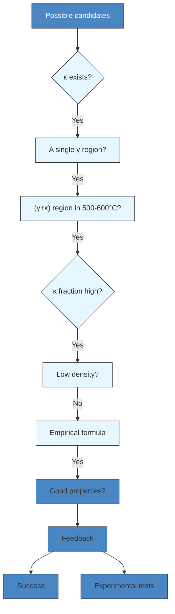
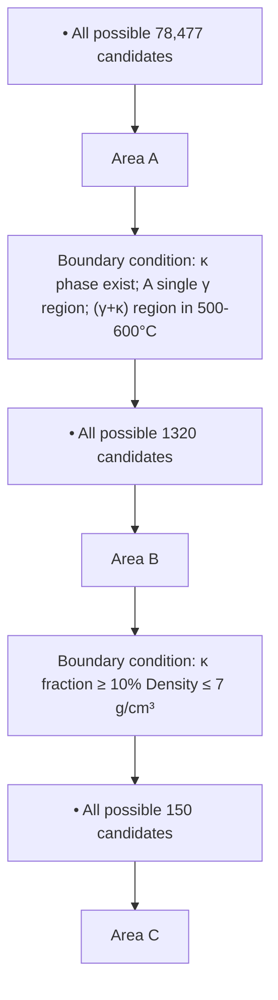

Full Length Article

# Deciphering the composition-microstructure correlation in low-density FeMnAlC steels with machine learning

Peng Tiexu a,1, Yu Haoyang a,1, Huang Jiaxin a,1, Fang wei a,\* , Li Cong a , Yao Zitong a Zhang Xin a , Feng Jianhang a , Ji Puguang a,b , Xia Chaoqun a , Yu Hui a , Yin Fuxing a,c

a Tianjin Key Laboratory of Materials Laminating Fabrication and Interface Control Technology, School of Materials Science and Engineering, Hebei University of Technology, Tianjin 300132, China
b Xuzhou Jihua Metal Material Technology Co., Ltd., Xuzhou 221100, China
c Institute of New Materials, Guangdong Academy of Science, Guangzhou 510651, China

# A R T I C L E I N F O

Keywords:

Fe-Mn-Al-C alloy

Compositional design

κ-carbide

Machine-learning

# A B S T R A C T

FeMnAlC steels have been regarded as prospective candidates for the advanced high-strength steel with reduced density. However, the correlation between the complex steel composition and the resulting microstructure remains unclear. This study presents a robust and efficient approach for establishing the correlation between the composition and microstructure of low-density FeMnAlC steel using a machine learning algorithm. By employing classification and regression models, we successfully predicted four significant characteristics: the existence of the κ phase, a dual-phase region (γ + κ) at the aging temperature, a solitary γ phase region, and the volume fraction of the κ phase. Notably, the elements Al and C, with a particular emphasis on Al, exert significant influence on the phase structure. For example, when the Mn element content is 30 wt%, an estimated minimum Al content of around 4 wt% is required to guarantee the existence of the κ phase. Furthermore, the anticipated content range of Al and C required for the existence of the (γ + κ) duplex region at the aging temperature spans from 4.5 to 9.3 wt% and 0.4 to 1.1 wt%, respectively. Ultimately, the Fe-30Mn-8Al-1C steel was chosen for experimental validation, and the predicted characteristics exhibited excellent agreement with the experimental results. Our research offers a roadmap for the development of low-density steel, and the approach we devised holds promise for application in other metallic materials as well.

# 1. Introduction

The use of low-density steel in the automotive industry is known to enhance fuel efficiency and decrease carbon dioxide emissions [1–4]. However, steel must possess advantageous mechanical properties, such as high formability, recyclability, and low cost to be commonly utilized in this sector. Among all lightweight materials, FeMnAlC austenitic lowdensity steels are highly attractive as they offer a superior combination of specific strength, ductility, and fatigue properties. Hence, it is a body structure material with great potential. researchers have shown a growing interest in their development with high strength and low density.

The microstructure of FeMnAlC low density steel varies with the alloy composition. The principal alloy elements utilized in the production of low-density steels are manganese (Mn), aluminum (Al), and carbon (C). Incorporating Al into FeMnAlC steels can decrease C diffusivity, promote the formation of a protective alumina layer (Al O ), and stabilize the α phase [5–8]. α phase (α-ferrite) is a slender strip, which undergoes continuous and orderly transformation during aging and becomes a B2 or DO3 intermetallic compound [4,5]. Moreover, the addition of Al improves the stacking fault energy (SFE) of the FeMnAlC system, which curbs the transformation from the austenitic γ to ε phase [5,6]. This ultimately results in a reduction in steel density by decreasing the material’s average molar mass and lattice expansion [9,10]. Mn enhances γ phase stability by raising the FCC lattice parameter and impeding additional ferrite formation caused by Al inclusion [5,7]. Nevertheless, an excessive amount of Mn can lead to the formation of the brittle β-Mn phase [11]. Typically, the inclusion of β-Mn precipitates leads to a substantial increase in steel strength but a reduction in plasticity [12]. The presence of β-Mn precipitates also tends to induce brittle fractures within the FeMnAlC system, resulting in diminished impact energy [4,5]. Meanwhile, carbon stabilizes the γ phase and encourages the precipitation of the κ phase, thus maintaining the steel’s mechanical properties. FeMnAlC austenitic steels have been observed to form a metastable phase of coherent ordered precipitate called the κ-carbide (κ-phase) within their austenite grains [3,14]. It has been indicated that the aging of coherent, nanosized κ-carbides is primarily impacted within the intermediate temperature range of 500-600 ℃. During force deformation, κ-carbides are sheared by dislocations belonging to the {1 11} 〈1 1 0〉 slip system, while dislocation bypassing can also occur [15]. The microstructure of FeMnAlC austenitic low-density steel remains stable, exhibiting an exceptional blend of strength and toughness, attributed to its remarkable strain hardening capability and the κ carbide precipitation strengthening mechanism [4,5]. Thus, the study of the κ phase is pivotal for FeMnAlC austenitic low-density steels. The literature reports that the composition of FeMnAlC austenitic low-density steels usually ranges from 18-30 wt% Mn, 8–12 wt% Al, and 0.6–1.8 wt% C [1,3,7,16–18]. With over 100,000 possible candidate compositions for steel, it is practically impossible to experimentally test each one.

flowchart

Fig. 1. Framework of the design process of the low-density Fe–Mn–Al–C austenitic steels by machine learning.

Utilizing calculation methods based on material properties to optimize the material design process enhances efficiency and lowers costs. FeMnAlC systems are characterized by a range of constituent elements and complex phase structures, making the implementation of molecular dynamics and density functional theory potentially time-consuming. As a result, a novel approach is necessary to efficiently and accurately forecast the phase properties that correspond to low-density steel compositions in the FeMnAlC system. In recent years, the data-driven machine learning assisted design of new materials has gained significant attention [19–22]. The machine learning process involves the creation of a mathematical model based on the characteristics and features of computational or experimental data [23]. The process consists of three primary steps: dataset construction, model building, and model evaluation [24]. The creation of an optimized model enables the efficient design of candidates that satisfy the design requirements and provide good prediction performance. Based on the predicted results, experimental testing follows to validate the material’s performance. Steel, being a widely used structural material, plays a fundamental function in supporting our industries and livelihoods [25–27]. The challenge of designing steel materials using traditional trial-and-error approaches is further complicated because of its lengthy development history [25], mature process, and numerous processing parameters. Machine learning offers a solution to this challenge by facilitating the design process through the establishment of a complex relationship between production processes and steel material performance [28–30]. This approach has been extensively used in designing steel materials; for instance, the relationship between the composition, treatment process, and tensile properties of reduced activation ferritic/martensitic (RAFM) steels [31] was established using the machine learning method. Ultimately, the model, which was trained with random forest regressors, conclusively confirmed the effects of tempering temperature and C content on the yield strength of RAFM steels.

Hence, for a precise and effective examination of phase properties associated with the composition of low-density steel in the FeMnAlC system, the data-driven alloy design method offers distinct advantages. This study introduces a methodology for establishing the connection between the intricate composition and the microstructure traits of FeMnAlC austenitic low-density steel through the utilization of machine learning algorithms. This method mainly predicts the complex composition and corresponding phase structure of FeMnAlC system lowdensity steel, and achieves the purpose of directional selection of components and phase structure. Multiple machine learning algorithms were employed to establish predictive models based on four significant steel features: the existence of κ precipitates, a (γ + κ) two-phase area, a single γ phase area, and a substantial volume fraction of κ. Subsequently, the best models were selected to optimize the design of FeMnAlC austenitic low-density steel, guaranteeing the steel possessed κ precipitates, a (γ + κ) dual-phase region, a single γ phase area, a high volume fraction of the κ phase, and lower density relative to conventional steel. Furthermore, relationships between the four features and chemical composition were established. The model-predicted outcomes for the FeMnAlC singlephase austenitic low-density steel were discovered to approximate experimental test properties. Lastly, material limitation conditions were incorporated into a larger component space to achieve the preferred material orientation design.

# 2. Methods

# 2.1. Design process

We propose a novel machine learning-based design strategy aimed at expediting the development of low-density Fe-Mn-Al-C austenitic steels. Fig. 1 illustrates the framework the design process, focused on establishing the correlation between the composition of low-density steel and its microstructure characteristics.

The design process involves constructing predictive models using machine learning for four significant steel features. Classification models predict the existence of the κ phase (Y1), and the main purpose is the significant precipitation-strengthening effect of the κ phase. $\updownarrow ( \gamma + \kappa )$ dual-phase area at 500–600 ◦C (Y ), and the main purpose is to exclude the influence of other phase structures on the system. A single γ phase area $\left( \mathrm { Y } _ { 3 } \right)$ , and the main purpose is that the single γ phase area is convenient for deformation processing. Regression models predict the volume fraction $\mathrm { ( Y _ { 4 } ) }$ of the κ phase, and a higher κ-phase volume fraction generally gives the system better mechanical property potential. Although the precipitation size and distribution of the κ phase have an important influence on the performance of the system, they can be regulated by a suitable heat treatment process. Once the database is complete, our research scope will extend to include factors such as kappa phase size, morphology, and location. The steel density is then calculated using an empirical formula. The predictive models for these attributes are combined with the empirical density formula. Possible candidates are filtered based on the design requirements for different steel properties. The predicted results are verified through experimental testing. If the experimental results show a significant deviation from the predicted results, the model is altered to improve accuracy based on the new test data. Ultimately, an integrated model can successfully design low-density Fe-Mn-Al-C austenitic steels with good properties.

Table 1 Original six input features used in machine learning model.

<table><tr><td>Descriptor</td><td>Formula</td><td>Ref.</td></tr><tr><td>valence electron concentration (VEC)</td><td> $VEC = \sum_{i=1}^{n} c_i VEC_i$ </td><td>[32]</td></tr><tr><td>melting point (Tm)</td><td> $\Delta T_m = \sum_{i=1}^{n} c_i T_{mi}$ </td><td>[33]</td></tr><tr><td>entropy of mixing ( $\Delta S_{mix}$ )</td><td> $\Delta S_{mix} = -R \sum_{i=1}^{n} c_i \ln(c_i)$ </td><td>[32]</td></tr><tr><td>enthalpy of mixing ( $\Delta H_{mix}$ )</td><td> $\Delta H_{mix} = 4 \sum_{i \neq j}^{n} c_i c_j H_{ij}$ </td><td>[34]</td></tr><tr><td>Pauli electronegativity difference ( $\Delta \chi$ )</td><td> $\overline{\chi} = \sum_{i=1}^{n} c_i r_i, \Delta \chi = \sqrt{\sum_{i=1}^{n} c_i (\overline{\chi} - \chi_i)^2}$ </td><td>[35]</td></tr><tr><td>atomic size difference ( $\delta$ )</td><td> $\delta = \sqrt{\sum_{i=1}^{n} \sum_{j>i}^{n} c_i c_j (1 - \frac{r_i + r_j}{2\overline{r}})^2}$ </td><td>[36]</td></tr></table>

# 2.2. Machine learning

# 2.2.1. Dataset

To optimize the design of low-density austenitic steels containing iron, Mn, Al, and $\mathrm { C } ,$ the (100-x-y-z)Fe-xMn-yAl-zC family was chosen as the system of interest. The potential composition space was defined according to the following parameters (the element content is the mass percentage): $1 0 \% \leq \mathbf { x } \leq 3 0 \% , 2 \% \leq \mathbf { y } \leq 1 2 \% ,$ , and 0.2 % ≤ z ≤ 2 %. The dataset for this study included information from historical literature sources $[ 1 , 3 , 7 , 1 6 , 1 7 ]$ as well as phase balance data obtained using the JMatPro v9.0 general steel database. Considering the physical and chemical properties of the system and the binding force between the atoms, the descriptor of the machine learning calculation needs to be selected. Six input features or descriptors (See Table 1 for details) were identified in order to improve the accuracy of the machine learning models, these included the valence electron concentration $\mathrm { ( V E C ) } ,$ atomic size difference (δ), enthalpy of mixing $\left( \Delta \mathrm { H } _ { \mathrm { m i x } } \right)$ , entropy of mixing $( \Delta S _ { \mathrm { m i x } } )$ , melting point $\left( \mathrm { T } _ { \mathrm { m } } \right)$ , and Pauli electronegativity difference $( \Delta \chi )$ . A total of 448 samples, each with 10 features, including the four constituent elements and the six input features, were collected. The original dataset comprises samples with diverse compositions. To ensure proper algorithm processing, missing data will be handled by elimination for the regression analysis, resulting in a total of 448 samples for $\mathrm { Y } _ { 1 } ,$ 448 for $\mathrm { Y } _ { 2 } ,$ , 448 for $\mathrm { Y } _ { 3 } ,$ and 298 for $\mathrm { Y } _ { 4 } .$ Each sample in $\mathrm { Y } _ { 1 } , \mathrm { Y } _ { 2 } ,$ and $\mathrm { Y } _ { 3 }$ is categorized as $^ { 6 6 } 1 ^ { \prime \prime }$ or “0” to denote the presence or absence of specific phases: the κ phase in $\Upsilon _ { 1 } , \textsf { a } ( \gamma + \kappa )$ dual-phase region at 500– $6 0 0 ^ { \circ } \mathrm { C }$ in $\mathrm { Y } _ { 2 } ,$ and a single γ region in $\mathrm { Y } _ { 3 } ,$ making the data suitable for machine learning algorithms.

# 2.2.2. Machine learning algorithm

K-nearest neighbor (KNN) [37] is a fundamental machine-learning algorithm. Given a feature space (consisting of 10 descriptors), KNN identifies the most similar K samples (target components) in the same category $\left( \mathrm { Y } _ { 1 } , \mathrm { Y } _ { 2 } , \right.$ Y3 and $\mathrm { Y } _ { 4 } )$ .

Artificial neural network (ANN) [38] is one of the most extensively used machine-learning algorithms today, comprising interconnected units termed the input layer, output layer, and hidden layer. Within this structure, the input layer processes the input data x (consisting of 10 descriptors) and subsequently produces prediction results $\boldsymbol { \tau } \left( \mathrm { Y } _ { 1 } , \mathrm { Y } _ { 2 } , \mathrm { Y } _ { 3 } \right.$ and $\mathrm { Y } _ { 4 } )$ in the output layer following processing by the hidden layer. The hidden layer hosts one or more computing units tasked with executing significant mathematical operations on the input data.

Classification and regression tree (CART) [38] is a popular machine learning algorithm that utilizes single-tree models to process classification or regression tasks of continuous data. CART consists of four components, which include a root node (the highest decision node that represents the ultimate objective of the tree), branches (connecting the tree elements), leaf nodes (situated at the end of branches and representing decisions to be made), and the decision node (represents the condition that results in a dataset split).

Support vector machine (SVM), a supervised learning technique, can perform classification and regression analysis by recognizing data. It is capable of efficiently handling high-dimensional, nonlinear, and scattered samples, especially for binary classification. Essentially, SVM distinguishes a set of data features (consisting of 10 descriptors) identified as vectors.

Random forest (RF) classifiers use ensemble methods applied to randomly selected training samples and subsets of the variables. Unlike traditional decision tree models, random forests do not use all available features in each splitting process of subtrees. Instead, a specific subset of features is randomly selected from the full set of features, with the best features chosen from the selected subset. This creates variability among the decision trees in the random forest, which improves the overall diversity of the system and, subsequently, its classification performance.

To prevent overfitting, k-fold cross-validation was utilized. In this study, the established dataset was randomly divided into ten approximately equal parts and the predictive model was trained ten times. For the regression model, ten-fold cross-validation was also utilized to prevent overfitting. Four evaluation indicators were used for regression models, including the correlation coefficient (R), explained variance $( \mathrm { R } ^ { 2 } )$ , mean absolute error (MAE), and root mean square error (RMSE).

# 2.3. Experimental procedure

The validity of the model-recommended compositions was tested through experimentation on a Fe-Mn-Al-C steel with the following chemical composition (wt.%): Mn-30, Al-8, C-1, and balance Fe. The steel was prepared by induction melting under an Ar atmosphere. The as-cast 25 kg ingot was homogenized at 1200 ◦C for 2 h and then forged into a cross-sectional billet of 60 $\mathrm { m m } \times 6 0 \mathrm { m m }$ . After homogenization at $1 0 5 0 ~ ^ { \circ } \mathrm { C }$ for 100 min, the forging stock was hot-rolled to 12 mm thick plates, air-cooled to room temperature, and then cold-rolled with a 75 % thickness reduction at room temperature. The rolled plate was then annealed at $1 0 0 0 ~ ^ { \circ } \mathrm { C }$ for 15 min to achieve a recrystallized microstructure, subsequently water-quenched to room temperature, and aged at $5 5 0 ~ ^ { \circ } \mathrm { C }$ for 2 h.

Phase identification analysis was conducted using X-ray diffraction (XRD) measurements with a Bruker D8 DISCOVER utilizing Cu Kα radiation between $3 0 ^ { \circ }$ and ${ } ^ { 1 0 0 ^ { \circ } }$ (2θ) with a step size of 3◦/minute. The microstructure and compositional analysis were characterized using scanning electron microscopy (SEM, JEOL 7100F), electron probe microanalysis (EPMA, JEOL 8530F), and transmission electron microscopy operating at 200 kV (TEM, JEOL 2100F). The EBSD samples were polished with SiC sandpaper to 3000 grit and electrochemically polished in a solution of $\mathrm { H C l O } _ { 4 } \colon \mathrm { C } _ { 2 } \mathrm { H } _ { 5 } \mathrm { O H } = 1 \colon 9$ (volume ratio) at $2 5 \mathrm { ~ V ~ }$ at room temperature. Uniaxial tensile tests were conducted on dog-bone-shaped specimens with a nominal strain rate of $1 \times 1 0 ^ { - 3 } s ^ { - 1 }$ at ambient temperature using a SHIMADZU AGS universal electronic tensile tester with gauge dimensions of 10 mm (length) × 4 mm (width) × 2 mm (thickness) prepared by electrical discharge machining.

heatmap

| | Mn | Al | C | Fe | VEC | Tm | ΔSmix | ΔHmix | Δχ | δ |
|---|---|---|---|---|---|---|---|---|---|---|
| Mn | 1 | | | | | | | | | |
| Al | 0 | 1 | | | | | | | | |
| C | 0 | 0 | 1 | | | | | | | |
| Fe | -0.9 | -0.43 | -0.08 | 1 | | | | | | |
| VEC | -0.21 | -0.94 | -0.28 | 0.62 | 1 | Tm | 1 | ΔSmix | ΔX | δ |
| Tm | -0.2 | -0.57 | 0.8 | 0.36 | 0.35 | | | ΔHmix | ΔX | |
| ΔSmix | 0.6 | 0.64 | 0.44 | -0.86 | -0.86 | -0.13 | 1 | ΔSmix | ΔX | |
| ΔHmix | -0.09 | -0.36 | -0.93 | 0.31 | 0.61 | -0.52 | -0.7 | ΔX | ΔX | |
| Δχ | 0.22 | 0.04 | 0.97 | -0.29 | -0.35 | 0.71 | 0.59 | 1 | 1 | δ |
| δ | 0.04 | 0.15 | 0.98 | -0.18 | -0.43 | 0.69 | 0.57 | 0.97 | 1 | 1 |

Fig. 2. Feature selection to identify the most important features from the feature pool. The heatmap of Pearson correlation coefficient matrix between the original 10 descriptors. A larger circle with deeper color indicates a high level of correlation.

# 3. Results and discussion

# 3.1. Descriptors selection

To increase the robustness of the model, highly correlated descriptors were reduced by eliminating redundant features utilizing the Pearson correlation coefficient filter [39]. In order to avoid redundancy when modeling, only one highly correlated feature was retained while the others were removed. The Pearson correlation coefficient map between diverse features is plotted in the lower left corner of Fig. 2. Highly correlated features were defined as those with a correlation coefficient greater than 0.95 and removed accordingly, thus, Δχ and δ were eliminated from the model. The Pearson correlation coefficient (PCC) formula for describing the correlations between features is:

$$
P C C = \frac {\sum_ {i = 1} ^ {n} (x _ {i} - \overline {{x}}) (y _ {i} - \overline {{y}})}{\sqrt {\sum_ {i = 1} ^ {n} (x _ {i} - \overline {{x}}) ^ {2}} \sqrt {\sum_ {i = 1} ^ {n} (y _ {i} - \overline {{y}}) ^ {2}}} \tag {4}
$$

in the above formula, x and y represent the values for descriptors x and y, respectively. The mean values of x and y are represented by x and y, respectively, while their corresponding standard deviations are represented by $\mathbb { S } _ { \mathbf { X } }$ and $s _ { \mathrm { y } } .$ .

# 3.2. Algorithm determination and performance evaluation

# 3.2.1. Classification models

In this study, five algorithms (KNN, ANN, SVM, RF, and CART) were used for training data via 10-fold cross-validation. Fig. 3 compares the performance of these algorithms in terms of the 10-fold cross-validation accuracy and the relative importance of the 8 descriptors used in the classifications. For the training dataset, KNN, ANN, RF, and CART all performed well in the classification task, with high cross-validation accuracy (CVA) values, ranging from above 0.9 to less than 1. Among these algorithms, RF achieved the best performance, with CVA values of 0.98 (Y ), 0.98 (Y ), and 0.96 (Y ). Although ANN showed satisfactory performance on the partial classification (Y2), it performed poorly in the remaining classifications. Therefore, RF was chosen as the most appropriate algorithm for the classification prediction in this study.

To determine the optimal 8 descriptors inputted into the model, the relative importance of each was evaluated. A model’s relative importance was assessed by successively removing each descriptor, one at a time, from the 8 descriptors and testing the model’s accuracy with the

bar

(a)
| Algorithms | Y3 | Y2 | Y1 |
| :--- | :--- | :--- | :--- |
| KNN | 1.0 | 1.05 | 1.05 |
| ANN | 0.65 | 1.05 | 0.92 |
| SVM | 1.0 | 1.05 | 1.05 |
| RF | 1.0 | 1.05 | 1.05 |
| CART | 0.98 | 1.02 | 1.05 |

bar

| Removed descriptor | Mean Decrease Accuracy(%) |
| ------------------ | ------------------------- |
| Mn                 | 23                        |
| Al                 | 41                        |
| C                  | 12                        |
| Fe                 | 18                        |
| VEC                | 28                        |
| Tm                 | 25                        |
| ΔSmix              | 18                        |
| ΔHmix              | 17                        |

bar

| Removed descriptor | Mean Decrease Accuracy(%) |
| ----------------- | ------------------------- |
| Mn                | 15.0                      |
| Al                | 10.0                      |
| C                 | 7.0                       |
| Fe                | 15.0                      |
| VEC               | 13.5                      |
| Tm                | 12.0                      |
| ΔSmix             | 10.5                      |
| ΔHmix             | 8.0                       |

bar

| Removed descriptor | Mean Decrease Accuracy(%) |
| ----------------- | ------------------------- |
| Mn                | 16                        |
| Al                | 52                        |
| C                 | 9                         |
| Fe                | 14                        |
| VEC               | 28                        |
| Tm                | 15                        |
| ΔSmix             | 16                        |
| ΔHmix             | 22                        |

Fig. 3. Algorithm determination and the relative importance of 8 descriptors for the classifications. (a) The comparison between different machine learning methods. (b) the relative importance of 8 descriptors for a single γ region. (c) the relative importance of 8 descriptors for a $( \gamma + \kappa )$ region in 500– $6 0 0 ~ ^ { \circ } \mathrm { C } .$ (d) the relative importance of 8 descriptors for the existence of the κ-phase.

bar

| Algorithms | Cross validation RMSE(%) |
| ---------- | ------------------------ |
| KNN        | 1.3                      |
| ANN        | 1.2                      |
| SVM        | 1.1                      |
| RF         | 1.8                      |
| CART       | 2.4                      |

bar

| Removed descriptor | Cross validation RMSE(%) |
| ------------------ | ------------------------- |
| Mn                 | 1.05                      |
| Al                 | 1.25                      |
| C                  | 1.05                      |
| Fe                 | 1.05                      |
| VEC                | 1.15                      |
| Tm                 | 1.05                      |
| ΔSmix              | 1.05                      |
| ΔHmix              | 1.05                      |

scatter

| True value(%) | Predicted value(%) |
| ------------- | ------------------ |
| -5            | -5                 |
| 0             | 0                  |
| 5             | 5                  |
| 10            | 10                 |
| 15            | 15                 |
| 20            | 20                 |
| 25            | 25                 |
| 30            | 30                 |
| 35            | 35                 |
| 40            | 40                 |

Fig. 4. (a) The comparison between different machine learning methods in the high κ-phase fraction. (b) The relative importance of 8 descriptors for the high κ-phase fraction. (c) The predicted κ-phase fraction by ML model for 10-fold cross-validation.

flowchart

Fig. 5. Scheme of the optimization process of the Fe-Mn-Al-C austenitic lowdensity steels. The screening process is mainly divided into two steps, the first step is the phase component screening and the second step is the screening of other features (high κ-phase content $\mathrm { ( Y _ { 4 } ) }$ and low density $( \mathrm { Y } _ { 5 } ) .$ . Finally, 150 candidates are left for the search space.

remaining descriptor set. The evaluation results were displayed in Fig. 3b-d. The graph indicated that Al played the most significant role in the partial classification problems (a single γ region and κ exists) since accuracy decreased the most when Al was removed from the set. This view has been confirmed by earlier studies. Al is a BCC phase stable element, and an increase in the FCC lattice parameters has a significant negative impact on the stability of single-phase austenite [7]. Additionally, Fig. 3c demonstrates that Mn and Fe are the most important in the $( \gamma +$ κ) region in $5 0 0 { - } 6 0 0 \ { ^ { \circ } } \mathrm { C }$ classification studies, and C still shows the least effect on the model. This result depends on the complex relationship between different Mn levels and phase transitions. Mn can stabilize the γ phase while increasing the FCC lattice parameter[7,9], avoiding the production of additional ferrite as a result of the addition of Al, and β-Mn phase promotion is also possible in the FeMnAlC system [13], which would affect the mechanical properties of low-density steel. The γ→ε→αʹ and the γ→ε are separately favored for Mn contents ranging between (5–12 %) Mn and (15–30 %) Mn [14,15]. It is thus established that Mn plays a crucial role in the phase stability of steel. Similarly, Fig. 3d shows that Al has a strong influence on the presence of the κ phase, which is in alignment with earlier findings. Originally, the diffusion and enrichment of C elements were the primary causes of the formation of the κ phase, but the Al element can reduce the diffusivity of the C element while higher Al element and C element synergistically stabilize the κ phase[7]. The results of the significance analysis revealed that C had no significant impact on the presence of the κ phase. This study (Fig. 6) identified a strong correlation between the presence of the κ phase and the Al element. For instance, when the Mn content is 30 wt $^ { \% , }$ the Al content only needs to surpass the lower limit (approximately 5 wt%) to initiate precipitation of the κ phase in the system. At temperatures ranging from 500 to $6 0 0 ^ { \circ } \mathrm { C } ,$ , while the C content has an impact on the formation of the $\gamma + \kappa$ duplex region, it is closely intertwined with the role of Al. Thus, even though C plays a significant role in the composition of the κ phase in this study, the precipitation of the κ phase is primarily governed by Al. It should be noted that this assessment result variation was negligible, even after changing the sampling. The final sequence of these descriptors was inputted into the model in descending order of mean decrease accuracy values.

# 3.2.2. Regression models

The dataset is trained with five regression algorithms (KAA, ANN, SVM, RF, and GART), following a methodology akin to that used for classification problems, and undergoes 10-fold cross-validation. Fig. 4 compares the five algorithms in terms of the 10-fold cross-validation accuracy and the relative importance of eight descriptors for the regression. SVM displayed robust performance in the regression task for the training dataset, with low cross-validation RMSE values of less than 1 %. The final sequencing of descriptors for inputting into the model for the regression problem was in the following order: $\Delta S _ { \mathrm { m i x } } , \mathrm { F e } , \Delta \mathrm { H } _ { \mathrm { m i x } } , \mathrm { C } ,$ Mn, T , VEC, and Al.

Fig. 4c depicts the prediction results of the training data for the regression model. The X-axis and Y-axis represent the true and predicted regression problem values (Y ), respectively. The data aligns with the blue line in Fig. 4c when the predicted κ fraction equals the true κ fraction. Correlation coefficients were utilized to evaluate the regression models’ predictive performance, revealing that the SVM algorithm had satisfactory performance across all the data.

Fig. 5 demonstrates that 78,477 possible composition-feature combinations were enumerated to predict $\mathrm { Y } _ { 1 } , \mathrm { Y } _ { 2 } , \mathrm { Y } _ { 3 }$ and $\mathrm { Y } _ { 4 }$ using screened models. The optimization of this search space was carried out in two stages. The initial stage involved the screening of process parameters and structures $( \mathrm { Y } _ { 1 } , \mathrm { Y } _ { 2 } ,$ and Y ). Subsequently, the boundary conditions were established in the composition space to locate a single γ region, (γ $+ \ \kappa )$ region at $5 0 0 { - } 6 0 0 \ ^ { \circ } \mathrm { C } ,$ , and κ phases. Consequently, 1,320 satisfactory candidates were screened out. The second stage was the performance filtering for $\mathrm { Y } _ { 4 }$ and low density, leading to the identification of 150 candidates with high κ fractions (more than 10 %) and low density (less than or equal to $7 \ { \mathrm { g } } / { \mathrm { c m } } ^ { 3 } )$ .

heatmap

(a)
The existence of the x phase (Y₁)
| Al(wt. %) | 0.2 (%) | 0.4 (%) | 0.6 (%) | 0.8 (%) | 1.0 (%) | 1.2 (%) | 1.4 (%) | 1.6 (%) | 1.8 (%) | 2.0 (%) |
| :--- | :--- | :--- | :--- | :--- | :--- | :--- | :--- | :--- | :--- | :--- |
| 2 | Blue | Blue | Blue | Blue | Blue | Blue | Blue | Blue | Blue | Blue |
| 4 | Blue | Blue | Blue | Blue | Blue | Blue | Blue | Blue | Blue | Blue |
| 6 | Blue | Blue | Blue | Blue | Blue | Blue | Blue | Blue | Blue | Blue |
| 8 | Blue | Blue | Blue | Blue | Blue | Blue | Blue | Blue | Blue | Blue |
| 10 | Blue | Blue | Blue | Blue | Blue | Blue | Blue | Blue | Blue | Blue |
| 12 | Blue | Blue | Blue | Blue | Blue | Blue | Blue | Blue | Blue | Blue |
The chart displays the distribution of C content across Al content for two distinct phases (Y₁). The legend indicates that the color coding is based on the phase value (Y₁).

heatmap

| Al(wt.%) | C(wt.%) |
| -------- | ------- |
| 2        | 2.0     |
| 4        | 1.8     |
| 6        | 1.6     |
| 8        | 1.4     |
| 10       | 1.2     |
| 12       | 1.0     |

heatmap

| Al(wt.%) | C(wt.%) | Color |
| -------- | ------- | ----- |
| 2        | 0.0     | Blue  |
| 4        | 0.2     | Blue  |
| 6        | 0.4     | Blue  |
| 8        | 0.6     | Blue  |
| 10       | 0.8     | Blue  |
| 12       | 1.0     | Blue  |
| 10       | 1.2     | Red   |
| 12       | 1.4     | Red   |
| 10       | 1.6     | Red   |
| 12       | 1.8     | Red   |
| 10       | 2.0     | Red   |
| 12       | 2.2     | Red   |

heatmap

| Al(wt.%) | C(wt.%) | Value |
| -------- | ------- | ----- |
| 2        | 0.0     |       |
| 2        | 0.2     |       |
| 2        | 0.4     |       |
| 2        | 0.6     |       |
| 2        | 0.8     |       |
| 2        | 1.0     |       |
| 2        | 1.2     |       |
| 2        | 1.4     |       |
| 2        | 1.6     |       |
| 2        | 1.8     |       |
| 2        | 2.0     |       |
| 4        | 0.0     |       |
| 4        | 0.2     |       |
| 4        | 0.4     |       |
| 4        | 0.6     |       |
| 4        | 0.8     |       |
| 4        | 1.0     |       |
| 4        | 1.2     |       |
| 4        | 1.4     |       |
| 4        | 1.6     |       |
| 4        | 1.8     |       |
| 4        | 2.0     |       |
| 6        | 0.0     |       |
| 6        | 0.2     |       |
| 6        | 0.4     |       |
| 6        | 0.6     |       |
| 6        | 0.8     |       |
| 6        | 1.0     |       |
| 6        | 1.2     |       |
| 6        | 1.4     |       |
| 6        | 1.6     |       |
| 6        | 1.8     |       |
| 6        | 2.0     |       |
| 8        | 0.0     |       |
| 8        | 0.2     |       |
| 8        | 0.4     |       |
| 8        | 0.6     |       |
| 8        | 0.8     |       |
| 8        | 1.0     |       |
| 8        | 1.2     |       |
| 8        | 1.4     |       |
| 8        | 1.6     |       |
| 8        | 1.8     |       |
| 8        | 2.0     |       |
| 10       | 0.0     |       |
| 10       | 0.2     |       |
| 10       | 0.4     |       |
| 10       | 0.6     |       |
| 10       | 0.8     |       |
| 10       | 1.0     |       |
| 10       | 1.2     |       |
| 10       | 1.4     |       |
| 10       | 1.6     |       |
| 10       | 1.8     |       |
| 10       | 2.0     |       |
| 12       | 0.0     |       |
| 12       | 0.2     |       |
| 12       | 0.4     |       |
| 12       | 0.6     |       |
| 12       | 0.8     |       |
| 12       | 1.0     |       |
| 12       | 1.2     |       |
| 12       | 1.4     |       |
| 12       | 1.6     |       |
| 12       | 1.8     |       |
| 12       | 2.0     |       |
(d)      Y₁+Y₃

heatmap

| Al(wt.%) | C(wt.%) |
| -------- | ------- |
| 2        | 0.0     |
| 4        | 0.2     |
| 6        | 0.4     |
| 8        | 0.6     |
| 10       | 0.8     |
| 12       | 1.0     |
| 12       | 1.2     |
| 12       | 1.4     |
| 12       | 1.6     |
| 12       | 1.8     |
| 12       | 2.0     |
| 12       | 2.2     |

Fig. 6. Process parameters and structural optimization process of FeMnAlC austenitic low-density steel in the 30 % Mn search space. (The first step in screening). (a) The existence of the κ phase (Y1). (b) $\mathsf { a } \gamma + \kappa$ dual-phase region at 500– $6 0 0 \ ^ { \circ } \mathrm { C } \ \left( \mathrm { Y } _ { 2 } \right)$ . (c) a single γ phase region (Y3). (d) the component space in which ${ \bf Y } _ { 1 }$ and ${ \mathrm { Y } } _ { 3 }$ are screened together. (e) the component space in which $\mathrm { Y } _ { 1 } , \mathrm { Y } _ { 2 }$ and ${ \mathrm { Y } } _ { 3 }$ are screened together. (The overall data is relatively large, and the two-dimensional search space of 30 % Mn is specially used for display.).

heatmap

| Panel | Parameter | Value |
|-------|---------|-------|
| (a)   | κ fraction(%) | 13.15 |
| (a)   | κ fraction(%) | 11.00 |
| (a)   | κ fraction(%) | 9.000 |
| (a)   | κ fraction(%) | 7.000 |
| (a)   | κ fraction(%) | 5.000 |
| (a)   | κ fraction(%) | 3.000 |
| (a)   | κ fraction(%) | 2.000 |
| (a)   | κ fraction(%) | 1.000 |
| (a)   | κ fraction(%) | 0.4500 |
| (b)   | Density(g/cm³) | 7.234 |
| (b)   | the target of κ fraction (%) | 7.181 |
| (b)   | the target of density (%) | 7.129 |
| (b)   | target components (%) | 7.076 |
| (b)   | validation component (%) | 7.023 |
| (c)   | Density(g/cm³) | 6.970 |
| (c)   | the target of κ fraction (%) | 7.200 |
| (c)   | the target of density (%) | 7.150 |
| (c)   | target components (%) | 7.050 |
| (c)   | validation component (%) | 6.950 |

Fig. 7. Performance screening based on process parameters and structure screening. (The second step of screening). (a) The volume fraction of κ (Y4). (b) Composition optimization process (c) The density of steels $\left( \Upsilon _ { 5 } \right)$ .

Fig. 6 illustrates the composition-structure relationship of FeMnAlC low-density steels. Due to a large amount of available data, the 30 % Mn two-dimensional search space was employed for display purposes (Fig. 6). The red area in Fig. 6a signifies the presence of the κ-phase, with an Al content critical value ranging from 4 to 4.5 %. The introduction of Al elevated the stacking fault energy, facilitating the precipitation of κ carbides; however, excessive Al content could induce the formation of the BCC phase[7]. Furthermore, the results indicate that while C plays a significant role in the composition of the κ phase, it does not solely govern its precipitation. At temperatures of $5 0 0 { - } 6 0 0 ^ { \circ } \mathrm { C } ,$ , the $( \gamma + \kappa )$ dualphase region is depicted in the red region of Fig. 6b. The boundary elements of the red region in Fig. 6b are predominantly composed of (4.5–9.3 %) Al and (0.4–1.1 %) C. Likewise, Fig. 6c shows the relationship between the single γ region and element composition, with the boundary line between the red region (Yes) and the blue region (No) fluctuating significantly as the C content escalates to 1.1 %. This variation is mainly attributed to C being an austenitic stable element in the FeMnAlC system, with the content of 1.1 % being critical.

To offer a better understanding of the FeMnAlC system’s composition and microstructure relationship of low-density steels and the optimization process, Fig. 6d-e was created. The intersection of $\mathrm { Y } _ { 1 }$ and $\mathrm { Y } _ { 3 }$ is represented by the red area in Fig. 6d, and the intersection of $\mathrm { Y } _ { 1 } , \mathrm { Y } _ { 2 } ,$ and $\mathrm { Y } _ { 3 }$ is depicted in the red region of Fig. 6e. Candidates in the red zone meet multiple requirements $\left( \mathrm { Y } _ { 1 } , \mathrm { Y } _ { 2 } , \right.$ and $\mathrm { Y } _ { 3 } )$ , indicating that they are potentially optimal for the system.

The second step in the optimization process of the study is demonstrated in Fig. 7a-c, with the search space based on the first step optimization process. Fig. 7a illustrates the correlation between the κ phase fraction (Y ) and the composition of the FeMnAlC system, while Fig. 7c presents the scatter plot between density $\left( \Upsilon _ { 5 } \right)$ and FeMnAlC composition. The correlogram’s legend on the right side shows the κ fraction/density and the corresponding color intensity. Increasing the volume fraction range of the κ phase often improves the system’s strength. To further perfect the system composition, 30 potential candidates were identified by imposing additional constraints on the original screening criteria (i.e., κ fraction ≥ 10 % and density $\leq 7 \ { \mathrm { g } } / { \mathrm { c m } } ^ { 3 } ) .$ , with a minimum volume fraction of κ phase of 11 % and maximum system density of 6.9 g/cm3 . The screening protocol is delineated in Fig. 7b. In order to validate the precision of the calculated outcomes, (Fe-30Mn-8Al-1C) was chosen for experimental corroboration.

line

| 2θ(degree) | Intensity(a.u.) |
| ---------- | --------------- |
| 40         | γ(111)          |
| 50         | γ(200)          |
| 70         | γ(220)          |
| 90         | γ(311)          |
| 95         | γ(222)          |

natural_image

Microstructure image of a polycrystalline material showing polygonal grains with varying colors and a 35μm scale bar (no text or symbols beyond label)

text_image

(c)
35µm
FCC
BCC
111
001 101
10-10
0001 2-1-10

natural_image

Microscopic image showing fibrous structures with a 100nm scale bar, no readable text or symbols present.

natural_image

Microscopic image showing a textured surface with a 100nm scale bar, no visible text or symbols.

chemical

Crystal structure diagram of a FCC crystal showing atomic positions (000, 011, 100, 111) and lattice vectors (k)

Fig. 8. Experimental results of the Fe-30Mn-8Al-1C austenitic low-density steel. (a) XRD profile. (b) Inverse pole figure (IPF) map. (c) EBSD phase map. (d) Bright field (BF) TEM micrograph. (e) Dark field (DF) TEM micrograph. (f) Selected area electron diffraction (SAED).

The outlined optimization process effectively screened the ingredients, combined them with the phase feature, and identified a potentially optimal composition. Concerning the optimization outcomes of the established composition space, Fe-30Mn-8Al-1C steel aged at 550 ◦C was predicted to be a single-phase austenitic steel featuring low density and high strength.

# 3.3. Experimental results

The measured chemical composition of the alloy is as follows (wt.%): Mn 30.4 %, Al 7.9 %, C 1.1 %, Fe (balance). Fig. 8 displays the microstructure and structural characteristics of Fe-30Mn-8Al-1C single-phase austenitic low-density steel. Fig. 8a reveals only FCC single-phase peaks in the XRD profile of the samples. Fig. 8b and Fig. 8c display EBSD inverse pole figure (IPF) maps and phase maps (PM), respectively. The microstructure of the low-density steel is recrystallized, with an average grain size of 17 μm and a single FCC phase. TEM analysis confirms the generation of κ phase precipitates, as depicted in Fig. 8d-e. The presence of nanoscale κ phases that have precipitated under aging conditions of 550 ◦C is confirmed by the bright field (BF) and dark field (DF) TEM micrographs. The κ phases were further verified through selected-area diffraction pattern analysis. Prior studies [40] have shown that while the cooling rate may not significantly affect the microstructure’s grain size, it can have a significant effect on the nanoscale microstructure. Cooling rate effects on the formation of the κ phase are similar to that of aging, with slower cooling rates resulting in a higher frequency and even distribution of the nanoscale κ phase. As this experiment employed water cooling, the generation of κ phase is confirmed to occur at 550 ◦C during aging, which is further confirmed as the (γ + κ) dual-phase at 500–600 ◦C. The presence of high-density κ carbide contributed significantly to the strengthening through precipitation, thus attributing the exceptional strength of high-Mn austenitic low-density steels to the presence of nano-sized intragranular κ-carbide.

Fig. 9 showcases the EPMA maps Fig. 9a, featuring secondary electron and backscattered electron images, engineering stress–strain curves (Fig. 9b), and an optical micrograph (Fig. 9c) of the sample. EPMA map results reveal the uniform distribution of all steel elements (Fe, Mn, Al, C). In most cases, different phase structural elements exhibit significant differences in content. However, it is not difficult to confirm the presence of a single FCC phase in this study. In Fig. 9b, the engineering stress–strain curve indicates yield strength and tensile strength values of 953 MPa and 1109 MPa, respectively. Additionally, the steel’s elongation value of 42 % is impressive. Hence, it can be concluded that the austenitic low-density steel produced in this study effectively combines high strength with excellent ductility.

# 4. Conclusions

In summary, this study utilizes machine learning algorithms to explore the correlation between the composition and the associated phase structure of low-density FeMnAlC steel. The use of this methodology enabled successful directional selection of intricate components and phase structures in these steels, making it advantageous for their design. Notably, Aluminum (Al) and carbon (C), particularly Al, played a pivotal role in regulating the phase component. Specifically, for a fixed manganese (Mn) element content of 30 wt%, the kappa phase can be maintained with an aluminum (Al) content of 4 wt%. The predicted concentrations of aluminum (Al) and carbon (C) were found to be 4.5–9.3 wt% and 0.4–1.1 wt%, respectively, and could be present in the (γ + κ) biphasic region during the aging process at temperatures ranging from 500 ◦C to 600 ◦C. A maximum Al content of 11.6 wt% is necessary to ensure the presence of a single austenitic zone. The characterization of the Fe-30Mn-8Al-1C component validated our research, demonstrating the effectiveness of the proposed design approach. Furthermore, these findings hold potential for application in designing other metallic materials.

# CRediT authorship contribution statement

Peng Tiexu: Writing – original draft, Software, Methodology,

Fig. 9. (a) Element distribution maps of element distribution with secondary electron map and backscattered electron map. (b) Engineering stress–strain curves. (c) Optical micrographs.

Conceptualization. Yu Haoyang: Methodology, Investigation, Formal analysis. Huang Jiaxin: Visualization, Methodology. Fang wei: . Li Cong: Investigation, Data curation. Yao Zitong: Investigation, Data curation. Zhang Xin: Investigation, Data curation. Feng Jianhang: Methodology. Ji Puguang: Methodology. Xia Chaoqun: Resources. Yu Hui: Methodology, Investigation, Formal analysis. Yin Fuxing: Supervision, Resources.

# Declaration of competing interest

The authors declare that they have no known competing financial interests or personal relationships that could have appeared to influence the work reported in this paper.

# Data availability

I have shared the link to my data

# Author contributions

Tiexu Peng: Conceptualization, Methodology, Software, Writing - Original Draft; Haoyang Yu: Investigation, Methodology, Formal Analysis, Calculation; Jiaxin Huang: Visualization, Methodology; Wei Fang: Conceptualization, Writing - Review & Editing, Funding acquisition, Supervision; Cong Li: Investigation, Data curation; Zitong Yao: Investigation, Data curation; Xin Zhang: Investigation, Methodology; Jianhang Feng: Methodology; Puguang Ji: Methodology; Chaoqun Xia: Resources; Hui Yu: Resources, Investigation, Conceptualization; Fuxing Yin: Resources, Supervision.

# Data and materials availability

The data that support the results of this study are available from the corresponding authors upon reasonable request. The original dataset was published on Mendeley at https://data.mendeley.com/drafts/

pb5zdy4c49.
