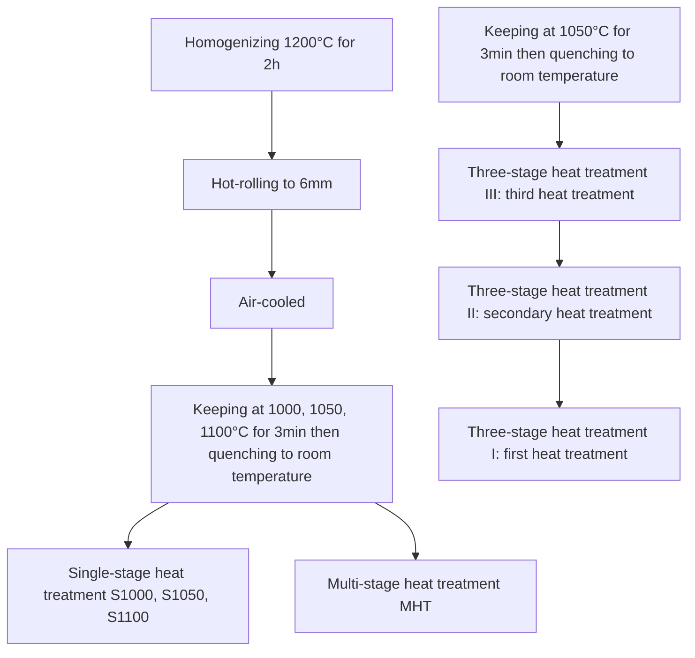

# Improving impact toughness of Fe–20Mn–9Al-1.5C–2Ni–3Cr low-density steel by optimizing grain boundaries via multi-stage heat treatment without compromising high strength and ductility

Lei Xiao 1 , Yanjun Zhou 1 , Chuheng Zhang, Yangyang Wang, Xiangtao Deng \* , Zhaodong Wang

State Key Laboratory of Rolling and Automation, Northeastern University, Shenyang, 110819, China

# A R T I C L E I N F O

Handling Editor:P Rios

Keywords:

Low-density steel

Multi-stage heat treatment

Strengthening mechanism

Toughness

Grain boundaries

Grain size

# A B S T R A C T

Fe–20Mn–9Al-1.5C–2Ni–3Cr low-density steel is subjected to multi-stage heat treatment (MHT) to improve the toughness while maintaining high strength and ductility. The mechanical properties and fracture behavior of MHT steel are compared with those resulting from single-stage heat treatment (S1000 and S1050) usnig SEM, EBSD, and TEM microstructural characterization. The grain sizes of S1000, S1050 and MHT are 3.17, 3.84, and 7.31 μm, respectively. The proportion of “special” grain boundaries changes from 71.7 % to 68.3 % and finally to 71.2 % (by length). Simultaneously, dissolution of intergranular Cr7C3 precipitates in S1000. The half-size impact energy of MHT is 88.6 % higher than that of S1000, reaching 55.1 J, and the ultimate tensile strength and total elongation are maintained at approximately 1100 MPa and 50 %, respectively. As demonstrated by quantitative analysis, the yield strength is maintained at 910 MPa due to solution, grain boundary, and precipitation strengthening, whereas the increase in toughness is due to the rise in the crack propagation energy. The increased toughness is derived from the combined effect of reducing the number of intergranular precipitates and a high percentage of “special grain boundaries".

# 1. Introduction

To cope with the increasingly serious environmental pollution and resource shortages, lightweight steels have become the focus of special interest [1–4]. However, when conventional methods are used to increase the strength of steels and reduce the size of the components, it is difficult to ensure the stiffness, which limits the development of lightweight steels. To overcome these challenges, considerable efforts have been made to develop high-strength lightweight steels [3,5–9]. A way is to make steels with lower density by alloying light elements such as Al with the Fe–Mn–C-base alloy system [10–12]. This approach induces a significant reduction in the density (for every 1 wt% of Al added, the density is reduced by 1.5 % [3]). In recent years, scholars have selectively added appropriate amounts of Ni and Cr to the Fe–Mn–Al–C system and used an appropriate heat treatment process to obtain excellent mechanical properties. Ni is one of the most effective forms of B2 with Al [13]. B2, as a non-homogeneous precipitated phase, is unshearable and can effectively improve the strain work-hardening ability of low-density steel [14]. Many studies have reported that the addition of Ni optimizes the mechanical properties of low-density steel [12,14–16]. The addition of Cr not only enhances the corrosion resistance of low-density steel, but also inhibits the formation of κ-carbides [17–20]. Kim [17] studied the effect of different contents of Cr on Fe–20Mn–12Al-1.5C, demonstrating that the appropriate content of Cr can inhibit the formation of κ-carbide, increase the content of soluble C in austenite, and confer excellent tensile properties to low-density steel (yield strength of 994 MPa, ultimate tensile strength of 1093 MPa, total elongation of 40 %).

Improving the impact toughness without compromising the strength of low-density steel is critical for several applications. The impact toughness represents the ability of a material to resist crack extension when subjected to an impact load, and its enhancement is largely dependent on increasing the energy required to cause fracture. This requires control of the mechanisms relevant to crack initiation and extension. Inhibiting crack propagation is the only way to toughen certain brittle materials. Even though the ductility does not increase, the toughness can be improved. Some toughening strategies rely on the formation of cracks with specific organizational structures such as lamellar structures [21,22] and nanotwins [23,24], as well as controlling the grain size [25,26] and grain boundary design [27–30]. The main mechanisms of toughening low-density steels involve the elimination of intergranular precipitates or regulation of the grain size.

The low-energy grain boundaries (so called “special” boundaries, such as annealing twins and their variants) provide better interfacial properties than random grain boundaries with high-angle (RHAGBs), which is reflected in the lower interfacial energy and resistance to grain boundary damage [31,32]. “Special” grain boundaries are characterized by a particular misorientation, low excess free volumes, and a high degree of atomic matching. They are described geometrically by a low “sigma number, $" \Sigma ( 3 < \Sigma \leqslant 2 9 )$ , which has been successfully applied to a variety of structural materials such as austenitic stainless steels [33], nickel-based alloys [34], and copper alloys [35].

Thus, designing the microstructure of Fe–Mn–Al–C–Ni–Cr lowdensity steel is an effective way to improve mechanical properties. The aim of this paper is to establish the relationship between microstructure and mechanical properties of Fe–Mn–Al–C–Ni–Cr low-density steel. Therefore, various typical microstructures are created through heat treatment to investigate the key microstructural characteristics that influence crack propagation resistance during impact process, and at the same time, the strength mechanism to maintain high strength is elucidated. This study provides guidance for the microstructure design of Fe–Mn–Al–C–Ni–Cr low-density steels with high strength and high impact toughness.

# 2. Experimental

# 2.1. Preparation of materials

An ingot of lightweight steel with a nominal composition of Fe–20Mn–9Al-1.5C–2Ni–3Cr (analyzed composition of Fe-20.3Mn-8.6Al-1.4C-2.1Ni-2.9Cr in wt.%) was produced using vacuum induction melting. The density of the steel, measured by the drainage method, was $6 . 7 8 ~ \mathrm { g / c m ^ { 3 } }$ , which was about 14 % lower than that of pure iron $( 7 . 8 7 ~ \mathrm { g / c m ^ { 3 } } )$ . The ingot was homogenized at $1 2 0 0 ^ { \circ } \mathrm { C }$ for 2 h then hotrolled at temperatures of $1 0 5 0 – 9 5 0 \ ^ { \circ } \mathrm { C }$ to produce a 6 mm sheet, followed by air cooling to room temperature. After hot rolling, the steel was subjected to single-stage and multi-stage heat treatments. The heat treatment schematic diagram is shown in Fig. 1. The single-stage heat treatment was performed as follows: (1) heat treatment at $1 0 0 0 ^ { \circ } \mathrm { C }$ for 3 min followed by quenching to room temperature, hereinafter referred to as S1000; (2) heat treatment at 1050 ◦C for 3 min followed by quenching to room temperature, hereinafter referred to as S1050; (3) heat treatment at $1 1 0 0 ^ { \circ } \mathrm { C }$ for 3 min followed by quenching to room temperature, hereinafter referred to as S1100. For comparison of tensile properties only. The multi-stage heat treatment was executed as follows: first, heat treatment at $1 0 0 0 ~ ^ { \circ } \mathrm { C }$ for 3 min followed by quenching to room temperature (first stage heat treatment), then heat treatment at $7 5 0 ~ ^ { \circ } \mathrm { C }$ for 15 min followed by quenching to room temperature (secondary stage heat treatment), and finally heat treatment at $1 0 5 0 ~ ^ { \circ } \mathrm { C }$ for 3 min, followed by quenching to room temperature (tertiary stage heat treatment), hereinafter referred to as MHT.

# 2.2. Microstructural characterization

The microstructures were characterized using a Zeiss Ultra 55 fieldemission scanning electron microscope (SEM) equipped with an electron backscatter diffraction (EBSD) probe and an FEI Tecnai G2 F20 transmission electron microscope. The contents of $\mathrm { M n } , \mathrm { A l } , \mathrm { N i } ,$ , and Cr in the steel were measured in the SEM mode using energy dispersive spectroscopy (EDS). However, because the EDS technique does not provide reliable values for the C content, the C content in austenite was calculated according to the following equation (1) and (2) $[ 3 6 , 3 7 ]$ . In this study, the average grain size, including twin boundaries, was measured by EBSD data combined with intercept lengths. Grain boundaries with Σ $\leq 2 9$ were classified as low-energy boundaries (hereinafter referred to as special boundaries); the other boundaries were classified as random boundaries with high energy (hereinafter referred to as RHABs). EBSD provided data on proportions of Σ boundaries expressed as a fraction of total grain boundary projected area. The SEM specimens were prepared by mechanical polishing and then etched using an etching solution comprising 40 ml $\mathrm { H N O } _ { 3 }$ and 100 ml ethyl alcohol. The EBSD specimens were chemically polished using colloidal silica without etching. TEM specimens were prepared as squares with a thickness of 0.5 mm and ground to 80 μm, then electrochemically polished in a twin-jet polishing apparatus using a solution of 10 % perchloric acid and 90 % methanol.

$$
\alpha_ {\gamma} = \lambda \sqrt {\mathrm{h} ^ {2} + \mathrm{k} ^ {2} + 1 ^ {2}} / 2 \sin \theta \tag {1}
$$

$$
\alpha_ {\gamma} = 3. 5 7 8 + 0. 0 3 3 \mathrm{X} _ {\mathrm{c}} + 0. 0 0 0 9 5 \mathrm{X} _ {\mathrm{Mn}} - 0. 0 0 0 2 \mathrm{X} _ {\mathrm{Ni}} + 0. 0 0 0 6 \mathrm{X} _ {\mathrm{Cr}} + 0. 0 0 5 6 \mathrm{X} _ {\mathrm{Al}} \tag {2}
$$

flowchart

Fig. 1. Schematic diagram of hot rolling and heat treatment.

# 2.3. Tensile and impact tests

Tensile and impact tests were conducted at room temperature. Tensile specimens were fabricated from sheets heat-treated along the rolling direction with a gauge length of 25 mm, gauge width of 4 mm, and gauge thickness of 5 mm. The tensile tests were conducted using an AI-7000-LAU10 instrument at a constant strain rate of 3 mm/min. The tensile strength was the maximum stress, and the yield strength was determined as the 0.2 % of the offset strength in the case of continuous yielding. The total elongation was measured at the fracture of the specimens. Impact tests were conducted on an L222.4452-DE pendulum impact test instrument using standard Charpy V-notch impact specimens (5 mm × 10 mm × 55 mm) at ambient temperature. The measured tensile and impact properties were the averages of three different tests for each condition.

# 3. Results

# 3.1. Microstructures

Fig. 2 shows the SEM micrographs and grain boundary distributions of S1000, S1050, and MHT. The micrographs show that the matrix microstructures of all steels comprise austenite. In S1000, elongated stripelike precipitates are distributed along the austenite grain boundaries in Fig. 2(a) shows, which are identified as $\mathrm { C r } _ { 7 } \mathrm { C } _ { 3 }$ by TEM. The temperature difference in the fabrication of S1050 and MHT causes the precipitates distributed along the grain boundaries to disappear in Fig. 2(b and c). Generally, annealing twins hinder dislocation motion. Therefore, in this study, annealing twins are included in the calculation of the grain size; the result is termed the effective grain size, deff. The calculated $\mathsf { d } _ { \mathrm { e f f } }$ values for S1000, S1050, and MHT are 3.17, 3.84, and 7.31 μm, respectively. To describe the distribution of different types of grain boundary features in the specimens in different states, the orientation difference angle is used to characterize the variation in the grain boundary features. Fig. 2(d‒f) shows the misorientation angle distribution of the low-density steels in the three states. The main peak of the misorientation angle is near $6 0 ^ { \circ }$ . As a result, most of the annealing twins have a Σ 3-orientation relationship with the parent grains, which corresponds to Σ 3-twins. Random high-angle grain boundaries are indicated by thick black lines, whereas special boundaries are indicated by thin red lines in Fig. 2(d‒f). The isolated island twin in Fig. 2(d‒f) is small and has no practical effect on optimizing the grain boundaries; however, it is counted in the statistics. The proportion of Σ3 grain boundaries is close to the 2/3 limit; thus, if the Σ3 grain boundary exceeds 2/3 in the statistics [38], it is only counted as 2/3, and if it does not exceed the limit, it is counted as the original value. The percentage of the “special” boundaries (≤Σ29) for S1000, S1050, MHT is statistically 71.7 %, 68.3 %, and 71.2 %, respectively.

The three specimens are analyzed by TEM to accurately characterize the phase composition. Fig. 3 shows the TEM micrographs of the three specimens. The selected area diffraction (SAED) patterns of austenite show additional faint superlattice diffraction spots (Fig. $3 ( \mathrm { b { - } f , j } )$ marked by the red dotted line). This indicates the presence of κ-carbide that is co-gridded with austenite. In addition, these κ-carbides have a certain orientation relationship with the austenite, that is, $[ 0 1 1 ] _ { \gamma } / / [ 0 1 1 ] _ { \kappa } .$ The dark-field (DF) TEM images corresponding to the additional diffraction spots show κ-carbide particles with sizes ranging from 3 to 10 nm (Fig. 3 (a–e, i) marked by the white arrow (point). Moreover, the elongated stripe-like precipitates on the austenite grain boundaries of S1000 are $\mathrm { C r } _ { 7 } \mathrm { C } _ { 3 } ,$ , as shown in Fig. 3(c and d). As the temperature increased to 1050 ${ } ^ { \circ } \mathbf { C } , \mathbf { C r } _ { 7 } \mathbf { C } _ { 3 }$ dissolves on the grain boundary. A small amount of B2, ranging in size from 20 to 160 nm, is present in the austenite, as shown in Fig. 3(g and h). The B2 phase is also present in MHT, as shown in Fig. 3(k, l), but its size is slightly smaller than that in S1050.

# 3.2. Tensile and impact properties

The engineering stress‒engineering strain curves are obtained from the tensile tests of the heat treatment specimens are shown in Fig. 4(a), and the corresponding true stress‒true strain curves and strain workhardening curves are shown in Fig. 4(b), indicated by solid and dashed lines, respectively. The yield strength (YS), ultimate tensile strength (UTS), total elongation (TEL), and impact energy values are summarized in Table 1. The three tensile specimens exhibit relatively high YS, UTS, and TEL at $2 5 ~ ^ { \circ } \mathrm { C } .$ . The YS and UTS decrease with increasing d . The ${ \tt d } _ { \mathrm { e f f } }$ increase from 3.17 μm in S1000 to 3.84 μm in S1050 and the YS and UTS concomitantly decrease by 10 MPa, whereas the TEL is similar for both samples. However, compared with S1050 with a ${ \bf d } _ { \mathrm { e f f } }$ of 3.84 μm, MHT with a larger ${ \bf d } _ { \mathrm { e f f } }$ of 7.31 μm has slighter lower ${ \mathrm { Y } } S ,$ UTS, and TEL values (declined by 35, 37, and 4.6 $^ { \% , }$ respectively) at ${ 2 5 ^ { \circ } \mathrm { C } }$ . This indicates that the change in the grain size within a certain range does not significantly affect the strength and ductility. To better illustrate the excellent tensile properties of the multi-stage heat treatment specimens, supplementary experiments are performed in

text_image

(a)
twins
Cr/C₃
20µm

text_image

(b)
twins
20µm

text_image

(c)
twins
20µm

bar

| Microorientation Angle | Number of Points |
| --------------------- | ---------------- |
| 0-10                  | 0.0              |
| 10-20                 | 0.0              |
| 20-30                 | 0.0              |
| 30-40                 | 0.0              |
| 40-50                 | 0.0              |
| 50-60                 | 0.7              |

scatter

| Minimization Angle | Ra Value |
| ------------------ | -------- |
| 60                 | 0.7      |

line

| Microorientation Angle* | Scale Factor |
| ---------------------- | ------------ |
| 0                      | 0.0          |
| 10                     | 0.1          |
| 20                     | 0.2          |
| 30                     | 0.3          |
| 40                     | 0.4          |
| 50                     | 0.5          |
| 60                     | 0.7          |

Fig. 2. Cross-sectional SEM, misorientation angle distribution micrographs of (a, d) S1000, (b, e) S1050, and (c, f) MHT.

text_image

(a)
κ-carbide
50nm

text_image

(b)
100
200
011̄ 111̄
[011]γ∥[011]κ

natural_image

Microscopic image showing a red-circled feature on a textured surface with a 500nm scale bar (no text or symbols beyond label)

text_image

(d)
220
0.21
[11̄2]Cr₇C₃

text_image

(e)
κ-carbide
50nm

text_image

(f)
2̅200 ̅11̅1
011̅
100
[011]ₜ / [011]ₖ

natural_image

Microscopic image showing a dark circular feature with a red circle, scale bar indicates 200nm (no text or symbols present)

text_image

(h)
101
011
[1̄11]B2

text_image

(i)
κ -carbide
50nm

text_image

(j)
200
111
011
100
[011]₇//[011]ₖ

natural_image

Microscopic image showing a nanoscale structure with a red circle highlighting a specific feature, scale bar indicates 500nm (no text or symbols present)

text_image

(l)
2̅1̅1
110
[113]B2

Fig. 3. TEM and SAED micrographs of precipitates in S1000 (a–d), S1050 (e–h), MHT (i–l), respectively.

line

| Engineering Strain/% | MHT   | S1000 | S1050 | S1100 |
| -------------------- | ----- | ----- | ----- | ----- |
| 0                    | 900   | 950   | 940   | 820   |
| 10                   | 950   | 980   | 970   | 850   |
| 20                   | 1000  | 1020  | 1010  | 880   |
| 30                   | 1050  | 1060  | 1055  | 920   |
| 40                   | 1080  | 1090  | 1085  | 950   |
| 50                   | 1100  | 1110  | 1105  | 980   |
| 60                   | 950   | 980   | 970   | 880   |

line

| True Strain | MHT   | S1000 | S1050 | S1100 |
| ----------- | ----- | ----- | ----- | ----- |
| 0.0         | 900   | 950   | 1400  | 800   |
| 0.1         | 1100  | 1200  | 1700  | 1000  |
| 0.2         | 1300  | 1400  | 1900  | 1200  |
| 0.3         | 1400  | 1500  | 1800  | 1300  |
| 0.4         | 1500  | 1600  | 1600  | 1400  |
| 0.5         | 1600  | 1700  | 1700  | 1500  |

Fig. 4. (a) Engineering stress‒strain curve and (b) true stress‒strain and strain work hardening rates with three different heat treatment processes.

which the samples were quenched after holding at $1 1 0 0 ~ ^ { \circ } \mathrm { C }$ for 3 min (indicated by the cyan line). The yield strength of the samples held at 1100 ◦C for 3 min decrease to 827 MPa and the tensile strength decrease to 998 MPa.

The work-hardening rates of S1000, S1050, and MHT gradually decrease, and the strain hardening of all steels go through three different stages. In the first stage, the strain-hardening rate decreases sharply within a narrow strain range, which is generally attributed to the dynamic recovery of dislocations. In the second stage, the strain hardening rate increases with the strain, and the strain hardening rate reaches a maximum of 2000 MPa at the strain interval of 0.20–0.22, after which the specimen transitioned to the third stage. In the third stage, the strainhardening rate decreases with increasing strain.

The tensile properties of MHT are comparable to those of S1000 and S1050 at ${ 2 5 \ ^ { \circ } \mathrm { C } } ,$ whereas the impact energy increases at $2 5 ~ ^ { \circ } \mathrm { C } .$ . The specific values of the impact energies are summarized in Table 1. Using the instrumented Charpy impact test, the impact behavior is studied in depth by constructing loading-displacement curves as shown in Fig. 5 (a). The total absorbed energy consists of the crack initiation energy and crack propagation energy, as shown in Fig. 5(b). S1000 has the lowest impact energy of only 29.2 J, whereas S1050 has the lower impact energy of 42.8 J, and MHT has the largest impact energy of 55.1 J, where the impact energy increases by 88.6 %. The difference in the impact energy of the three specimens is mainly due to the difference in the crack propagation energy, as shown in Fig. 5(b), which increases from 9.87 J for S1000 to 26.64 J for S1050 and finally to 36.78 J for MHT. The displacements of S1000, S1050, and MHT are 4.55, 6.30, and 8.04 mm, respectively. The relatively larger displacement of MHT means that a large amount of energy needs to be consumed during the propagation of cracks, and the absorbed strain energy increases, thus the impact energy increases [22].

Table 1 Mechanical properties of studied steels.

<table><tr><td>Steel</td><td>Grian size/μm</td><td>YS/MPa</td><td>UTS/MPa</td><td>EI/%</td><td>Impact energy/J</td></tr><tr><td>S1000</td><td>3.17</td><td>955 ± 7</td><td>1126 ± 3</td><td>55.5 ± 1.3</td><td>29.2 ± 2.0</td></tr><tr><td>S1050</td><td>3.84</td><td>945 ± 14</td><td>1113 ± 3</td><td>55.8 ± 0.4</td><td>42.8 ± 0.4</td></tr><tr><td>MHT</td><td>7.31</td><td>910 ± 7</td><td>1076 ± 2</td><td>50.9 ± 3.0</td><td>55.1 ± 2.2</td></tr></table>

Fig. 6 shows the SEM tensile fracture images of the three experimental steels. All steels show dimples, but the dimples are not uniform in size. Corresponding to the microstructural evolution in Figs. 2 and 3, Cr C on the grain boundaries of S1000 and B2 in the grains of S1050 and MHT does not significantly decrease the ductility of the steels. Underdeveloped dimples are present in MHT, and the plasticity is also slightly reduced.

Fig. 7 shows the SEM image fractograms of the impact specimens. The low-magnification fractograms (reduction maps with yellow borders) show that the shear zone areas of S1000, S1050, and MHT gradually increase. The larger the shear zone area, the better the toughness. The locally magnified micrographs of the radiation zone show quasicleavage planes in S1000 and S1050 and slip bands on the plane. These slip bands may have been caused by the large number of dislocations moving along the quasi-cleavage plane [28,39,40]. Microcracks and microvoids are observed in areas where the interaction of the slip bands is significant. The grain boundaries of S1000 are also apparent (marked by the red dashed line), and there is no obvious deformation, which is a characteristic of intergranular fractures. In the MHT sample, the dimples increase and microcracks disappear, but no quasi-cleavage plane, which is a ductile fracture, is observed.

# 4. Discussion

# 4.1. Microstructure evolution and tensile properties

The tensile properties varied slightly with the heat-treatment temperature. The yield strength of steel (σYS) is calculated by using the following expression: σYS = σ0 + σGR + σPPT [41].

line

| Displacement/mm | MHT    | S1050  | S1000  |
| --------------- | ------ | ------ | ------ |
| 0               | 0      | 0      | 0      |
| 2               | 12000  | 13000  | 14000  |
| 4               | 8000   | 7000   | 6000   |
| 6               | 4000   | 3000   | 2000   |
| 8               | 1000   | 500    | 300    |
| 9               | 500    | 200    | 100    |

bar_stacked

| Sample | Crack propagation energy/J (J) | Crack intitation energy/J (J) |
| :--- | :--- | :--- |
| S1000 | 12 | 18 |
| S1050 | 26 | 16 |
| MHT | 39 | 18 |

Fig. 5. (a) Load-displacement curves (b) energy absorbed for crack initiation and energy absorbed for crack propagation at three different heat treatment temperatures.

text_image

(a)
Dimple
0.5mm
10µm

text_image

(b)
Dimple
10µm
9.5mm

natural_image

Microscopic view of a dimple material surface showing porous structure with 10μm scale bar (no text or symbols beyond labels)

Fig. 6. Local magnification and low-magnification (reduction maps with yellow border) tensile fracture morphology of (a) S1000, (b) S1050, and (c) MHT. (For interpretation of the references to colour in this figure legend, the reader is referred to the Web version of this article.)

text_image

(a)
Microcrack
Quasi-cleavage
Microvoids
5µm

text_image

(b)
Microcrack
Quasi-cleavage
Microvoids
10µm

natural_image

Microscopic surface texture image showing dimple structure with 10μm scale bar, no textual annotations or symbols present

Fig. 7. Local magnification and low-magnification (reduction maps with yellow border) impact fracture morphology and of (a) S1000, (b) S1050, and (c) MHT. (For interpretation of the references to colour in this figure legend, the reader is referred to the Web version of this article.)

The parameter σ0 includes the lattice friction stress and solidsolution strengthening of the alloying elements $( \sigma _ { 0 } = 9 7 + 2 7 9$ wt% $\mathrm { ~ C ~ } + 1 . 5$ wt% Mn + 20.5 wt% Al + 2.9 wt% $\mathrm { N i } + 3 . 9$ wt% Cr [12,42]). The element distribution of S1000, S1050, and MHT measured by EDS is shown in Table 2. The C content is calculated with reference to the content of the other elements. The C content of S1000, S1050, and MHT produce solid-solution strengthening effects of 601, 609, and 599 MPa, respectively, where the values are similar. ${ \sigma } _ { \mathrm { G R } }$ is the grain boundary strengthening following the Hall-Petch relationship, calculated as $\sigma _ { \mathrm { G R } } =$ K ${ \mathsf { d } } _ { \mathrm { e f f } } ^ { - 1 / 2 } ;$ K is the slope of the Hall-Petch plot (461 MPa $\mu \mathrm { m } ^ { 1 / 2 } )$ [12,43] and $\mathsf { d } _ { \mathrm { e f f } }$ is the effective grain size of the recrystallized grains containing twin boundaries. The grain-boundary strengths of S1000, S1050, and MHT are 145, 120, and 63 MPa, respectively, which are slightly larger gap. Due to the addition of $\mathbf { A l } ,$ the austenitic steel rich in $\mathbf { A l } ,$ Mn, and C undergoes amplitude modulation decomposition during the quenching process, and the κ-carbide is precipitated. The fine κ-carbide in the austenite can improve the yield strength, tensile strength, and total ductility. Furthermore, the unshearable B2 phase [12,14,15] and the addition of Cr [17,19] both contributed to increasing the strength. However, the distribution, size, and quantity of κ-carbide after quenching of the all studied steels are semblable. as can be seen in the TEM images in Section 3.1, and the content of κ-carbide, B2, and $\mathrm { C r } _ { 7 } \mathrm { C } _ { 3 }$ could not be accurately measured. Thus, $\sigma _ { Y S } ~ - ~ \sigma _ { O } ~ - ~ \sigma _ { G R }$ is used to calculate σ . The calculated values for S1000, S1050, and MHT are 209, 216, and 248 MPa, respectively, which are not significantly different. This indicates that under the hot-rolling and heat-treatment temperature conditions used in this study, although the grain size and precipitate type changed, they do not significantly affect the ductility and work-hardening rate, allowing the Fe–20Mn–9Al-1.5C–2Ni–3Cr steel subjected to MHT to have good tensile properties.

# 4.2. Toughening mechanisms

In most metallic materials, grain boundaries are the first sites of metallurgical phenomena associated with fractures in polycrystalline materials, and the fracture of polycrystalline materials usually depends on grain size and the type and structure of the grain boundaries, such as the presence of grain boundary segregation, precipitation, and the

Table 2 Chemical composition of austenite in as-heat treatment specimens.

<table><tr><td>Steel</td><td>Mn</td><td>Al</td><td>Ni</td><td>Cr</td><td>C</td><td>Fe</td></tr><tr><td>S1000</td><td>20.97 ± 0.34</td><td>9.30 ± 0.02</td><td>2.04 ± 0.26</td><td>3.24 ± 0.78</td><td>1.17 ± 0.13</td><td>Bal.</td></tr><tr><td>S1050</td><td>21.09 ± 0.86</td><td>9.00 ± 0.11</td><td>2.19 ± 0.16</td><td>3.16 ± 0.17</td><td>1.22 ± 0.03</td><td>Bal.</td></tr><tr><td>MHT</td><td>20.76 ± 0.61</td><td>9.46 ± 0.33</td><td>2.01 ± 0.25</td><td>3.10 ± 0.57</td><td>1.15 ± 0.07</td><td>Bal.</td></tr></table>

frequency of RHAGBs [44]. Fig. 2(d‒f) shows the distribution of the grain boundaries in S1000, S1050, and MHT, the random boundary network should be fragmented well by special boundaries. Because intergranular cracking tends to propagate along random boundaries in the grain boundary network, uniformly distributed special boundaries can effectively arrest the propagation of deterioration [38]. Statistically, the proportions of special boundaries (Σ ≤ 29) for S1000, S1050, and MHT are 71.7 %, 68.3 %, and 71.2 %, respectively, with S1050 having the lowest amount, and there is no significant difference between the proportions for S1000 and MHT, which seems to be contradictory to the increase in the toughness.

Comparison of the crack initiation energy and crack propagation energy in Fig. 5(a and b) indicates that the crack initiation energy of S1050 is slightly lower than that of S1000 and MHT, where the latter two have comparable crack initiation energies. The crack propagation energy is the smallest for S1000, the second largest for S1050, and the largest for MHT. Therefore, the propagation zone is examined. Fig. 8 shows the cross-sections of the crack propagation zones of S1000, S1050, and MHT. Fig. 8(a and b) shows that the presence of $\mathrm { C r } _ { 7 } \mathrm { C } _ { 3 }$ at the grain boundaries in S1000 led to preferential nucleation of the cracks at the grain boundaries, as evidenced by the aggregated micropores at the grain boundaries in Fig. 5(a). The cracks generally follow the RHAGBs under further deformation extension. The special boundaries in S1000 have limited effect on changing the crack propagation or deflection. When the intergranular precipitates are eliminated in S1050, the grains grow and the special boundaries interfere with the RHAGBs; thus, further propagation of the intergranular cracks is inhibited, and the cracks propagate along the special boundaries (shown by the yellow dashed lines in Fig. 8(c) or are deflected (Fig. 8(d) shown by white arrows), producing ductile fracture in the form of a hybrid fracture mode with intergranular and transgranular fracture. Compared with S1050, MHT has a larger number of specific boundaries and larger grain size, which impedes dislocations emanating from the crack tip to a greater extent. Thus, compared with the straight crack path in S1050 (shown by the red dashed line in Fig. 8(c)), the crack paths in MHT constantly cross the special boundaries and are subjected to constant deflection and propagation (shown by in Fig. 8(e and f)). This process is exacerbated by larger grain sizes, which increase the effective length of the crack propagation, leading to greater energy dissipation; thus, the impact toughness increases by 29 %. Therefore, the toughening mechanism can be summarized as a combination of the elimination of intergranular precipitates and an increase in the frequency of special boundaries and grain size so that the direction of crack propagation can change, moving across or along the special boundaries, which increases the ability to resist cracking and improving the toughness.

The percentages of special boundaries in the three specimens are 71.7 %, 68.3 %, and 71.2 %, respectively. The percentage of “special” boundaries increases for the specimens subjected to 1050 $^ \circ \mathrm { C }$ (S1050) and multi-stage heat treatment processes. The number of twins in MHT increases (Fig. 2(d‒f)), but their size is smaller, indicating that the number of nucleation points for the twins increased, but growth is suppressed. Similar results have been reported for Mg alloys [45]. The intermediate heat treatment temperature of $7 5 0 ^ { \circ } \mathrm { C }$ applied to the MHT specimens resulted in the distribution of many precipitates at the grain boundaries, as shown in Fig. 9(a and b). These closely spaced precipitates led to an increase in the stress in the non-twinned regions, leading to a larger number of twin nucleation sites, and finally more special boundaries that interfered with the RHAGBs, thus affecting the toughness.

natural_image

Microscopic view of a material's grain structure with a highlighted region and 10μm scale bar (no text or symbols beyond label)

text_image

(c)
Straight cracking
Crack deflection
Across the twins
10µm

natural_image

Microscopic surface texture image showing cracks and pores, scale bar 20μm (no text or symbols)

text_image

(b)
Cr₇C₃
Cr₇C₃
5µm

text_image

(d)
Across the twins
5µm

text_image

(f)
Zigzag cracking
Crack deflection
Across the twins
10µm

Fig. 8. Cross-sectional SEM micrographs of crack propagation regions in (a, b) S1000, (c, d) S1050, (e, f) MHT.

In summary, optimizing grain boundaries increases the impact toughness, leading to two different types of crack propagation in the low-density steels in Fig. 10. The impact process can be divided into crack initiation and crack propagation stages according to the maximum load $\left( \mathrm { F } _ { \mathrm { m } } \right)$ . The area from the starting point to the loading peak is the crack initiation energy and the area from the loading peak to the fracture is the crack propagation energy. For S1000, the cracks propagate rapidly along the random high-angle boundaries with high energy, despite having a high percentage of special boundaries, cracks tend to nucleate at the grain boundaries because of the precipitates at the boundaries. Finally, the slope curve declines sharply in the crack propagation stage. However, the descent of the MHT curve slows down significantly in the crack propagation stage. With the disappearance of precipitates at the grain boundary, increasing grain size and frequency of the special boundaries due to multi-stage heat treatment, the crack propagation is hindered by the special boundaries with low energy in the austenite grains. As deformation continued, the crack paths propagate and are deflected along the special boundaries, and the propagation paths increase, resulting in increased energy consumption and improved impact toughness.

# 5. Conclusion

By comparing the effects of single-stage heat treatment at $1 0 0 0 ~ ^ { \circ } \mathrm { C }$ and 1050 ◦C and multi-stage heat treatment on the microstructure, mechanical properties, and fracture behavior of Fe–20Mn–9Al-1.5C–2Ni–3Cr low-density steels, the following conclusions are drawn:

(1) The microstructure of the single-stage heat treatment at $1 0 0 0 ^ { \circ } \mathrm { C }$ steel consists of austenite with a grain size of 3.17 μm, 71.7 % special boundaries with low energy, $\mathrm { C r } _ { 7 } \mathrm { C } _ { 3 }$ along the grain boundaries, and nanoscale κ-carbides (3–10 nm). When the temperature is increased to $1 0 5 0 \ { } ^ { \circ } \mathrm { C } , \mathrm { C r } _ { 7 } \mathrm { C } _ { 3 }$ dissolves, austenite grains grow to 3.84 μm, and the percentage of special boundaries decreases to 68.3 %. The multi-stage heat treatment facilitates the dissolution of the intergranular precipitates $\mathrm { C r } _ { 7 } \mathrm { C } _ { 3 }$ while maintaining a high proportion of special boundaries at 71.2 %.

natural_image

Microscopic view of a porous material structure with irregular polygonal grains and a 10μm scale bar (no text or symbols beyond label)

natural_image

Microscopic view of a material surface with visible cracks and texture, scale bar indicates 2μm (no text or symbols present)

Fig. 9. SEM micrographs of cross-section of samples subjected to (a) intermediate heat treatment at $7 5 0 ^ { \circ } \mathrm { C }$ in MHT process, and (b) low magnification the localized region of (a).

(a)

text_image

(a)
Crack propagation path
γ
R
R
R
C
G

(b)

text_image

(b)
Crack propagation path

Fig. 10. Schematic of crack propagation with differences in the grain boundaries in (a)S1000, and (b)MHT.

(2) After multi-stage heat treatment, the low-density steel shows a combination of high strength, high plasticity, and high toughness at room temperature. The multi-stage heat treatment affords an excellent combination of yield strength (910 MPa), ultimate tensile strength (1076 MPa), total elongation (50.9 %), and impact toughness (55.1 J) at room temperature. The calculations show that a high level of strength is primarily through solidsolution strengthening and precipitation strengthening.
(3) The multi-stage heat treatment exhibits the highest impact toughness of 55.1 J in three different heat treatment ways. The difference in the impact toughness is mainly derived from the increase in the crack propagation energy and is independent of the crack initiation energy. The highest impact toughness is fundamentally derived from the synergistic effect of the disappearance of intergranular precipitates and special boundaries with low energy.

# Declaration of competing interest

The authors declare the following financial interests/personal relationships which may be considered as potential competing interestsXiangtao Deng reports financial support was provided by National Basic Research Program, China. Xiangtao Deng reports financial support was provided by National Natural Science Foundation of China. Xiangtao Deng reports financial support was provided by Key R&D projects in Henan Province. Xiangtao Deng reports financial support was provided by Liaoning Revitalization Talents Program. If there are other authors, they declare that they have no known competing financial interests or personal relationships that could have appeared to influence the work reported in this paper.
