# Formation of precipitates and their effects on the mechanical properties in a Fe–Mn–Al–C austenitic low-density steel

Yongxuan Shang a , Xue Cao b , Wenqing Jiang a , Lixin Sun a , Shuyong Jiang a , Zhongwu Zhang a,c,\*

a College of Materials Science and Chemical Engineering, Harbin Engineering University, Harbin, 150001, China
b College of Computer Science and Technology, Harbin Engineering University, Harbin, 150001, China
c State Key Laboratory of Metal Material for Marine Equipment and Application, Iron & Steel Research Institute of Ansteel Group Corporation, Anshan, 114009, Liaoning, China

# A R T I C L E I N F O

# Keywords:

Low-density steels

κ-carbides

Precipitation

Strengthening mechanisms

Work-hardening

# A B S T R A C T

κ-carbides serve as a strengthening phase in Fe–Mn–Al–C austenitic low-density steels, enhancing yield strength but reducing the work hardening rate due to slip plane softening effect. To address this issue, this study introduces strong carbide-forming elements Ti and V to regulate carbon distribution and then control κ-carbide precipitation. Without Ti and V addition, κ-carbides uniformly precipitate in the matrix after aging, with an average size of 10.8 ± 6.2 nm and a volume fraction of 7.4 ± 3.4 %. The addition of Ti and V leads to the formation of (Ti, V)C carbides at high temperatures, which act as carbon sinks, reducing the matrix carbon content and thereby suppressing the homogeneous precipitation of κ-carbides. As a result, the κ-carbides precipitate at the edge of the (Ti, V)C carbides, with an average radius of 9.7 ± 8.5 nm and a volume fraction of 3.2 ± 2.8 %. Compared to the uniform precipitation of κ-carbides in low-density steel without Ti/V additions, this modified precipitation behavior preserves the work-hardening rate and increases the tensile strength from 1004 MPa to 1096 MPa. TEM analysis reveals that both steels exhibit planar slip deformation, but the Ti/V-modified steel shows narrower slip band spacing and more intense plastic deformation. This study establishes a novel microalloying strategy for optimizing precipitate distribution and mechanical properties in low-density steels.

# 1. Introduction

Fe–Mn–Al–C austenitic low-density steels exhibit an excellent combination of mechanical properties, making them a crucial material for automotive industry applications [1–5]. To enhance its crashworthiness, future research should focus on improving both yield strength and work-hardening capacity. The high Mn, Al, and C concentrations enhance κ-carbide precipitation during cooling/aging, ultimately altering the microstructure and mechanical properties [2,6,7].

The κ-carbide precipitation process occurs as follows: First, the supersaturated austenite matrix decomposes into solute-depleted and solute-enriched regions. When sufficient driving force is attained, the solute-enriched regions transform into L -ordered domains. Concur rently, carbon atoms undergo ordering to form κ-carbides [8,9]. Through optimized composition design and controlled heat treatment, the intragranular precipitation of κ-carbides can be regulated [10]. The κ-carbides discussed hereafter refer specifically to the intragranular κ-carbides. The precipitation mechanism of κ-carbides is generally attributed to spinodal decomposition, which requires compositional fluctuations [5,11–13]. Consequently, in a matrix with homogeneous chemical composition, κ-carbides exhibit a uniform distribution [14–17]. κ-carbides typically contribute a strength increment of 150–300 MPa [1,4,18]. Due to the characteristically high stacking fault energy (SFE) of austenitic low-density steels, their predominant deformation mechanism involves planar dislocation slip [19].

κ-carbide precipitation control effectively enhances yield strength, with thermomechanical processing enabling regulation of their size and density. However, the achievable strengthening effect remains inherently limited. Furthermore, the precipitation of κ-carbides in austenite promotes planar dislocation slip through glide plane softening. This phenomenon occurs when the leading dislocation partially disrupts the local ordered structure, thereby reducing the lattice friction stress for subsequent dislocations on the same slip plane. Consequently, numerous researchers have explored alloying element additions to further increase strength. These alloying elements can be categorized into two distinct types. The first category comprises elements that do not form additional precipitate phases, yet influence κ-carbide precipitation. These elements typically include Mn, Al, C, and Si [19–26]. Mn, Al, and C serve as both κ-carbide formers and essential austenite-stabilizing elements. $\mathrm { { A l } , C , }$ and Si promote κ-carbide precipitation, while Mn inhibits κ-carbide formation due to its austenite-stabilizing effect and limited lattice distortion [27]. Wu et al. [28] modulated the κ-carbide volume fraction through Al content control. Their results demonstrated that increased κ-carbide precipitation reduced the work-hardening rate by impeding slip band evolution. When Kim et al. [24] demonstrated that 1 % Si addition in low-density steel maintained the matrix phase composition while altering the κ-carbide characteristics. Specifically, Si modified the carbon stoichiometry in κ-carbides and increased their lattice parameter, inducing high coherent strain with the matrix that ultimately restricted slip band activation. An additional precipitated phase was formed when another category of element was added. The addition of V, forming VC precipitates, effectively enhanced both the yield strength and initial work-hardening rate. However, evaluating the specific effect of V addition on work-hardening mechanisms was complicated by concurrent variations in ferrite content and dislocation density [29]. When maintaining constant VC content, κ-carbide precipitation simultaneously enhances yield strength while reducing work-hardening capacity [30]. Cr suppresses grain-boundary κ-carbides via austenite stabilization, without affecting intragranular formation [31]. Kim et al. [32] introduced Cr to austenitic low-density steel, resulting in the formation of $\mathrm { C r } _ { 7 } \mathrm { C } _ { 3 }$ carbides and $\mathrm { D O } _ { 3 } { \cdot }$ -ordered phases during aging. While this approach enhanced yield strength, it concurrently induced substantial plasticity reduction [33]. Joonoh et al. [34] demonstrated that Mo additions below 4 wt% suppressed κ-carbide precipitation without forming secondary carbides. However, when Mo content exceeded 4 wt %, Mo-enriched precipitates emerged, leading to significant yield strength enhancement. Adding Cu to austenitic low-density steel can promote the precipitation of κ-carbide. The κ-carbide can also promote the precipitation of Cu-rich phase with face-centered cubic (FCC) structure.; however, the effect of its mechanical properties remains to be studied [35]. The addition of Ni induces B2 phase formation [36–38], which precipitates during aging. This B2 phase significantly enhances the work-hardening rate [38].

In summary, while κ-carbide precipitation enhances yield strength, it reduces work-hardening capacity. This occurs because uniformly distributed κ-carbides soften glide planes. The first category of alloying elements modifies only the size and number density of κ-carbides without eliminating their adverse effect on work hardening. In contrast, the second category induces precipitation of secondary phases but neither alters κ-carbide distribution nor significantly affects their workhardening behavior, despite providing additional yield strength enhancement. To address the trade-off between yield strength and workhardening capacity caused by uniformly distributed κ-carbides, a novel alloy design strategy is proposed that introducing strong carbideforming elements Ti and V to form (Ti, V)C precipitates. The (Ti, V)C carbides are act as carbon sinks, altering the distribution of carbon content within the matrix and thereby inhibiting the homogeneous precipitation of κ-carbides. Meanwhile, localized carbon enrichment at the edge of (Ti, V)C carbides promote heterogeneous precipitation of κ-carbides. Through aging treatment, this approach not only enhances yield strength but also preserves work-hardening ability by tailoring the slip band evolution via non-uniform κ-carbide distribution.

# 2. Experiments

# 2.1. Preparation of the experimental steel

The chemical composition of the low-density steel used in this study is listed in Table 1. The difference in the carbon content of the two components is mainly because of the combination of Ti and V. The material was melted in a high-vacuum electric-arc melting furnace. Next, the ingots were hot rolled from 20 to 2 mm at 1000 ◦C followed by water quenching. Subsequently, the samples were solution-processed at 1000 ◦C for 30 min and water quenched, followed by aging at $5 5 0 ^ { \circ } \mathrm { C }$ for 10h and 30h, followed again by water quenching. The two steels after solution treatment were named M1-SS and M2-SS. After aging treatment, they were named M1-30, M2-10 and M2-30.

# 2.2. Microstructural analyses and mechanical property tests

Metallographic samples were extracted parallel to the rolled surface of the steel plate. The samples were sequentially ground using silicon carbide abrasive papers with progressively finer grits to eliminate surface scratches, followed by final polishing with 1.5 μm diamond suspension. Microstructural etching was performed with a 3 % $\mathrm { F e C l } _ { 3 } + 1 0$ % HCl (in ethanol) solution for 10–20 s. The phase morphology was then characterized using an optical microscope (OM, NOVEL, MR5000) at 200 × magnification, and the grain size was measured according to GB/ T 6394-2002.

For electron backscattered diffraction (EBSD, Zeiss Ultra 55) analysis, the observation plane was maintained consistent with the metallographic examination surface. The preparation involved mechanical grinding and polishing, followed by electrochemical polishing to achieve strain-free surfaces. Scanning electron microscopy (SEM, Thermo Fisher Scientific, Apreo S LoVac) was used to evaluate the distribution of the (Ti, V)C carbides, with sample preparation methods consistent with those for EBSD testing.

The microstructure characteristics, including morphology, chemical composition and dislocation configuration of each phase were investigated by transmission electron microscopy (TEM, Thermo Fisher Scientific, Talos F200X G2) using both bright-field (BF) and dark-field (DF) imaging modes, while selected area electron diffraction (SAED) patterns were employed for crystal structure analysis. TEM samples were mechanically ground to a uniform thickness of 50 μm, and 3 mm diameter discs were punched from the samples. The discs were then thinned to electron transparency using a Gatan precision ion polishing system. Electron probe microanalysis (EPMA) was utilized to measure the carbon content at specific matrix positions, following the same preparation method for EBSD testing.

Tensile test specimens (2 mm thick, 58 mm long) were fabricated along the rolling direction. The specimens were ground with silicon carbide abrasive papers to remove surface scratches and tested at room temperature using an electronic universal testing machine (SUNS, UTM5105X) with a strain rate of $1 0 ^ { - 3 } s ^ { - 1 }$ . A 12.5 mm extensometer was used to measure gauge-length deformation, and the yield strength was determined at a 0.2 % offset.

# 3. Results

# 3.1. Microstructure characteristics

Fig. 1 presents the optical micrographs of M1 and M2 specimens.

Table 1 Chemical composition of experimental steels.

<table><tr><td></td><td>Fe</td><td>Mn</td><td>Al</td><td>C</td><td>Si</td><td>Cr</td><td>Mo</td><td>V</td><td>Ti</td></tr><tr><td>M1</td><td>Bal.</td><td>20.17</td><td>8.12</td><td>0.61</td><td>0.17</td><td>0.40</td><td>0.31</td><td>-</td><td>-</td></tr><tr><td>M2</td><td>Bal.</td><td>20.04</td><td>8.05</td><td>0.85</td><td>0.18</td><td>0.42</td><td>0.34</td><td>0.62</td><td>0.09</td></tr></table>

natural_image

Microscopic view of a material's grain structure with polygonal grains, scale bar indicating 50μm (no text or symbols present)

natural_image

Microscopic view of a material's grain structure with visible cracks and inclusions, scale bar indicates 50μm (no text or symbols present)

natural_image

Microscopic view of a material's grain structure with 50μm scale bar (no text or symbols beyond label)

natural_image

Microscopic view of a material's grain structure with 50μm scale bar (no text or symbols beyond label)

Fig. 1. Metallographic structure of (a): M1-SS, (b): M1-30, (c): M2-SS, (d): M2-30.

Fig. 1 (a) and (b) show the solution-treated and 30 h aged conditions of M1 steel respectively, both exhibiting equiaxed grain morphology. After aging treatment, the grain size of M1 specimen shows no significant change, maintaining an average of 45.3 ± 9.3 μm. Fig. 1 (c) and (d) display the microstructures of M2 steel in solution-treated and aged 30 h conditions. The M2 steel also demonstrates equiaxed grains with an average size of approximately 32.3 ± 10.4 μm. Compared with M1 steel, the Ti and V-added M2 steel shows significantly refined grain size. Thermodynamic calculations of the phase composition confirm that the matrix remains single-phase austenite after aging treatment [39]. The grain sizes of M1 and M2 are listed in Table 2.

Fig. 2 shows the EBSD orientation distribution maps of M2-SS and M2-30. The random color distribution in both samples indicates the absence of significant texture in either state. As seen in Fig. 2 (a), the microstructure shows a bimodal distribution of grains. There are still some small grains embedded around larger ones, indicating that these grains did not grow fully during solution treatment. Upon aging, the smaller grains grow slightly while the larger ones remain almost unchanged, leading to the unimodal distribution of grains in M2-30.

Fig. 3 (a) presents the austenite matrix of M1 after solution treatment. Since Cr and Mo do not precipitate at the solution temperature, no precipitates are observed within the austenite matrix. In contrast, Fig. 3 (b) displays the microstructure of M2-SS, which contains precipitates in addition to the matrix. Given that the precipitation temperatures of Ti and V exceed 1000 ◦C [40], these precipitates are identified as (Ti, V)C carbides. The intragranular (Ti, V)C carbides exhibit an average size of 35.8 ± 20.1 nm.

Fig. 4(a–j) presents the precipitates formed in M1 and M2 after aging treatment. Fig. 4(a–c) displays BF image, DF image, and SAED pattern of κ-carbides in M1 steel aged for 30 h. It can be seen from Fig. 4(a) and (b), a large number of κ-carbides with a number density of around $7 \times 1 0 ^ { 2 2 }$ m 3 are uniformly distributed in the Ti- and V-free M1 steel. These

Table 2 Grain size of experimental steels.

<table><tr><td></td><td>M1-SS</td><td>M1-30</td><td>M2-SS</td><td>M2-30</td></tr><tr><td>Grain Size (μm)</td><td>42.4 ± 7.8</td><td>45.3 ± 9.3</td><td>32.3 ± 10.4</td><td>35.8 ± 12.7</td></tr></table>

phenomena have also been reported in some other researches. For instance, Yao et al. [14] reported that in Ti and V-free austenitic low-density steels, TEM DF imaging revealed a high density of uniformly distributed κ-carbides. Fig. 4(d–f) shows κ-carbides and (Ti, V)C carbides in M2 steel aged for 10 h. The SAED image shows the presence of (Ti, V) C carbides and κ-carbides. Notably, although the precipitation of κ-carbide is limited to aging time, it preferentially precipitates at the edge of (Ti, V)C carbides, while almost no κ-carbides precipitate in the matrix. Fig. 4(g–j) characterizes κ-carbides and (Ti, V)C carbides in M2 steel aged for 30 h. The results obtained from BF image and SAED image confirm the presence of two types of precipitates in the M2-30 sample. These precipitates were further characterized using centered dark-field (CDF) imaging, as demonstrated in Fig. 4(h) and (i). Fig. 4 (h) shows the CDF image of κ-carbides, revealing increased number density and larger size compared to the 10 h aged sample, with the distribution remaining heterogeneous. Fig. 4 (i) presents the CDF image of (Ti, V)C carbides, demonstrating that κ-carbides still predominantly precipitate at the edge of (Ti, V)C carbides.

Overall, without (Ti, V)C carbides, a large number of κ-carbides can form and distribute uniformly. With the introduction of (Ti, V)C carbides, the content of C can be consumed by the formation of (Ti, V)C carbides. More importantly, (Ti, V)C carbides can act as the nucleation sites of κ-carbides, leading to the decrease in number density of κ-carbides and the dependence of distributions of κ-carbides on that of the (Ti, V)C carbides.

Table 3 shows the volume fraction and mean radius of (Ti, V)C carbides and κ-carbides. Ti/V addition reduces the size and volume fraction of κ-carbide by suppressing precipitation, as insufficient matrix carbon content cannot support. In M2, the size and volume fraction of (Ti, V)C do not change, because (Ti, V)C is precipitated at a high temperature and exists stably. Its precipitation does not change under aging.

Fig. 5 shows the mapping of M2-30 under TEM, and it can be observed that V is obviously enriched at the location of (Ti, V)C carbides. Ti is not observed enrichment as shown in Fig. 5. As for κ-carbides, no Mn or Al enrichment can be determined, indicating that the formation of κ-carbides maybe not through composition enrichment but by composition ordering. This phenomenon has also been reported by Zhang et al. [41]. They also observed that the formation of κ-carbides is not through

natural_image

Microstructure image of M2-SS material showing colorful grain patterns (no text or symbols)

natural_image

Colorful 3D microstructure image of M2-30 alloy with scale bar (50μm), showing grain boundaries and color variations (no text or symbols beyond labels)

Fig. 2. Inverse pole figure (IPF) of (a): M2-SS and (b): M2-30.

natural_image

Microscopic view of a material surface with a 1μm scale bar, showing a V-shaped indentation (no text or symbols beyond label)

text_image

(b)
(Ti, V) C
1µm

Fig. 3. BF of M1-SS(a) and M2-SS(b).

the element enrichment.

Fig. 6 presents the (Ti, V)C carbides and κ-carbides in M2-30 at a higher magnification. Fig. 6 (a) displays the BF image, where the precipitation sites of κ-carbides can be more clearly observed. Fig. 6 (b) shows the high-resolution transmission electron microscopy (HRTEM) image of the region outlined in the purple box in Fig. 6 (a), demonstrating a typical intergrowth of κ-carbide and (Ti, V)C carbide. Combined with the locally magnified image in Fig. 6 (a), these results indicate a linear alignment of κ-carbides in the blue box. The selected area contains the matrix, κ-carbide, and (Ti, V)C carbide, as shown in Fig. 6 (c). The Fast Fourier Transform (FFT) analysis confirms that the (002) plane of (Ti, V)C is parallel to the (001) plane of κ-carbide, denoted as $( 0 0 2 ) _ { \mathrm { ( T i } } ,$ V)C || (001)κ.

# 3.2. Mechanical properties

Fig. 7 presents the tensile curves of M1 and M2 steels after solution and aging treatments. The yield strength of solution-treated M1 steel was approximately 430 MPa, which increased to 860 MPa after aging due to homogeneous κ-carbide precipitation, accompanied by a reduction in elongation to 40 %. In comparison, solution-treated M2 steel exhibited a \~200 MPa higher yield strength than M1. After aging, M2 reached a yield strength of 884 MPa with only a slight decrease in elongation. The work-hardening rate curves revealed that aged M1 steel showed a significant reduction in work-hardening rate (solid black vs dashed lines), whereas aged M2 steel maintained a work-hardening rate comparable to its solution-treated state (solid red vs dashed lines), ultimately enhancing the tensile strength.

# 4. Discussion

# 4.1. κ precipitation

1) Importance of high-temperature precipitates:

From a compositional standpoint of κ-carbides, these precipitates exhibit enrichment of Mn, Al, and C relative to the matrix. Since M1 and M2 possess identical Mn and Al concentrations while demonstrating markedly different precipitation behaviors (homogeneous κ-carbide precipitation in M1 versus heterogeneous precipitation in M2 after aging), hence, neither Mn nor Al plays a determining role in governing the precipitation sites of κ-carbides. Carbon is identified as the predominant factor governing κ-carbide precipitation. The addition of carbide-forming elements such as Cr and Mo resulted in the precipitation of another carbide. These precipitates did not interfere with each other. And the precipitation positions of κ-carbides were uniform. These two precipitates precipitated in a similar temperature range and could not change the distribution of carbon elements. This necessitates regulation of the matrix carbon content prior to aging treatment. Consequently, the formation of high-temperature precipitates becomes essential. The addition of Ti and V promotes the precipitation of (Ti, V)C carbides before aging, which effectively modulates the residual carbon concentration in the matrix. As shown in Fig. 8, carbon is enriched at the center of (Ti, V)C carbides and shows a gradual decrease toward the edges, with a surrounding carbon-rich region exceeding the matrix content.

2) Necessity of matrix carbon content

The addition of high-temperature carbides is not enough to change the precipitation positions of κ-carbides. In previous studies, the addition of 1.5 % carbon content could result in carbon reaching a saturation state in the matrix [42], and the κ-carbides were uniformly precipitated during aging. For a supersaturated state of carbon in the matrix, the distance between the carbon-poor and carbon-rich regions is very small, which leads to the fine and uniform precipitation of κ-carbides. In our previous study, in low-density steel of the same composition as that in this work, a small amount of decarbonization during the solution processing could lead to the decomposition of austenite [39], which proved that the carbon in the matrix was not sufficient at this time.

Fig. 4. TEM micrographs of precipitates: (a) BF image of κ in M1-30; (b) DF image of κ in M1-30; (c) SAED pattern of κ in M1-30; (d) BF image of κ and (Ti, V)C in M2-10; (e) DF image of κ and (Ti, V)C in M2-10; (e) SAED pattern of κ and (Ti, V)C in M2-10; (g) BF image of κ and (Ti, V)C in M2-30; (h) DF image of κ in M2-30; (i) DF image of (Ti, V)C in M2-30; (j) SAED pattern of κ and (Ti, V)C in M2-30.
Table 3 Volume fraction and mean radius of (Ti, V)C and κ

<table><tr><td>Samples</td><td></td><td>(Ti, V) C</td><td>κ</td></tr><tr><td rowspan="2">M1-SS</td><td>Volume fraction (%)</td><td>-</td><td>-</td></tr><tr><td>Mean radius (nm)</td><td>-</td><td>-</td></tr><tr><td rowspan="2">M1-30</td><td>Volume fraction (%)</td><td>-</td><td>7.4 ± 3.4</td></tr><tr><td>Mean radius (nm)</td><td>-</td><td>10.8 ± 6.2</td></tr><tr><td rowspan="2">M2-SS</td><td>Volume fraction (%)</td><td>2.4 ± 1.4</td><td>-</td></tr><tr><td>Mean radius (nm)</td><td>35.8 ± 20.1</td><td>-</td></tr><tr><td rowspan="2">M2-30</td><td>Volume fraction (%)</td><td>2.3 ± 1.7</td><td>3.2 ± 2.8</td></tr><tr><td>Mean radius (nm)</td><td>37.1 ± 22.6</td><td>9.7 ± 8.5</td></tr></table>

Fig. 9 presents a schematic illustration of the microstructural evolution in M2 steel during aging treatment. Before aging treatment, preexisting (Ti, V)C carbides (denoted by white circles) are distributed in the matrix, accompanied by surrounding carbon-enriched zones (indicated by green areas surrounding (Ti, V)C carbides). Upon aging at $5 5 0 ~ ^ { \circ } \mathrm { C } ,$ κ-carbides (represented by gray rectangles) preferentially precipitated along the edge of (Ti, V)C carbides, utilizing these carbon-

rich regions as precipitation sites.

# 4.2. Strengthening mechanism

In M1 steel, the κ-carbides precipitate after aging, whereas in M2 steel, (Ti, V)C carbides are precipitated in the solid-solution state while κ-carbides precipitate after aging. Both these types of precipitations increase the yield strength. Therefore, it is necessary to quantify them in detail.

For M1-30 and M2-30, the yield strength can be expressed as:

$$
\sigma_ {y} = \sigma_ {0} + \sigma_ {G} + \sigma_ {D} + \sigma_ {P} \tag {1}
$$

where the $\sigma _ { y }$ is the yield strength and $\sigma _ { 0 } , \sigma _ { G } , \sigma _ { D } ,$ , and $\sigma _ { P }$ represent the matrix strength, grain-boundary strengthening, dislocation strengthening, and precipitation strengthening, respectively [43,44]. Therein, σ includes the lattice friction stress and solution strengthening. As for grain-boundary strengthening $\sigma _ { G } ,$ the Hall–Petch relation is adopted:

$$
\sigma_ {G} = k _ {y} D ^ {- \frac {1}{2}} \tag {2}
$$

where $k _ { \mathrm { y } } = 6 8 3 \ \mathrm { M P a \mu m } ^ { 1 / 2 }$ is the Hall–Petch constant [45] and D is the average grain size of austenite. Since both M1 and M2 underwent high-temperature solution treatment, dislocation strengthening can be essentially neglected [42].

In the case of precipitation strengthening, the interaction between the κ-carbides and dislocation may be shearing or bypass. As the critical size of κ-carbides is greater than 20 nm [24], the shearing mechanism of κ-carbides is adopted in this study. The shearing mechanism includes coherency strengthening, modulus-mismatch strengthening, order strengthening, chemical strengthening, and stacking-fault strengthening [24]. Among these, chemical and stacking-fault strengthening have little impact on the yield strength of austenite low-density steel.

text_image

BF
(Ti, V)C
Fe
Mn
50nm
Al
50nm
Si
50nm
Cr
50nm
Mo
50nm
V
50nm
Ti
50nm
50nm

Fig. 5. BF image of the precipitates and the composition mapping of M2-30.

text_image

(a)
(Ti, V) C
α Carbides
50nm

natural_image

Microscopic image showing a textured surface with a highlighted region and 10nm scale bar (no text or symbols beyond labels)

text_image

(c)
(002) γ
(002) (Ti, V)C
(001) κ
Z=[110]

Fig. 6. (a) BF image of the precipitates in M2-30; (b) HRTEM of the matrix and precipitates; (c) the FFT patterns image of precipitates and matrix.

The coherency strengthening $\sigma _ { \mathrm { { c s } } }$ is expressed as

$$
\sigma_ {c s} = M \alpha (G \varepsilon_ {c}) ^ {3 / 2} \left(\frac {r f}{0 . 5 G b}\right) ^ {1 / 2} \tag {3}
$$

where $M = 3 . 0 6$ is the Taylor factor for FCC metals; $\alpha = 2 . 6$ is a constant; $\varepsilon _ { \mathrm { c } } = 0 . 6$ is the constrained lattice parameter misfit; r and f are the mean radius and volume fraction, respectively, of the κ-carbides; $G = 7 0 . 7$ GPa is the shear modulus of austenite; and $b = 0 . 2 6$ nm is the Burgers vector.

The modulus-mismatch strengthening $\sigma _ { \mathrm { m s } }$ is expressed as

$$
\sigma_ {m s} = M 0. 0 0 5 5 (\Delta G) ^ {3 / 2} \left(\frac {2 f}{G}\right) ^ {1 / 2} \left(\frac {r}{b}\right) ^ {\frac {3 m}{2} - 1} \tag {4}
$$

where $\Delta G = 2 3 . 7 \mathrm { G P a }$ is the modulus misfit between the austenite and κ-carbides and $m = 0 . 8 5$ is a constant for FCC metals.

The order strengthening ${ \sigma } _ { \mathrm { o s } }$ is expressed as

$$
\sigma_ {o s} = M 0. 8 1 \frac {\gamma_ {a p b}}{2 b} \left(\frac {3 \pi f}{8}\right) ^ {1 / 2} \tag {5}
$$

where $\gamma _ { a p b }$ is the anti-phase boundary energy.

line

| Engineering strain | M1-SS | M1-30 | M2-SS | M2-30 |
| ------------------ | ----- | ----- | ----- | ----- |
| 0.0                | 450   | 900   | 700   | 950   |
| 0.2                | 600   | 950   | 850   | 1050  |
| 0.4                | 750   | 1000  | 950   | 1100  |
| 0.6                | 800   | 850   | 800   | 950   |
| 0.8                | 550   | 800   | 750   | 850   |

line

| True strain | M1-SS (True stress MPa) | M1-30 (True stress MPa) | M2-SS (True stress MPa) | M2-30 (True stress MPa) | M1-SS (Strain hardening rate MPa) | M1-30 (Strain hardening rate MPa) | M2-SS (Strain hardening rate MPa) | M2-30 (Strain hardening rate MPa) |
| ----------- | ------------------------ | ------------------------ | ------------------------ | ------------------------ | ---------------------------------- | ---------------------------------- | ---------------------------------- | ---------------------------------- |
| 0.0         | ~4000                    | ~4000                    | ~4000                    | ~4000                    | ~4000                              | ~4000                              | ~4000                              | ~4000                              |
| 0.1         | ~1800                    | ~1500                    | ~1600                    | ~1700                    | ~1800                              | ~1900                              | ~1700                              | ~1800                              |
| 0.2         | ~1600                    | ~1400                    | ~1500                    | ~1600                    | ~1600                              | ~1700                              | ~1500                              | ~1600                              |
| 0.3         | ~1500                    | ~1300                    | ~1400                    | ~1500                    | ~1500                              | ~1600                              | ~1400                              | ~1500                              |
| 0.4         | ~1400                    | ~1200                    | ~1300                    | ~1400                    | ~1400                              | ~1500                              | ~1300                              | ~1400                              |
| 0.5         | ~1300                    | ~1100                    | ~1200                    | ~1300                    | ~1300                              | ~1400                              | ~1200                              | ~1300                              |

Fig. 7. The mechanical properties of low-density steels (a) Engineering stress- Engineering strain curve; (b) True stress-True strain curve and strain hardening rate curve.

natural_image

Microscopic image showing a dark irregular particle with a dashed outline and an arrow pointing to it, scale bar indicates 100 nm (no text or symbols beyond label)

text_image

(b)
Profile of (Ti, V)C
Carbon rich region
100 nm
Counts
136.00
127.88
119.75
111.63
103.50
95.38
87.25
79.13
71.00
62.88
54.75
46.63
38.50
30.38
22.25
14.13
6.00

Fig. 8. EPMA images of M2-SS: (a) mapping domain, (b) C distribution around the (Ti, V)C carbides.

```mermaid
graph TD
    A["(Ti, V)C"] --> B["Red circle"]
    A --> C["Green circle"]
    D["(Ti, V)C"] --> E["Orange circle"]
    D --> F["Green circle"]
    G["(Ti, V)C"] --> H["Yellow circle"]
    G --> I["Green circle"]
    J["(Ti, V)C"] --> K["Gray square"]
    L["(Ti, V)C"] --> M["Gray square"]
    N["(Ti, V)C"] --> O["Gray square"]
    P["(Ti, V)C"] --> Q["Gray square"]
    R["(Ti, V)C"] --> S["Gray square"]
    T["(Ti, V)C"] --> U["Gray square"]
    V["(Ti, V)C"] --> W["Gray square"]
    X["(Ti, V)C"] --> Y["Gray square"]
    Z["(Ti, V)C"] --> AA["Gray square"]
    AB["(Ti, V)C"] --> AC["Gray square"]
    AD["(Ti, V)C"] --> AE["Gray square"]
    AF["(Ti, V)C"] --> AG["Gray square"]
    AH["(Ti, V)C"] --> AI["Gray square"]
    AJ["(Ti, V)C"] --> AK["Gray square"]
    AL["(Ti, V)C"] --> AM["Gray square"]
    AN["(Ti, V)C"] --> AO["Gray square"]
    AP["(Ti, V)C"] --> AQ["Gray square"]
    AR["(Ti, V)C"] --> AS["Gray square"]
    AT["(Ti, V)C"] --> AU["Gray square"]
    AV["(Ti, V)C"] --> AW["Gray square"]
    AX["(Ti, V)C"] --> AY["Gray square"]
    AZ["(Ti, V)C"] --> BA["Gray square"]
    BB["(Ti, V)C"] --> BC["Gray square"]
    BD["(Ti, V)C"] --> BE["Gray square"]
    BF["(Ti, V)C"] --> BG["Gray square"]
    BH["(Ti, V)C"] --> BI["Gray square"]
    BJ["(Ti, V)C"] --> BK["Gray square"]
    BL["(Ti, V)C"] --> BM["Gray square"]
    BN["(Ti, V)C"] --> BO["Gray square"]
    BP["(Ti, V)C"] --> BQ["Gray square"]
    BR["(Ti, V)C"] --> BS["Gray square"]
    BT["(Ti, V)C"] --> BU["Gray square"]
    BV["(Ti, V)C"] --> BW["Gray square"]
    BX["(Ti, V)C"] --> BY["Gray square"]
    BZ["(Ti, V)C"] --> CA["Gray square"]
    CB["(Ti, V)C"] --> CD["Gray square"]
    CE["(Ti, V)C"] --> CF["Gray square"]
    GD["(Ti, V)C"] --> DH["Gray square"]
    DI["(Ti, V)C"] --> DJ["Gray square"]
    DK["(Ti, V)C"] --> DL["Gray square"]
    DV["(Ti, V)C"] --> DW["Gray square"]
    DX["(Ti, V)C"] --> DXB["Gray square"]
    DXB --> DXD["Gray square"]
```

flowchart

Fig. 9. Schematic diagram of κ and (Ti, V) C of M2 steel.

Therefore, the shearing strengthening of κ-carbides $\sigma _ { S }$ could be expressed as:

$$
\sigma_ {S} = \sigma_ {c s} + \sigma_ {m s} + \sigma_ {o s} \tag {6}
$$

As for the (Ti, V)C carbides, the Orowan dislocation bypassing mechanism has been widely reported $[ 3 0 , 4 6 ]$ , the contribution in the yield strength of $\sigma _ { O r }$ is

$$
\sigma_ {O r} = 0. 5 3 8 G b \left(\frac {f ^ {\frac {1}{2}}}{d}\right) \ln \left(\frac {d}{2 b}\right) \tag {7}
$$

where d is the diameter of the (Ti, V)C carbides. The results of the contributions of the different strengthening mechanisms to the yield

strength are presented in Fig. 10. After aging treatment, the increase in the yield strength of M1 is mainly due to the shear strengthening of the κ-carbides. After addition of Ti and $\mathrm { v , }$ the volume fraction of κ-carbides carbides is reduced, resulting in a decrease in the contribution of shear strengthening. However, the bypass strengthening of (Ti, V)C carbides supplement this strength. Therefore, the yield strength is generally improved. This also indicates that the strengthening mechanism of κ-carbides that precipitate and are attached to the (Ti, V)C carbides exhibit little difference from that of the κ-carbides that precipitate uniformly.

bar_stacked

| Sample | Measured (MPa) | σθ (MPa) | σG (MPa) | σOr (MPa) | σS (MPa) |
| :--- | :--- | :--- | :--- | :--- | :--- |
| M1-SS | 430 | 350 | 80 | 0 | 0 |
| M1-30 | 860 | 350 | 90 | 0 | 430 |
| M2-SS | 660 | 410 | 100 | 120 | 0 |
| M2-30 | 880 | 410 | 100 | 120 | 220 |

Fig. 10. Contributions of different strengthening mechanisms to the yield strength of the M1 and M2 steel.

# 4.3. Work-hardening characteristics

The deformation modes of low-density steels are strongly dependent on the value of the SFE [7]. Therefore, it is very important to calculate the SFE of the components studied in this work. At a certain temperature, the influencing factors of the stacking-fault energy are related only to the components. Based on the Olson–Cohen thermodynamic model, the SFE of M1 and M2 can be calculated using the following formula [47].

$$
S F E = 2 \rho \Delta G ^ {\gamma \rightarrow \varepsilon} + 2 \sigma^ {\gamma / \varepsilon} + 2 \rho \Delta G _ {e x} \tag {8}
$$

$$
\Delta \mathrm{G} _ {\mathrm{ex}} = 1 7 0. 0 6 \exp \left(- \frac {\mathrm{D}}{1 8 . 5 5}\right) \tag {9}
$$

where $\rho$ is the molar surface density on the {111} planes [48], for M1 and M2 this value are $2 . 8 \times 1 0 ^ { - 5 }$ mo $1 / \mathrm m ^ { 2 }$ and $2 . 9 \times 1 0 ^ { - 5 }$ mol/m2 respectively. $\Delta G ^ { \gamma \to \varepsilon }$ is the free energy for γ to ε [49], $\sigma ^ { \gamma / \varepsilon } = 1 0 \mathrm { m J / m } ^ { 2 }$ is the interfacial energy [50], and $\Delta G _ { e x }$ is the excess part of the SFE due to the grain-size effect. Generally, $\scriptstyle 1 - 2 \mathrm { m J } / \mathrm { m } ^ { 2 }$ in this study, M1 and M2 are approximately the same [50]; Ti and V elements have little influence on the SFE. Through calculations, the SFE of M1 and M2 is approximately 70 m $\mathrm { { \Omega } _ { \mathrm { { J / m } } } } ^ { 2 }$ and $7 8 \mathrm { m J / m } ^ { 2 } ,$ which indicates that the deformation mode of the material is the dislocation slip.

According to Crussard–Jaoul analysis, the following figure is obtained after processing:

$$
\ln \left(\frac {d \sigma}{d \varepsilon}\right) = (n - 1) \ln \varepsilon + \ln (n k) \tag {10}
$$

In Fig. 11, the work hardening of solid-solution samples without Ti and V is divided into three stages. After aging, the work hardening is divided into two stages. The first stage is a rapid slip stage of dislocation, which leads to a rapid decrease in the work-hardening index [11]. In the second stage, the plane slip of dislocation is the main deformation mode. Compared to M1, the work-hardening index curves of M2 before and after aging almost coincide, which indicates that the uniform precipitation of κ-carbides affects the work-hardening ability of low-density steel. Although a decrease in the volume fraction of κ-carbides also leads to a decrease in the rate of decline of work hardening, when κ-carbides is present, the work-hardening rate decreases [28].

The TEM images of the uniformly deformed region after tensile testing, as shown in Fig. 12(a) and (b), reveal that the deformation mode of both M1 and M2 is the plane slip of dislocation, which is also consistent with the calculation result of SFE. In addition, it can be seen that the slip-band spacing of M2 steel is significantly smaller than that of M1 steel, indicating that the deformation of M2 is more severe than that of M1. The refinement of the dislocation configuration leads to a higher work-hardening index. The homogeneous precipitation of κ-carbides prevents the refinement of the slip band to a great extent, and reduces the work-hardening index of M1 after aging.

Compared to (Ti, V)C carbides, κ-carbides have a much higher coherence with the matrix. The strength calculation results also show that the dislocation can cut the κ-carbides while (Ti, V)C carbides cannot be cut. This highly coherent κ-carbides can destroy the coherence relationship after being cut by dislocation. This in turn softens the glide plane [51,52]. Compared to M1, the size of κ-carbides in M2 decreases slightly, and the volume fraction also decreased. The reduction in κ-carbide precipitation can partially mitigate the slip plane softening effect. The addition of non-shearable (Ti, V)C carbides, on the one hand, changes the distribution of κ-carbides. And this heterogeneous distribution of κ-carbides combined with (Ti, V)C carbides will not soften the glide plane, it can be seen that the (Ti, V)C carbides can hinder the dislocations as shown in Fig. 12 (c). Moreover, a region with higher dislocation density is formed around it, which increases the flow stress. These two reasons result in the work-hardening rate remaining almost

line

| lnε   | ln(dσ/dε) for M1-SS | ln(dσ/dε) for M1-30 |
|-------|---------------------|---------------------|
| -5    | 10.8                | 10.6                |
| -4    | 7.5                 | 7.3                 |
| -3    | 7.4                 | 7.2                 |
| -2    | 7.3                 | 7.2                 |
| -1    | 7.4                 | 7.2                 |
| 0     | 7.3                 | 7.2                 |

line

| lnε  | ln(dσ/dε) for M2-SS | ln(dσ/dε) for M2-30 |
|------|---------------------|---------------------|
| -5   | ~11.0               | ~11.0               |
| -4   | ~8.5                | ~8.5                |
| -3   | ~7.8                | ~7.8                |
| -2   | ~7.5                | ~7.5                |
| -1   | ~7.3                | ~7.3                |

Fig. 11. Work hardening index of (a) M1 and (b) M2 (The line is a linear fit of these points).

text_image

(a)
Slip load
200nm

text_image

(b)
Slip band
200nm

text_image

(c)
(Ti, V) Carbides
30nm

Fig. 12. TEM images of M1-30 (a) and M2-30 (b, c) after tensile deformation.

unchanged.

# 5. Conclusion

In summary, the addition of Ti and V effectively controls carbon distribution and κ-carbides precipitation, leading to improved strength and sustained work-hardening capacity. This work provides a novel microalloying strategy for designing high-performance low-density steels with enhanced mechanical properties. The study investigates the effects of Ti and V on the precipitation behavior and mechanical properties of Fe–Mn–Al–C austenitic low-density steels. The key findings are summarized as follows.

(1) The addition of Ti and V does not alter the austenitic phase composition of low-density steel but refines the grain size, reducing it from 42.4 ± 7.8 μm (Ti/V-free steel) to 32.3 ± 10.4 μm. In Ti/V-free steel, κ-carbides precipitate uniformly after aging, while in Ti/V-modified steel, κ-carbides heterogeneously precipitation around (Ti, V)C particles, resulting in smaller size (9.7 ± 8.5 nm vs. 10.8 ± 6.2 nm) and lower volume fraction (3.2 ± 2.8 % vs. 7.4 ± 3.4 %).
(2) (Ti, V)C precipitates formed at high temperatures act as carbon sinks, altering the distribution of carbon content within the matrix and thereby inhibiting the homogeneous precipitation of κ-carbides. Localized carbon enrichment at the edge of (Ti, V)C promotes heterogeneous κ-carbide precipitation, optimizing the balance between strength and work hardening.
(3) The yield strength of Ti/V-modified steel increases significantly after solution treatment (by \~200 MPa) due to (Ti, V)C precipitation. After aging, the yield strength further rises to 884 MPa, comparable to Ti/V-free steel (860 MPa), despite the reduced κ-carbide volume fraction. The dual strengthening effect arises from Orowan bypassing of non-shearable (Ti, V)C and coherency strengthening of shearable κ-carbides.
(4) The uniform precipitation of κ-carbides in Ti/V-free steel significantly reduces work-hardening rates after aging. In contrast, the Ti/V-modified steel maintains its work-hardening capacity, attributed to the heterogeneous κ-carbide distribution. Both steels exhibit planar slip deformation, but the Ti/V-modified steel shows finer slip band.

# Declaration of competing interest

The authors declare that they have no known competing financial interests or personal relationships that could have appeared to influence the work reported in this paper.

# Acknowledgement

The present work was supported by the National Key Research and Development Project (2023YFA1609100), the NSFC Funding (U2141207), and the Special Project for Civilian Vessels (No. CBG5N21- 3-3).
