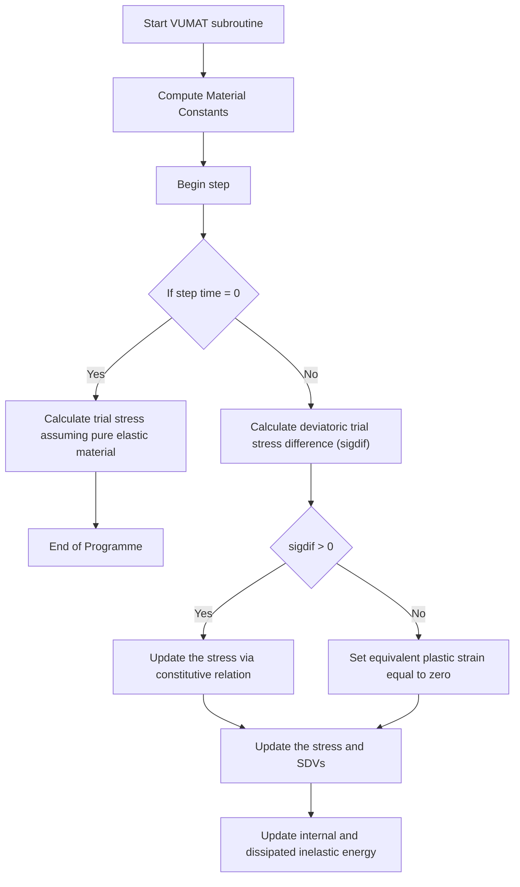

# A modified Johnson-Cook model to determine plastic flow behavior of Fe-30Mn-9Al-0.8 C low-density steel during warm multiaxial forging

Hemant Kumar a , Manish Tiwari b , R. Manna b , Debashis Khan a,\*

a Department of Mechanical Engineering, Indian Institute of Technology (BHU), Varanasi 221005, India
b Department of Metallurgical Engineering, Indian Institute of Technology (BHU), Varanasi 221005, India

# A R T I C L E I N F O

Keywords:

Low-density steel

MAF

Electron microscopy

Modified J-C model

Dislocation density

Grain refinement

Tensile strength

# A B S T R A C T

The microstructural changes in Fe-30Mn-9Al-0.8 C low-density steel upto equivalent strain 2.3 during multiaxial forging (MAF) and their impact on tensile strengthening have been thoroughly investigated. The processed sample at 0 pass, 1 pass, 3 pass, and 5 pass with 33% normal strain in each pass are characterized by X-ray diffraction (XRD) and electron backscattered diffraction (EBSD). The analysis of XRD confirms a noticeable increase in dislocation density progressing from $0 . 7 9 \times 1 0 ^ { 1 5 } \mathrm { m } ^ { - 2 } \mathrm { t o } 8 . 9 8 \times 1 0 ^ { 1 5 } \mathrm { m } ^ { - 2 }$ , attributed to a decrease in crystallite size and an increase in microstrain from $3 . 6 6 \times 1 0 ^ { - 3 } \mathrm { t o } 6 . 8 \times 1 0 ^ { - 3 } .$ . The grain size reduces from 50 μm to 13 μm. The yield strength increases from 380 MPa to 1528 MPa, while the ultimate strength increases from 762 MPa to 1548 MPa after 5 passes. It is observed here that both dislocation density and grain boundaries contribute to strengthening the material. However, up to three passes, dislocation strengthening is significant. Additionally, a numerical framework is developed to model the evolution of dislocation density, grain size and yield strength at each stage of MAF. To emphasize the role of strengthening parameters in predicting the flow stresses in every MAF pass accurately, a material VUMAT subroutine in ABAQUS has been created for a modified Johnson-Cook (J-C) constitutive model that accounts for the role of increased dislocation density and grain size. The developed model demonstrates its capability to accurately capture essential material features, including equivalent strain, dislocation density, and grain size. Furthermore, it exhibits the ability to predict the yield strength approximately following each MAF pass.

# 1. Introduction

Multiaxial forging (MAF) is one of the severe plastic deformation (SPD) techniques that applies force to a metal workpiece along multiple axes to produce refine microstructure to get improved mechanical properties such as higher strength, toughness, and wear resistance [1–3]. MAF endows excellent ductility among other SPD techniques [4]. While most of the other SPD techniques are typically restricted to laboratory experiments, MAF has proven its advantage in producing bulk refined material for the automotive industry without changing the shape and size of the processed material [1, 5–7]. Although, MAF is a complicated 3-D forging process with unstable and non-uniform plastic deformation, it has been used to improve the mechanical properties of copper, magnesium, aluminium, titanium alloys and steels [3–6, 8–9]. Low strength and ductile austenitic steels are deformed by MAF at temperatures close to the recrystallization (at 700 ◦C) to get ultrafine-grained structure of grain size \~360 nm which enhances yield

strength from \~280 MPa to 730 MPa with high dislocation density of $1 . 5 \ast 1 0 ^ { 1 5 } / \mathrm { m } ^ { 2 }$ and ductility of 23% [10,11].

Reducing the deformation temperature to room temperature, MAF of SUS316SS at an equivalent strain of 2.4 increases yield strength from 250 MPa to 1.7 GPa with low ductility of \~ 10% due to higher refinement, mechanical twining and formation of martensite. Further, when imposing equivalent strain upto $^ { 6 , }$ yield strength increases marginally about 0.3 GPa with ductility remains almost same [12]. Kim et al. have observed that in MAF (at room temperature) of interstitial-free steel, there is continuous improvement in strength with imposition of increased equivalent strain; even though rate of enhancement decreases at higher strain but ductility is almost unchanged [13]. The independence of ductility to imposed strain is primarily brought on by minor changes in the average geometrically necessary dislocation density due to dynamic recovery at higher strain. The MAF process can potentially improve the strength of material by promoting the emergence of a finer grain structure and higher strain hardening when it is carried out at lower temperatures but ductility decreases. Ductility increases with increasing processing temperature of MAF [12–14].

It is found that increasing strain rate during MAF reduces flow stress due to thermal softening in the deformed volume [15]. Therefore, optimizing the process parameters such as strain, strain rate and temperature are crucial to achieving an ultrafine-grained microstructure by MAF. According to Zhu et al. during MAF, centre of the specimen gets refined at initial passes and with increasing strain the refined zone spread towards surface. The refinement at centre reaches a saturated value for imposed strain of 6. Thereafter, the surface continuously gets refined beyond strain of 6 upto 12 [16]. The accumulated strain is increased with the number of passes, and the distribution of accumulated stain become more uniform with higher number of passes [17]. It is crucial to understand that the mechanical properties of a material are directly influenced by the changes that occur in its microstructure during the process. However, these changes are predominantly regulated by the distribution of equivalent strain within the material. Therefore, understanding the equivalent plastic strain distribution during this forging process has become of prime importance. By understanding the strain distribution, one can alter the deforming parameters to obtain efficient and better-quality results. However, conducting experiment to detail the effect of every process parameter is expensive and time consuming.

Through the finite element method (FEM), the critical process parameters can be optimized at a reduced time. FEM is a helpful tool for simulating engineering systems with an expensive experimental setup and a lengthy process to resolve complex issues like MAF that would be challenging to resolve otherwise [18]. Furthermore, choosing the ideal design scenario, researchers frequently use physical or phenomenological constitutive models that offer insightful information on the underlying mechanisms governing the deformation process of the material. MAF deformation is a complex phenomenon incorporating many mechanisms that function at the micro and atomic scales. For a physical model, it is frequently necessary to apply advanced characterization methods like scanning electron microscopy (SEM), transmission electron microscopy (TEM), and electron back scattered diffraction (EBSD) to fully comprehend the underlying micro or atomistic mechanisms [19, 20]. The information gained from these instruments aids in developing physics-based models, which are essential in precisely forecasting and optimizing the deformation process. Phenomenological constitutive models establish the relationship between the imposed process parameters (strain, temperature, and strain rate) and the material response, usually the flow stress [18,21]. But these models do not include the microstructural features like grain size or dislocation density at every stage of MAF for a realistic representation of the material behavior.

Severe deformation processes induce strain hardening in the material by forming dislocations within the crystal lattice structure, which increases the strength of the material by making it more difficult to deform further. Wing et al.[22] and Caruso et al.[23] have used the modified Johnson-Cook (J-C) phenomenological model incorporated with the effect of grain refinement during dynamic loading to predict the correct flow stress after each pass of MAF. Furthermore, the effect of dislocation density has been incorporated in the J-C model to predict the flow stress pattern and shape of the deformed body by Youan et al.[24] in machining-induced deformation problem and Rohan et al. [25] in cold spray process. These models aid in creating better processing methods for improved material performance and offer insightful information on the underlying mechanisms governing the deformation process of the material. To the best of the authors’ knowledge, in the area of MAF till today, there is no such J-C model and the FEM based studies available where the microstructure features such as dislocation density, grain size together are included in the model to predict the flow stress.

```mermaid
graph TD
    A["Original sample"] --> B["1st compression"]
    B --> C["2nd compression"]
    C --> D["Deformed sample"]

    subgraph Original sample
        A1["20"] --> A2["30"]
        A2 --> A3["20"]
        A3 --> A4["30"]
        A4 --> A5["20"]
        A5 --> A6["30"]
        A6 --> A7["20"]
        A7 --> A8["30"]
        A8 --> A9["20"]
    end

    subgraph Deformed sample
        B1["20"] --> B2["30"]
        B2 --> B3["20"]
        B3 --> B4["30"]
        B4 --> B5["20"]
        B5 --> B6["30"]
        B6 --> B7["20"]
        B7 --> B8["30"]
    end

    subgraph Deformed sample
        C1["20"] --> C2["30"]
        C2 --> C3["20"]
        C3 --> C4["30"]
        C4 --> C5["20"]
        C5 --> C6["30"]
        C6 --> C7["20"]
    end

    subgraph Deformed sample
        D1["20"] --> D2["30"]
        D2 --> D3["20"]
        D3 --> D4["30"]
        D4 --> D5["20"]
        D5 --> D6["30"]
        D6 --> D7["20"]
    end

    subgraph Deformed sample
        E1["20"] --> E2["30"]
        E2 --> E3["20"]
        E3 --> E4["30"]
        E4 --> E5["20"]
        E5 --> E6["30"]
        E6 --> E7["20"]
    end

    subgraph Deformed sample
        F1["20"] --> F2["30"]
        F2 --> F3["20"]
        F3 --> F4["30"]
        F4 --> F5["20"]
        F5 --> F6["30"]
        F6 --> F7["20"]
    end

    subgraph Deformed sample
        G1["20"] --> G2["30"]
        G2 --> G3["20"]
        G3 --> G4["30"]
        G4 --> G5["20"]
        G5 --> G6["30"]
        G6 --> G7["20"]
    end

    subgraph Deformed sample
        H1["20"] --> H2["30"]
        H2 --> H3["20"]
        H3 --> H4["30"]
        H4 --> H5["20"]
        H5 --> H6["30"]
        H6 --> H7["20"]
    end

    subgraph Deformed sample
        I1["20"] --> I2["30"]
        I2 --> I3["20"]
        I3 --> I4["30"]
        I4 --> I5["20"]
        I5 --> I6["30"]
        I6 --> I7["20"]
    end

    subgraph Deformed sample
        J1["20"] --> J2["30"]
        J2 --> J3["20"]
        J3 --> J4["30"]
        J4 --> J5["20"]
        J5 --> J6["30"]
        J6 --> J7["20"]
    end

    subgraph Deformed sample
        K1["20"] --> K2["30"]
        K2 --> K3["20"]
        K3 --> K4["30"]
        K4 --> K5["20"]
        K5 --> K6["30"]
        K6 --> K7["20"]
    end

    subgraph Deformed sample
        L1["20"] --> L2["30"]
        L2 --> L3["20"]
        L3 --> L4["30"]
        L4 --> L5["20"]
        L5 --> L6["30"]
        L6 --> L7["20"]
    end

    subgraph Deformed sample
        M1["20"] --> M2["30"]
        M2 --> M3["20"]
        M3 --> M4["30"]
        M4 --> M5["20"]
        M5 --> M6["30"]
        M6 --> M7["20"]
    end

    subgraph Deformed sample
        N1["20"] --> N2["30"]
        N2 --> N3["20"]
        N3 --> N4["30"]
        N4 --> N5["20"]
        N5 --> N6["30"]
        N6 --> N7["20"]
    end

    subgraph Deformed sample
        O1["20"] --> O2["30"]
        O2 --> O3["20"]
        O3 --> O4["30"]
        O4 --> O5["20"]
        O5 --> O6["30"]
        O6 --> O7["20"]
    end
```

flowchart

Fig. 1. Schematic diagram of MAF process.

natural_image

Five metallic mechanical components placed above a ruler for scale, showing different shapes and colors (no text or symbols visible)

Fig. 2. Forged billets and the cutout tensile samples after MAF-1, MAF-3 and MAF-5.

This study aims to investigate the plastic behavior of Fe-30Mn-9Al-0.8 C low-density steel during different stages of imparted strain in different directions throughout the MAF. This steel possesses very high ductility (>70% at room temperature and greater than 95% at $3 0 0 ^ { \circ } \mathrm { C } )$ as well as high formability [26–28]. Additionally, improved formability can allow for more complex forming processes, such as cold forging, deep drawing, stretch forming or severe plastic deformation processes like MAF. The other perspective is that this material comes in the category of the advanced class of steel that has gained increasing attention in recent years due to its exceptional combination of strength and low density and has the potential to reduce the weight of automobiles, resulting in improved fuel efficiency and reduced $\mathrm { C O _ { 2 } }$ emissions.

In anticipation of the prospective utilization of low-density steel in the automotive sector, there is an urgent need of both theoretical and experimental as well as simulation studies for the austenite-based Fe-Mn-Al-C low-density steel. Lack of adequate studies toward deformation behavior of such low-density steel slows down the applicability. The primary objective of this investigation is to elucidate the factors contributing to the enhancement of tensile properties. This will be achieved through a comprehensive examination of the microstructural change occurring in the MAF process by XRD and EBSD analyses. Next, the investigation seeks to establish a theoretical correlation between these observed microstructural phenomena and the equivalent strain experienced by the material. These identified relations have been integrated into our previously formulated J-C model [26] to precisely capturing the flow stress characteristics. A modified J-C model with the effect of dislocation density and grain size has been formulated to predict the flow stress and the strength of material achieved after each MAF pass. Thereafter, FE analysis has been carried out to replicate the actual microstructural evolution during the MAF process.

# 2. Experimental material and methods

# 2.1. Material

A 2.5 kg ingot of Fe-30Mn-9Al-0.8 C low-density steel has been prepared by vacuum induction melting process. Manganese has been added after injecting argon gas into the melt chamber, maintaining a 600-millibar pressure. The cast ingot has been homogenized at $1 2 0 0 ^ { \circ } \mathrm { C }$ for 2 h, and then it is hot forged between 1200 ℃- 900 ℃ ensuring more than 60% deformation with intermediate heating and cooled by water quenching. The forged material is then solutionized at 1050 ℃ for 1 h, and water quenched to retain maximum austenite phase. The actual composition after solutionization is Fe-30.6Mn-9.1Al-0.79 C. The carbon concentrations are assessed through combustion infrared detection analysis, employing a LECO CS744 analyzer. Concentrations of other elements are determined through the application of wet chemical analysis. The solutionized ingots are utilized for micro-mechanical examination of the proposed composition. The density of steel, determined via Archimedes’ principle, is measured as 6.8 gm/cm3 .

# 2.2. Material processed by MAF

For conducting MAF, the ingot is cut into rectangular billets of 30 mm × 20 mm x 20 mm. The die is manufactured with groove dimensions 32 mm × 20 mm. The MAF is carried out along three orthogonal directions on a 100 ton hydraulic press. All samples have been thoroughly lubricated with MoS2 before pressing. Prior to MAF, the sample and die are heated to 250 ℃ and soaked for two hours. The steel with the specified composition has the highest malleability between 150 ℃ to 450 ℃ below the recrystallization temperature, and therefore, the tests are carried out at $2 5 0 ~ ^ { \circ } \mathrm { C }$ (warm deformation circumstances) [26]. It is worth mentioning that the precipitation of carbides develops when the Fe-Mn-al-C low-density steel is deformed at temperatures higher than 450 ℃, increasing the material’s hardness and decreasing its ductility [28,29]. The ram has moved at a steady speed of 1 mm/s. MAF is performed by compressing the billet in three mutually perpendicular directions, which is referred to as one pass.

text_image

(a)
20

20
10
30
Analysed area
for XRD, EBSD
(b)
R 1
Ø 7.2
16
26.5
Ø 4
Constrained
direction
Flow direction
Pressing
direction

Fig. 3. (a) Schematic diagram of MAFed sample with notations of directions. Location of samples taken for various testings/characterization are shown. (b) Schematic diagram of tensile sample. All dimensions are in mm.

natural_image

Two 3D wireframe models of a rectangular container with a blue meshed surface, one with black dots on top and the other with a curved blue mesh (no text or symbols)

Fig. 4. Half-sectional view of 3-D finite element model of sample in a closed die before and after compression.

line

| Sample | Peak Label | 2θ (degree) Range | Intensity (count) |
|--------|------------|-------------------|-------------------|
| MAF-5  | -          | ~48–90            | ~870              |
| MAF-3  | -          | ~48–60            | ~1050             |
| MAF-1  | -          | ~88–90            | ~2460             |
| MAF-0  | -          | ~50–115           | ~7500             |

Fig. 5. XRD patterns at different MAF passes.

Fig. 1 shows the processing of metals in MAF. This figure depicts the initial compression of the workpiece in a die to a fixed strain, followed by removal of the sample, rotation by 90 degrees about both the vertical and horizontal axes, and subsequent compression to the same strain. The initial sample height is decreased from 30 mm to 20 mm by applying a sequence of ram pressure, resulting in a 33% normal strain in a single pass. The equivalent strain in one pass MAF is calculated to be 0.47 [30].

The sample could only be forged a total of five times before breaking on the sixth attempt. The final multiaxially forged samples are shown in Fig. 2. For convenience, the steels compressed by MAF for the initial annealed state or 0 pass, one pass, three passes, and five passes are henceforth denoted as MAF-0, MAF-1, MAF-3, and MAF-5, respectively.

# 2.3. Microstructural characterization

The microstructural changes during MAF are analyzed by XRD and EBSD at the location shown in Fig. 3(a). The equivalent strains of 0, 0.47, 1.4, and 2.34 are imposed at the selected four levels of MAF and the corresponding four levels of grain size and dislocation density are calculated. The samples have undergone an electro-polishing process before undergoing measurements. The specimens are characterized by X-ray diffractometer with $\mathrm { C o - K } _ { a }$ radiation, a scan speed o $: 2 ^ { 0 }$ per minute and a step size of $0 . 0 2 ^ { 0 }$ for 2θ ranges from $4 0 ^ { 0 } – 1 2 0 ^ { 0 } .$ . The peak broadening due to instrumental error, obtained from standard silicon data, are subtracted from the observed peak broadening to mitigate instrumental artifacts. The dislocation density at different MAF levels is measured from the XRD pattern at the selected area shown in Fig. 3 and calculated according to [31] as

$$
\rho = \frac {2 \sqrt {3} (e ^ {2}) ^ {1 / 2}}{D b} \tag {1}
$$

Here, $\left( e ^ { 2 } \right) ^ { 1 / 2 }$ is the average micro-strain, D is the average crystallite size, and b is the Burgers vector. For FCC austenite, $\begin{array} { r } { b = a / \sqrt { 2 } , } \end{array}$ where a is the lattice constant for the processed material. The average grain size is calculated using the equivalent grain size method from EBSD maps by locating grain boundaries with misorientation angles greater than 15 degrees.

# 2.4. Mechanical testing

The tensile tests are conducted to investigate the effect of multi direction forging on the tensile strength after each MAF pass. Miniature round tensile samples at MAF-0, MAF-1, MAF-3, and MAF-5 have been cut from the located area of MAF sample as shown in Fig. 3(a). The dimensions of tensile sample are shown in Fig. 3(b). These samples are tested on hydraulic universal testing machine of INSTRON with a strain rate of $1 \times 1 0 ^ { - 3 } \ s ^ { - 1 }$ at room temperature. Two round tensile samples have been taken from each chosen MAF pass to confirm reliability. At the end of tensile test, the two broken halves are placed properly and increase in plastic length is measured physically. Using this data, the amount of elastic length is estimated which has elastic length components from sample as well as from the machine. The elastic length is subtracted from each elongation data and the resultant value is reported as increase in plastic length of the gauge which is utilized for calculation of plastic strain.

# 3. Modified J-C constitutive model

The coexistence of medium strain rates and low temperatures in the MAF process requires a comprehensive understanding of material behaviour with specialized mathematical relations between the processing parameters to achieve desired outcomes. In materials science and engineering, the J-C model is a commonly used constitutive model to describe the behavior of materials under strain, strain rates and temperatures, such as those encountered during MAF. Considering the coupling influences of the strain hardening, strain rate sensitivity and thermal softening on the flow stress of steel, the J-C constitutive relation is expressed as

$$
\sigma_ {f l o w} = \left(\sigma_ {0} + B \varepsilon^ {n}\right) \left[ 1 + C \ln \left(\frac {\dot {\varepsilon}}{\dot {\varepsilon} _ {0}}\right) \right] \left[ 1 - \left(\frac {T - T _ {r}}{T _ {m} - T _ {r}}\right) ^ {m} \right] \tag {2}
$$

Where $\sigma _ { f l o w }$ is flow stress, $\sigma _ { 0 }$ is initial yield strength, B is strength coefficient, n is strain hardening exponent, C is strain rate sensitivity, m is thermal softening exponent, ε is the strain, έ is strain rate, $\dot { \varepsilon } _ { 0 }$ is reference strain rate, $T _ { r }$ is room temperature and $T _ { m }$ is melting temperature.

As indicated in the objectives, accurate reproduction of the material response following each MAF pass is crucial because the deformation behavior depends on the loading conditions and the history of defor mation in the material. In a typical MAF, a significant deformation occurs between different temperature ranges at moderate or low strain rates. Due to the complexity of the deformation condition, the material exhibits strain hardening with a non-linear deformation behavior in the material. However, strain accumulation occurs with microstructural evolution after every MAF pass and consequently there is increase in the yield strength [32–34]. The major contribution of the yield strength comes from the grain boundary strengthening $( \varDelta \sigma _ { g } )$ , dislocation strengthening $( \varDelta \sigma _ { \rho } )$ and other strengthening of either precipitate or solid solution $( \varDelta \sigma _ { o t h e r s } )$ and therefore the modified equation of yield stress can be written as

$$
\sigma_ {y} = \sigma_ {0} + \Delta \sigma_ {g} + \Delta \sigma_ {\rho} + \Delta \sigma_ {\text { others }} \tag {3}
$$

At MAF-0, all the strengthening parameters are already included in $\sigma _ { 0 } .$ But in further MAF passes, they have a significant role in increasing the yield strength. The precipitate strengthening comes from the precipitates forming during the cooling and solidification of a material. Since the steel composition is unaltered in the current experimental setting, the solid solution strengthening contribution can be viewed as the same for all samples. Since there is no difference between the carbides before and after the MAF pass, as illustrated by the X-ray patterns in Fig. 5, the precipitation enhancement brought on by carbides may likewise be considered constant. A reduction in grain size (d) in subsequent MAF passes is observed in Fig. $^ { 8 , }$ thereby strengthening the material. The contribution of the refined grains to the strength is described directly by the Hall-Petch relationship [35,36] as

$$
\Delta \sigma_ {g} = k \quad (d _ {f} ^ {- 1 / 2} - d _ {0} ^ {- 1 / 2}) \tag {4}
$$

Where k is a material constant, d0 is initial grain size and $d _ { f }$ is grain size during MAF. Eq. 4 shows the relationship between yield strength and grain size for a range of grain sizes (50–13 μm) with MAF pass in steels. With each additional MAF pass, grain boundary strengthening results in an increase in yield strength, that’s how k is calculated as 2374 MPa [37].

The contribution of dislocation to yield strength is estimated by the Taylor equation [34] as

$$
\Delta \sigma_ {\rho} = \alpha M G b (\rho_ {f} ^ {1 / 2} - \rho_ {0} ^ {1 / 2}) \tag {5}
$$

Where $\rho _ { 0 }$ is the initial dislocation density, $\rho _ { f }$ is the dislocation density during MAF,α is the Taylor constant with a value of 0.24, M is the average Taylor factor with a value of 3.0, [35,38] and G is the shear modulus which is equal to 61 GPa.

As discussed above, the complex strengthening relation on the flow stress is not reflected by the original J-C model and hence, considering the influence of each strengthening parameter to yield strength after each MAF pass, the original J-C can be modified in the present context as follows

$$
\begin{array}{l} \sigma_ {f l o w} = \left(\sigma_ {0} + k \quad (d _ {f} ^ {\frac {- 1}{2}} - d _ {0} ^ {\frac {- 1}{2}}) + \alpha M G b ((\rho_ {f} ^ {\frac {1}{2}} - \rho_ {0} ^ {\frac {1}{2}}) + B \varepsilon^ {n}\right) \tag {6} \\ \left[ 1 + C \ln \left(\frac {\dot {\varepsilon}}{\dot {\varepsilon} _ {0}}\right) \right] \quad \left[ 1 - \left(\frac {T - T _ {r}}{T _ {m} - T _ {r}}\right) ^ {m} \right] \\ \end{array}
$$

# 4. Finite element formulation and simulation model

As the material undergoes deformation and experiences varying stress, strain, and temperature levels, its behavior changes over time. The ABAQUS/Explicit finite element package has been employed in this study to simulate the forging operation of low-density steel. A 3-D finite element model with dimensions of 30 mm × 20 mm x 20 mm has been constructed to replicate the forging process accurately. To make sure the simulation accurately depicts the process’s dynamic and transient behavior, the explicit dynamic technique has been used. The die and punch have been treated as discrete rigid bodies, whereas the workpiece has been treated as a deformable body. The mesh sensitivity analysis has been done to optimally calculate the mesh size of 0.6 mm. The overall number of hex components in the finished workpiece model is 41382 (C3D8R), with reduced integration and hourglass control. Employing an eight-node hex element is sufficient due to the symmetrical arrangement of the punch and die, which aligns with the direction of material flow. This choice of element reduces the maximum element count and minimizes the computational time required for the simulation. Regarding the boundary conditions used in the simulation, the punch undergoes a controlled displacement of 10 mm in the Y direction (height direction) while the die is tightly fixed. The layout of the die assures that the workpiece can only move in the X direction (flow direction), and the die wall’s presence limits material flow in the Z direction (constrained direction). For this analysis, the overall contact between the workpiece and rigid bodies has been given a frictional coefficient of 0.15. The finite element model is displayed in Fig. 4. Here, the 3-D finite element model simulates the steady-state MAF process by mapping the distribution of the deformation fields from previous passes to the current ones.

As shown in Fig. 4, the blank has been compressed in the height direction and expanded in the flow direction but does not deform in the constraint direction during the forging process because of the die constraint. In actual experimental practice, the sample is rotated, as shown in Fig. 1, but in simulation practice, the deformed model is fixed, and the punch and die are assembled in other directions to carry a similar experiment boundary conditions.

Table 1 Crystallite size, microstrain, dislocation density calculated from XRD data.

<table><tr><td>No of Pass</td><td>Equivalent strain, ε</td><td>Avg. Crystallite size (nm)</td><td>Avg. Microstrain (e2)1/2</td><td>Dislocation density (m-2)</td></tr><tr><td>0 Pass</td><td>0</td><td>61</td><td>3.66 × 10-3</td><td>0.79 × 1015</td></tr><tr><td>1 Pass</td><td>0.46</td><td>13.4</td><td>5.18 × 10-3</td><td>5.57 × 1015</td></tr><tr><td>3 Pass</td><td>1.4</td><td>10.87</td><td>6.13 × 10-3</td><td>7.5 × 1015</td></tr><tr><td>5 Pass</td><td>2.3</td><td>10.12</td><td>6.88 × 10-3</td><td>8.98 × 1015</td></tr></table>

scatter

| Equivalent plastic strain | Measured Dislocation density (m⁻²) | Predicted using Eq. (7) Dislocation density (m⁻²) |
| :--- | :--- | :--- |
| 0.0 | 1.0E+15 | 1.0E+15 |
| 0.5 | 5.5E+15 | 6.0E+15 |
| 1.4 | 7.5E+15 | 8.0E+15 |
| 2.3 | 9.0E+16 | 8.5E+15 |

Fig. 6. Effect of equivalent plastic strain on dislocation density.

# 5. Results and discussion

# 5.1. XRD analysis

Fig. 5 depicts the XRD patterns of low-density Fe-30Mn-9Al-0.8 C steel that has undergone MAF passes. Through XRD analysis, the dislocation density of the multiaxially forged specimen is estimated. The examined Fe-Mn-Al-C steels have only majority austenite phase. A notable finding is the change in intensity and broadening of the peaks in the steel specimens as the number of forging passes rises. This phenomenon has been attributed to two primary factors: the refinement of grain size and an increase in the lattice strain. The changing of highintensity for (111) in solutioned sample to (220) of MAF-1 indicates texturing, which may have consequences for the material’s characteristics. Through the study of the average peak broadening of all FCC peaks, lattice microstrain (ϵ) and crystallite size (D) have been determined (values given in Table 1) according to Williamson Hall plot [31]. The value of the Burgers vector, $^ { b , }$ is calculated to be 0.259 nm. The dislocation densities for the samples are estimated from measured microstrain (Eq. 1) through Eq. (1).

In the present steel, the dislocation density is continuously increasing during the MAF. It is obvious that the average dislocation density increased from $0 . 7 9 \times 1 0 ^ { 1 5 } \mathrm { m } ^ { - 2 }$ for MAF-0 to 8.98 × 1015 m− 2 for MAF-5. A similar method is used by Sarkar et al. [39] to determine the dislocation density of equal channel angular treated IF steel at strains of 1.15 and 4.6, and they have reported the corresponding values as $3 . 6 \times 1 0 ^ { 1 4 } \mathrm { m } ^ { - 2 }$ and $6 . { \overset { \cdot } { 8 8 } } \times 1 0 ^ { 1 4 } \ { \overset { \cdot } { \mathrm { m } } } ^ { - 2 }$ , respectively. Odnobokova et al. [40] have examined the impact of cold rolling and multidirectional forging over 316 L. They have reported that the dislocation density rises from $\dot { 2 } \times 1 0 ^ { 1 5 } \mathrm { m } ^ { - 2 }$ to $\dot { 4 } \times 1 0 ^ { 1 5 } \dot { \mathrm { ~ m ~ } } ^ { - 2 }$ for cold rolling and from $6 \times 1 0 ^ { 1 5 }$ $\mathbf { m } ^ { - 2 } \tan 7 . 5 \times 1 0 ^ { 1 5 } \mathbf { m } ^ { - 2 }$ for multidirectional forging when the total strain value is 4. Thus, a trend of increase in dislocation densities with the plastic strain is observed in cold working processes. Singh et. al. [41] have proposed an empirical relation $ { \mathrm { ( E q . 7 ) } }$ to calculate the increase in dislocation density with the imposed equivalent strain imparted during the constrained grooves pressing at warm conditions.

$$
\rho_ {f} = \rho_ {0} + k _ {1} (1 - \exp (- k _ {2} \varepsilon)) \tag {7}
$$

Where, $\rho _ { 0 }$ is the dislocation density of initial material, ε is the imposed equivalent plastic strain. Further, $k _ { 1 }$ and $k _ { 2 }$ are the constants obtained from the non-linear curve fit of experimental dislocation density and imposed strain estimated in [42,43] for cold rolling, The same relation is used in the present investigation where $\rho _ { 0 }$ is dislocation density of MAF-0. The constants $k _ { 1 }$ and $k _ { 2 }$ are obtained by curve fitting of dislocation density vs imposed equivalent strain (data from Table 1, Fig. 6). The fitting curve (Fig. 6) for experimental material finds $k _ { 1 }$ to be $7 . 9 \times 1 0 ^ { 1 5 } \mathrm { m } ^ { - 2 }$ and $k _ { 2 }$ to be 1.813.

With increase in amount of imposed plastic strain, initially dislocation density increases, reaching to a maximum, and thereafter degree of increment decreases. Therefore, dislocations are rearranging at a critical strain 2.3 or five passes of MAF.

# 5.2. Microstructure

The image quality map superimposed with high angle and low angle grain boundaries are shown in Fig. 7(a-d). The MAF-0 sample shows high angle boundaries fraction of 0.62, Fig. 7(a). On MAF for 1 pass (MAF-1) high angle boundary fraction decreases drastically to 0.29 and low angle boundary fraction increases to 0.70, Fig. 7(b). After 3 passes (MAF-3) the high angle grain boundary fraction decreases to 0.24, Fig. 7 (c). After 5 passes (MAF-5) high angle grain boundary fraction increases to 0.69, Fig. 7(d). Fig. 7(e-h) display inverse pole figure (IPF) maps of normal direction (pressing direction). Fig. 7(e) shows the IPF maps of MAF-0. The sample is highly textured. [101] direction of significant number of grains is parallel to pressing direction, Fig. 7(e). [111] direction of other significant fraction orient parallel to pressing direction. However, many directions of MAF-1 are orienting parallel to pressing directions (Fig. 7(f)). Therefore, many more different directions become parallel to pressing direction (Fig. 7(g-h)). As the number of passes increase the grains are randomized.

The solutionized and quenched material has high fraction of high angle boundary and low fraction of low angle boundary (Fig. 7(a)). With increase in number of MAF passes low angle boundary fraction increases rapidly up to 3 passes and reaches maximum value of 0.75 (Fig. 7(b-c)). However, after 5 passes of MAF some of the low angle boundary get converted to high angle boundary and the high angle boundary fraction becomes significantly high of 0.69 (Fig. 7(d)). As per inverse pole figures, the solutionized and quench material is strongly textured. Normal direction of significant amount of grains is parallel to [101] (Fig. 7(e)). With increase in number of passes the texture is randomized (Fig. 7(fh)).

One can observe changes in the distribution of grain sizes with an increasing number of deformation passes (Fig. 8(a)). The solutionized and quenched material has grains of average size of 50 μm (data is also verified from measured from optical microstructure). The initial grain size distribution was relatively wide, but as deformation progressed, the distribution became narrower and more uniform for 5th passes. During the MAF process, the initial grain size of austenite undergoes a significant reduction, reaching 35 μm and 20 μm after first and third pass, respectively. Subsequently, as the MAF pass continues up to five passes to a total strain of $^ { 2 . 3 , }$ there is a further gradual reduction in the grain size, ultimately reaching approximately 13 μm. This is due to uniform compression from all three directions. This indicates that the forging process effectively breaks down larger grains into smaller ones, leading to the development of lamellar grains with a transverse dimension of about 13 μm. In regions with a high degree of strain concentration or deformation gradients, there are variations in the grain size. As the number of deformations passes increases, there is refinement in the grain size. The plastic deformation introduced during forging promotes grain subdivision and reduces the average grain size. This means grain boundaries become more intricate, and the individual grain becomes discretized. It has been suggested [43] that the grain size (df ) during cold rolling can be expressed by an exponential function of equivalent plastic strain as

text_image

(a)
60 um
Min	Max	Fraction
1°	15°	0.367
15°	180°	0.622

text_image

(b)
60 um
Min	Max	Fraction
1°	15°	0.708
15°	180°	0.292
Boundaries: Rotation Angle
Min	Max	Fraction
1°	15°	0.708
15°	180°	0.292

text_image

(c)
Min	Max	Fraction
1°	15°	0.759
15°	180°	0.240
60 µm

text_image

(d)
Min	Max	Fraction
1°	15°	0.301
15°	180°	0.699
60 µm

natural_image

Microstructure image showing colorful grain boundaries with a 60 μm scale bar (no text or symbols beyond label)

natural_image

Color-coded geological or material microstructure image showing grain boundaries and color variations (no text or symbols)

natural_image

Microscopic view of a colorful, grainy material structure with no visible text or symbols

natural_image

Microscopic view of a material's grain structure with a color-coded intensity map (no text or symbols)

Fig. 7. Image quality maps (a) MAF-0, (b) MAF-1, (c) MAF-3, and (d) MAF-5. Green and red lines are superimposed for boundaries having misorientation angles of 1◦− 15◦ and 15◦− 180◦, respectively. Inverse pole figure maps of normal direction or pressing direction in the present cases for (e) MAF-0, (f) MAF-1, (g) MAF-3, and (h) MAF-5.

$$
d _ {f} = d _ {0} \exp (- k _ {3} \varepsilon) \tag {8}
$$

Where, ε is the imposed equivalent strain, d0 is initial grain size and $k _ { 3 }$ is strengthening constant. In the present investigation Eq. 8 is fitted with the plot (Fig. 8(b)) of imposed equivalent strain (ε) and the grain size (d ) of MAFed samples and k is found to be 0.639.

Fig. 9 shows the KAM maps for MAF samples. Fig. 9(a) displays KAM map for MAF-0 sample. The material reports average KAM value of 0.34◦. This indicates minimal plastic deformation in the material persisting even after solution annealing (which can be seen in Fig. 9(a), the blue color represents low strain). Fig. 9(b) illustrates the KAM map after a single forging pass. The material displays KAM value of 0.72◦. Fig. 9(c) represents the KAM map after three passes. The material depicts higher KAM value of 0.87◦. This indicates a higher level of plastic deformation. The uniformity of misorientation can be attributed to tri-axial deformation. Fig. 9(d) represents the KAM map after five forging passes. The material depicts KAM value of 1.07◦. The material has more pronounced strain compared to the 3-pass condition. Now, after five forging passes, the material shows a greater degree of plastic deformation.

line

| Grain size (μm) | MAF-0 | MAF-1 | MAF-3 | MAF-5 |
| --------------- | ----- | ----- | ----- | ----- |
| 0.1             | 0.0   | 0.0   | 0.0   | 0.0   |
| 1               | 0.0   | 0.0   | 0.0   | 0.0   |
| 10              | 0.32  | 0.3   | 0.25  | 0.1   |
| >10             | 0.3   | 0.5   | 0.25  | 0.1   |

(a)

scatter

| Equivalent plastic strain | Grain size (μm) |
| :--- | :--- |
| 0.0 | 50 |
| 0.5 | 35 |
| 1.4 | 20 |
| 2.3 | 13 |
d = 50*exp(-k3*x)
k3 = 0.63999 ± 0.03785
R-Square (COD) = 0.99052

(b）
Fig. 8. (a) Plots of area fraction against grain size, (b) Effect of equivalent plastic strain on grain size.

# 5.3. Mechanical properties

The engineering stress-strain curves of Fe-30Mn-9Al-0.8 C are shown in Fig. 10 for MAF-0, MAF-1, MAF-3, and MAF-5. The solutionized and quenched coarse-grained (low-density steel (MAF-0) displays lowest yield strength of 380 MPa. On MAF for 1 pass yield increases drastically, i.e by three times to 1040 MPa. The enhancement in strength is mainly due to increase in dislocation density to $5 . 5 7 \times 1 0 ^ { 1 5 } \mathrm { m } ^ { - 2 }$ which is about seven times the solutionized material and a marginal refinement in grain size from 50 µm to 35 µm. On further MAF for 3 passes yield increases to 1279 MPa. Here again the dislocation density of MAF-3 is $7 . 8 \times 1 0 ^ { 1 5 }$ $\mathrm { m } ^ { - 2 }$ which is ten times that of solutionized material and again grain size reduces to 20 µm. After 5 passes of MAF yield strength increases to 1528 MPa. The dislocation density of MAF-5 is measured to be $8 . 9 8 \times 1 0 ^ { 1 5 } \ \mathrm { m } ^ { - 2 }$ which is about eleven times to that the solutionized material and the grains refine from 50 µm to the size of 13 µm. Both dislocation density and grain boundary strengthening contribute to increase the yield strength by 1148 MPa in 5 passes. The ultimate tensile strength of coarse-grained solutionized material displays 762 MPa. The highest amount of work hardening of 392 MPa is calculated for the solutionized material. On MAF, as dislocation density increases the amount of work hardening decreases. As a result, MAF-1 gives UTS of 1368 MPa and amount of work hardening of 328 MPa. On further MAF for 3 passes, the UTS increases to 1415 MPa and the amount of work hardening decreases to 126 MPa and after 5 passes it reduces to only 20 MPa. In this condition UTS (1548 MPa) and yield strength (1528 MPa) are very close Table 2. Increase in yield strength due to change in dislocation density and grain refinement in comparison with solution annealed material (MAF-0).

The probable causes of the strengthening during MAF are high dislocation density and reduction in grain size. The analysed data in Table 2 clearly shows that contribution to yield strength from dislocation density dominates over grain refinement during multiaxial forging of selected alloy in early stages (1 to 3 passes). However, the degree of grain boundary strengthening is more than that of dislocation strengthening at later stages (3 to 5 passes). In the present case, there is no deformation twinning. However, there is very negligible amount of annealing twin boundary fraction of 0.007 in MAF-1 and to 0.003 in MAF-5. Miura et al. successfully performed MAF on Ti at room temperature, followed by additional cold rolling. Their study revealed a significant increase in the tensile strength from 710 MPa to 930 MPa attributed to increasing cumulative strain mainly by mechanical twinning and kinking [44]. According to Li et. al., the yield strength of the steels dramatically increases by roughly 120–190% compared to the as-received sample after dynamic plastic deformation processing. The combination of dislocation and grain boundary strengthening is responsible for the significant improvement [34]. The primary factors for improving mechanical characteristics like UTS and YS include increased microstrain, and lower crystallite size which in turn results in higher average dislocation density at low-temperature deformation [45]. The systematic increase in strength is due to increase in dislocation density, deformation twinning, refinement in grain size, decrease in crystallite size and enhancement in microstrain.

Initially, at solution-treated condition (MAF-0), the sample possesses very high total elongation of 75% and uniform elongation of 63%. This is due to relatively strain-free or low dislocation density, low microstrain and high work hardening ability. But when the sample is multiaxially forged at imposed strain of 0.46, the total elongation of low-density steels decreases drastically to 30% due to increase in microstrain but rapid enhancement in dislocation density under which material loses its work hardening ability. As a result, the difference between yield strength and UTS decreases from that of solutionized material. On further imposed strain of 1.4 by MAF, the total elongation becomes 13.7% or uniform elongation of 3%. After 5 passes or imposed equivalent strain of 2.3, the material gains very high dislocation density, microstrain. As a result, material loses its work hardening ability to only 20 MPa because of which uniform elongation and total elongation decrease to very low value of 0.8% and 8%, respectively.

# 5.4. Finite element analysis of MAF

A 3-D finite element model of a rectangular sample is created with the J-C constitutive model to explore the consequence of dislocation density increment and grain size reduction during the MAF process. To include the modified J-C constitutive equation, i. e. Eq. (6) into the finite element model, a VUMAT subroutine in ABAQUS for Fe-30Mn-9Al-0.8 C steel is first constructed. Fig. 11 shows the flow chart of the developed VUMAT subroutine. The implemented user subroutine uses six statedependent variables (SDVs), as shown in Table 3. The original J-C model parameters of the current material have been evaluated in our previous study [26]. The material properties of the current material are summarized in Table 4. To provide a concise overview of the numerical simulation results for the multidirectional forging of the blank, experimental results of MAF-1, MAF-3, and MAF-5 have been considered for comparison. Our study conducted a comparative analysis of the simulated stresses over the region due to the strain hardening and dislocation strengthening during the MAF. The grain size distribution is also viewed over the region with increased strain imparted after each selected forging pass.

Fig. 9. KAM map (Unique color map) (a) MAF-0, (b) MAF-1, (c) MAF-3, and (d) MAF-5.

line

| Engineering strain | MAF-0 | MAF-1 | MAF-3 | MAF-5 |
| ------------------ | ----- | ----- | ----- | ----- |
| 0.0                | 400   | 1050  | 1350  | 1550  |
| 0.1                | 500   | 1200  | 1250  | 1200  |
| 0.2                | 600   | 1250  | 1200  | 1150  |
| 0.3                | 650   | 1250  | 1150  | 1100  |
| 0.4                | 700   | 1200  | 1100  | 1050  |
| 0.5                | 720   | 1150  | 1050  | 1000  |
| 0.6                | 750   | 1100  | 1000  | 950   |
| 0.7                | 780   | 1050  | 950   | 900   |
| 0.8                | 550   | -     | -     | -     |

Fig. 10. Engineering stress-strain plots after different MAF passes.

Table 2 Increase in yield strength due to change in dislocation density and grain refinement in comparison with solution annealed material (MAF-0).

<table><tr><td>No of Pass</td><td>Measured YS (MPa)</td><td>Increase in YS from MAF-0 due to dislocation density difference (MPa)</td><td>Increase in YS from MAF-0 due to grain refinement (MPa)</td></tr><tr><td>0 Pass</td><td>380</td><td>-</td><td>-</td></tr><tr><td>1 Pass</td><td>1040</td><td>531</td><td>129</td></tr><tr><td>3 Pass</td><td>1289</td><td>669</td><td>240</td></tr><tr><td>5 Pass</td><td>1528</td><td>762</td><td>386</td></tr></table>

Fig. 12 depicts the outcomes of the numerical simulations’ predictions for the strain and stress distributions and corresponding contours in the specimen’s midplanes and front surface (perpendicular to the constrained direction) for MAF-1, MAF-3, and MAF-5. The simulation results do not accurately replicate the experimental distortions in the shape of the specimens (shown in Fig. 2) during MAF. This discrepancy is likely attributed to the absence of crystallographic texture effects in the simulation. Additionally, the simulation displays an $" \mathbf { X } " \ –$ shaped deformation pattern. According to earlier findings based on microstructural and numerical simulation evaluations of MAF methods, a more considerable strain was observed in the central portions of all specimens [46,47]. After one pass of MAF, the maximum strain in the central region is approximately $0 . 6 ,$ exceeding the external strain value of $_ { 0 . 4 6 . }$ . The maximum strain observed in the central region of the specimens following five passes of MAF is approximately $^ { 2 . 6 , }$ surpassing the magnitude of the applied external strain value 2.3. The simulations show that the specimen’s central portion, which undergoes more deformation, exhibits a comparatively greater size, as seen by the red contour. This suggests that more passes may be a factor in expanding the severe plastic region of the specimen’s center section.

Fig. 12(b-c) compare dislocation generation and the grain size evolution after each pass of MAF as estimated by numerical simulation. Both dislocation generation and grain size distribution predicted here at the corresponding level of equivalent strain (utilizing Eqs. (7) and (8) in VUMAT subroutine) thus offer visual insights into dislocations’ evolution and grain size distributions during MAF simulation in 3-D. The accumulation of dislocations as the strain increases is further supported by the KAM map, as shown in Fig. 9. The grain size distribution exhibits a reverse pattern in relation to dislocation density distribution, with coarser grain size predominantly observed in the outer region and finer grain size in the central part. Additionally, the increasing strain over the course of the five MAF passes is highly correlated with grain size refinement.

flowchart

Fig. 11. Flow chart for VUMAT.

Table 3 VUMAT state-dependent variable definition and allocation.

<table><tr><td>Variable name</td><td>VUMAT allocation</td></tr><tr><td>Equivalent plastic strain ( $\varepsilon_p^n$ )</td><td>SDV1</td></tr><tr><td>Equivalent plastic strain rate ( $\xi_p^n$ )</td><td>SDV2</td></tr><tr><td>Dislocation density ( $\rho_f$ )</td><td>SDV3</td></tr><tr><td>Flow stress ( $\sigma_{flow}$ )</td><td>SDV4</td></tr><tr><td>Yield strength ( $\sigma_y$ )</td><td>SDV5</td></tr><tr><td>Grain size ( $d_f$ )</td><td>SDV6</td></tr></table>

Table 4 Material properties of Fe-30Mn-9Al-0.8 C low-density steel.

<table><tr><td>Material Properties</td><td>Values</td></tr><tr><td>Density (gm/cm3)</td><td>6.8</td></tr><tr><td>Young&#x27;s modulus (MPa)</td><td>160,000</td></tr><tr><td>Poisson&#x27;s ratio</td><td>0.3</td></tr><tr><td> $\sigma_0$  (MPa)</td><td>380</td></tr><tr><td>B (MPa)</td><td>1860</td></tr><tr><td>Dislocation strengthening constant  $k_1$  (m-2),  $k_2$ </td><td>7.9E+ 15, 1.8</td></tr><tr><td>Grain size strengthening constant</td><td>2374,</td></tr><tr><td>k (MPa μm0.5),  $k_3$ </td><td>0.63</td></tr><tr><td>n</td><td>1.02</td></tr><tr><td>m</td><td>0.87</td></tr><tr><td>C</td><td>0.0067</td></tr><tr><td>Melting temperature (°C)</td><td>1450</td></tr><tr><td>Reference temperature (°C)</td><td>27</td></tr></table>

On the other hand, Fig. 12 (d) shows a marked rise in stress levels when MAF is performed. The steady rise in strain hardening and dislocation density with increased MAF passes supports the increased stress levels found in this finding. Consistent with previous studies [20–21, 48], our findings align with the observation of higher stress values following severe deformation. The thermally driven dislocation climb and cross slip mechanisms are partially suppressed at very low temperatures and thereby reduce the dislocation mobility and the annihilation of dislocations at grain boundaries. During MAF pass at lower temperatures, this combination causes an increase in the equivalent strain as well as an increase in dislocation density.

The predicted dislocation density and grain size at the exact position shown in Fig. 3(a) after each MAF stage are compared with the corresponding measured results. The primary goal of this study is to correctly forecast the behavior of the Fe-30Mn-9Al-0.8 C steel, in particular in the core region under extreme strain. This requires extending the finite element analysis to include the complete body’s microstructural

natural_image

Two 3D surface plots with a color-coded intensity map, labeled X, Y, Z axes (no text or symbols on the surfaces themselves)

Fig. 12. Simulation results for (a) equivalent strain map, (b) dislocation distribution map $( \mathbf { m } ^ { - 2 } ) ,$ (c) grain size distribution map (μm) and (d) flow stress map (MPa).

line

| No. of Pass | Experimental Yield strength (MPa) | FE simulation Yield strength (MPa) |
| :--- | :--- | :--- |
| 0 | 380 | 380 |
| 1 | 1040 | 940 |
| 3 | 1280 | 1260 |
| 5 | 1520 | 1440 |

Fig. 13. Prediction of yield strength with respect to experimental results.

evolution based on strain-dependent constitutive relations, as explained in Section 3. The dislocation density is measured from XRD analysis (Fig. 5) and grain size is measured from the EBSD analysis (Fig. 8). In the modified J-C model (Eq. 6), the influence of the strain-dependent dislocation density (Eq. 7) and the grain size (Eq. 8) parameters has been integrated. Both of these microstructure features contribute to the yield strength after each MAF pass. So, the modified J-C model incorporated with FEA shows good agreement with measured dislocation density and grain size values during MAF-1, MAF-3, and MAF-5 and provides visual confirmation of the progressive build-up of dislocations and grains in response to increasing strain levels. And, also it predicts good yield strength value after each MAF pass. Fig. 13, shows the comparison of experimental yield strength values to the simulated yield strengths. Initially, up to 3 passes, the finite element simulation predicts similar strengthening to yield value. However, after three passes, the predicted value shows a lower deviation from the experimental results. Additionally, the small number of MAF passes (up to a medium strain level) used in this work is comparable with common cold forging procedures. Furthermore, existing literature supports the notion that in lowstrain cold working processes, dislocation density is the main factor for material strengthening in low-strain cold working methods.[40, 48–50]. Grain refinement becomes more prominent in conjunction with the dislocation density for higher strains, particularly after three passes of MAF. Therefore, the cumulative effect of strain leads to a increase in dislocation density and grain refinement, highlighting the combined influence of these factors on the material’s mechanical properties (Table 4). This finding emphasizes the importance of considering grain refinement and dislocation density when analyzing the material’s behavior at higher strain levels in the MAF process. The simulation study shows that the yield strength of the material depends on depth from the surface of the forged sample (Fig. 14). The strength is maximum at the centre and it decreases towards the surface. There can be a minor error between physical sampling for tensile test and average depth considered for reporting the yield strength from the simulation. In addition, the effect of texture is not considered in the simulation. Apart from grain boundary and dislocation strengthening, texture may affect the material property. However, texture data is not included in present study. As the textured material is multiaxially forged, it is expected that the intensity of texture goes down or changes towards randomisation due to multidirectional flow or deformation [51]. The texture material is highly anisotropic whose strength is low in a particular direction. As the material randomises, it becomes isotropic and its strength increases. Therefore, the simulated strength is lower than the experimentally measured value.

# 6. Conclusions

The main objective of the present study is to thoroughly understand the microstructural changes of Fe-30Mn-9Al-0.8 C low-density steel during its MAF and their relationships to the material’s mechanical properties. Both experimental as well as finite element simulation results have been presented. The main findings of the current investigation are as follows:

• After successfully completing five passes of MAF, the tensile strength of the low-density steel increases from 762 to 1548 MPa. However, this enhancement is accompanied by a significant reduction in ductility, declining from 75% to 8%.
• Both grain refinement and dislocation density contribute to yield strength significantly during MAF of the selected low-density steel at 250 ◦C. Contribution to yield strength from dislocation density dominates over grain refinement during multiaxial forging in early stages (1 to 3 passes). However, the degree of grain boundary strengthening is more than that of dislocation strengthening at later stages (3 to 5 passes).
• The finite element model of MAF incorporating the modified J-C material model agrees well with the experimental prediction of

heatmap

| Panel | Value Range        |
|-------|--------------------|
| Top Left | +1.358e+03         |
| Top Right | +1.303e+03         |
| Top Left | +1.248e+03         |
| Top Right | +1.193e+03         |
| Top Left | +1.138e+03         |
| Top Right | +1.084e+03         |
| Top Left | +1.029e+03         |
| Top Right | +9.738e+02         |
| Top Left | +9.189e+02         |
| Top Right | +8.640e+02         |
| Top Left | +8.092e+02         |
| Top Right | +7.543e+02         |
| Top Left | +6.994e+02         |
SDV5 (Avg: 75%)

Fig. 14. Simulation results for yield strength map (MPa).

dislocation density distribution, grain size and yield strength at every pass of MAF. Therefore, the proposed modified J-C model may also be confidently used for other cold deformation processes.

• The selected alloy could be multiaxially deformed up to maximum equivalent strain of 2.3 at 250 ◦C.

# CRediT authorship contribution statement

Kumar Hemant: Writing – review & editing, Writing – original draft, Validation, Methodology, Investigation, Formal analysis. Tiwari Manish: Formal analysis, Data curation. Manna R: Writing – review & editing, Methodology, Investigation, Formal analysis, Conceptualization. Khan Debashis: Writing – review & editing, Writing – original draft, Validation, Supervision, Methodology, Investigation, Formal analysis, Data curation, Conceptualization.

# Declaration of Competing Interest

The authors declare that they have no known competing financial interests or personal relationships that could have appeared to influence the work reported in this paper.

# Data Availability

No data was used for the research described in the article.
