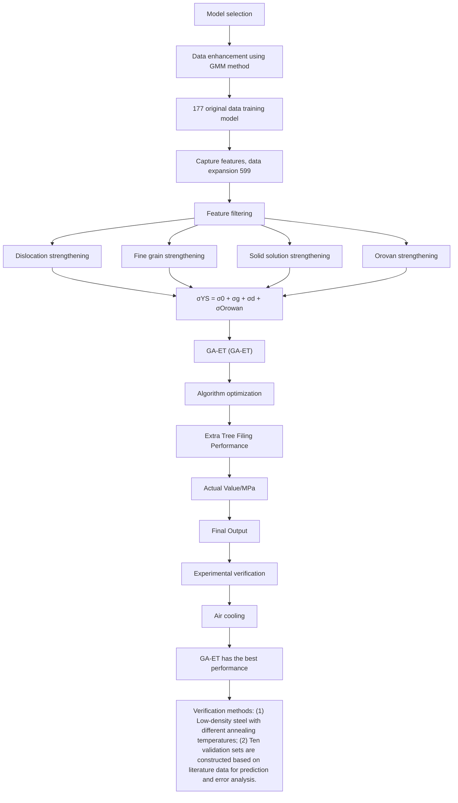
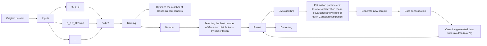
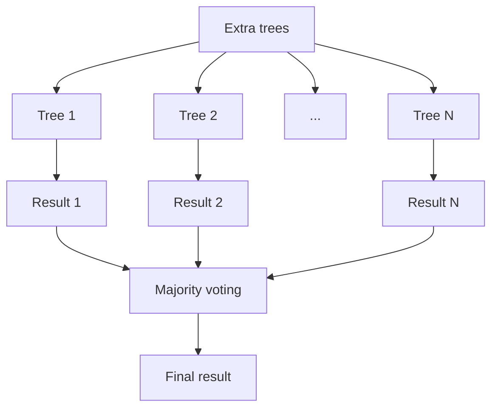

# Data-driven and multi-mechanism strengthening based yield strength prediction in medium-manganese low-density steels

Rui-xiao Zhang , Jia-he Yan , Guo-long Liu , Ming-he Zhang , Yun-li Feng \*

College of Metallurgy and Energy, North China University of Science and Technology, Tangshan 063210, China

# A R T I C L E I N F O

Keywords:

Medium-manganese low-density steels

Yield strength

Strengthening mechanisms

Machine learning

Genetic algorithm-Extremely randomized trees

# A B S T R A C T

Medium-manganese low-density steels hold broad application prospects in automotive lightweight, yet the accurate prediction of its Yield Strength (YS) remains challenging. Traditional models constrained by linear superposition assumptions and single-mechanism analysis limitations prove inadequate for complex alloy systems. This study proposes a data-driven framework for yield strength prediction. A multi-source dataset incorporating contributions from four strengthening mechanisms (Solid solution strengthening, Grain refinement strengthening, Dislocation strengthening and Orowan strengthening) was constructed through literature mining. Gaussian Mixture Model (GMM) was employed for data augmentation, expanding the dataset to 776 entries. Through ensemble learning algorithm screening, Extreme Randomized Trees (Extra Trees) were identified as the optimal model. The model was evaluated using Root Mean Square Error (RMSE), Mean Absolute Percentage Error (MAPE), and coefficient of determination (R2 ), achieving test set metrics of RMSE= 76.2 MPa, MAPE= 9.8 %, and R2 = 0.978. Subsequent Genetic Algorithm (GA) optimization significantly improved model performance, yielding optimized metrics of RMSE= 31.60 MPa, MAPE= 4.39 %, and R2 = 0.997. Validation through practical experiments and existing literature data demonstrated average prediction errors of 1.56 % and 1.84 %, respectively, with minimal fluctuations, confirming the engineering applicability of the framework. Finally, the decision-making mechanism of the model is revealed by using the Shapley additive explanations method, and the importance of characteristics is analyzed. This research provides a novel data-driven methodology for performance prediction and process optimization of medium-manganese low-density steels.

# 1. Introduction

With the growing industrial demand for high-strength, low-density materials, research on medium-manganese low-density steels has emerged as a focal point in materials science. As an advanced highperformance steel alloy, this class of materials demonstrates promising application potential in automotive lightweighting and critical structural components, owing to its exceptional combination of mechanical properties and reduced density [1,2]. However, accurate prediction of their mechanical performance remains challenging due to the intricate interdependencies between their complex chemical composition, multi-phase microstructural architecture, and processing-induced defects.

In traditional methods for predicting mechanical properties, experimental approaches and classical mechanical models have been dominant. Through experimental techniques such as tensile tests, hardness tests, and fatigue tests, researchers can obtain stress-strain curves of alloy materials under different loading conditions, thereby analyzing their mechanical properties. While these methods have provided a wealth of valuable data for predicting the stress of alloy materials, they also have some insurmountable limitations. Traditional experimental methods require a significant number of samples and considerable experimental time, often leading to high experimental costs and long cycles. Secondly, most of these methods are based on empirical or approximate formulas; the Hall-Petch equation is one of the most commonly used models [3,4]. However, this formula is primarily applicable to single-phase metallic materials and struggles to adapt to complex alloy systems. With the increasing diversification of alloy compositions and processing techniques, the accuracy of traditional methods in predicting mechanical properties faces ever-growing challenges [5,6].

In recent years, the rapid advancement of computer science and data science has positioned machine learning (ML) as a transformative datadriven modeling paradigm, demonstrating substantial potential in predicting alloy mechanical properties. Distinct from conventional approaches, ML leverages extensive experimental datasets to uncover intrinsic relationships between alloy composition, microstructural characteristics, and stress response through systematic analysis and model construction. Cutrina et al. employed phase-field dislocation dynamics simulations of face-centered cubic metals to generate training data, developing ML models to predict the correlation between yield stress and stacking fault energy (SFE) landscapes in high-entropy alloys. By implementing three distinct methodologies to characterize SFE variations, their optimal model achieved a yield stress prediction error of approximately 2 % [7]. Wu et al. systematically investigated FGH4095 superalloy specimens subjected to laser shock processing (LSP) with varying energy levels. Using laser energy, penetration depth, and surface microhardness as input parameters, they applied multiple ML algorithms to predict residual stress, microhardness, and ultimate tensile strength, establishing a framework for laser-processed alloy optimiza tion [8]. Russlan et al. pioneered an ML-driven methodology utilizing electron backscatter diffraction (EBSD) data to identify microstructural features governing stress concentration during plastic deformation of magnesium-based materials. Through comparative algorithm evaluation, extreme randomized trees emerged as the most effective model, with grain size identified as the dominant influencing factor [9]. Notably, Liu and Wang developed an ML architecture for predicting ideal material strength, achieving a mean R² value of 0.894 through 10-fold cross-validation. Their feature importance analysis revealed critical strengthening mechanisms, subsequently enabling the proposal of a novel empirical model based on material melting point and density correlations [10].Shi et al. implemented data interpolation techniques to expand their dataset, constructing ML models to investigate synergistic effects of layer thickness, stress ratio, stress amplitude, and defect characteristics (size, morphology, and location) on ultra-high cycle fatigue life in selective laser melted AlSi10Mg alloys. This work provides a theoretical foundation for fatigue performance optimization in additive-manufactured alloys [11]. However, current research pre dominantly utilizes alloy composition and processing parameters as input features for mechanical property prediction. However, ML models incorporating strengthening mechanisms as input variables to predict mechanical outputs remain in their nascent stage of development.

Distinct strengthening mechanisms play critical roles in enhancing material performance. The synergistic interplay of these mechanisms collectively governs the mechanical properties of materials, particularly yield strength (YS). Solid solution strengthening operates through solute atom-induced dislocation motion obstruction; dislocation strengthening arises from mutual interactions between dislocations to increase deformation resistance, while grain refinement strengthening enhances material strength via grain boundary impediments [12–14]. Furthermore, the Orowan mechanism describes the dislocation pinning effect by secondary phase particles to augment load-bearing capacity. Building upon these principles, this study compiles published data quantifying the contributions of four strengthening mechanisms and corresponding YS values across various alloy systems [15]. A multi-source dataset was constructed to develop a novel machine learning-driven YS prediction framework, which is subsequently applied to medium-manganese low-density steels, providing theoretical guidance for their performance optimization and processing design.

This study collected data from published literature, including 177 pieces of data. GMM data enhancement method was utilized to enhance the original data set, and the original 177 groups were expanded to 776 groups to solve the problem of small samples. Seven mainstream machine learning models (Decision Tree (DT), eXtreme Gradient Boosting (XGBoost), Light Gradient Boosting Machine (LightGBM), Categorical Boosting (CatBoost), Extremely Randomized Trees (Extra Trees), K-Nearest Neighbors (KNN), and Adaptive Boosting (AdaBoost)) are selected for comparison. The same evaluation indexes RMSE, MAPE, and R2 are used for model performance comparison so as to select the best performing extra trees model as the basic model. The intelligent optimization algorithm is used to optimize its hyper-parameters. So as to continue to improve the prediction performance of the model. In addition, the accuracy and generalization ability of the model is further verified through the combination of experimental and theoretical methods to show the reliability of the model. In general, this study is helpful in realizing the efficient prediction of YS of medium manganese low-density steel so as to provide some guidance for the design of related materials.

# 2. Architecture of the proposed method

The expanding application of medium-manganese low-density steels in automotive lightweighting has positioned the prediction of their mechanical properties under multi-mechanism synergistic strengthening effects as a critical scientific challenge in materials design. Conventional empirical models, constrained by linear superposition assumptions and single-mechanism analytical limitations, prove inadequate for accurately characterizing YS evolution in complex alloy systems. This study proposes a novel YS prediction framework integrating multi-source data-driven approaches with intelligent optimization algorithms. First, a multi-source dataset containing quantified contributions of four strengthening mechanisms (Solid solution, Dislocation, Grain boundary, and Orowan strengthening) was constructed through systematic literature mining, with Gaussian Mixture Model (GMM)- based data augmentation effectively overcoming small-sample constraints. Subsequently, an ensemble learning algorithm was deployed to establish a robust mapping model between strengthening mechanisms and YS, incorporating a Genetic Algorithm (GA) for global hyperparameter optimization. The framework was then transferred to predict YS in medium-manganese low-density steels, ultimately validated through experimental investigations demonstrating its engineering applicability.

The YS prediction framework developed in this study breaks through the limitations of the traditional empirical model under the synergistic strengthening effect of multiple mechanisms, systematically integrates the quantitative contribution data of four core strengthening mechanisms to the YS of medium manganese low-density steel, and constructs a multi-source data set. The innovative application of GMM(Gaussian mixture model) for data expansion effectively overcomes the problem of scarcity of high-quality experimental data in materials science. On this basis, a robust mapping model between the strengthening mechanism and yield strength is set by using an ensemble learning algorithm. This framework not only offers a new perspective for understanding the evolution of YS of complex alloy systems but also reveals the efficiency of the "traditional experiment + machine learning" method. The complete workflow is illustrated in Fig. 1.

# 3. Experiment and simulation

# 3.1. Collection and preprocessing of basic data sets

The optimization of mechanical properties in materials science fundamentally relies on the synergistic interplay of multiple strength ening mechanisms. Dislocation strengthening operates by increasing dislocation density to enhance YS and resistance to plastic deformation, whereas grain refinement strengthening enhances both strength and toughness through microstructural grain size reduction, with particularly pronounced effects under cryogenic conditions. Solid solution strengthening introduces solute atoms to form crystalline solid solutions that impede dislocation motion, thereby augmenting material strength, while the Orowan strengthening mechanism modifies stress field distributions and crystalline structures to elevate deformation resistance [13–16]. In conventional paradigms, material YS is conceptualized as the cumulative outcome of these multi-mechanism interactions. Classical strengthening theory postulates that under low-strain conditions coupled with microstructural stability, individual contributions from distinct strengthening mechanisms to YS can be approximately characterized through a linear superposition model, mathematically expressed as:

flowchart

Fig. 1. Flowchart of the yield strength prediction framework.

$$
\sigma_ {Y S} = \sigma_ {0} + \sigma_ {g} + \sigma_ {d} + \sigma_ {\text { Orowan }} \tag {1}
$$

In the constitutive equation, the variables $\sigma _ { 0 } , \ \sigma _ { g } , \ \sigma _ { d } ,$ and $\sigma _ { O r o w a n }$ represent the quantitative contributions of solid solution strengthening, grain refinement strengthening, dislocation strengthening, and Orowan strengthening, respectively. Advances in physical metallurgy methodologies now enable precise determination of these strengthening components through well-established theoretical frameworks and experimental protocols.

For medium-manganese low-density steels—a novel class of advanced materials—the synergistic effects of multiple strengthening mechanisms govern their mechanical properties. However, existing research predominantly focuses on individual mechanisms, lacking comprehensive integration of multi-mechanistic interactions. To address this gap, the present study establishes a foundational dataset comprising 177 data entries from published experimental studies. This dataset systematically quantifies the contributions of four key strengthening mechanisms (Dislocation strengthening, Grain refinement strengthening, Solid solution strengthening, and Orowan strengthening) alongside corresponding YS values across diverse alloy systems [14–16]. Serving dual purposes, this curated dataset not only provides robust statistical support for developing a generalized YS prediction framework but also facilitates preparatory groundwork for transfer learning applications targeting YS prediction in medium-manganese low-density steels.

In order to remove the differences in dimensions and numerical ranges of different input features in the basic data set, this study uses data standardization. Through standardization, the original data can come closer to the normal distribution so as to reduce the computational complexity and improve the computational efficiency. Then, the standardized data is enhanced. The z-score standardized method is adopted in this study, and its calculation formula is as follows:

$$
z _ {i} = \frac {x _ {i} - \mu_ {i}}{\varepsilon_ {i}} \tag {2}
$$

Where x and μ respectively represent the original value and mean value of column i of the original data, εi is the standard deviation of column i of the original data, and ziis the standardized value.

# 3.2. GMM data enhancement method

In the field of machine learning, data augmentation (DA) is a key technique for expanding the size and diversity of training datasets through algorithmic means. Its core lies in generating new samples with statistical consistency while preserving the essential characteristics of the data [17]. Data augmentation is an important approach to improving the performance of small-sample learning and enhancing model generalization. When the dataset is small, directly training models on the original data often leads to overfitting and limits predictive accuracy. For the small-sample problem addressed in this study (initial dataset $ { \mathbf { n } } = 1 7 7 )$ , traditional oversampling methods are prone to causing feature space distortion, whereas augmentation techniques based on generative models can achieve more reliable sample expansion by learning the underlying data distribution. Therefore, this study adopts the GMM method as the data augmentation framework, which effectively captures the nonlinear feature associations and local density variations of the original dataset through parametric modeling of the joint distribution of multidimensional features, thereby effectively expanding the dataset [18]. The specific process is illustrated in Fig. 2.

Specifically, the GMM method first performs standardization preprocessing on the raw data to eliminate dimensional differences. Next, the optimal number of mixture components is determined based on the Bayesian Information Criterion (BIC), ensuring a balance between model complexity and data fitting. Subsequently, the Expectation Maximization (EM) algorithm is employed to iteratively estimate the mean vectors, covariance matrices, and mixture weights of each Gaussian component [19–23]. Finally, a stratified sampling strategy is used to generate 599 synthetic samples, increasing the total size of the augmented dataset to $7 7 6 ,$ , which provides important support for the subsequent construction of the predictive model. Part of the data after data augmentation is shown in Table 1.

To further commit to the effectiveness of the augmented dataset, Fig. 3 illustrates the kernel density distributions comparing the original data with GMM-enhanced data across four reinforcement mechanisms and YS. Dislocation strengthening, fine grain strengthening, solid solution strengthening, Orowan strengthening, and the generated data for YS all reproduce the core features of the original distribution, exhibiting similar trends. The generated data for all reinforcement mechanism parameters strictly adhere to the explicit value range. Particularly, the distribution of YS-generated data overlaps with the peak of the original data and shares identical right truncation points, further demonstrating the effective transmission of combined reinforcement mechanisms to macroscopic properties [24,25]. This assures that during the data augmentation process, not only has the dataset’s scale been expanded, but the physical laws governing material strengthening mechanisms have also been rigorously preserved.

flowchart

Fig. 2. Workflow of GMM-based data augmentation.

Table 1 GMM-augmented datase.

<table><tr><td>Sort</td><td> $\sigma_0/MPa$ </td><td> $\sigma_g/MPa$ </td><td> $\sigma_d/MPa$ </td><td> $\sigma_{Orowan}/MPa$ </td><td>YS /MPa</td></tr><tr><td>1</td><td>80</td><td>528</td><td>321</td><td>178</td><td>1000</td></tr><tr><td>2</td><td>80</td><td>471</td><td>228</td><td>142</td><td>870</td></tr><tr><td>3</td><td>20</td><td>93</td><td>0</td><td>0</td><td>118</td></tr><tr><td>4</td><td>150</td><td>252</td><td>25</td><td>89</td><td>530</td></tr><tr><td>5</td><td>20</td><td>252</td><td>30</td><td>0</td><td>286</td></tr><tr><td>6</td><td>17</td><td>198</td><td>28</td><td>0</td><td>263</td></tr><tr><td>......</td><td>......</td><td>......</td><td>......</td><td>......</td><td>......</td></tr><tr><td>773</td><td>211.37</td><td>656.33</td><td>0</td><td>305.43</td><td>962.07</td></tr><tr><td>774</td><td>248.51</td><td>379.68</td><td>146.14</td><td>159.68</td><td>1078.45</td></tr><tr><td>775</td><td>4.5</td><td>183.26</td><td>17.84</td><td>0</td><td>229.8</td></tr><tr><td>776</td><td>60.9</td><td>99.67</td><td>68.97</td><td>28.96</td><td>216.36</td></tr></table>

# 3.3. Evaluation method of machine learning model

Model evaluation is a key step in measuring the performance of a machine learning model on a specific task. Through evaluation, one can understand how the model performs on a given dataset and obtain guidance for model optimization. The choice of evaluation method usually depends on the specific application scenario and task type [26–28]. In regression analysis, commonly used metrics for evaluating model performance include root mean square error (RMSE), mean absolute percentage error (MAPE), and the coefficient of determination (R²). These metrics quantify the model’s goodness of fit and predictive accuracy from different perspectives [29–31]. Their mathematical expressions are as follows:

$$
R M S E = \sqrt {\frac {1}{N} \sum_ {N} (y - \hat {y}) ^ {2}} \tag {3}
$$

$$
M A P E = \frac {1}{n} \sum_ {i = 1} ^ {n} \left| \frac {y _ {i} - \widehat {y _ {i}}}{y _ {i}} \right| \times 100 \% \tag{4}
$$

$$
R ^ {2} = \frac {\left(\sum_ {i = 1} ^ {N} \left(y _ {i} - \bar {y}\right) \left(\widehat {y} _ {i} - \bar {y}\right)\right) ^ {2}}{\sum_ {i = 1} ^ {N} \left(y _ {i} - \bar {y}\right) ^ {2} \sum_ {i = 1} ^ {N} \left(\widehat {y} _ {i} - \bar {\widehat {y}}\right) ^ {2}} \tag {5}
$$

In these formulas: yi represents the actual observed value, $\overline { { y } } _ { i }$ is the mean of the actual observed values, and $\widehat { \boldsymbol { y } } _ { i }$ denotes the predicted value. The closer $\mathrm { R } ^ { 2 }$ is to 1, the stronger the model’s ability to explain the variability in the data, indicating a better goodness of fit. The convergence trends of RMSE and MAPE reflect the degree of reduction in prediction error; simultaneous decreases in both indicate that the model has achieved error minimization and maximum accuracy in numerical prediction.

# 3.4. Model selection and comparison

This study, based on a supervised learning framework, comprehensively considers the predictive performance, computational efficiency, and interpretability of models. Seven typical machine learning algorithms were selected to construct predictive models, specifically including DT(Decision Tree), XGBoost(eXtreme Gradient Boosting), LightGBM(Light Gradient Boosting Machine), CatBoost(Categorical Boosting), Extra trees(Extremely Randomized Trees), KNN(K-Nearest Neighbors), and AdaBoost(Adaptive Boosting). Ensemble learning models (such as XGBoost and LightGBM) effectively capture interactive relationships between nonlinear features through gradient boosting mechanisms and are particularly suitable for high-dimensional sparse datasets. CatBoost optimizes the processing capability of categorical features through an ordered boosting strategy, effectively reducing the processing bias of categorical variables. Extra Trees (Extremely Randomized Trees) enhance the generalization ability of the model and suppress overfitting through a random feature-splitting strategy. KNN, as a non-parametric model, makes predictions based on local similarity measures and has strong flexibility. AdaBoost improves the accuracy and robustness of weak classifiers by iteratively adjusting sample weights[32]. The diversity of the selected models covers a technological spectrum from single-base learners to ensemble strategies and from parametric to non-parametric methods, aiming to identify the optimal predictive model through comparative analysis.

Taking the quantified values of the four strengthening mechanisms from the GMM data-augmented dataset as model inputs and the corresponding YS as the output, the models were trained using a Python framework. The dataset was divided into training and testing sets at a 7:3 ratio, and the goodness-of-fit plots for the seven machine learning models were obtained, as shown in Fig. 4.

As shown in Fig. 4, the seven selected machine learning models all exhibited good predictive performance for YS, with the test set data points largely aligning with the x = y diagonal. To further screen for the best-performing model, this study visually compared the values of three evaluation metrics (RMSE, MAPE, and $\mathrm { R } ^ { \dot { 2 } } )$ for these models, as detailed in Fig. 5.

line

| Dislocation strengthening | Original Data Density | Augmented Data Density |
| ------------------------- | --------------------- | ---------------------- |
| -200                      | 0.0000                | 0.0000                 |
| 0                         | 0.0030                | 0.0034                 |
| 200                       | 0.0025                | 0.0026                 |
| 400                       | 0.0010                | 0.0011                 |
| 600                       | 0.0003                | 0.0003                 |
| 800                       | 0.0004                | 0.0004                 |
| 1000                      | 0.0001                | 0.0001                 |

line

| Fine grain strengthening | Original Data Density | Augmented Data Density |
| ----------------------- | --------------------- | ---------------------- |
| -200                    | 0.0000                | 0.0000                 |
| 0                       | 0.0015                | 0.0015                 |
| 200                     | 0.0026                | 0.0028                 |
| 400                     | 0.0012                | 0.0013                 |
| 600                     | 0.0007                | 0.0008                 |
| 800                     | 0.0003                | 0.0004                 |
| 1000                    | 0.0001                | 0.0001                 |

line

| Solid solution strengthening | Original Data Density | Augmented Data Density |
| ---------------------------- | --------------------- | ---------------------- |
| 0                            | 0.005                 | 0.0045                 |
| 200                          | 0.001                 | 0.002                  |
| 400                          | 0.0005                | 0.0005                 |
| 600                          | 0.000                 | 0.000                  |
| 800                          | 0.000                 | 0.000                  |

line

| Orovan strengthening | Original Data Density | Augmented Data Density |
| ------------------- | --------------------- | ---------------------- |
| -200                | 0.0000                | 0.0000                 |
| 0                   | 0.0043                | 0.0052                 |
| 200                 | 0.0015                | 0.0018                 |
| 400                 | 0.0005                | 0.0006                 |
| 600                 | 0.0002                | 0.0003                 |
| 800                 | 0.0001                | 0.0001                 |
| 1000                | 0.0001                | 0.0001                 |
| 1200                | 0.0001                | 0.0001                 |
| 1400                | 0.0001                | 0.0001                 |

line

| YS    | Original Data | Augmented Data |
|-------|---------------|----------------|
| -500  | 0.0000        | 0.0000         |
| 0     | 0.0008        | 0.0009         |
| 500   | 0.0011        | 0.0012         |
| 1000  | 0.0006        | 0.0007         |
| 1500  | 0.0003        | 0.0004         |
| 2000  | 0.0001        | 0.0002         |
| 2500  | 0.0000        | 0.0001         |
| 3000  | 0.0001        | 0.0001         |
| 3500  | 0.0000        | 0.0000         |

Fig. 3. Comparison of nuclear density distribution: (a) Dislocation strengthening; (b) Fine grain strengthening; (c) Solid solution strengthening; (d) Orowan strengthening; (e)YS.

As shown in Fig. 5, among the seven machine learning models trained simultaneously, the Extra Trees model demonstrated the best performance, with an RMSE of 76.2 MPa, a MAPE of 9.8 %, and an $\mathrm { R } ^ { 2 }$ value of 0.978. Therefore, overall, among the seven different machine learning models, the Extra Trees model can serve as an effective supplement to the new YS prediction model. The specific structure of the extra trees model is shown in Fig. 6.

# 3.5. Optimization of extra trees prediction model

In Section 3.4, the Extra Trees algorithm, which demonstrated the best overall performance, was selected as the YS prediction model. Although this algorithm has shown relatively excellent performance in preliminary experiments, there is still room for optimization to enhance its predictive accuracy and generalization ability further. Model optimization can not only achieve a better balance between the training and testing sets but also effectively improve the predictive accuracy for unknown data. Targeting the characteristics of the Extra Trees algorithm, this section will employ intelligent optimization algorithms to adjust the model’s hyper-parameters, thereby further improving its predictive performance.

Intelligent Optimization Algorithms (IOA) are a class of global optimization methods inspired by natural phenomena or the collective behavior of biological groups. Their core lies in solving highdimensional, nonlinear, multimodal, and discrete optimization

(a)

scatter

| Actual Value/MPa | Predicted Value/MPa |
| ---------------- | ------------------- |
| 0                | 0                   |
| 500              | 500                 |
| 1000             | 1000                |
| 1500             | 1500                |
| 2000             | 2000                |
| 2500             | 2500                |
| 3000             | 3000                |

scatter

| Actual Value/MPa | Predicted Value/MPa |
| ---------------- | ------------------- |
| 0                | 0                   |
| 500              | 500                 |
| 1000             | 1000                |
| 1500             | 1500                |
| 2000             | 2000                |
| 2500             | 2500                |
| 3000             | 3000                |

scatter

| Actual Value/MPa | Predicted Value/MPa |
| ---------------- | ------------------- |
| 0                | 0                   |
| 300              | 300                 |
| 600              | 600                 |
| 900              | 900                 |
| 1200             | 1200                |
| 1500             | 1500                |
| 1800             | 1800                |
| 2100             | 2100                |
| 2400             | 2400                |
| 2700             | 2700                |
| 3000             | 3000                |

scatter

| Actual Value/MPa | Predicted Value/MPa |
| ---------------- | ------------------- |
| 0                | 0                   |
| 3000             | 3000                |

scatter

| Actual Value/MPa | Predicted Value/MPa |
| ---------------- | ------------------- |
| 0                | 0                   |
| 3000             | 3000                |

scatter

| Actual Value/MPa | Predicted Value/MPa |
| ---------------- | ------------------- |
| 0                | 0                   |
| 300              | 300                 |
| 600              | 600                 |
| 900              | 900                 |
| 1200             | 1200                |
| 1500             | 1500                |
| 1800             | 1800                |
| 2100             | 2100                |
| 2400             | 2400                |
| 2700             | 2700                |
| 3000             | 3000                |

(g)

scatter

| Actual Value/MPa | Predicted Value/MPa |
| ---------------- | ------------------- |
| 0                | 0                   |
| 300              | 300                 |
| 600              | 600                 |
| 900              | 900                 |
| 1200             | 1200                |
| 1500             | 1500                |
| 1800             | 1800                |
| 2100             | 2100                |
| 2400             | 2400                |
| 2700             | 2700                |
| 3000             | 3000                |

Fig. 4. Machine learning modeling workflow: (a)DT; (b)XGBoost; (c)LightGBM; (d)CatBoost; (e)Extra Trees; (f)KNN; (g)AdaBoost.

bar

RMSE Comparison
| Models | RMSE |
| :--- | :--- |
| DT | 123 |
| XGBoost | 90.4 |
| LightGBM | 104.8 |
| CatBoost | 89.5 |
| Extra Trees | 76.2 |
| KNN | 85.2 |
| AdaBoost | 162.5 |

bar

MAPE Comparison
| Models | MAPE |
| :--- | :--- |
| DT | 19 |
| XGBoost | 13.4 |
| LightGBM | 12.7 |
| CatBoost | 10.2 |
| Extra Trees | 9.8 |
| KNN | 10.4 |
| AdaBoost | 33.1 |

bar

R² Comparison
| Models | R² |
| :--- | :--- |
| DT | 0.944 |
| XGBoost | 0.969 |
| LightGBM | 0.959 |
| CatBoost | 0.97 |
| Extra Trees | 0.978 |
| KNN | 0.973 |
| AdaBoost | 0.901 |

Fig. 5. Model performance comparison metrics plot: (a)RMSE; (b)MAPE; $( \mathbf { c } ) \mathbf { R } ^ { 2 } .$

flowchart

Fig. 6. Extra trees model structure.

problems that are difficult for traditional mathematical programming methods to handle, by simulating mechanisms such as biological evolution, group collaboration, or physical laws [33]. Compared to local search algorithms like gradient descent, intelligent optimization algorithms possess characteristics such as self-organization, parallelism, and strong robustness, making them particularly suitable for fields like complex system modeling, engineering optimization, and big data analysis.

Among the numerous intelligent optimization algorithms, the GA (Genetic Algorithm) has become a classic paradigm for solving complex optimization problems due to its strong universality and outstanding global search capabilities. This algorithm, proposed by Holland in 1975 [34–37], is theoretically founded on mathematical models of Darwinian evolution and Mendelian genetics. By simulating the iterative evolutionary process of biological populations through "selection-crossover-mutation," it achieves a heuristic search of the solution space. Compared to traditional optimization methods, GA employs population-based search strategies and probabilistic transition mechanisms, enabling it to avoid entrapment in local optima effectively. Furthermore, it does not impose stringent requirements on the continuity or differentiability of the objective function. Consequently, it is particularly well-suited for optimizing machine learning models, such as the Extra Trees model, which necessitates the fine-tuning of numerous hyper-parameters [38].

During the hyper-parameter optimization process of the Extra Trees model, challenges such as high-dimensionality, mixed variables, and non-linear, non-convex objective functions are encountered. Traditional manual tuning or grid search methods are often impractical due to the prohibitively high computational cost of exploring the vast combinatorial search space defined by hyper-parameters [39]. More importantly, the relationship between these hyper-parameters and model performance metrics is typically non-linear and non-convex, meaning multiple local optima exist. As a result, traditional gradient-based methods or local search strategies are prone to getting stuck in local minima, failing to find the global or near-optimal hyper-parameter combination [40]. In this context, based on the global optimization capability of GA, their natural advantage in handling mixed variables, and their proven success in optimizing complex ensemble models, GA can be applied to the hyper-parameter optimization of the Extra Trees model. The specific structure of the GA is illustrated in Fig. 7.

In order to further explain the reason for choosing GA as the model optimization algorithm, this study compares it with alternative optimization technologies such as Bayesian optimization, and uses the same model performance evaluation index to further illustrate the advantages of GA. The results are shown in Fig. 8:

As shown in Fig. 8, the model was optimized using grid search, Bayesian optimization, and GA, and a comparison was made. Among these methods, the Extra Trees model optimized with GA exhibited the best performance. The RMSE values for the Extra Trees model optimized with grid search and Bayesian optimization were 80.239 MPa and 80.721 MPa, respectively, while the Genetic algorithm-Extremely randomized trees(GA-Extra trees) model achieved a value of 31.60 MPa. In terms of MAPE and $\mathrm { R } ^ { 2 } ,$ the GA-Extra trees(Genetic algorithm-Extremely randomized trees) model demonstrated superior performance. Therefore, optimizing the Extra trees model using GA is the most suitable approach.

In the process of optimizing the Extra Trees model using a GA, a search space comprising six key parameters—including n\_estimators, max\_depth, and min\_samples\_split—was constructed based on the DEAP 1.3.3 framework. The algorithm employs a hybrid encoding strategy for parameter mapping and combines mixed crossover with Gaussian mutation methods to balance global exploration and local exploitation of the parameter space. An elitism strategy is adopted to ensure the inheritance of the best individuals. The population size is set to 30, with crossover and mutation probabilities set to 0.7 and 0.3, respectively. After 30 generations of evolution, the algorithm tends to converge and stabilize after the 26th generation. The optimized model hyperparameters obtained through the GA are shown in Table 2.

Fig. 9 illustrates the goodness-of-fit plot and the optimization process for the Extra trees model after GA optimization. Following optimization by the algorithm, the GA-Extra trees model achieved an RMSE value of 31.60 MPa, which is a reduction of 44.60 MPa compared to the standard Extra trees model. The MAPE value was 4.39 %, representing a decrease of 5.41 % relative to the standard Extra trees model. Furthermore, the R² value reached 0.997, an improvement of 0.019 compared to the preoptimization state. These results indicate substantial reductions in both RMSE and MAPE values, with a detailed comparison presented in Fig. 10. To further validate the predictive performance of the optimized model, this study plotted the model’s prediction results based on the test set. It was observed that the actual values and predicted values were largely consistent in magnitude and trend, as specifically shown in Fig. 11. In summary, these findings demonstrate a significant enhancement in the model’s performance.

# 4. Results and discussions

# 4.1. Specimen preparation

In the preceding chapters, this study established a YS prediction model based on the contributions of strengthening mechanisms, utilizing data collected from published literature. This model is now applied to specific experiments to validate the applicability of the developed YS prediction framework. The experimental steel, with a chemical composition (mass fraction) of Fe-0.25C-3Mn-2Al-0.4Si, was melted in a vacuum induction furnace. After hot forging, the specimens were heated to 1200◦C and held for 60 min, followed by a six-pass rolling process on a φ350 mm× 350 mm high-stiffness two-high hot rolling mill. The initial rolling temperature was $1 1 0 0 ^ { \circ } \mathrm { C } ,$ , and the final rolling temperature was $8 8 0 ^ { \circ } \mathrm { C } ,$ with a cumulative reduction ratio of 90 %. Subsequently, a cold rolling experiment with a total reduction ratio of 60 % was performed on a four-high reversible cold rolling mill. The cold-rolled specimens underwent c annealing at 750◦C, 800◦C, and 850◦C for 30 min, followed by air cooling to room temperature. Thereafter, they were held at 400◦C for 30 min and air-cooled, yielding three groups of specimens designated as ANT750, ANT800, and ANT850. Tensile tests were conducted at room temperature using an Instron 3382 universal electronic materials testing machine. The gauge dimensions of the tensile specimens were 15 mm (length) × 5.0 mm (width) × 1.0 mm (thickness), and the strain rate was $5 \times 1 0 ^ { - 4 } s ^ { - 1 }$ . To ensure data reliability and repeatability, three samples were tested for each group. Tensile tests performed on the prepared specimens allowed for the plotting of engineering stress-strain curves at different annealing temperatures, as shown in Fig. 12.

# 4.2. Calculation of contribution value of strengthening mechanism

Fe-0.25C-3Mn-2Al-0.4Si is classified as a medium-manganese lowdensity steel. The addition of Al and Si suppresses the formation of carbides, making it difficult for sufficient precipitates to form in the steel, and thus, there is no significant precipitation strengthening effect. As a result, the contribution of Orowan strengthening is 0 MPa. The primary strengthening mechanisms at play are solid solution strengthening, grain refinement strengthening, and dislocation strengthening. The contributions of these three mechanisms to the YS will now be calculated individually. According to previous studies, the calculation formula for solid solution strengthening can be expressed as follows:

$$
\Delta \sigma_ {0} = 3 2. 3 [ M n ] + 8 3. 2 [ S i ] + 3 6 0 [ C ] + 3 5 4. 2 [ N ] + 1 1 [ M o ] - 3 0 [ C r ] \tag {6}
$$

bar_stacked

| Category     | Segment 1 | Segment 2 | Segment 3 | Segment 4 |
| ------------ | --------- | --------- | --------- | --------- |
| Parent 1     | 3         | 1         | 4         | 2         |
| Parent 2     | 8         | 4         |           |           |
| Offspring 1  | 3         | 1         | 4         | 8         |
| Offspring 2  |           |           |           |           |

Fig. 7. Architecture of genetic algorithm.

line

| Comparison of optimization algorithms | RMSE   |
| ------------------------------------- | ------ |
| Grid Search-ET                        | 80.239 |
| Bayesian-ET                          | 80.721 |
| Our                                   | 31.6   |

line

| Comparison of optimization algorithms | MAPE   |
| ------------------------------------- | ------ |
| Grid Search-ET                        | 11.037 |
| Bayesian-ET                          | 11.423 |
| Our                                   | 4.39   |

line

| Comparison of optimization algorithms | R²    |
| ------------------------------------- | ----- |
| Grid Search-ET                         | 0.972 |
| Bayesian-ET                           | 0.976 |
| Our                                   | 0.997 |

Fig. 8. Performance comparison of different optimization algorithms.

Table 2 Optimal hyper-parameters configuration.

<table><tr><td>Hyper-parameters</td><td>Best combination</td></tr><tr><td>n_estimators</td><td>1657</td></tr><tr><td>max_depth</td><td>51</td></tr><tr><td>min_samples_split</td><td>3</td></tr><tr><td>min_samples_leaf</td><td>1.0</td></tr><tr><td>max_features</td><td>0.85</td></tr><tr><td>max_samples</td><td>0.92</td></tr></table>

Where [x] represents the mass percentage of elements in the steel, and the friction stress of the matrix is included in the solid solution strengthening. By substituting the chemical composition into the calculation, the contribution value of the solid solution strengthening of the test steel is 220 MPa.

Combined with the classical Hall-Petch relationship and mixing rule calculation, the fine grain strengthening can be expressed as:

$$
\sigma_ {g} = K d ^ {- \frac {1}{2}} \tag {7}
$$

Where, $\sigma _ { g }$ is the strength increment caused by fine grain strengthening;

scatter

| Actual YS/MPa | Predicted YS/MPa |
| ------------- | ---------------- |
| 0             | 0                |
| 500           | 500              |
| 1000          | 1000             |
| 1500          | 1500             |
| 2000          | 2000             |
| 2500          | 2500             |
| 3000          | 3000             |

line

| Generation | Best RMSE | Average RMSE |
| ---------- | --------- | ------------ |
| 0          | 0         | 550000       |
| 1          | 0         | 240000       |
| 2          | 0         | 70000        |
| 3          | 0         | 200000       |
| 4          | 0         | 130000       |
| 5          | 0         | 200000       |
| 6          | 0         | 170000       |
| 7          | 0         | 30000        |
| 8          | 0         | 70000        |
| 9          | 0         | 110000       |
| 10         | 0         | 140000       |
| 11         | 0         | 70000        |
| 12         | 0         | 130000       |
| 13         | 0         | 170000       |
| 14         | 0         | 140000       |
| 15         | 0         | 70000        |
| 16         | 0         | 110000       |
| 17         | 0         | 70000        |
| 18         | 0         | 110000       |
| 19         | 0         | 70000        |
| 20         | 0         | 10000        |
| 21         | 0         | 11000        |
| 22         | 0         | 7000         |
| 23         | 0         | 3000         |
| 24         | 0         | 17000        |
| 25         | 0         | 11000        |
| 26         | 0         | 24000        |
| 27         | 0         | 11000        |
| 28         | 0         | 1500         |
| 29         | 0         | 350          |
| 30         | 0         | 35           |

Fig. 9. Optimization results of GA-Extra trees model: (a) Fitting results; (b) Optimization process.

bar

RMSE Comparison
| Tree Type | RMSE |
| :--- | :--- |
| Extra Trees | 76.2 |
| GA-Extra Trees | 31.6 |

bar

MAPE Comparison
| Tree Type | MAPE |
|---|---|
| Extra Trees | 9.8 |
| GA-Extra Trees | 4.39 |

bar

R² Comparison
| Tree Type | R² |
| :--- | :--- |
| Extra Trees | 0.978 |
| GA-Extra Trees | 0.997 |

Fig. 10. Comparison of performance indexes between ET and GA-ET models: (a) RMSE; (b) MAPE; (c)R2 .

line

| Sample | Actual YS | Predicted YS |
| ------ | --------- | ------------ |
| 0      | 600       | 600          |
| 10     | 2000      | 1800         |
| 20     | 1500      | 1700         |
| 30     | 2900      | 2600         |
| 40     | 1000      | 1500         |
| 50     | 1700      | 2600         |
| 60     | 400       | 1800         |
| 70     | 1300      | 1200         |
| 80     | 1800      | 1300         |
| 90     | 1300      | 1700         |
| 100    | 1600      | 1500         |
| 110    | 2900      | 2900         |
| 120    | 100       | 2000         |

Fig. 11. Effect chart of model prediction.

line

| Engineering Strain/% | 750°C | 800°C | 850°C |
| --------------------- | ----- | ----- | ----- |
| 0                     | 0     | 0     | 0     |
| 5                     | ~900  | ~1200 | ~1300 |
| 10                    | ~1000 | ~1150 | ~1200 |
| 15                    | ~1050 | ~1050 | ~1100 |
| 20                    | ~1050 | ~1050 | ~1050 |
| 25                    | ~1050 | ~1050 | ~1050 |
| 30                    | ~1050 | ~1050 | ~1050 |
| 35                    | ~950  | ~1050 | ~1050 |

Fig. 12. Engineering stress-strain curves at different annealing temperatures.

Kis the strengthening coefficient; $\begin{array} { r l r } { \mathrm { K } _ { \alpha } = } & { { } 4 0 0 \mathrm { M P a } { \cdot } \mu \mathrm { m } ^ { 1 2 } ; \quad \mathrm { K } _ { \mathrm { B } } } & { = } \end{array}$ 700MPa⋅μm1/2;d is the average grain size.

$$
\sigma_ {g} = f _ {\alpha} \sigma_ {\alpha} + f _ {B} \sigma_ {B} \tag {8}
$$

Where, $f _ { \alpha }$ is the volume fraction of ferrite and fB is the volume fraction of bainite.

The ferrite grain size and volume fraction were statistically analyzed using Image-Pro Plus software. For each group of specimens, several SEM images were selected for statistical analysis, and the average values were calculated, as shown in Fig. 13. The ferrite volume fractions of the AN750, AN800, and AN850 specimens were 52 %, 43 %, and 69 %, respectively, with average grain sizes of 5.7μm, 5.4μm, and 6.8μm. The bainite volume fractions were 43.0 %, 55.1 %, and 30.8 %, with average grain sizes of 3.0μm, 4.1μm, and 2.6μm, respectively. Since the retained austenite content was less than 5 %, its strengthening contribution was neglected. Therefore, the grain refinement strengthening contributions for the AN750, AN800, and AN850 specimens were 264 MPa, 256 MPa, and 292 MPa, respectively.

The Geometrically Necessary Dislocation (GND) density, denoted as ρ , can be obtained from the Kernel Average Misorientation (KAM) values. During the elastic deformation stage, the contribution of GND density to the strength is much smaller than that of statistically stored dislocations. Therefore, the latter can be neglected when calculating the contribution of dislocation density. The contribution of dislocation strengthening is given as follows:

$$
\sigma_ {d} = \alpha M G b \Delta \rho^ {\frac {1}{2}} \tag {9}
$$

Where, α is a constant, about 0.4; M is Taylor factor; G is the shear modulus, about 81 GPa; b is the burger vector (0.25 nm); ρ is the geometrically necessary dislocation density.

Based on the KAM results, Gao et al. proposed a method to calculate GND density, which can be expressed as:

$$
\rho_ {G N D} = \frac {2 \theta}{\mu b} \tag {10}
$$

Where, θ is the local orientation difference (the average KAM value of the selected area); μ is the EBSD scanning step size (0.2μm).

Fig. 14 shows the GND density statistics and Taylor factor statistics of AN750, AN800 and AN850 samples. The GND densities are $0 . 6 1 \times 1 0 ^ { 1 4 }$ $ { \mathrm { m } } ^ { - 2 } , \ 0 . 8 4 \times 1 0 ^ { 1 4 } \  { \mathrm { m } } ^ { - 2 }$ and $0 . 7 2 \times 1 0 ^ { 1 4 } \ \mathrm { m } ^ { - 2 } ;$ , respectively, and the Taylor factor numbers are 3.45, 3.58 and 3.53, respectively. Therefore, the dislocation strengthening contributions of AN750, AN800 and AN850 samples are 263 MPa, 459 MPa and 414 MPa, respectively. Table 3 shows the contribution of different strengthening mechanisms to the theoretical strengthening and the actual YS values.

# 4.3. Yield strength prediction of GA extra trees model

The contributions of various strengthening mechanisms and the corresponding YS of Fe-3Mn-2Al-0.25C-0.4Si low-density steel were calculated and measured in Section 4.2. First, the YS was predicted using the Extra Trees model. Then, the YS was predicted again using the GA-Extra trees model after feature selection and optimization. The differences between the predicted values of the two models and the actual values were compared. The specific results are shown in Table 4 and

(a)

natural_image

Microscopic surface texture image showing granular or fibrous structure (no text or symbols visible)

（(b)

natural_image

Microscopic surface texture image showing granular or cracked structure (no text or symbols visible)

natural_image

Microscopic surface texture image showing granular and cracked structure (no text or symbols visible)

Fig. 13. SEM morphology of AN750, AN800 and AN850 samples: (a) AN750; (b) AN800; (c)AN800.

histogram

| Dislocation density | Proportion of quantity |
| ------------------- | ---------------------- |
| 0                   | 0.02                   |
| 50                  | 0.20                   |
| 100                 | 0.15                   |
| 150                 | 0.08                   |
| 200                 | 0.04                   |
| 250                 | 0.02                   |
| 300                 | 0.01                   |
| 350                 | 0.005                  |
| 400                 | 0.002                  |
| 450                 | 0.001                  |
| 500                 | 0.0005                 |
| 550                 | 0.0002                 |
| 600                 | 0.0001                 |
| 650                 | 0.00005                |
| 700                 | 0.00002                |
| 750                 | 0.00001                |
| 800                 | 0.000005               |

histogram

| Dislocation density | Proportion of quantity |
| ------------------- | ---------------------- |
| 0                   | 0.03                   |
| 50                  | 0.25                   |
| 100                 | 0.18                   |
| 150                 | 0.08                   |
| 200                 | 0.04                   |
| 250                 | 0.02                   |
| 300                 | 0.01                   |
| 350                 | 0.005                  |
| 400                 | 0.003                  |
| 450                 | 0.002                  |
| 500                 | 0.001                  |
| 550                 | 0.001                  |
| 600                 | 0.001                  |
| 650                 | 0.001                  |
| 700                 | 0.001                  |
| 750                 | 0.001                  |
| 800                 | 0.001                  |

histogram

| Dislocation density | Proportion of quantity |
| ------------------- | ---------------------- |
| 0                   | 0.25                   |
| 50                  | 0.24                   |
| 100                 | 0.18                   |
| 150                 | 0.10                   |
| 200                 | 0.05                   |
| 250                 | 0.03                   |
| 300                 | 0.02                   |
| 350                 | 0.01                   |
| 400                 | 0.01                   |
| 450                 | 0.01                   |
| 500                 | 0.01                   |
| 550                 | 0.01                   |
| 600                 | 0.01                   |
| 650                 | 0.01                   |
| 700                 | 0.01                   |
| 750                 | 0.01                   |
| 800                 | 0.01                   |

histogram

| Taylor factor | Proportion of quantity |
| ------------- | ---------------------- |
| 2.0           | 0.001                  |
| 2.1           | 0.002                  |
| 2.2           | 0.003                  |
| 2.3           | 0.005                  |
| 2.4           | 0.008                  |
| 2.5           | 0.012                  |
| 2.6           | 0.015                  |
| 2.7           | 0.018                  |
| 2.8           | 0.022                  |
| 2.9           | 0.028                  |
| 3.0           | 0.035                  |
| 3.1           | 0.042                  |
| 3.2           | 0.050                  |
| 3.3           | 0.055                  |
| 3.4           | 0.060                  |
| 3.5           | 0.070                  |
| 3.6           | 0.085                  |
| 3.7           | 0.075                  |
| 3.8           | 0.065                  |
| 3.9           | 0.055                  |
| 4.0           | 0.045                  |
| 4.1           | 0.035                  |
| 4.2           | 0.025                  |
| 4.3           | 0.020                  |
| 4.4           | 0.015                  |
| 4.5           | 0.010                  |
| 4.6           | 0.008                  |
| 4.7           | 0.006                  |
| 4.8           | 0.004                  |
| 4.9           | 0.003                  |
| 5.0           | 0.002                  |

histogram

| Taylor factor | Proportion of quantity |
| ------------- | ---------------------- |
| 2.0           | 0.00                   |
| 2.1           | 0.00                   |
| 2.2           | 0.00                   |
| 2.3           | 0.00                   |
| 2.4           | 0.00                   |
| 2.5           | 0.01                   |
| 2.6           | 0.01                   |
| 2.7           | 0.01                   |
| 2.8           | 0.01                   |
| 2.9           | 0.01                   |
| 3.0           | 0.02                   |
| 3.1           | 0.03                   |
| 3.2           | 0.04                   |
| 3.3           | 0.05                   |
| 3.4           | 0.05                   |
| 3.5           | 0.06                   |
| 3.6           | 0.08                   |
| 3.7           | 0.07                   |
| 3.8           | 0.06                   |
| 3.9           | 0.05                   |
| 4.0           | 0.04                   |
| 4.1           | 0.03                   |
| 4.2           | 0.02                   |
| 4.3           | 0.01                   |
| 4.4           | 0.01                   |
| 4.5           | 0.01                   |
| 4.6           | 0.01                   |
| 4.7           | 0.01                   |
| 4.8           | 0.01                   |
| 4.9           | 0.01                   |
| 5.0           | 0.00                   |

histogram

| Taylor factor | Proportion of quantity |
| ------------- | ---------------------- |
| 2.0           | 0.001                  |
| 2.1           | 0.002                  |
| 2.2           | 0.003                  |
| 2.3           | 0.005                  |
| 2.4           | 0.008                  |
| 2.5           | 0.012                  |
| 2.6           | 0.015                  |
| 2.7           | 0.018                  |
| 2.8           | 0.022                  |
| 2.9           | 0.025                  |
| 3.0           | 0.030                  |
| 3.1           | 0.035                  |
| 3.2           | 0.040                  |
| 3.3           | 0.045                  |
| 3.4           | 0.050                  |
| 3.5           | 0.048                  |
| 3.6           | 0.045                  |
| 3.7           | 0.042                  |
| 3.8           | 0.038                  |
| 3.9           | 0.035                  |
| 4.0           | 0.032                  |
| 4.1           | 0.038                  |
| 4.2           | 0.042                  |
| 4.3           | 0.048                  |
| 4.4           | 0.052                  |
| 4.5           | 0.045                  |
| 4.6           | 0.035                  |
| 4.7           | 0.025                  |
| 4.8           | 0.015                  |
| 4.9           | 0.010                  |
| 5.0           | 0.005                  |

Fig. 14. GND density statistics and Taylor factor statistics of AN750, AN800 and AN850 samples: (a) AN750 GND density; (b) AN800 GND density; (c) AN850 GND density; (d) AN750 Taylor factor; (e) AN800 Taylor factor; (f) AN850 Taylor factor.

Table 3 Contribution of various strengthening mechanisms to YS of test steel.

<table><tr><td>Specimen</td><td> $\sigma_0/MPa$ </td><td> $\sigma_g/MPa$ </td><td> $\sigma_d/MPa$ </td><td> $\sigma_{\text{Orowan}}/MPa$ </td><td> $\sigma_y/MPa$ </td><td>Actual value /MPa</td></tr><tr><td>AN750</td><td>220</td><td>264</td><td>263</td><td>0</td><td>747</td><td>709</td></tr><tr><td>AN800</td><td>220</td><td>256</td><td>459</td><td>0</td><td>935</td><td>968</td></tr><tr><td>AN850</td><td>220</td><td>292</td><td>414</td><td>0</td><td>926</td><td>964</td></tr></table>

Fig. 15. As shown in Table 4 and Fig. 15, the Extra trees model and GA-Extra trees model were used to predict the YS of the prepared experimental materials. The contribution value of various strengthening mechanisms was used as the input feature, and the YS was used as the output feature. The results showed that the Extra trees model optimized by the GA could well complete the prediction task, and the difference between the predicted values was significantly lower than that of the original model, which was closer to the real value. At 750℃, the difference between the predicted value and the real value was reduced by 22 MPa, at 800℃, the difference was reduced by 21 MPa, and at 850℃, the difference was reduced by 17 MPa, which indicated that the difference between the predicted value and the real value based on the contribution value of each strengthening mechanism was reduced by the YS prediction framework can be well transferred to the YS prediction of Mediummanganese low-density steel.

Table 4 Experimental verification of model prediction results.

<table><tr><td>YS/MPa</td><td>Extra trees predicted value /MPa</td><td>Difference /MPa</td><td>GA-Extra Trees predicted values/ MPa</td><td>Difference /MPa</td></tr><tr><td>709</td><td>743</td><td>34</td><td>721</td><td>12</td></tr><tr><td>968</td><td>999</td><td>31</td><td>978</td><td>10</td></tr><tr><td>964</td><td>928</td><td>36</td><td>945</td><td>19</td></tr></table>

bar

| Temperature | Extra Trees (Value/MPa) | GA-Extra Trees (Value/MPa) |
|---|---|---|
| 750°C | 34 | 12 |
| 800°C | 31 | 10 |
| 850°C | 36 | 19 |

Fig. 15. Comparison of model prediction difference.

The effect of Orovan strengthening mechanism on the prepared Fe-0.25C-3Mn-2Al-0.4Si test steel was not obvious. In order to further verify the prediction ability of the model, this study collected the contribution values of various strengthening mechanisms (including Solid solution strengthening, Grain refinement strengthening, Dislocation strengthening and Orovan strengthening) and the corresponding YS data of medium-manganese low-density steel with different components from the existing studies. The generalization and robustness of the model were further verified. A total of 6 groups of data were collected under 2 different compositions and different experimental conditions [41,42], as shown in Table 5. The YS of the steel was predicted by GA-Extra trees model. In order to display the prediction results conveniently, the response diagram between the predicted value and the real value is further drawn, as shown in Fig. 16.

As shown in Table 5 and Fig. 16, the established GA-Extra trees YS prediction model has been further proved to be able to migrate to the YS prediction of medium manganese low density steel through the literature data experiment of existing research. After analyzing the prediction results of six groups of test data, it can be concluded that the average error between the predicted value of the model and the measured value is 1.84 %, which has little fluctuation compared with the average error value of 1.56 % verified by the previous actual experiment, indicating that the YS prediction model of medium manganese low density steel established in this study has excellent generalization and robustness, and can provide some theoretical guidance for the design of the material.

# 4.4. Mechanism explanation of the model

This study has developed a data-driven model for predicting the yield strength of medium-manganese low-density steel. Compared to traditional linear models, the optimized nonlinear model exhibits significant advantages in prediction accuracy. To gain a deeper understanding of the model’s decision-making mechanisms, the SHapley Additive exPlanations (SHAP) method is further employed for interpretability analysis. This approach better elucidates the role mechanisms of key factors influencing yield strength, as illustrated in Fig. 17.

Each group of medium-manganese low-density steel was prepared with distinct processing techniques and elemental compositions, leading to potential biases in the overall analysis. This study focuses on the interpretability analysis of the Fe-9.7Mn-2.04Al-0.99Si-0.52V-0.42 C composition, as detailed in Section 4.3. As shown in Fig. 17, the results indicate that dislocation strengthening is the dominant mechanism contributing to YS, which the Taylor hardening model can explain. During processing, a high density of dislocations is introduced, forming a complex dislocation network. The entanglement and interaction of these dislocations significantly inhibit the propagation of slip bands, thereby effectively enhancing YS. The second key strengthening mechanism arises from the Orowan strengthening effect of second-phase particles. In medium-manganese low-density steel, strengthening phases such as NbC and VC can achieve dispersed precipitation under appropriate heat treatment conditions. Dislocations bypass these particles via the Orowan mechanism, resulting in additional strength enhancement.

scatter

| Actual Values/MPa | Predicted Values/MPa |
| ----------------- | -------------------- |
| 600               | 580                  |
| 1200              | 1150                 |
| 1300              | 1250                 |
| 1350              | 1270                 |
| 1650              | 1650                 |

Fig. 16. Response diagram of model prediction.

The third key strengthening mechanism is fine grain strengthening, where smaller average grain sizes significantly enhance yield strength. This finding aligns closely with the classic Hall–Petch relationship, as grain refinement markedly increases grain boundary density, effectively impeding dislocation glide and thereby enhancing material strength. Additionally, solid solution strengthening, despite exhibiting lower SHAP (SHapley Additive exPlanations) values, still provides a positive supplementary contribution to overall performance improvement.

# 5. Conclusions

In this study, a novel and comprehensive data-driven framework for YS prediction was constructed, overcoming the inherent limitations of traditional empirical models that linearly superimpose the synergistic strengthening effects of multiple mechanisms in complex alloy systems. This framework was further applied to the YS prediction of mediummanganese low-density steels. By employing GMM data augmentation, the initial dataset of 177 samples was expanded to 776, effectively addressing the challenge of insufficient generalization ability of machine learning models under small-sample conditions. The GA-Extra Trees model demonstrated excellent predictive performance on the test set (RMSE = 31.60 MPa, MAPE = 4.39 %, R² = 0.997), verifying the significant advantages of data-driven methods in analyzing nonlinear strengthening mechanism coupling.

Table 5 Literature data and prediction value of medium manganese low density steel.

<table><tr><td>Medium manganese low density steel</td><td> $\sigma_0/MPa$ </td><td> $\sigma_g/MPa$ </td><td> $\sigma_d/MPa$ </td><td> $\sigma_{Orowan}/MPa$ </td><td>YS/MPa</td><td>Predicted value /MPa</td></tr><tr><td>Fe-0.29C–12.14Mn–2.96Al-0.11V–0.063 Nb</td><td>211.2</td><td>224.9</td><td>1163.6</td><td>61.8</td><td>1665.4</td><td>1652.3</td></tr><tr><td>Fe-0.29C–12.14Mn–2.96Al-0.11V–0.063 Nb</td><td>267.4</td><td>294.8</td><td>624</td><td>61.8</td><td>1275.2</td><td>1260.2</td></tr><tr><td>Fe-0.29C–12.14Mn–2.96Al-0.11V–0.063 Nb</td><td>210.7</td><td>240.4</td><td>76.9</td><td>46.7</td><td>591.5</td><td>578.5</td></tr><tr><td>Fe–9.7Mn–2.04Al–0.99Si-0.52V–0.42 C</td><td>121</td><td>167</td><td>647</td><td>289</td><td>1299</td><td>1267.4</td></tr><tr><td>Fe–9.7Mn–2.04Al–0.99Si-0.52V–0.42 C</td><td>138</td><td>167</td><td>553</td><td>277</td><td>1223</td><td>1195.0</td></tr><tr><td>Fe–9.7Mn–2.04Al–0.99Si-0.52V–0.42 C</td><td>141</td><td>165</td><td>350</td><td>261</td><td>1151</td><td>1126.1</td></tr></table>

(a)

bar

Feature Importance Ranking
| Feature | Feature Importance |
| :--- | :--- |
| Dislocation strengthening | 0.48 |
| Orovan strengthening | 0.27 |
| Fine grain strengthening | 0.19 |
| Solid solution strengthening | 0.05 |

Fig. 17. Model mechanism analysis: (a) feature importance analysis; (b) SHAP summary chart.

The model was further validated through specific experiments, and the results indicated that the machine learning prediction framework exhibits high reliability in YS prediction for low-density steels. For Fe-3Mn-2Al-0.25C-0.4Si alloys subjected to annealing at 750–850◦C, the average error between the predicted and measured YS values was 1.56 %, with a significant improvement in computational speed compared to traditional models. To further verify the model’s generalization and robustness, six additional sets of low-density steel data were collected from existing studies, and the model’s predictions yielded an average error of 1.84 % compared to experimental values. In addition, the decision-making mechanism of the model was explained by the SHAP method and the importance analysis of characteristics, and the key factors affecting the YS of single component alloys were discussed in depth. Through comprehensive analyses, the data-driven approach has been validated as a powerful tool for elucidating the synergistic effects of multiple strengthening mechanisms, providing valuable guidance for optimizing material processing techniques.

At present, there are still some deficiencies in the research. The model has not effectively fused the microstructure image information of the material as the input feature, which limits the deeper mining of the intricate relationship between microstructure evolution and macro performance. In recent years, the application of deep learning technology in the prediction and optimization of mechanical properties of materials has gradually accelerated [43–45]. In the future, more advanced deep learning architecture can be introduced, and multimodal data such as microstructure images can be fused to build a more comprehensive performance prediction model, which can be extended to a wider range of complex alloy systems such as high entropy alloys and advanced titanium alloys, so as to improve the universality of the model further.

# CRediT authorship contribution statement

Ming-he Zhang: Methodology, Formal analysis. Feng Yunli: Writing – review & editing, Validation, Methodology, Funding acquisition. Rui-xiao Zhang: Writing – review & editing, Writing – original draft, Investigation, Data curation. Jia-he Yan: Supervision, Project administration, Conceptualization. Guo-long Liu: Methodology, Investigation, Data curation.

# Declaration of Competing Interest

The authors declare that they have no known competing financial interests or personal relationships that could have appeared to influence the work reported in this paper.

# Data Availability

Data will be made available on request.
