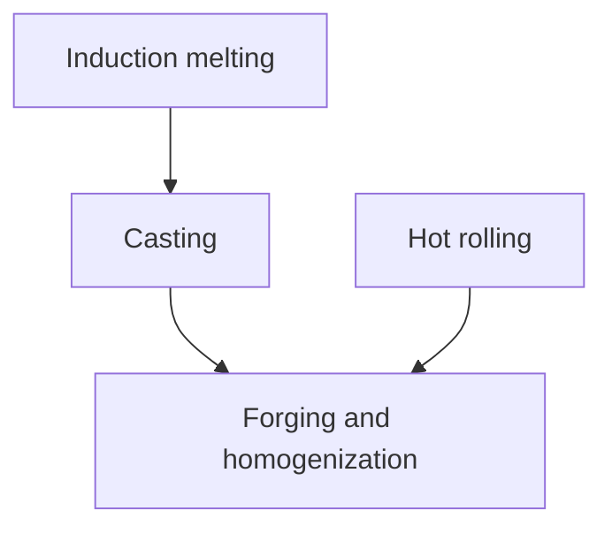

Research Article

# Low-density and high-modulus steel achieved by hypereutectic $\mathrm { T i B } _ { 2 }$ and high Al ferrite phase

Jikui Liu a , Yizhuang Li a,∗ , Qianduo Zhuang a , Mingxin Huang b , Wei Xu a,∗

a State Key Laboratory of Digital Steel, Northeastern University, Shenyang 110819, China
b Department of Mechanical Engineering, The University of Hong Kong, Hong Kong, China

# a r t i c l e i n f o

Article history:

Received 26 June 2025

Revised 31 August 2025

Accepted 19 September 2025

Available online 1 October 2025

Keywords:

Low-density steel

--ferrite

Heterogeneity

Young’s modulus

Synchrotron X-ray diffraction

Dislocation density

Finite element method

# a b s t r a c t

High-aluminum low-density steels have been extensively studied due to their potential for lightweight and energy-saving applications. However, high aluminum content causes severe problems, such as a marked reduction in Young’s modulus and also carbide-induced challenges in casting and processing. This study aims to tackle these issues by advancing the concept of lightweight steels, offering a new class of carbon-free, austenite-based low-density triplex steel. This novel approach enables the utilization of ceramic and δ-ferrite to achieve an optimal balance of physical properties (low density and high Young’s modulus) and mechanical properties. Specifically, using conventional cost-effective steel fabrication routes, we produced an as-hot-rolled heterogeneous microstructure characterized by a fully equiaxed-austenitic matrix embedded with elongated δ-ferrite bands and micron-sized TiB2 particles. Physically, this new low-density steel achieves an impressively low density of 6.88 g cm−3 while preserving a high Young’s modulus of 225 GPa, resulting in a high specific modulus. Mechanically, this new steel shows nearly a 100 % increase in yield strength compared to the conventional Fe-TiB steel, while retaining good ductility. The improved strength-ductility balance is attributed to the dual roles of δ-ferrite and its associated microstructural heterogeneity: the high dislocation density in δ-ferrite strengthens the steel through the composite effect, and the soft/hard phase contrast between δ-ferrite and austenite promotes additional strain hardening via the generation of geometrically necessary dislocations. This work presents a viable approach to producing low-density, stiff, strong, and ductile steels on a large scale for cost-effective lightweight applications.

© 2026 Published by Elsevier Ltd on behalf of The editorial office of Journal of Materials Science &

Technology.

# 1. Introduction

Steels are extensively used in key sectors such as aerospace, automobile, and construction industries [1–3], all of which have a strong demand for weight reduction to lower fuel consumption and improve engineering performance. Traditionally, ultrahighstrength steels have been used in these high-demand sectors for gauge reduction and, consequently, weight savings [1–4]. Yet this approach has limitations, since continuously down-gauging steel sheets compromises stiffness [5,6], which is crucial for structures to maintain a minimal margin of elastic deformation under service loading conditions. Further weight savings can be achieved directly via decreasing the density (ρ) of steels, primarily through aluminum (Al) alloying [7]. Typically, the addition of 1 wt. % Al results in a 1.3 % reduction in the density of steels [8]. To achieve the desired density below $7 \ { \mathrm { g } } \ { \mathrm { c m } } ^ { - 3 } ,$ , a high Al content (∼8–10 wt. %) is necessary, as demonstrated by the widely studied Fe-Mn-Al-C type low-density steels (LDSs) extensively reviewed over the past decade [5,9,10].

Nevertheless, high amounts of Al in these low-density steels cause several issues that hinder their practical applications. The foremost problem is the drastic decrease in Young’s modulus (E) and the associated compromise of stiffness. Incorporating 1 wt. % of Al results in a 2.0–2.5 % reduction in E [10]. Consequently, the typical E value of the popular Fe-Mn-Al-C low-density steels is merely 160–190 GPa [5,6,10–13], still >10 % lower than that of conventional high-strength steels (E 210 GPa). This issue is nontrivial, as E—measuring the strength of atomic bonding at a scale much smaller than the characteristic length scale of metallurgical defects—can be only marginally adjusted through thermomechanical processing [5,6]. Moreover, as Al content increases, the rate of E reduction exceeds the rate of density change, resulting in a loss of specific modulus (E/ρ). Nonetheless, a high E/ρ value is desirable for maximizing the weight-saving potential of low-density steels. In addition, high Al content in Fe-Mn-Al-C lowdensity steels presents challenges in casting and processing, often indicative of lower quality in steelmaking practice [10]. For instance, Al induces intense chemical reactions during melting and casting, resulting in deviations from the target chemical compositions [10]. Furthermore, the formation of alumina in the liquid state can cause nozzle clogging during continuous casting [10].

It is therefore desirable to develop a new class of low-density steel that overcomes the limitations of existing Fe-Mn-Al-C steels with high Al contents. We achieve this by redesigning the original chemical compositions of the $\mathrm { F e - M n - A l - C }$ system, replacing a portion of Al with titanium (Ti) and the entire carbon (C) content with boron (B). The concept behind this alloy design is given as follows.

The central idea is inspired by the composite effect, where blending metallic components with light and rigid ceramic particles results in an overall decrease in ρ and an increase in E. Among various ceramic candidates, titanium diboride $\left( \operatorname { T i B } _ { 2 } \right)$ [14–17] stands out due to its high stiffness, low density, and ability to form directly during liquid-phase solidification of Fe-Ti-B melts [17–19], distinguishing TiB2 from externally added reinforcements (e.g., exsitu ceramics). This approach outperforms traditional fabrication methods such as powder metallurgy [20,21] and stir casting [22] in terms of productivity, cost, and bonding strengths of steel/ceramic interfaces [20,22]. These advantages lead to the concept of incorporating Ti and B into the alloying system while eliminating C, which tends to form TiC with inferior physical properties.

However, using ceramic particles alone cannot achieve the desired low density comparable to LDSs [23] due to the limited amount of ceramic phase. Further density reduction by increasing ceramic content would lead to a complete loss of material ductility because of the inherent brittleness of ceramics. Although this problem can be alleviated by particle refinement to the nanometer scale [24,25] using techniques with accelerated solidification kinetics, such as splat cooling [26], spray-forming [14], and additive manufacturing [27], additional challenges, such as high costs, stringent processing, and small sample sizes, restrict their practical application in bulk components. Therefore, instead of relying on small particles, we choose to leverage the beneficial lightweight effect of Al while keeping its content within acceptable limits. As such, the combined effects of lightweight element and ceramic phase will ultimately achieve the designed low density of ∼6.88 g cm−3 while maintaining a high Young’s modulus, thus offering a high specific modulus.

One issue that remains to be addressed is the deteriorated mechanical properties after adding ceramic particles, a universal problem for ceramic-reinforcement metallic materials [28], including aluminum [29], magnesium [30], and titanium [31] metallic systems with ceramic particles (e.g., $\mathsf { A l } _ { 2 } \mathsf { O } _ { 3 }$ or TiC) used for structural applications. In contrast to the mentioned idea of refining particles at high costs, here we propose to leverage the matrix microstructure to promote extra strengthening mechanisms, which are key to delaying plastic instability at a higher flow stress. This approach is particularly valuable given that most existing ceramicreinforcement steels exhibit simple matrix microstructures and a lack of strengthening mechanisms. For example, hot-rolled monolithic ferritic steel with $\mathrm { T i B } _ { 2 }$ shows a low yield strength $( \sigma _ { \mathbf { y } } )$ of 257 MPa and a uniform elongation (UE) of 20 %, inferior to the dual-phase steels [32].

In this context, we choose to maintain Mn at approximately 15 wt. %, in accord with existing austenitic LDSs but at a lower level. This medium Mn content, combined with additions of Al, Ti, and B, results in the formation of harder δ-ferrite bands and micron-sized TiB particles within the softer austenite matrix in the as-hot-rolled state. This is a heterogeneous triplex microstructure, in stark contrast to previously reported homogeneous steel matrices. This approach allows us to leverage the beneficial effects of δ-ferrite [33]. The harder δ-ferrite regions with higher dislocation densities increase the overall $\sigma _ { \boldsymbol { \mathrm { y } } }$ of the steel through the composite effect. Furthermore, the softer austenite regions plastically deform more readily than the δ-ferrite regions, creating strain gradients and consequently storing geometrically necessary dislocations (GNDs) [34], which enhance strain hardening and improve the strength-ductility synergy.

Overall, this work aims to expand the alloying spectrum of lightweight steels by designing a new low-density steel that overcomes the limitations of existing Fe-Mn-Al-C systems. The key advantages of this new steel include: (1) a very low density comparable to high-Al steels; (2) an increased Young’s modulus surpassing that of conventional high-strength steels; (3) a significantly reduced Al content compared to existing LDSs; (4) an excellent strength-ductility combination among existing ceramicreinforcement steels; (5) production feasibility using conventional steel metallurgy. Additionally, this work will systematically investigate the deformation mechanisms that contribute to the mechanical properties through experimental characterization and finite element simulation analysis.

# 2. Methods

# 2.1. Materials

A 50 kg cast ingot with the nominal composition of Fe-15.5Mn-3.95Al-5Ti-2.15 B (wt. %) was prepared using vacuum induction melting. Here, the nominal composition was chosen to allow for 14 vol. % TiB embedded in the matrix consisting of δ-ferrite (obtained from liquid phase) and austenite, as initially determined from the phase diagram calculations (Fig. 1(a)) using Thermo-Calc software and TCFE9 database. The ingot was homogenized at 1373 K for two hours and was subsequently hot rolled in the two-phase region in five rolling steps with the finishing temperature of 1173 K to produce a 3 mm thick sheet, followed by air cooling to room temperature. Fig. 1(b) illustrates a schematic of the processing routes. The actual chemical composition of the rolled sheet was measured to be Fe-16Mn-3.9Al-5.11Ti-2.09B (wt. %). The density of this new steel was determined by the hydrostatic weighing method (Archimedes’ principle) using an electronic densimeter. The Young’s modulus was measured by the impulse excitation technique with a solid material dynamic performance analyzer, performed on the specimen with dimensions of 100 mm  25 mm  4 mm. This instrument excites the test specimen with a light mechanical impact and performs an analysis of the resonant frequency using dedicated software. The measured Young’s modulus is more accurate than that determined by quasistatic tensile testing.

# 2.2. Microstructural characterizations and mechanical testing

Microstructures of the present low-density steel before and after tensile straining were characterized by scanning electron microscopy (SEM), electron backscatter diffraction (EBSD), and transmission electron microscopy (TEM). The surface of metallographic specimens was prepared by mechanical grinding with the final polishing using a 1 μm (particle size) diamond suspension, followed by vibrational polishing using a colloidal suspension solution with a mean particle size of 50 nm. SEM was performed on a Zeiss Gemini 300 with an acceleration voltage of 5 kV and an aperture size of 30 μm. EBSD was performed on the same Zeiss Gemini 300 equipped with an Oxford-EBSD system, using an acceleration voltage of 20 kV and an aperture size of 120 μm. The EBSD data were analyzed using the TSL OIM Analysis 7 software. The Kernel Average Misorientation (KAM) was computed up to the third neighbor shell, using a maximum misorientation angle of 5°. The volume fraction of $\mathrm { T i B } _ { 2 }$ was quantitatively analyzed by using ImageJ software. Chemical characterization was performed with energydispersive X-ray spectroscopy (EDX) via SEM at 20 kV. For TEM, disks with a diameter of 3 mm were punched out of the mechanically grinded thin foils with a thickness of 100 μm, and were prepared by double-jet electro-polishing using a solution of 12.5 vol. % perchloric acid and 87.5 vol. % ethanol at $- 2 5 ~ ^ { \circ } C$ and 30 V. TEM observation was carried out in a FEI $G ^ { 2 }$ F20 operated at 200 kV. Three-dimensional micro-computerized tomography (CT) scanning was performed using the nanoVoxel-3000. The testing current, testing voltage, and exposure time were 30 μA, 60 kV, and 5.5 s, respectively.

line

| Temperature (°C) | Liquid | Ferrite | Austenite | TiB₂ |
| ---------------- | ------ | ------- | --------- | ---- |
| 600              | 0.0    | 0.0     | 0.7       | 0.15 |
| 750              | 0.0    | 0.0     | 0.85      | 0.15 |
| 900              | 0.0    | 0.0     | 0.85      | 0.15 |
| 1050             | 0.0    | 0.4     | 0.6       | 0.15 |
| 1200             | 0.0    | 0.85    | 0.0       | 0.15 |
| 1350             | 0.4    | 0.6     | 0.0       | 0.15 |
| 1500             | 1.0    | 0.0     | 0.0       | 0.15 |

flowchart

Fig. 1. Alloy design and processing routes for the present low-density steel: (a) Volume fraction of equilibrium phases determined by phase diagram calculations. (b) Schematic of the processing routes.

Tensile samples in dog-bone shape with a gauge length of 25 mm and a gauge width of 6 mm were cut from the hotrolled sheet by electrical discharge machining, with tensile axes parallel to the rolling direction. Quasi-static uniaxial tensile tests were performed using a SANS CMT-3000 testing machine with a nominal strain rate of $1 \times 1 0 ^ { - 3 } \ s ^ { - 1 }$ at room temperature. Highresolution microscopic digital image correlation (μ-DIC) was employed to characterize the localized strain distributions during the pseudo in-situ tensile testing.

# 2.3. Synchrotron XRD and dislocation density measurement

To measure the evolution of dislocation densities in the matrix phases of δ-ferrite and austenite, synchrotron X-ray diffraction (s-XRD) experiments were performed in the reflection mode at the beamline BL02U2 in the Shanghai Synchrotron Radiation Facility (SSRF). To eliminate residual stress layers, the surfaces of the samples, both before and after tensile straining, were subjected to mechanical grinding and vibrational polishing, following the same procedure as described for the EBSD specimens. The energy of the synchrotron X-ray was 21.7 keV, corresponding to a wavelength of 0.5714 A.˚ The beam size was 0.5 mm 1 mm. The s-XRD data in the form of diffraction rings were recorded using an area detector for high acquisition speed and data quality. The diffraction rings were then converted into one-dimensional s-XRD patterns by integration. The modified Williamson-Hall (MWH) method was employed to calculate dislocation density. The instrumental profile of LaB6 from the same synchrotron facility was used. For each diffraction pattern, the dislocation-induced peak broadening in multiple peaks was extracted, and the corresponding dislocation density was calculated.

# 2.4. Finite element simulations

The quantitative relationship between microstructure and mechanical properties for the present low-density steel was analyzed using the finite element method (FEM). Here, we use a twodimensional representative volume element (RVE) based on the EBSD result, as depicted in Fig. 2. In terms of RVE construction, the mapping algorithm utilizes EBSD image pixels to facilitate automatic meshing and phase assignment, with further details provided in the previous work [35]. While discrepancies between twodimensional RVE and three-dimensional microstructure cannot be avoided, it has been shown that the plane strain assumption can be fairly used to simulate the macroscopic mechanical responses of real materials [36,37]. The chosen mesh type for the RVE is CPE4. In contrast to the commonly used 80 μm 80 μm twodimensional RVEs [38,39], our RVE dimensions match the actual side length of 200 μm for the selected EBSD image. Previous studies have shown that a minimum of 250 250 mesh elements is required for a 200 μm 200 μm RVE [40,41]. To improve simulation accuracy, we employed a mesh size of 0.4 μm that corresponds to $5 0 0 \times 5 0 0$ mesh elements.

To better approximate the macroscopic mechanical responses of the bulk material, periodic boundary conditions were applied to the boundary nodes of the RVE model [42], as shown in Fig. 2. The nodal sets corresponding to the up, down, left, and right edges are denoted by a, b, c, and d, respectively. Additionally, reference points 1 (RP-1) and 2 (RP-2) represent locations where loads are applied and fixed. The equations for the periodic boundary condition are:

$$
\left\{ \begin{array}{l} u _ {x} ^ {\mathrm{a}} = u _ {x} ^ {\mathrm{d}} = u _ {x} ^ {\text { left }} \\ u _ {x} ^ {\mathrm{b}} = u _ {x} ^ {\mathrm{c}} = u _ {x} ^ {\text { right }} \\ u _ {x} ^ {\text { right }} - u _ {x} ^ {\text { left }} = u _ {x} ^ {\mathrm{RP-1}} \\ u _ {x} ^ {\mathrm{a}} = u _ {x} ^ {\mathrm{d}} = u _ {x} ^ {\text { up }} \\ u _ {y} ^ {\mathrm{a}} = u _ {y} ^ {\mathrm{d}} = u _ {x} ^ {\text { down }} \\ u _ {y} ^ {\text { up }} + u _ {y} ^ {\text { down }} = u _ {y} ^ {\mathrm{RP-2}} \end{array} \right. \tag {1}
$$

where $u _ { x }$ and $u _ { y }$ are the displacements of points in the x-axis direction and y-axis direction, respectively. The reference point RP-2 is fixed, and RP-1 is uniformly stretched along the x-axis direction.

# 3. Results

# 3.1. Mechanical and physical properties

Fig. 3(a) shows the engineering stress-strain curve of the present low-density steel (red), in comparison with the curves obtained from an existing $\mathrm { F e - T i B } _ { 2 }$ steel (orange) and an interstitialfree steel (black). The chemical compositions of the two reference steels are given in Table S1 in Supplementary materials, and their microstructures are shown in Fig. S1. Two observations can be obtained. First, a direct comparison between the orange and the black curves reveals that any increment of strength due solely to ceramic additions would cause a drastic loss in ductility. Second, despite both $\operatorname { T i B } _ { 2 } .$ -reinforcement steels (red and orange) having a similar volume fraction of ceramic reinforcement, the present steel shows a marked improvement in both $\sigma _ { \boldsymbol { \mathrm { y } } }$ and $\sigma _ { \parallel }$ without sacrificing much of the tensile ductility. Specifically, the present steel exhibits attractive mechanical properties, including $\sigma _ { \boldsymbol { \mathrm { y } } }$ of 503 MPa and $\sigma _ { \mathrm { u } }$ of 672 MPa, which are 22 % and 30 % more than the values of the existing Fe- $\mathrm { T i B } _ { 2 }$ steel (with $\sigma _ { \boldsymbol { \mathrm { y } } }$ of 389 MPa and $\sigma _ { \mathrm { ~ u ~ } } 0 \mathrm { f } \sim 5 4 9 \ \mathrm { M P a } )$ . Notably, the uniform elongation ( 13 %) of the present steel is even higher than that ( 11 %) of the existing Fe-$\mathrm { T i B } _ { 2 }$ steel, indicating that the present approach to increasing the strength does not lead to a loss in ductility.

text_image

(a)
up
a
b
RP-2°
left
y
x d
down
RP-1
right
c

text_image

(b)
γ-Fe
γ-Fe/TiB₂ PB
TiB₂
δ-Fe/TiB₂ PB
δ-Fe
(c)
Austenite
δ-Ferrite
TiB₂

Fig. 2. Finite element simulation set-ups: (a) EBSD-based representative volume element and its boundary conditions. (b) 2D finite element model. (c) A close-up of local finite-element meshes.

line

| Engineering strain (%) | Our LDS (MPa) | Fe-TiB₂ steel (MPa) | IF steel (MPa) |
| ---------------------- | ------------- | ------------------- | -------------- |
| 0                      | 0             | 0                   | 0              |
| 5                      | 600           | 500                 | 250            |
| 10                     | 650           | 550                 | 350            |
| 15                     | 670           | 540                 | 380            |
| 20                     | 660           | 530                 | 390            |
| 25                     | 650           | 520                 | 380            |
| 30                     | 640           | 510                 | 370            |

scatter

| Material       | SYS (MPa g⁻¹ cm³) | Uniform Elongation (%) |
| -------------- | ----------------- | ---------------------- |
| IF steel       | ~30               | ~25                    |
| Fe-TiB₂ steel  | ~60               | ~12                    |
| Our LDS        | ~70               | ~12                    |

scatter

| Specific modulus (GPa g⁻¹ cm³) | SYS × UE (MPa g⁻¹ cm³) | Material        |
| ----------------------------- | ---------------------- | --------------- |
| 20                            | 14                     |               |
| 22                            | 10                     |               |
| 24                            | 8                      |               |
| 26                            | 6                      |               |
| 28                            | 4                      |               |
| 30                            | 2                      |               |
| 32                            | 0                      |               |
| 34                            | 0                      |               |
| 36                            | 0                      |               |
| 26                            | 10                     |               |
| 28                            | 8                      |               |
| 30                            | 6                      |               |
| 32                            | 4                      |               |
| 34                            | 2                      |               |
| 36                            | 0                      |               |
| 28                            | 8                      | IF steel       |
| 30                            | 6                      |               |
| 32                            | 4                      |               |
| 34                            | 2                      |               |
| 36                            | 0                      |               |
| 26                            | 12                     |               |
| 28                            | 8                      |               |
| 30                            | 6                      |               |
| 32                            | 4                      |               |
| 34                            | 2                      |               |
| 36                            | 0                      |               |
| 28                            | 16                     |               |
| 30                            | 10                     |               |
| 32                            | 8                      |               |
| 34                            | 6                      |               |
| 36                            | 4                      |               |
| 28                            | 20                     |               |
| 30                            | 10                     |               |
| 32                            | 8                      |               |
| 34                            | 6                      |               |
| 36                            | 4                      |               |
| 28                            | 18                     |               |
| 30                            | 10                     |               |
| 32                            | 8                      |               |
| 34                            | 6                      |               |
| 36                            | 4                      |               |
| 28                            | 14                     |               |
| 30                            | 8                      |               |
| 32                            | 6                      |               |
| 34                            | 4                      |               |
| 36                            | 2                      |               |
| 28                            | 16                     |               |
| 30                            | 8                      |               |
| 32                            | 6                      |               |
| 34                            | 4                      |               |
| 36                            | 2                      |               |
| 28                            | 14                     |               |
| 30                            | 8                      |               |
| 32                            | 6                      |               |
| 34                            | 4                      |               |
| 36                            | 2                      |               |
| 28                            | 12                     |               |
| 30                            | 6                      |               |
| 32                            | 4                      |               |
| 34                            | 2                      |               |
| 36                            | 0                      |               |
| 28                            | 10                     |               |
| 30                            | 6                      |               |
| 32                            | 4                      |               |
| 34                            | 2                      |               |
| 36                            | 0                      |               |
| 28                            | 8                      |               |
| 30                            | 4                      |               |
| 32                            | 2                      |               |
| 34                            | 0                      |               |
| 36                            | -2                     |               |
| 28                            | 6                      | Fe-TiB₂ steel   |
| 30                            | 4                      | Fe-TiB₂ steel   |
| 32                            | 2                      | Fe-TiB₂ steel   |
| 34                            | -1                     | Fe-TiB₂ steel   |
| 36                            | -3                     | Fe-TiB₂ steel   |
| 28                            | -4                     | Fe-TiB₂ steel   |
| 30                            | -2                     | Fe-TiB₂ steel   |
| 32                            | -1                     | Fe-TiB₂ steel   |
| 34                            | -1                     | Fe-TiB₂ steel   |
| 36                            | -1                     | Fe-TiB₂ steel   |
| 28                            | -5                     | Fe-TiB₂ steel   |
| 30                            | -3                     | Fe-TiB₂ steel   |
| 32                            | -1                     | Fe-TiB₂ steel   |
| 34                            | -1                     | Fe-TiB₂ steel   |
| 36                            | -1                     | Fe-TiB₂ steel   |
| 28                            | -7                     | Fe-TiB₂ steel   |
| 30                            | -5                     | Fe-TiB₂ steel   |
| 32                            | -3                     | Fe-TiB₂ steel   |
| 34                            | -1                     | Fe-TiB₂ steel   |
| 36                            | -1                     | Fe-TiB₂ steel   |
| 28                            | -9                     | Fe-TiB₂ steel   |
| 30                            | -7                     | Fe-TiB₂ steel   |
| 32                            | -5                     | Fe-TiB₂ steel   |
| 34                            | -3                     | Fe-TiB₂ steel   |
| 36                            | -1                     | Fe-TiB₂ steel   |
| 28                            | -10                    | Fe-TiB₂ steel   |
| 30                            | -8                     | Fe-TiB₂ steel   |
| 32                            | -6                     | Fe-TiB₂ steel   |
| 34                            | -4                     | Fe-TiB₂ steel   |
| 36                            | -2                     | Fe-TiB₂ steel   |
| 28                            | -11                    | Fe-TiB₂ steel   |
| 30                            | -9                     | Fe-TiB₂ steel   |
| 32                            | -7                     | Fe-TiB₂ steel   |
| 34                            | -5                     | Fe-TiB₂ steel   |
| 36                            | -3                     | Fe-TiB₂ steel   |
| 28                            | -12                    | Fe-TiB₂ steel   |
| 30                            | -9                     | Fe-TiB₂ steel   |
| 32                            | -7                     | Fe-TiB₂ steel   |
| 34                            | -5                     | Fe-TiB₂ steel   |
| 36                            | -3                     | Fe-TiB₂ steel   |
| 28                            | -13                    | Fe-TiB₂ steel   |
| 30                            | -10                    | Fe-TiB₂ steel   |
| 32                            | -8                     | Fe-TiB₂ steel   |
| 34                            | -6                     | Fe-TiB₂ steel   |
| 36                            | -4                     | Fe-TiB₂ steel   |
| 28                            | -14                    | Fe-TiB₂ steel   |
| 30                            | -11                    | Fe-TiB₂ steel   |
| 32                            | -9                     | Fe-TiB₂ steel   |
| 34                            | -7                     | Fe-TiB₂ steel   |
| 36                            | -5                     | Fe-TiB₂ steel   |
| 28                            | -15                    | Fe-TiB₂ steel   |
| 30                            | -12                    | Fe-TiB₂ steel   |
| 32                            | -9                     | Fe-TiB₂ steel   |
| 34                            | -7                     | Fe-TiB₂ steel   |
| 36                            | -5                     | Fe-TiB₂ steel   |
| 28                            | -16                    | Fe-TiB₂ steel   |
| 30                            | -13                    | Fe-TiB₂ steel   |
| 32                            | -10                    | Fe-TiB₂ steel   |
| 34                            | -8                     | Fe-TiB₂ steel   |
| 36                            | -6                     | Fe-TiB₂ steel   |
| 28                            | -17                    | Fe-TiB₂ steel   |
| 30                            | -14                    | Fe-TiB₂ steel   |
| 32                            | -11                    | Fe-TiB₂ steel   |
| 34                            | -9                     | Fe-TiB₂ steel   |
| 36                            | -7                     | Fe-TiB₂ steel   |
| 28                            | -18                    | Fe-TiB₂ steel   |
| 30                            | -15                    | Fe-TiB₂ steel   |
| 32                            | -12                    | Fe-TiB₂ steel   |
| 34                            | -10                    | Fe-TiB₂ steel   |
| 36                            | -8                     | Fe-TiB₂ steel   |
| 28                            | -19                    | Fe-TiB₂ steel   |
| 30                            | -16                    | Fe-TiB₂ steel   |
| 32                            | -13                    | Fe-TiB₂ steel   |
| 34                            | -11                    | Fe-TiB₂ steel   |
| 36                            | -9                     | Fe-TiB₂ steel   |
| 28                            | -20                    | Fe-TiB₂ steel   |
| 30                            | -17                    | Fe-TiB₂ steel   |
| 32                            | -14                    | Fe-TiB₂ steel   |
| 34                            | -12                    | Fe-TiB₂ steel   |
| 36                            | -10                    | Fe-TiB₂ steel   |
| 28                            | -21                    | Fe-TiB₂ steel   |
| 30                            | -18                    | Fe-TiB₂ steel   |
| 32                            | -15                    | Fe-TiB₂ steel   |
| 34                            | -13                    | Fe-TiB₂ steel   |
| 36                            | -11                    | Fe-TiB₂ steel   |
| 28                            | -22                    | Fe-TiB₂ steel   |
| 30                            | -19                    | Fe-TiB₂ steel   |
| 32                            | -16                    | Fe-TiB₂ steel   |
| 34                            | -14                    | Fe-TiB₂ steel   |
| 36                            | -12                    | Fe-TiB₂ steel   |
| 28                            | -23                    | Fe-TiB₂ steel   |
| 30                            | -20                    | Fe-TiB₂ steel   |
| 32                            | -17                    | Fe-TiB₂ steel   |
| 34                            | -15                    | Fe-TiB₂ steel   |
| 36                            | -13                    | Fe-TiB₂ steel   |
| 28                            | -24                    | Fe-TiB₂ steel   |
| 30                            | -21                    | Fe-TiB₂ steel   |
| 32                            | -18                    | Fe-TiB₂ steel   |
| 34                            | -16                    | Fe-TiB₂ steel   |
| 36                            | -14                    | Fe-TiB₂ steel   |
| 28                            | -25                    | Fe-TiB₂ steel   |
| 30                            | -22                    | Fe-TiB₂ steel   |
| 32                            | -19                    | Fe-TiB₂ steel   |
| 34                            | -17                    | Fe-TiB₂ steel   |
| 36                            | -15                    | Fe-TiB₂ steel   |
| 28                            | -26                    | Fe-TiB₂ steel   |
| 30                            | -23                    | Fe-TiB₂ steel   |
| 32                            | -20                    | Fe-TiB₂ steel   |
| 34                            | -18                    | Fe-TiB₂ steel   |
| 36                            | -16                    | Fe-TiB₂ steel   |
|

Fig. 3. Physical and mechanical properties of the present steel in comparison with other lightweight steels produced via traditional steel metallurgy: (a) A typical tensile engineering stress-strain curve of the present steel in comparison with those of the conventional Fe-TiB2 steel and interstitial-free steel. (b) The property map summarizing the uniform elongation (UE) and specific yield strength (SYS) of the present steel in comparison with other lightweight steels [5,9–12,14,16,23,45–52]. (c) The property map summarizes the key material parameters for lightweight performance, including the specific Young’s modulus and the mechanical properties indicated by the product of specific yield strength and uniform elongation [5,9–12,14,16,23,45–52].

To evaluate the feasibility of the present steel as a lightweight structural material, we measured its key physical properties, including density $\rho$ and Young’s modulus E. The $\rho$ of the present steel is 6.88 $\textrm { g c m } ^ { - 3 }$ , which is much lower than that of Fe-TiB steel and is comparable to the typical densities of conventional Fe-Mn-Al-C low-density steels [7,43,44]. Its E value of 225 GPa is higher than all the existing steels without ceramic reinforcement but slightly lower than that of the $\mathsf { F e } \mathrm { - } \mathrm { T i B } _ { 2 }$ steel. This slightly inferior E is due to its dual-phase matrix microstructure consisting of austenite, as will be shown in Section 3.2. Based on these results, the specific modulus $( E / \rho )$ of the present steel is calculated to be 32.7 GPa g−1 cm3, remarkably higher than the typical value of ${ \sim } 2 5 \mathrm { G P a } \mathrm { g } ^ { - 1 } \mathrm { c m } ^ { 3 }$ for light metals such as aluminum, magnesium, and titanium. In addition, owing to its low density, the present steel has high specific yield strength (SYS) and specific ultimate tensile strength (SUTS) of 73.1 and 97.7 MPa $\mathbf { g } ^ { - 1 } \mathbf { \Lambda } \mathbf { c m } ^ { 3 } .$ , respectively. Accordingly, the SYS versus UE of the present steel is compared with those of existing lightweight steels produced via traditional steel metallurgy, including ceramic-reinforcement and Al-added low-density steels, as shown in Fig. 3(b). The data point of the present steel represents one of the optimal mechanical properties in the SYS-UE space.

Fig. 4. Initial microstructure of the present steel and statistical results of particle size distributions: (a) Representative pseudo 3D SEM image of surface in three different directions. (b) High magnification SEM image at the RD (the enlarged view; inset). (c) High-magnification SEM image with dashed red lines delineating the Mn-rich austenite and Al-rich ferrite regions. (d) XRD patterns. (e) Spatial distribution of particles in different size domains, measured by computerized tomography. Particle size distribution in terms of number fractions (f) and volume fractions (g), respectively.

We further compare both the physical and mechanical properties of the present steel to those of existing lightweight steels (Fig. 3(b, c)). The physical property is represented by the specific modulus, and the mechanical property by the value of SYS UE. Overall, the present steel achieves a good strength-ductility synergy (indicated by SYS  UE value) positioned among existing ceramic-reinforcement steels, while maintaining a high specific modulus. Within the dataset compared, the present steel shows a promising combination of specific strength and ductility.

# 3.2. Initial microstructure

Fig. 4 shows the initial microstructure of the present steel corresponding to the tensile curve (red) in Fig. 3(a), depicting a typical composite microstructure in which particulate reinforcements are randomly embedded in the metallic matrix. The area fraction of particles (dark contrast in Fig. 4(a)), which were verified as $\mathrm { T i B } _ { 2 }$ by the XRD analysis (Fig. 4(d)), is estimated to be 9.6 % from the RD surface and 13.4 % from the ND surface, in accordance with the volume fraction of 12.5 % measured by XRD.

The size of $\mathrm { T i B } _ { 2 }$ particles falls within 2.4–35 μm, with an average value of ∼15 μm. The SEM micrograph in Fig. S2(a) displays the as-cast microstructure, revealing primary TiB2 particles that are coarse and polygonal, with sizes reaching several tens of micrometers. These particles exhibit square, triangular, or hexagonal morphologies and are found either individually or as agglomerates. In contrast, the eutectic $\mathrm { T i B } _ { 2 }$ particles are notably finer and lamellar in structure, appearing as sharp-edged lamellae or with fibrous to helical morphologies [26,53]. Fig. S2(b) illustrates the solidification sequence: initially, primary $\mathrm { T i B } _ { 2 }$ particles form due to the hypereutectic composition of the melt. As these particles grow, the surrounding liquid becomes solute-depleted, promoting the formation of an iron phase before the onset of cooperative eutectic growth. Eutectic $\mathrm { T i B } _ { 2 }$ particles nucleate on either the basal planes of primary TiB2 particles or on the iron phase. Eventually, isolated liquid pools are entrapped by solidified phases. Within these regions, $\mathrm { T i B } _ { 2 }$ subsequently nucleates and develops feather-like, helical, or fibrous structures [26,53]. Following hot rolling, both primary and eutectic $\mathrm { T i B } _ { 2 }$ particles undergo fragmentation, yet retain morphological and dimensional features inherited from the as-cast microstructure. Two types of TiB particles can be identified from the SEM images according to their size and morphology. The first type corresponds to the irregularly shaped, relatively small TiB2 particles with an average size of only a few micrometers. These small particles are either plate-like or needle-like with sharp corners (Fig. 4(a)), suggesting that they are the debris of the as-cast dendritic or lamellae TiB structures that were broken into fine particles by hot rolling. These dendrites or lamellae of $\mathrm { T i B } _ { 2 }$ are characteristic in the as-cast state, and it has been well recognized that they cannot retain their original morphology after hot rolling [53]. By contrast, the second type of $\mathrm { T i B } _ { 2 }$ particles consists of the regularly shaped, coarse particles with an average size of tens of micrometers. These large particles are mostly hexagonal prisms, as identified by their hexagonal shape, which appeared on the specimen’s RD surface $( \mathrm { F i g . ~ } 4 ( \mathsf { b } ) )$ , suggesting that they are the primary $\mathrm { T i B } _ { 2 }$ with hexagonal crystal structure [53,54] that were formed at the early stage of solidification [55]. The c-axes of these hexagonal prisms tend to be parallel to the RD direction, owing to the rigid rotations of these hard particles in the soft metallic matrix during hot rolling. Both large primary $\mathrm { T i B } _ { 2 }$ particles and smaller eutectic $\mathrm { T i B } _ { 2 }$ particles are exclusively in the submicron/micron-scale range $( \geq 0 . 9$ μm; resolvable in EBSD, Fig. S3(d)) and located at grain boundaries, with no $\mathrm { T i B } _ { 2 }$ particles observed within the interior of the matrix grains. The precise distribution of the smaller particles is clearly resolved in the magnified view of Fig. S3. Micro-CT analysis $\left( \mathrm { F i g . ~ } 4 ( \mathbf { e - g } ) \right)$ reveals that while small particles (0.8–5.0 μm) prevail in numbers, coarse particles (10.0–42.7 μm) govern the microstructure by accounting for >80 % of the total area fraction of particles.

The XRD result (Fig. 4(d)) also uncovers the ferrite-austenite dual-phase nature of the matrix, consistent with the EDS elemental mapping of a matrix region (Fig. 4(c), inset) where Mn and Al are partitioned into different grains. To characterize the detailed microstructures of the metallic matrix not visible in SEM images, EBSD observations were performed. Fig. $5 ( \mathsf { a } \mathrm { - } \mathsf { a } _ { 2 } )$ summarizes the microstructural features obtained by the EBSD inverse pole figure (IPF) map (Fig. 5(a)), phase map $( \mathrm { F i g . } 5 ( \mathsf { a } _ { 1 } ) )$ , and the kernel average misorientation (KAM) map $( \mathrm { F i g } . 5 ( \mathsf { a } _ { 2 } ) )$ , revealing the spatial distribution of $\mathrm { T i B } _ { 2 }$ particles embedded in a dual-phase matrix of ferrite and austenite. The area fractions of the austenite, ferrite, and $\mathrm { T i B } _ { 2 }$ particles are estimated from the EBSD result to be around 59 %, 28 % and 13 %, respectively, in accordance with their volume fractions (62 %, 26 % and 12.5 %, respectively) obtained by XRD analysis (Fig. 4(d)). The Al addition promotes the formation of δ-ferrite, which initially formed during solidification (Fig. 1(a)) and became inherited during subsequent hot rolling. Therefore, the matrix exhibits a typical banded or layered microstructure consisting of alternating lamellae of δ-ferrite (red) and austenite (blue), as shown by the phase map (Fig. $5 ( \mathsf { a } _ { 1 } , \mathsf { b } _ { 1 } ) )$ . The average thickness of ferrite bands is ∼4.3 μm, smaller than that of austenite layers ( 12.1 μm). Inside each ferrite band, many δ-ferrite grains remain elongated and are parallel to the rolling direction $( \mathrm { F i g . ~ } 5 ( \mathsf { a } _ { 1 } , \mathsf { b } _ { 1 } ) )$ . These δ-ferrite grains have an average size of 4.4 μm (the inset in $\mathrm { F i g . } ~ 5 ( \mathbf { d } _ { 3 } ) )$ . By contrast, the austenite grains are mostly equiaxed with a larger average size of ∼3.9 μm $\left( \mathrm { F i g . } \ 5 ( \mathsf { b } _ { 3 } ) \right)$ . The KAM mapping of the initial microstructure $( \mathrm { F i g } . ~ 5 ( \mathsf { a } _ { 2 } , ~ \mathsf { b } _ { 2 } ) )$ further reveals a non-uniform strain distribution in the matrix. Specifically, the ferrite lamellae and the corresponding grains possess higher KAM values (green color) than most austenite grains, in which no evident accumulations of misorientations can be observed. Fig. $5 ( \mathsf { c } \mathrm { - c } _ { 3 } )$ shows partially recrystallized grains formed during hot rolling. The Grain Orientation Spread (GOS) technique is employed to distinguish recrystallized and non-recrystallized grains, with larger GOS values indicating a higher degree of plastic deformation caused by lattice distortion. The austenite grains with $G 0 S < 2 ^ { \circ }$ , which can be considered as fully recrystallized, account for 90.8 % (area fraction) of the austenite phase. In comparison, the recrystallized δ-ferrite accounts for only 52.2 % of the ferrite phase (Fig. 5(c3)).

Due to the limited spatial resolution of SEM and EBSD, TEM observations were further performed to examine the initial microstructure of the hot-rolled sample. Fig. 6 presents typical brightfield TEM images of the hot-rolled microstructure. δ-ferrite grains distant from TiB particles exhibit dense dislocation tangles (red arrows in Fig. 6(a)), while austenite grains show sparse dislocation distributions (yellow arrows in Fig. 6(b)). Weak beam bright-field TEM $( \mathrm { F i g . } \ 6 ( \mathsf { a } _ { 2 } ) )$ reveals detailed dislocation tangles at the δ-ferrite/TiB interface. The superimposed selected-area diffraction pattern (SADP) in Supplementary Fig. S4, acquired along the ${ < } 1 1 \bar { 2 } 0 { > }$ zone axis of the smaller TiB2 particle, confirms a crystallographic orientation relationship at this interface: $\{ 1 1 0 \} _ { \delta \mathrm { - f e r r i t e } } \Vert \{ \bar { 1 } 1 0 1 \} _ { \mathrm { T i B } 2 }$ and $< 1 1 1 > _ { \delta \mathrm { - f e r r i t e } } \parallel < 1 1 \bar { 2 } 0 > _ { \mathrm { T i B 2 } }$ . This relationship suggests a coherent or semi-coherent interface $( \mathrm { F i g . } \ \mathsf { S 4 } ( \mathsf { a } _ { 4 } ,$ $\mathbf { a } _ { 5 } )$ and corresponding SADP). At austenit $\cdot / \mathrm { T i B } _ { 2 }$ interfaces (marked by a blue line in Fig. $6 ( \mathsf { b } _ { 1 } , \mathsf { b } _ { 2 } ) )$ , weak beam bright-field images $\left( \mathrm { F i g . } \ 6 ( \mathsf { b } _ { 2 } ) \right)$ show substantially lower dislocation densities than observed at $\delta \mathrm { - f e r r i t e / T i B _ { 2 } }$ interfaces. SADP analysis (Fig. S4(a– $\mathsf { a } _ { 3 } , \mathsf { b } \mathrm { - b } _ { 2 } ) )$ revealed no clear crystallographic orientation relationship for interfaces involving either δ-ferrite/large $\mathrm { T i B } _ { 2 }$ particles or austenite/TiB2. Notably, dislocation tangles occur at all $\mathrm { T i B } _ { 2 } /$ /matrix interfaces regardless of particle size, consistent with the exclusive grain boundary distribution of the TiB2 particles. This result is consistent with the KAM map $( \mathrm { F i g } . 5 ( \mathsf { a } _ { 2 } , \mathsf { b } _ { 2 } ) )$ showing higher dislocation densities in the δ-ferrite than in the austenite.

# 3.3. Deformed microstructure

To illuminate the underlying deformation mechanisms of the present steel, EBSD scanning was performed on the uniformly strained area of the sample after tensile straining to fracture. The comparison between the phase maps before and after tensile deformation $( \mathrm { F i g s . } ~ 5 ( \mathsf { a } _ { 1 } )$ and $7 ( \mathsf { a } _ { 1 } ) )$ reveals that the volume fractions of austenite and δ-ferrite remain nearly constant during the entire deformation process, indicating that no phase transformation from austenite to martensite occurred. Fig. $7 ( \mathsf { a } _ { 2 } )$ shows the KAM mapping of the deformed microstructure, where defects accumulate in both δ-ferrite and austenite. This is in stark contrast to the initial microstructure $( \mathrm { F i g } . 5 ( \mathsf { a } _ { 2 } ) )$ , where defects exist predominantly in the δ-ferrite. Furthermore, TEM was employed to investigate dislocation microstructures after tensile deformation. In both δ-ferrite $( \mathrm { F i g . } ~ 7 ( \mathbf { a } _ { 1 } ) )$ and austenite (Fig. $7 ( \mathsf { a } _ { 2 } ) )$ grains away from $\mathrm { T i B } _ { 2 }$ particles, dense dislocation tangles were observed, contrasting sharply with the individually identified dislocations in the undeformed samples (Fig. 6). These findings confirm significant dislocation activity and accumulation within δ-ferrite and austenite grains. Fig. $7 ( \mathsf { b } _ { 1 } , \mathsf { b } _ { 2 } )$ presents bright-field TEM of a δ-ferrite/TiB2 interface under standard and weak beam conditions (Fig. S5 for details). The ferrite phase exhibits dislocation multiplication, indicating the greater capacity of large grains to accumulate dislocations during plastic deformation. Analogous bright-field TEM images of an austenite/TiB2 interface $( { \mathrm { F i g s . ~ } } 7 ( \mathbf { c } _ { 1 } , \mathbf { \ c } _ { 2 } )$ and S5) reveal a dislocation forest configuration. Notably, the austenite exhibited the most pronounced increase in dislocation density after straining, as evidenced by the highly compact tangles where dislocation lines are undistinguished in weak-beam bright-field TEM $\left( \mathrm { F i g . } \ 7 ( \mathrm { c } _ { 2 } ) \right)$ . Increasing dislocation density in the austenite phase accommodated strain incompatibility between δ-ferrite and austenite and enhanced the material’s strain hardening. However, direct measurement of dislocation densities via TEM may be impractical due to limitations in sampling capabilities and accurate dislocation counting, especially in regions with high dislocation densities.

# 3.4. Damage evolution

Damage evolution in the LDS was characterized by pseudo-insitu SEM-EBSD analysis during room-temperature tensile testing at incremental macroscopic strains. This approach quantified $\mathrm { T i B } _ { 2 }$ particle fracture and particle/matrix decohesion events. For each strain increment, fracture and decohesion sites were identified on the micrographs. Prior to loading, the initial microstructure exhibited intact $\mathrm { T i B } _ { 2 }$ particles and pre-existing particle/matrix decohesion sites (Figs. 8(a) and $S 6 ( \mathsf { a } , \mathsf { a } _ { 1 } )$ , Fig. $S 9 ( \mathsf { a } , \mathsf { a } _ { 1 } ) )$ . The first defect-containing particle fractures (the red arrow in $\mathrm { F i g } . 8 ( \mathbf { a } _ { 1 } ) )$ occurred at the true plastic strain $\varepsilon _ { \mathsf { p } } = 0 . 0 0 6 9$ and the applied true stress $\sigma _ { \mathrm { a } } = 5 5 6 ~ \mathrm { M P a }$ (exceeding the yield stress $\sigma _ { 0 . 2 } = 5 0 3 ~ \mathrm { M P a } )$ . During tensile deformation, larger particles experienced elevated stress concentrations, increasing their susceptibility to cracking $\left( \mathrm { F i g s . ~ } 8 ( \mathsf { a - a } _ { 3 } ) \right.$ and S6–S9). Crucially, the largest particles (> 10 μm) dominated the microstructure, constituting > 80 % of the volume fraction of $\mathrm { T i B } _ { 2 }$ and thus dictating bulk mechanical behavior. In contrast, smaller particles (0.8–5.0 μm) accounted for only 1.01 % of the volume fraction (Fig. 4(g)) and negligibly influenced mechanical performance.

text_image

(a)
RD
TD
ND
0001 1210 001
0110 101 50 µm

text_image

(a₁)
Y
b-E
TiB₂
50 µm

natural_image

3D microscopic surface image with color scale (low to high, 50 μm) and label (a₂), showing granular texture without any readable text or symbols.

text_image

(b)
IPF
0001 1210 001
0110 101
111

heatmap

(c)
GOS
| Min | Max | Fraction |
|---|---|---|
| 0 | 2 | 0.826 |
| 2 | 3 | 0.050 |
| 3 | 4 | 0.036 |
| 4 | 5 | 0.035 |
| 5 | 12 | 0.051 |

text_image

(b₁)
Phase
Y δ-F TiB₂

heatmap

(c₁) γ-GOS
| Min | Max | Fraction |
|---|---|---|
| 0 | 2 | 0.908 |
| 2 | 3 | 0.030 |
| 3 | 4 | 0.028 |
| 4 | 5 | 0.022 |
| 5 | 12 | 0.012 |

text_image

(b₂)
KAM
TD
RD
low	high 20 µm

heatmap

(c₂)
δ-F-GOS
| Min | Max | Fraction |
|---|---|---|
| 0 | 2 | 0.522 |
| 2 | 3 | 0.120 |
| 3 | 4 | 0.081 |
| 4 | 5 | 0.096 |
| 5 | 12 | 0.180 |
20 µm

bar

| Grain size (μm) | Relative frequency (%) |
| --------------- | ---------------------- |
| 0               | 5                      |
| 1               | 15                     |
| 2               | 10                     |
| 3               | 7                      |
| 4               | 6                      |
| 5               | 4                      |
| 6               | 3                      |
| 7               | 2                      |
| 8               | 1                      |
| 9               | 1                      |
| 10              | 1                      |
| 11              | 0.5                    |
| 12              | 0.5                    |
| 13              | 0.5                    |
| 14              | 0.5                    |
| 15              | 0.5                    |
| 16              | 0.5                    |
| 17              | 0.5                    |
| 18              | 0.5                    |

bar

| Grain orientation spread (°) | Relative frequency (%) |
| ---------------------------- | ---------------------- |
| 0                            | 70                     |
| 1                            | 5                      |
| 2                            | 1                      |
| 3                            | 1                      |
| 4                            | 1                      |
| 5                            | 1                      |
| 6                            | 1                      |
| 7                            | 1                      |
| 8                            | 1                      |
| 9                            | 1                      |
| 10                           | 1                      |

Fig. 5. EBSD analysis of the initial microstructure of the present steel: Representative pseudo 3D stereographic microstructure, including IPF (a), phase map (a ), and KAM map (a2). Two-dimensional views of IPF map (b), phase map (b1), KAM map (b2), and Grain size distributions of austenite and δ-ferrite $( \mathsf { b } _ { 3 } ) .$ . The GOS maps of sample (c), austenite GOS maps $( \mathsf { c } _ { 1 } ) ,$ , δ-ferrite GOS maps (c2), and GOS frequency distributions of austenite and δ-ferrite (c3). Color keys are provided in and for IPF maps (a, b), phase maps (a1, b1), KAM maps (a2, b2), and GOS maps (c–c2), respectively. TD and RD refer to the transverse direction and rolling direction, respectively.

Initial crack widths increased progressively with plastic strain due to crack tip blunting, which effectively retarded crack propagation (Figs. $8 ( \mathsf { a } _ { 3 } )$ and S6–S9). This blunting mechanism likely originated from the high stress fields ahead of the crack tips. Notably, multiple cracking observed in some TiB particles (red arrows, Figs. S7 and S8) confirms persistent load transfer between matrix and particles following initial fracture. Such continued load transfer facilitates energy storage within fractured $\mathrm { T i B } _ { 2 }$ particles— a phenomenon experimentally verified by Gammage et al. [63]. Neighboring cracks coalesced via secondary matrix cracking, ultimately leading to final fracture during the last strain stages.

Statistical analysis of 336 TiB2 particles, including 189 predominantly austenite-contacting particles and 147 primarily ferritecontacting ones (Figs. S6–S9), was performed. Phase affiliation was determined by calculating the perimeter fraction in contact with adjacent grains: particles with $> 2 / 3$ austenite-contact perimeter were classified as austenite-surrounded; those below this threshold were ferrite-surrounded. The results identify $\mathrm { T i B } _ { 2 }$ fracture as a major damage source in LDS $( \mathrm { F i g . ~ } 8 ( \mathsf { a } _ { 4 } , \mathsf { a } _ { 5 } ) )$ . Notably, austenitesurrounded particles exhibited significantly higher fracture frequencies. This is attributed to their encapsulation by multiple austenite grains $\left( \mathrm { F i g . } 5 ( \mathbf { b } _ { 1 } ) \right)$ , where single-slip activation in individual grains subjects TiB particles to multi-directional shear strains [56], driving crack initiation. Micro-voids coalescence from these damage mechanisms governs the ultimate failure mode. Therefore, particle fracture tends to accelerate final specimen failure more than particle decohesion does.

text_image

(a)
Dislocations tangles
(a1)
Dislocations tangles
BCC
(b2)
BCC
Dislocations tangles
S=101
200 nm
200 nm
(b)
Dislocations tangles
(b1)
FCC
(b2)
TiO2
FCC
Dislocations tangles
FCC <011>
100 nm
100 nm
100 nm
100 nm

Fig. 6. The morphologies of dislocations within the hot-rolled microstructure of the present steel: (a) δ-ferrite grain distant from TiB particles (BF-TEM; SADP inset). (a ) Dislocation pile-ups at δ-ferrite/TiB2 interface (BF-TEM). (a2) Dislocation tangles at same interface (weak beam BF-TEM; SADP inset, $g = 1 0 1 ) .$ . (b) Austenite grain away from TiB2 particles (BF-TEM; SADP inset). $\left( \mathsf { b } _ { 1 } \right)$ Dislocation pile-ups at austenite/ TiB2 interface (blue line; BF-TEM). (b2) Sparse dislocation tangles at the same interface (weak beam BF-TEM; SADP inset, $g = 1 1 { \bar { 1 } } )$ .

Post-fracture analysis near the fracture surface (Fig. 8(b–b2)) revealed numerous voids that result from the cracking of large primary $\mathrm { T i B } _ { 2 }$ particles, as indicated by the blue arrows in Fig. $8 ( \mathsf { b } - \mathsf { b } _ { 2 } )$ . In contrast, smaller particles generally remain intact. The cracks are oriented nearly perpendicular to the tensile axis, suggesting that the fracture of large primary particles is stress-driven due to increased load-bearing with larger sizes. Interestingly, we observed substantial particle/matrix decohesion, as indicated by the red arrows in Fig. $8 ( \mathsf { b } _ { 1 } , \mathsf { b } _ { 2 } )$ . Fractography (Fig. $8 ( \mathsf { c } , \mathsf { c } _ { 1 } ) )$ further demonstrates a mixed fracture mode, comprising ductile dimples (yellow arrows), quasi-cleavage fractures of $\mathrm { T i B } _ { 2 }$ particles (blue arrows), and particle/matrix decohesion (red arrows).

# 3.5. Strain partitioning behavior

To evaluate the evolution of strain partitioning and localization within the microstructure, correlative μ-DIC measurements were performed during pseudo-in situ tensile testing [57,58]. The initial microstructure was characterized by EBSD prior to deformation (Fig. 9(a)). A representative region exhibiting volume fractions of austenite, δ-ferrite, and $\mathrm { T i B } _ { 2 }$ phases statistically consistent with XRD data (Fig. 4(d)) was selected. Corresponding local strain distributions revealed microstructural details within the framed area of Fig. 9(a) phase map. With tensile stress applied parallel to the RD, strain partitioning was quantified through local microscopic von Mises strain maps [57,58]. Measurements continued to 15 % engineering strain to capture microstructural evolution in the transition regime where strain-induced planar faults initiate at phase boundaries.

Strain localizations maintained a multiregional distribution rather than concentrating continuously and rapidly in a single area (Fig. 9(b–f)). These strain-concentrated regions aligned at approximately $4 5 ^ { \circ }$ to the loading axis. Detailed strain profile analysis revealed high strain ( 10 %) concentrated at the small $\mathrm { T i B } _ { 2 } / \mathrm { \Omega }$ δ-ferrite interface (Fig. 9(g)). Local strains around micro-sized $\mathrm { T i B } _ { 2 }$ particles were further examined (Fig. 9(h, i)). Fig. 9(h) illustrates strain distribution in the matrix surrounding TiB particles of varying sizes, showing elevated strain ( 16 %) at austenite/ $\mathrm { T i B } _ { 2 }$ phase boundaries. At higher plastic deformation without cracking, strain concentrations (∼20 %) were also observed near sharp $\mathrm { T i B } _ { 2 }$ /austenite and $\mathrm { T i B } _ { 2 }$ /ferrite boundaries (green arrows, Fig. 9(a) and corresponding Fig. 9(i)). Additionally, local strains in the matrix (austenite or δ-ferrite) adjacent to $\mathrm { T i B } _ { 2 }$ particles significantly exceeded those farther from the particles (between the two dashed lines in Fig. 9(i)), indicating that $\mathrm { T i B } _ { 2 }$ particles effectively promote plastic deformation in the surrounding matrix. Moreover, with increasing applied strain, the accumulated strain progressively surpassed levels observed in δ-ferrite, reflecting higher local strain in the softer austenite phase. This resulted from strain incompatibility between austenite and δ-ferrite during plastic deformation. Consequently, the deformed steel sample exhibited enhanced tensile strength and ductility.

# 3.6. Evolution of dislocation density

Due to the challenge of quantitatively assessing the individual strengthening effects of ferrite and austenite using TEM, we employ an alternative approach in this study. Specifically, we measure the dislocation density through synchrotron X-ray diffraction experiments on specimens before and after tensile tests. Fig. 10 illustrates the line profiles of the undeformed and deformed samples.

In each line profile, three phases were identified: austenite (with lattice parameter $a _ { \gamma } \approx 0 . 3 6 8$ nm), ferrite $( a _ { \delta } \approx 0 . 2 9 5$ nm), and TiB2 $( a _ { \mathrm { T i B } 2 } \approx 0 . 3 0 9$ nm, $c _ { \mathrm { T i B 2 } }$ ≈ 0.328 nm). Specifically, for austenite, nine peaks including (111), (200), (220), (311), (222), (400), (331), (420), and (422) were indexed. For ferrite, six indexed peaks were (110), (200), (211), (220), (222), and (321). To calculate the dislocation density, we employed the modified Williamson-Hall (MWH) method [59]. According to this method, the broadening of the diffraction peaks correlates closely with microstructural parameters such as the average crystalline size (L) and dislocation density (ρ) as [60]

$$
\Delta K = 0. 9 / L + \left(\pi A ^ {2} b ^ {2} / 2\right) ^ {1 / 2} \rho^ {1 / 2} \left(K \bar {C} ^ {1 / 2}\right) + O \left(K ^ {2} \bar {C}\right) \tag {2}
$$

where K is the reciprocal of the lattice spacing, -K is the full width at half maximum (FWHM) of the corresponding peak plotted against K, determined by fitting the peak with pseudo-Voigt function, and L is the average size of the coherently scattering domains, which corresponds to the average size of dislocation substructures. A is a constant determined by the outer cut-off radius of the dislocation. A > 1 indicates a random dislocation arrangement, while a value <1 suggests a highly correlated arrangement. For our work, we set A to 1 based on the value provided in the Ref. [61] for ferrite and austenite. b is the magnitude of the Burgers vector, and $\rho$ is the dislocation density. C is the average dislocation contrast factor for a specific hkl reflection, given by

Fig. 7. EBSD and TEM bright-field images of the present steel after tensile straining: (a–a ) Pseudo 3D stereographic microstructures represented by IPF, phase maps, and KAM maps, respectively. (b) TEM bright-field image of a δ-ferrite grain distant from TiB2 particles (SADP inset). $\left( \mathsf { b } _ { 1 } \right)$ Dislocation pile-ups and tangles at a δ-ferrite/TiB2 interface (bright-field TEM). (b2) Corresponding SADP of the interface region in (b1). (c) bright-field TEM of an austenite grain away from TiB2 particles (SADP inset). (c1) Dislocation pile-ups with sparse tangles at the austenite/TiB2 interface (bright-field TEM). (c2) Corresponding SADP of the interface region in (c1). Color keys are provided in (a–a2) for IPF maps, phase maps, and KAM maps, respectively.

$$
\overline {{C}} = \overline {{C}} _ {h 0 0} \left(1 - q \frac {h ^ {2} k ^ {2} + k ^ {2} l ^ {2} + h ^ {2} l ^ {2}}{h ^ {2} + k ^ {2} + l ^ {2}}\right) \tag {3}
$$

where $\overline { { C } } _ { h 0 0 }$ and q are two constants depending on the elastic constants $C _ { 1 1 } , C _ { 1 2 }$ , and $C _ { 4 4 } ,$ , and their relations are described by Ungár et al. [62] for cubic crystals. At room temperature, the elastic constants for ferrite are taken as $C _ { 1 1 } = 2 7 3 \mathrm { \ G P a } , C _ { 1 2 } = 1 1 0 \mathrm { \ G P a }$ , and $C _ { 4 4 } = 8 2 \mathsf { G P a }$ [63]. For austenite, the corresponding values are $C _ { 1 1 } = 1 6 9 \mathrm { \ G P a } , C _ { 1 2 } = 8 2 \mathrm { \ G P a }$ , and $C _ { 4 4 } = 9 6$ GPa [64]. Using these constants, we determine $\overline { { C } } _ { h 0 0 }$ and q as 0.248 and 1.660, respectively, for austenite, and 0.160 and 0.605, respectively, for ferrite [62].

In Fig. 10, each diffraction pattern yields nine data points of (K, -K) for austenite and six for ferrite. For each phase, we determine the parameters L and $\rho$ by fitting the best linear relationship between -K and KC 1/2 $\Delta K$ $K \overline { { C } } ^ { 1 / 2 }$ using the method of least squares. The sufficient diffraction peaks (Fig. 10) obtained via synchrotron XRD, along with the resultant data points of $( K \overline { { C } } ^ { 1 / 2 }$ , -K), ensure highquality linear fits. Such linear relationships are visualized in the MWH plots shown in Fig. 10(c, d). For further details on the analysis of synchrotron XRD data using the MWH method, readers may refer to relevant publications [65–67].

Fig. 10(e) shows the calculated dislocation densities before and after straining for both phases. The error bars represent the standard deviation of the linear fitting slope from Fig. 10(c, d). Note that the dislocation density value for the deformed δ-ferrite shows a relatively large uncertainty, attributed to the comparatively weak linear relationship of the data points (empty circles in Fig. 10(c)). But this does not affect the major conclusion drawn from Fig. 10. Specifically, the initial dislocation density of ferrite is $( 1 . 1 \pm 0 . 2 ) \times 1 0 ^ { 1 5 } \mathrm { ~ m } ^ { - 2 }$ , surpassing the value of $( 3 \pm 0 . 7 ) \times 1 0 ^ { 1 4 }$ m−2 for austenite. As the plastic deformation progresses, the dislocation density of ferrite experiences a slight increase, reaching $( 1 . 7 ~ \pm ~ 0 . 7 ) ~ \times ~ 1 0 ^ { 1 5 } ~ \mathrm { m } ^ { - 2 } .$ By contrast, the dislocation density of austenite shows a significant rise by an order of magnitude, reaching $( 2 \pm 0 . 3 ) \times 1 0 ^ { 1 5 } \mathrm { m } ^ { - 2 }$ .

# 4. Simulation results

Analyzing the microstructure-property relationship of ceramicreinforced steels using traditional modeling approaches, such as the mean-field models, is challenging due to the contrasting physical and mechanical properties of the ceramic and metallic phases and to the irregular morphologies and spatial distributions of particles. These factors complicate the microscopic stress-strain analysis, necessitating additional fitting parameters that cause uncertainty. In addition, the banded dual-phase matrix microstructure in the present steel further complicates this modeling task. To address this issue, here we employed the finite element method, which can effectively analyze stress and strain partitioning across different phases with different morphologies, to simulate the local and macroscopic mechanical responses of the present steel.

text_image

(a)
0%
RD
RD Loading direction 20 µm

natural_image

Microscopic image of a material sample with scattered dark particles and a red arrow pointing to a specific feature, scale bar indicates 20 μm (no text or symbols beyond labels)

natural_image

Microstructure image showing grain boundaries with red arrows and a 20 μm scale bar, labeled (a₂), with 5% scale indicator (no text beyond labels)

text_image

(a₃)
9%
20 µm

line

| Engineering Strain (%) | TiB₂ cracks number (FCC) (Number of cracks (cnt)) | TiB₂ decohesion number (FCC) (Number of cracks (cnt)) | TiB₂ cracks number (BCC) (Number of cracks (cnt)) | TiB₂ decohesion number (BCC) (Number of cracks (cnt)) |
|---|---|---|---|---|
| 0 | 50 | 30 | 20 | 15 |
| 2 | 60 | 35 | 25 | 20 |
| 4 | 70 | 40 | 30 | 25 |
| 6 | 80 | 45 | 35 | 30 |
| 8 | 90 | 50 | 40 | 35 |
| 10 | 100 | 55 | 45 | 40 |
| 12 | 105 | 60 | 50 | 45 |
| 14 | 110 | 65 | 55 | 50 |
(a₄)

line

(a5)
| Engineering Strain (%) | TiB2 cracks number (FCC) (%) | TiB2 decohesion number (FCC) (%) | TiB3 cracks number (FCC) (%) | TiB2 decohesion number (FCC) (%) |
|---|---|---|---|---|
| 0 | 15.0 | 10.0 | 7.0 | 6.0 |
| 4 | 20.0 | 12.0 | 8.0 | 8.0 |
| 8 | 25.0 | 15.0 | 10.0 | 10.0 |
| 12 | 30.0 | 18.0 | 12.0 | 12.0 |
| 16 | 32.0 | 20.0 | 15.0 | 15.0 |

text_image

(b)
Loading direction
RD
TD
b₁
100 µm

natural_image

Microscopic view of a material sample with scattered particles and highlighted regions (no text or symbols)

natural_image

Microscopic view of a material surface with labeled regions (b₂) and scale bar (5 μm), showing irregular dark structures and blue/red arrows indicating features.

text_image

(c)
Decohesion
C₁
Primary TiB₂
Eutectic TiB₂
Dimples
Fracture
Void
10 µm

Fig. 8. SEM, EDS, and EBSD micrographs showing damage in the present steel: $\left( \mathsf { a } - \mathsf { a } _ { 3 } \right)$ Pseudo-in-situ SEM images of microstructures at increasing macroscopic tensile strains (room temperature). $\left( \mathsf { a } _ { 4 } , \mathsf { a } _ { 5 } \right)$ Quantified damage mechanisms from SEM-EBSD analysis. (b–b2) Crack propagation pathways near the fracture surface (multi-scale), highlighting: TiB2 particle fracture, particle/matrix decohesion, and cluster damage. (c, c1) Fracture surface morphologies featuring ductile dimples, fractured TiB2 particles, and interfacial decohesion.

The ceramic phase of $\mathrm { T i B } _ { 2 }$ is treated as linearly elastic. This treatment was chosen because the Orowan bypass mechanism is only applicable for nanoscale precipitates dispersed within grain interiors. In contrast, the $\mathrm { T i B } _ { 2 }$ particles in our steel are submicron to coarse micron-sized $( 2 . 4 \mathrm { - } 3 5 $ μm, average 15 μm) and exclusively located at grain or phase boundaries (Section 3.2, Figs. 4, 5, and S3). Micro-CT analysis further confirmed that coarse particles (> 10 μm) dominate the microstructure by volume fraction. Such boundary-localized, micron-sized particles cannot effectively act as Orowan obstacles. Notably, Feng et al. [27] also reported that even nanoscale $\mathrm { T i B } _ { 2 }$ particles refined by ultrafast cooling exhibited a reduced Orowan effect when situated at boundaries. Hence, applying the Orowan equation to the present steel would artificially overestimate the strengthening contribution of $\mathrm { T i B } _ { 2 } .$ In terms of the metallic matrix, the plastic flow of ferrite and austenite phases follows the Von Mises yield criterion. Considering the strain hardening of the two phases, their flow stress σ can be decomposed into several parts as

$$
\sigma = \sigma_ {0} + \sigma_ {\mathrm{gb}} + \sigma_ {\mathrm{dis}} \tag {4}
$$

where $\sigma _ { 0 }$ is the lattice friction stress, $\sigma _ { \mathrm { g b } }$ represents grain boundary strengthening, and $\sigma _ { \mathrm { d i s } }$ is dislocation strengthening. The grainboundary strengthening follows the Hall-Petch relation as

$$
\sigma_ {\mathrm{gb}} = \frac {k _ {\mathrm{HP}}}{\sqrt {d}} \tag {5}
$$

where d is the average grain size and $k _ { \mathrm { H P } }$ is a constant. The Hall-Petch relation is valid for both ferrite and austenite in the present steel, given that their grain sizes are in the micrometer range. The dislocation hardening $\sigma _ { \mathrm { d i s } }$ is a function of dislocation density and described by the Taylor equation [68] as

$$
\sigma_ {\mathrm{dis}} = \alpha M \mu b \sqrt {\rho} \tag {6}
$$

where $\alpha$ is an empirical parameter reflecting the interaction strength between dislocations, M is the Taylor factor, b is the magnitude of the Burgers vector, and $\rho$ is the dislocation density. The evolution of dislocation density during tensile straining is described by the Kocks-Mecking model [69–71] as

text_image

(a)
TD
RD Loading direction 50 µm

natural_image

Microscopic image showing purple fibrous structures with green fluorescent spots, scale bar indicates 20 μm (no text or symbols present)

natural_image

Microscopic image showing a network of interconnected nodes with a 20 μm scale bar, no readable text or symbols present.

heatmap

| Von-Mises equivalent strain |
|---|
| 0.20 |
| 0.18 |
| 0.16 |
| 0.14 |
| 0.12 |
| 0.10 |
| 0.08 |
| 0.06 |
| 0.04 |
| 0.02 |
| 0.00 |

natural_image

Microscopic image showing a network of interconnected nodes with a 20 μm scale bar, no readable text or symbols present.

natural_image

Microscopic image showing colorful fluorescent patterns with scale bar (20 μm) and percentage label (9%), no readable text or symbols beyond labels.

natural_image

Thermal or microscopic image showing surface texture with color gradients and scale bar (20 μm), no readable text or symbols present.

line

| Distance (μm) | 3% | 5% | 7% | 9% | 15% |
|---|---|---|---|---|---|
| 0 | 0.02 | 0.02 | 0.02 | 0.02 | 0.02 |
| 20 | 0.04 | 0.04 | 0.04 | 0.04 | 0.04 |
| 40 | 0.06 | 0.06 | 0.06 | 0.06 | 0.06 |
| 60 | 0.02 | 0.02 | 0.02 | 0.02 | 0.02 |
| 80 | 0.04 | 0.04 | 0.04 | 0.04 | 0.04 |
| 100 | 0.06 | 0.06 | 0.06 | 0.06 | 0.06 |

line

| Distance (μm) | Large TiB₂ | Small TiB₂ | 3% | 5% | 7% | 9% | 15% |
|---|---|---|---|---|---|---|---|
| 0 | 0.00 | 0.00 | 0.00 | 0.00 | 0.00 | 0.00 | 0.00 |
| 20 | 0.01 | 0.02 | 0.01 | 0.01 | 0.01 | 0.01 | 0.01 |
| 40 | 0.03 | 0.06 | 0.03 | 0.04 | 0.05 | 0.06 | 0.07 |
| 60 | 0.05 | 0.12 | 0.05 | 0.07 | 0.10 | 0.12 | 0.14 |
| 80 | 0.04 | 0.14 | 0.04 | 0.06 | 0.11 | 0.13 | 0.15 |
| 100 | 0.03 | 0.12 | 0.03 | 0.05 | 0.10 | 0.12 | 0.14 |
| 120 | 0.02 | 0.10 | 0.02 | 0.04 | 0.08 | 0.11 | 0.13 |
| 140 | 0.01 | 0.08 | 0.01 | 0.03 | 0.06 | 0.09 | 0.11 |
| 160 | 0.01 | 0.06 | 0.01 | 0.02 | 0.05 | 0.08 | 0.10 |

line

| Distance (μm) | 3%    | 5%    | 7%    | 9%    | 15%   |
| ------------- | ----- | ----- | ----- | ----- | ----- |
| 0             | 0.00  | 0.00  | 0.00  | 0.00  | 0.00  |
| 40            | 0.16  | 0.12  | 0.18  | 0.20  | 0.22  |
| 80            | 0.08  | 0.06  | 0.10  | 0.12  | 0.14  |
| 120           | 0.06  | 0.04  | 0.08  | 0.10  | 0.12  |
| 160           | 0.04  | 0.02  | 0.06  | 0.08  | 0.10  |
| 200           | 0.02  | 0.01  | 0.04  | 0.06  | 0.08  |
| 240           | 0.00  | 0.00  | 0.02  | 0.04  | 0.06  |

Fig. 9. Local von Mises strain maps obtained under different macro strains: (a) 0 % (EBSD phase maps show the initial microstructure. $( \mathbf { b } ) \ 3 \ \% . \ ( \mathbf { c } ) \ 5 \ \% . \ ( \mathbf { d } ) \ 7 \ \% . \ ( \mathbf { e } ) \ 9 \ \% . \ ( \mathbf { f } )$ 15 %. (g–i) Local strain profiles across representative phase regions (along arrows in (a) inset), highlighting strain evolution: (g) Smaller TiB2 particles/δ-ferrite matrix regions boundaries (white arrow in (a) inset). (h) Matrix regions/TiB2 particles of various sizes interfaces (black arrow in (a) inset). (i) Across sharp TiB2/austenite and TiB2/δ-ferrite boundaries, and austenite/δ-ferrite interfaces (green arrow in (a) inset).

$$
\frac {\mathrm{d} \rho}{\mathrm{d} \varepsilon} = M \left(k 1 \sqrt {\rho} - k _ {2} \rho\right) \tag {7}
$$

where ε represents the true strain, $k _ { 1 }$ is a constant associated with the athermal storage of the moving dislocations, and $k _ { 2 }$ is the dynamic recovery factor influenced by thermal activation. Since the tensile tests were performed at room temperature and a constant strain rate, $k _ { 2 }$ remains a constant value throughout the tensile straining process.

As shown in Fig. 8, both particle fracture and interface debonding occur during tensile straining. Consequently, we incorporated these damage mechanisms into our models. Crucially, a particle’s fracture strength depends on its volume (as reflected in the Griffith criterion) and internal defects. Therefore, the brittle fracture strength of $\mathrm { T i B } _ { 2 }$ particles was characterized using the Weibull distribution; specific parameters [72] are provided in Table 1. To accurately simulate the micromechanical behavior of the low-density steel, we explicitly modeled the ferrite-TiB2 and austenite-TiB2 interfaces using zero-thickness COH3D8 cohesive elements governed by a bilinear traction-separation (T-S) law. The debonding parameters for this law, calibrated against μ-DIC experimental results, are also given in Table 1. The fracture criterion obeys a Weibull-type law, and the current volume fraction of damaged particles is described by

$$
f _ {\mathrm{d}} ^ {*} = f _ {0} \left(1 - \exp^ {- k \left(\frac {\sigma_ {\mathrm{eq}} - \sigma_ {\mathrm{c}}}{\sigma_ {\mathrm{c}}}\right) ^ {n}}\right) + f _ {\mathrm{d} 0} \tag {8}
$$

where $f _ { 0 }$ is the total proportion of potentially damageable particles, fd0 is the proportion of initially damaged particles, $\sigma _ { \mathsf { c } }$ is the particle critical fracture stress, $\sigma _ { \mathrm { e q } }$ is the equivalent Von Mises stress in the undamaged particles, and n and k describe the process of progressive damage.

Table 1 summarizes the values of parameters for simulating both the present steel and the conventional Fe-TiB steel. The material parameters, including E, v, μ, b, α, M, and $k _ { \mathrm { H P } } ,$ , are sourced from existing literature [73–78]. The grain size d for each matrix phase was obtained from EBSD results (Fig. 5(e)). The initial dislocation density $\rho _ { 0 }$ was determined previously (Fig. 10(e)). The lattice friction stress $\sigma _ { 0 }$ was adjusted to match the yield strength. The two parameters $k _ { 1 }$ and $k _ { 2 } ,$ which control the evolution of dislocation density, were determined using the dislocation density results (Fig. 10(e)) and the tensile curves (Fig. 3(a)).

Using the identified parameters, we now simulate the microstructural and mechanical responses of the present steel under damaged and undamaged conditions, as shown in Fig. 11. The red curves in Fig. 11(a, b) reveal that our simulation results closely match the experimentally measured true stress-strain curves (Fig. 11(a)) and dislocation densities (Fig. 11(b)), confirming that the constitutive model accurately describes the deformation process of the present steel. To further examine the effects of matrix microstructure on the macroscopic mechanical properties, we prepared a second RVE, which contains identical TiB distributions and boundary conditions (Fig. 2) but consists solely of α- ferrite. This second RVE is used to simulate the mechanical properties of the conventional Fe-TiB steel. Compared to the δ-ferrite that initially contains a higher dislocation density and tends to deform more severely due to microstructural heterogeneity, the homogeneous α-ferrite in the conventional Fe- $\cdot \mathrm { T i B } _ { 2 }$ steel is expected to possess a lower initial dislocation density (Table 1) with a moderate dislocation multiplication rate, which is reflected by a reduced athermal storage factor (Table 1). Based on the parameters for α-ferrite, we can predict the tensile mechanical response for both the conventional $\mathrm { F e - T i B } _ { 2 }$ (orange curve) and the interstitialfree steel (black curve, which can be treated as the α-ferrite matrix without $\mathrm { T i B } _ { 2 } ) ,$ , in consistency with experimental results, as shown in Fig. 11(a). Such consistency demonstrates the reliability of our finite element modeling approach. Fig. 11(c) illustrates the stress partitioning among different phases in the present steel, revealing an uneven distribution of phase stresses among these phases: TiB2, the hardest phase, experiences the highest stress levels, while austenite, the softest phase, exhibits the lowest stresses. The de-

(a)

line

| K (nm⁻¹) | Intensity (a.u.) |
| -------- | ---------------- |
| 4        | 111              |
| 5        | 110              |
| 6        | 200              |
| 7        | 2170             |
| 8        | 200              |
| 9        | 2020             |
| 10       | 220              |
| 11       | 2021             |
| 12       | 211              |
| 13       | 311              |
| 14       | 222              |
| 15       | 220              |
| 16       | 3121             |
| 17       | 222              |
| 18       | 400              |
| 19       | 3030             |
| 20       | 331              |
| 21       | 420              |
| 22       | 321              |
| 23       | 422              |

line

| K (nm⁻¹) | Intensity (a.u.) |
| -------- | ---------------- |
| 4        | 10̄10             |
| 5        | 111              |
| 6        | 200              |
| 7        | 2110             |
| 8        | 200              |
| 9        | 220              |
| 10       | 211              |
| 11       | 222              |
| 12       | 311              |
| 13       | 222              |
| 14       | 312              |
| 15       | 222              |
| 16       | 400              |
| 17       | 303              |
| 18       | 331              |
| 19       | 420              |
| 20       | 321              |
| 21       | 422              |

scatter

| KC^1/2 (nm^-1) | ΔK (nm^-1) - Undeformed | ΔK (nm^-1) - Deformed |
| -------------- | ------------------------ | ---------------------- |
| 1.8            | 0.03                     | 0.03                   |
| 2.7            | 0.04                     | 0.05                   |
| 3.0            | 0.04                     | 0.05                   |
| 3.5            | 0.05                     | 0.05                   |
| 3.8            | 0.06                     | 0.07                   |
| 4.8            | 0.06                     | 0.07                   |

line

| KC^1/2 (nm^-1) | Undeformed | Deformed |
| -------------- | ---------- | -------- |
| 1.5            | 0.01       | 0.02     |
| 2.5            | 0.015      | 0.04     |
| 3.0            | 0.02       | 0.05     |
| 4.0            | 0.025      | 0.06     |
| 5.0            | 0.03       | 0.07     |
| 5.5            | 0.04       | 0.09     |

bar

| Category | Austenite (10^15 m^-2) | δ-Ferrite (10^15 m^-2) |
|---|---|---|
| Undeformed | 0.3 | 1.1 |
| Deformed | 2.0 | 1.7 |

Fig. 10. Synchrotron XRD line profiles (where K is the reciprocal of the lattice spacing), Modified Williamson–Hall (MWH) plots, and corresponding dislocation density calculations: (a) Undeformed sample. (b) Sample after tensile straining to fracture. MWH plots of (c) δ-ferrite and (d) austenite for dislocation densities before and after straining. (e) Evolution of dislocation density before and after straining for both phases.

Table 1 Material parameters implemented in the finite element model for predicting the mechanical responses of the present steel and the conventional Fe-TiB2 steel during tensile straining.

<table><tr><td>Parameter</td><td>Symbol</td><td> $\alpha$ -Fe</td><td> $\delta$ -Fe</td><td> $\gamma$ </td><td> $TiB_{2}$ </td></tr><tr><td>Young&#x27;s modulus (GPa)</td><td> $E$ </td><td>210 [73]</td><td>210 [73]</td><td>163.8</td><td>565 [73]</td></tr><tr><td>Poisson ratio</td><td> $v$ </td><td>0.3 [73]</td><td>0.3 [73]</td><td>0.26</td><td>0.11 [73]</td></tr><tr><td>Lattice friction stress (MPa)</td><td> $\sigma_{0}$ </td><td>150</td><td>150</td><td>149</td><td>-</td></tr><tr><td>Taylor factor</td><td> $M$ </td><td>3.16</td><td>3.16</td><td>3.06 [74]</td><td>-</td></tr><tr><td>Athermal storage factor</td><td> $k_{1}$ </td><td>180,000</td><td>230,000</td><td>200,000</td><td>-</td></tr><tr><td>Dynamic recovery factor</td><td> $k_{2}$ </td><td>6.</td><td>6.</td><td>4.5</td><td>-</td></tr><tr><td>Initial dislocation density ( $m^{-2}$ )</td><td> $\rho_{0}$ </td><td> $7 \times 10^{13}$ </td><td> $1.1 \times 10^{15}$ </td><td> $3 \times 10^{14}$ </td><td>-</td></tr><tr><td>Shear modulus (GPa)</td><td> $\mu$ </td><td>80.7</td><td>80.7</td><td>65</td><td>-</td></tr><tr><td>Burgers vector (nm)</td><td> $b$ </td><td>0.248 [75]</td><td>0.248 [75]</td><td>0.258 [75]</td><td>-</td></tr><tr><td>Dislocation interaction constant</td><td> $\alpha$ </td><td>0.2 [76]</td><td>0.2 [76]</td><td>0.2 [76]</td><td>-</td></tr><tr><td>Average grain size ( $\mu m$ )</td><td> $d$ </td><td>8</td><td>4.4</td><td>3.9</td><td>-</td></tr><tr><td>Hall-Petch slop (MPa  $\mu m^{-1/2}$ )</td><td> $k_{HP}$ </td><td>130 [77]</td><td>130 [77]</td><td>460 [77]</td><td>-</td></tr><tr><td>Total proportion of potentially damageable particles</td><td> $f_{0}$ </td><td>-</td><td>-</td><td>-</td><td>0.1480</td></tr><tr><td>Proportion of initially damaged particles</td><td> $f_{d0}$ </td><td>-</td><td>-</td><td>-</td><td>0.1245</td></tr><tr><td>Particle critical fracture stress (MPa)</td><td> $\sigma_{c}$ </td><td>-</td><td>-</td><td>-</td><td>320</td></tr><tr><td>Particle shape factor</td><td> $n$ </td><td>-</td><td>-</td><td>-</td><td>1.5</td></tr><tr><td>Particle damage scale parameters</td><td> $k$ </td><td>-</td><td>-</td><td>-</td><td>0.09</td></tr><tr><td>The stiffness of the interface with  $TiB_{2}$  ( $MPa mm^{-1}$ )</td><td> $K$ </td><td> $10^{6}$ </td><td> $10^{6}$ </td><td> $10^{6}$ </td><td>-</td></tr><tr><td>The strength of the interface with  $TiB_{2}$  ( $MPa$ )</td><td> $T_{c}$ </td><td>700 [17]</td><td>700</td><td>640</td><td>-</td></tr></table>

line

| True strain | Our LDS (Sim-damaged) | Fe-TiB₂ steel (Sim-damaged) | Our LDS (Sim-undamaged) | Fe-TiB₂ steel (Sim-undamaged) | IF steel (Sim-damaged) | IF steel (Sim-undamaged) |
| ----------- | --------------------- | --------------------------- | ----------------------- | ----------------------------- | ---------------------- | ------------------------ |
| 0.00        | ~200                  | ~200                        | ~200                    | ~200                          | ~200                   | ~200                     |
| 0.03        | ~600                  | ~500                        | ~600                    | ~500                          | ~300                   | ~250                     |
| 0.06        | ~700                  | ~550                        | ~700                    | ~550                          | ~350                   | ~300                     |
| 0.09        | ~750                  | ~600                        | ~750                    | ~600                          | ~400                   | ~350                     |
| 0.12        | ~780                  | ~620                        | ~780                    | ~620                          | ~420                   | ~380                     |
| 0.15        | ~790                  | ~630                        | ~790                    | ~630                          | ~440                   | ~400                     |
| 0.18        | ~800                  | ~640                        | ~800                    | ~640                          | ~450                   | ~420                     |
| 0.21        | ~810                  | ~650                        | ~810                    | ~650                          | ~460                   | ~430                     |

line

| True strain | Simulated results: δ-Ferrite (10^14 m^-2) | Simulated results: Austenite (10^14 m^-2) | Experimental result: δ-Ferrite (10^14 m^-2) | Experimental result: Austenite (10^14 m^-2) |
| ----------- | ---------------------------------------- | ---------------------------------------- | ------------------------------------------ | ------------------------------------------ |
| 0.00        | 11.5                                     | 3.0                                      | -                                          | -                                          |
| 0.14        | 18.0                                     | 19.0                                     | 17.5                                       | 18.5                                       |

line

| Global true stress (MPa) | Austenite | δ-Ferrite | TiB₂ |
| ------------------------ | --------- | --------- | ---- |
| 0                        | 0         | 0         | 0    |
| 200                      | 150       | 200       | 300  |
| 400                      | 300       | 400       | 600  |
| 600                      | 450       | 600       | 900  |
| 800                      | 650       | 700       | 1200 |
| 1000                     | 700       | 750       | 1250 |

Fig. 11. Finite element simulations of the mechanical responses and dislocation density evolutions of the present steel: (a) Simulated tensile mechanical properties of the present steel, the conventional Fe-TiB2 steel, and interstitial-free steel under damaged (hollow circles) and undamaged (solid lines) conditions, in comparison with experimentally measured tensile curves. (b) Simulated evolution of dislocation densities in the two matrix phases of the present steel. The experimentally measured values are shown for comparison. (c) Simulated evolution of true stresses in each phase of the present steel with the global true strain.

tailed deformation mechanisms responsible for the phenomenon shown in Fig. 11(c) will be discussed in Section 5.3.

# 5. Discussion

# 5.1. Alloy design and microstructure

In this section, we will discuss the concept behind our alloy design that results in the new microstructure of the present steel. The microstructure depicted in Figs. 4 and 5 exhibits a typical metal-matrix composite structure comprising particulate reinforcements embedded within the metallic matrix. The reinforcing phase consists of $\mathrm { T i B } _ { 2 }$ particles, including both large primary particles and smaller irregularly shaped ones. Notably, these $\mathrm { T i B } _ { 2 }$ particles closely resemble those found in the conventional $\mathrm { F e - T i B } _ { 2 }$ steel, implying that the present alloy design does not significantly affect the solidification kinetics of TiB . This ensures abundant $\mathrm { T i B } _ { 2 }$ that contributes to low density and high modulus of the steel.

The novelty of the present alloy design is marked by the new matrix that features a banded microstructure, composed of elongated layers of δ-ferrite and austenite. This microstructure is in stark contrast to that of conventional $\mathsf { F e } \mathrm { - } \mathrm { T i B } _ { 2 }$ steel, which possesses a single-phase matrix. The advantages of the present matrix will be discussed in the following sections. The austenite phase arises from the addition of Mn that stabilizes austenite [43,44], leading to the formation of 62 vol. % austenite. The equiaxed morphology of the austenite grains, together with their low initial dislocation density (Fig. 11(c)), supports that they are fully recrystallized. Therefore, dynamic recrystallization occurs in the austenite phase during hot rolling.

Notably, the addition of 4 wt. % Al effectively stabilizes the ferrite and expands the ferrite-austenite region, as evidenced by the phase diagram (Fig. 1(a)). The resultant δ-ferrite phase, initially formed during solidification and persisted throughout the subsequent hot rolling and air cooling [79,80], leads to the banded microstructure, which has also been observed in medium Mn steels containing >3 wt. % Al [80]. Within the δ-ferrite bands, many grains exhibit elongated morphologies along the rolling direction (Fig. 5(c, d)), accompanied by significantly higher dislocation densities compared to austenite (Fig. 11(c)). This phenomenon suggests that δ-ferrite recrystallization is sluggish during hot rolling. Furthermore, the elongated morphology of δ-ferrite after hot rolling is consistent with previous observations [81]. This deformed state of ferrite precludes it from being α-ferrite, which typically forms from austenite during air cooling and exhibits equiaxed morphologies with minimal internal defects. In summary, the intentional incorporation of Mn and Al into the Fe-Ti-B system, combined with hot rolling, results in the novel heterogeneous triplex microstructure. In the following section, we will discuss the advantageous physical and mechanical properties that arise from this new microstructure.

# 5.2. Physical and mechanical properties

The newly designed microstructure of the present steel significantly influences its physical and mechanical properties in several ways. Regarding physical properties, the incorporation of 12.5 vol. $\% \ \mathrm { T i B } _ { 2 }$ reinforcement effectively raises the Young’s modulus E to approximately 225 GPa—surpassing that of all existing steels without ceramic phases. Note that this value is 18 %–40 % higher than the typical E ( 160–190 GPa [5,6,10–13]) of Fe-Mn-Al-C type low-density steels. Although it is lower than that of the conventional $\mathsf { F e } \mathrm { - } \mathrm { T i B } _ { 2 }$ steel due mainly to the presence of austenite (Fig. 5), the addition of ∼4 wt. % Al, together with light ceramic particles, results in a remarkably low density of $\sim 6 . 8 8 \ \mathrm { g \ c m ^ { - 3 } }$ , similar to the densities of the Fe-Mn-Al-C type low-density steels containing 8–10 wt. % Al [82–84]. Consequently, we achieve an optimized specific modulus of 32.7 GPa ${ \tt g } ^ { - 1 }$ cm3, comparable to the values observed in existing ceramic-reinforcement steels (Fig. 3(c)). This result suggests that our alloy design concept ensures good physical properties, which are marked by a very low density for steels without compromising the Young’s modulus and the stiffness of components.

In terms of physical and mechanical properties, our LDS exhibits a competitive profile among existing ceramic-reinforced and Al-containing low-density steels, as illustrated in Fig. 3(c). Notably, the strength-ductility combination of our material is comparable to that of TiB2-reinforced materials wherein nanoscale particle refinement is achieved via advanced processing routes—such as pseudoin-situ $\boldsymbol { \mathrm { n } } \mathbf { a } \boldsymbol { \mathrm { n } } \mathbf { o } \mathbf { - } \boldsymbol { \mathrm { T i B } } _ { 2 }$ addition and ultra-fast cooling spray deposition [14,85]. It should be emphasized that the $\mathrm { T i B } _ { 2 }$ particles in the present steel are micron-scale and located primarily at grain or phase boundaries, as determined by solidification. Their size and distribution are inherently fixed by the solidification path and cannot be refined to the nanoscale through subsequent deformation. By contrast, nanoscale $\mathrm { T i B } _ { 2 }$ particles reported in previous studies are typically obtained through advanced, non-conventional methods such as ex-situ nano-TiB addition or ultra-fast cooling deposition. This observation suggests that achieving enhanced mechanical properties in ceramic-reinforcement steels is feasible through alloying design and, consequently, the tailoring of matrix microstructure, even in the presence of micrometer-sized coarse particles. This tolerance for large particles is not trivial, as it permits the use of conventional, low-cost, and large-scale-compatible steel processing routes, rather than relying on expensive laboratory-scale processing techniques [14,85]. Considering that the volume fraction and morphologies of TiB in the present steel are almost the same as those in conventional ceramic-reinforcement steels, the observed superior mechanical properties primarily stem from the heterogeneous microstructure of the matrix. In the following, we will discuss the effects of microstructure on the overall mechanical properties of the present steel.

# 5.3. Deformation mechanisms

The microstructure of the present steel comprises ceramic particles and deformed δ-ferrite bands heterogeneously distributed in the recrystallized austenite. Analyzing the microscopic deformation mechanisms in a quantitative manner can be challenging due to this microstructural complexity. Fortunately, the FEM simulation, calibrated using experimental data, enables quantitative analysis of the micromechanical behaviors associated with each phase in the present steel.

Accordingly, we obtain the stress partitioning among different phases in the present steel, as shown in Fig. 11(c). When the applied stress is below 490 MPa, which is very close to the experimentally measured $\sigma _ { \mathbf { y } } ,$ all the phase stresses increase almost linearly with the global true stress, indicating elastic deformation during the initial loading stage. Note that the phase stress of $\delta -$ ferrite surpasses that of austenite by nearly 50 %. This difference arises from the high initial dislocation density and consequently, the high local yield strength of δ-ferrite due to hot rolling. As the global stress surpasses 490 MPa, the rate of phase stress increase for $\mathrm { T i B } _ { 2 }$ begins to slightly decline, suggesting the onset of plastic relaxation in the surrounding austenite due to micro-yielding. This is further confirmed by the concurrent drop of the rate of stress increase for austenite. Meanwhile, the rate of phase stress increase for δ-ferrite starts to rise, indicating that δ-ferrite remains elastic at this stage and consequently bears more loads. Therefore, it is concluded that the onset of yielding for the present steel is due to the plastic flow of austenite, rather than δ-ferrite. As the global true stress exceeds 600 MPa, the rates of phase stress increase for both austenite and δ-ferrite stabilize, indicating the macroscopic plastic flow of the entire matrix. The concurrent increasing phase stress of $\mathrm { T i B } _ { 2 }$ is due to the strain hardening of the matrix and the resultant transfer of load into the ceramic phase. Notably, the rate of stress increase for austenite at this stage becomes higher than that for δ-ferrite, suggesting the highest strain hardening rate in austenite. This is consistent with the dislocation density results (Fig. 11(c)) showing a faster accumulation of dislocations in austenite than in δ-ferrite. When the global true stress further surpasses 700 MPa, the phase stress of δ-ferrite becomes lower than the global true stress. This phenomenon arises because of the dominant role played by the austenite on the overall strain hardening of the matrix, resulting in a substantial increase in global true stress during later deformation stages.

Nevertheless, the δ-ferrite in the present steel still strain hardens at an adequate rate that surpasses the hardening rate of α- ferrite in the conventional Fe-TiB steel, which demonstrates inferior dislocation accumulation capability as reflected by its lower value of $k _ { 1 }$ . Such an enhanced strain hardening of δ-ferrite in the present steel is likely due to the heterogeneous microstructure (Fig. 5) and the contrasting mechanical properties between austenite and δ-ferrite, which trigger additional geometrically necessary dislocations and contribute to an extra dislocation hardening mechanism in δ-ferrite.

To understand the effects of heterogeneous microstructures on the matrix plasticity, we analyze the distributions of dislocation density increment $\left( \rho - \rho _ { 0 } \right)$ in both the present steel and the conventional $\mathsf { F e } \mathrm { - } \mathrm { T i B } _ { 2 }$ steel at various global engineering strains, as shown in Fig. 12(a, b). When considering the homogeneous matrix composed solely of α-ferrite, dislocation-mediated plasticity predominantly occurs through narrow shear bands oriented at approximately $4 5 ^ { \circ }$ to the loading axis (Fig. 12(a)). These micrometerscale bands form where long free paths exist within the matrix. As global strains increase, such patterns of matrix plastic flow remain consistent throughout deformation. Consequently, isolated zones with minimal deformation emerge, as indicated by the red circles in Fig. 12(a). The presence of these nearly undeformed zones within the matrix indicates significant stress shielding induced by the surrounding rigid particles, thereby preventing the initiation of dislocation slip in these zones. Overall, the emergence of shear bands can be detrimental to a material’s ductility because these shear bands with severely concentrated plastic flow can initiate voids and serve as precursors to fractures.

By contrast, in the initially heterogeneous matrix (Fig. 12(b)), as global strain increases $( \varepsilon = 5 \ \% )$ , microscopic strain partitioning arises due to the incompatibility of plastic deformation between soft and hard phases. This leads to significant plastic flow in the austenite, stretched along the tensile direction, ultimately diminishing the prominence of shear bands. Consequently, microscopic strain distributions become more uniformly distributed, which benefits the stabilization of macroscopic plastic flow and consequently the prolonged uniform elongation at higher flow stress. Shear bands (orange color in Fig. 12(b)) reappear during the later deformation stages (ε 11 %) that correspond to the onset of necking in Fig. $3 ( \mathsf { a } ) .$ . Furthermore, the dislocation density distribution is more uniform in the heterogeneous matrix compared to the single-phase matrix. Specifically, various regions within the matrix of the present steel exhibit dislocation densities on the order of $1 0 ^ { 1 5 } \ m ^ { - 2 }$ . By contrast, while shear bands in the conventional Fe-$\mathrm { T i B } _ { 2 }$ steel contain high dislocation densities, the undeformed re-

line

| True strain | Fe-TiB₂ steel (ε=0.0%) | Fe-TiB₂ steel (ε=5.0%) | Fe-TiB₂ steel (ε=11.0%) | Our LDS (ε=0.0%) | Our LDS (ε=5.0%) | Our LDS (ε=11.0%) | Austenite (ε=0.0%) | Austenite (ε=5.0%) | Austenite (ε=11.0%) | δ-ferrite (ε=0.0%) | δ-ferrite (ε=5.0%) | δ-ferrite (ε=11.0%) | TiB₂ (ε=0.0%) | TiB₂ (ε=5.0%) | TiB₂ (ε=11.0%) |
| ----------- | ---------------------- | ---------------------- | ----------------------- | ---------------- | ---------------- | ----------------- | ------------------ | ------------------ | ------------------- | ------------------ | ------------------ | ------------------- | -------------- | -------------- | -------------- |
| 0.00        | 2                      | 2                      | 2                       | 2                | 2                | 2                 | 2                  | 2                  | 2                   | 2                  | 2                  | 2                   | 2              | 2              | 2              |
| 0.02        | ~600                   | ~650                   | ~700                    | ~650             | ~700             | ~750              | ~650               | ~700               | ~750                | ~650               | ~700               | ~750                | ~650           | ~700           | ~750           |
| 0.04        | ~700                   | ~750                   | ~800                    | ~750             | ~800             | ~850              | ~750               | ~800               | ~850                | ~750               | ~800               | ~850                | ~750           | ~800           | ~850           |
| 0.06        | ~750                   | ~800                   | ~850                    | ~800             | ~850             | ~900              | ~800               | ~850               | ~900                | ~800               | ~850               | ~900                | ~800           | ~850           | ~900           |
| 0.08        | ~800                   | ~850                   | ~900                    | ~850             | ~900             | ~950              | ~850               | ~900               | ~950                | ~850               | ~900               | ~950                | ~850           | ~900           | ~950           |
| 0.10        | ~850                   | ~900                   | ~950                    | ~900             | ~950             | ~1000             | ~900               | ~950               | ~1000               | ~900               | ~950               | ~1000               | ~900           | ~950           | ~1000          |
| 0.12        | ~900                   | ~950                   | ~1000                   | ~950             | ~1000            | ~1050             | ~950               | ~1000              | ~1050               | ~950               | ~1000              | ~1050               | ~950           | ~1000          | ~1050          |
(c)       |
| Exp:       |
| Sim:       |
| Austenite  |
| δ-ferrite  |
| TiB₂       |
| (c) Exp:   |
| (c) Sim:   |
| (c) δ-ferrite |
| (c) TiB₂   |
| (c) Exp:   |
| (c) Austenite |
| (c) δ-ferrite |
| (c) TiB₂   |
| Exp:       |
| Sim:       |
| (c) Austenite |
| (c) δ-ferrite |
| (c) TiB₂   |
| (c) Exp:   |
| Austenite   |
| δ-ferrite   |
| TiB₂       |
| (c) Exp:   |
| Austenite   |
| δ-ferrite   |
| TiB₂       |
| Exp:       |
| Sim:       |
| (c) Austenite |
| (c) δ-ferrite |
| (c) TiB₂   |
| (c) Exp:   |
| Austenite   |
| δ-ferrite   |
| TiB₂       |
| (c) Exp:   |
| Austenite   |
| δ-ferrite   |
| TiB₂       |
| Exp:       |
| Sim:      |
| (c) Austenite |
| (c) δ-ferrite |
| (c) TiB₂   |
| (c) Exp:   |
| Austenite   |
| δ-ferrite   |
| TiB₂       |
| (c) Exp:   |
| Austenite   |
| δ-ferrite   |
| TiB₂       |
| Exp:       |
| Sim:      |
| (c) Austenite |
|
| (c) δ-ferrite |
|
| (c) TiB₂   |
| (c) Exp:   |
| Austenite   |
| δ-ferrite   |
| TiB₂       |
| (c) Exp:   |
| Austenite   |
| δ-ferrite   |
| TiB₂       |
| Exp:       |
| Sim:      |
| (c) Austenite |
|
| (c) δ-ferrite |
|
| (c) TiB₂    |
| (c) Exp:   |
| Austenite   |
| δ-ferrite   |
| TiB₂       |
| (c) Exp:   |
| Austenite   |
| δ-ferrite   |
| TiB₂       |
| Exp:       |
| Sim:      |
| (c) Austenite |
|
| (c) δ-ferrite |
|
| (c) TiB₂    |
|
| (c) Exp:   |
| Austenite   |
| δ-ferrite   |
| TiB₂       |
| (c) Exp:   |
| Austenite   |
| δ-ferrite   |
| TiB₂       |
| Exp:       |
| Sim:      |
| (c) Austenite |
|
| (c) δ-ferrite |
|
| (c) TiB₂    |
|
| (c) Exp: }

Fig. 12. Simulated distributions of dislocation density increment and contributions of different phases to the overall flow stress in TiB -reinforced steels during tensile straining: (a, b) the evolution of dislocation density increments in conventional Fe–TiB2 steel and the present steel, respectively. The figures highlight the influence of microstructural heterogeneity on the microscopic plasticity behaviors of ceramic-reinforcement steels. (c) Different from the phase stress shown in Fig. 11(c), the strengthening contribution shown in this figure considers the volume fraction of each phase. The strengthening contribution of TiB2 was treated as an elastic load-bearing phase, since the particles are micron-sized and boundary-localized (Section 3.2) and therefore cannot operate as Orowan obstacles.

text_image

(a)
Global engineering strain = 5%
20 µm
(a1)
Particle 1
fracture
Particle 2
fracture
(a2)
Particle 1
fracture
Particle 2
fracture
(a3)
σ11 (MPa)
Fracture
Fracture
0 2 4 6 8 10 12 14
Engineering strain (%)
(b1)
Particle 3
decohesion
Particle 4
fracture
(b2)
Global engineering strain = 7%
20 µm
(c)
Global engineering strain = 7%
Global engineering strain = 7%
(c)
Schematic of voids initiation
TiB2 Particle δ-Ferrite Austenite
Plastic slip band ↓ Dislocation
TiB2 Particle cracking void
Interfacial debonding void
PEEQ
Von-Mises equivalent strain
0.50
0.40
0.30
0.20
0.10
0.00
0.500
0.375
0.250
0.125
0.000
0.50
0.40
0.30
0.20
0.10
0.00
0.500
0.375
0.250
0.125
0.000
0.50
0.40
0.30
0.20
0.10
0.00
0.50

Fig. 13. Comparison of particle behavior percolation observed in finite element (FE) simulations and experiments. At 5 % global engineering strain: (a) SEM image. (a ) Equivalent strain map (μ-DIC). (a2) Plastic equivalent strain (PEEQ) map (FE simulation). $\left( \mathsf { a } _ { 3 } \right) \sigma _ { 1 1 }$ stress history vs. global engineering strain for particles marked in (a, a1). At 7 % global engineering strain: (b) SEM image. $\left( \mathsf { b } _ { 1 } \right)$ Equivalent strain map (μ-DIC). (b2) PEEQ map (FE simulation). $( \mathsf { b } _ { 3 } ) \sigma _ { 1 1 }$ stress history vs. global engineering strain for particles marked in (b, b1) (the corresponding Fig. 9(d)). (c) The schematic diagram of the microstructure evolution and deformation mechanism of low-density steel.

gions maintain low dislocation densities close to the initial values. These zones with low dislocation densities undesirably compromise the overall strength of the material, which explains why the conventional $\mathsf { F e } \mathrm { - } \mathrm { T i B } _ { 2 }$ steel has insufficient strength levels. In summary, the heterogeneous microstructure mitigates the severe strain localization associated with shear bands, thereby stabilizing the plastic flow of the present steel with even a higher strength level.

Fig. 12(c) provides an overview of the strengthening contributions from different phases to the flow stress, accounting for their respective weight based on volume fractions. The harder δ-ferrite regions with higher dislocation densities increase the overall $\sigma _ { \boldsymbol { \mathrm { y } } }$ of the steel through the composite effect. Its role is crucial: δ-ferrite provides a consistent and stable strengthening effect throughout deformation. As straining proceeds, the strengthening contribution from δ-ferrite remains almost constant ( 170 MPa, which contributes to >30 % of the overall yield strength), while that from austenite obviously increases. These observations highlight a synergistic deformation mechanism. The δ-ferrite acts as a strong, underlying framework that offers a constant base level of strength. In parallel, the good ductility of the present steel is primarily influenced by the introduction of austenite and its remarkable dislocation activities (Fig. 7) that lead to significant dislocation hardening and enhanced deformation capability before damage initiation [86]. This synergy between the constant strengthening from δ-ferrite and the increasing work hardening from austenite ultimately promotes the high overall strain hardening and good ductility of the present steel.

# 5.4. Damage evolution

Fig. 13 compares experimental (Fig. S10 for details) and finite element (FE) results at different levels of applied global engineering strain. At 5 % global engineering strain (Fig. 13(a)), the SEM image is shown alongside FE simulation results: Fig. $\ 1 3 ( \mathsf { a } _ { 2 } )$ depicts the PEEQ (Plastic Equivalent Strain) map, while Fig. $1 3 ( \mathsf { a } _ { 1 } )$ shows the equivalent strain map obtained via μ-DIC. Good correspondence is observed between the experimental (μ-DIC) and simulated (FE) strain maps. Both reveal a distinct strain gradient near particles, particularly surrounding fractured particles. At this stage, material damage primarily arises from particle breakage. These fractured particles likely contained significant initial defects, leading to their relatively low fracture strength. Fig. 13(a3) plots the $\sigma _ { 1 1 }$ stress history versus global engineering strain for the two particles marked in Fig. $1 3 ( \mathsf { a } , \mathsf { a } _ { 1 } )$ . Particle 1 fractured at 4.05 % global strain, whereas Particle 2 fractured prematurely at 1.1 % global strain. The abrupt drop in $\sigma _ { 1 1 }$ stress for each particle corresponds to its fracture event. The premature failure of Particle 2 is strongly attributed to stress concentration amplification caused by its initial defects.

At 7 % global engineering strain, both experimental and FE strain maps (Fig. $^ { 1 3 ( \mathsf { b } _ { 1 } , \mathsf { b } _ { 2 } ) ) }$ reveal numerous localized deformation bands. The distribution of particle failures within the microstructure exhibits distinct patterns: agglomerated particles fracture preferentially, supporting the hypothesis that initial defects are present. These defects were likely introduced during forging and hot rolling processes, where particle agglomerates experience higher stress concentrations, promoting internal microcrack formation. Additionally, particle debonding was observed. This debonding occurred both within particle clusters and in regions of dispersed particles. Fig. $1 3 ( \mathsf { b } _ { 3 } )$ highlights two representative particles: Particle 3 exhibits debonding at $5 \%$ global strain, while Particle 4 experiences two distinct fracture events during deformation. Both failure modes result from severe local strain concentrations surrounding these particles. Based on the microstructure evolution, the effect of $\mathrm { T i B } _ { 2 }$ particles on microstructure evolution and deformation mechanism on the low-density steel was summarized in Fig. 13(c). Therefore, particle fracture tends to accelerate final specimen failure more than particle decohesion does.

# 6. Conclusions

Our findings address the critical gap in the development of lowdensity steels, presenting a newly designed low-density steel that overcomes the major limitations of existing Fe-Mn-Al-C alloys. The systematic experimental and simulation works lead to the following conclusions:

(1) Leveraging the beneficial lightweight effects of Al and the $\mathrm { T i B } _ { 2 }$ particles, the present low-density steel exhibits a very low density of 6.88 g cm−3, comparable to the densities of the popular Fe-Mn-Al-C low-density steels with much higher Al additions.
(2) The Young’s modulus of our steel is 18 %–40 % higher than that of the Fe-Mn-Al-C steels, thus addressing the common issue of low modulus at high Al content. The resultant high specific Young’s modulus makes our steel a competitive lowdensity structural material suitable for lightweight applications requiring high stiffness.
(3) This new steel can be produced using conventional steel metallurgy, offering a cost-effective solution with practical large-scale production capabilities.
(4) The unique microstructure characterized by harder δ-ferrite bands and micron-sized $\mathrm { T i B } _ { 2 }$ particles within a softer austenite matrix demonstrates a superior strength-ductility balance. The intentional use of δ-ferrite has proven to be a key factor: δ-ferrite contributes 170 MPa (over 30 % of the overall yield strength) as a stable strengthening baseline, while also promoting additional strain hardening through phase heterogeneity.
(5) Experimental and simulation results elucidate the microscopic plasticity mechanisms and damage evolution in the present steel, revealing that both particle cracking and interfacial debonding contribute to failure. Synchrotron X-ray diffraction experiments confirm the evolution of dislocation densities in both ferrite and austenite phases during tensile deformation, highlighting the steel’s capacity for strain hardening.

# Declaration of competing interest

The authors declare that they have no known competing financial interests or personal relationships that could have appeared to influence the work reported in this paper.

# CRediT authorship contribution statement

Jikui Liu: Writing – original draft, Visualization, Validation, Methodology, Investigation, Formal analysis, Data curation, Conceptualization. Yizhuang Li: Writing – review & editing, Validation, Supervision, Project administration, Methodology, Funding acquisition, Data curation, Conceptualization. Qianduo Zhuang: Writing – original draft, Validation, Software, Methodology, Investigation. Mingxin Huang: Writing – review & editing, Resources, Investigation, Conceptualization. Wei Xu: Writing – review & editing, Supervision, Project administration, Methodology, Funding acquisition, Conceptualization.

# Supplementary materials

Supplementary material associated with this article can be found, in the online version, at doi:10.1016/j.jmst.2025.09.036.
