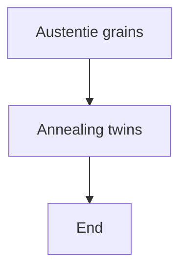
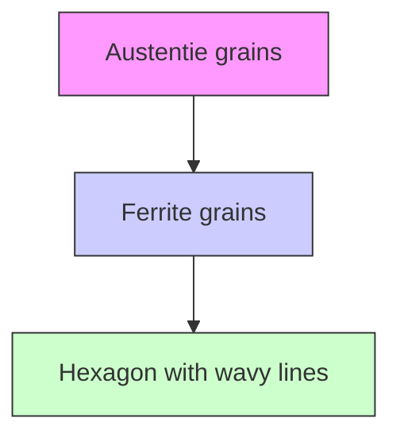
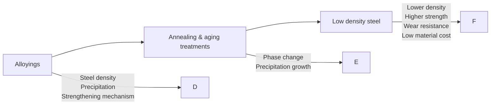

# Fe–Mn–C–Al Low-Density Steel for Structural Materials: A Review of Alloying, Heat Treatment, Microstructure, and Mechanical Properties

Shufen Hu, Zhibin Zheng, Weiping Yang,\* and Haokun Yang\*

Aluminum (Al) containing Fe–Mn–C–Al steel exhibits lightweight and outstanding mechanical properties, bringing considerable applications in vehicle, airplane, and mining industries as structural materials and components. The addition of C and Al elements into Fe–Mn iron matrix, following with subsequent heat treatment, plays an important role in microstructure controlling, such as single phase (austenite structure) or duplex phases (mixing with ferritic and austenite) matrix, as well as the short range order and κ-carbide precipitation. These microstructural evolutions considerably influence the mechanical properties of low-density steel, especially of the work hardening, tribological, cryogenic, and hydrogen embrittlement performance. The current article introduces the progress of alloying and heat treatment, as well as the subsequent heat treatment effects on microstructural evolution and mechanical properties of Al-containing low-density steel. The recent research progress on Al-containing low-density steel shall provide a valuable source of ideas for high-quality, low-density steel design, and engineering applications.

# 1. Introduction

With the development of energy efficiency requirement for fossil-fueled and electric vehicles, the lightweight design becomes more and more important for the green transportation purpose in this world. According to the literature study, 10% weight reduction brings 6–8% energy consumption savings, over

S. Hu, W. Yang

School of Engineering

Jiangxi Agricultural University

Nanchang 330045, China

E-mail: yangwp@jxau.edu.cn

Z. Zheng

Guangdong Provincial Key Laboratory of Metal Toughening Technology and Application

Institute of New Materials

Guangdong Academy of Sciences

Guangzhou 510650, China

H. Yang

Smart Manufacturing Division

Hong Kong Productivity Council

Hong Kong 999077, China

E-mail: hkyang@hkpc.org

The ORCID identification number(s) for the author(s) of this article can be found under https://doi.org/10.1002/srin.202200191.

DOI: 10.1002/srin.202200191

5% braking distance reduction, as well as better fatigue resistance performance.[1,2] To fulfill this lightweight design of vehicles, two methods were considered: 1) reducing the thickness of the metallic material, such as adopting high strength steel components, to have lightweight effect; and 2) replacing the steel component with aluminum (Al)- and magnesium (Mg)- made components to save the total component weight.

Although the above methods can play an important role in component weight reduction, the material cost and mechanical performance still need examination. For example, the ultrahigh strength steel, such as super duplex stainless steel,[3,4] with approximately or higher than 1 GPa tensile strength, has strong spring back characteristic for the stamping process.[5] The cost of Al- and Mg-based components is more expensive. In the meanwhile, the overall tensile strength and elastic young’s modulus of Al and Mg alloys are generally less than 570 MPa and 73 GPa,[6,7] as well as less than 440 MPa and 46 GPa,[8,9] respectively. These mechanical properties of Al and Mg alloys cannot satisfy the safety requirement of vehicle manufacturers.

To overcome the limits of the conventional metallic structural components for further high strength and lightweight applications, low-density steel was proposed and developed for the next-generation automobile materials.[10] In the early 1930s, Korter and Ton first proposed the low-density steel concept based on the Fe–Mn–C–Al quaternary alloying system with Ni and Cr additions.[11] To reduce the raw material cost, Ham and Carin proposed replacing the expensive Ni and Cr with cheaper Al and Mn without mechanical properties losses.[12] In recent decades, research and development of Fe–Mn–C–Al low-density steel keep going on and a number of patents and articles have been published in this world.[13]

The Fe–Mn–C–Al low-density steel plays a promising role in improving fuel efficiency and reducing CO emissions to achieve the carbon neutrality target.[14,15] This is because the low-density steel has outstanding mechanical properties, such as strong yield and tensile strength (up to 950 MPa and 1.1 GPa),[16,17] high plastic ductility not less than 40%,[18,19] as well as considerable work hardening capacity[20,21] and wear resistance.[22,23] Meanwhile, the low-density feature of Fe–Mn–C–Al steel exhibits between 6.2 and 7.0 g cm3 with Al addition from 2 to 12 wt%.[24,25]

Chen et al. reported[24] that the Fe–Mn–C–(Al) low-density steel with austenite matrix exhibited higher tensile strength and plastic elongation. Therefore, to stabilize the austenite matrix of Fe–Mn–C–(Al) low-density steel, higher contents of Mn and C alloying need to be adopted to tolerate Al addition up to >10 wt% with the purpose of suppressing ferritic phase formation. However, the high level of Mn, C, and Al addition makes the Fe–Mn–C–Al physical metallurgy complex, especially after subsequent annealing and aging treatment. Therefore, the present work will also give a brief introduction of the recent progress and findings of the alloying and heat treatment effects on phase composition and transformation.

Furthermore, mechanical properties of Fe–Mn–C–Al lowdensity steel have been drawing attention due to the excellent combination of strength and ductility at the same time. The previous study points out that the dynamic work hardening mechanisms, such as twinning-induced plastic (TWIP) and transformation-induced plasticity (TRIP), as well as static work hardening including short range order (SRO) and κ-carbide precipitation strengthening mechanisms play the critical role in mechanical improvement. The present work will systematically investigate the mechanical properties accompanying with work hardening mechanism and the application fields of Fe–Mn–C–Al low-density steel.

# 2. Alloying and Heat Treatment Design for Fe–Mn–C–Al Low-Density Steel

The alloying design has a significant impact on density, lattice constants, phase composition, and precipitation formation. Meanwhile, the subsequent annealing and aging treatments also determine the microstructural evolution. To well understand the alloying and heat treatment effects on Fe–Mn–C–Al low-density steel physical metallurgical, it is a need for the investigation as given below.

# 2.1. Alloying Effect on Density and Lattice Constants

# 2.1.1. Density

According to the previous empirical formula,[24,26] the density of Fe–Mn–C–Al austenite steel has such below relation with the alloying composition.

$$
\begin{array}{l} \rho_ {\mathrm{Fe-Mn-C-Al}} = 8. 1 5 - 0. 1 0 1 (\mathrm {wt\%Al}) - 0. 4 1 (\mathrm {wt\%C}) \\ - 0. 0 0 8 5 (\mathrm{wt} \% \mathrm{Mn}) \\ \end{array}
$$

which shows that C addition plays the most obvious density reduction effect, and then Al and Mn alloying follow. Although C addition has around 4 times of density reduction compared with that of Al element does, the solid solution of C into austenite suggests being below 1.2 wt% in Fe–Mn–C–Al low-density steel to avoid crack formation of secondary phase and/or carbides during plastic deformation stage.[25,27] The different results of Al and Mn alloying in density reduction shall have a close relation with the density of alloying elements, as the density of Al $( 2 . 7 \mathrm { g c m } ^ { - 3 } )$ is much lighter than that of Mn $( 7 . 2 \mathrm { g } \mathrm { c m } ^ { - 3 } ) . ^ { [ 2 8 ] }$ It thus appears that the most significant alloying effect on density reduction of Fe–Mn–C–Al low-density steel shall be contributed from Al addition.

# 2.1.2. Lattice Constants

As the Fe–Mn–C–Al low-density steel commonly has austenite matrix structure with few of secondary ferrite phase, most of the Mn, C, and Al atoms will solubilize into austenite structure and bring remarkable changes in the lattice constant of austenite structure. According to the empirical formula of the relation between lattice constant $( \alpha _ { \mathrm { F e - M n - C - A l } } )$ and alloying composition as given below

$$
\begin{array}{l} \alpha_ {\mathrm{Fe-Mn-C-Al}} = 0. 3 5 7 2 1 + 0. 0 0 0 2 7 7 1 (\mathrm{wt} \% \mathrm{Al}) \\ + 0. 0 0 4 4 0 8 9 (\mathrm{wt} \% \mathrm{C}) + 0. 0 0 0 1 1 6 6 (\mathrm{wt} \% \mathrm{Mn}) \tag {2} \\ \end{array}
$$

where the C atom plays a more positive role in austenite lattice constant expansion compared with that of Al and Mn atoms. This is explained by the fact that C atom is the interstitial solution, while the Al and Mn atoms are substitution solution.[29,30]

In the previous study, the yield strength improvement of Al,[31] $\mathrm { M n } , ^ { \left[ 3 2 \right] }$ and $\mathrm { C } ^ { [ 3 3 ] }$ as solutes in Fe–Mn–C–Al austenite structure has been systematically studied. The relation between the above three elemental solutes and the yield strength is calculated and shown below.

$$
\sigma_ {\gamma} = 1 0. 5 \mathrm{Al} _ {\mathrm{wt} \%} + 3 5 1. 5 \tag {3}
$$

$$
\sigma_ {\gamma} = 0. 5 8 \mathrm{Mn} _ {\mathrm{wt} \%} + 3 2 8. 0 \tag {4}
$$

$$
\sigma_ {\gamma} = 180.7 \mathrm{C} _ {\mathrm{wt} \%} + 250.7 \tag{5}
$$

The empirical formula supports that the yield strength improvement by C and Al solutes has a positive relation with the lattice constant changes, while the Mn solutes play little effect on that. The lattice constant changes result in solution strengthening mechanism, and then the mechanical properties, especially the yield strength, of Fe–Mn–C–Al low-density steel get promoted.

The additions of Al, Mn, and C solutes into Fe–Mn–C–Al lowdensity steel play both effects on the density and lattice constant changes, and the Al element is considered to have the most suitable effect on both density reduction and yield strength improvement. Therefore, development of Fe–Mn–C–Al low-density steel should focus on Al alloying effect.

# 2.2. Alloying Effect on Phase Composition and Diagram

# 2.2.1. Fe–Mn–C–Al Phase Composition

The phase composition of Fe–Mn–C–Al low-density steel can be fully austenite[34,35] or a mixture of ferrite and austenite[36,37] depending on the chemical composition. The chemical differentiation between fully austenite and austenite-based duplex (mixture of ferrite and austenite) low-density steel can be concluded as follows: 1) Fully austenite low-density steel contains high Mn content between 12 and 30 wt%, high Al content from 5 to 12 wt%, as well as C between 0.6 and 1.2 wt% to achieve stability in the austenite structure at room temperature; and 2) Austenitebased duplex low-density steel makes a mixture phase of austenite and ferrite due to the low stability of austenite in the duplex steel at a lower temperature.[38] The composition of Al, Mn, and C additions shall fall into 5–10 wt%, 5–30 wt%, and 0.4–0.7 wt%, respectively, in austenite based duplex low-density steel.

The optical microscope observation of the annealed fully austenite and austenite-based duplex steel is illustrated in . [38,39] The microstructure observation shows that abun-Figure 1dant annealing twins are observed in austenite low-density steel, and the grains are fully recovered. Meanwhile, elongated ferrite phase grains along the rolling direction are shown in the austenite-based duplex steel. To have a clear recognition of morphology of full austenite and austenite-based duplex low-density steel under optical microscope observation, the illustrations are presented in Figure 1c,d for reference, respectively.

# 2.2.2. Fe–Mn–C–Al Phase Diagram

The phase diagram of Fe–Mn–C–Al low-density steel has been introduced in the temperature range of 900–1200 °C.[40] Furthermore, the thermodynamic database, CALPHAD-type, and Thermo-Calc steel database were set up to make up the Fe–Mn–C–Al phase diagram.[41,42] The isothermal sections of Fe–(10, 20, 30 wt%)Mn–xC–yAl alloys at 900 °C, based on experiments and CALPHAD, are exhibited in , where the mean-Figure 2ing of the points and lines (in Figure 2) is learned from ref. [41]. As Chen et al.[24] pointed out that the 900 °C processing temperature is close to hot rolling temperature in the production line. Therefor, the isothermal section at 900 °C is critical for low density steel alloying design. To have a clear study of the effect of Mn, Al, and C elements on the phase diagram evolution, the austenite (γ), ferrite (α), and κ phases are marked out, and there are three main findings shown as follows: 1) with Mn content increasing, austenite (γ) region expands within high Al concentration area (>8 wt%), and the κ phase region expands within high C (>3 wt%) and high Al concentrations area (>10 wt%); 2) with C content increasing to be higher than 1.2 wt%, M3C and κ phases emerge in the low-density steel; and 3) with Al content increasing, ferrite (α) phase region expands with high Al concentration in the range of 20–30 wt% Mn containing Fe–Mn–C–Al steel.

The above experimental and calculation results are based on the isothermal section of low density at high temperature of $9 0 0 ^ { \circ } \mathrm { C } ,$ , but sometimes the austenite in the Fe–Mn–C–Al is not stable at low temperature and will decompose to an equilibrium state after aging treatments.[43,44] In the present study, Zhang et al.[45] systematically studied the hot rolling and tempering treatment effects on the microstructure evolution of Fe–12.4Mn–2.4Al–0.1C (wt%) low-density steel. The results pointed out that the volume fraction of retained austenite decreased from 79.1% to 33.4% with hot rolling temperature from 650 °C to 800 °C, tempering at 200 °C. Therefore, the effect of aging treatment on Fe–Mn–C–Al steel phase decomposition will be considered later. Moreover, the addition of other alloying elements, such as Nb,[46] Cr,[47] and Si,[48] into Fe–Mn–C–Al lowdensity steel has been reported to influence the phase composition. Nevertheless, the mechanism of alloying effect on the phase diagram needs further investigation.

# 2.3. Aging Treatments on Precipitation Formation

When the full austenite and austenite-based duplex Fe–Mn–C–Al steel is aging treated at 400–650 °C with time of 0.5–100 h,[49,50] the chance of modulation of C and Al appears within the austenite and then decomposition step by step as the following sequence[43,44]

$$
\gamma \rightarrow \gamma^ {\prime} + \gamma^ {\prime \prime} \rightarrow \gamma^ {\prime} + L 1 _ {2} (\mathrm{SRO}) \rightarrow \gamma + \kappa \tag {6}
$$

It shall be noted that this empirical prediction works in the chemical range within Mn: 12–30 wt%; Al: up to 12 wt%, and C: 0.6–2.0 wt%. With sufficient aging or slow cooling treatments,

text_image

(a)
Annealing twins
Austentie grains
50 µm

text_image

(b)
austenite matrix
RD
γ
ND
O
Elongated ferrite grains
20µm

flowchart

flowchart

Figure 1. The microstructure of a) fully austenite and b) austenite-based duplex low-density steels under optical microscope, and the illustrations of c) fully austenite and d) austenite-based duplex low-density steels, respectively. Adapted with permission.[38,39] Copyright 2014 and 2015, Elsevier and Springer Nature, respectively.

scatter

| Phase       | Al (wt%) | C (wt%) |
|-------------|----------|---------|
| γ           | ~3.5     | ~1.5    |
| γ+M₃C       | ~8.5     | ~0.5    |
| γ+κ         | ~9.0     | ~1.0    |
| γ+κ+α       | ~9.5     | ~0.5    |
| α+κ         | ~10.0    | ~0.0    |
| B2+κ        | ~12.0    | ~2.5    |

scatter

| Phase       | Al (wt%) | C (wt%) |
|-------------|----------|---------|
| γ+M₃C       | 4        | 2.5     |
| γ+M₃C       | 6        | 2.0     |
| γ+M₃C       | 8        | 1.5     |
| γ+M₃C       | 10       | 1.0     |
| γ+M₃C       | 12       | 0.5     |
| γ+M₃C       | 14       | 0.0     |
| γ+κ         | 6        | 2.5     |
| γ+κ         | 8        | 2.0     |
| γ+κ         | 10       | 1.5     |
| γ+κ         | 12       | 1.0     |
| γ+κ         | 14       | 0.5     |
| γ+κ+α       | 6        | 2.5     |
| γ+κ+α       | 8        | 2.0     |
| γ+κ+α       | 10       | 1.5     |
| γ+κ+α       | 12       | 1.0     |
| B2+κ        | 13       | 2.5     |
| B2+κ        | 14       | 2.0     |
| α+κ         | 12       | 1.5     |
| α+κ         | 14       | 1.0     |

scatter

| Al (wt%) | C (wt%) | Label        |
| -------- | ------- | ------------ |
| ~3       | ~2.8    | γ+M₃C        |
| ~4       | ~2.2    | γ+M₃C + κ    |
| ~6       | ~1.5    | γ+K          |
| ~10      | ~0.5    | γ+K + α      |
| ~12      | ~0.2    | α+K          |
| ~14      | ~0.1    | B2+ K        |

Austenite (y)
Ferrite (α)
k phase

Figure 2. Isothermal phase section of Fe–Mn–C–Al alloys with a) Mn ¼ 10%, b) Mn ¼ 20%, and c) Mn ¼ 30% at 900 °C. The light gray, gold, and blue colors represent austenite, ferrite, and κ phase in the phase diagram, respectively. Adapted with permission.[24] Copyright 2017, Elsevier.

the κ and Fe(Mn)3C precipitations form within austenite grains and along the grain boundary. It shall be pointed out that the Fe(Mn)3C carbide was commonly observed in low Al-containing steel (<7 wt%),[40,51] while the κ precipitation occurs in high Alcontaining steel (≥7 wt%). This is because the decomposition process stops at $L 1 _ { 2 } ( \mathrm { S R O } )$ production in low Al-containing steel, while the κ precipitation continues to react in high C and Al-containing steel.[52,53] The illustration of the whole decomposition of γ phase in Fe–Mn–C–Al low density is plotted in   for better understanding.[54] This plot clearly illus-Figure 3trates that the κ phase will decompose from the austenite matrix of Fe–28Mn–8.5Al–1C–1.2Si low-density steel, when the cooling rate is slower than $- 4 . 4 ^ { \circ } \mathrm { C h } ^ { - 1 }$ . With controlling of cooling rate (such as air assisted spraying cooling for fast cooling purpose or air/furnace cooling for slow cooling), the austenite structure decomposition and κ precipitation can be predicted and used for the improvement of low-density steel mechanical properties.

# 3. Mechanical Properties

According to previous studies, TWIP[19,55] as well as TRIP[56,57] strengthening mechanism, and the SRO[58,59] strengthening effects play the significant roles in controlling work hardening behavior. Higher work hardening rate means a better combination of tensile strength and uniform elongation, exhibiting success in Fe–Mn–C–Al low-density steel design for automotive and other lightweight industrial applications. Furthermore, with proper heat treatment and alloying design, the yield strength,

line

| Time (h) | Temperature (°C) - 1: γ | Temperature (°C) - 2: γ+κ' | Temperature (°C) - 3: γ+κ* | Temperature (°C) - 4: γ+κ*+α(B2/DO₃) | Temperature (°C) - 5: γ+κ+B2/DO₃ | Temperature (°C) - B2 | Temperature (°C) - DO₃ |
| -------- | ------------------------ | -------------------------- | -------------------------- | -------------------------------------- | ---------------------------------- | ---------------------- | ---------------------- |
| 0.01     | 830                      | 830                        | 830                        | 900                                    | 900                                | 900                    | 900                    |
| 0.1      | 700                      | 700                        | 700                        | 900                                    | 900                                | 900                    | 900                    |
| 1        | 600                      | 600                        | 600                        | 900                                    | 900                                | 900                    | 900                    |
| 10       | 550                      | 550                        | 550                        | 850                                    | 850                                | 850                    | 850                    |
| 100      | 500                      | 500                        | 500                        | 800                                    | 800                                | 800                    | 800                    |
| 1000     | 450                      | 450                        | 450                        | 750                                    | 750                                | 750                    | 750                    |

Figure 3. Diagram of g phase decomposition in Fe–28Mn–8.5Al–1C–1.2Si low-density steel during aging treatment. Adapted with permission.[54] Copyright 2006, Springer Nature.

tribology properties, and other mechanical properties for engineering applications will also be improved. Considerable studies of alloying effect of Mn, Al, and C elements on the mechanical properties of Fe–Mn–C–Al steel have been discussed,[24] as well as the $\mathrm { C r } ^ { [ 4 7 ] }$ and $\mathrm { N b } ^ { [ 6 0 ] }$ alloying on the mechanical properties have been reported. The present article will also introduce the underlying strengthening mechanism to have a fundamental understanding of the work hardening behavior of Fe–Mn–C–Al low-density steel.

# 3.1. Work Hardening Behaviors

TWIP effect plays a critical role in synchronizing the improvement of tensile strength and plasticity due to the dynamic Hall–Petch relation.[61] The austenite grains are divided by the in situ deformation twins during plastic deformation, and then the dislocations are pinned by twin boundaries as shown in a,c,[62] where the deformation twins act as “hard” phase to lead a “composite effect” that exhibits relatively hard twins embedded in the relatively soft austenite matrix of Fe–Mn–C–Al steel.[63] With plastic strain increasing, secondary twins emerge and further cut the austenite matrix into smaller regions as shown in Figure 4b,d.[64] Furthermore, Yang et al.[64] made a statistical comparison of the parameter (F/T) of ratio, the fraction (F) of twinned grains to the thickness (T ) of deformation twins, with work hardening behavior of Fe–Mn–C–(Al) TWIP steels as shown in Figure 4e,f. The higher value of F/T reflects the stronger work hardening rate in Fe–Mn–C– (Al) steel, indicating that the reduction of the mean free path of dislocations and accordingly dynamic Hall–Petch relation improved.

(a)

text_image

Deformation twins

text_image

(b)
Deformation twins

text_image

(c)
Twin-
Twin
TWOx
242
320
425
425
000
422
250
242
500 nm

natural_image

Microscopic image showing nanoscale structures with a 200 nm scale bar and an inset diffraction pattern (no text or symbols)

(e)

line

| True strain | FeMnC | FeMnCAI |
| ----------- | ----- | ------- |
| 0.0         | 0.5   | 0.1     |
| 0.1         | 2.2   | 0.3     |
| 0.2         | 4.8   | 0.4     |
| 0.3         | 5.0   | 0.5     |
| 0.4         | 5.8   | 0.6     |
| 0.5         | 6.0   | 0.7     |

(f)

line

| True strain | True stress (MPa) | Work-hardening rate (ε) |
| ----------- | ----------------- | ------------------------ |
| 0.0         | 0                 | 3000                     |
| 0.1         | 500               | 2000                     |
| 0.2         | 1000              | 1800                     |
| 0.3         | 1200              | 1900                     |
| 0.4         | 1400              | 2000                     |
| 0.5         | 1600              | 2100                     |
| 0.6         | 1800              | 2200                     |
| 0.7         | 1600              | 2300                     |

Figure 4. a,c) and b,d) The illustration of dislocation interaction with twins, and the morphology and deformation twins under transmission electron microscope (TEM) observation; e,f ) the comparison of F/T parameter and the work hardening rate. Adapted with permission.[62,64] Copyright 2013 and 2013, Elsevier.

However, the TWIP effect is commonly observed in low Al-containing Fe–Mn–C–Al steel, and the effect will be suppressed due to the higher stacking fault energy (SFE) with Al addition.[65,66] It was reported that 6 wt% Al addition obviously eliminates the TWIP effect in Fe–22Mn–0.6C–6Al (wt%) steel, while the density reduction is only 9%.[19] Therefore, the TWIP effect shall not play a decisive role as strengthening mechanism in high Al-containing Fe–Mn–C–Al low-density steel.

Furthermore, the addition of Nb, C, and Mn on the TWIP effect is systematically studied. Kwon et al.[60] and Reyes-Calderon et al.[67] pointed out that the addition of Nb added in Fe–Mn–C–Al system low-density steel can improve the yield stress by carbide precipitation, and promote the compression peak stress due to the grain refinement reason. However, with addition of Nb up to 0.05 wt%, the twinning volume fraction of the plastic deformed Fe–Mn–C–Al low-density steel decreased. Finally, the work hardening rate of this steel weakened as reporting in ref. [60].

Li et al.[68] argue that the addition of C into Fe–Mn–C–Al steel rapidly improves the twinned area fraction and dislocation density with plastic strain level increasing. As a result, dislocation storage by the twining boundaries makes considerable contributions to the flow stress and ultimate strength of the steel. Nevertheless, addition of C into Fe–Mn–C–Al steel will bring the dynamic strain aging (DSA) effect, resulting in unpredictable shear fracture.[69]

The Mn addition into Fe–Mn–C–Al low-density steel brings negligible effect on the mechanical properties changes at room temperature, while the Charpy impact energy of 22 wt% Mn containing steel (149 J) has more than three times of the 18 wt% Mn steel has (44 J), as well as the tensile strength and plastic elongation of 22 wt% Mn containing steel has obvious improvement at cryogenic temperature as illustrated in ref. [70]. The Mn addition is considered as austenite stabilizer element to suppress the crack propagation at low temperature, while the Mn element is more expensive than that of Fe and C elements, so the alloying of Mn needs to be further studied to have the optimized effect for real industrial application. To have a clear comparison and study of the above alloying effect on the mechanical and other properties of Fe–Mn–C–Al low-density steel, is established for reference.

TRIP effect exhibits the phenomenon of retained austenite transformation into martensite during the plastic deformation process, leading to ductility increment and delaying necking and cracking.[71] Generally, the TRIP effect appears in austenite-based duplex Fe–Mn–C–Al steel, where the C concentration is lower than 0.5 wt%, and the Al concentration is between 3 and 6 wt%.[72,73] During the plastic deformation, the martensite volume fraction increases from 0.01 (at strain of 0.1) to 0.09 (at strain of 0.3), indicating that the phase transformation process is a dynamic process similar to the TWIP effect.[74] Dan et al.[71] extract the strengthening contribution of the single phase of ferrite, bainite, retained austenite, and martensite based on the ABAQUS/UMAT framework. The result shows that the hardening rate of martensite is stronger than that of other phases. Besides, the necking strain of martensite is 0.5, which is higher than the necking strains of bainite (0.127), ferrite (0.163), and retained austenite (0.348), as shown in a,b. Figure 5According to the Considere criterion as shown in Figure 5c, the necking point of the tested metallic materials appears at the intersection of the work hardening rate (∂σ/∂ϵ) and true stress.[75] Thus, a higher work hardening rate indicates that the investigated material shall have higher uniform elongation and tensile strength. Therefore, the strong work hardening capacity and high necking strain are achieved in TRIP Fe–Mn–C–Al steel with the participation of martensite phase.

It shall be noted that the stability of retained austenite grain in TRIP steel, with plastic strain, has close relation with the grain size. When the grain size of retained austenite is below 1.6 μm, the stability of austenite structure is high, and the TRIP effect is suppressed. With grain size further increasing, the instability appears in austenite grain with plastic strain. Escobar et al.[76] investigate the evolution of the TRIP effect with plastic deformation, and the austenite decomposition course follows the sequence of γ ε α0 . The α0 martensite phase makes a substantial contribution to the work hardening rate, especially under severe cold rolling process of 45% reduction. By this token, with an optimized cold rolling process, the low-density steel with TRIP effect can reach 950 MPa tensile strength for automotive industrial application.

Sohn et al.[72] systematically study the effect of TWIP and TRIP mechanisms in the austenite-based duplex low density, and argue that both mechanisms simultaneously work at high plastic strain, contributing to considerable work hardening rate and synchronous hoisting of strength and ductility.

SRO effect is observed in high Al-containing Fe–Mn–C–Al steel with > 6 wt%. Although Al addition increases the SFE of Fe–Mn–C–Al matrix, the separation of dislocation becomes difficult, and the mobile dislocations prefer being in wavy gliding mode. According to the previous study, the dislocation slip mode (W ) will be strongly influenced by the Al atomic solute content, i.e., the SRO effect as[77]

$$
W _ {\mathrm{R}} = \frac {\gamma}{\mu} - 2 (1 + \nu) b _ {\mathrm{e}} \Omega c / \pi (1 - \nu) \tag {7}
$$

where γ is the SFE of the matrix material, ν is the Poisson ratio, Ω is the atomic size misfit, c is the Al atomic solute content, and b is the edge component of Burger’s vector. Accompanying with the experimental results,[19] the dislocation planar slipping mechanism gets promoted in Fe–Mn–C–Al low-density steel with Al content increasing. Meanwhile, the parameter W of Fe–22Mn–(0, 3, and 6) Al (wt%) low-density steel decreases with Al content increasing, as shown in a. Based on the above Figure 6experimental and calculation results, it indicates that the Al addition into Fe–Mn–C–Al shall bring stronger dislocation planar slipping mechanism.[19] Once the SRO structure is destroyed, propagation of succeeding dislocations on the same glide plane is facilitated and then the mcirobands form with plastic strain.[78,79] With gliding dislocation accumulating along the microbands, the long-range stress originating from these store dislocations makes a contribution to work hardening capacity of the low-density Fe–Mn–C–Al steel. However, Gutierez-Urrutia and Raabe[80] argued that the outstanding work hardening behavior comes from the dislocation substructure, including Taylor lattices, dislocation cells, and blocks. Thus, the underlying evidence of SRO-induced work hardening mechanism requires further study.

Table 1. The alloying effect on the mechanical and other properties of Fe–Mn–C–Al steel.

<table><tr><td>Alloying element</td><td>Advantages</td><td>Disadvantages</td></tr><tr><td>Al</td><td>Density reduction</td><td>TWIP effect weakens[19,64]</td></tr><tr><td>Nb</td><td>Yield stress and hot plastic flow stress improvement</td><td>TWIP effect weakens[60]</td></tr><tr><td>C</td><td>Stronger twinning behavior</td><td>Unpredictable shear fracture[68,69]</td></tr><tr><td>Mn</td><td>Better mechanical performance at cryogenic temperature</td><td>Little improvement of mechanical properties at room temperature[70]</td></tr></table>

line

| Effective plastic strain | Ferrite stress (MPa) | Ferrite hardening rate (MPa) | Bainite stress (MPa) | Bainite hardening rate (MPa) |
|---|---|---|---|---|
| 0.127 | 500 | 450 | 850 | 800 |
| 0.163 | 550 | 400 | 900 | 750 |
| 0.8 | 700 | 150 | 1100 | 1000 |

line

| True strain | True stress |
| ----------- | ----------- |
| Low         | Low         |
| Medium      | Medium      |
| High        | High        |

Figure 5. a,b) The work hardening rate and tensile flow stress of ferrite, bainite, retained austenite, and martensite phase with plastic strain; c) the illustration of Considere criterion to evaluate metallic material mechanical properties. Adapted with permission.[71] Copyright 2008, Elsevier.

The microstructure of the SRO-induced coplanar slip bands under TEM observation and the SRO effect on work hardening rate evolution are displayed in Figure 6b,c, respectively.[81] The observation of the narrow and dense coplanar slip bands proves that the phenomena of the grain subdivision and dynamic Hall–Petch hardening effect work. It shall be noted that the SRO effect is hardly observed by experiment. Thus, the current studies of SRO-induced work hardening behavior are supported by the observation of dislocation patterns and microbands.

However, with overaging treatment (625 °C) for 192 h, the κ-carbide particles are observed and sheared by the planar dislocation band.[82] Subsequently, the large size and high-volume fraction of the κ-carbide particles will introduce limited chances of particles being sheared by planar dislocations, resulting in lower work hardening capacity compared with that of short time aging treated sample (aging time less than 10 h). It therefore appears that the SRO strengthening mechanism is strongly influenced by the κ phase precipitation, thus the longtime aging treatment shall be avoided.

# 3.2. Yield Strength Improvement

Yield strength improvement has strong relation with grain size, solid solution, texture, precipitations, etc. As discussed previously, the precipitation inside the Fe–Mn–C–Al low-density steel has nonnegligible effect on the mechanical properties’ optimization. In the meanwhile, with addition of microalloying elements Ti, V, and Nb, the yield strength of Fe–Mn–C–Al alloy can also be promoted by the precipitation of carbides.[60,83,84] Yang et al.[85] systematically studied the parameters of volume fraction ( f ) and size (D) of the precipitation on the yield strength improvement $( \Delta \sigma _ { \mathrm { p } } )$ based on the Ashby–Orowan relationship as follows

Figure 6. a) The evolution of ${ \sf W } _ { \sf R }$ with Al content to predict dislocation slipping transition from (a1) wavy to (a2) planar mode, b) microstructure observation of microbands under ECCI, and c) tensile and work hardening curves of Fe–Mn–C–Al steel with SRO effect. Adapted with permission.[19,81] Copyright 2018 and 2016, Elsevier.

$$
\Delta \sigma_ {\mathrm{p}} = 0. 8 4 7 \cdot M \cdot \frac {1 . 2}{\pi} \cdot G \cdot b \sqrt {\frac {3}{2 \pi}} \cdot \frac {f ^ {0 . 5}}{D} \ln \frac {D}{2 b} \tag {8}
$$

where the M is Taylor factor (3.06 for face-centered cubic, fcc, metals), and G and b are the shear modulus. The calculated relation between the precipitation volume fraction and size with the yield strength improvement is plotted in . The higher Figure 7fraction volume and smaller size of the precipitation, including Ti, V, and Nb containing carbides, have obvious improvement on the yield strength, supporting that carbide precipitations could act as an effective obstacle to impede dislocations sliding during the plastic deformation actives.[85] However, it was reported that the κ carbides were sheared by Orowan bowing of dislocations,[86] indicating that the κ carbides cannot offer continuous strengthening effect after yielding.

# 3.3. Tribological Performance

As discussed above, Fe–Mn–C–Al low-density steel has a superior strengthening mechanism to achieve promising strength and ductility synchronous improvement. Following this characteristic, the wear behavior of the Fe–Mn–C–Al steel is outstanding due to the high toughness and self-hardening properties.[87,88] Besides, the energy consumption of driving wear resistance linings, installed in large pulverize, accounts for 15% of the total energy cost.[89] Therefore, developed Fe–Mn–C–Al low-density steel shall be wear-resistant components to achieve high service quality, long-term service, as well as low energy consumption purpose.

scatter

| Material     | Carbide size [nm] | Δσp [MPa] |
| ------------ | ----------------- | --------- |
| TiC          | 20                | 150       |
| V(C, N)      | 30                | 200       |
| V4C3         | 80                | 400       |
| V(C, N)      | 80                | 400       |
| V(C, N)      | 100               | 300       |
| V(C, N)      | 100               | 250       |
| NbC          | 100               | 100       |

Figure 7. The calculated relation between the yield strength improvement with the volume fraction and size of carbide size in Fe–Mn–C–Al steel. Adapted with permission.[85] Copyright 2021, MDPI.

In the previous study, Sohrabizadeh et $\mathrm { a l . } ^ { [ 2 2 ] }$ established a function of aging time and wear rate in Fe–22.33Mn–1.35C–9.87Al (wt%), and the data are plotted in a. This function pointed out the incoherent κ particles Figure 8within the austenite matrix, after higher aging temperature and longer time, inhibited crack nucleation during the wear test. The detailed scanning electron microscope (SEM) observation of the worn surface and debris of the $6 0 0 ^ { \circ } \mathrm { C }$ aged steel is shown in Figure 8b,c. The observation result supports that $6 0 0 ^ { \circ } \mathrm { C }$ aged steel has good performance of wear resistance. However, Peng et al.[90] indicated that the wear rate of Fe–28Mn–1C–8.5Al (wt%) low-density steel deteriorated after overaging treatment with longer than 2 h at temperature of $5 5 0 ~ ^ { \circ } \mathrm { C }$ due to the coarsen κ particles around the grain boundaries, as shown in Figure 8d,e. With the detailed observation of the lamination region in the $5 5 0 ~ ^ { \circ } \mathrm { C }$ annealed for 4 h sample, the propagation of microcracks is detected along the broken coarse κ particles, indicating that the overaged κ particles are the initiation of cracks, delamination, and other irreparable damages. In view of these results, the aging treatment, including time and temperature, plays an important role in wear resistance of Fe–Mn–C–Al low-density steel. The formulation of suitable aging parameters, including time and temperature, requires further study.

line

| Aging time (h) | As-homogenized (mm³/Nm) | 500°C (mm³/Nm) | 550°C (mm³/Nm) | 600°C (mm³/Nm) |
|---|---|---|---|---|
| 0 | 0.35 | | | |
| 1 | | 0.29 | 0.24 | 0.18 |
| 2 | | 0.24 | 0.19 | 0.14 |
| 3 | | 0.21 | 0.17 | 0.11 |
y=-0.0426x+0.332
R²=0.97
y=-0.0399x+0.2804
R²=0.93
y=-0.0374x+0.2146
R²=0.99

text_image

(b)
已检测表面电
此色10℃型可检出的水法滤膜式
Craters
10 µm
100 µm

natural_image

Microscopic view of granular material with scale bars at 100 μm and 10 μm (no text or symbols)

text_image

(d)
1050°C+350°C(3h)
Delamination
50µm

text_image

(e)
(Fe, Mn)3AlC
broken coarse κ
microcracking
2.5μm
1050°C+350°C(4h)

Figure 8. a) Function of aging time and wear rate of Fe–22.33Mn–1.35C–9.87Al steel and $^ { \mathsf { b } , \mathsf { c } ) }$ worn surface and wear debris of the aged steel at temperature of 600 °C for 3 h. d,e) The worn surface of Fe–28Mn–1C–8.5Al with 1050 °C quenching and subsequent 550 °C for 4 h aged steel. Adapted with permission.[22,90] Copyright 2021 and 2016, Springer Nature.

To further improve the wear-resistant properties of Fe–Mn–C–Al low-density steel, the metal injection molding (MIM) fabrication process is proposed for low-density steel production. Garcia-Aguirre et al.[91] combine the Fe–22Mn–0.4C–1.5Al–1.5Si (wt%) steel powder with highdensity polyethylene (HDPE) and paraffin wax (PW) for mixing process and immersed in the solvent. The sintering process of annealing temperature between 1200 °C and 1360 °C is employed to have fully austenitic structure with equally distributed manganese oxide particles as shown in . Following this Figure 9fabrication method, the ultrahard SiC, alumina, and nitride particles can be mixed with the steel powders for composite materials preparation. As a result, the wear-resistant properties of Fe–Mn–C–Al steel shall be further improved.

# 3.4. Other Mechanical Performance for Engineering Application

# 3.4.1. Mechanical Properties under Cryogenic Temperature

The Fe–Mn–C–Al low-density steel has fcc matrix microstructure, accompanying with high work hardening behavior to resist damages at ambient temperature. With the development of storage and transportation of liquid natural gas and hydrogen is globally demanded, the high cryogenic toughness requirement of the fcc metallic materials grows. Fcc metals are widely used as high toughness structural materials under cryogenic-temperature applications. Therefore, the cryogenic toughness properties of Fe–Mn–C–Al low-density steel need to be studied to fulfill the cryogenic application.

Lee et al.[70] investigate the effect of Mn addition (17, 19 and 22 wt%), into Fe–xMn–0.45C–2Al (wt%) low-density steel, on the tensile and Charpy impact properties at room and cryogenic temperature. The testing results show that the mechanical properties, including yield stress, tensile stress, uniform elongation, and Charpy impact energy, do not vary much at room temperature. Nevertheless, the ductility drops to be 75.7%, 53.4% and 9.7%, and the impact energy drops to be 80.5%, 49.8% and 41.1% for 17, 19 and 22 wt% Mn low-density steel at cryogenic temperature compared with that at room temperature, respectively. Furthermore, Chen et al.[92] pointed out that the (3, 5, and 8 wt%) Al addition into the Fe–18Mn–0.6C–xAl (wt%) low-density steel has noteworthy effect on the impact energy at cryogenic temperature. The result demonstrates that the impact energy increase from 122 J to 138 J with Al content increasing from 3 wt% to 5 wt%, while the 8 wt% Al-containing low-density steel only has 18 J impact energy at cryogenic temperature.

The above research work both found that the secondary phase transformation plays the critical role in deteriorating impact energy at cryogenic temperature. With Mn alloying content decreasing to 17 wt% in Fe–xMn–0.45C–2Al (wt%) steel,[70] the martensite phase was detected during plastic deformation. In the meanwhile, the δ-ferrite formed in 8 wt% Al-containing Fe–18Mn–0.6C–xAl steel.[92] The microcracks easily nucleate and propagate along the phase boundary during the tensile and/or impact damages, leading to unacceptable degradation of mechanical properties finally.

# 3.4.2. Hydrogen Embrittlement

It has been reported that the high strength steel suffers hydrogen embrittlement (HE), as the HE sensitivity increases with materials strength increasing.[93] The HE phenomenon will bring catastrophic fracture of the structural material and component, which need to be retarded.[94] Fe–Mn–C–Al low-density steel is one of the high strength steel products for industrial application; the HE effect on the mechanical properties needs to be studied. Han et al.[95] and Park et al.[96] argued that the Al addition into Fe–Mn–C–Al steel mitigated HE phenomenon as the Al alloying enhanced the hydrogen solubility and reduced diffusivity of hydrogen.

According to the above discussion, the alloying of Mn and Al elements plays a significant role in determining mechanical properties, especially of cryogenic and HEs. With proper alloying design of Fe–Mn–C–Al low-density steel, the industrial application of Fe–Mn–C–Al low-density steel shall be carried forward.

# 4. Roadmap and Conclusions

As discussed, the Fe–Mn–C–Al steel has outstanding work hardening behavior, as well as obvious density reduction. With the strict requirement of the carbon neutrality target, the low-density steel will play an important role in functions of fuel savings, working efficiency improvement as well as safety protection in automobiles, airplanes, and mining industries as engineering materials and components. According to previous studies, the low-density steel design relies on alloying and annealing and aging treatments process. With desirable control of these two factors, the characteristics of lower density, higher strength, better wear resistance, and low material cost can be achieved for low-density steel development, as shown in .

text_image

(a)
Manganese oxide
austenitic matrix
200 µm

text_image

(b)
Manganese oxide
austenitic matrix
200 µm

Figure 9. Microstructure of Fe–22Mn–0.4C–1.5Al–1.5Si (wt%) steel processed by MIM, and sintered at 1360 °C for a) 1 h and b) 3 h. Adapted with permission.[91] Copyright 2019, Taylor & Francis Group.

flowchart

Figure 10. The illustration of the low-density steel road map.

Figure 10Currently, the most challenges of Fe–Mn–C–Al low-density steel for real application are: 1) low heat dissipation rate of low-density steel ingot with high Mn content; and 2) Al-oxides pollution introduced during the casting and sheet rolling process. To realize the mass production of Fe–Mn–C–Al low-density steel, the above challenges must be solved.

# 4.1. Mn Alloying

With addition of Mn elements into steel will bring interfacial reaction problems, where the content of MnO significantly increases and then reduces the heat transfer from inside of ingot to outside, resulting in unstable heat transfer and lubrication between mold and solidifying shell.[97] Although the $\mathrm { C a O - S i O } _ { 2 } , \mathrm { C a O - A l } _ { 2 } \mathrm { O } _ { 3 }$ mold fluxes, and B2O3–Li2O–BaO fluxing agent were developed to optimize the casting performance of high Mn steel, the problem of chemical inhomogeneity in steel liquid pool still exists. Besides, with Mn addition increasing, the shrinkage volume fraction promotes.[98] This behavior will bring unavoidable voids and cracks left in Fe–Mn–C–Al steel ingots and rolled sheets, resulting in poor fatigue and tribology resistance.

# 4.2. Al Alloying

The Al addition into steel has strong chemical reaction with atmosphere, casting powders, and covering materials, resulting in impurity problem of the Fe–Mn–C–Al ingots. Besides, the Al-oxides, such as alumina in the liquid state, shall block the nozzles during the casting process, and also play an important role in bringing surface defects, decarburization, and crack initiation.[99,100]

It thus appears that the future work will focus on the metallurgy improvement to solve the Mn- and Al-enriched problems, such as impurity, inclusions, shrinkage, and other challenges. Massive and stable production of Fe–Mn–C–Al low-density steel is the critical way to promote the wide application of this steel in the vehicle and other industrial areas.

Meanwhile, other crucial challenges need to be addressed, such as 1) aging treatment optimization to find the balance of strength and ductility with κ phase precipitation; 2) lowering raw material cost, especially reducing usage of Al and Mn as additions, while maintaining good mechanical properties; and 3) developing hot stamping technology to achieve high strength Fe–Mn–C–Al steel forming accuracy and quality.
