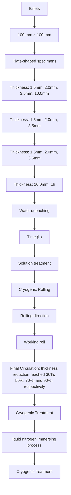

# Effects of Cryogenic Rolling on the Microstructure Evolution and Mechanical Properties of Low-Density Fe-28Mn-8Al-1C Steel

Yi Xiong, $^{*}$ Ze-wei Luan, Xiao-qin Zha, $^{*}$ Yong Li, Xiu-ju Du, Feng-zhang Ren, Shu-bo Wang, and Xiao-jun Liu

This study undertakes a systematic investigation into the influence of cryogenic rolling (CR) deformation on the microstructure evolution and mechanical properties of low-density Fe-28Mn-8Al-1C steel. The results reveal that the microstructure undergoes a series of transformations, from equiaxed austenite grains to elongated grains with strain bands, twinning, dislocation entanglements, and dislocation cells. The texture evolves from brass to copper with increasing deformation. Besides, the mechanical properties exhibit a direct correlation with the extent of deformation, as evidenced by the notable increase in ultimate tensile strength, yield strength, and microhardness from 882 to 1861, 505 to 1791 MPa, and 284 to 578 HV, respectively. However, elongation decreases from 64% to 6.6%, indicative of the strength-ductility trade-off. The aforementioned findings provide insight into the potential for manipulating the microstructure evolution and mechanical properties of low-density steels utilizing CR.

# 1. Introduction

The development of low-density Fe–Mn–Al–C steel stemmed from a desire to offer a cost-effective alternative to the costlier Fe–Cr–Ni–C stainless steel. $^{[1]}$ It has garnered significant interest in the fields of transportation industries for its unique combined properties of low density and remarkable strength and ductility. $^{[2,3]}$ Among the various types of low-density steels (i.e., ferritic matrix, austenitic matrix, and dual-phase steels consisting of both ferrite and austenite $^{[4]}$ ), high-Mn–Al–C austenitic low-density steel stands out for its superior weight loss and unique strain hardening ability, making it highly promising for future applications. $^{[5,6]}$ However, the face-centered cubic (FCC) structure of the austenitic phase possesses extensive slip systems, $^{[7]}$ which make its yield strength low, especially since the weight-to-strength ratio is not as competitive as that of other lighter materials such as titanium alloys and aluminum alloys. This limitation hinders the practical application of these low-density Fe–Mn–Al–C steels as advanced structural materials.

Plastic deformation, which generates fine grains and dislocations, represents an effective approach for enhancing the mechanical properties of metallic material, particularly for metals or alloys that are challenging to strengthen via heat treatment. $^{[8,9]}$ Presently, hot rolling and room temperature cold rolling are the principal processing methods for austenitic low-density steel. $^{[10,11]}$ Since hot rolling has a limited effect on strengthening, cold rolling is widely employed to elevate the mechanical performance of austenitic low-density steel or as a pretreatment for aging treatment. Numerous studies have been conducted on the performance of austenitic low-density steel $^{[11,12]}$ under room temperature rolling. For instance,

Y. Xiong, Z. Luan, F. Ren

School of Materials Science and Engineering

Henan University of Science and Technology

Luoyang, Henan 471023, China

E-mail: xiongy@haust.edu.cn

Y. Xiong, F. Ren

Provincial and Ministerial Co-construction of Collaborative Innovation

Center for Non-ferrous Metal New Materials and Advanced

Processing Technology

Luoyang, Henan 471023, China

X. Zha

National Key Laboratory of Marine Corrosion and Protection

Luoyang Ship Material Research Institute

Luoyang 471023, China

E-mail: xiaoqinzha@sina.com

The ORCID identification number(s) for the author(s) of this article can be found under https://doi.org/10.1002/srin.202400447.

DOI: 10.1002/srin.202400447

Y. Li

Central Iron and Steel Research Institute Company Limited
Beijing 100081, China

X. Du

Hebei Normal University

Shijiazhuang, Hebei 050024, China

S. Wang

Nano and Molecular Systems Research Unit

University of Oulu

Oulu FIN-90014, Finland

X. Liu

Shenyang Aircraft Industry (Group) Corporation Ltd

Shenyang 110000, China

Mishra et al. $^{[13]}$ claimed that a low-density Fe-28Mn-9Al-0.9C steel with 1.5 GPa ultimate tensile strength (UTS) and 10% elongation could be fabricated by 50% rolling deformation at room temperature. Ren et al. $^{[14]}$ investigated the influence of deformation degree on the microstructure evolution and mechanical properties of low-density Fe-30Mn-10Al-1.3C steel using cold rolling. Their findings revealed a substantial increase in yield strength, from 570 MPa to 2 GPa, following a 90% deformation. Although cold rolling at room temperature offers benefits like simplicity and low cost, the stacking fault energy (SFE) of the steel is greatly increased due to the significant addition of Al and C. $^{[15,16]}$ Consequently, cross-slip and climb of dislocations are activated at higher deformation levels, leading to dynamic recovery, which weakens the strengthening effects of cold rolling on metallic materials. $^{[17]}$

Cryogenic rolling (CR) has evolved from cold rolling. In comparison to cold rolling, CR reduces material's deformation resistance during plastic deformation, thus mitigating processing challenges. $^{[18]}$ Furthermore, the cryogenic environment lessens dynamic recovery, inducing superior strain-hardening effects. $^{[19,20]}$ Several researchers have focused their efforts on leveraging cryogenics to optimize the comprehensive performance of materials. $^{[21-23]}$ Meanwhile, CR has been utilized by researchers to enhance the strength of metals and alloys such as Cu, $^{[22]}$ Al, $^{[24]}$ Ni, $^{[25]}$ and Ti. $^{[26]}$ For example, Wang et al. $^{[27]}$ prepared ultrafine-grained Cu-35Zn alloy with a high density of dislocations and twins by CR, which exhibited improved mechanical properties compared to room temperature rolling samples. Zherebtsov et al. $^{[28]}$ identified that CR activated more deformation twins in Ti which resulted in smaller grains and superior mechanical properties. Similarly, Shi et al. $^{[29]}$ also validated the beneficial impact of CR on the mechanical characteristics of the Al–Mg alloy. Moreover, our previous study demonstrated the efficacy of CR in refining grain size and enhancing the mechanical properties of austenitic stainless steel. $^{[30]}$ However, the effect of CR on the microstructure and mechanical properties of low-density Fe–Mn–Al–C steel, a potential material for the third-generation lightweight automotive steel, has not been reported until now. Herein, this study aims to comprehensively examine the changes in the microstructure and mechanical properties of a low-density Fe-28Mn-8Al-1C steel induced by CR. The findings aim to provide experimental evidence and technical support for austenitic low-density steel with excellent overall mechanical properties.

# 2. Experimental Section

The low-density experimental Fe-28Mn-8Al-1C (in wt%) steel (Referred to as: test steel) was produced by melting the ingredients and casting using a vacuum furnace. The detailed chemical composition is shown in Table 1. The ingot is first heated to a temperature of $1200\;^{\circ}C$ and held for 2 h, after which it was hot forged into billets of $100\times100\;mm$ cross-section. The density of the test steel was determined to be $6.82\;g\;cm^{-3}$ .

Plate-shaped specimens with thicknesses of 1.5, 2, 3.5, and 10 mm were excised from the center of the billet in alignment with the forging direction. Prior to CR, all specimens underwent solution treatment at 1000 °C for 1 h and were then water-quenched to room temperature. The specimens were subjected to CR using an LG-300 two-high rolling mill to achieve different thickness reductions. Specifically, the test steels were immersed in liquid nitrogen for 3–5 min. After cooling down, individual specimen was rapidly removed for a single pass rolling with a thickness reduction of about 2%. Afterward, the rolled specimen was promptly re-immersed in liquid nitrogen. These steps were repeated until the cumulative thickness reduction reached 30%, 50%, 70%, and 90% (as shown in Figure 1).

Table 1. Chemical composition of test steel (wt%).

<table><tr><td>C</td><td>Mn</td><td>Al</td><td>S</td><td>P</td><td>Fe</td></tr><tr><td>0.97</td><td>27.91</td><td>8.04</td><td>0.004</td><td>0.006</td><td>Bal.</td></tr></table>

The cross-sectional metallographic structure was observed using an OLYMPUS PMG3 optical microscope (OM) and a JSM-7800F field-emission scanning electron microscope (SEM). Corresponding samples were produced by progressively grinding and polishing along the rolling direction (RD), followed by etching with a hydrochloric acid (100 mL), alcohol (100 mL), and copper chloride (5 g) etchant. Cross-sections were characterized using a JSM7200F SEM equipped with an electron backscatter diffraction (EBSD) system. Samples were prepared by electrochemical polishing in an electrolyte containing perchlorate acid (5%) and acetic acid (95%) at 50 V for 30 s. Transmission electron microscopy (TEM) samples for a JEM-2100 TEM were first mechanically ground to 60 μm slices and then punched into Φ3 mm disks. Thinning was achieved using a Gatan 691 ion milling machine. X-ray diffraction (XRD) analysis was performed using a D8 ADVANCE X-ray diffractometer with Cu-Kα radiation (wavelength λ = 0.15406 nm).

Microhardness was determined using a microhardness tester with a loading of 500 g and a dwelling time of 15 s. The shown HV values were an average of at-least 5 measurements. Dog-bone-shaped tensile specimens with the standard distance segment of $20 \times 5 \times 1$ mm were machined along the RD. Tensile tests were conducted in a temperature-controlled environment at a strain rate of 0.2 mm min $^{-1}$ using a universal tensile testing machine. After tensile failure, the fractured morphologies were examined using a JSM-7800F SEM.

# 3. Results

# 3.1. Microstructure Evolution

Microstructural characteristics of the steel being studied are shown in Figure 2 and 3. In the undeformed state, the steel displays an equiaxed grain morphology with straight grain boundaries (Figure 2a) and an average grain size of $\approx40.3\ \mu m$ . Additionally, a few annealing twins and dislocations are also seen dispersing within the grains.

Upon reaching a 30% CR reduction, the equiaxed grains elongate along RD, concomitant with the emergence of numerous slip bands within the grain interiors (Figure 2b). It is noteworthy that in certain grains, the slip bands intersect, indicating nonuniform plastic deformation at this level. Meanwhile, a substantial rise in dislocation density ensues, giving rise to the Taylor lattice structure consequent to the intersection of slip bands (Figure 3b). As the CR reduction incrementally advances, the deformation of grains along the RD intensifies, culminating in an increased density of slip bands within the grains and the manifestation of flattened or banded grains (Figure 2c). Detailly, the distinct characteristics of dislocation plane slip vanish, and dislocation entanglement and walls emerge due to interactions between

flowchart

Figure 1. Schematic diagram of the heat treatment process, cryogenic treatment, and CR.

natural_image

Microscopic view of a material's grain structure with visible cracks and texture (scale bar: 20μm)

text_image

(b)
Intersection of slip hands
Slip hand
RD
20µm

text_image

(c)
Elongated grain
Slip band
RD
20µm

text_image

(d)
Elongated grain
Slip band
RD
20µm

text_image

(e)
Fiber textures
RD
20µm

text_image

(f)
Intersection of slip bands
RD
1µm

Figure 2. OM images of test steel: a) undeformed, b) CR30%, c) CR50%, d) CR70%, and e,f) CR90%.

dislocations at 50% CR reduction in Figure 3c. Moreover, a significant amount of deformation twins is observed. As the deformation level increases to 70%, larger dislocation cells form as dislocation density increases, while the density of twins decreases (Figure 3d).

After being reduced in thickness by 90%, the grains elongate further along the RD, creating a fibrous appearance as shown in Figure 2e. Subsequent examination reveals two predominant microstructural features: the mutual intersection of slip bands with different orientations and the presence of wave-like micro-shear bands characterized with a high internal dislocation density. This implies that, following CR, the microstructure retains its nonuniformity, with more severe deformation occurring in grains favorably oriented for plastic deformation. Nevertheless, the grains are remarkably refined to nanoscale with random orientation, evident from the continuous rings in the SAED pattern (Figure 3e). Utilizing the Nano-Measurer software, grain size analysis from multiple dark-field (DF) images yielded an average grain size of 58.8 nm. Furthermore, a decrease in the density of twin is observed.

text_image

(a)
Dislocation lines
Grain boundary
200nm

text_image

(b)
Taylor lattice
500nm

text_image

(c)
Dislocation
wall
Deformation
twin
500nm

text_image

(d)
Dislocation
wall
Dislocation
cell
500nm

natural_image

Microscopic image of a material surface with a 500nm scale bar, showing granular texture and an inset diffraction pattern (no text or symbols)

text_image

(f)
Nanocrystalline
Average: 50.8 nm
500nm

text_image

(g)
Deformation
twin
500nm

Figure 3. TEM images of test steel: a) undeformed; b) CR 30%; c) CR 50%; d) CR 70%; e) CR 90%; f) corresponding DF-TEM of e); and g) bright field-TEM image highlighting deformation twins in CR 90% sample.

The XRD spectra of test steel after CR are presented in Figure 4a. As demonstrated in Figure 4a, a single-phase austenitic structure could be observed in the undeformed test steel. Throughout the CR process, the material maintains a relatively stable microstructure, without any occurrence of deformation-induced martensitic phase transformation. This observation remains consistent with the deformed microstructures through OM and TEM. Nevertheless, an escalation in deformation results in a progressive broadening of the diffraction peaks. For instance, the full width at half maximum (FWHM) of the (220) crystal plane increases from $0.496^{\circ}$ in the pristine state to $1.022^{\circ}$ following 90% CR deformation. Based on the Williamson–Hall theory, the broadening of XRD diffraction peaks is intrinsically linked to grain size and microstrain. This relationship can be expressed by Equation (1): $^{[31]}$

$$
\beta_ {\tau} = \frac {K \lambda}{D \cos \theta} + 4 \varepsilon \tan \theta \tag {1}
$$

In the equation, $\frac{K\lambda}{D\cos\theta}$ on behalf of the broadening induced by grain refinement, where K=0.9 is the shape factor, $\lambda=0.15406$ nm denotes the wavelength of the incident beam, D represents the grain size, and $\theta$ is the diffraction peak angle. $4\varepsilon\tan\theta$ means the broadening caused by the microstrain, where $\varepsilon$ is the microstrain. Through fitting analysis, the results of the microstrain for the specimen after rolling are shown in the black curve in Figure 4c. Initially, the microstrain of the specimen is $2.8\times10^{-3}$ in the undeformed state. Furthermore, the microstrain gradually elevates, reaching $7\times10^{-3}$ after 90% rolling deformation with an increased rolling deformation level. The number of corresponding dislocation density is calculated using the average grain size and microstrain, as shown in Equation (2): $^{[32]}$

$$
\rho = \frac {2 \sqrt {3} (\varepsilon^ {2}) ^ {\frac {1}{2}}}{D b} \tag {2}
$$

In the equation, $(\varepsilon^{2})^{\frac{1}{2}}$ signifies the microstrain, D denotes the grain size, and b means the Burgers vector. The calculation results for dislocation density are visually represented by the red curve in Figure 4c. In the undeformed state, the dislocation density of the test steel is $3.2 \times 10^{14} \, m^{-2}$ . As the deformation degree increases, the dislocation density also rises gradually.

line

| 2θ(degree) | Intensity(a.u.) | Condition     |
| ---------- | --------------- | ------------- |
| ~42        | γ(111)          | CR 90%        |
| ~45        | γ(200)          | CR 90%        |
| ~72        | γ(220)          | CR 90%        |
| ~88        | γ(311)          | CR 90%        |
| ~42        | γ(111)          | CR 70%        |
| ~45        | γ(200)          | CR 70%        |
| ~72        | γ(220)          | CR 70%        |
| ~88        | γ(311)          | CR 70%        |
| ~42        | γ(111)          | CR 50%        |
| ~45        | γ(200)          | CR 50%        |
| ~72        | γ(220)          | CR 50%        |
| ~88        | γ(311)          | CR 50%        |
| ~42        | γ(111)          | CR 30%        |
| ~45        | γ(200)          | CR 30%        |
| ~72        | γ(220)          | CR 30%        |
| ~88        | γ(311)          | CR 30%        |
| ~42        | γ(111)          | Underformed   |
| ~45        | γ(200)          | Underformed   |
| ~72        | γ(220)          | Underformed   |
| ~88        | γ(311)          | Underformed   |

line

(b)
| Deformation level (%) | FWHM/° |
|---|---|
| 0 | 0.496 |
| 30 | 0.686 |
| 50 | 0.776 |
| 70 | 0.913 |
| 90 | 1.022 |

bar_line

| Deformation level/% | Microstrain (g/10⁻³) | Dislocation density (10¹⁴ m⁻²) |
|---|---|---|
| 0 | 2.8 | 3.2 |
| 30 | 3.6 | 6.2 |
| 50 | 5.1 | 7.9 |
| 70 | 6.2 | 12.9 |
| 90 | 7 | 23.6 |

Figure 4. XRD patterns of test steel: a) XRD profiles; b) FWHM of representative austenitic (220) peak; and c) calculated microstrain and dislocation density.

Under 90% deformation degree, the dislocation density escalates to $2.36 \times 10^{15}$ m $^{-2}$ . Notably, the trend of dislocation density aligns with the consequence from TEM shown in Figure 3.

The EBSD analysis depicted in Figure 5–7 presents a comparison of the microstructural characteristics of undeformed and CRed steels. The undeformed equiaxed austenite grains exhibit relatively random orientations in Figure 5a and predominantly (94.65%) high-angle grain boundaries (HAGBs). Sharp peaks appear at a misorientation angle of 60°, corresponding to twin boundaries 60 <111> (Figure 5a). Meanwhile, the differences in local orientation are small, showing mainly blueish shades in the kernel average misorientation (KAM) map. After 30% CR reduction, the copper {112}<111> texture component shows up (Figure 5b), and proportion of low-angle grain boundaries (LAGBs) significantly increases to 89.4% (Figure 6d). Moreover, higher KAM values are seen near the prior grain boundaries (Figure 7b), suggesting that deformation concentration first occurs near grain boundaries. With increasing deformation to CR 90%, initial equiaxed grains are completely fragmented to banded structures of austenite grains elongated along RD (Figure 5c), herein, LAGBs account for 94.1% (Figure 6d). The copper texture component formed at low-strain levels changes to brass{110}<112> component. The distinct fibrous morphology facilitates the formation of interface shear slip, as evident in the numerous rolling bands in Figure 5c. Average misorientation values of local orientation deviations significantly increase compared with the 30% one (Figure 7). Higher KAM values are seen in the rolling bands, while lower ones in the grains surrounded by LAGBs.

# 3.2. Mechanical Property

The data presented in Figure 8 delineate the mechanical properties of the investigated test steel. In its initial state, the steel owns comparatively low UTS and yield strength (YS) of 882 and 505 MPa, microhardness of 284 HV, respectively. Notably, it exhibits extraordinary ductility with an elongation of 64%. As the deformation degree of CR intensifies, the UTS, YS, and microhardness gradually elevate, while elongation inversely declines, highlighting the clear strength-ductility trade-off. Specifically, the highest UTS, YS, and microhardness of 1.86, 1.79 GPa, and 578 HV, are obtained at 90% CR reduction, representing increments of 111%, 255%, and 104% relative to the original state. However, the elongation descends to barely 6.6%.

Following the occurrence of tensile failure, the fractures are characterized and shown in Figure 9. Initially, in the undeformed state (Figure 9a), distinctive large and deep dimples, characteristic of ductile fracture, are apparent. (Figure 9a).

Figure 5. Inverse pole figure and pole figure maps of test steel at different deformation degrees: a) undeformed, b) CR 30%, and c) CR 90%.

As the CR reduction increases, the dimple size decreases, and the fracture surface becomes flatter, reflecting a transition to a more brittle fracture mode. Eventually, at 90% CR, the fracture surface of the test steel reveals partial cleavage fracture features, signifying a transition from ductile to a ductile-brittle mixed fracture mode, highlighting a significantly brittle fracture.

# 4. Discussion

Plastic deformation in metals typically occurs through dislocation slip and twinning, but it can be affected by various factors during deformation like deformation temperature and stress loading conditions. $^{[18,33]}$ This study proves that low-density steel exhibits different deformation mechanisms at different stages of CR, which are primarily controlled by the strain state.

At a low strain level (30%), the primary mechanism in the tested steel involves the plane slip of dislocations, resulting in the emergence of slip bands in Figure 3. The interaction of these slip bands with varying orientations gives rise to the Taylor lattice (Figure 3b), a prevalent characteristic in the plastic deformation of austenitic low-density steel. $^{[17]}$ Several researchers have linked this phenomenon to the promotion of short-range order (SRO) clusters or $\kappa$ -carbides, $^{[34]}$ which are facilitated by high Al and C content. $^{[35,36]}$ These shear-prone phases, namely, SRO or $\kappa$ -carbides, can soften slip planes, thus facilitating planar the slip of dislocations. $^{[37]}$

Upon reaching a CR reduction of 50%, the slip bands that form by the slip of the dislocation planes diminish, while dislocation walls and deformation twins become increasingly visible (Figure 3c). This transition is attributed to the fact that dislocations proliferate substantially within the slip planes, leading to the hardening of slip planes. $^{[38]}$ Moreover, the back stress generated by dislocation pile-up $^{[38]}$ further hinders dislocation movement, accordingly suppressing the dislocation plane slip. The activation of dislocation cross-slip and deformation twinning is triggered by increasing stress as the deformation proceeds. A close relationship between slip and twinning is evident in FCC metals, where twinning typically occurs after multiple slips. $^{[39,40]}$ However, deformation twinning is relatively rare in low-density austenitic steels with a high content of Mn, Al, and C due to their high SFE caused by the predominantly Al additions. Typically, the critical shear stress to initiate deformation twinning is directly proportional to SFE: $^{[36,41]}$ high SFE makes twinning more difficult to initiate. However, the SFE of materials dramatically lowers at low temperatures. $^{[42]}$ Specifically, the SFE of this steel at room temperature and cryogenic temperature is 72 and 51 mJ m $^{-2}$ , respectively. $^{[34,43]}$ This cryogenic temperature SFE is still higher than those ( $\approx$ 20–40 mJ m $^{-2}$ [36,44,45]) typically associated with twinning plasticity. Nevertheless, the restraint of dislocation motion at low temperatures and the accumulation of a large number of dislocations at low-strain degrees create localized stress concentration areas during plastic deformation, $^{[44,46]}$ which could promote the occurrence of deformation twinning at moderated strains during CR.

natural_image

Microstructure image showing grain boundaries and phases with a 50μm scale bar (no text or symbols beyond label)

text_image

(b)
20µm

natural_image

Microscopic image showing red and black fibrous structures with a 5μm scale bar (no text or symbols beyond label)

Figure 6. Grain boundary distribution maps of test steel: a) undeformed, b) CR 30%, c) CR 90%, and d) comparison map of grain boundaries. (The solid black lines represent HAGBs, while the red lines denote LAGBs.).

Larger dislocation cells with higher dislocation densities emerge when the CR reduction approaches 70%, but the density of deformation twins diminishes. These observations reveal that dislocation slip predominates as the primary mechanism other than deformation twinning. The combined impacts of grain refining and SFE are responsible for this change. $^{[47]}$ It is known that the critical stress to dislocate slip typically follows the Hall–Petch relationship: $\sigma_{s} = \sigma_{0} + k_{s} d^{-1/2}$ , where $\sigma_{0}$ is a constant, $k_{s}$ is the Hall–Petch coefficient for dislocation slip, d is the grain size. Besides, the Hall–Petch type relationship also applies to the critical stress for twinning: $\sigma_{T} = \sigma_{0'} + k_{T} d^{-1/2}$ , where $k_{T}$ is the twinning Hall–Petch coefficient. Many studies have shown that $k_{T}$ is significantly greater than $k_{s}$ $^{[48,49]}$ for FCC metals. As a result of the reduction in grain size during CR, the critical shear stress for twinning rises faster than the critical shear stress for dislocation slip, making twinning more difficult. Hence, dislocation slip is less sensitive to grain size and remains the primary deformation mechanism at high deformation levels.

At a reduction of 90% in CR, the overall dislocation density continues to proliferate as depicted in Figure 3, whereas the frequency of deformation twins diminishes. It leads to the formation of numerous cutting steps and twists during dislocation slips. These dislocation interactions create a notable quantity of immobilized dislocations, $^{[50]}$ forming dislocation tangles that transform into subgrain boundaries (Figure 3e). These subgrain boundaries effectively impede the motion of dislocations, contributing to the replacement lattice dislocations by boundary dislocations (Figure 3e), and thus leading to an increasing in dislocation cell density and a finer dislocation substructure of dislocations. Evidently, this implies that the dislocation-dislocation and dislocation–twin interactions are advantageous for grain refining down to the nanoscale.

The microstructural changes lead to enhanced work hardening and grain boundary strengthening, which are key mechanisms for improving material strength. Welsch et al. $^{[38]}$ introduced the concept of dynamic slip band refinement-induced strain hardening based on the relationship between microstructure evolution and mechanical properties during the tensile deformation of low-density Fe-30.4Mn-8Al-1.2C steel. This mechanism highlights the significance of the evolution of slip band spacing at low strain levels, specifically 30\% rolling deformation in this context, as a critical parameter in determining the strain hardening behavior, rather than relying solely on the dynamic Hall–Petch effect arising from grain size, i.e., as the spacing between slip bands decreases, the material strength increases (Figure 8). Subsequently, the microstructural changes, including the increased dislocation density, emergence of deformation twins and the continuous reduction in grain size during CR are crucial factors in enhancing strength and hardness of low-density steel. The strengthening of the dislocations can be explained by the classical Taylor strain hardening law. $^{[51]}$ A notable rise in dislocation density during CR causes the material to develop dislocation forests. These dislocations tangle and hinder each other's movement, impeding dislocation slip during tensile deformation. According to the Orowan material, $^{[52]}$ moving dislocations encounter obstacles from these dislocation forests and must bend around them, creating dislocation loops at intersections. This process contributes to the overall hardening of the material.

natural_image

Microstructure image showing polygonal grains with a 50μm scale bar, no textual annotations or symbols present.

natural_image

Color-coded topographic map showing terrain features with scale bar (20μm), no textual labels or symbols present.

natural_image

Microscopic image showing red and blue fluorescent regions with a 5μm scale bar (no text or symbols beyond label)

bar

(d)
| Category | Average angle/deg | Frequency |
|---|---|---|
| Undeformed | 0.1 | 1.0 |
| Undeformed | 0.2 | 3.4 |
| Undeformed | 0.3 | 2.9 |
| Undeformed | 0.4 | 1.5 |
| Undeformed | 0.5 | 0.6 |
| Undeformed | 0.6 | 0.2 |
| Undeformed | 0.7 | 0.1 |
| Undeformed | 0.8 | 0.1 |
| Undeformed | 0.9 | 0.1 |
| Undeformed | 1.0 | 0.1 |
| Undeformed | 1.1 | 0.2 |
| Undeformed | 1.2 | 0.3 |
| Undeformed | 1.3 | 0.4 |
| Undeformed | 1.4 | 0.5 |
| Undeformed | 1.5 | 0.5 |
| Undeformed | 1.6 | 0.4 |
| Undeformed | 1.7 | 0.4 |
| Undeformed | 1.8 | 0.3 |
| Undeformed | 1.9 | 0.3 |
| Undeformed | 2.0 | 0.3 |
| Undeformed | 2.1 | 0.3 |
| Undeformed | 2.2 | 0.3 |
| Undeformed | 2.3 | 0.3 |
| Undeformed | 2.4 | 0.3 |
| Undeformed | 2.5 | 0.3 |
| Undeformed | 2.6 | 0.3 |
| Undeformed | 2.7 | 0.3 |
| Undeformed | 2.8 | 0.3 |
| Undeformed | 2.9 | 0.3 |
| Undeformed | 3.0 | 0.3 |
| Undeformed | 3.1 | 0.3 |
| Undeformed | 3.2 | 0.3 |
| Undeformed | 3.3 | 0.3 |
| Undeformed | 3.4 | 0.3 |
| Undeformed | 3.5 | 0.3 |
| Undeformed | 3.6 | 0.3 |
| Undeformed | 3.7 | 0.3 |
| Undeformed | 3.8 | 0.3 |
| Undeformed | 3.9 | 0.3 |
| Undeformed | 4.0 | 0.3 |
| Undeformed | 4.1 | 0.2 |
| Undeformed | 4.2 | 0.2 |
| Undeformed | 4.3 | 0.2 |
| Undeformed | 4.4 | 0.2 |
| Undeformed | 4.5 | 0.2 |
| Undeformed | 4.6 | 0.2 |
| Undeformed | 4.7 | 0.2 |
| Undeformed | 4.8 | 0.2 |
| Undeformed | 4.9 | 0.2 |
| Undeformed | 5.0 | 1.0 |
CR 30% CR 90%

Figure 7. KAM maps of test steel at different deformation degrees: a) undeformed, b) CR 30%, c) CR 90%, and d) comparison map of KAM.

line

| Engineering strain (%) | Undeformed | CR 30% | CR 50% | CR 70% | CR 90% |
| ---------------------- | ---------- | ------ | ------ | ------ | ------ |
| 0                      | 600        | 1200   | 1500   | 1700   | 1800   |
| 10                     | 700        | 1200   | 1500   | 1700   | 1800   |
| 60                     | 800        | -      | -      | -      | -      |

line

| Deformation/% | Tensile strength | Yield strength | Elongation | Microhardness |
| ------------- | ---------------- | -------------- | ---------- | ------------- |
| 0             | 882              | 505            | 64.5       | 284           |
| 30            | 1261             | 1092           | 13.6       | 435           |
| 50            | 1518             | 1379           | 8.8        | 479           |
| 70            | 1693             | 1588           | 7.2        | 530           |
| 90            | 1861             | 1791           | 6.6        | 578           |

Figure 8. Mechanical properties of test steel: a) engineering stress–strain curve; b) UTS, YS, elongation, and microhardness.

Grain refinement is a critical factor in enhancing material strength, as it introduces grain boundaries that effectively impede dislocation slip. The strengthening effect of grain refinement in metal materials typically follows the Hall–Petch relationship, where the YS is inversely related to the square of the grain size. $^{[53]}$ CR leads to a significant decrease in the grain size of the test steel, resulting in a stronger strengthening effect with increasing rolling deformation. Additionally, grain refinement serves to mitigate stress concentration areas during plastic deformation, $^{[54]}$ further enhancing material strength.

natural_image

Microscopic view of a porous material structure with a 10μm scale bar (no text or symbols)

natural_image

Microscopic surface texture image showing porous, interconnected voids with a 10μm scale bar (no text or symbols)

natural_image

Microscopic surface texture showing porous, interconnected voids with a 10μm scale bar (no text or symbols)

natural_image

Microscopic surface texture image showing granular structure with 10μm scale bar (no text or symbols)

natural_image

Microscopic surface texture image with 10μm scale bar, showing granular and irregular patterns (no text or symbols)

Figure 9. Fracture morphology of test steels: a) undeformed; b) CR 30%; c) CR 50%; d) CR 70%; and e) CR 90%.

During CR, the change in elongation has an inverse relationship with strength, showing a general strength–ductility trade-off dilemma, similar to the results seen after rolling of other metals and alloys. $^{[55,56]}$ Usually, the elongation rate during the stretching process of metals and alloys depends on the increase in dislocation density; that is, higher elongation corresponds to greater ability for dislocation proliferation. $^{[57]}$ According to Hart's tensile necking criterion, metal necking occurs under the following conditions: $^{[58,59]}$

$$
\Theta \leq \sigma (1 - m) \tag {3}
$$

where $\Theta = \frac{\partial\sigma}{\partial\varepsilon}$ represents the strain hardening rate, $m = \left(\frac{\partial\ln\sigma}{\partial\ln\varepsilon_{\mathrm{P}}}\right)_{\varepsilon,\mathrm{T}}$ denotes the strain rate sensitivity factor, $\sigma$ , $\varepsilon$ , and $\dot{\varepsilon}_{\mathrm{P}}$ are the true stress, true strain, and true strain rate, respectively, and $T$ is the temperature. It can be seen from the equation that a higher strain hardening rate $\Theta$ and strain rate sensitivity factor m of the metal are both beneficial to improving the uniform plastic deformation and fracture elongation during the tensile process and they serve to postpone the occurrence of necking. Nonetheless, in metals and alloys, a high initial dislocation density after severe deformation could lead to the dislocation density reaching its saturation level. This limits further accumulation of dislocations in the tensile test, resulting in a low strain hardening rate.[57] In addition, when grains diminish in size, dislocations, after nucleating from the grain boundaries, can easily pass through the nanometer-sized grains, reach the opposite grain boundaries, and then be absorbed by the grain boundaries.[60] The likelihood of intragrain dislocation interaction and propagation is significantly decreased because of the difficulty in storing dislocations inside nanocrystals, which restricts the strain-hardening capacity of nanostructured metals. The low work hardening rate of nanocrystalline metals can be attributed to this essential factor. $^{[61]}$ To sum up, the combined effect of dislocation and grain boundary strengthening augments the strength and hardness of low-density steel. Simultaneously, the gradually growing dislocation density and refined grains also lead to a gradual decrease in the elongation of the test steel.

# 5. Conclusion

In this study, the influence of CR on the microstructure and mechanical properties of the low-density Fe-28Mn-8Al-1C steel are systematically investigated. The following findings are established: 1) In the process of CR, a complex interplay exists between dislocation slip and deformation twinning. At moderate strains, twinning is the main mechanism of plastic deformation, while dislocation slip is predominant at low and high strains. This transition is driven by the combined effects of grain refinement, SFE, dislocation density, and the deformation temperature; and 2) The microstructures obtained substantially enhance the mechanical strength to UTS of 1.86 GPa and YS of 1.79 GPa. This upgrade in strengths is ascribed to dislocation strengthening and grain refinement. Dislocation strengthening arises from the increased dislocation density, which hinders dislocation motion and increases the flow stress. Furthermore, Grain refinement introduces numerous obstacles that further impede dislocation motion, thereby enhancing the strength. It should be noted, however, that the elongation of the material decreases with increasing deformation, presenting an undesired strength–ductility trade-off dilemma.
