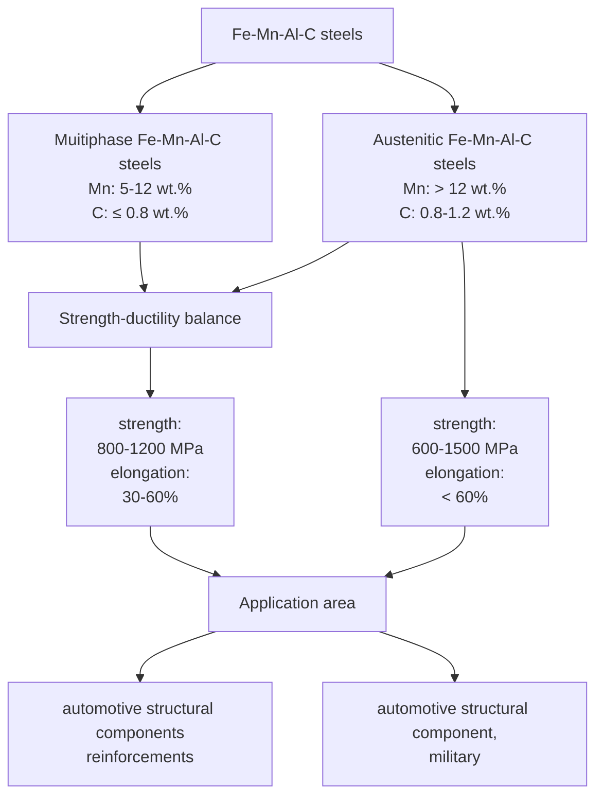

# Lightweight Fe–Mn–Al–C Steels: Current State, Manufacturing, and Implementation Prospects

Valentyn Veis,\* Anastasiia Semenko, Mykhailo Voron, Andrii Tymoshenko, Richard Likhatskyi, Ivan Likhatskyi, and Zhanna Parkhomchuk

The relevance of research on lightweight Fe–Mn–Al–C alloys is continuously increasing. This is justified by their good comprehensive mechanical properties, as well as their potential to improve fuel efficiency and reduce $\mathbf { C O } _ { 2 }$ emissions due to their low density. This work examines the effect of alloying elements on the structure and properties of austenitic Fe–Mn–Al–C steels, the trend of formation and distribution of κ-carbides depending on the content of the main alloying elements. Special attention is paid to the manufacturing process, strengthening methods, and challenges associated with their production. Some issues that require more detailed study for the implementation of lightweight Fe–Mn–Al–C steels in production are also discussed.

# 1. Introduction

During the last 15 years, scientists and engineers have focused their attention on steels based on iron, manganese, and aluminum alloyed with carbon and silicon. This is due to their excellent comprehensive mechanical properties and relevance for use as structural materials. It should be noted that the annual volume of steel production, which is about 1700 Mt year1 (of which 45% is based on the receipt of scrap), leads to total energy consumption, 40 EJ year1 , which in terms of CO2 is 3.7 Gt year1 . [1]

Therefore, considering that 20% of energy consumption and $\mathrm { C O } _ { 2 }$ emissions worldwide are generated by the transport

V. Veis, Z. Parkhomchuk Department of Special Steels and Alloys Physico-Technological Institute of Metals and Alloys of the NAS of Ukraine blvd. Vernadskoho 34/1, Kyiv 03142, Ukraine E-mail: VeisVI@nas.gov.ua A. Semenko Department of Magnetohydrodynamics Physico-Technological Institute of Metals and Alloys of the National Academy of Sciences of Ukraine blvd. Vernadskoho 34/1, Kyiv 03142, Ukraine M. Voron, R. Likhatskyi, I. Likhatskyi Department of Melting and Refining Processes Physico-Technological Institute of Metals and Alloys of the NAS of Ukraine blvd. Vernadskoho 34/1, Kyiv 03142, Ukraine A. Tymoshenko Department of Concentrated Energy Impacts Physico-Technological Institute of Metals and Alloys of the NAS of Ukraine blvd. Vernadskoho 34/1, Kyiv 03142, Ukraine

The ORCID identification number(s) for the author(s) of this article can be found under https://doi.org/10.1002/srin.202400904.

DOI: 10.1002/srin.202400904

sector, the task of reducing fuel consumption by vehicles and, accordingly, $\mathrm { C O } _ { 2 }$ emissions[2–4] arises.

To achieve this goal, it is most appropriate to use high-strength light steels, which makes it possible to reduce the mass of components while ensuring the necessary cross section.[1] The decrease in mass occurs due to a decrease in the density of steel by 1.3% for each added mass percentage of Al and an increase in the crystal lattice parameter (for austenite: 0.00094 nm per wt% Al).[5]

Based on the above, the low density of light high-strength Fe–Mn–Al–C steels

allows to obtain products with a low relative density, which opens up the prospect of increasing fuel efficiency and reducing $\mathrm { C O } _ { 2 }$ emissions.[6,7]It is important to note that the research topic of Fe– Mn–Al–C steels in the world is constantly growing. Today, the number of publications according to the Scopusbibliometric database is the maximum for the entire period of existence of this direction ( ).

Figure 1This class of new materials is based on the concept of high-entropy iron-based alloys having a multiphase structure. Fe–Mn–Al–C steels are about 18% lighter than conventional ones. They demonstrate high strength and plasticity (400 MPa ≤ ultimate strength ≤ 1000 MPa, 600 MPa ≤ ultimate tensile strength ≤ 2000 MPa and 30% ≤ total elongation ≤ 100%).[6,8] This is explained by strengthening mechanisms that occur through phase transformations, twinning, or formation of microbands during deformation.

The high level of plasticity at the same time as the high strength characteristics of Fe–Mn–Al–C steels is due to the available plasticity mechanisms, which is the result of low stacking fault energy (SFE), which depends mainly on the chemical composition and temperature.[9] At a low SFE (below 12 mJ m2 ), the transformation-induced plasticity mechanism (TRIP) prevails, which involves the phase transformation of austenite into martensite during deformation, resulting in a maximum level of mechanical properties with moderate ductility. At SFE in the range of 12–35 mJ m2 , the TRIP mechanism changes to the twin-induced plasticity mechanism (TWIP). An increase in SFE increases the activity of dislocation slip, and deformation occurs with shear in several planes at the same time, which makes it possible to achieve high degrees of deformation. The difference between this mechanism and TRIP is that after deformation, the structure remains austenitic, but with a change in the orientation of part of the crystal relative to the rest of the crystal volume. TWIP steels exhibit the highest level of ductility. It is generally accepted that during the deformation of TWIP steels, twins contribute significantly to increasing the yield strength by up to 50%. Although there are studies that refute such statements, where the contribution of twins to the increase in yield strength does not exceed 10%, the main role in the strengthening mechanism belongs to the increase in the density of dislocations, the emergence of the so-called forest dislocations, and local stress fields that surround dislocations.[10] A further increase in SFE leads to cross-slip, when dislocations move to other slip planes and to wavy slip.[11] At an SFE of 60–100 mJ m2 , dislocations glide along one or a system of parallel planes without cross-slip or wavy slip. Some researchers[12–15] explain this gliding mechanism by the presence of short-range ordering clusters, which act as nuclei for κ-carbides. Primary dislocations passing through such clusters, cut them, and create an easy path for other dislocations. In this way, slip bands with high rates of strain hardening are formed, and the mechanism itself is called the microband-induced plasticity mechanism (MBIP).[12,14] In addition to high strength and plasticity, Fe–Mn–Al–C steels have good operational properties: high fatigue resistance[7,16] and high toughness.[17,18] The combination of such mechanical properties makes these alloys promising for use in machine building, military, aerospace, and mining industries.[6,7]

line

| Search year | Light-weight steel | Fe-Mn-Al-C steel |
| ----------- | ------------------ | ---------------- |
| 2010        | 13                 | 8                |
| 2011        | 14                 | 9                |
| 2012        | 16                 | 10               |
| 2013        | 19                 | 12               |
| 2014        | 20                 | 13               |
| 2015        | 22                 | 14               |
| 2016        | 24                 | 15               |
| 2017        | 27                 | 17               |
| 2018        | 30                 | 19               |
| 2019        | 33                 | 21               |
| 2020        | 38                 | 24               |
| 2021        | 45                 | 28               |
| 2022        | 48                 | 30               |

Figure 1. Number of publications by research topic from 2010 to 2022 according to Scopus bibliometric database.

Previous studies have presented nearly comprehensive results on the research of Fe–Mn–Al–C steels, their structural phase distribution, and mechanical properties under various heat treatment conditions, considering the concentration of the main elements and alloying additions.[6,8] Therefore, given the relevance of Fe–Mn–Al–C steels, there is a need to summarize the obtained results, taking into account the latest findings, to determine promising directions of research in order to accelerate their application in various industries.

# 2. The Influence of Main Elements on Phase Distribution

# 2.1. Multiphase and Austenitic Fe–Mn–Al–C Steels

Lightweight high-strength alloys of the Fe–Al–Mn–C system can be classified into three groups based on their phase composition:

flowchart

—Figure 2. Comparison of multiphase and austenitic Fe–Mn–Al–C steels.

ferritic steels, duplex steels, and austenitic steels,[5,6,8] depending on the content of the austenite stabilizing elements carbon and manganese. Among them, two main research directions regarding the development of these alloys can be distinguished: multiphase Fe–Mn–Al–C steels and Fe–Mn–Al–C steels with austenite as the main phase ( ). Steels containing less than 5 wt% Figure 2manganese and very low carbon can exhibit a fully ferritic structure with a disordered phase FeAl (A2), an ordered phase FeAl (B2), and an ordered phase Fe3Al (DO3) at room temperature depending on the Al content and are not promising for use due to much lower mechanical properties.[19]

Duplex Fe–Mn–Al–C steels, depending on the chemical composition, may consist of austenite, DO3 and B2 phases, and α- or δ-ferrite and have worse ductility compared to austenitic steels.[20,21] With a manganese content of 5–12%, the typical phase transformations during steel solidification follow the sequence $\begin{array} { r } { \eta \to \mathfrak { E } \longrightarrow \mathfrak { C } ^ { \prime } , } \end{array}$ , leading to a final duplex structure composed of austenite and ferrite. With a high manganese content (>12%), steels are characterized by a single-austenitic and duplex matrix based on austenite (austenite ferrite) due to the high content of austenite stabilization elements (Mn and C).

# 2.1.1. Effect of Manganese (Mn)

Manganese stabilizes the γ-phase and can promote the formation of the brittle β-Mn phase. Recent thermodynamic modeling indicates that Mn content around 12–14 wt% minimizes SFE, favoring TWIP mechanisms, while higher Mn (>15 wt%) shifts deformation mode toward microband- and slip-dominated behavior.[22] With a further increase in manganese content (15%–30%), the peritectic transformation does not occur, and the nature of the phase transformation takes the form of γ  ε. First-principles simulations confirm that Mn segregates near stacking faults, subtly influencing local SFE and promoting slip mechanisms over twinning in high-Mn alloys.[23] Due to the formation of spinel (Mn, $\mathrm { F e } ) \mathrm { A l } _ { 2 } \mathrm { O } _ { 4 }$ Mn improves resistance to oxidation. Addition of ≈20 wt% Mn increases electrical resistivity and enhances oxidation resistance by promoting thicker, protective Mn-enriched spinel layers.[24] Mn significantly affects the deformation behavior of Fe–Mn–Al–C steels, contributing to the development of TWIP and TRIP mechanisms depending on its concentration. The phase composition, according to experimental data, is well represented by the calculated diagrams of Fe–20Mn–Al–C steel depending on the Al and C content, as presented in a,b,[25] and depending on the Mn content for Fe– Figure 3xMn–7Al–0.85C steel.[26] Also, Fe–Al–Mn–C steels with a high Mn content have more complex deformation mechanisms.

# 2.1.2. Effect of Aluminum (Al)

Al, as a ferrite-stabilizing element, suppresses the γ ε transformation and significantly reduces steel density. In most studies of light steels, the Al content is limited to 12% or less. This is justified by the fact that in austenitic Fe–Mn–Al–C steels with a relatively high-Al-content κ-carbides of the type (Fe, Mn) AlC, ferrite and ordered phases such as B2 or DO3 at the grain boundaries are brittle phases, which makes it difficult to manufacture light steels with an Al content of more than 13% due to cracking during casting and hot rolling.[27] When Al is added more than 4–5 wt% and depending on the content of Mn and C, the completely austenitic structure is lost, and a high-temperature δ-ferrite phase appears in the structure at room temperature, the formation of which can be inhibited with a certain further increase in the content of Mn and C.[28]

Al increases the SFE of steel, which significantly changes the strain hardening mechanism. Moreover, recent studies have con-— firmed that Al additions (1–2 wt%) significantly enhance resistance to hydrogen-induced embrittlement in high-Mn TWIP steels, by increasing SFE and reducing hydrogen diffusivity thus suppressing intergranular and deformation twin-assisted crack initiation.[29] The solubility of aluminum in face-centered iron is 0.65%, and with Al content of more than 1%, the ability to transformation hardening is lost. With an Al content up to 6 wt%, deformation hardening occurs through twinning. With a further Al content of more than 6–8 wt% plastic deformation proceeds by slip. This leads to the formation of a high-density dislocation walls and dislocation microzone structures, which are impenetrable barriers to further dislocation slip in steels, resulting in high strain hardening.[6,8,25]

Also, Al suppresses the formation of cementite due to a decrease in the diffusivity of carbon in austenite and ensures close order of Al and C atoms in the solid solution. Additionally, higher Al content (10–12 wt%) promotes early formation of coherent nanoscale κ-carbides during aging, improving yield strength with minimal loss in ductility (e.g., achieving ≈1.15 GPa and ≈50% elongation) at optimized aging conditions (≈550 °C) in Fe– 28Mn–9Al–1C steels.[5] The close order provides the necessary energy for spinodal decomposition and the release of nanosized carbides.[6] Nanosized κ-carbide precipitates significantly reduce the dislocation movement rate and play an important role in the strain hardening mechanism of Fe–Mn–Al–C steels by slowing dislocation motion at slip band boundaries and blocking further dislocation movement. Alloys strengthened by incoherent carbides are characterized by an increase in the rate of strain hardening due to the inability of dislocations to pass through the carbide and the accumulation of dislocations around the carbides. Coherent carbides, which are κ-carbides, can be cut by dislocations and are not insurmountable obstacles, which lead to a decrease in the rate of strain hardening.[30] An increase in the aluminum content leads to a more intensive formation and growth of κ-carbide inclusions, which accordingly affects the nature of strain hardening. Due to the release of κ-carbide in aged Fe–Mn–Al–C steels with an Al content of 10 wt%, the strength increases significantly, and the rate of strain hardening of steel decreases.[31]

New thermodynamic assessments using CALPHAD datasets confirm that increasing Al from 5 to 12 wt% shifts the κ-carbide solvus to higher temperatures, enabling finer precipitate control during aging and preventing coarse boundary phases.[32]

The yield strength (YS) and ultimate strength (UTS) after 40 h of aging of steel with 10% Al is greater than that of steel with 8% Al, which is due to the higher volume fraction of κ-carbide inclusions in the steel. Elongation, on the other hand, decreases with increasing aging time and is smaller for steel with a higher Al content, which is associated with a greater distance between the slip bands in steel with 10% aluminum.[30] An increase in the content of Al and the duration of aging increases the volume fraction, and size of coherent κ-carbide precipitates, respectively, increases the probability of cutting by dislocations of carbides, reduces the density of slip bands, which leads to a less intense accumulation of dislocations during plastic deformation and to a constant decrease in the rate of strain hardening.[33]

scatter

| Weight percent Al | Weight percent C | Label        |
| ----------------- | ----------------- | ------------ |
| 6                 | 3.5               | M₃C          |
| 7                 | 3.0               | M₃C          |
| 8                 | 2.5               | M₃C          |
| 9                 | 2.0               | M₃C          |
| 10                | 1.5               | M₃C          |
| 11                | 1.0               | M₃C          |
| 12                | 0.5               | M₃C          |
| 13                | 0.0               | M₃C          |
| 14                | 0.0               | M₃C          |
| 15                | 0.0               | M₃C          |
| 16                | 0.0               | M₃C          |
| 17                | 0.0               | M₃C          |
| 18                | 0.0               | M₃C          |
| 19                | 0.0               | M₃C          |
| 20                | 0.0               | M₃C          |
| 6                 | 4.5               | M₃C          |
| 7                 | 4.0               | M₃C          |
| 8                 | 3.5               | M₃C          |
| 9                 | 3.0               | M₃C          |
| 10                | 2.5               | M₃C          |
| 11                | 2.0               | M₃C          |
| 12                | 1.5               | M₃C          |
| 13                | 1.0               | M₃C          |
| 14                | 0.5               | M₃C          |
| 15                | 0.0               | M₃C          |
| 16                | 0.0               | M₃C          |
| 17                | 0.0               | M₃C          |
| 18                | 0.0               | M₃C          |
| 19                | 0.0               | M₃C          |
| -                 | -                 | γ            |
| -                 | -                 | γ + κ        |
| -                 | -                 | α + γ        |
| -                 | -                 | α + κ        |
| -                 | -                 | γ + κ        |
| -                 | -                 | α + κ        |
| -                 | -                 | γ + κ        |
| -                 | -                 | α + κ        |
| -                 | -                 | γ + κ        |
| -                 | -                 | α + κ        |
| -                 | -                 | γ + κ        |
| -                 | -                 | α + κ        |
| -                 | -                 | γ + κ        |
| 6                 | 4.5               | M₃C          |
| 7                 | 4.0               | M₃C          |
| 8                 | 3.5               | M₃C          |
| 9                 | 3.0               | M₃C          |
| 10                | 2.5               | M₃C          |
| 11                | 2.0               | Mali         |
| 12                | 1.5               | Mali         |
| 13                | 1.0               | Mali         |
| 14                | 0.5               | Mali         |
| 15                | 0.0               | Mali         |
| 16                | 0.0               | Mali         |
| 17                | 0.0               | Mali         |
| 18                | 0.0               | Mali         |
| 19                | 0.0               | Mali         |
| -                 | -                 | Al₄C₃       |
| -                 | -                 | α + κ        |
| -                 | -                 | α + κ        |
| -                 | -                 | α + κ        |
| -                 | -                 | α + κ        |
| -                 | -                 | α + κ        |
| -                 | -                 | α + κ        |
| -                 | -                 | α + κ        |
| -                 | -                 | α + κ        |
| -                 | -                 | α + κ        |
| -                  | -                 | Al₄C₃       |
| -                  | -                 | α + κ        |
| -                  | -                 | α + κ        |
| -                  | -                 | α + κ        |
| -                  | -                 | α + κ        |
| -                  | -                 | α + κ        |
| -                  | -                 | α + κ        |
| -                  | -                 | α + κ        |
| -                  | -                 | α + κ        |
| -                  | -                 | α + κ        |
| -                    | -                 | Al₄C₃       |
| -                    | -                 | α + κ        |
| -                    | -                 | α + κ        |
| -                    | -                 | α + κ        |
| -                    | -                 | α + κ        |
| -                    | -                 | α + κ        |
| -                    | -                 | α + κ        |
| -                    | -                 | α + κ        |
| -                    | -                 | α + κ        |
| -                    | -                 | α + κ        |
| -                      | -                 | Al₄C₃       |
| -                      | -                 | α + κ        |
| -                      | -                 | α + κ        |
| -                      | -                 | α + κ        |
| -                      | -                 | α + κ        |
| -                      | -                 | α + κ        |
| -                      | -                 | α + κ        |
| -                      | -                 | α + κ        |
| -                      | -                 | α + κ        |
| -                      | -                 | α + κ        |
| -                    <fcel>-                <fcel>Al₄C₃       |
| -                     | -                 | α + κ        |
| -                     | -                 | α + κ        |
| -                     | -                 | α + κ        |
| -                     | -                 | α + κ        |
| -                     | -                 | α + κ        |
| -                     | -                 | α + κ        |
| -                     | -                 | α + κ        |
| -                     | -                 | α + κ        |
| -                    <fcel>-                <fcel>Al₄C₃       |
| -                     | -                 | α + κ        |
| -                    <fcel>-                <fcel>α + κ        |
| -                    <fcel>-                <fcel>α + κ        |
| -                    <fcel>-                <fcel>α + κ        |
| -                    <fcel>-                <fcel>α + κ        |
| -                    <fcel>-                <fcel>α + κ        |
| -                    <fcel>-                <fcel>α + κ        |
| -                    <fcel>-                <fcel>α + κ        |
| -                    <fcel>-                <fcel>α + κ        |
| -                    <fcel>-                <fcel>α + κ        |

Note: The chart displays multiple data series (M₃C, M₄C, etc.) plotted against Weight percent Al on the x-axis and Weight percent C on the y-axis.

Figure 3. Calculated phase diagrams of $\mathsf { F e } - 2 0 \mathsf { M n } - \mathsf { A l } - \mathsf { C }$ alloys at a) $9 0 0 ^ { \circ } \mathsf { C }$ and b) $1 2 0 0 ^ { \circ } \mathsf { C } . ^ { [ 2 5 ] }$ Reproduced with permission.[25] Copyright 2010, Elsevier.

Al increases the temperature of ${ \mathsf { A } } { \mathsf { e } } _ { 3 }$ and, accordingly, expands the temperature range for intercritical annealing, which makes it possible to reduce the temperature sensitivity of the alloy during annealing. An increase in the temperature of Ae3 with the addition of Al allows for an increase in the intercritical annealing temperature, which in turn contributes to faster diffusion and a reduction in the annealing time itself.[28]

# 2.1.3. Effect of Carbon (C)

Carbon stabilizes the γ-phase, reduces fatigue strength in LCF (low cyclic fatigue), and extremely LCF modes. Carbon has the strongest effect on reducing the temperature of ${ \mathrm { A e } } _ { 3 } ,$ significantly increases SFE, and reduces the onset temperature of martensitic transformation. However, a high carbon content increases the solvus of cementite and significantly shortens the temperature interval for intercritical annealing, leading to the formation of cementite in the structure, carbon depletion in austenite, and consequently a decrease in SFE and an increase in the temperature of the beginning of the martensitic transformation. Another disadvantage of high carbon content in lightweight manganese steels is that cementite inclusions serve as focal points for crack initiation at high levels of deformation and contribute to poorer weldability overall.[34] Recent quantitative studies reveal that increasing C content from ≈0.8 wt% to 1.4 wt% in Fe– 28Mn–(10–12)Al–C steels leads to a marked increase in κ-carbide volume fraction (from ≈10 vol% to ≈30 vol%) and particle size (from ≈10 nm to ≈38 nm), which boosts precipitation strengthening by up to ≈583 MPa but can shift deformation behavior from carbide shearing to Orowan bypassing.[35] Additionally, first-principles and experimental investigations indicate that elevated C accelerates intragranular κ-carbide formation while also promoting coarse intergranular precipitation that significantly impairs impact toughness.[36] The minimum required carbon content to ensure increased ductility through the twinning mechanism (TWIP) is 0.6 wt%.[37] With lower carbon content, most medium-manganese steels exhibit a transformation mechanism for enhanced ductility (TRIP).

Based on the content of the main alloying elements and carbon, Fe–Mn–Al–C steels can be divided into fully austenitic steels, which contain 12 to 30 wt% Mn, 5 to 12 wt% Al, and 0.6 to 1.2 wt% C to achieve stability in the austenite structure at room temperature,[6,8] and duplex steels based on austenite, which contain 5–30 wt% Mn, 5–10 wt% Al, and 0.4–0.7 wt% $\mathrm { C } . ^ { [ 5 ] }$ shows the influence of Mn and C concentration Figure 4on the mechanical properties of Fe–Mn–Al–C steel.[8]

Figure 4. Mechanical properties of lightweight steels a) with an average Mn content and b) with high Mn content at room temperature.[8] Reproduced under the terms of the Creative Commons Attribution (CC BY) license.[8] Copyright 2022, MDPI.

# 2.2. Formation and Distribution of κ-Carbides in Relation to Main Element Concentrations

# 2.2.1. General Characteristics of κ-Carbides

One of the most important features of Fe–Mn–Al–C steels is the presence of the κ-carbide phase. These κ-carbides have a perovskite crystal structure, denoted as E21, with the stoichiometric formula $( \mathrm { F e } , \mathrm { M n } ) _ { 3 } \mathrm { A l C } . ^ { [ 3 8 ] }$ However, a metastable phase with the formula $( \mathrm { F e } , \mathrm { M n } ) _ { 3 } \mathrm { A l C } _ { x } \ ( x < 1 )$ has also been experimentally confirmed,[39] where some Mn atoms substitute for Al atoms, causing a certain distortion of the crystal lattice.[40] Recent comprehensive reviews summarize that κ-carbides precipitate via both spinodal decomposition and classical nucleation in γ- matrix; their coherency and distribution depend on minor alloying and thermal history, strongly influencing mechanical performance.[41,42]

# 2.2.2. Intragranular and Intergranular Precipitation

The formation of κ-carbide in Fe–Mn–Al–C steels can occur according to the chemical composition and the conditions of thermal exposure both at the grain boundaries and inside the austenite grain according to various mechanisms of formation, which plays a decisive role in the formation of the microstructure and mechanical properties.[24,43–45]

Intergranular κ-carbide is formed during prolonged aging or low-temperature annealing at the austenite grain boundaries in the form of plates or lamellae by the eutectoid reaction.[7] The unfavorable shape, together with the often large sizes of intergranular κ-carbide, negatively affects the plasticity of steel, since such carbides act as stress concentrators and are potential threats to the formation of microcracks and brittle failure.[43]

Intragranular κ-carbide, often referred to as κ’-carbide, is formed inside the austenite grain by spinodal decomposition, which leads to a homogeneous distribution in the γ-matrix with a high dispersion (2–3 nm). However, in some works,[40,46,47] the spinodal character of the formation of κ-carbides is denied due to the discrepancy in the type of crystal lattice of the formed κ-carbide phase. The authors claim that κ-carbides with a simple cubic (SC) lattice are formed by coagulation of inclusions of the intermediate metastable phase $\operatorname { L } 1 _ { 2 } ,$ enriched in carbon. In turn, the inclusions of the L12 phase with SC lattice are formed as a result of the arrangement of low-temperature austenite enriched with alloying elements with a face-centered-cubic lattice, which is formed together with low-temperature austenite depleted of alloying elements during cooling of high-temperature austenite, by the diffusion mechanism.

# 2.2.3. Formation Mechanisms of κ-Carbides

An increase in the Mn content slows down the formation of intragranular κ-carbide due to the filling of vacancies in the volume-centered lattice $\operatorname { L } 1 _ { 2 }$ instead of carbon atoms during the redistribution of the latter.[8]

The interface between austenite and κ-carbide is coherent, with a calculated lattice parameter mismatch of 2.7% along [001]κ//[0011]γ. [44] The low discrepancy in lattice parameters between κ-carbide and austenite provides optimal mechanical properties and results in low elastic strain energy, which acts as a barrier to first-order phase transitions. Consequently, the possibility of spinodal decomposition arises at low degrees of undercooling, leading to the formation of nanoscale inclusions. In contrast, a high mismatch in lattice parameters increases elastic strain energy, complicating the nucleation of κ-carbide due to the significant energy barrier, ultimately resulting in a decrease in the mechanical properties of the steel. However, at high temperatures, the formation of coarse κ-carbides occurs due to the high diffusivity of the elements.[5,44,48,49]

# 2.2.4. Effect of Heat Treatment on κ-Carbide Distribution

An example of duplex Fe–Mn–Al–C steel with 9% Al, 34% Mn, and 0.65% C demonstrates[44] that during annealing at $6 0 0 ^ { \circ } \mathrm { C } ,$ the presence of fine κ-carbides (0.17 nm) is observed only in ferrite due to the significantly lower diffusivity of the elements in austenite. At an annealing temperature of $7 0 0 ^ { \circ } \mathrm { C } ,$ nanodispersed κ-carbides form in austenite, while those previously formed in ferrite significantly increase in size to 2.62 nm. When the annealing temperature is raised to $8 0 0 ^ { \circ } \mathrm { C } ,$ further growth of κ-carbides in ferrite occurs, reaching sizes of 17.2 nm, and no κ-carbides are present in austenite due to their low thermal stability at this temperature. Moreover, recent work on Fe–18Mn–10Al–1C–5Ni alloys demonstrates that the cooling rate (e.g., water quenched vs. air cooled) significantly alters κ-carbide size and precipitation of B2 NiAl–kappa composites, directly impacting strength and fracture resistance.[50]

# 2.2.5. Influence of κ-Carbides on Mechanical Properties

Coarse intergranular κ-carbides lead to a sharp decrease in plasticity, and their content in the steel structure requires careful control. In contrast, fine intragranular κ’-carbides enhance the strength of lightweight steels without significant loss of plasticity, resulting in a relatively high ratio of yield strength to tensile strength. High-cycle fatigue tests on Fe–29Mn–8.7Al–1C steels revealed that nanodispersed intragranular κ-carbides significantly improve fatigue life, with fatigue strength increasing by ≈15% after aging due to enhanced resistance to crack initiation.[51] The yield strength of these steels increases with the concentration of Al, reaching maximum values at an Al content of 12% for the Fe–26Mn–xAl–C alloy, where the contribution to the increase in yield strength comes not only from the effect of solution hardening but also from grain refinement and, most significantly, the precipitation of κ-carbides.[52] Dual-phase steels, particularly those containing ferrite and martensite, benefit from a combination of grain refinement, dislocation hardening, and second-phase strengthening mechanisms. While Fe–Mn–Al–C steels differ in phase composition, similar strengthening strategies can be observed, especially where multiphase microstructures (such as κ-carbides within austenite) are involved. As outlined in the review by Badkoobeh et al.,[53] the interplay between ferritic and martensitic structures provides insight into optimizing mechanical performance through phase interaction, grain size control, and controlled precipitation of hard phases.

# 3. Influence of Alloying an Microalloying on the Properties of Fe–Mn–Al–C Steels

# 3.1. The Influence of Alloying Elements (Si, Cr, Cu) on Fe–Mn– Al–C Steels

The structural and mechanical properties of Fe–Mn–Al–C steels are strongly influenced by alloying additions, which affect phase stability, precipitation behavior, and deformation mechanisms.[6,7,54] Among the most effective elements in this regard are silicon, chromium, and copper. Their introduction can modify the morphology and distribution of κ-carbides, alter the SFE, improve corrosion resistance, and enhance the thermal stability of the steel. These effects contribute to refined microstructures with a favorable balance between strength and ductility. In particular, alloying can intensify precipitation strengthening, suppress the formation of brittle intergranular phases, and stabilize the austenitic matrix. This subsection reviews the individual roles of Si, Cr, and Cu in influencing the microstructure and performance of Fe–Mn–Al–C steels, drawing on recent experimental findings.

# 3.1.1. Effect of Silicon (Si)

In lightweight Fe–Mn–Al–C steel, silicon is considered one of the most common alloying elements, as it can improve its flowability, enhance carbon activity in the austenite, promote the formation of κ-carbides, and stabilize κ-carbides at high temperatures.[55] It should also be noted that the addition of Si improves the casting properties of the alloy by lowering the melting temperature and viscosity of the molten metal. It has been confirmed[11] that the addition of silicon accelerates the kinetics of κ-carbide formation and significantly increases the carbon distribution coefficient by more than 2 times. Carbonenriched κ-carbides exhibit greater resistance to shearing by dis-─ locations due to the high coherency strain that arises between the phases because of differences in lattice parameters and the formation of a strong Al C bond, which requires more energy for dislocation movement through the κ-carbides. Additional atomprobe tomography studies have confirmed that increasing Si content (from ≈0.6 wt% to ≈1.6 wt%) in Fe–30Mn–9Al–0.9C–0.5Mo steels accelerates κ-carbide nucleation and increases carbon partitioning between matrix and precipitates, raising the carbon partition coefficient from ≈2.1 to ≈2.9 during aging at ≈530 °C.[56] Despite increased hardness and yield strength, Si additions slightly reduce work-hardening rate and uniform elongation by ≈10%.

Silicon can also improve the oxidation resistance of lightweight Fe–Mn–Al–C steels as well as their strength, which is attributed to silicon’s role in promoting the precipitation of κ-carbides. Heo et al. (2012) reported that Si additions enhance carbon activity and thermodynamic stability of κ-carbide, allowing precipitation at higher temperatures and further improving oxidation resistance.[57] However, excessive silicon content in Fe–Mn–Al–C steel leads to the precipitation of intergranular κ-carbide, negatively affecting the properties of the lightweight steel. High silicon levels can result in the red scale defect during hot rolling, where a eutectic compound FeO/Fe2SiO4 forms on the surface of the casting upon heating and gets pressed into its surface during rolling. This oxide film is very difficult to remove and serves as a barrier for subsequent galvanization operations. Therefore, it is preferable to limit the silicon content in lightweight steels to 1–2 mass%.[28]

Si is a weaker stabilizer of ferrite compared to Al and is distributed in the ferrite during intercritical annealing for duplex steels with medium-manganese content. If the formation of bainite is possible in the steel structure during cooling, silicon can slow down the precipitation of cementite in bainitic ferrite, allowing for a more carbon-saturated austenite to be obtained. It has been established[58] that in medium-manganese steel Fe–9.4Mn– 3.4Si–3.2Al–0.2C, the high content of Al and Si in the δ ferrite bands leads to the formation of an ordered B2 (FeAl) phase, which subsequently causes transcrystalline failure during strength and impact toughness tests with a V-shaped notch using the Charpy method.

The formation of κ-carbides in lightweight austenitic Fe– 30Mn–9Al–1.2C steels is regulated by the addition of Si (0, 1, 2 mass%) ( ), which can significantly enhance the activity Figure 5of Al and C based on thermodynamic calculations. Increasing the Si content in thermally treated Fe–Mn–Al–C leads to a significant growth of intragranular κ-carbides. In silicon-free thermally treated steel, ordered L1 nanodomains (with a size of <1 nm) with a uniform distribution of elements were observed, while increasing the Si content to 2 mass% resulted in cuboidal intragranular κ-carbides L’1 with an average size of 11.5 nm and a volume fraction of 25.9%, along with well-developed element segregation. In the steel with 2 mass% Si, in addition to the coarsening of intragranular κ-carbides, significantly larger intergranular κ-carbides (50–200 nm) were found, which are more frequently formed during prolonged annealing than during aging. Additionally, at the austenite grain boundaries in the Fe–Mn–Al–C steel with 2 mass% Si, the precipitation of κ-carbides inside the grains leads to an increase in yield strength from ≈450 MPa to ≈950 MPa, while the strain hardening due to the formation of localized coarse slip bands increases from 20% (at 0 mass% Si) to 55% and 83% at 1 mass% and 2 mass% Si, respectively.[46]

Figure 5. Formation of κ-carbides in the homogenized state.[46] Reproduced with permission.[46] Copyright 2020, Elsevier.

# 3.1.2. Effect of Chromium (Cr)

Recent research has increasingly focused on alloying Fe–Mn–Al– C steels with chromium. This is justified by the fact that the addition of Cr to Fe–Mn–Al–C low-density steel can regulate its microstructure and significantly improve corrosion resistance.[59–61] Specifically, Shi et al. (2022) demonstrated that adding 3–5 wt% Cr leads to the formation of a more stable passive oxide film on Fe–Mn–Al–C steel surfaces, reducing corrosion rate by ≈40% in NaCl solution.[60] The addition of Cr improves the solubility of C in austenite, reduces the diffusion coefficient of C atoms, effectively suppressing the precipitation of κ-carbide at the grain boundaries, and slows down the growth rate of κ-carbide inside the grain.[62] Yuji Sutou et al.[63] showed that 5 wt% Cr in Fe–20Mn–(10–14)Al–(0–1.8)C steel promotes fine and uniform intragranular κ-carbide precipitation, enhancing yield strength and ductility simultaneously. Suppression of the release of κ-carbide with the addition of Cr leads to a decrease in the microhardness of the austenite matrix and a slight decrease in the yield point at a low content (up to 3 wt%). With a further increase in the Cr content, the yield strength increases again due to grain refinement and the formation of the DO3 phase. Numerous studies have shown that the addition of chromium to low-density steel can enhance ductility without sacrificing strength by regulating the precipitation of κ-carbides and thus stabilizing the austenitic matrix.[64] Additionally, a recent study[65] on Fe–25Mn–10Al–1.2C steels with varying Cr (2.5–10 wt%) reported that Cr addition narrows the κ-carbide-free incubation period during aging, enabling more controlled precipitation and a balanced enhancement of toughness and strength.

Moreover, carbon is typically detrimental to the corrosion resistance of low-density steel, but reducing the C content negatively affects strength. J. Moon et al. found that adding 5 wt% Cr can provide good corrosion resistance for low-density steel even with a C content of 1.5 wt%. The addition of Cr would extend the controllable range of C content in low-density steels.[61]

J. Zhang et al. in their work[62] investigated the microstructure, mechanical properties, and deformation behavior of low-density Fe–20Mn–9Al–3Cr–xC steel with varying C content at levels of 0.8–1.4 wt% ( ). The experimental samples were pro-Figure 6duced using the centrifugal casting method. It was found that as the C content increased from 0.8 wt% to 1.4 wt%, the volume fraction of ferrite decreased from 36 vol% to 4 vol%, and the precipitation of the DO3 phase in the ferrite decreased. Simultaneously, the increased C content significantly promoted the precipitation and growth of κ-carbides in the austenite. The yield strength at a C content of 0.8 wt% was 680 MPa, and as the C content increased to 1.4 wt%, it rose to 992 MPa. The steel strips maintained an elongation of 33% or more due to the suppression of Cr precipitation on intergranular κ-carbides. In particular, the dispersion strengthening of the κ-carbides in the austenite increased from 36.3 MPa in the steel strip with 0.8 wt% C to 409.4 MPa in the steel strip with 1.4 wt% C, becoming the main strengthening factor when the C content exceeded 1 wt%.

natural_image

Microscopic view of a material's grain structure with red and gray regions, scale bar indicating 50 μm (no text or symbols present)

natural_image

Microscopic view of a material's grain structure with red and black regions, scale bar indicating 50 μm (no text or symbols present)

natural_image

Microscopic view of a material's grain structure with red and black regions, scale bar indicates 50 μm (no text or symbols present)

natural_image

Microscopic view of a material's grain structure with red fluorescent spots, scale bar 50 μm (no text or symbols)

Figure 6. Scanning Electron Microscopy-Electron Backscatter Diffraction (SEM-EBSD) phase maps of Fe–20Mn–9Al–3Cr-xC low-density steel strips: a) 0.8C, b) 1.0C, c) 1.2C, d) 1.4C. The red and gray contrasts indicate ferrite and austenite, respectively.[62] Reproduced with permission.[62] Copyright 2023, Elsevier.

Sutou et al.[63] found that the Fe–20Mn–11Al–1.8C–5Cr steel has excellent mechanical properties, with a yield strength of 1040 MPa, a tensile strength of 1223 MPa, and an elongation of 41%. Kim et al.,[64] while investigating the microstructure of lightweight Fe–20Mn–12Al–1.5C–(0–7)Cr steel, showed that the chromium-free steel consists of austenite (γ) with fine intragranular κ-carbides, coarse intergranular κ-carbides, and a small amount of ferrite (α). The microstructure of the steel with 5% Cr mainly consists of austenite and fine intragranular κ-carbides, a small amount of ferrite, and an ordered DO3 phase. K. Kim et al.[66] successfully developed an ultralight steel Fe–30Mn– 13.2Al–1.6C–5Cr, which has a homogeneous austenite microstructure with fine κ-carbides within the austenite and a very small fraction of the ordered DO3 phase, achieving a tensile strength of 1048 MPa and an overall elongation of 38%.

This was accomplished through the optimization of hot rolling and heat treatment conditions. Increasing the Al content to 13.2 mass% allowed for a reduction in the density of the Fe–30Mn–13.2Al–1.6C–5Cr steel by ≈20%, resulting in a steel density of 6.3 g·cm3 . To prevent the formation of ferrite due to the increased content of ferrite-stabilizing Al, the content of austenite-stabilizing Mn and C was increased to 30% and 1.6%, respectively. The addition of 5 mass% Cr to the Fe–30Mn–13.2Al–1.6C steel was justified by the aim of suppressing the formation of κ-carbide due to the increased content of aluminum and carbon.[67] The study[64] confirmed that the addition of a certain amount of Cr delays the formation of κ-carbide and thereby slightly increases the fraction of austenite due to the enrichment of austenite with carbon.

The decomposition of austenite during the aging of austenitic Fe–Mn–Al–C steels into ferrite and beta-manganese at the austenite grain boundaries leads to a decrease in corrosion resistance. The presence of ferrite and the increase in its fraction in the steel structure cause pitting corrosion at the boundaries of austenite and ferrite grains. The corrosion resistance of manganese steels decreases in aqueous solutions as the manganese content increases, while it conversely increases with higher aluminum content. Complex alloying of high-manganese austenitic steel with 3% Cr and 3% Mo enhances resistance to pitting corrosion due to the protective film formed through passivation. However, with a higher content of these elements, the formation of the DO3 phase, which becomes a focal point for pitting corrosion, leads to a deterioration in corrosion resistance.[61]

At a Cr content of more than 5 mass%, Cr-rich $\mathrm { M } _ { 7 } \mathrm { C } _ { 3 }$ carbides precipitate, and the fraction of the ordered DO3 phase increases. While the tensile strength improves, the elongation sharply decreases due to the high brittleness of the carbides.[64,66]

# 3.1.3. Effect of Copper (Cu)

The addition of Cu to Fe–Mn–Al–C steel allows for the expansion of the austenite zone, stabilizes it, and improves tensile properties by controlling the SFE.[8] Recent work by Liu et al. reported that in Fe–12Mn–8Al–1C–3Cu lightweight steel aged at $5 5 0 ^ { \circ } \mathrm { C } .$ , the coprecipitation of nanoscale (≈5 nm) intragranular $\mathbf { \kappa } ^ { \prime }$ carbides and fine Cu-enriched clusters significantly increased tensile strength to ≈900 MPa with ≈25% elongation.[68] Compared to Mo, Ni, V, and Nb, which are commonly added to Fe–Mn–Al–C steel to achieve dispersion strengthening, the cost of Cu is relatively lower.

Since $\mathrm { C u } ,$ as an austenite stabilizer, not only increases the volume fraction of austenite but also hinders recrystallization due to the solution resistance effect and promotes the formation of Curich B2 particles. Studies[69,70] examined the effect of adding up to 5 wt% Cu to Fe–28Mn–9Al–0.8C steel. It was determined that Cu-enriched particles promote the precipitation of κ-carbides, and the yield strength of the Cu-enriched austenitic lightweight steel Fe–28Mn–9Al–0.8C–5Cu reaches 808 MPa with a total elongation of over 20%.[69] When alloying Fe–28Mn–9Al–0.8C steel with 0–3 wt% Cu combined with annealing, it was found that the addition of Cu suppresses the formation of intergranular κ-carbides during annealing at 500–700 °C for 3 h, resulting in further increases in strength and a slight decrease in overall elongation for Fe–28Mn–9Al–0.8C–3Cu ( $7 ) . ^ { [ 7 0 ] }$ As the Figure 7annealing temperature increases, the size and number of large Cu-rich areas gradually decrease, while the number of small Cu-rich areas in the austenite increases.

The yield strength, tensile strength, and total elongation of the Fe–28Mn–9Al–0.8C–3Cu steel annealed at $6 0 0 ^ { \circ } \mathrm { C }$ are 653 MPa, 965 MPa, and 25%, respectively, which are higher than those of the Fe–28Mn–9Al–0.8C steel. The simultaneous precipitation of Cu-enriched κ-carbide particles contributes to the increase in yield strength.

The Fe–Cu system has a high positive enthalpy of mixing due to the immiscibility of Cu and Fe. Cu atoms can be easily separated from the supersaturated austenitic matrix, forming Cu-rich clusters or particles. A high Cu content provides a greater chemical driving force for the precipitation of Cu-rich particles during heat treatment.[71] Therefore, austenitic lightweight steel Fe–Mn–Al–C with the addition of Cu has broad application prospects. Due to the discrete strengthening from fine Cu-rich particles, it can enhance the strength of the steel without reducing ductility. Additionally, Song et al. reported that 1–3 wt% Cu additions introduce nanoscale Cu-rich B2 precipitates along with κ carbides, yielding a combination of ≈1.1 GPa tensile strength and ≈40% elongation in Fe–29Mn–9Al–0.9C steels.[72]

natural_image

Microscopic image showing a dark irregular particle with a 2 μm scale bar, labeled (a) in top-left corner.

natural_image

Microscopic view of irregularly shaped particles with a 2 μm scale bar (no text or symbols beyond label)

natural_image

Microscopic view of a material surface with granular texture and 2 μm scale bar (no text or symbols)

natural_image

Microscopic view of cellular or particulate structures with 2 μm scale bar (no text or symbols)

natural_image

Fluorescent microscopy image showing cellular structures with green and red emission regions (no text or symbols)

natural_image

Microscopic image showing fluorescently labeled cellular structures with green and red regions (no text or symbols)

natural_image

Microscopic image showing cellular or tissue structures with green and red fluorescent markers (no text or symbols)

natural_image

Microscopic view of a dark, granular material with scattered bright spots (no text or symbols)

heatmap

| Value |
|---|
| 3.500 |
| 4.063 |
| 4.625 |
| 5.188 |
| 5.750 |
| 6.313 |
| 6.875 |
| 7.438 |
| 8.000 |

Figure 7. Electron probe microanalysis (EPMA) images of 3Cu strips: a,e) as cast; b,f ) annealed at $5 0 0 ^ { \circ } \mathsf { C } ;$ c,g) annealed at $6 0 0 ^ { \circ } \mathsf { C } ;$ d,h) annealed at $7 0 0 ^ { \circ } C . ^ { [ 7 0 ] }$ Reproduced with permission.[70] Copyright 2021, Springer Nature.

Meanwhile, the precipitation of fine Cu-rich particles can contribute to the formation of small κ-carbide particles, which is significant for improving the yield strength of lightweight steels while maintaining high plasticity.[54]

# 3.2. Microalloying of Fe–Mn–Al–C Steels with Carbide-Forming Elements

The main purpose of microalloying manganese steels with carbide-forming elements is to enhance the yield strength through dispersion strengthening and grain refinement. However, despite their significant role in strengthening lightweight steels, the content and ratio of carbide-forming elements are limited due to their high cost.

# 3.2.1. Effect of Vanadium (V)

Most research on the dispersion strengthening of Fe–Mn–Al–C steels has focused on the use of vanadium (V) as a carbide former. Vanadium has good solubility in austenite and, during annealing, facilitates the formation of nanodispersed carbides such as VC and $\mathrm { V } _ { 4 } \mathrm { C } _ { 3 } ,$ which can precipitate in both the austenitic and ferritic phases. This dual precipitation allows for the strengthening of both phases, contributing to the overall mechanical properties of the steel. In study,[73] the calculated strength increase of medium manganese steel Fe–8Mn–3Al– 2Si–0.4C–xV with dispersoid sizes of 10 nm and 20 nm is shown. At relatively low V content (<0.2 mass%), the experimental and calculated data coincide; however, as the vanadium content increases, the discrepancy between experimental and calculated strength becomes significant. Even at 0.7 mass% V, the dispersed inclusions slow down the recrystallization process that occurs during hot rolling. The influence of V on the strength of steel amounts to 650 MPa, of which 400 MPa is attributed to dispersion strengthening, while the remainder is due to dislocation strengthening, resulting from incomplete recrystallization, which causes undesirable residual stresses in the metal. Given the high cost of vanadium, it is recommended to limit its content in steels to 0.2 mass%.

The role of vanadium when added to lightweight austenitic Fe–Mn–Al–C steels also lies in grain refinement of the austenite and the manifestation of the dispersion strengthening effect. As a strong carbide-forming element, V can hinder the formation of κ-carbide by binding the carbon present in the steel. Fine dispersoid VC particles can enhance strength and ductility in the hot state.[73] Recent experimental work by Zhang et al. demonstrated that vanadium microalloying enables dual-nanometric precipitation of VC and κ-carbides in Fe–27Mn–8Al–1.0C austenitic steels. After thermomechanical processing followed by aging, this led to tensile strengths above 1000 MPa and total elongation up to ≈41%, indicating a beneficial synergy between solid solution and precipitation strengthening mechanisms.[74] Furthermore, vanadium addition alone was shown to enable dual nanoprecipitation of VC and fine κ-carbides in Fe–27Mn–8Al– 1.0C steels after annealing and aging, resulting in high tensile strengths (>1000 MPa) and good elongation (≈41%). The addition of 0.5% V to lightweight austenitic Fe–30Mn–9Al–0.9C steel improved its tensile strength and yield strength due to grain refinement and the precipitation of VC particles, while also having a positive effect on the strength in the heat-affected zone of the weld, exceeding the strength of the base steel.[75] Intragrain κ-carbides and $\mathrm { V } _ { 4 } \mathrm { C } _ { 3 }$ particles can coprecipitate in the steel after cold rolling (20%), high-temperature annealing $( 9 0 0 ^ { \circ } \mathrm { C } )$ , and low-temperature aging $( 4 5 0 – 5 5 0 ^ { \circ } \mathrm { C } )$ , resulting in an increase in tensile strength and specific strength of the austenitic steel with the addition of 1.0 mass% V to 1300 MPa and $1 9 0 { \mathrm { M P a c m } } ^ { 3 } { \mathrm { g } } ^ { - 1 } { \mathrm { , } }$ , respectively. The addition of vanadium to lightweight austenitic steel and the selection of appropriate heat treatment lead to the precipitation of intragrain nanoscale $\mathrm { V } _ { 4 } \mathrm { C } _ { 3 }$ particles, enhancing the overall properties of the lightweight steel. From the perspective of enhancing strength, V is more promising than $\overset { \star } { \mathrm { N b . } } \overset { [ 5 ^ { \bullet } ] } { . }$ However, for Fe–Mn–Al–C with varying component contents, the optimal amount of vanadium addition, its impact on corrosion properties, energy absorption resistance during collisions in the automotive industry, and heat treatment parameters require a more detailed study.

# 3.2.2. Effect of Niobium (Nb)

Alloying Fe–Mn–Al–C steels with niobium contributes to their strengthening through grain refinement and dispersion hardening, as well as enhancing corrosion resistance. The addition of 0.5% Nb to lightweight austenitic Fe–28Mn–10Al–1C steel leads to a reduction in austenitic grain size by more than 2.5 times. Consequently, the yield strength, tensile strength, and elongation increased by 171 MPa, 64 MPa, and 11.5%, respectively.[54] Microligating Fe–22Mn–1.5Si–1.5Al–0.4C steel with 0.06% niobium also demonstrated effectiveness in improving wear resistance. Nanodispersed NbC particles, which precipitate after high-temperature annealing during cooling, serve as obstacles to dislocation motion, enhancing the strengthening effect and increasing the rate of deformation hardening. Recent studies have shown that 0.5 wt% Nb alloying in cold-rolled Fe–28Mn– 10Al–C steel results in significant grain refinement and improved mechanical characteristics, with ultimate tensile strength exceeding 900 MPa and elongation rising from ≈38% to 44% after solution treatment at $1 0 5 0 ^ { \circ } \mathrm { C } . ^ { [ 7 6 ] }$ In Fe–7Al–0.35C low-density steel, increasing Nb content from 0.2% to 1.0% led to ≈80% increase in yield strength due to the pinning action of NbC precipitates, which effectively inhibited grain growth.[77]

# 3.2.3. Effect of Molybdenum (Mo)

There are few scientific works dedicated to studying the effect of molybdenum on the structure and properties of Fe–Mn–Al–C steels. However, the influence mechanism is similar to that of other carbide-forming elements, and the limited existing literature on this topic can serve as a foundation for understanding the role of Mo in such steels. Mo, as a strong ferrite-stabilizing element, expands the region of ferrite existence and leads to the formation of the DO3 phase when relatively high aluminum content (more than 10 mass%) is present in the alloy. Research[78] on cold-rolled austenitic Fe–30Mn–5Al–1C–xMo steels (0–3 wt% Mo) showed that Mo dissolves in austenite and precipitates $\mathsf { M o } _ { 2 } \mathrm { C }$ carbides during annealing, which significantly delayed recrystallization and led to grain refinement. Alloys with ≥0.5 wt% Mo exhibited ${ \approx } 1 0 0 { } ^ { \circ } \mathrm { C }$ increase in recrystallization temperature, alongside increased hardness and yield strength.— Additionally, these $\mathsf { M o } _ { 2 } \mathrm { C }$ precipitates were observed to substitute for a portion of κ-carbides, thus modifying the precipitation behavior and improving strain-hardening characteristics  yield strength increased by ≈36% and UTS by ≈18% at 3 wt% Mo, albeit with some ductility reduction.[78] The suppression of κ-carbide precipitation when adding Mo and Cr results in a decrease in the microhardness of the austenitic matrix and a slight reduction in yield strength at low concentrations of these elements (up to 3 mass%). However, with further increases in the content of these elements, yield strength increases again due to grain refinement and the formation of the DO3 phase.[61]

In the study[79] of samples of steel Fe–33Mn–3Si–2Al–0.13C with varying molybdenum content from 0% to 1.3% after rolling and annealing, it was found that the structure of the molybdenum-alloyed sample consisted of austenite and martensite, while the base sample had a purely austenitic structure. The addition of 1.3% Mo led to a refinement of the structure and stabilization of grain boundaries due to the formation of molybdenum carbide of the type (Fe,Mo)3C at the grain boundaries. This alloying resulted in an increase in tensile strength from 440 MPa to 680 MPa, while the relative elongation improved from 48% to 58%. The hardness of the steel increases with molybdenum content and decreases with higher annealing temperatures. Molybdenum also reduces the SFE of the steel, changing the deformation mechanism from TWIP to TRIP, as evidenced by the presence of martensite in the structure and the absence of mechanical twins and slip bands in the molybdenum-alloyed steel. The addition of molybdenum exceeding 0.5 mass% allows for an increase in the recrystallization temperature by ≈100 °C,[80] which widens the temperature range for hot deformation processing and is critically important for establishing optimal processing technology conditions for the steel. Recent results[81] obtained for as-cast Fe–30Mn–10Al–1C alloys modified with 0.25–0.75 wt% Mo demonstrated that molybdenum promotes grain refinement and transformation of the dendritic morphology. At 0.25 wt% Mo, the alloy exhibited a finer microstructure and cleaner grain boundaries. Increasing the Mo content to 0.75 wt% induced ferritic dendrite formation and significantly refined the macrostructure, although some heterogeneity remained. When ≈0.4 wt% Mo was combined with 0.003 wt% B, a uniform, nondendritic structure formed, accompanied by more compact MnP-based inclusions located outside grain boundaries. Overall, molybdenum additions increased ferrite content, slightly destabilized austenite, and improved as-cast microstructural homogeneity, thus offering a viable strategy for optimizing the initial structure of TWIP-type steels prior to deformation.

# 3.2.4. Effect of Nickel (Ni)

The addition of nickel to high-manganese austenitic steels leads to the formation of δ-ferrite after quenching at 1050 °C. The proportion of δ-ferrite increases with the rising nickel content in the steel, and the nickel atoms predominantly occupy the δ-ferrite phase. The formation of κ-carbides after quenching is not observed. During the crystallization of δ-ferrite, which forms from the liquid phase, it is enriched with ferrite-stabilizing elements (Al, Si). Nickel, having a high affinity for aluminum, is present in δ-ferrite. Recent studies have shown that Ni additions in Fe–Mn–Al–C steels promote the formation of intragranular B2 NiAl particles, which significantly enhance both strength and toughness. Piston et al. demonstrated that an Fe–21Mn– 9Al–1C–8Ni steel processed via hot rolling achieved an ultrahigh tensile strength (>1300 MPa) and retained 22%–27% elongation by precipitating uniform intragranular B2 NiAl.[82] Thus, nickel acts as a ferrite-stabilizing element under conditions of high aluminum content in the steel, leading to the formation of the NiAl phase. Adding Ni to high-alloy austenitic Fe–Mn–Al–C steels with high aluminum content (10 mass%) facilitates the formation of strip-like precipitates of the NiAl (B2) phase, allowing the steel to achieve a yield strength of over 1 GPa and a specific strength greater than that of the titanium alloy Ti–6Al–4 V.[61] Nickel additions not only stabilize the austenitic phase but also enhance high-temperature creep resistance by promoting a denser microstructure and the precipitation of strengthening particles along grain boundaries and within grains. This was demonstrated in Fe–33Ni–19Cr alloys subjected to solution and aging treatments, where dislocation strengthening and hindered slip contributed to a reduction in the creep rate during long-term deformation at elevated temperatures.[83] After aging, κ-carbides appear in the steel structure, and their size decreases with increasing Ni content.[84] Increasing the nickel content from 1.5% to 3% in high-manganese austenitic steel Fe–30Mn–9.7Al– 0.9C–0.5Si–1.5Mo after heat treatment reduces the size of the κ-carbides from 18 nm to 10 nm. The authors showed that at 1.5% nickel, after spinodal decomposition during aging, κ-carbides are enriched in Al and C and depleted in Fe and Mn. With an increase in nickel content to 3%, the opposite occurs.

# 3.2.5. Combined Effects of Several Elements

Currently, there are relatively few studies on the impact of combinations of two or more microalloying elements on the properties of Fe–Mn–Al–C steel. In a study by Zhao et al. thermomechanical processing combined with Nb–V microalloying was applied to Fe–Mn–Al–C austenitic steel. The microalloying-induced nanoscale (Nb,V)C precipitation reduced the average grain size by ≈40%–55% and led to an increase in yield strength by ≈55 MPa, all while maintaining satisfactory ductility.[85] In the work,[86] the evolution of the microstructure and mechanical properties of austenitic lightweight steel Fe–30Mn–9Al–0.9C containing V and Nb during aging treatment was investigated. It was found that the combined addition of 0.5% V and 0.033% Nb improved the strength of the lightweight steel due to grain refinement and dispersion strengthening by MC-type carbides. Additionally, after complex alloying with V and Nb, the strain hardening rate continuously increased up to a deformation level of 25%, whereas this behavior was not observed in the original steel, although in both cases deformation occurred through the MBIP mechanism.

The influence of 0.1% Nb and 0.3% Mo addition on the structure and properties of lightweight Fe–27Mn–8Al–1.6C steel under aging conditions at different strain rates $( 1 0 ^ { - 3 } \mathrm { t o } \ 1 0 ^ { 3 } \mathrm { \ s } ^ { - 1 } )$

was studied by Li.[87] The results showed that the microstructure of the steel after aging at 400–600 °C consisted of equiaxed austenite grains and uniformly distributed nanoscale precipitates of (Nb, Mo)C and κ-carbides in the matrix. With increasing aging temperature, the size and volume fraction of κ-carbides increased, while the size and distribution of (Nb, Mo)C remained unchanged. The enhanced interaction between dislocations and κ-carbides at high strain rates significantly influenced the strain hardening of the aged steel.

In another study,[88] the effect of combined Ti–Mo–Nb addition on the microstructure and mechanical properties of austenitic lightweight steel Fe–26Mn–8Al–1.5C after quenching (950 °C) and aging (500–600 °C) was investigated. It was found that steel with combined addition of Ti, Mo, and Nb exhibited higher yield strength due to grain refinement, more intense κ-carbide precipitation, and the formation of uniformly distributed fine (Ti,Mo,Nb)C particles. However, the ductility was reduced due to two main reasons: first, the presence of a higher fraction of coarse κ-carbides, and second, the formation of intergranular (Ti, Mo, Nb)C carbides along the grain boundaries.

To summarize the individual and combined effects of the most widely used alloying and microalloying elements in Fe– Mn–Al–C steels,  provides a comparative overview of Table 1how Si, Cr, Cu, V, Nb, Mo, and Ni influence the microstructure, κ-carbide precipitation, and mechanical properties. This table consolidates findings from various studies discussed previously and serves as a reference for alloy design and optimization of processing parameters for lightweight high-strength steels.

# 4. Manufacturing Process

The production of Fe–Mn–Al–C steel does not require exotic procedures or special equipment, even though it is a highly alloyed steel. The main goal in producing Fe–Mn–Al–C steel is to achieve maximum purity and optimal properties. In the study,[89] it was noted that Fe–Mn–Al–C steels are mainly produced using existing steelmaking equipment with minor modifications to standard melting practices. Austenitic Fe–Mn–Al–C steels are produced in both open induction furnaces and vacuum furnaces. For open-air induction furnaces, MgO-based refractory linings are widely used. Alumina and silica refractories should not be used because they exchange oxygen with the liquid steel due to the high Al content in the melt, which degrades the furnace lining and increases the inclusion content in the steel. Laboratory ingots for rolling are made in vacuum induction furnaces. This production method does not require a cover gas or synthetic slag to protect the melt from atmospheric oxidation. Casting materials use olivine sand molds or preheated casting molds to minimize reactivity. Steel melted in open-air furnaces requires a strong argon gas flow to minimize atmospheric reactivity. For instance, Voron et al. demonstrated that adding 0.1 wt% La to Fe–20Mn–12Al–1 C during casting refines ferrite grains and promotes formation of a denser, Al2O3-rich oxide film on the surface, significantly improving high-temperature oxidation resistance in cast high-Mn low-density steels.[90] The high Al content is beneficial for the melt, as it eliminates the need for a deoxidizer before slag removal and tapping. In both open-air and vacuum furnaces, the oxygen content is usually less than 6 ppm. Recent work[91] has shown that applying low-frequency vibration during solidification of Fe–Mn–Al–C steel can significantly influence ingot quality. The application of vibration affected the morphology and distribution of the primary phases, contributing to a more uniform microstructure and potentially improving downstream mechanical properties. This approach could be integrated into conventional casting practices to further optimize the performance of as-cast Fe–Mn–Al–C steels.

Alloyed Fe–Mn–Al–C steel is sensitive to phosphorus content, so the melt and steel production technology must ensure protection from any contamination by phosphorus.[92] This justifies the need for high-purity electrolytic iron and electrolytic manganese in the production of Fe–Mn–Al–C steel. Phosphorus removal can be achieved through intensive calcium treatment and argon stirring. The addition of small amounts of mischmetal (<1 wt%) also neutralizes the effect of phosphorus. Any refractory glaze, refractory binder, or mold binder containing phosphorus deteriorates the mechanical properties of Fe– Mn–Al–C steel.

Table 1. Effect of alloying and microalloying elements on Fe–Mn–Al–C steels.

<table><tr><td>Element</td><td>κ-carbide behavior</td><td>Effect on microstructure</td><td>Mechanical properties&gt;</td></tr><tr><td>Si</td><td>Promotes intragranular κ-carbide formation, accelerates nucleation, increases carbon partitioning; excessive Si may promote intergranular κ-carbides</td><td>Refines grain structure, enhances Al and C activity, risk of red scale defect with excess Si</td><td>Increases yield strength (up to 950 MPa), reduces elongation slightly</td></tr><tr><td>Cr</td><td>Suppresses intergranular κ-carbides, promotes fine intragranular κ-carbides, delays precipitation at low content</td><td>Refines grains, stabilizes austenite, suppresses DO3 at moderate content, enhances oxidation resistance</td><td>Increases yield strength, improves corrosion resistance, maintains ductility</td></tr><tr><td>Cu</td><td>Enhances κ-carbide precipitation when co-precipitated with Cu-rich clusters; refines particles</td><td>Refines grains, stabilizes austenite, suppresses recrystallization, promotes Cu-B2 phase</td><td>Improves strength (808 MPa) and ductility (20%-40%) via dual strengthening</td></tr><tr><td>V</td><td>Can hinder κ-carbide formation by binding carbon; dual precipitation of VC and κ-carbides</td><td>Refines grains, precipitates VC in γ and α phases, impedes recrystallization</td><td>Increases strength (to &gt;1300 MPa), enhances ductility (~41%)</td></tr><tr><td>Nb</td><td>NbC precipitates compete with κ-carbides; delays their precipitation and promotes finer carbides</td><td>Refines austenite grains, precipitates fine NbC particles</td><td>Enhances strength (UTS &gt;900 MPa), improves elongation by ≈6%</td></tr><tr><td>Mo</td><td>Partially substitutes κ-carbides with Mo2C; delays recrystallization and modifies precipitation behavior</td><td>Refines structure, increases recrystallization temp, stabilizes grain boundaries</td><td>Increases strength (680 MPa), hardness; slight ductility loss at high content</td></tr><tr><td>Ni</td><td>Reduces size of κ-carbides and modifies composition; co-precipitates NiAl (B2) and κ-carbides</td><td>Promotes δ-ferrite formation, stabilizes NiAl phase, reduces κ-carbide size</td><td>Strength &gt;1300 MPa, elongation 22%-27%; enhances creep resistance</td></tr></table>

A high aluminum content reduces the liquidus and solidus temperatures, making the melt temperature comparable to that of cast iron. However, adding silicon also leads to a decrease in the liquidus and solidus temperatures for the nominal alloy Fe– 30Mn–9Al–xSi–0.9C–0.5Mo.[93] Adding silicon is a common casting practice to enhance the fluidity of the steel alloy and also has the additional benefit of minimizing the ferrite content.

Given the varying elemental compositions of different lowdensity Fe–Mn–Al–C steels, thermomechanical processing technologies such as plastic deformation and heat treatment also differ. Typically, a forged ingot is homogenized at 1100–1250 °C for 1–3 h, followed by hot rolling to achieve a thickness of 2–5 mm between 1100 and 850 °C ( ).[94]

Figure 8In some cases, an ingot needs to be reheated between different rolling passes to avoid cracking during hot rolling. A significant reduction degree during rolling can provide sufficient driving force for recrystallization, thereby preventing segregation of Fe3Al or FeAl. Austenitic Fe–Mn–C–Al steels can be rapidly cooled to room temperature after hot rolling, followed by isothermal annealing and aging (route 1 in Figure 8). However, δ-ferrite in hot-rolled steel treated in this way tends to have a coarse and banded morphology. Therefore, cold rolling and recrystallization annealing are used to adapt the size and texture of δ-ferrite and κ-carbide (route 2 in Figure 8). Furthermore, the cooling rate after hot rolling significantly affects the formation of intergranular κ-carbides.[24] It is worth noting that aging at 500–700 °C for 0.5–2 h (routes 3 and 4 in Figure 8) is beneficial for the nucleation of nanodispersed precipitates.

The study[95] described a method for producing Fe–30Mn– 9Al–1C steel alloyed with 0.5–0.54 wt% Mo and 0.6 0.96 wt% Si, which possesses sufficient properties (workability, ballistic characteristics, explosion resistance, weldability, machinability, mechanical properties, corrosion resistance) for use as armor plates. The alloy was obtained by arc melting and casting into ingots, which were then hot rolled followed by aging. During casting, the effect of flux placement within the mold was also investigated, with flux positioned both at the bottom and at different heights. It was found that the flux placement did not significantly affect surface quality. However, during the rolling of ingots with flux positioned at half the mold height, internal shrinkage and voids were observed. Raising the flux within the mold is typically done to ensure fresh flux material is available toward the end of casting, the authors recommend using bottom flux placement.

line

| Time Range       | Temperature Range |
| ---------------- | ----------------- |
| 1100-1200 °C     | Solution          |
| 600-800 °C       | Annealing         |
| 450-700 °C       | Aging             |
| Cold rolling      | Cold rolling      |

Figure 8. Regimes of hot and cold rolling, annealing and aging of Fe–Mn– Al–C steel.[94] Reproduced with permission.[94] Copyright 2023, Elsevier.

Billets of Fe–30Mn–9Al–1C steel alloyed with 0.5–0.54 wt% Mo and 0.6–0.96 wt% Si are subjected to rolling at 1200 °C. Prior to this, to minimize heat losses, they are forged to a width that allows for immediate rolling. Increasing the rolling temperature to 1200 °C leads to a significant reduction in edge cracking of the plates sized 12 54 cm and 34 47 cm (the crack depth is reduced from 100–150 mm to 12.7 mm).

After the rolling process of the plates, proper heat treatment is crucial for achieving hardness and impact toughness indicators. A similar multicomponent Fe–Mn–Al–C alloying strategy has been demonstrated in a recent study on Fe–28Mn–12Al– 0.9Si–1.35C steel additionally doped with 3.3 wt% Ni, 1 wt% Cr, and 0.15 wt% V.[96] It was shown that heat treatment at 1100 °C followed by rapid cooling led to the formation of δ-ferrite regions, while subsequent aging at 530 °C resulted in the precipitation of NiAl-type particles within the austenitic matrix. These transformations influenced phase stability and microstructural evolution, confirming the feasibility of applying controlled heat treatment regimes to tailor the structure and performance of complex Fe–Mn–Al–C-based systems. Prior to heat treatment, the steel is predominantly austenitic, with the formation of κ-carbides that impede dislocations and increase hardness. Therefore, the blank is initially hardened and then subjected to prolonged aging. This heat treatment scheme allows for the dissolution of any residual carbides and complete austenitization of the steel, ensuring controlled nucleation and growth of optimal carbides in the future. In the study[63] a 38 mm-thick plate was rolled from a cast ingot and held at 538 °C for 10 h, both in the rolled state and after a 2-hour hold followed by hardening at 1050 °C. After 10 h of aging, the hardness of the heat-treated plate reached values comparable to the rolled state, which was 360 HB, while the hardness of the rolled plate after aging was 420 HB.

It should be noted that the forged plate of Fe–30Mn–9Al–1C steel, alloyed with 0.5–0.54 mass% Mo and 0.6 0.96 mass% Si, was successfully produced from a cast ingot using standard, commercially viable large-scale practices.[95] Preliminary results also indicate the potential for weldability and machinability of this material. Further optimization of heat treatment, welding, and machining processes is needed, as well as additional characterization of the industrially produced sheet.

In addition to mechanical strength and corrosion resistance, formability is a critical attribute of Fe–Mn–Al–C steels, especially in the context of large-scale production of lightweight components with complex geometries. Recent studies have shown that these steels demonstrate exceptional elongation under both quasistatic and dynamic loading conditions. For instance, Cao et al.[97] reported that Fe 28Mn 10Al–C steels retain elongations exceeding 60% and a yield strength of over 800 MPa at strain rates up to $1 0 ^ { 3 } { \mathrm { s } } ^ { - 1 }$ , highlighting their potential for high-speed forming operations.

Furthermore, laser powder bed fusion (LPBF) and other additive manufacturing methods have been successfully applied to Fe–Mn–Al–C alloys, yielding fine-grained, ductile austenitic microstructures compatible with postprocessing forming operations.[98] These results confirm the alloy’s suitability not only for traditional rolling and forging, but also for emerging manufacturing technologies requiring good formability without compromising strength. Recent investigations by Seede et al.[99] demonstrated that Fe–Mn–Al–C steels fabricated via LBPF not only retain their austenitic microstructure but also achieve an exceptional combination of strength and ductility. Specifically, Fe–Mn–Al–C austenitic steel produced by LPBF exhibited tensile strength exceeding 900 MPa along with elongation over 20%. These findings confirm high formability and suitability for sheet forming and complex shaping processes, making LPBFprocessed alloys promising candidates for lightweight structural components.

The results of ballistic tests on Fe–30Mn–9Al–1Si–0.9C– 0.5Mo steel were presented in the work.[89] This alloy was obtained using induction-vacuum melting followed by deformation hardening. The ingot was subjected to hot rolling to a thickness of 10.4 mm and quenched in water. The plate was then held at 530 °C for 10 h, achieving a hardness of 340 HB. The chemical composition after treatment was not determined, and the phosphorus content remains unknown. The established density was 13% lower than that of rolled homogeneous armor (RHA), with strength characteristics 10% higher. This alloy was classified as equivalent to class I RHA in terms of ballistic equivalence. Based on mass equivalence, the processed material achieved a mass efficiency of 1.1, while the volumetric equivalent efficiency was 1.02. In comparison, titanium-based armor alloys have a volumetric efficiency of less than 1, even if their mass efficiency significantly exceeds 1. The significance of volumetric efficiency for Fe–Mn–Al–C steels is that a direct replacement for RHA or another high-strength low-alloy (HSLA) steel is possible for weight reduction, achieving a weight saving of 13%. This direct replacement means that the physical geometry of RHA components or other HSLA steel components remains unchanged when converted to Fe–Mn–Al–C alloy steel, resulting in a 13% weight reduction.

# 5. Prospective Research Directions for the Implementation of Lightweight Fe–Mn–Al–C Steels

Research on Fe–Mn–Al–C steels is highly active. Various compositions, thermodynamic analysis of the database, the behavior of κ-carbides, phase transformations, and mechanisms of deformation and strengthening have been thoroughly investigated.[3–10,18,24,27,67] However, the issue of implementing Fe–Mn–Al–C steel as a structural material in industrial applications remains open. This is due to certain technical difficulties and unresolved scientific problems.

The high content of Mn and Al in Fe–Mn–Al–C steel complicates its production due to the presence of intense chemical reactions between the melt and refractory materials, which can lead to chemical deviations in the alloy and impurities. For example, the formation of alumina in the melt can cause clogging of nozzles during continuous casting. Heavy and dense aluminum oxides can form on the ingot surface during strip casting due to chemical reactions between the cast strip and the atmosphere. As a consequence of these phenomena, surface defects, brittle phases, and cracks, as well as decarburization, may occur. To overcome these difficulties, it is necessary to develop new casting schemes.

Optimizing processing parameters in industrial settings is crucial for the effective processing of Fe–Mn–Al–C steel. Currently, this issue has not been thoroughly studied. Additionally, for the application of lightweight Fe–Mn–Al–C steels as structural materials, a detailed analysis of failure behavior (particularly at cryogenic temperatures), mechanical anisotropy (especially in duplex steel), and fatigue properties is necessary.

The addition of Al tends to mitigate hydrogen embrittlement in austenitic Fe–Mn–C steels. Hydrogen embrittlement is one of the main technological problems that needs to be addressed for high-strength steels.

Additional study is needed on the control of deformation– strengthening mechanisms. To develop reliable production schemes for lightweight Fe–Mn–Al–C steel, it is essential to examine the dependence of deformation strengthening mechanisms on alloying. This is a complex task due to the presence of various types of microstructural transformations, particularly heterophase transformations, which can lead to the emergence of local chemical gradients.

# 6. Conclusion

Lightweight TWIP steels, based on Fe–Mn–Al–C systems, are one of the most promising materials of nowadays. These steels exhibit high strength, elasticity, and low density, resulting in exceptional specific strength. Many types of modern high-tech machines and vehicles are made using lightweight TWIP steels because of their outstanding combination of properties.

An important feature, that the same alloy may have a wide range and different combinations of mechanical properties, depends on the variation of hot plastic deformation and thermal treatment. Microalloying of high-manganese lightweight TWIP steels by Si, Cr, Mo, V, Nb, and Cu helps to make thermal treatment more effective by lowering heating temperatures, resulting in the formation of additional strengthening carbides and more dispersed κ-carbides. Additionally, Cu and Si improve the fluidity of the Fe–Mn–Al–C melt.

Microalloying and modification of TWIP steels with one or two components usually provide good results in structural phase and properties formation. At the same time, some kind of over alloying by three or more components usually plays a bad role in technological and mechanical properties formation, like it is shown for simultaneous addition of Mo, Ti, and Ni. Casting and hot deformation processes are very sensitive to TWIP steels chemical composition. In that case, “smart” alloying would also prevent some possible problems, connected with high concentration of impurities and undesirable structure.

Melting and casting of reviewed class steels depend on a lot from sources of impurities, especially oxides and phosphorous. The most common problem is casting processes that often use slag and solid flux in casting molds, which may seriously pollute ingots in whole their volumes.

Mentioning all these facts, it becomes obvious, that from one point, lightweight TWIP-steels are almost well-known widely used materials with extremely complex mechanical properties. On the other hand, there is a continuous R&D process aimed at overcoming challenges in the production and processing of TWIP steels and at improving their properties.

# Author Contributions—

Valentyn Veis: writing original draft (equal); writing review & editing (equal). Anastasiia Semenko: conceptualization (equal); validation (equal); writing original draft (equal). Mykhailo Voron: project administration (equal). Andrii Tymoshenko: funding acquisition (equal); investigation (equal). Richard Likhatskyi: data curation (equal). Ivan Likhatskyi: resources (equal); writing review & editing (equal). Zhanna Parkhomchuk: formal analysis (equal); visualization (equal).
