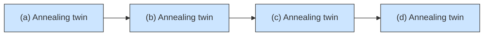

# Microstructure and mechanical properties of a Fe–30Mn–10Al–1.5C–xBe (x = 0, 0.5, 1.0, 1.5) Be low-density steels

Heyang Shi a , Guofeng Zhang a , Yihao Tang a , Wei Ma a,b , Pengfei Ji a,c , Xinyu Zhang a , Mingzhen Ma a , Riping Liu a,

a State Key Laboratory of Metastable Materials Science and Technology, Yanshan University, Qinhuangdao, 066004, China
b School of Materials, Sun Yat-Sen University, Shenzhen 518107, China
c Shandong Laboratory of Yantai Advanced Materials and Green Manufacture, Yantai 264006, PR China

# A R T I C L E I N F O

Keywords:

Be-bearing Fe–Mn–Al–C steel

Be− Fe phase

Low-density steel

Beryllium compound

Dual-phase steel

# A B S T R A C T

In the development of Fe–Mn–Al–C light steel, the density cannot be further reduced, and the specific strength is lower. In this paper, the microstructure and mechanical properties of Fe–30Mn–10Al–1.5C–xBe (x = 0, 0.5, 1.0, 1.5) cast and rolled at 1050 ◦C were systematically studied by alloying a lighter element beryllium (ρ =1.848 g/ cm3 ). Results show that the microstructure of the experimental steel changes from a single austenite to a dualphase steel of austenite and ferrite with the increase of Be content. The addition of Be causes the as-cast steel to form needle-like structure (Be-Fe phase), whereas the hot-rolled steel shows a spherical and dot-like structure. When the content of Be is 0.5%(wt%), the appearance of the spherical and dot-like structure after hot rolling improves the strength and ductility of the steel because of solid solution strengthening and grain refinement. However, the elongation of the steel decreases slightly with the increase of Be content. By contrast, the density of the experimental steel alloyed by Be is significantly reduced. The density of the new low-density steel is about approximately 6.25 g/cm3 because of the addition of 1.5 wt% Be, which is 19.87% lower than the commonly used steel grade (ρ = 7.82 g/cm3 ) and 3.8% lower than the Fe–Mn–Al–C steel (ρ = 6.50 g/cm3 ). In this experiment, the strength, hardness and elongation of the steel with (0.5–1.5 wt%) Be content are kept at a high level. This result has never occurred in the previous Fe–Mn–Al–C system steel.

# 1. Introduction

Based on the current situation of automobile research, the weight reduction of automobile bodies has been continuously studied, and it could be a development trend in the future [1,2]. Therefore, the weight reduction of steel has become an increasingly important topic in recent years. The Fe–Mn–Al–C steel has a higher specific strength and lower density, which has been widely concerned by academia and industry [3,4]. Austenitic low-density steels have good ductility, whereas their strengths are typically low. Relatively, ferrite low-density steels have higher strengths and moderate ductility. The precipitation of κ-carbides can effectively improve the strength of austenitic low-density steels [5,6]. However, coarsened κ-carbide will lead to a significant decline in the properties of the material. The formation of a compound after the addition of other elements may also lead to a series of changes in the properties of the material. The precipitation regulation of different compounds plays different important roles in the comprehensive properties of low-density steels [7,8]. Therefore, there are different opinions about the precipitation of compounds in low density steel.

Fe–Mn–Al–C low density steel has been developed for quite a long time [9,10]. Fe–Mn–Al–C lightweight alloys can be classified into four categories: (1) ferritic steels, (2) ferrite-based duplex steels, (3) austenite-based duplex steels and (4) austenitic steels [5]. Fe–Mn–Al–C alloys have a number of features that distinguish them from other ironbased alloys, thereby making their physical metallurgy complex and interesting. Since the 1980s, academic fields and research laboratories worldwide have been seriously researching and developing Fe-Mn-Al-C steels, and a number of relevant documents have been produced. Howell et al. [11] published an extensive review of age-hardening Fe–Mn–Al–C alloys in 2008. Kim et al. [12] compiled a concise review of Fe–Mn–Al–C steels for automotive applications in 2013. R. Rana et al. [13] and Rana [14] have published special issues on low-density steels in recent years. The potential of lightweight steels for automotive applications, military and other transportation industries [15] has been assessed. An overview of lightweight ferrous materials has also been given by some of the current authors [16]. Recently, the B2 intermetallic phase can be used to increase the strength of low-density steels [17]. High-entropy alloys have been applied to design multicomponent steels, including Fe–Mn–Al–C steels [18]. However, a complete review of the different aspects of low-density steels and their suitability for the automotive industry is lacking. Therefore, this review will be very suitable and important in this context. The density reduction of steel is always regulated by adding light alloying elements, such as aluminium, which is widely used in light steel because of its low density $( 2 . 7 ~ \mathrm { g } / \mathrm { c m } ^ { 3 } )$ . However, aluminium is a ferritic stable element with low solid solubility at room temperature, resulting in the formation of a large number of intermetallic compounds, such as Fe3Al (DO3 type) [19] and FeAl (B2 type) [20], affecting the plasticity of the alloy. In reducing the influence of intermetallic compounds formed by aluminium on the properties of the alloy, the austenitic stability elements Mn and C are added, both of which have positive effects on the density reduction of alloy steel. However, based on various experimental studies, the density of steel could not be stabilised below 6.40 $\mathrm { g } / \mathrm { c m } ^ { 3 } .$ . For a long time, in the development of weight reduction of light steel, a large amount of Al and C elements have been added to reduce the density of the material. However, these two elements cannot be added in large quantities, which is the bottleneck encountered by light steel. Therefore, we selected beryllium (1.848 g/cm3 ) as a new alloy element to reduce the density of alloy steel through alloying with Be [21–23]. Based on the reports, adding a small amount of Be in alloy elements would form a number of dendritic branches and a dendritic iron phase of the section point material. However, without adding Be to the organisation of the primary steel precipitation of similar compounds was not observed. Moreover, it is found that beryllium promotes the growth of some compounds, thus improving the strength of steel [24]. The addition of Be can also significantly improve the corrosion resistance, high-temperature oxidation and environmental brittleness of high‑carbon steels [25]. This low-density $( 6 . 2 – 6 . 4 ~ \mathrm { g } / \mathrm { c m } ^ { 3 } )$ alloy steel was designed to utilise the introduction of the multi-principal element method, that is, composite alloy and high entropy alloy.

This paper proposed a novel composite steel composed of five main elements; the attention of a large number of manganese austenitic phase to control the stability of aluminium and carbon is the original Fe–Mn–Al–C system, which primarily reduces the density of elements [26–28]. The austenitic stability of Mn and C ensures the ductility of the steel. Therefore, high Mn and C content is the key to maintain the high performance of Fe–Mn–Al–C austenitic low-density steel. In this study, we reduce the density of alloy steel by adding a certain amount of beryllium, and introduce a new element beryllium into Fe–Mn–Al–C alloy steel. It is reported that Be and Fe can form intermetallic compounds and special carbides with carbon. When the composition is properly prepared and treated, it can form a strong precipitation strengthening effect. As a new addition element in steel, beryllium has been reported that Be and Fe can form intermetallic compounds and special carbides with carbon. When the composition is properly prepared and treated, it can form a strong precipitation strengthening effect. As beryllium is a ferritic affinity element, it has a strong solid solution strengthening effect on ferrite. The properties can be improved by adding a certain mass fraction of Be and adjusting other components in invar alloys and constant elastic alloys. In addition, beryllium is mainly used in some special purpose steels and alloys in the atomic energy industry and military industry. However, the effect of beryllium on the microstructure and properties of high manganese carbon steel Fe–Mn–Al–C low-density steel is still unclear. There is little research on the effect of Be as an additive on the properties and structures of steel. Therefore, the effect of 0–1.5 wt% beryllium on the microstructure and mechanical properties of Fe–30Mn–10Al–1.5C low-density steel was systematically studied in this paper. In addition, the precipitation and evolution mechanism of precipitates in as cast and hot rolled beryllium containing steels are systematically discussed.

# 2. Experimental

The composition of the studied material was expressed as Fe–30Mn–10Al–1.5C–xBe (x = 0, 0.5, 1.0, 1.5; wt%). Based on the amount of Be added, the samples were labelled as 0Be, 0.5Be, 1.0Be and 1.5Be, respectively. The alloy composition is shown in Table 1. Alloys were made of high-purity elements, including Fe (99.99%), Mn (99.99%), Al (99.99%), C (99.99%) and Be (99.99%), and melted into alloy ingots. In a vacuum induction melting furnace, alloy ingots were prepared in a high-purity argon atmosphere. The obtained ingot has a diameter of 60 mm and a thickness of 30 mm. The plate has a thickness of 5 mm, which was equivalent to 83% of the total deformation and obtained by 17 times hot rolling with two high mill rolls at 1050 ◦C (1.5 mm per roll, strain rate of $0 . 6 \ { \mathsf { s } } ^ { - 1 } )$ . After each rolling pass, the sample was kept in a muffle furnace for 3 min to maintain the rolling temperature. After the last pass of rolling, water cooling was performed until cooled to room temperature.

Uniaxial tensile tests (ASTM: E8/E8M-16A) were conducted at room temperature using an Instron 5982 universal tester and dynamic extensometer (Instron 2620–601) to measure the strain at an initial strain rate of $5 \times 1 0 ^ { - 4 } \mathrm { m } { \bullet } \mathrm { s } ^ { - 1 }$ . The tensile test samples were obtained by using the electric discharge mechine and wire cutting from the sheet after rolling. Each experimental data was supported by more than three tensile specimens. The microhardness of the alloy structure was measured using FM-ARS9000 Vickers hardness. The hardness of the matrix was measured by the tap of 500 gf force. Each sample was tested by using $1 5 \times 5$ matrix, and the average value of 25 points was used as the microhardness value of the sample. Electron backscatter diffraction (EBSD, coupled with Hitachi S3400 SEM) was used to investigate the microstructure in the RD-ND (normal direction) plane after the samples were electropolished at $- 2 0 { } ^ { \circ } \mathrm { C }$ for 50–65 s at 20 V using an electrolyte consisting of perchloric acid (HClO4) and alcohol (C2H6O). Additionally, the ratio of alcohol to perchloric acid was 1:9. EBSD data were analysed by using TSL OIM analysis v8 software. Optical microscopy (OM, Axiovert 200 MAT), scanning electron microscopy (SEM, Hitachi S-3400) and transmission electron microscopy (TEM, JE-2100F, operating voltage of 200 kV) were used to observe the microstructure of the alloy. The TEM sample was thinned to 40 μm using waterproof sandpaper, and then electrochemical polishing with a dual jet was performed. Electrochemical polishing was performed in 10% perchloric acid with 90% ethanol solution at 26.5 V and $- 2 0 ^ { \circ } \mathrm { C }$ . The specimen for OM and SEM observation was cut by an electric spark. For OM and SEM sample tests, they were prepared according to standard metallographic surface preparation methods. Then, #400, #800, #1500, #2000, #3000 and #5000 waterproof sandpapers, followed by mechanical polishing using 0.5 μm diamond suspension, were used for metallographic and scanning electron microscopic testing. The microstructure was observed with an 8% nitrate alcohol solution, with a surface finish of 0.05 μm. The phase composition of the alloy was analysed using an X-ray diffractometer (XRD) equipped with a Cu Kα X-ray tube (D/MAX-2500/PC, ASTM: D5380–93[2014]). Before the test, the specimen was polished using #150–#800 waterproof sandpaper and ultrasonically cleaned with alcohol. In the 2θ range of 20◦ to 100◦, the scanning speed was 2◦ per min, and the XRD patterns were collected via continuous scanning. Differential scanning calorimetry (DSC) was used to determine the transformation temperature at a heating rate of 10 ◦C /min.

In this experiment, the density of alloy steel was reduced by adding

Table 1 Nominal compositions of the studied steel strips in this study (wt%).

<table><tr><td>Strip</td><td>Fe</td><td>Mn</td><td>Al</td><td>C</td><td>Be</td></tr><tr><td>0Be</td><td>Bal.</td><td>30</td><td>10</td><td>1.5</td><td>0</td></tr><tr><td>0.5Be</td><td>Bal.</td><td>30</td><td>10</td><td>1.5</td><td>0.5</td></tr><tr><td>1.0Be</td><td>Bal.</td><td>30</td><td>10</td><td>1.5</td><td>1.0</td></tr><tr><td>1.5Be</td><td>Bal.</td><td>30</td><td>10</td><td>1.5</td><td>1.5</td></tr></table>

Be and measured by Archimedes drainage. A high-precision balance was used to measure the weight of each sample (up to 0.01 g) and the final density of steel was calculated using the following formula.

In this study, Archimedes drainage was used to measure the density of experimental steel.

$$
V _ {0} = \frac {m _ {1} - m _ {2}}{\rho_ {\text {water}}}, \tag {1}
$$

where $V _ { 0 }$ refers to the volume of boiling water discharged from the experimental steel after it is completely immersed in water; $\rho$ denotes the density of deionised water $( \rho _ { w a t e r } = 1 \times 1 0 ^ { 3 } g / c m ^ { 3 } ) ;$ ; m1 refers to the beakers and water quality; and $m _ { 2 }$ represents the quality of the beaker, water and test steel after the test steel is completely submerged in water. The density can be defined as follows:

$$
\rho_ {0} = \frac {m _ {0}}{V _ {0}}. \tag {2}
$$

where the $m _ { 0 }$ refers to the quality of the experimental steel, and the $\rho _ { 0 }$ refers to the density of the experimental steel. For each sample, the average density was determined by three independently measured density values.

# 3. Experimental results

# 3.1. Microstructure and mechanical properties of as-cast states

Figure 1 shows the X-ray diffraction pattern of as-cast Fe–30Mn–10Al–1.5C–xBe steels. As shown in the figure, the phase composition in 0Be and 0.5Be steel is austenite (γ) + partial precipitates. In 1.0Be and 1.5Be steel, the phase composition becomes austenite $( \gamma ) +$ ferrite (δ) + partial precipitates. As shown in Fig. 1, with the increase of Be content, the X-ray contrast peak of 1.0Be and 1.5Be samples shows that the diffraction intensity of the ferrite phase (110) increased $( 2 0 =$ $4 4 . 6 7 ^ { \circ } )$ , which further indicated that the addition of Be promoted the formation of the ferrite phase. In the XRD of 0.5Be steel, the peaks of the $\mathrm { B e } _ { 1 1 } \mathrm { F e }$ and $\mathrm { B e } _ { 1 2 } \mathrm { F e }$ compound was observed, in which the atomic concentration ratio of Fe and Be atoms of 0.5Be steel was 18.7:1, whereas no other Be compounds were observed. In the XRD of 1.0Be and 1.5Be steel, the $\tt B e _ { 2 } F e$ and $\mathrm { B e } _ { 1 2 } \mathrm { F e }$ peaks appear around the B $_ { \mathrm { 1 1 } } \mathrm { F e }$ peaks, which also indicated that the addition of Be increases the concentration of Be atoms around Fe atoms, thereby increasing the probability of forming other compounds between Fe and Be. The Be–Fe phase (beryllium compound) in the as-cast microstructure is randomly distributed and ferrite is evenly distributed in the austenite matrix (Fig. 2).

Fig. 1. X-ray diffraction patterns of as-cast Fe–30Mn–10Al–1.5C–xBe steels.

Ferrite was observed in as-cast alloy steels with higher Be content. In the alloy steel of 0Be, no reticular or Chinese character compounds were observed in the metallographic photographs. Rod-like, needle-like and text shape compounds are observed in the as-cast microstructure because of the addition of beryllium.

As-cast Fe–Mn–Al–C system steel without heat treatment and thermal deformation cannot obtain a uniform microstructure. As shown in Fig. 2(a), the microstructure of steel without beryllium is completely austenitic. Fig. 2(b) shows the addition of 0.5Be content. Black point compounds begin to appear and attach to the austenite matrix. This result may be due to compounds produced after alloying of beryllium. The results show that when the content of Be in steel reaches a certain level (>0.5 wt%), a compound similar to the ancient Chinese character shape will appear in the matrix, which is known as Be–Fe phase compound [21]. As shown in Fig. 2(c, d), evident Be–Fe phase compounds were observed in the microstructure of alloy steel, and a large amount of ferrite appears in the austenite matrix. This result is consistent with the XRD results shown in Fig. 1.

Figure 3 shows the TEM morphology of as-cast 0.5Be steels, and Fig. 3(a) shows the morphology of Be12Fe, in which the size of precipitates is 5–10 μm. Fig. 3(b, c) shows locally enlarged images, whereas Fig. 3(d, e) shows diffraction spots under locally mages and different crystal band axes corresponding to the $\mathrm { B e } _ { 1 2 } \mathrm { F e }$ compound [23]. Fig. 4 shows the different morphologies of Be $_ \mathrm { 1 2 } \mathrm { F e . }$ . Its size is large, and most of them are polymerised to form a large needle peak structure. Additionally, selective diffraction was performed on the 1.5Be matrix, and the diffraction spot of AlFe3 was observed.

The microhardness of the as-cast steels was measured by FM-ARS9000 Vickers hardness. The results are shown in Table 2 and Fig. 5. The hardness of the matrix increases with the gradual increase of beryllium content. As shown in Table 2, the hardness of austenite increases with the increase of Be content. The hardness of ferrite observed in 1.0Be and 1.5Be steels also increase with the increase of Be content. 0Be and 0.5Be steels are all austenitic structures without ferrite hardness values. Given the objective problem of the hardness tester, the metallographic hardness of the Be–Fe phase cannot be tested in the 0.5Be steel; thus, the Be–Fe phase cannot be obtained.

# 3.2. Microstructure and mechanical properties of rolling states

The effect of beryllium content on phase transition temperature was determined with the Differential Scanning Calorimeter (DSC), the results are shown in Fig. 6. The temperature of steel without beryllium phase transformation was $1 2 7 8 . 8 \ ^ { \circ } \mathrm { C } .$ . After adding Be, the phase transformation points of alloy steel changed remarkably, and its temperature point decreased by approximately $1 2 0 ~ ^ { \circ } \mathrm { C } .$ . The phase transition temperature of alloy steel began to change with the addition of different beryllium contents. When the Be content was 0.5 wt%, the phase transformation temperature point evidently decreased. With the increase of Be content to 1.0 wt%, the phase transition temperature slightly decreased by approximately ${ \mathrm { ~ \bf ~ 1 ~ } } ^ { \mathrm { ~ \tiny ~ \circ ~ } } { \mathrm { C } } .$ . When the Be content increased to 1.5 wt%, the phase transition temperature decreased by $5 ^ { \circ } \mathrm { C }$ .

Figure 7 shows the X-ray diffraction pattern of rolled alloy steel at 1050 $^ \circ \mathbf { C } .$ . With the addition of Be content, the peaks of the precipitates increase gradually. The microstructure of 0Be steel is austenite and carbide, whereas $\mathrm { B e } _ { 1 1 } \mathrm { F e }$ appears in the microstructure of 0.5Be steel. With the addition of a Be content, Be Fe and Be Fe compounds appeared in 1.0Be steel. The peaks of $\mathrm { B e } _ { 1 1 } \mathrm { F e } ,$ B ${ \mathrm { : } } _ { 1 2 } { \mathrm { F e } } ,$ Be2Fe and Be2C in the 1.5Be steel appear in the XRD pattern of the steels.

Figure 8 shows the OM morphology of the rolled microstructure, where RD is rolling direction. These needle-like compounds, which were due to the addition of beryllium in the as-cast microstructure, still exist after thermal deformation and heat treatment, but the distribution trend and size were changed. Moreover, in the rolled microstructure, some annealing twins were observed.

text_image

(a)
γ
50 µm

text_image

(b)
Beryllium compound
50 µm

text_image

(c)
Beryllium compound

γ
50 µm

text_image

(d)
Beryllium compound
δ
50 µm

Fig. 2. OM of as-cast Fe–30Mn–10Al–1.5C–xBe low-density steel strips: (a) 0Be, (b) 0.5Be, (c) 1.0Be and (d) 1.5Be.

natural_image

Microscopic image of a material surface with labeled regions A and B, scale bar 5 μm (no text or symbols beyond labels)

text_image

(b)
SADP
A
1 µm

text_image

(d)
25̅1̅ 152
Be12Fe 301
[1̅13]

text_image

(c)
B
SADP
1 µm

text_image

(e) Be12Fe
101 202
101
[001]

Fig. 3. Bright-field TEM morphology of as-cast Fe–30Mn–10Al–1.5C–0.5Be low-density steel: (a − c) morphology, (b) enlarged view of area A, (c) enlarged view of area B and (d, e) selected area diffraction patterns of $\mathrm { B e _ { 1 2 } F e . }$

The SEM morphology and EDS of Fe–30Mn–10Al–1.5C–1.5Be are shown in Fig. 9. The EDS observation of the area shows that the inner strip-shaped structure is Mn-rich and Al-rich area, and the outer stripshaped structure is Mn-rich and Al-poor area. Therefore, the elongated structure is the ferrite structure of 1.5Be steel, and the austenitic structure is around the elongated structure.

Figure 10(a, b) shows the engineering stress− strain curve and work hardening curve of rolled Fe–30Mn–10Al–1.5C–xBe steel respectively. Table 3 shows the detailed values of tensile properties in this experiment. With the increase of Be content, the yield strength initially increases, then decreases and finally increases, while the tensile strength presents the opposite trend, initially decreases and finally increases.

Fig. 4. Bright-field TEM morphology of as-cast Fe–30Mn–10Al–1.5C–1.5Be low density steel: (a, b) different morphologies of Be12Fe and (c, d) morphology and diffraction spots of AlFe3.
Table 2 Microhardness of Fe–30Mn–10Al–1.5C–xBe low-density as-cast steels.

<table><tr><td>Samples</td><td>Matrix (Austenite) hardness (HV)</td><td>Error</td><td>Ferrite hardness (HV)</td><td>Error</td><td>Be-Fe phase hardness (HV)</td><td>Error</td></tr><tr><td>0Be</td><td>453.31</td><td>±11.34</td><td>-</td><td>-</td><td>-</td><td></td></tr><tr><td>0.5Be</td><td>462.88</td><td>±13.84</td><td>-</td><td>-</td><td>-</td><td></td></tr><tr><td>1.0Be</td><td>475.80</td><td>±13.75</td><td>437.40</td><td>±15.72</td><td>483.50</td><td>±16.65</td></tr><tr><td>1.5Be</td><td>479.74</td><td>±11.99</td><td>452.54</td><td>±12.33</td><td>477.16</td><td>±14.14</td></tr></table>

bar

| Material | 0Be | 0.5Be | 1.0Be | 1.5Be |
| :--- | :--- | :--- | :--- | :--- |
| Austenite | 453.31 | 462.88 | 475.80 | 479.74 |
| Ferrite | - | - | 437.40 | 452.54 |

Fig. 5. Microhardness of as-cast austenite of experimental steels.

Comparing 0Be steel and 0.5Be steel. The small amount of the Be–Fe phase is conducive to the plasticity of the alloy. The elongation of 0.5Be alloy steel is 40.47%. When the content of Be exceeds 0.5%, the ductility of the steel decreases. The addition of beryllium reduced the tensile strength of steel, but the total elongation of steel with the addition of 0.5Be and 1.0Be increased significantly. Each sample shall be subject to more than three tensile tests. To ensure the accuracy of experimental data. Fig. 10(b) shows the work hardening rate curve. The addition of beryllium initially reduces the strain-hardening rate in the steady-state hardening stage. With the increase of beryllium content, the strainhardening rate gradually increases.

The microhardness of the as-rolled steels was measured by FM-ARS9000 Vickers hardness. The results are shown in Table 4 and Fig. 11. The austenite hardness of rolled 0Be and 0.5Be is 415.55 and 470.97 HV, respectively. The austenite hardness of rolled 1.0Be steel and 1.5Be steel are 398.39 and 407.01 HV, respectively, and the ferrite hardness is 349.81 and 371.50 HV respectively.

Figure 12 shows the SEM tensile fracture morphology photographs of the rolled Fe–30Mn–10Al–1.5C–xBe steels. Fig. 12(a) shows the fracture

morphology of the 0Be steel. The area $\mathsf { A } _ { 1 }$ on the upper right of Fig. 12(a) is an enlarged view of this figure. Based on the enlarged view of area $\mathbf { A } _ { 1 } ,$ , spherical inclusions are more evident in the dimples in the ductile fibre area. Additionally, the distribution of dissociation planes and river patterns can be observed in the macro fracture area $\mathbf { A } _ { 2 } .$ . Fig. 12(b − d) shows a partially enlarged view of their respective upper right areas $\mathbf { B } _ { 1 } ,$ $\mathrm { C _ { 1 } }$ and $\mathbf { D } _ { 1 } .$ . As shown in Fig. 12(b − d), the dissociation surface at the fracture of 1.0Be and 1.5Be steels gradually increases, and the cleavage platform appears in Fig. 12(c − d). Under the action of external force, a large number of dislocation slip movements and accumulation occur inside the steel.

Figure 13(a − d) display the electron backscatter diffraction (EBSD) observation of the microstructure in Fe–30Mn–10Al–1.5C–xBe steel. Fig. 13(a , b , c and ${ \bf d } _ { 1 } )$ show the IQ map of 0Be, 0.5Be, 1.0Be and 1.5Be, respectively, where the blue lines indicate large-angle grain boundary (>15◦); the green line indicates small angle grain boundary (5◦ − 15◦). The red line indicates the grain boundary of a small Angle $( 1 ^ { \circ } - 5 ^ { \circ } )$ . Additionally, the KAM figure shows that the stress concentration effect is evident at the precipitation location of the carbide and the Be–Fe phase, and the distribution of these precipitates is primarily concentrated at the grain boundary and phase interface. The content of Be increases from austenite to ferrite and austenite, and more Be–Fe phase appear in the interior of the austenite. More Be–Fe phase also appear in 1.5 Be steel and ferrite in the organisation. Notably, as shown in Fig. $\begin{array} { r } { 1 3 ( \mathbf { c } _ { 3 } , \mathbf { d } _ { 3 } ) , } \end{array}$ , the stress concentration phenomenon shows a relatively uniform distribution. The phase diagram distribution of 0Be, 0.5Be, 1.0Be and 1.5Be steel is shown in Fig. 13(a , b , c and d ). The ferrite content in the matrix gradually increases with the gradual increase of Be content, wherein the red area indicates ferrite, and the green area indicates austenite.

Figure 14 shows the grain size distribution of the rolled alloy steel. As shown in Fig. 14(a), the grain size of 0Be is approximately 55% in the range of 12–18 μm. Fig. 14(b) shows that the grain size of 0.5Be is relatively large, and the grain size >20 μm accounts for >75%. Fig. 14(c, d) shows that the grain sizes of 1.0Be and 1.5Be steel is around 11 and 13 μm, respectively.

Figure 15 shows the matrix morphology, precipitates and diffraction spots of Fe–30Mn–10Al–1.5C–xBe steels observed under transmission electron microscope. Fig. 15(a ), (a ), (a ) and $\mathbf { \Pi } ( \mathbf { a } _ { 4 } )$ show the matrix morphology diagram of 0Be, 0.5Be, 1.0Be and 1.5Be steel, respectively. Based on the selected aperture diffraction in Fig. $1 5 ( \mathbf { a } _ { 2 } ) , ( \mathbf { b } _ { 2 } )$ and $( { \mathsf { d } } _ { 2 } ) ,$ , the matrix is primarily austenite. The precipitates in Fig. $1 5 ( { \bf a } _ { 3 } ) , ( { \bf b } _ { 3 } ) ;$ , (c ) and $\left( \mathsf { d } _ { 3 } \right)$ are carbides with different Be contents. It can be seen from the diffraction of the selective aperture in Fig. $1 5 ( \mathrm { b } _ { 4 } ) , ( \mathrm { c } _ { 4 } )$ and (d ) that in 0.5Be, 1.0Be and 1.5Be steel, the size of Be2C gradually increases with the increase of Be content. The precipitates are calibrated by selected area diffraction, and the precipitates in 0Be steel are κ-carbides. At 0.5Be, 1.0Be and 1.5Be steel, Be2C compounds were observed by electron diffraction in selected areas.

line

| Temperature (°C) | Peak Label     | DSC (mW/mg) |
| ---------------- | -------------- | ----------- |
| ~1154.8          | Peak           | Peak        |
| ~1163.3          | Peak           | Peak        |
| ~1165.9          | Peak           | Peak        |
| ~1320            | Peak           | Peak        |

Fig. 6. DSC curves of Fe–30Mn–10Al–1.5C–xBe alloy: heating curves after homogenisation.

line

| Diffraction angle 2θ (degree) | 0Be Intensity (a.u.) | 0.5Be Intensity (a.u.) | 1.0Be Intensity (a.u.) | 1.5Be Intensity (a.u.) |
| ----------------------------- | -------------------- | ---------------------- | ---------------------- | ---------------------- |
| ~42                           | Peak (111)            | -                      | -                      | Peak (110)             |
| ~48                           | Peak (200)            | -                      | -                      | Peak (200)             |
| ~63                           | -                      | -                      | -                      | -                      |
| ~72                           | Peak (220)            | -                      | -                      | Peak (220)             |
| ~80                           | -                      | -                      | -                      | -                      |
| ~85                           | -                      | Peak (303)              | -                      | -                      |
| ~90                           | -                      | -                      | -                      | -                      |
| ~95                           | -                      | -                      | -                      | -                      |

Fig. 7. X-ray diffraction patterns of Fe–30Mn–10Al–1.5C–xBe strips after rolling at 1050 ◦C.

# 4. Discussion

# 4.1. Effect of Be on the mechanical property

# 4.1.1. As-cast steel strips

Alloying different elements, the strength and hardness of low-density steel can be effectively improved [29]. In this work, the austenite hardness in as-cast steel gradually increased after adding Be (Table 2 and Fig. 5). Considering that 1.0Be and 1.5Be steel is ferrite and austenite dual-phase steels, the ferrite hardness also increased. However, comparing steel without Be and with that containing Be, the matrix of 0Be and 0.5Be steel is austenite, and increase in hardness is partly due to the formation of compounds from beryllium. Although the content of compounds increased significantly, the increase in hardness value was relatively small because the 0Be and 0.5Be steel tissues are austenitic, whereas the 1.0Be and 1.5Be tissues are ferritic and austenitic. Moreover, the hardness of ferrite is lower than that of austenite.

# 4.1.2. As-rolled steel strips

After hot rolling at 1050 ◦C, the yield strength of 0.5Be steel is higher than that of 0Be steel. This result is due to solution strengthening caused by Be content, which is consistent with the yield strength of 1.0Be and 1.5Be steel. Regarding the mechanical properties of 1.0Be and 1.5Be steel shown in Table 4 and Fig. 10, these two steels are dual-phase steels. Ferrite gradually appears around austenite with the increase of Be content because the deformation ability of ferrite (BCC) is weaker than that of austenite (FCC), thereby decreasing the plasticity of the material. As shown in the X-ray diffraction pattern, the peak value of Be2C exists in each steel containing Be [30,31]. Therefore, the combination of Be and C into carbides is preferred. Precipitates were observed at the grain boundary of the matrix and some of the matrix. Carbides was observed under TEM, which was attributed to the higher content of Al, C and Be in experimental steels. They increased the precipitation kinetics of carbides and promoted the precipitation of carbides and beryllium compounds whilst decreasing the strain energy of the steels, thereby improving the tensile strength of the steels $[ 3 2 , 3 3 ]$ . Regarding the hardness of the steel strips, 0Be and 0.5Be steel is austenitic steel. 1.0Be and 1.5Be steel is dual-phase steel with austenite $\ r ( \gamma ) + \mathrm { f e r r i t e } \left( \delta \right)$ . In all austenitic steels, the hardness of the material increases significantly with the increase of Be content. This increase in hardness increase is partly due to the alloying of Be. In austenitic (γ) + ferritic (δ) steel, its change trend is consistent with that of austenitic steels. However, the average hardness value of the matrix is low, because of the high ferrite content, but the hardness value of 1.5Be steel is 9 HV higher than that of 1.0Be steel, and the hardness value of 1.5Be steel is slightly higher than that of 1.0Be steel. On the one hand, the contribution of hardness is due to the solid solution strengthening of Be. On the other hand, it is attributed to the precipitation of the Be–Fe phase. Considering that the size of the Be–Fe phase in rolled 1.0Be and 1.5Be steel is small and the distribution state is dispersed, the austenite and Be–Fe phase exist at the test point during the measurement of austenite hardness value, which will lead to a high hardness value. This effect will lead to the precipitation of some excess Be elements in the ferrite matrix, which slightly improves the hardness value of the material. The internal dislocation (as shown by the white

text_image

(a)
Annealing twin
RD
γ-Fe
50 µm

text_image

(b)
Annealing twin
γ-Fe
Be-Fe phase
RD
50 µm

text_image

(c)
Annealing twin
Be-Fe phase
α-Fe
RD
γ-Fe
50 µm

text_image

(d)
α-Fe
γ-Fe
Annealing twin
Be-Fe phase
RD
50 µm

Fig. 8. OM morphology of Fe–30Mn–10Al–1.5C–xBe low density steels strips after rolling at 1050 ◦C: (a) 0Be, (b) 0.5Be, (c) 1.0Be and (d) 1.5Be.

text_image

(a)
1 µm
(b)
Fe
(c)
Mn
1 µm
(d)
C
(e)
Al
1 µm
1 µm
1 µm

Fig. 9. SEM morphology of Fe–30Mn–10Al–1.5C–1.5Be low density steel strips after rolling at 1050 ◦C. (a) The junction of austenite and ferrite. (b − e) Element distribution of Fe, Mn, C and Al.

arrow) of hot-rolled steel with different Be contents is shown in Fig. 16. With the increase of Be content in steel, the dislocations shown by TEM bright field images also increase gradually. This is consistent with the KAM chart of EBSD statistics. The addition of Be content increases the dislocation density, which strengthens the steel.

Based on fracture behaviour of rolled steel, the fracture surface of steel with low beryllium content is ductile, and the fracture morphology of 1.0Be and 1.5Be steel is a plastic-brittle fracture (Fracture primarily occurs in the mixed mode of ductile dimple and cleavage, and more dissociation platforms appeared with the increase of beryllium content).

line

| Engineering Strain (%) | 0Be   | 0.5Be | 1.0Be | 1.5Be |
| ---------------------- | ----- | ----- | ----- | ----- |
| 0                      | 0     | 0     | 0     | 0     |
| 10                     | ~1100 | ~1080 | ~950  | ~1150 |
| 20                     | ~1200 | ~1100 | ~1050 | ~1200 |
| 30                     | ~1220 | ~1120 | ~1080 | ~1220 |
| 40                     | ~1220 | ~1120 | ~1080 | ~1220 |

line

| True Strain (%) | 0Be   | 0.5Be | 1.0Be | 1.5Be |
| --------------- | ----- | ----- | ----- | ----- |
| 0               | 5.0   | 5.0   | 5.0   | 5.0   |
| 5               | 2.5   | 2.0   | 2.2   | 2.4   |
| 10              | 2.0   | 1.8   | 2.0   | 2.1   |
| 15              | 1.9   | 1.7   | 1.9   | 1.9   |
| 20              | 1.8   | 1.6   | 1.8   | 1.8   |
| 25              | 1.7   | 1.5   | 1.7   | 1.7   |
| 30              | 1.6   | 1.4   | 1.6   | 1.6   |
| 35              | 1.5   | 1.3   | 1.5   | 1.5   |

Fig. 10. Tensile property of Fe–30Mn–10Al–1.5C–xBe steel rolled at 1050 ◦C: (a) engineering stress strain curves and (b) true stress and strain hardness rate.

Table 3 Tensile experiment of rolling (1050 ◦C) Fe–30Mn–10Al–1.5C–xBe steels.

<table><tr><td rowspan="2">Samples</td><td colspan="5">Rolling states</td></tr><tr><td> $\rho (g/cm^3)$ </td><td>Error</td><td>YS (MPa)</td><td>UST (MPa)</td><td>TE (%)</td></tr><tr><td>0Be</td><td>6.54</td><td>±0.03</td><td>989.51</td><td>1222.27</td><td>22.91</td></tr><tr><td>0.5Be</td><td>6.47</td><td>±0.02</td><td>1011.54</td><td>1130.18</td><td>40.47</td></tr><tr><td>1.0Be</td><td>6.36</td><td>±0.04</td><td>820.57</td><td>1074.33</td><td>30.71</td></tr><tr><td>1.5Be</td><td>6.29</td><td>±0.05</td><td>941.87</td><td>1201.58</td><td>18.33</td></tr></table>

Table 4 Microhardness of Fe–30Mn–10Al–1.5C–xBe low-density as-rolled steels.

<table><tr><td>Samples</td><td>Matrix (austenite) hardness (HV)</td><td>Error</td><td>Ferrite hardness (HV)</td><td>Error</td></tr><tr><td>0Be</td><td>415.55</td><td>±12.481</td><td>-</td><td>-</td></tr><tr><td>0.5Be</td><td>470.97</td><td>±20.241</td><td>-</td><td>-</td></tr><tr><td>1.0Be</td><td>398.39</td><td>±14.630</td><td>349.81</td><td>±21.267</td></tr><tr><td>1.5Be</td><td>407.01</td><td>±17.551</td><td>371.50</td><td>±23.002</td></tr></table>

bar

| BE Level | Matrix (Austenite) Hardness (HV) |
| :--- | :--- |
| 0Be | 415.55 |
| 0.5Be | 470.97 |
| 1.0Be | 398.39 |
| 1.5Be | 407.01 |

Fig. 11. Microhardness of Fe–30Mn–10Al–1.5C–xBe rolling structure of the steel.

With the increase of Be content, dimples continue to decrease, and the morphology increases and gradually changes to cleavage-like facets. The dimple area also deepens and cleavage steps occur in the 1.5Be steel, thereby decreasing the material plasticity index. The dimples in the fracture surface are due to the interface difference between the secondphase carbide particles, and the matrix is due to the difference in elastic− plastic or low− binding force. These particles are also separated to form micropores. Micropores are formed in a highly deformed area. The formation of micropores grows continuously during deformation, which results in the surrounding formation of micropores. Additionally, spherical precipitates of approximately 2 μm were observed at the bottom of the dimples of steel with high Be content, whereas the mechanical properties of the spherical precipitation phase located in the dimple were completely different from those of the matrix. Therefore, during plastic deformation, the stress concentrates at the boundary of the precipitation phase, which leads to cracking along the spherical precipitation phase boundary and the formation of the core of the microporous crack. As the beryllium content increases, the spherical precipitates at these dimples increase in size. Moreover, the Be–Fe phase gradually changed from continuous distribution to dispersion distribution. However, during 1.0Be and 1.5Be steel (dual-phase steels) quasi-dissociation, cracks initially occur and rapidly expand inside the grains of the brittle ferrite phase, and they are immediately hindered when they expand to the adjacent austenite region with better plasticity. Furthermore, the load (failure energy) applied by the outer boundary to the unit area exceeds the bearing capacity of the sample, that is, the maximum value that the steel can absorb. Austenite is destroyed after large plastic deformation. By contrast, the Be–Fe phase has a great effect on ductile steel because of its small size. The existence of this compound greatly affects the crack arrest toughness of steels, accelerates crack propagation, and leads to the reduction of the plasticity of the material.

Fig. 12. SEM tensile fracture morphology of (a) 0Be, (b) 0.5Be, (c) 1.0Be and (d) 1.5Be steels.

text_image

(a)
100 µm
(b₁)
100 µm
(a₂)
100 µm
(b₂)
100 µm
(a₃)
100 µm
(b₃)
100 µm
(a₄)
100 µm
(b₄)
100 µm
RD
Color Coded Map Type Kernel Average Misorientation
Austenite
Min Max Fraction Fraction Partition
111
0.93 0.93
0.1 10.1
Phase Austenite
Ferrite
(c₁)
60 µm
(d₁)
60 µm
(c₂)
60 µm
(d₂)
60 µm
(c₃)
60 µm
(d₃)
60 µm
(c₄)
60 µm
(d₄)
60 µm
Austenite
Min Max Fraction Fraction Partition
111
0.93 0.999
0.1 10.1
Ferrite
111
0.93 0.999
0.1 10.1
Phase Austenite
Ferrite

Fig. 13. Initial EBSD map of low-density steel which rolled at 1050 ◦C. (a1), (b1), (c1) and (d1) shows the 0Be, 0.5Be, 1.0Be and 1.5Be of the IQ map; (a2), (b2), (c2) and (d ) shows the 0Be, 0.5Be, 1.0Be and 1.5Be of the IPF map; (a ), (b ), (c ) and $\left( \mathsf { d } _ { 3 } \right)$ shows the 0Be, 0.5Be, 1.0Be and 1.5Be of the KAM map; (a ), (b ), (c ) and (d4) shows the 0Be, 0.5Be, 1.0Be and 1.5Be of the Phase map.

# 4.2. Effect of Be on microstructure

# 4.2.1. As-cast steel strips

The OM micrograph of as-cast steels is shown in Fig. 2. Beryllium precipitates in the shape of ancient Chinese characters appear at the boundary between austenite and ferrite. These precipitates are widely distributed and cross vertically and horizontally like characters. However, notably, the addition of beryllium causes the occurrence of a large number of spherical, rod-like or needle-like compounds in the microstructure, thereby destroying properties of the material. Studies have shown that the formation of the Be–Fe phase is observed when the mass percentage of Be to Fe reaches 1:4 in a certain region. With the increase of Be content, the probability of binding with Fe atoms increases to a certain extent, which leads to the formation of the Be–Fe phase segregation to a certain extent. In the phase diagram of Fe − Be binary alloy, almost no solid solubility in the austenite region at room temperature and no solid solubility in ferrite are found. This finding is theoretically consistent with the distribution state of beryllium in the as-cast structure (Fig. 2) and the Chinese character-like structure observed after slow cooling. In 1.0Be and 1.5Be steel, the ferrite content in the as-cast microstructure decreases compared with that in alloy steel with 1.5Be (wt%) and 1.0Be (wt%) because the increase of beryllium content leads to the increase of the Be–Fe phase in the microstructure. The increase of the Be–Fe phase encroaches on the position of the austenite matrix, making the original position of austenite occupied by the Be–Fe phase and resulting in the decrease of austenite content. Furthermore, ferrite content decreased; thus, the ferrite grain size of 1.5Be content is evidently smaller than that of 1.0 (wt%) Be content. The TEM micrograph of as-cast 0.5Be steel is shown in Fig. 3. The diffraction pattern of $\mathrm { B e } _ { 1 2 } \mathrm { F e }$ appears in the SADP taken from the precipitate along the axis of the [− 113] and [001] regions. Additionally, the TEM micrograph of the 1.5Be steel is shown in Fig. 4, and large $\mathrm { B e } _ { 1 2 } \mathrm { F e }$ precipitates intersect horizontally and vertically.

# 4.2.2. As-rolled steel strips

The microstructural and morphological changes in as-rolled steels are shown in Fig. 8− 9. and Fig. 12− 14. The number of beryllium compounds precipitated in the collective is increasing, and the distribution is more dispersed. In the full austenitic structure, that is, the steel structure of 0Be and 0.5Be, the grain size increases after the addition of

bar

(a)
| Diameter (μm) | Area Fraction (%) |
|---|---|
| 0 | 0.05 |
| 3 | 0.05 |
| 6 | 0.078 |
| 9 | 0.102 |
| 12 | 0.159 |
| 15 | 0.229 |
| 18 | 0.133 |
| 21 | 0.096 |
| 24 | 0.078 |
| 27 | 0.018 |
| 30 | 0.008 |
| 33 | 0.000 |

bar

| Diameter (μm) | Area Fraction (%) |
|---|---|
| 0 | 0.018 |
| 5 | 0.060 |
| 10 | 0.098 |
| 15 | 0.072 |
| 20 | 0.130 |
| 25 | 0.131 |
| 30 | 0.099 |
| 35 | 0.131 |
| 40 | 0.143 |
| 45 | 0.122 |
(b)

bar

(c)
| Diameter (μm) | Area Fraction (%) |
|---|---|
| 0 | 0.00 |
| 2 | 0.025 |
| 4 | 0.09 |
| 6 | 0.105 |
| 8 | 0.135 |
| 10 | 0.24 |
| 12 | 0.11 |
| 14 | 0.105 |
| 16 | 0.102 |
| 18 | 0.085 |
| 20 | 0.07 |
The chart displays the area fraction (%) of a material across different diameters (μm). The legend indicates the red bars represent 'Diameter'.

bar

(d)
| Diameter (μm) | Area Fraction (%) |
|---|---|
| 0 | 0.075 |
| 5 | 0.15 |
| 10 | 0.185 |
| 15 | 0.315 |
| 20 | 0.07 |
| 25 | 0.125 |

Fig. 14. Statistics of the grain size of Fe–30Mn–10Al–1.5C–xBe steels by EBSD analysis: (a) 0Be, (b) 0.5Be, (c) 1.0Be and (d) 1.5Be steels.

Be. With the further increase of Be content, the appearance of ferrite in 1.0Be and 1.5Be steel leads to a decrease in overall grain size because they are dual-phase steels. Part of the as-cast needle-like Be–Fe microstructure disappeared, and it is distributed uniformly on the surface of the matrix along the rolling direction, primarily on the austenite matrix. Ferrite was observed in steels with higher beryllium content. All ferrite is located in the centre of austenite grains, which indicates that ferrite initially nucleates and then grows from the melt during nearrapid solidification. In the as-cast state, the ancient Chinese character shape compound is considered the Be–Fe phase, as proven by Y. Mang et al. [21]. In this experiment, different compounds were observed in the as-cast structure and rolled structure. In the microstructure of the as-cast and rolled samples, the shape of the Be–Fe phase is almost completely different, which can be clearly distinguished from the OM diagram. After hot deformation, the needle-like compounds decreased evidently, whereas the punctate compounds increased. Moreover, the distribution of compounds changed from aggregate distribution to dispersion distribution. This result may be due to the difference in the cooling rate between the slow cooling of the as-cast sample and rapid cooling of the as-rolled water cooling, resulting in the evident compound difference of the sample. Additionally, the rolling process changed the morphology of the compound [34]. Moreover, as shown in Fig. $1 7 ( \mathbf { b } - \mathbf { d } )$ , when the remaining beryllium cannot be dissolved in austenite, the excess beryllium will precipitate on ferrite in the form of spot-like compounds.

Al and Be are elements in the extended ferrite phase region; therefore, the addition of Al and Be causes the austenite region to shrink. However, the solute atom will cause lattice distortion after entering the solvent lattice because of the difference in atomic radiue. Therefore, the solvent atom adjacent to the solute atom will deviate from its equilibrium position. Table 5 shows the atomic size of each element involved in this experiment and the type of solid solution formed.

# 4.3. Influence of lattice distortion and solid solution type on material density

Given the atomic size factor, the solid solution type of solute atoms is calculated based on the following formula.

$$
\Delta r = \left| \frac {r _ {A} - r _ {B}}{r _ {A}} \right|, \tag {3}
$$

where $r _ { A }$ refers to the atomic radius of the solvent atom, r refers to the atomic radius of the solute atom, and Δr is the relative atomic size of two elements. $r _ { A }$ and $r _ { B }$ are confirmed on the periodic table. When the atomic radius of iron and other solute elements is <8%, and the crystal structure of iron and other solute elements is the same, an infinite solid solution can be formed. Based on the above-mentioned formula, beryllium is not infinite in an iron matrix solid solution. Therefore, the amount of beryllium is a key point in this paper [35]. Given the rich iron compounds in the as-cast organisation of state-phase crystallisation and precipitation amount control, during solidification, the austenite-phase nucleation increases at the beginning of the eutectic reaction. Additionally, the interference increases, and the concentration of Fe and Be eutectic field, increases with the increase of Be concentration. The size of the compounds also gradually increases, whereas the atomic concentration ratio of Fe to Be gradually decreases. Furthermore, the atomic concentration ratio of other elements gradually decreases, which indicates that the bonding degree between Be element and atoms in the alloy can be greatly improved.

Fig. 15. Bright-field TEM images of Fe–30Mn–10Al–1.5C–xBe steel after rolling: (a ), (b ), (c ) and $( \mathsf { d } _ { 1 } )$ show the structures of 0Be, 0.5Be, 1.0Be and 1.5Be steel, respectively; (a2), (b2) and (d2) show the selected austenite diffraction spots of 0Be, 0.5Be and 1.5Be steels, respectively; (a3), (b3), (c3) and (d3) show the microstructure of carbide in 0Be, 0.5Be, 1.0Be and 1.5Be steel, respectively; and $( \mathsf { a } _ { 4 } ) , ( \mathsf { b } _ { 4 } ) , ( \mathsf { c } _ { 4 } )$ and $\mathrm { ( d _ { 4 } ) }$ show the selected carbide diffraction spots of 0Be, 0.5Be, 1.0Be and 1.5Be steel, respectively.

natural_image

Microscopic grayscale image showing a textured surface with two white arrows pointing to a specific feature, scale bar indicates 2 μm (no text or symbols present)

natural_image

Microscopic view of a material's microstructure showing grain boundaries and defects, with 2 μm scale bar (no text or symbols beyond labels)

natural_image

Microscopic view of a mineral or rock sample with visible grain boundaries and two white arrows indicating features, scale bar labeled 2 μm (no text beyond label)

Fig. 16. Bright-field TEM images of Fe–30Mn–10Al–1.5C–xBe steel after rolling: (a), (b) and (c) structures of 0.5Be, 1.0Be and 1.5Be steel.

The atomic radius of Be atom is smaller than that of the Fe atom; thus, lattice distortion will occur when the replacement solid solutiosn is formed. At the original position where the Fe atom is replaced by Be, the

lattice distortion (Fig. 18) causes the surrounding solvent atom (Fe atom) to move closer to the solute atom (Be atom). The atomic radius of the Al atom is larger than that of the Fe atom; therefore, the lattice distortion is different from that of the Be atom, and the Al atom will crowd out the surrounding the Fe atoms. Consequently, the formation of such a state will increase energy. When the atomic radius difference between each element is greater, the lattice distortion energy will be higher and the lattice will be more unstable. Therefore, when the alloy is added, more solute atoms are integrated, the higher the lattice distortion energy per unit volume, and lattice instability occurs, resulting in the inability of the solute lattice to maintain a steady state, which reaches the solubility limit of the solid solution. Therefore, if we continue to increase the content of Be, a new phase will be formed around the solid solution. The new phase is known as the Be–Fe phase or Be compound. Additionally, Be enters into the solvent element as a solid solution, forming a replacement solid solution and resulting in the distortion behaviour of lattice shrinkage. This will lead to the position change of some C atoms caused by lattice distortion, which will be excluded from the gap position of the lattice. Consequently, they cannot exist in the form of solid solution in the matrix but in the form of precipitate carbides on the surface of the matrix. Considering that lattice distortion has the same effect on the density regulation of the alloy, Al solid solution and matrix, as well as Be element solid solution and matrix, will have lattice distortion, but the effect of expansion is different. By decreasing the average molar mass and increasing the molar volume of the steels (lattice expansion of Fe matrix caused by solid solution), Al causes the lattice to expand outward, which can effectively reduce the density of the steels, whereas Be causes the lattice to expand inward. Therefore, it cannot effectively reduce the density. The density of beryllium in this alloy system is as low as 1.87 g/cm3 , but the decrease in density is not significant. Therefore, beryllium does not have a strong lightweight effect after addition.

flowchart

Fig. 17. Schematic diagram of grain and precipitate changes in Fe–30Mn–10Al–1.5C–xBe rolling state with increasing Be content: (a) 0Be, (b) 0.5Be, (c) 1.0Be and (d) 1.5Be.

Table 5 Atomic dimensions of elements in steels and the type of solid solution in iron-based alloys.

<table><tr><td>Iron base alloy</td><td>Fe</td><td>Mn</td><td>Al</td><td>Be</td><td>C</td></tr><tr><td>Atomic size (pm)</td><td>124</td><td>124</td><td>143</td><td>111</td><td>77</td></tr><tr><td>Solid solution type</td><td>-</td><td>Substitution solid solution</td><td>Substitution solid solution</td><td>Substitution solid solution</td><td>Interstitial solid solution</td></tr></table>

chemical

Crystal lattice structure showing Fe and Be atoms in a 2D grid

chemical

Crystal lattice structure showing Fe and Al atoms in a 2D material

text_image

Fe
C

Fig. 18. Type of solid solution formed by Mn, Al, C, Be and Fe in steels.

Based on the Fe − Be binary alloy phase diagram, all the Be–Fe

phases near the border of ferrite and all austenite matrix can dissolve the Be content in austenite by <1%. After adding a certain Be content, beryllium will precipitate in the form of compounds (Fig. 19). However, beryllium in ferrite can dissolve in large quantities compared with austenite. Fig. 18 presents the distribution trend of the Be–Fe phase. This result is consistent with the phase diagram. With the increase of Be content, some Be that could not Be solidly dissolved in austenite was excluded, and austenite reached a saturation state. Part of the excluded beryllium contents formed ferrite around austenite, whereas the remaining contents formed beryllium compounds and nucleated in austenite grains. As shown in Fig. 7, when 0.5Be was added to the Fe–30Mn–10Al–1.5C matrix structure, no observed ferrite with the XRD was observed. When the Be content is 1.0 wt%, the ferrite organisation increase the content of the as-cast Be steel substrate after the formation of a supersaturated solid solution. For Be elements, compounds are likely formed first than ferrite structures.

We compared the product of density and tensile strength and elongation (strong plastic product) of Be steels with other light metal materials, as shown in Fig. 20. The density of Be steel is far lower than that of all steels in Fig. 20. The 21.38% lower than that of pure iron, while maintaining a strong plastic product. Therefore, our Be steel has obtained excellent comprehensive mechanical properties and defined a new space in the density strength plastic product diagram.

# 5. Conclusions

The effect of Be on the density, mechanical properties and microstructure of Fe–30Mn–10Al–1.5C low density steel was studied. Based on the obtained results, the following conclusions can be drawn.

Fig. 19. Relationship between composition and temperature of Be and Fe components in thermodynamic equilibrium.

scatter

Be steel
| Material | Density (g/cm³) | Product of strength and ductility (GPa %) |
|---|---|---|
| 0.5Be | 6.4 | 45.5 |
| 1.0Be | 6.4 | 32.8 |
| 1.5Be | 6.3 | 22.0 |
| Fe-20Mn-9Al-1.2C-3Cr | 6.5 | 26.5 |
| Fe-28Mn-9Al-1.2C-9Cr | 6.45 | 20.0 |
| Fe-28Mn-12Al-1.2C | 6.5 | 10.5 |
| Fe-3.5Mn-5Al-0.25C | 7.45 | 33.0 |
| Fe-10Mn-5Al-0.25C | 7.8 | 33.0 |
| Fe-0.07C-11.15Mn-5.6Al-0.12Si | 7.1 | 25.5 |
| 40Cr | 7.55 | 20.5 |
| GCr15 | 7.8 | 24.0 |
| 12CrNi3A | 7.85 | 12.0 |
| 0Cr13 | 7.65 | 11.5 |
| 1Cr23Ni18 | 7.8 | 9.0 |
| 50CrVA | 7.8 | 9.0 |
| Q235 | 7.8 | 9.0 |
The chart displays a dashed contour line separating two regions based on the x-axis (density in g/cm³) and y-axis (product of strength and ductility in GPa %). The legend identifies each material as a category or symbol.

Fig. 20. Compared with other existing high-strength metal materials, the mechanical properties and density relationship diagram of Be steels in this experiment [26,36–39].

(1) The density of 0.5Be, 1.0Be and 1.5Be steel was 6.47, 6.36 and 6.29 g/cm3 , respectively. A certain gap was observed between the theoretically calculated density and the experimental density of the material. The preparation loss, phase change, lattice expansion and other factors affected the density of the material; thus, the density cannot be reduced to our expected requirements.
(2) In 0Be and 0.5Be steel, the addition of a small amount of Be inhibited the precipitation of some carbides, and it was replaced by the appearance of the Be–Fe phase, which improved the tensile strength and plasticity of the materials.
(3) Ferrite content increased in the organisation with the increase of the content of Be materials, which gradually decreased the yield strength and hardness of the material. For the 1.0Be and 1.5Be dual-phase steels, the addition of Be increased the yield strength

and tensile strength but decreased the elongation, and the ferrite content in the microstructure increased evidently.

(4) After hot deformation, the Be–Fe phase in the shape of ancient Chinese characters in the as-cast structure of the experimental steel was transformed into spherical and point shapes. Most Be was solubilised into the matrix, which reduced the content. The appearance of ferrite in 1.0Be steel increased its the ability to dissolve Be and reduced the content of precipitates, but the precipitates in 1.5Be steel further increased.

# Declaration of Competing Interest

The authors declare that they have no known competing financial interests or personal relationships that could have appeared to influence

the work reported in this paper.

The authors declare the following financial interests/personal relationships which may be considered as potential competing interests:

We declare that we have no known competing financial interests or personal relationships that could have appeared to influence the work reported in this paper.

We declare that we have no financial interests and personal relationships which may be considered as potential competing interests.

# Data availability

The raw and processed data required to reproduce these findings cannot be shared at this time as the data also forms part of an ongoing study.
