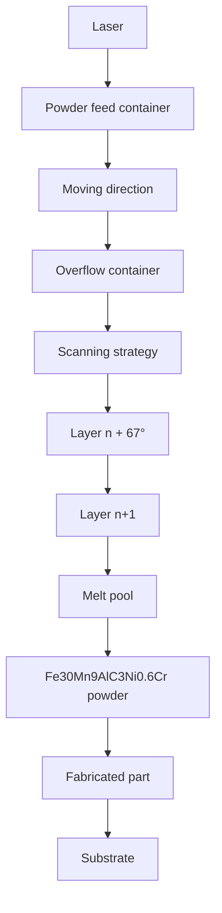

# Microstructure and mechanical properties of Fe–30Mn–9Al–C–3Ni low-density steel manufactured by selective laser melting

Jiawei Liu a,c , Tian Xie a,c , Yinlong Xie a,c , Le Xiao a,c , Yuan Lin a,c , Yu Dai a,b,c,\* , Jian Wu a,b,c,\*\*

a School of Physics and Materials Science, Nanchang University, Nanchang, 330031, China
b International Institute for Materials Innovation, Nanchang University, Nanchang, 330031, China
c Advanced Corporation for Materials and Equipments Co., Ltd., Hunan ACME, Changsha, 410118, China

# A R T I C L E I N F O

Handling editor:L Murr

Keywords:

Selective laser melting

Fe–Mn–Al–C low-density steel

Mechanical property

Austenite

# A B S T R A C T

Low-density Fe–Mn–Al–C steels are widely used in the automotive and aerospace industries as advanced lightweight materials. In this study, highly spherical Fe–30Mn–9Al–C–3Ni powder with a narrow particle-size distribution, low oxygen content, and good flowability was prepared using the plasma rotating electrode process (PREP). Furthermore, Fe–30Mn–9Al–C–3Ni low-density alloy steel was manufactured for the first time using the selective laser melting (SLM) molding technique. Laser power was found to significantly impact the microstructure and mechanical properties of SLM-printed Fe–30Mn–9Al–C–3Ni alloys. The Fe–30Mn–9Al–C–3Ni alloy prepared at a laser power of 110 W (denoted as P-110) exhibited the best mechanical properties, including a yield strength of 887.1 MPa, tensile strength of 1076.8 MPa, elongation of 40.80%, and a maximum hardness value of 294 HV. This study highlights the potential of SLM molding for fabricating low-density Fe–Mn–Al–C steels with complex geometrical shapes and outstanding comprehensive mechanical properties.

# 1. Introduction

Low-density Fe–Mn–Al–C steels have been widely used in the automotive and aerospace industries owing to their low densities, high strengths and toughnesses, good plasticities, and excellent hightemperature oxidation resistances [1–7]. However, rapid industrial modernization and economic growth has led to increasingly strict material-property requirements. Much research has focused on various dopant elements, including Ni [8,9], Cr [5,10], Mo [11], Cu [12], and V [13,14], with the aim of further improving the mechanical and anticorrosion properties of Fe–Mn–Al–C steels.

The addition of elemental Ni to the Fe–Mn–Al–C system inhibits electrochemical activity and the initial microelectro-coupling effect between the second phase and austenite, while enhancing corrosion resistance [15]. For example, cast Fe–16Mn–10Al-0.86C–5Ni alloy was homogenization at 1180 ◦C for 2 h and then hot forged from 1150 to 900 ◦C before being subjected to hot rolling, cold rolling processes and annealing treatments [16], which resulted in an alloy with a maximum elongation of 38% and a tensile strength below 1.5 GPa. A vacuum-melting method was used by Wu et al. to fabricate an Fe–19Mn–9Al-0.8C–5Ni alloy [17], which was first homogenized at 1200 ◦C for 2 h, rolled from 1050 ◦C, quenched after being held for 1 h at 1000 ◦C, and finally aged at 500 ◦C for varying durations. While the tensile strength and elongation of the untreated sample exceeded 1.3 GPa and 14.5%, respectively. The sample aged for 1 h exhibited the highest yield strength (>1.4 GPa), elongation (>20 %), and the most outstanding corrosion resistance. However, the comprehensive mechanical properties of the Fe–Mn–Al–C–Ni system still require improvement. Moreover, preparing Fe–Mn–Al–C alloys with complex shapes is challenging because they are very hard. Furthermore, traditional processes used to manufacture Fe–Mn–Al–C alloys, such as casting, forging, rolling, and annealing, among others, are costly and time-consuming [18].

Selective laser melting (SLM) is a type of additive manufacturing (AM) technology that is particularly suitable for fabricating complex and dense three-dimensional components. Moreover, SLM-printed samples are highly strong and rigid, and their microstructures and mechanical properties can be effectively controlled [19–24]. Various metal alloys, such as stainless steel [25–28], nickel-based superalloys [29–31], titanium alloys [32–34], and aluminum alloys [24,35–38], have been successfully fabricated using SLM. Studies have shown that the printing parameters, such as laser power, scanning speed, spot size etc., have great influence on properties of parts by SLM [24,39,40]. For example, Liu et al. [24] investigated the influence of laser power on the grain morphology and texture constituents of AlSi10Mg alloy during the SLM process. It was found that the average grain size increased with the increase of the laser power, and the smallest average grain size of 6.68 μm was obtained at the lowest power of 175W. Sun et al. [40] employed rapid scanning speeds from 625 to 3000 mm/s to manufacture high-density stainless steel 316L (SS316L) components. The frequency of the very small pores, observed at 625 mm/s, increased with the rise in scanning speed. Furthermore, at 1250 mm/s, the vertical cracks emerged with the highest prevalence recorded at 3000 mm/s.

Besides the printing parameters, the power characteristics, such as sphericity, fluidity, particle size, etc., were also found to have an effect on the properties of parts by SLM [41,42]. Wei et al. [41] studied the influence of Sc microalloying on the powder properties and crack behavior of Ren´e 104 superalloy fabricated by SLM. The results demonstrated that the powder properties of Sc-microalloyed Ren´e 104 superalloy were conspicuously enhanced with the decreased contents of O and S elements, the reduced average particle size from 38.3 μm to 29.6 μm, the decreased flowability from 43.5 s to 15.8 s. Thus, the relative density of as-printed Ren´e 104 alloy increased to 99.4%, the grain size decreased by 46.8%, the nano-hardness increased by 13.9%, and the cracks were completely eliminated. Karlsson et al. [42] employed two different particle size ranges (25–45 μm vs. 45–100 μm) of Ti–6Al–4V powder in the electron beam melting (EBM) process. Using a smaller particle size range, the printed sample exhibited a higher surface resolution, and maintained excellent mechanical properties.

To the best of our knowledge, no research into the mechanical properties of Fe–Mn–Al–C alloys prepared by SLM has been reported. Therefore, we first prepared Fe–30Mn–9Al–C–3Ni powder using the plasma rotating electrode process (PREP), and then fabricated Fe–30Mn–9Al–C–3Ni alloy samples using SLM for the first time. How laser power influences the microstructure and mechanical properties of the Fe–30Mn–9Al–C–3Ni alloy was investigated in detail.

# 2. Materials and methodology

# 2.1. Materials and SLM methods

Spherical Fe–30Mn–9Al–C–3Ni powder (particle diameter: 15–53 μm) was PREP-prepared (Advanced Corporation for Materials and Equipments, PREP-22); its chemical composition was determined by inductively coupled plasma (ICP-OES) and is listed in Table 1.

Two differently sized samples $( 7 5 \times 1 2 \times 1 2$ mm and 10 × 10 × 10 mm) were printed using an SLM Solutions SLM280 printer (Fig. 1). The substrate was heated to 200 ◦C prior to printing. During printing, argon (99.99% pure) was used to protect each sample from oxidation, and the oxygen content in the forming chamber was maintained below 300 ppm. Laser powers of 70, 90, 110, 130, and 150 W were used, which correspond to laser energy densities (E) of 58.33, 75.00, 91.67, 108.33, and 125.00 J/mm3 , respectively. The spot diameter, layer thickness, and hatch space were 0.1, 0.02, and 0.08 mm, respectively. The scanning speed was 750 mm/s. Samples printed at various laser powers are denoted as P-70, P-90, P-110, P-130, and P-150. The laser-scanning strategy involved overlapping strips. To minimize the laser vector coincidence of adjacent layers and reduce the crystallographic texture, a $6 7 ^ { \circ }$ rotation angle was applied to each layer [24]. Among the samples prepared with different parameters, the minimum density is $6 . 7 8 \ : \mathrm { g } / \mathrm { c m } ^ { 3 } ;$ , which is much lighter than the density of 304 stainless steel, 7.93 g/cm3 .

Table1 Chemical composition of the Fe–30Mn–9Al–C–3Ni powder (wt%).

<table><tr><td>Element</td><td>Mn</td><td>Al</td><td>C</td><td>Ni</td><td>O</td><td>Fe</td></tr><tr><td>Mass</td><td>29.95</td><td>8.63</td><td>1.20</td><td>3.45</td><td>0.01</td><td>Bal.</td></tr></table>

# 2.2. Characterizing microstructures

The particle size, flowability, crystal structure, and microstructure of the Fe–30Mn–9Al–C–3Ni powder were analyzed using a Bettersize 3000Plus laser particle-size analyzer, a powder comprehensive perfor mance tester, a Bruker D8 Advance X-ray diffractometer (X-ray diffraction, XRD, continuous scanning, scanning angle range: 30–100◦ with a Cu target scanned at 2◦/min), and a ZEISS Sigma300 scanning electron microscope. The SLM-printed samples were electrolytically polished in perchloric-acid/ethanol solution. The microstructure was then analyzed using a Leica DMi8 M/C/A optical microscope and an Oxford Symmetry S2 electron backscatter diffraction (EBSD) instrument (step size: 0.3–0.7 μm, accelerator voltage: 15–20 kV). The relative density and surface roughness of each sample were calculated using the Archimedes principle and measured using a laser confocal microscope (Zeiss LSM 900), respectively. The collected EBSD data were analyzed using TSL OIM software. The SLM-printed samples were polished to a 5000-grit finish using a grinding and polishing machine prior to microstructural observation. Transmission electron microscopy (TEM) samples were prepared using a plasma polishing system and observed using a FEI Tecnai F30 scanning transmission electron microscope.

# 2.3. Mechanical testing

The room-temperature tensile properties of each SLM-printed sample were evaluated with a Suns universal testing machine using a dog-boneshaped tensile sample with a gauge length of 25 mm and a diameter of 5 mm. A Reliant electronic extensometer was used with a loading rate of 1 mm/min. The hardnesses of both the horizontal and vertical crosssections of the SLM-printed samples were measured using a microhardness tester at a load of 0.5 kg for 10 s. Each microhardness value is the arithmetic mean of five measurement points.

# 3. Results and discussion

# 3.1. Powder characterization

The PREP-prepared Fe–30Mn–9Al–C–3Ni powder is highly spherical with no satellites or irregular particles observed, as shown in Fig. 2(a) and (b). The Fe, Mn, Al, and Ni in the Fe–30Mn–9Al–C–3Ni powder are clearly uniformly distributed (Fig. 2(c)–(f)). As the conductive tape holding the powder contains a large amount of C, the elemental C distribution is not included in the EDS maps. The cross-sectional image of a particle reveals the solid nature of the powder (Fig. 2(g)). Particles with sizes mainly distributed in the 15–53 μm range are observed in Fig. 3; the median particle size (D50) was determined to be 35.69 μm. The powder exhibited excellent flowability, with a Hall value of 14 s/50 g, which is suitable for SLM.

The XRD pattern of the Fe–30Mn–9Al–C–3Ni powder is shown in Fig. 4, which shows diffraction peaks for both the γ-Fe(M) and α-Fe(M) phases. The γ-Fe(M) phase dominates because the PREP-prepared Fe–30Mn–9Al–C–3Ni powder was cooled relatively slowly, resulting in a small amount of carbon dissolved in the α-Fe phase that promotes the formation of the ferrite phase.

# 3.2. Alloy characterization

In contrast to the Fe–30Mn–9Al–C–3Ni powder, the Fe–30Mn–9Al–C3–Ni alloy SLM-printed at each laser power mainly comprises the austenite phase without any α-Fe(M) phase (Fig. 5). This helps to increase the strength and toughness of low-density steel [1]. The full width at half maximum (FWHM) values of the diffraction peaks corresponding to the (111) crystal planes of the P-70, P-90, P-110, P-130, and P-150 samples were determined to be 0.289, 0.274, 0.263, 0.255, and 0.237, respectively. This observation implies that the average grain size of the SLM-printed samples gradually increases with increasing energy density because a higher energy density results in a slower cooling rate during printing and a longer grain-growth period, leading to larger grains.

flowchart

Fig. 1. Schematic depicting the SLM preparation of an Fe–30Mn–9Al–C–3Ni alloy from Fe–30Mn–9Al–C–3Ni powder.

natural_image

Microscopic view of spherical particles with scale bars (400 μm and 10 μm), no text or symbols present.

natural_image

Microscopic view of a spherical yellow particle labeled Fe, likely iron (no text or symbols beyond label)

natural_image

Microscopic image showing a blue circular structure labeled (d) and Mn, with no additional text or symbols present.

natural_image

Microscopic image of a red spherical particle labeled (e) and Al, showing surface texture and color variations (no text or symbols beyond labels)

text_image

(f)
Ni

natural_image

Microscopic view of a circular biological or material structure with visible grain boundaries and a 2 μm scale bar (no text or symbols beyond label)

Fig. 2. (a) and (b) SEM images, (e) Fe, (f) Mn, (g) Al, and (h) Ni EDS maps, and (g) cross-sectional image of the PREP-prepared Fe–30Mn–9Al–C–3Ni powder.

Cross-sectional optical micrographs of the Fe–30Mn–9Al–C–3Ni samples SLM-printed at different laser powers are shown in Fig. 6, which reveals that porosity first decreases and then increases with increasing laser power. The P-70, P-90, P-110, P-130, and P-150 samples were determined to be 4.75%, 0.25%, 0.13%, 0.28%, and 0.35% porous, respectively. In a similar manner, relative density was also observed to first increase and then decrease with increasing laser power. P-70, P-90,

histogram

| Particle sizes (mm) | Volume (%) |
| ------------------- | ---------- |
| 0.1                 | 0          |
| 1                   | 0          |
| 10                  | 0          |
| 20                  | 4          |
| 30                  | 8          |
| 40                  | 12         |
| 50                  | 11         |
| 60                  | 9          |
| 70                  | 6          |
| 80                  | 4          |
| 90                  | 2          |
| 100                 | 1          |
| 200                 | 0          |
| 500                 | 0          |
| 1000                | 0          |

Fig. 3. Particle-size distribution of the PREP-prepared 30Mn–9Al–C–3Ni powder.

line

| 2θ (degree) | Intensity (a.u.) | Label     |
| ----------- | ---------------- | --------- |
| ~42         | ~1.0             | (111)     |
| ~45         | ~0.3             | (110)     |
| ~50         | ~0.8             | (200)     |
| ~65         | ~0.1             | (200)     |
| ~73         | ~0.6             | (220)     |
| ~89         | ~0.9             | (311)     |
| ~93         | ~0.3             | (222)     |

Fig. 4. XRD pattern of the PREP-prepared Fe–30Mn–9Al–C–3Ni powder.

P-110, P-130, and P-150 exhibited relative densities of 98.27%, 99.16%, 99.34%, 99.12%, and 99.07%, respectively, which is ascribable to a high laser power facilitating sufficient metal-powder fusion that leads to densification. However, an excessively high laser power results in incomplete solidification of the liquid metal and splashing during laser melting; these splashes solidify rapidly and spheroidize on the surface. In addition, excessively high energy densities can generate internal stress, voids, and cracks in the sample. Therefore, the P-110 sample was found to have the lowest porosity and fewest microcracks but the highest relative density and maximum density.

Fig. 7(a)–(e) present inverse pole figures (IPFs) that correspond to the electron backscatter diffraction (EBSD) maps of Fe–30Mn–9Al–C–3Ni alloy cross-sections, which mainly reveal fine equiaxed grains with random orientations that are represented by different colors. This result is attributable to the use of a rotation angle of 67◦ for each printing layer during the SLM process [43]. On the other hand, columnar grains dominate the vertical section of the P-110 sample. A small amount of equiaxed grains that are primarily distributed at the bottom of the melt pool are also observed (Fig. 7(f)), which is attributable to the melt pool being much hotter than the substrate during the cooling and solidification processes, resulting in a large temperature gradient between the melt pool and the substrate. Consequently, vertical heat flow along the deposition direction leads to vertical grain-growth along the melt-pool boundary. In addition, partial remelting of the solidified layer facilitates the formation of well-aligned periodic melt pools. Hence, columnar grains extend to adjacent deposition layers via deposition layer boundaries.

line

| 2θ (degree) | Intensity (a.u.) |
| ----------- | ---------------- |
| 42          | (111)            |
| 50          | (200)            |
| 73          | (220)            |
| 89          | (311)            |
| 93          | (222)            |

Fig. 5. XRD patterns of Fe–30Mn–9Al–C–3Ni samples SLM-printed at various laser powers.

Both the proportion of large grains and the average grain size in the sample cross-section were observed to continuously increase as the laser power was increased from 70 to 150 W, with average grain sizes of 8.1, 10.6, 11.0, 13.9, and 14.3 μm determined for the P-70, P-90, P-110, P-130, and P-150 samples, respectively (Fig. 8(a–e)). Moreover, the longitudinal section of the P-110 sample exhibited an average grain size of 14.9 μm, which is larger than the cross-sectional value of 11.0 μm (Fig. 8 (f)). This observation is ascribable to the laser beam penetrating multiple powder layers to form a melt pool that couples with the metal substrate in the horizontal direction and the gaseous atmosphere and the lower substrate in the vertical direction during cooling and solidification. Cooling occurs faster in the horizontal direction than in the vertical direction because the metal is more thermally conductivity than the gas, resulting in smaller grains.

TEM was used to further study the microstructure of the P-110 sample (Fig. 9). As shown in Fig. 9(a), dislocation tangles were observed inside the austenite owing to thermal expansion of the constituent phases during the SLM process. κ carbide is present based on the selected area diffraction pattern (SADP) acquired for zone b in Fig. 9(a). The relationship between [011]γ and [011]κ is presented in Fig. 9(b). κ carbide is uniformly distributed in the austenite matrix (Fig. 9(c)). The dark-field (DF) (010) diffraction-spot image reveals that the κ carbide is composed of nanoscale particles. Fig. 9(e) shows a high-resolution TEM (HRTEM) image of the austenite phase of zone [011] in Fig. 9(d). The (200) and (1-11) planes were determined to have interplanar spacings of 0.262 and 0.223 nm, respectively. The SADP was fast Fouriertransformed, which confirmed the [011] austenite zone axis (Fig. (f)). In addition, ferrite diffraction patterns were not detected because ferrite formation in each Fe–30Mn–9Al–C–3Ni alloy was suppressed by fast cooling during the SLM process.

As shown in Fig. 10, the surface of the SLM-printed Fe–30Mn–9Al–C–3Ni alloy became smoother with increasing laser power; P-70, P-90, P-110, P-130, and P-150 exhibited surface roughness values of 20.71, 9.19, 5.29, 4.65, and 4.19 μm, respectively. A low surface roughness is beneficial for printing high-precision components, whereas excessive surface roughness affects the dimensional accuracy of a printed sample.

text_image

(a) Porosity=4.75 %
500 µm

text_image

(b) Porosity=0.25 %
500 µm

text_image

(c) Porosity=0.13 %
500 µm

text_image

(d) Porosity=0.28 %
500 µm

text_image

(e) Porosity=0.35 %
Crack
500 µm

Fig. 6. OM images of transverse cross-sections of SLM-printed Fe–30Mn–9Al–C–3Ni alloys: (a) P-70, (b) P-90, (c) P-110, (d) P-130, and (e) P-150.

natural_image

Colorful 3D microscopic image of a material cross-section showing grain boundaries and color variations (no text or symbols)

natural_image

Colorful 3D microscopic image of a material cross-section with x-y axis label and 50 μm scale bar (no textual content)

natural_image

Colorful 3D microstructure image showing grain boundaries and color variations, scale bar indicates 50 μm (no text or symbols present)

natural_image

Colorful 3D microscopic image of a material cross-section with x-y axis label and 50 μm scale bar (no textual content)

natural_image

Colorful microstructure image showing grain boundaries and phases, scale bar 50 μm (no text or symbols)

natural_image

Colorful 3D microscopic image of a material cross-section with X-Z axis label and 50 μm scale bar (no textual content)

Fig. 7. IPFs of EBSD images of transverse cross-sections of SLM-printed Fe–30Mn–9Al–C–3Ni alloys: (a) P-70, (b) P-90, (c) P-110, (d) P-130 and (e) P-150, and (f) the longitudinal section of P-110.

Fig. 11 shows SEM images of Fe–30Mn–9Al–C–3Ni samples SLMprinted at various laser powers. Numerous unfused powder particles and pores were observed on the surface at a laser power of 70 W (Fig. 11 (a)); these unfused powder particles and pores gradually decreased in number as the laser power was increased. The P-110 sample, prepared at a laser power of 110 W, exhibited the best surface quality; it was devoid of any obvious unfused powder particles or pores (Fig. 11(c)) because a

higher laser power increases the size of the melt pool, which benefits the metal-fusion process and improves surface quality. However, small spheres were increasingly generated as the laser power was increased to 130 and 150 W owing to localized heat accumulation (Fig. 11(d) and (e)) [44].

# 3.3. Alloy mechanical properties

Fig. 12 displays tensile stress–strain curves for the SLM-printed and

bar

| Grain diameter (μm) | Fraction (%) |
| ------------------- | ------------ |
| 4                   | 16           |
| 5                   | 12           |
| 6                   | 9            |
| 7                   | 8            |
| 8                   | 7            |
| 9                   | 5            |
| 10                  | 4            |
| 11                  | 3            |
| 12                  | 2            |
| 13                  | 1            |
| 14                  | 1            |
| 15                  | 1            |
| 16                  | 1            |
| 17                  | 1            |
| 18                  | 1            |
| 19                  | 1            |
| 20                  | 1            |
| 21                  | 1            |
| 22                  | 1            |
| 23                  | 1            |
| 24                  | 1            |
| 25                  | 1            |
| 26                  | 1            |
| 27                  | 1            |
| 28                  | 1            |
| 29                  | 1            |
| 30                  | 1            |
| 31                  | 1            |
| 32                  | 1            |
| 33                  | 1            |
| 34                  | 1            |
| 35                  | 1            |
| 36                  | 1            |
| 37                  | 1            |
| 38                  | 1            |
| 39                  | 1            |
| 40                  | 1            |
| 41                  | 1            |
| 42                  | 1            |
| 43                  | 1            |
| 44                  | 1            |

histogram

| Grain diameter (μm) | Fraction (%) |
| ------------------- | ------------ |
| 4                   | 13.0         |
| 8                   | 8.0          |
| 12                  | 6.0          |
| 16                  | 3.0          |
| 20                  | 2.0          |
| 24                  | 1.5          |
| 28                  | 1.0          |
| 32                  | 0.5          |
| 36                  | 0.3          |
| 40                  | 0.2          |
| 44                  | 0.1          |

bar

| Grain diameter (μm) | Fraction (%) |
| ------------------- | ------------ |
| 4                   | 7.5          |
| 5                   | 11.0         |
| 6                   | 12.5         |
| 7                   | 9.0          |
| 8                   | 7.0          |
| 9                   | 6.0          |
| 10                  | 5.0          |
| 11                  | 4.5          |
| 12                  | 4.0          |
| 13                  | 3.5          |
| 14                  | 3.0          |
| 15                  | 2.5          |
| 16                  | 2.0          |
| 17                  | 1.5          |
| 18                  | 1.0          |
| 19                  | 0.5          |
| 20                  | 0.5          |
| 21                  | 1.0          |
| 22                  | 0.5          |
| 23                  | 0.5          |
| 24                  | 0.5          |
| 25                  | 0.5          |
| 26                  | 0.5          |
| 27                  | 0.5          |
| 28                  | 0.5          |
| 29                  | 0.5          |
| 30                  | 0.5          |
| 31                  | 0.5          |
| 32                  | 0.5          |
| 33                  | 0.5          |
| 34                  | 0.5          |
| 35                  | 0.5          |
| 36                  | 0.5          |
| 37                  | 0.5          |
| 38                  | 0.5          |
| 39                  | 0.5          |
| 40                  | 0.5          |
| 41                  | 0.5          |
| 42                  | 0.5          |
| 43                  | 0.5          |
| 44                  | 0.5          |

bar

| Grain diameter (μm) | Fraction (%) |
| ------------------- | ------------ |
| 4                   | 12.5         |
| 8                   | 7.0          |
| 12                  | 3.0          |
| 16                  | 4.0          |
| 20                  | 3.0          |
| 24                  | 2.0          |
| 28                  | 1.5          |
| 32                  | 2.5          |
| 36                  | 1.0          |
| 40                  | 0.5          |
| 44                  | 0.5          |

histogram

| Grain diameter (μm) | Fraction (%) |
| ------------------- | ------------ |
| 4                   | 7.8          |
| 5                   | 9.0          |
| 6                   | 7.9          |
| 7                   | 7.3          |
| 8                   | 7.7          |
| 9                   | 4.3          |
| 10                  | 3.6          |
| 11                  | 4.5          |
| 12                  | 3.4          |
| 13                  | 0.5          |
| 14                  | 0.7          |
| 15                  | 0.8          |
| 16                  | 3.2          |
| 17                  | 4.1          |
| 18                  | 2.9          |
| 19                  | 0.3          |
| 20                  | 3.4          |
| 21                  | 2.8          |
| 22                  | 2.8          |
| 23                  | 2.9          |
| 24                  | 1.7          |
| 25                  | 2.8          |
| 26                  | 0.3          |
| 27                  | 0.3          |
| 28                  | 0.3          |
| 29                  | 0.3          |
| 30                  | 0.3          |
| 31                  | 0.3          |
| 32                  | 2.8          |
| 33                  | 0.4          |
| 34                  | 0.3          |
| 35                  | 0.3          |
| 36                  | 0.1          |
| 37                  | 0.3          |
| 38                  | 0.4          |
| 39                  | 0.5          |
| 40                  | 0.6          |
| 41                  | 0.3          |
| 42                  | 0.5          |
| 43                  | 0.3          |
| 44                  | 0.3          |

bar

| Grain diameter (μm) | Fraction (%) |
| ------------------- | ------------ |
| 4                   | 12.5         |
| 6                   | 8.2          |
| 8                   | 10.0         |
| 10                  | 4.0          |
| 12                  | 4.5          |
| 14                  | 3.0          |
| 16                  | 3.5          |
| 18                  | 3.2          |
| 20                  | 0.5          |
| 22                  | 0.8          |
| 24                  | 0.6          |
| 26                  | 0.3          |
| 28                  | 3.0          |
| 30                  | 0.5          |
| 32                  | 0.7          |
| 34                  | 0.6          |
| 36                  | 0.5          |
| 38                  | 0.2          |
| 40                  | 0.8          |
| 42                  | 0.3          |
| 44                  | 0.6          |

Fig. 8. Grain-size distributions in the transverse cross-sections of SLM-printed Fe–30Mn–9Al–C–3Ni samples: (a) P-70, (b) P-90, (c) P-110, (d) P-130, and (e) P-150, and (f) the longitudinal grain-size distribution in P-110.

text_image

(a)
Dislocation
200 nm

text_image

(b)
(11-1)γ
(010)κ
(200)γ
(100)κ
(-11-1)γ
(1-11)γ
(-200)γ
(-1-11)γ
Z=[011]γ+κ
5 1/nm

text_image

(c)
← K
20 nm

text_image

(d)
Hight-density dislocation
0.5 µm

text_image

(e)
(200) d=0.262 nm
(143) d=0.223 nm
Z=[011]
2 nm

text_image

(f)
(1-11)
(200)
(-1-11)
(11-1)
(-200)
(-11-1)
Z=[011]

Fig. 9. (a) TEM image, (b) SADPs of [011] γ and [011] κ, and (c) DF image of κ carbide. (d) TEM image of a dislocation. (e) HRTEM image and (f) fast Fouriertransform (FFT) image of P-110.

as-cast Fe–30Mn–9Al–C–3Ni alloys, with yield-strength, tensilestrength, and fracture-strain values listed in Table 2. Compared to cast sample, SLM samples have higher strength and plasticity, which is due to the rapid cooling during SLM processing resulting in grain refining strengthening. The P-70 sample, prepared using a low laser power of 70 W, exhibited poor mechanical properties, with yield and tensile strengths of 776.9 and 986.4 MPa, respectively, and an elongation of 23.10%. The mechanical properties clearly improved as the laser power was increased from 70 to 110 W; a laser power of 110 W resulted in the best mechanical properties, with yield and tensile strengths of 887.1 and 1076.8 MPa, respectively, and an elongation of 40.80%. The outstanding comprehensive mechanical properties of the P-110 sample are comparable to or even superior to those of Fe–Mn–Al–C systems prepared by conventional methods [45–49]. However, the mechanical properties were observed to gradually deteriorate at laser powers above 110 W. For example, yield strength, tensile strength, and elongation percentage were observed to decrease to 771.5 MPa, 1032.0 MPa, and 28.28%, respectively, as the laser power was increased 150 W.

SEM images of the tensile fracture surfaces of the SLM-printed Fe–30Mn–9Al–C–3Ni alloys are shown in Fig. 13, which reveals ductile dimple fracturing. The P-70 sample (Fig. 13(a)) exhibited ductile dimple fractures and fractures caused by decohesion and internal cracks; it exhibited poor tensile performance owing to numerous unfused powder particles in the sample. The P-90 and P-110 samples exhibited more-dominant ductile dimple fractures (Fig. 13(b) and (c)), indicative of superior yield strengths, tensile strengths, and ductilities. On the other hand, internal defects (pores and cracks) and spheroidization phenomena were observed in the P-130 (Fig. 13(d)) and the P-150 (Fig. 13(e)) samples, leading to low yield and tensile strengths, and elongation percentages. The samples prepared at low power have low strength due to the presence of unfused powder and high porosity, while at high power, due to the stress generated by high energy density, there are more dissociation surfaces and cracks, which lead to the decrease of plasticity.

As the SLM printing laser power increases, the strength and plasticity of the Fe–30Mn–9Al–C–3Ni alloys first increase and then decrease. This is because among the samples printed at different powers, the samples prepared at low power have smaller average grain size (Fig. 8(a–b)) but large porosity, while the samples printed at high power has small porosity but large grain size (Fig. 8(d–e)), and the laser power increases, which is the result of the joint influence of macro-structure and microstructure.

The average hardnesses of the cross-sectional and longitudinal sections of the SLM-printed Fe–30Mn–9Al–C–3Ni alloys are shown in Fig. 14; both average hardnesses were observed to initially increase as the laser power was increased from 70 to 110 W and then decrease as the laser power was further increased. The P-110 sample exhibited maximum hardness values of 292 and 294 HV for its cross-sectional and longitudinal sections, respectively; however, the side surface was softer than the top surface. Therefore, both grain size and internal defects (pores, cracks, and unfused powder particles) significantly influence the hardness of the sample.

# 4. Conclusion

In this study, Fe–30Mn–9Al–C–3Ni powder were prepared by PREP and used to fabricate Fe–30Mn–9Al–C–3Ni alloys using SLM for the first time. How the laser power influences the microstructure and mechanical properties of the SLM-printed sample was systematically investigated. The following main conclusions are drawn.

(1) PREP was used to prepare high-quality, highly spherical Fe–30Mn–9Al–C–3Ni powder with a narrow particle-size distribution, low oxygen content, good flowability, and lacking hollow particles, which are characteristics suitable for SLM printing.
(2) Fe–30Mn–9Al–C–3Ni low-density steels were successfully fabricated using SLM for the first time. Each SLM-printed sample

heatmap

| X (μm) | Y (μm) | Value |
|--------|--------|-------|
| 0      | 0      | 0     |
| 100    | 50     | 50    |
| 200    | 100    | 100   |
| 300    | 150    | 150   |
| 400    | 200    | 200   |
| 500    | 250    | 250   |
| 600    | 300    | 300   |
| 700    | 350    | 350   |
| 800    | 400    | 400   |
| 900    | 450    | 450   |
| 1000   | 500    | 500   |
| 1100   | 550    | 550   |
| 1200   | 600    | 600   |
| 1300   | 650    | 650   |
| 1400   | 700    | 700   |
| 1500   | 750    | 750   |
| 1600   | 800    | 800   |
| 1700   | 850    | 850   |
| 1800   | 900    | 900   |
| 1900   | 950    | 950   |
| 2000   | 1000   | 1000  |
| 2100   | 1050   | 1050  |
| 2200   | 1100   | 1100  |
| 2300   | 1150   | 1150  |
| 2400   | 1200   | 1200  |
| 2500   | 1250   | 1250  |
| 2600   | 1300   | 1300  |
| 2700   | 1350   | 1350  |
| 2800   | 1400   | 1400  |
| 2900   | 1450   | 1450  |
| 3000   | 1500   | 1500  |
| 3100   | 1550   | 1550  |
| 3200   | 1600   | 1600  |
| 3300   | 1650   | 1650  |
| 3400   | 1700   | 1700  |
| 3500   | 1750   | 1750  |
| 3600   | 1800   | 1800  |
| 3700   | 1850   | 1850  |
| 3800   | 1900   | 1900  |
| 3900   | 1950   | 1950  |
| 4000   | 2000   | 2000  |
| 4100   | 2050   | 2050  |
| 4200   | 2100   | 2100  |
| 4300   | 2150   | 2150  |
| 4400   | 2200   | 2200  |
| 4500   | 2250   | 2250  |
| 4600   | 2300   | 2300  |
| 4700   | 2350   | 2350  |
| 4800   | 2400   | 2400  |
| 4900   | 2450   | 2450  |
| 5000   | 2500   | 2500  |
| 5100   | 2550   | 2550  |
| 5200   | 2600   | 2600  |
| 5300   | 2650   | 2650  |
| 5400   | 2700   | 2700  |
| 5500   | 2750   | 2750  |
| 5600   | 2800   | 2800  |
| 5700   | 2850   | 2850  |
| 5800   | 2900   | 2900  |
| 5900   | 2950   | 2950  |
| 6000   | -      | -     |

heatmap

| X (μm) | Y (μm) | Value |
|--------|--------|-------|
| 0      | 0      | 0     |
| 100    | 10     | 10    |
| 200    | 20     | 20    |
| 300    | 30     | 30    |
| 400    | 40     | 40    |
| 500    | 50     | 50    |
| 600    | 60     | 60    |
| 700    | 70     | 70    |
| 800    | 80     | 80    |
| 900    | 90     | 90    |
| 1000   | 100    | 100   |
| 1100   | 110    | 110   |
| 1200   | 120    | 120   |
| 1300   | 130    | 130   |
| 1400   | 140    | 140   |
| 1500   | 150    | 150   |
| 1600   | 160    | 160   |
| 1700   | 170    | 170   |
| 1800   | 180    | 180   |
| 1900   | 190    | 190   |
| 2000   | 200    | 200   |
| 2100   | 210    | 210   |
| 2200   | 220    | 220   |
| 2300   | 230    | 230   |
| 2400   | 240    | 240   |
| 2500   | 250    | 250   |
| 2600   | 260    | 260   |
| 2700   | 270    | 270   |
| 2800   | 280    | 280   |
| 2900   | 290    | 290   |
| 3000   | 300    | 300   |
| 3100   | 310    | 310   |
| 3200   | 320    | 320   |
| 3300   | 330    | 330   |
| 3400   | 340    | 340   |
| 3500   | 350    | 350   |
| 3600   | 360    | 360   |
| 3700   | 370    | 370   |
| 3800   | 380    | 380   |
| 3900   | 390    | 390   |
| 4000   | 400    | 400   |
| 4100   | 410    | 410   |
| 4200   | 420    | 420   |
| 4300   | 430    | 430   |
| 4400   | 440    | 440   |
| 4500   | 450    | 450   |
| 4600   | 460    | 460   |
| 4700   | 470    | 470   |
| 4800   | 480    | 480   |
| 4900   | 490    | 490   |
| 5000   | 500    | 500   |
| 5100   | 510    | 510   |
| 5200   | 520    | 520   |
| 5300   | 530    | 530   |
| 5400   | 540    | 540   |
| 5500   | 550    | 550   |
| 5600   | 560    | 560   |
| 5700   | 570    | 570   |
| 5800   | 580    | 580   |
| 5900   | 590    | 590   |
| 6000   | 60      | nan    |

heatmap

| X (μm) | Y (μm) | Value |
|--------|--------|-------|
| 0      | 0      | 0     |
| 100    | 10     | 10    |
| 200    | 20     | 20    |
| 300    | 30     | 30    |
| 400    | 40     | 40    |
| 500    | 50     | 50    |
| 600    | 60     | 60    |

heatmap

| Position (μm) | Value |
| ------------- | ----- |
| 0             | 0     |
| 100           | 5     |
| 200           | 10    |
| 300           | 15    |
| 400           | 20    |
| 500           | 25    |
| 600           | 30    |

heatmap

| X (μm) | Y (μm) | Value (μm) |
|--------|--------|------------|
| 0      | 0      | 0          |
| 100    | 10     | 5          |
| 200    | 20     | 10         |
| 300    | 30     | 15         |
| 400    | 40     | 20         |
| 500    | 50     | 25         |
| 600    | 60     | 30         |
| 700    | 70     | 35         |
| 800    | 80     | 40         |
| 900    | 90     | 45         |
| 1000   | 100    | 50         |
| 1100   | 110    | 55         |
| 1200   | 120    | 60         |
| 1300   | 130    | 65         |
| 1400   | 140    | 70         |
| 1500   | 150    | 75         |
| 1600   | 160    | 80         |
| 1700   | 170    | 85         |
| 1800   | 180    | 90         |
| 1900   | 190    | 95         |
| 2000   | 200    | 100        |
| 2100   | 210    | 105        |
| 2200   | 220    | 110        |
| 2300   | 230    | 115        |
| 2400   | 240    | 120        |
| 2500   | 250    | 125        |
| 2600   | 260    | 130        |
| 2700   | 270    | 135        |
| 2800   | 280    | 140        |
| 2900   | 290    | 145        |
| 3000   | 300    | 150        |
| 3100   | 310    | 155        |
| 3200   | 320    | 160        |
| 3300   | 330    | 165        |
| 3400   | 340    | 170        |
| 3500   | 350    | 175        |
| 3600   | 360    | 180        |
| 3700   | 370    | 185        |
| 3800   | 380    | 190        |
| 3900   | 390    | 195        |
| 4000   | 400    | 200        |
| 4100   | 410    | 205        |
| 4200   | 420    | 210        |
| 4300   | 430    | 215        |
| 4400   | 440    | 220        |
| 4500   | 450    | 225        |
| 4600   | 460    | 230        |
| 4700   | 470    | 235        |
| 4800   | 480    | 240        |
| 4900   | 490    | 245        |
| 5000   | 500    | 250        |
| 5100   | 510    | 255        |
| 5200   | 520    | 260        |
| 5300   | 530    | 265        |
| 5400   | 540    | 270        |
| 5500   | 550    | 275        |
| 5600   | 560    | 280        |
| 5700   | 570    | 285        |
| 5800   | 580    | 290        |
| 5900   | 590    | 295        |
| 6000   | 600    | 300        |
The image contains two panels: (e) a topographic contour plot and (e) a topographic surface plot. The color scale ranges from blue (low) to red (high). The x-axis is labeled 'X' and the y-axis is labeled 'Y'. The data is presented in a grid format with color coding for each value. The labels are 'Z' and 'R' at the top of the plot.

Fig. 10. 2D and 3D topographies and surface roughnesses of the SLM-printed Fe–30Mn–9Al–C–3Ni alloys: (a) P-70, (b) P-90, (c) P-110, (d) P-130, and (e) P-150.

text_image

(a)
Lack of fusion
Hole
200 µm

text_image

(b)
Lack of fusion
200 µm

text_image

(c)
Balling
200 µm

text_image

(d)
Balling
200 µm

text_image

(e)
Balling
200 µm

Fig. 11. SEM images of SLM-printed Fe–30Mn–9Al–C–3Ni alloy surfaces: (a) 70, (b) 90, (c) 110, (d) 130, and (e) 150 W.

contained austenite as the predominant phase with a small amount of nano-sized κ carbide.

(3) Laser power was found to significantly affect the microstructure and mechanical properties of the SLM-printed samples. The P-110

sample, prepared using a laser power of 110 W, exhibited the best comprehensive mechanical properties, with a yield strength of 887.1 MPa, an ultimate tensile strength of 1076.8 MPa, and an elongation of 40.80%; it also exhibited a maximum hardness value of 294 HV.

line

| Engineer Strain/% | P-70  | P-90  | P-110 | P-130 | P-150 | as-cast |
| ----------------- | ----- | ----- | ----- | ----- | ----- | ------- |
| 0                 | 800   | 800   | 800   | 800   | 800   | 800     |
| 20                | 950   | 960   | 970   | 940   | 930   | 850     |
| 40                | 1020  | 1030  | 1040  | 1010  | 1000  | 750     |
| 50                | 1050  | 1060  | 1070  | 1030  | 1020  | -       |
| 60                | -     | -     | -     | -     | -     | -       |

Fig. 12. Tensile stress–strain curves of Fe–30Mn–9Al–C–3Ni alloys SLMprinted at various laser powers and as-cast Fe–30Mn–9Al–C–3Ni alloy.

Table 2 Mechanical properties of Fe–30Mn–9Al–C–3Ni alloys SLM-printed at various laser powers and as-cast Fe–30Mn–9Al–C–3Ni alloy.

<table><tr><td>Sample</td><td>YS/MPa</td><td>TS/MPa</td><td>Z/%</td><td>EL/%</td></tr><tr><td>P-70</td><td>776.9</td><td>986.4</td><td>25.79</td><td>23.10</td></tr><tr><td>P-90</td><td>802.4</td><td>1067.8</td><td>35.48</td><td>39.68</td></tr><tr><td>P-110</td><td>887.1</td><td>1076.8</td><td>35.16</td><td>40.80</td></tr><tr><td>P-130</td><td>782.2</td><td>1039.6</td><td>34.84</td><td>39.72</td></tr><tr><td>P-150</td><td>771.5</td><td>1032.0</td><td>32.22</td><td>28.28</td></tr><tr><td>As-cast</td><td>772.3</td><td>879.0</td><td>17.10</td><td>20.53</td></tr></table>

# CRediT authorship contribution statement

Jiawei Liu: Conceptualization, Formal analysis, Methodology, Writing – original draft. Tian Xie: Data curation, Visualization. Yinlong Xie: Data curation, Software. Le Xiao: Data curation, Software. Yuan Lin: Data curation, Software. Yu Dai: Visualization, Funding acquisition, Resources. Jian Wu: Writing – review & editing, Project administration, Validation, Supervision.

# Data availability

The data that support the findings of this study are available from the author initials, upon reasonable request.

# Declaration of competing interest

The authors declare the following financial interests/personal relationships which may be considered as potential competing interests: Jian Wu reports financial support was provided by Jiangxi Provincial Natural Science Foundation of China. If there are other authors, they declare that they have no known competing financial interests or personal relationships that could have appeared to influence the work

bar

| | Longitudinal | Cross |
|---|---|---|
| P-70 | 279 | 278 |
| P-90 | 289 | 285 |
| P-110 | 294 | 292 |
| P-130 | 284 | 283 |
| P-150 | 283 | 281 |

Fig. 14. Average hardness values of the cross-sections and longitudinal sections of Fe–30Mn–9Al–C–3Ni alloys SLM-printed at various laser powers.

text_image

(a)
Lack of fusion
Crack
20 µm

text_image

(b)
Lack of fusion
20 µm

text_image

(c)
Dimple
2 µm
20 µm

text_image

(d)
Dimple
Cleavage
20 µm

text_image

(e)
Cleavage
Crack
Dimple
Cleavage
2 µm
20 µm

Fig. 13. SEM images of the fracture surfaces of SLM-printed Fe–30Mn–9Al–C–3Ni alloys: (a) P-70, (b) P-90, (c) P-110, (d) P-130, and (e) P-150.

reported in this paper.
