# Research on the microstructure and corrosion behaviour of Fe–Mn–Al–C low-density steel alloyed with Cu

Honglei Wang a , Xinyi Liu b,\* , Chunguang Shen c , Yuqi Hao a , Xingcheng Qiu a , Jin Li a , Rui Wang a , Min Hu d , Xu Wang a,\*\*, Jacob C. Huang e,\*\*\*

a School of Mechanical Engineering, Liaoning Petrochemical University, Fushun, Liaoning, 113001, China
b Key Laboratory for Advanced Materials of Ministry of Education, School of Materials Science and Engineering, Tsinghua University, Beijing, 100084, China
c Tianjin Key Laboratory of Materials Laminating Fabrication and Interface Control Technology, School of Materials Science and Engineering, Hebei University of Technology, Tianjin, 300130, China
d Pertrochina Planning and engineering institute, Beijing, 100000, China
e Department of Materials & Optoelectronic Science, National Sun Yat-Sen University, Kaohsiung, Taiwan, Republic of China

# A R T I C L E I N F O

Keywords:

Low-density steel

Alloying with Cu

Corrosion behaviour

Microgalvanic corrosion

# A B S T R A C T

Three types of Fe-30 wt%Mn-8wt%Al-1wt%C steel with different Cu contents were prepared, and the effects of the Cu content on the microstructure and corrosion properties of the austenite-based low-density steel were systematically investigated. The experimental results indicate that the addition of an appropriate amount of Cu is conducive to the nucleation and growth of austenite while also refining the carbides. However, the addition of an excessive amount of Cu is added results in a sharp decrease in the number of carbides. Additionally, Cu does not fully dissolve into the austenite matrix but rather accumulates at the grain boundaries in its elemental form. This distribution creates a potential difference from the austenite matrix and results in a synergistic corrosion effect with the carbides, leading to preferential corrosion of the grain boundaries and an increased degree of corrosion on the surface of the matrix.

# 1. Introduction

Fe–Mn–Al–C steel can exhibit excellent mechanical properties and good weight loss potential through appropriate process design. Therefore, it has attracted close attention in the automobile, chemical and aviation industries [1–5]. When designing low-density steel, the relative contents of carbon, manganese and aluminium alloying affect its structure and properties [6–8]. At present, low-density steel can generally be divided into ferrite low-density steel, ferrite-based duplex low-density steel, austenite-based duplex low-density steel and austenite low-density steel according to the matrix composition [9]. Through appropriate process design, the strength and plasticity levels of low-density steel, especially austenite-based low-density steel, have marked advantages over traditional high-strength steel. Each addition of 1 wt% Al can effectively reduce the yield by approximately 0.1 g/cm3 [6,10,11]. Adding more than 5 wt% Al to austenite-based low-density steel can promote the precipitation of nano-k-carbide, thereby achieving a good balance between the strength and plasticity of the steel [1,7]. Elemental Mn, which can expand the austenite phase region of low-density steel, is extremely important for the regulation of low-density steel structures [12]. In high-manganese austenitic light steel (with a composition of Fe-(0.5–1)C-(15–30)Mn-(8–12)Al in wt%), nanosized k-carbides precipitate inside the austenite matrix, which endows the steel with high coherency and shear characteristics [13,14].

The addition and content of alloying elements can significantly affect the microstructure and properties of low-density steel [15,16]. For example, Ni and Cr have been shown to optimize the performance of low-density steel (LDS) [17–20], whereas Cu is a noncarbon-forming element, which is helpful for obtaining a single-phase austenite structure. Moreover, it is also a commonly used element to improve the strength of traditional high-strength steel [21,22]. The appropriate use of Cu can result in considerable precipitation and solid solution strengthening in steel [23]. Hicho et al. [24] reported that adding elemental Cu to high-strength alloy steel can form Cu-rich precipitates to improve the strength. Wang et al. [6] studied the addition of Cu to steel to increase the effective area of grain/bundle/block/lath boundaries, providing additional hydrogen traps to evenly distribute hydrogen, thereby inhibiting the aggregation of hydrogen at the boundaries and improving the hydrogen embrittlement resistance.

Table 1 Chemical compositions (wt%) of three specimen steels.

<table><tr><td>Steel</td><td>C</td><td>Mn</td><td>Al</td><td>Si</td><td>Cu</td><td>W</td><td>Cr</td><td>Mo</td><td>Nb</td><td>Fe</td></tr><tr><td>0Cu</td><td>1</td><td>30</td><td>8</td><td>0.2</td><td>0</td><td>0.5</td><td>0.5</td><td>0.5</td><td>0.5</td><td>Bal.</td></tr><tr><td>1Cu</td><td>1</td><td>30</td><td>8</td><td>0.2</td><td>1</td><td>0.5</td><td>0.5</td><td>0.5</td><td>0.5</td><td>Bal.</td></tr><tr><td>3Cu</td><td>1</td><td>30</td><td>8</td><td>0.2</td><td>3</td><td>0.5</td><td>0.5</td><td>0.5</td><td>0.5</td><td>Bal.</td></tr></table>

Cu significantly affects the comprehensive properties of low-density steel. Xie et al.’s research [15] on low-density steel with alloyed Cu revealed that Cu-containing steel has more fine twins and a greater dislocation density, thereby improving its plasticity and yield strength. Research by Song et al. [25] on Cu-alloyed dual-phase light steel revealed that the addition of Cu not only reduces the amount of hydrogen that can be introduced into the sample but also prevents the diffusion of hydrogen due to the segregation of the B2 phase and Cu, thus effectively improving the hydrogen embrittlement resistance of light steel. Ren et al. [26] studied the tensile properties of Fe–28Mn–10Al–1C–3Cu austenitic light steel. The results show that the steel achieves an excellent strength‒performance balance, with a high ultimate tensile strength (1026.7 MPa), high total elongation (43.1 %) and high yield strength (926.4 MPa). Moreover, the addition of Cu significantly affects the precipitation mechanism of carbides in light steel. Ren et al. [27] reported that austenite-based low-density steel preferentially precipitates κ-carbides due to the addition of Cu in the early stage of ageing. Furthermore, κ-carbides and the austenite matrix exhibit a good, coherent relationship. Xie et al. [15] reported that the addition of Cu significantly inhibited the dissolution of κ-carbides, resulting in a large number of intergranular κ-carbides in steel.

However, studies have primarily focused on the influence of Cu on the microstructure $[ 1 5 , 2 7 ]$ and mechanical properties [21,28,29] of Fe–Mn–Al–C LDS. In addition to the mechanical properties of low-density steel, its corrosion resistance is also extremely important for its application in automotive and port machinery. Therefore, improving the corrosion resistance of low-density steel is highly important [30,31].

On the basis of the above considerations, this study prepared Fe–30Mn–8Al–1C-xCu (x = 0, 1, 3 wt%) low-density test steel to systematically explore the influence of the amount of added Cu on the microstructure and corrosion resistance of LDS. Through material characterization techniques, electrochemical tests, immersion and other methods, the microstructural evolution and corrosion behaviour changes in the Cu-containing steel were analysed. The corrosion mechanism of Cu in austenite-based LDS in a $\mathrm { C l ^ { - } }$ environment was subsequently discussed, providing practical guidance for research on LDS with alloyed Cu in terms of corrosion.

# 2. Experimental

# 2.1. Material preparation

To study the influence of alloyed Cu on the corrosion resistance performance of LDS, the composition of the steel was carefully designed during the material preparation process. The specific composition is shown in Table 1. The experimental steel was smelted in a vacuum smelting furnace and refined into ingots in an Ar atmosphere. The ingots were homogenized at 1200 ◦C for 2 h, and then multipass hot rolling was carried out at temperatures exceeding $8 5 0 ~ ^ { \circ } \mathrm { C } .$ . Finally, the mixture was cooled to room temperature.

# 2.2. Microstructure characterization

The micromorphology of the test steel was analysed by scanning electron microscopy (SEM, SU8010). The size of each test sample was 10 mm × 10 mm × 5 mm. The samples were polished with SiC sandpaper (240–2000 mesh) and W2.5 diamond polishing paste before being corroded in a 20 vol% nitric alcohol solution. The composition and elemental content analyses were carried out using a supporting energy spectrometer. To prevent inaccurate determination of light elements via EDS analysis, five different positions of the sample were measured, and the average value was obtained. The phase analysis of the test steel was carried out via X-ray diffraction (XRD, Bruker D8 Advance). The diffraction angle was scanned from 20◦ to 90◦ at a working voltage of 40 $\mathbf { k V } ,$ a working current of $4 0 \ \mathrm { m A } ,$ and a scanning rate of $2 ^ { \circ } / \mathrm { m i n }$ . Flake samples with a thickness of 50 μm for transmission electron microscopy (TEM) studies were simultaneously prepared by manual grinding. The foil samples for transmission electron microscopy (TEM) analysis were prepared via the double-jet electrolytic polishing method. The working voltage was 20 V, and the current was 200 mA. A mixture of 10 % perchloric acid and 90 % methanol was used as the electrolyte, and the polishing process was completed at − ${ } ^ { - 3 0 ^ { \circ } \mathrm { C } }$ .

# 2.3. Electrochemical testing

The electrochemical tests were performed on samples with a size of 10 mm × 10 mm × 5 mm using a CORRTEST 4000 A workstation. The samples were all welded with Cu conductors and sealed with epoxy resin, with a working area of 10 mm × 10 mm remaining. The samples were subsequently polished with SiC sandpaper (240–2000 mesh) and W2.5 diamond polishing paste until the surface was free of scratches and exhibited a mirror effect. Finally, the surfaces of the samples were cleaned with water and absolute ethanol and dried. For the electrochemical tests, a standard three-electrode system was used. A saturated calomel electrode (SCE) was selected as the reference electrode, and a platinum sheet was used as the auxiliary electrode. The prepared sample was the working electrode. The corrosion medium used in the experiment was a 3.5 wt% NaCl solution, and the test was carried out at room temperature $( 2 5 ^ { \circ } \mathrm { C } )$ . To ensure that the open circuit potential (OCP) is stable, an open circuit potential test of 1800 s was carried out first. Then, electrochemical impedance spectroscopy (EIS) was carried out at the OCP condition. The amplitude of the alternating current disturbance was 10 mV, and the frequency ranged from 100 kHz to 10 mHz. The equivalent circuit diagram was drawn and fitted via Zview software to obtain the fitted EIS data. The test was carried out at a scanning rate of 0.5 mV/s in the range of − 1.2 to − 1.0 V vs. SCE. The corrosion potential $\mathrm { ( E _ { c o r r } ) }$ , corrosion current density $\left( \mathrm { I } _ { \mathrm { c o r r } } \right)$ and other relevant data are obtained by fitting the Tafel analysis curve. All tests for each condition were conducted three times.

# 2.4. Immersion testing

Cubic samples with dimensions of 10 mm × 10 mm × 5 mm were prepared via a linear cutting mechanism for immersion experiments. The six surfaces of each sample were polished with SiC sandpapers of 240–2000 mesh. The samples were subsequently polished with W2.5 diamond polishing paste. The samples were cleaned with deionized water, wiped with alcohol and dried. The original weight was recorded. The immersion medium was a 3.5 wt% NaCl solution, and the immersion time was 5 days. The immersion solution was changed every day. After the corrosion products were removed via ultrasonic vibration, the samples were dried and weighed again. The corrosion morphology of the immersed sample steel was analysed via optical microscopy (OM, Olympus GX53).

natural_image

Microscopic view of a material's grain structure with 10μm scale bar (no text or symbols beyond label)

natural_image

Microscopic view of a material's grain structure with 10μm scale bar (no text or symbols beyond label)

natural_image

Microscopic view of a material's grain structure with 10μm scale bar (no text or symbols beyond label)

line

| 2θ (degree) | Intensity (3Cu) | Intensity (1Cu) | Intensity (0Cu) |
| ----------- | --------------- | --------------- | --------------- |
| ~42         | γ(111)          | -               | -               |
| ~48         | -               | -               | -               |
| ~50         | γ(200)          | -               | -               |
| ~72         | -               | -               | -               |
| ~74         | -               | -               | -               |
| ~89         | γ(311)          | -               | -               |

Fig. 1. Sem and XRD of Fe–30Mn–8Al–C-xCu: (a) 0 Cu; (b) 1 Cu; (c) 3 Cu; and (d) XRD.

text_image

(a)
ASTM Grain Size Number(Random Lines) 10.2
20µm

natural_image

Microstructure image of ASTM grain with polygonal grains, scale bar 20μm, no text or symbols on the grain structure itself

text_image

(c)
ASTM Grain Size Number(Random Lines) 9.6
20µm

bar

| Equivalent Diameter (μm) | Count |
| ------------------------ | ----- |
| 0-5                      | 8     |
| 5-10                     | 28    |
| 10-15                    | 38    |
| 15-20                    | 27    |
| 20-25                    | 13    |
| 25-30                    | 6     |
| 30-35                    | 1     |

bar

| Equivalent Diameter (μm) | Count |
| ------------------------ | ----- |
| 0-5                      | 5     |
| 5-10                     | 14    |
| 10-15                    | 20    |
| 15-20                    | 22    |
| 20-25                    | 10    |
| 25-30                    | 5     |
| 30-35                    | 2     |

bar

| Equivalent Diameter (μm) | Count |
| ------------------------ | ----- |
| 0-5                      | 7     |
| 5-10                     | 18    |
| 10-15                    | 21    |
| 15-20                    | 14    |
| 20-25                    | 19    |
| 25-30                    | 13    |
| 30-35                    | 14    |
| 35-40                    | 10    |
| 40-45                    | 6     |
| 45-50                    | 5     |
| 50-55                    | 3     |
| 55-60                    | 2     |
| 60-65                    | 1     |
| 65-70                    | 1     |
| 70-75                    | 0     |
| 75-80                    | 0     |
| 80-85                    | 0     |
| 85-90                    | 0     |
| 90-95                    | 0     |
| 95-100                   | 0     |
| 100-105                  | 0     |
| 105-110                  | 0     |
| 110-115                  | 0     |
| 115-120                  | 0     |
| 120-125                  | 0     |
| 125-130                  | 0     |
| 130-135                  | 0     |
| 135-140                  | 0     |
| 140-145                  | 0     |
| 145-150                  | 0     |
| 150-155                  | 0     |
| 155-160                  | 0     |
| 160-165                  | 0     |
| 165-170                  | 0     |
| 170-175                  | 0     |
| 175-180                  | 0     |
| 180-185                  | 0     |
| 185-190                  | 0     |
| 190-195                  | 0     |
| 195-200                  | 0     |
| 200-205                  | 0     |
| 205-210                  | 0     |
| 210-215                  | 0     |
| 215-220                  | 0     |
| 220-225                  | 0     |
| 225-230                  | 0     |
| 230-235                  | 0     |
| 235-240                  | 0     |
| 240-245                  | 0     |
| 245-250                  | 0     |
| 250-255                  | 0     |
| 255-260                  | 0     |
| 260-265                  | 0     |
| 265-270                  | 0     |
| 270-275                  | 0     |
| 275-280                  | 0     |
| 280-285                  | 0     |
| 285-290                  | 0     |
| 290-295                  | 0     |
| 295-300                  | 0     |
| 300-305                  | 0     |
| 305-310                  | 0     |
| 310-315                  | 0     |
| 315-320                  | 0     |
| 320-325                  | 0     |
| 325-330                  | 0     |
| 330-335                  | 0     |
| 335-340                  | 0     |
| 340-345                  | 0     |
| 345-350                  | 0     |
| Note: The actual counts may vary due to the random nature of the data generation. The provided counts are just an example. |

Fig. 2. Statistics of average grain size of Fe–30Mn–8Al–C-xCu: (a) 0 Cu; (b) 1 Cu; and (c) 3 Cu.

# 2.5. Scanning Kelvin probe force microscopy

A scanning Kelvin probe force microscope (SKPFM) was used to measure the potential between different microstructures. The sample steel was polished and microetched with 240–2000 mesh SiC sandpaper, and the etched area was then scanned in SKPFM mode. The Volta potential was measured using a PFQNF-AL probe, and all images were obtained at a scanning frequency of 0.498 Hz. The Volta potential distribution map is obtained according to the contact potential difference between the low-density steel and the tip.

Fig. 3. SEM images and EPMA element surface scanning images of Fe–30Mn–8Al–C-xCu: (a) 1 Cu; and (b) 3 Cu.

# 3. Results

# 3.1. Microstructure and composition analysis

As shown in Fig. 1, the SEM images and XRD patterns of the three test steels are shown in Fig. 1(a) to 1(d). The three test steels all consisted of typical equiaxed austenite grains. Some twin crystals had penetrated the surface of austenite, and white particles had attached to the crystal surface. In addition, many white particles had attached to the surface of the 1Cu austenite grains, and a small number had attached to the austenite grain boundaries. The 3Cu austenite grain boundaries were enriched with many white granular objects, and a small number of these objects had attached to the surface of the austenite grains. The XRD patterns of the steels with different Cu contents are shown in Fig. 1(d). The three test steels showed marked γ-austenite peaks and were free of a second phase.

As shown in Fig. 2(a–c), the grain boundaries of the OM microstructure image of the low-density steel were identified and dyed via the image grey segmentation technology of the MPAR software, and the average grain size was determined. The ASTM grain size grade of 0Cu is 10.2. After the addition of 1 wt% Cu, the ASTM grain size grade was reduced to 9.5. After adding 3 wt% Cu, the ASTM grain size grade of 3Cu was $^ { 9 . 6 , }$ which was similar to the average grain size of the 1Cu sample steel. The grain size grade of ASTM steels is inversely proportional to the average grain size; thus, the average grain size of the austenite in the Cucontaining sample steel is greater than that in the Cu-free sample steel. The relevant literature shows that the addition of Cu in the range of 0.52–3 wt% facilitates the nucleation and growth of austenite grains [21,32,33].

text_image

(a)
Mean Grain Size Number	0.52
Number of carbides	1740

text_image

(b)
Mean Grain Size Number	0,51
Number of carbides	2377

text_image

(c)
Mean Grain Size Number	0.61
Number of carbides	876

histogram

| Equivalent Diameter (μm) | Count |
| ------------------------ | ----- |
| 0.2                      | 60    |
| 0.3                      | 140   |
| 0.4                      | 420   |
| 0.5                      | 260   |
| 0.6                      | 170   |
| 0.7                      | 60    |
| 0.8                      | 20    |
| 0.9                      | 10    |
| 1.0                      | 5     |
| 1.1                      | 2     |
| 1.2                      | 1     |

histogram

| Equivalent Diameter (µm) | Count |
| ------------------------ | ----- |
| 0.3                      | 310   |
| 0.4                      | 440   |
| 0.5                      | 260   |
| 0.6                      | 220   |
| 0.7                      | 160   |
| 0.8                      | 70    |
| 0.9                      | 10    |
| 1.0                      | 5     |
| 1.1                      | 2     |
| 1.2                      | 1     |

histogram

| Equivalent Diameter (μm) | Count |
|---|---|
| 0.2 | 55 |
| 0.3 | 120 |
| 0.4 | 125 |
| 0.5 | 135 |
| 0.6 | 145 |
| 0.7 | 125 |
| 0.8 | 80 |
| 0.9 | 50 |
| 1.0 | 25 |
| 1.1 | 10 |
| 1.2 | 5 |
| 1.3 | 2 |
| 1.4 | 1 |

Fig. 4. Statistics of the number and size of Fe–30Mn–8Al–C-xCu carbides: (a) 0 Cu; (b) 1 Cu; and (c) 3 Cu.

line

| log i (A/cm²) | 0 Cu     | 1 Cu     | 3 Cu     |
| ------------- | -------- | -------- | -------- |
| 1E-9          | -0.40    | -0.40    | -0.40    |
| 1E-8          | -0.40    | -0.40    | -0.40    |
| 1E-7          | -0.40    | -0.40    | -0.40    |
| 1E-6          | -0.25    | -0.25    | -0.25    |
| 1E-5          | -0.20    | -0.20    | -0.20    |
| 1E-4          | -0.20    | -0.20    | -0.20    |
| 0.001         | -0.20    | -0.20    | -0.20    |

Fig. 5. The three-electrode potentiodynamic polarization diagram of Fe–30Mn–8Al–C-xCu.

To further explore the composition of white particles, EPMA element surface scanning was performed on 1Cu and 3Cu. As shown in Fig. 3(a), the Al and Mo are almost uniformly distributed in the austenite matrix of 1Cu. As shown in the area marked by the red box, the aggregation positions of Nb and C correspond to the aggregation positions of white particles attached to the surface of the austenite matrix in the SEM image. Related literature [4] shows that these white particles may be MC, M3C, M23C6, M7C3 and (Fe,Mn) AlC carbides distributed on the surface of the sample. Therefore, the white particles may be NbC-type carbides. The figure also shows slight aggregation of Cu along the grain boundaries at the austenite grain boundaries of 1Cu. As shown in Fig. 3(b), the Al content in 3Cu is unevenly distributed at some grain boundaries, and the grain boundaries are strongly enriched with elemental Cu. Therefore, some white particles on the surface and at the grain boundaries of the matrix are $\mathtt { C u } ,$ , and the remaining particles may be NbC carbides.

As shown in Fig. 4(a–c), the number and size of carbides were determined via MPAR software. The average size of the 0Cu carbides was 0.52 μm, and the number of carbides was 1740. Conversely, the average size of the 1Cu carbides decreased to 0.51 μm, and the number increased sharply to 2377. In 3Cu, the number of carbides on the surface of the austenite grains decreased sharply to 876. Related studies [34,35] have shown that increasing the Cu content from 0 wt% to 1.5 wt% refines the carbides, resulting in their dense distribution on the surface of the austenite grains. Increasing the Cu content to 2 wt% hinders the diffusion of C, which results in a sharp decrease in carbides.

# 3.2. Electrochemical behavior

# 3.2.1. Three-electrode potentiodynamic polarization

Fig. 5 shows the electrochemical polarization curves of the Fe–30Mn–8Al–C-xCu low-density steel in a 3.5 % NaCl solution. As the applied potential increases, marked polarization current density plateaus appear in the polarization curves of the three steels, indicating that the three LDSs undergo significant passivation reactions during the corrosion process [36]. In addition, the anode curve in the figure shows fluctuations, possibly because the presence of $\mathrm { C l ^ { - } }$ ions has a strong destructive effect on the stability of the passivation state. Specifically, this destruction manifests as fluctuations in the current density, resulting in fluctuations in the anode curve [37–39]. The polarization curve fitting parameters of 0Cu, 1Cu and 3Cu steel obtained via the Tafel extrapolation method, i.e., the corrosion potential $( \mathrm { E } _ { \mathrm { c o r r } } ) ,$ , highest activation potential (Ef), pitting potential $( \operatorname { E } _ { \mathrm { { b } } } ) ,$ passivation interval (ΔE) and passivation current density $( \mathrm { I } _ { \mathrm { p a s s } } )$ , are shown in Table 2. 0Cu has the largest passivation region and the greatest pitting potential, followed by those of 1Cu. The passivation region of 0Cu ranged from − 305 to − 215 mV SCE, and the pitting potential was − 215 mV SCE; the passivation region of 1Cu ranged from − 301 mV SCE to − 225 mV SCE, and the pitting potential was − 225 mV SCE. 3Cu had the smallest passivation region ranging from − 306 mV SCE to − 245 mV SCE, and a pitting potential is − 245 mV SCE. With increasing Cu content, the dissolution reaction of the anode becomes more intense and is more likely to be eroded by the corrosion solution. In summary, 0Cu has the greatest corrosion resistance, and Cu significantly affects the corrosion behaviour of low-density steel.

Table 2 Fitting results of electrochemical parameters.

<table><tr><td>Sample</td><td> $E_{corr}$  (mV)</td><td> $E_f$  (mV)</td><td> $E_b$  (mV)</td><td> $\Delta E$  (mV)</td><td> $I_{pass}$  (A/cm2)</td></tr><tr><td>0Cu</td><td> $-383 \pm 6$ </td><td> $-305 \pm 4$ </td><td> $-215 \pm 5$ </td><td> $90 \pm 8$ </td><td> $1.69 \pm 0.06 \times 10^{-6}$ </td></tr><tr><td>1Cu</td><td> $-368 \pm 7$ </td><td> $-301 \pm 3$ </td><td> $-225 \pm 4$ </td><td> $76 \pm 5$ </td><td> $1.45 \pm 0.08 \times 10^{-6}$ </td></tr><tr><td>3Cu</td><td> $-368 \pm 6$ </td><td> $-306 \pm 6$ </td><td> $-245 \pm 5$ </td><td> $61 \pm 6$ </td><td> $1.07 \pm 0.07 \times 10^{-6}$ </td></tr></table>

# 3.2.2. Electrochemical impedance

Fig. 6 shows the Nyquist and Bode diagrams of the Fe–30Mn–8Al–CxCu low-density steel in a 3.5 % NaCl solution, which indicated that the passivation behaviour of these materials remained similar with different Cu contents. The Nyquist diagrams of the three tested steel samples all show capacitive semicircle characteristics, and the diameter of the Nyquist diagram is negatively correlated with the corrosion rate of the metal [40,41]. The low-frequency region reflects charge transfer and diffusion, whereas the high-frequency region shows the electrolyte and its resistivity [42]. The capacitive reactance semicircle diameter of 0Cu is the largest, and the capacitive reactance semicircle diameter of 3Cu is the smallest. Therefore, the corrosion rate of 0Cu steel is the smallest, and the corrosion rate of 3Cu steel is the largest. This result is consistent with the results obtained from the fitting parameters of the polarization curve, indicating that increasing the content of elemental Cu decreases the corrosion resistance of low-density steel. In the low-frequency region of the Bode diagram, the impedance resistance modulus decreases with increasing frequency, which indicates that the logarithm of the impedance modulus is linearly related to the frequency [43]. The impedance modulus is related to the corrosion performance to a certain extent. 3Cu has the lowest impedance modulus, which is consistent with the results obtained from the previous Nyquist diagram. The equivalent circuit diagram in Fig. 6(a) was selected to fit and analyse the EIS data. $\mathrm { R } _ { s }$ represents the solution resistance, $\mathrm { R _ { p } }$ represents the charge transfer resistance, $\mathrm { R _ { c t } }$ represents the charge transfer resistance, and the constant phase element (CPE) was used instead of the pure capacitance. The electrical impedance of the CPE was calculated via Eq. (1) [43–49].

$$
\mathrm{Z} _ {\mathrm{CPE}} = \frac {1}{\mathrm{Y} _ {0} (\omega \mathrm{i}) ^ {\mathrm{n}}}, \tag {1}
$$

where $\mathrm { Y } _ { 0 }$ represents the conductivity, ω represents the angular frequency, i represents the imaginary number, and n represents the index of the CPE. The fitted relevant parameters are shown in Table 3. The $\mathrm { R } _ { s }$ values of the three steels are similar, whereas the $\mathrm { R _ { c t } }$ values decrease with increasing Cu content. According to relevant reports $[ 4 2 , 4 3 ]$ , the magnitude of $\mathrm { R _ { c t } }$ directly correlates with the corrosion resistance. A small chi-square value $\chi ^ { \bar { 2 } } ~ ( 1 0 ^ { - 3 } )$ indicates a better fit, suggesting an appropriate result. The $\mathrm { R _ { c t } }$ value of the Cu-free steel is greater than that of the Cu-containing steel, indicating that the alloying of Cu has a significant effect on the corrosion performance of the low-density steel, which is consistent with the results obtained from the polarization

Table 3 Fitting parameters for the impedance results.

<table><tr><td>Sample</td><td> $R_s$  [Ω·cm2]</td><td>CPE [Ω-1cm-2·S-n]</td><td>n</td><td> $R_{ct}$ [Ω·cm2]</td><td> $χ^2$ </td></tr><tr><td>0 Cu</td><td>10.12 ± 0.08</td><td>1.1697 ± 0.06 × 10-4</td><td>0.81 ± 0.02</td><td>5796 ± 11</td><td>7.24 × 10-3</td></tr><tr><td>1 Cu</td><td>8.329 ± 0.11</td><td>5.8542 ± 0.09 × 10-4</td><td>0.80 ± 0.01</td><td>2739 ± 9</td><td>2.05 × 10-3</td></tr><tr><td>3 Cu</td><td>8.521 ± 0.09</td><td>5.246 ± 0.12 × 10-4</td><td>0.74 ± 0.01</td><td>2062 ± 12</td><td>3.68 × 10-3</td></tr></table>

line

| Potential(V_SCE) | 0 Cu        | 1 Cu        | 3 Cu        |
| ---------------- | ----------- | ----------- | ----------- |
| -1.0             | ~1.0E+9     | ~4.5E+8     | ~5.0E+8     |
| -0.5             | ~2.0E+8     | ~1.0E+8     | ~1.5E+8     |
| 0.0              | ~1.2E+9     | ~7.0E+8     | ~5.0E+8     |
| 0.5              | ~1.0E+9     | ~1.0E+8     | ~1.0E+8     |
| 1.0              | ~1.0E+9     | ~1.0E+8     | ~1.0E+8     |

Fig. 7. Mott-Schottky curves of Fe–30Mn–8Al–C-xCu.

line

| Zre (Ω/cm²) | Fitting-0 Cu | Fitting-1 Cu | Fitting-3 Cu |
|-------------|--------------|--------------|--------------|
| 0           | 0            | 0            | 0            |
| 1000        | ~1500        | ~800         | ~600         |
| 2000        | ~2000        | ~900         | ~400         |
| 3000        | ~2200        | ~1000        | ~500         |
| 4000        | ~2100        | ~950         | ~450         |
| 5000        | ~1800        | ~850         | ~400         |
| 6000        | ~1500        | ~750         | ~350         |

line

| Frequency (Hz) | Fitting-0 Cu | Fitting-1 Cu | Fitting-3 Cu | 0 Cu | 1 Cu | 3 Cu |
| -------------- | ----------- | ----------- | ----------- | ---- | ---- | ---- |
| 1E-3           | ~5700       | ~2500       | ~2000       | ~5700| ~2500| ~2000|
| 1E-2           | ~5500       | ~2800       | ~2200       | ~5500| ~2800| ~2200|
| 1E-1           | ~5000       | ~3500       | ~2500       | ~5000| ~3500| ~2500|
| 1E+0           | ~4000       | ~4500       | ~3500       | ~4000| ~4500| ~3500|
| 1E+1           | ~3000       | ~5500       | ~5000       | ~3000| ~5500| ~5000|
| 1E+2           | ~2000       | ~4500       | ~4500       | ~2000| ~4500| ~4500|
| 1E+3           | ~1000       | ~3500       | ~3500       | ~1000| ~3500| ~3500|
| 1E+4           | ~500        | ~2500       | ~2500       | ~500 | ~2500| ~2500|
| 1E+5           | ~100        | ~150        | ~150        | ~100 | ~150 | ~150 |
| 1E+6           | ~50         | ~50         | ~50         | ~50  | ~50  | ~50  |

Fig. 6. Impedance diagrams of Fe–30Mn–8Al–C–xCu: (a) Nyquist diagram; and (b) Bode diagram.

Table 4 The donor $\bf ( N _ { D } )$ and acceptor $\left( \mathrm { N _ { A } } \right)$ densities of the passive films of Fe–30Mn–8Al–C-xCu.

<table><tr><td>Sample</td><td> $N_{D} (10^{18}cm^{-3})$ </td><td> $N_{A} (10^{18}cm^{-3})$ </td></tr><tr><td>0 Cu</td><td> $0.805717 \pm 0.09$ </td><td> $2.61525 \pm 0.12$ </td></tr><tr><td>1 Cu</td><td> $1.36686 \pm 0.12$ </td><td> $3.40074 \pm 0.08$ </td></tr><tr><td>3 Cu</td><td> $1.44602 \pm 0.14$ </td><td> $6.06634 \pm 0.11$ </td></tr></table>

natural_image

Microscopic view of a material surface with a 20μm scale bar, showing irregular particle structures (no text or symbols beyond label)

natural_image

Microscopic view of cellular or particulate structures with a 20μm scale bar (no text or symbols beyond label)

natural_image

Microscopic view of cellular or tissue structure with a 20μm scale bar, no visible text or symbols

natural_image

Microscopic view of a biological sample with a central cluster and scale bar indicating 20μm (no text or symbols present)

natural_image

Microscopic view of two biological tissue samples with visible cellular structures, scale bar indicates 20μm (no text or symbols present)

natural_image

Microscopic view of a material cross-section showing cellular structures and a central void, scale bar indicates 20μm (no text or symbols present)

natural_image

Microscopic view of a cellular or particulate structure with a 20μm scale bar (no text or symbols beyond label)

natural_image

Microscopic view of two biological tissue sections with visible cellular structures and a 20μm scale bar (no text or symbols beyond label)

natural_image

Microscopic view of a material cross-section showing grain boundaries and a central circular feature, scale bar indicates 20μm (no text or symbols present)

natural_image

Microscopic view of a biological cell or vesicle with visible internal structures, scale bar indicates 20μm (no text or symbols present)

natural_image

Microscopic cross-section of biological tissue with visible cellular structures, scale bar indicates 20μm (no text or symbols present)

natural_image

Microscopic view of a material sample with visible grain structure and a 20μm scale bar (no text or symbols beyond label)

natural_image

Microscopic view of a cellular or particulate structure with a dark central region, scale bar indicates 20μm (no text or symbols present)

natural_image

Microscopic cross-section image of biological tissue with scale bar indicating 20μm (no text or symbols present)

natural_image

Microscopic view of a cellular or particulate structure with a central circular feature, scale bar indicates 20μm (no text or symbols present)

Fig. 8. Corrosion morphology of Fe–30Mn–8Al–C-xCu in 1–5 days: (a) 0 Cu; (b) 1 Cu; and (c) 3 Cu.

line

| Time(d) | 0Cu       | 1Cu       | 3Cu       |
| ------- | --------- | --------- | --------- |
| 0       | 0.0000    | 0.0000    | 0.0000    |
| 1       | -0.0001   | -0.0002   | -0.0010   |
| 2       | -0.0001   | -0.0004   | -0.0015   |
| 3       | -0.0003   | -0.0010   | -0.0020   |
| 4       | -0.0010   | -0.0015   | -0.0025   |
| 5       | -0.0020   | -0.0030   | -0.0035   |

bar

| Sample | Corrosion rate (mm·a⁻¹) |
| :--- | :--- |
| 0Cu | 0.055 |
| 1Cu | 0.081 |
| 3Cu | 0.092 |

Fig. 9. Weight loss diagrams and corrosion rates of Fe–30Mn–8Al–C-xCu in 1–5 days: (a) the weight loss diagram; and (b) the corrosion rate diagram.

natural_image

Microscopic surface topography image with 4μm scale bar and 802.5 nm color scale, showing granular texture (no text or symbols beyond scale and color legend)

text_image

(b)
13 mV
-5.8 mV

line

| Distance (μm) | Volta potential (mV) |
| ------------- | ------------------- |
| 0.0           | 10.1                |
| 0.1           | 10.4                |
| 0.2           | 10.7                |
| 0.3           | 10.6                |
| 0.4           | 11.1                |
| 0.5           | 11.9                |
| 0.6           | 11.2                |
| 0.7           | 10.9                |
| 0.8           | 11.3                |
| 0.9           | 11.4                |
| 1.0           | 11.4                |
| 1.1           | 10.9                |
| 1.2           | 11.4                |
| 1.3           | 11.0                |
| 1.4           | 10.7                |
| 1.5           | 11.6                |
| 1.6           | 10.6                |
| 1.7           | 11.0                |
| 1.8           | 10.2                |
| 1.9           | 10.6                |
| 2.0           | 10.6                |

natural_image

Microscopic image showing surface texture with scale bar (4μm) and height color scale (832.5 nm to -375.3 nm), no readable text or symbols beyond measurement markers.

text_image

(e)
18.2 mV
-9.4 mV

line

| Distance (μm) | Volta potential (mV) |
| ------------- | ------------------- |
| -0.5          | 11.6                |
| 0.0           | 11.7                |
| 0.5           | 11.2                |
| 1.0           | 12.4                |
| 1.5           | 12.6                |
| 2.0           | 12.4                |
| 2.5           | 11.7                |
| 3.0           | 11.6                |
| 3.5           | 11.8                |

Fig. 10. The surface height and Volt potential distribution of Fe–30Mn–8Al–C-xCu: (a,b,c) 0 Cu; and (d,e,f) 3 Cu.

curve.

# 3.2.3. Mott-Schottky curves

Fig. 7 shows the Mott‒Schottky curves of Fe–30Mn–8Al–C-xCu. The curves of the three steel samples all show three linear regions characterized by positive and negative slopes. In region I (− 1 V to − 0.5 V), the slopes of the Mott‒Schottky curves of the steels are all negative, indicating that they all present P-type semiconductor characteristics. On the left side of region II (− 0.5 V to − 0.16 V), the slopes of the Mott‒ Schottky curves are all positive, indicating that they present N-type semiconductor characteristics. In region III (− 0.16 V–1 V), the curve shapes of the steels are similar and are all approximately straight lines. This shape arises because in this interval, each sample is in the low potential region, the concentration fluctuations of the donor impurities are small, the distribution is relatively uniform, and the free electrons move slowly. The donor and acceptor densities were calculated with Eq. (2) and Eq. (3) [50].

$$
\frac {1}{C ^ {2}} = \frac {2}{\varepsilon \varepsilon_ {0} e N _ {\mathrm{D}}} \left(E - E _ {\mathrm{fb}} \frac {k T}{e}\right), \tag {2}
$$

$$
\frac {1}{C ^ {2}} = - \frac {2}{\varepsilon \varepsilon_ {0} e N _ {\mathrm{A}}} \left(E - E _ {\mathrm{fb}} \cdot \frac {\mathrm{kT}}{\mathrm{e}}\right), \tag {3}
$$

where C represents the space charge layer capacitance of the passivation film, F represents the space charge layer capacitance, ε represents the dielectric constant of the passivation film (ε = 15.6), and $\varepsilon _ { 0 }$ represents the vacuum dielectric constant $( 8 . 8 5 4 \times 1 0 ^ { - 1 2 } { \mathrm { F m } } ^ { - 1 } )$ . Additionally, E is the potential applied to the sample and is represented by VSCE; $\mathrm { N _ { A } }$ and $\mathrm { { N _ { D } } }$ are the acceptor and donor densities, respectively, both with units of $\mathrm { c m } ^ { - 3 } ;$ ; the value of the electron charge e is $1 . { \overset { - } { 6 } } 0 2 \times 1 { \overset { - } { 0 } } ^ { - 1 9 } { \mathrm { C } } ;$ the flat band potential is represented by $\mathbf { E _ { f b } } ,$ , and it is also represented in VSCE; K is $\mathrm { \overline { { 1 . 3 8 } } ~ \times ~ 1 0 ^ { - 2 3 } ~ J ~ K ^ { - 1 , } }$ which is the Boltzmann constant; and the test temperature is 300 K and is represented by T. The values calculated with these equations are shown in Table 4. As the Cu content increased, the

natural_image

Microscopic grayscale image showing a textured surface with a 2 μm scale bar (no text or symbols beyond label)

text_image

(b)
002
020
001
011̅
5 1/nm
Z = [001]

natural_image

Microscopic image showing granular texture with 20 nm scale bar (no text or symbols beyond label)

natural_image

Microscopic image showing a single dark particle on a light background with 200 nm scale bar (no text or symbols beyond label)

natural_image

Microscopic image showing a textured surface with a 10 nm scale bar and an inset diffraction pattern labeled Z = [001] (no text or symbols beyond labels)

natural_image

Microscopic image showing a textured surface with a 10 nm scale bar and a highlighted region (no text or symbols beyond label)

Fig. 11. TEM images of 0Cu austenite matrix and carbides: (a) austenitic matrix; (b) the diffraction spots of intracrystalline precipitates; (c) dark field morphology of intracrystalline precipitates; (d) carbides; (e) carbide diffraction spots; and (f) inverse FFT image near carbides.

natural_image

Microscopic view of a material surface with visible grain boundaries and a 1 μm scale bar (no text or symbols beyond label)

text_image

(b)
022
010
020
001
5 1/nm
Z = [001]

natural_image

Microscopic image showing granular texture with 20 nm scale bar (no text or symbols beyond label)

natural_image

Microscopic image showing a dark circular feature on a textured surface with a 200 nm scale bar (no text or symbols beyond label)

natural_image

Microscopic image showing a nanoscale structure with a 10 nm scale bar and an inset diffraction pattern labeled Z = [001] (no text or symbols beyond labels)

natural_image

Microscopic image showing a textured surface with a 10 nm scale bar and a red rectangular annotation highlighting a feature (no text or symbols beyond scale indicator)

Fig. 12. TEM images of 1Cu austenite matrix and carbides: (a) austenitic matrix; (b) the diffraction spots of intracrystalline precipitates; (c) dark field morphology of intracrystalline precipitates; (d) carbides; (e) carbide diffraction spots; and (f) inverse FFT image near carbides.

values of $\mathrm { { N _ { D } } }$ and $\mathrm { N _ { A } }$ increased accordingly. The relevant literature shows that a greater charge carrier density leads to more defects and more intense electrochemical reactions at the alloy‒solution interface [51]. According to the point defect model (PDM), the adsorption of $\mathrm { C l ^ { - } }$ ions promotes the nucleation and growth of corrosion pits [52]. Therefore, N reflects the charge density after the formation of the space charge layer and can be used as an indicator to evaluate the nucleation ability of corrosion pits. The data show that the $\mathrm { { N _ { D } } }$ value of 0Cu is the smallest and that the $\mathrm { N _ { D } }$ value of 3Cu is the largest. Therefore, 3Cu has the greatest sensitivity to pitting nucleation and the adsorption of Cl− ions.

natural_image

Microscopic grayscale image showing layered material structure with 1 μm scale bar (no text or symbols)

text_image

(b)
002
020
001
011
5 1/nm
Z = [001]

natural_image

Microscopic image showing granular texture with 20 nm scale bar (no text or symbols beyond label)

natural_image

Microscopic image of a biological structure with 500 nm scale bar, showing internal cellular or material patterns (no text or symbols)

text_image

(e)
220
200 111
400
5 1/nm [022̅]γ / [001]MC

natural_image

Microscopic image showing a nanoscale structure with a 10 nm scale bar and a magnified inset highlighting lattice fringes (no text or symbols present)

line

| Energy (keV) | Intensity (kCounts) |
| ------------ | ------------------- |
| 0            | 1                   |
| 1            | 2                   |
| 2            | 3                   |
| 3            | 4                   |
| 4            | 5                   |
| 5            | 6                   |
| 6            | 7                   |
| 7            | 8                   |
| 8            | 9                   |
| 9            | 10                  |
| 10           | 11                  |
| 11           | 12                  |
| 12           | 13                  |
| 13           | 14                  |
| 14           | 15                  |
| 15           | 16                  |
| 16           | 17                  |
| 17           | 18                  |
| 18           | 19                  |
| 19           | 20                  |
| 20           | 21                  |
| 21           | 22                  |
| 22           | 23                  |
| 23           | 24                  |
| 24           | 25                  |
| 25           | 24                  |
| 26           | 23                  |
| 27           | 22                  |
| 28           | 21                  |
| 29           | 20                  |
| 30           | 19                  |
| 31           | 18                  |
| 32           | 17                  |
| 33           | 16                  |
| 34           | 15                  |
| 35           | 14                  |
| 36           | 13                  |
| 37           | 12                  |
| 38           | 11                  |
| 39           | 10                  |
| 40           | 9                   |
| 41           | 8                   |
| 42           | 7                   |
| 43           | 6                   |
| 44           | 5                   |
| 45           | 4                   |
| 46           | 3                   |
| 47           | 2                   |
| 48           | 1                   |
| 49           | 0                   |
| 50           | 0                   |
| 51           | 0                   |
| 52           | 0                   |
| 53           | 0                   |
| 54           | 0                   |
| 55           | 0                   |
| 56           | 0                   |
| 57           | 0                   |
| 58           | 0                   |
| 59           | 0                   |
| 60           | 0                   |
| 61           | 0                   |
| 62           | 0                   |
| 63           | 0                   |
| 64           | 0                   |
| 65           | 0                   |
| 66           | 0                   |
| 67           | 0                   |
| 68           | 0                   |
| 69           | 0                   |
| 70           | 0                   |
| 71           | 0                   |
| 72           | 0                   |
| 73           | 0                   |
| 74           | 0                   |
| 75           | 0                   |
| 76           | 0                   |
| 77           | 0                   |
| 78           | 0                   |
| 79           | 0                   |
| 80           | 0                   |
| 81           | 0                   |
| 82           | 0                   |
| 83           | 0                   |
| 84           | 0                   |
| 85           | 0                   |
| 86           | 0                   |
| 87           | 0                   |
| 88           | 0                   |
| 89           | 0                   |
| 90           | 0                   |
| 91           | 0                   |
| 92           | 0                   |
| 93           | 0                   |
| 94           | 0                   |
| 95           | 0                   |
| 96           | 0                   |
| 97           | 0                   |
| 98           | 0                   |
| 99           | 0                   |
| ...          | ...                 |
| ...          | ...                 |
| ...          | ...                 |
| ...          | ...                 |
| ...          | ...                 |
| ...          | ...                 |
| ...          | ...                 |
| ...          | ...                 |
| ...          | ...                 |
| ...          | ...                 |
| ...          | ...                 |
| ...          | ...                 |
| ...          | ...                 |
| ...          | ...                 |
| ...          | ...                 |
|
| ...          | ...                 |
| ...          | ...                 |
| ...          | ...                 |
| ...          | ...                 |
| ...          | ...                 |
| ...          | ...                 |
| ...          | ...                 |
| ...          | ...                 |
| ...          | ...                 |
| ...          | ...                 |
| ...          | ...                 |
| ...          | ...                 |
| ...          | ...                 |
| ...          | ...                 |
| ..            | ..                   |

||Structure from Summed Spectrum||
The image contains only the labels for the spectral data.

natural_image

Microscopic image of a Cu surface with 500 nm scale bar (no text or symbols beyond scale indicator)

natural_image

Microscopic image showing scattered blue dots on a black background with scale bar labeled 500 nm and label 'Mo' (no other text or symbols)

natural_image

Microscopic image showing a purple-stained circular structure with 500 nm scale bar, labeled 'C' in bottom right corner (no other text or symbols)

natural_image

Microscopic image showing a blue fluorescent cell or particle distribution on a dark background, with scale bar indicating 500 nm and label 'W' (no text or symbols beyond labels)

natural_image

Microscopic image of a blue-stained cell or particle with 500 nm scale bar, labeled 'Nb' in corner (no other text or symbols)

natural_image

Microscopic image showing a dark circular region on a green textured background, with scale bar labeled 500 nm and 'Al' label in corner (no other text or symbols)

natural_image

Microscopic image showing a dark circular feature on a red textured background, with scale bar labeled 500 nm and label 'Cr' (no other text or symbols)

natural_image

Microscopic image of a dark circular feature on a yellow textured background, scale bar indicates 500 nm, labeled 'Fe' in bottom right corner.

Fig. 13. TEM images of 3Cu austenite matrix and carbides: (a) austenitic matrix; (b) the diffraction spots of intracrystalline precipitates; (c) dark field morphology of intracrystalline precipitates; (d) carbides; (e) carbide diffraction spots; (f) inverse FFT image near carbides; and (g) the carbide region of (d) scanned by EDS.

# 3.3. Surface morphology and corrosion rate

Fig. 8 shows the corrosion morphology of the sample steel immersed for 1–5 days. After 1 day of immersion, slight pitting corrosion occurred in the 0Cu steel, and slight corrosion traces were evident around the pits.

natural_image

Microscopic image showing a nanoscale structure with a 20 nm scale bar (no text or symbols beyond the scale marker)

natural_image

Microscopic image showing a textured surface with two yellow square regions and a scale bar of 20 nm (no text or symbols beyond labels)

natural_image

Microscopic image of green fluorescent particles with 20 nm scale bar, labeled 'Al' in top-left corner (no other text or symbols)

natural_image

Microscopic image showing a dense purple granular texture with a 20 nm scale bar (no text or symbols beyond scale indicator)

natural_image

Microscopic image of a red textured surface with 20 nm scale bar, labeled 'Cr' in top-left corner (no other text or symbols)

natural_image

Microscopic image of a granular material with 20 nm scale bar, labeled 'Fe' in top-left corner (no other text or symbols)

natural_image

Microscopic image showing blue fluorescent particles on a dark background, scale bar indicates 20 nm (no text or symbols present)

natural_image

Microscopic image showing scattered blue dots on a dark background, with a 20 nm scale bar (no text or symbols beyond label)

Fig. 14. Cu particle aggregation image at grain boundary.

The pitting corrosion on the surfaces of the 1Cu steel and 3Cu steel was more severe, and the corrosion traces around the pits were more pronounced. Moreover, local grain boundaries appeared on the surface of the corroded 3Cu sample. After 3 days of immersion, the pitting corrosion of the 0Cu steel had slightly worsened, and the slightly corroded area continued to expand. The 1Cu steel and 3Cu steel exhibited more pronounced pitting corrosion than the other samples, and the corrosion area of these materials continuously deteriorated. The grain boundaries on the surface of 3Cu were more clearly corroded. However, after 5 days, the 3Cu steel was the most severely corroded. The pitting and surrounding area were severely eroded by Cl− . The 1Cu steel exhibited moderate pitting, and the 0Cu steel exhibited only slight pitting.

Next, we used Eq. (4) [36,53] to calculate the corrosion rate:

$$
\mathrm{V} _ {\text { corr }} = \frac {8 7 6 0 0 \triangle \mathrm{G}}{\rho \mathrm{St}}, \tag {4}
$$

where $\mathrm { V _ { c o r r } }$ is the average corrosion rate, △G is the weight lost by the test steel, ρ is the material density of the low-density steel, and t is the total immersion time of the test steel. In this equation, t = 5 days, S = 400 mm2 , and $\rho = 6 . 6 8 ~ \mathrm { g / c m } ^ { 3 }$ . The weights lost by the three test steels during Days 1–5 of full immersion are shown in Fig. 9(a). As the number of days increased, the rate of weight loss of the Cu-containing steel accelerated. The calculated corrosion rates are shown in Fig. 9(b). Compared with those of the Cu-containing steel, the corrosion rate of the 0Cu steel is the lowest at 0.0546 mm/a. In summary, the 1Cu steel and 3Cu steel exhibited marked corrosion that worsened with increasing Cu content, which is consistent with the conclusions based on the previous potentiodynamic polarization curve and impedance analysis.

# 3.4. SKPFM results

Typically, the microstructure affects the electrochemical activity due changes in composition [54]. Therefore, increasing the Cu content affected the potential of the microstructure. The surface height and Volta potential difference between the surrounding area of the carbides and the austenite matrix were measured via SKPFM. The measurement results are shown in Fig. 10. A brighter colour indicates a greater height and potential. The Volta potentials of both 0Cu and 3Cu were unevenly distributed, and austenite had a lower Volta potential than that of the surrounding area of carbides, which indicates that austenite in low-density steel may be preferentially dissolved as an anode phase. Therefore, the presence of many small carbides on the surface of 1Cu resulted in more potential difference areas on the surface, which affects the corrosion performance of 1Cu. As shown in Fig. 10 (c), the Volta potential difference is 0.9 mV. In addition, 3Cu also has a greater Volta potential difference between the grain boundary and the austenite. As shown in Fig. 10 (f), the Volta potential difference is 1.2 mV, which may be due to the accumulation of Cu at the austenite grain boundaries. The difference of Volta potential will cause the matrix to dissolve preferentially due to the microgalvanic corrosion effect [55]; accordingly, the austenite grain boundaries of 3Cu are corroded, which is consistent with the results obtained in Figs. 3(b) and 8(c).

# 4. Discussion

# 4.1. Analysis of dislocation microstructure

During hot rolling and cooling, the sample steel undergoes metastable phase decomposition, resulting in the redistribution of C and Al in the γ phase and the formation of a solute-poor phase and solute-rich phase. During further cooling, the solute-rich phase is transformed into the L12 phase, which consists of $\begin{array} { r } { ( \mathrm { F e } , \mathrm { M n } ) _ { 3 } \mathrm { A l } , } \end{array}$ , via a short-range ordering reaction, whereas the C atoms in the L12 phase continue to form an ordered structure, and an intragranular κ-carbide is formed [56, 57]. The TEM images of the austenite matrix and carbides in the 0Cu, 1Cu and 3Cu hot-rolled structures are shown in Figs. 11–13. Figs. 11(a)– 12(a) and 13(a) show the austenite matrix observed in the three steels samples via TEM. Figs. 11(b)–12(b) and 13(b) show the selected area electron diffraction patterns of the matrix. The crystal band axis in all three steels is [001], which confirms that the structure of the matrix is a FCC. The red part of the electron diffraction pattern represents the matrix, and the yellow part represents the precipitation of κ-carbides in the crystal. The corresponding dark field images are shown in Figs. 11 (c)–12(c) and 13(c). Figs. 11(d)–12(d) and 13(d) show carbides on the surface of the austenite matrix. The diffraction spots of the carbides were

line

| Binding Energy (eV) | Intensity (a.u.) |
| ------------------- | ---------------- |
| 712.87              | FeOOH            |
| 711.2               | Fe₂O₃            |
| 709.96              | Fe₃O₄            |

line

| Sample     | Peak Binding Energy (eV) |
| ---------- | ------------------------ |
| Fe₃O₄      | 32.57 %                  |
| Fe₂O₃      | 44.15 %                  |
| FeOOH      | 23.28 %                  |
| Fe₂O₃      | 711.46 eV               |
| Fe₃O₄      | 710.34 eV               |

line

| Binding Energy (eV) | Fe2p3/2 Intensity (a.u.) | Fe3O4 Intensity (a.u.) |
| ------------------- | ------------------------ | ---------------------- |
| 712.84              | ~0.8                     | -                      |
| 711.16              | ~0.6                     | 26.76%                 |
| 710.06              | ~0.4                     | 44.10%                 |
| -                   | -                        | 29.15%                 |

area

| Binding Energy (eV) | Intensity (a.u.) |
| ------------------- | ---------------- |
| 643.10              | 56.86%           |
| 641.37              | 43.14%           |

area

| Binding Energy (eV) | Intensity (a.u.) |
| ------------------- | ---------------- |
| 642.73              | 48.45%           |
| 641.04              | 51.55%           |

area

| Binding Energy (eV) | Intensity (a.u.) |
| ------------------- | ---------------- |
| 642.41              | MnO              |
| 640.85              | MnO              |

line

| Binding Energy (eV) | Intensity (a.u.) |
| ------------------- | ---------------- |
| 76                  | Low              |
| 74                  | High             |
| 72                  | Low              |

line

| Binding Energy (eV) | Intensity (a.u.) |
| ------------------- | ---------------- |
| 76                  | ~0               |
| 74                  | Peak labeled Al₂O₃ |
| 72                  | ~0               |

line

| Binding Energy (eV) | Intensity (a.u.) |
| ------------------- | ---------------- |
| 76                  | ~0               |
| 74                  | Peak             |
| 72                  | ~0               |

(a)

area

| Component | Percentage |
| --------- | ---------- |
| O²⁻       | 22.94%     |
| OH⁻       | 59.77%     |
| C=O       | 17.29%     |

area

| Binding Energy (eV) | Intensity (a.u.) |
| ------------------- | ---------------- |
| 536                 | ~0               |
| 534                 | ~0.5             |
| 532                 | ~1.0             |
| 530                 | ~0.8             |
| 528                 | ~0               |

area

| Binding Energy (eV) | Intensity (a.u.) |
| ------------------- | ---------------- |
| 532                 | High             |
| 530                 | Medium           |
| 528                 | Low              |

line

| Binding Energy (eV) | Intensity (a.u.) |
| ------------------- | ---------------- |
| 935.13              | CuO              |
| 932.42              | Cu₂O             |

（c）

area

| Binding Energy (eV) | Intensity (a.u.) |
| ------------------- | ---------------- |
| 935.2               | CuO              |
| 932.5               | Cu₂O             |

Fig. 15. XPS spectra of Fe, Mn, Al and Cu in Fe–30Mn–8Al–C-xCu after 5 days of immersion: (a) 0 Cu; (b) 1 Cu; and (c) 3 Cu.

bar_stacked

| Surface Oxide Composition | Fe₃O₄ (%) | Fe₂O₃ (%) | FeOOH (%) | MnO (%) | MnO₂ (%) | Al₂O₃ (%) | Cu₂O (%) | CuO (%) |
|---|---|---|---|---|---|---|---|---|
| 3 Cu | 1.4 | 2.3 | 1.5 | 38 | 39 | 16.3 | 0.7 | 0.7 |
| 1 Cu | 5.5 | 2.9 | 2.9 | 27.7 | 29.5 | 28.2 | 0.8 | 1 |
| 0 Cu | 4.0 | 6.4 | 4.3 | 26.7 | 20.3 | 38.2 | 1.2 | 1 |

Fig. 16. The relative content of oxides on the surface of Fe–30Mn–8Al–C-xCu.

calibrated. The selected area electron diffraction patterns are shown in Figs. 11(e) and 12(e) and 13(e). The results show that the carbides are MC carbides. Figs. 11(f)–12(f) and 13(f) show high-resolution images of the carbides. The square grains marked by red lines in the figure are inverse FFT images.

The fracture phenomenon (the upper left images in Figs. 11(f)–12(f) and 13(f) are marked with T) is observed in the regular moir´e fringes, which can be attributed to edge dislocations [58]. Edge dislocation usually manifests as termination of the crystallographic plane, and the surrounding plane exhibits curvature near the edge of the termination plane, resulting in a completely ordered crystal structure on both sides. However, the appearance of dislocations deteriorates the corrosion resistance because the dislocation core associated with high strain energy is an anode site relative to the matrix. These regions with dislocations are more prone to dissolution, thereby causing localized pitting [59–61]. Zhao et al. suggested that dislocations are crystallographic defects and that areas with lattice distortion are more susceptible to corrosion [62,63]. Therefore, lattice distortion occurs near the carbides on the matrix surface, which makes the lattice distortion area extremely prone to becoming corrosion initiation sites and inducing pitting. To further analyse the specific composition of the carbides, the carbides in Fig. 13(d) were subjected to point scanning and surface scanning. As shown in Fig. 13(g), the point scanning results indicate that the carbides contain a large amount of elemental Nb, followed by C. The surface scanning results revealed that almost no Fe, Cr or Al was present in the carbides, whereas the carbides were enriched with elemental C, W, Nb and Mo. This pattern may have arisen because the carbides are in the early stage of precipitation. To reduce the interface energy, MC particles are generally enriched with elemental Mo (or W) to promote the nucleation of precipitated phases [64]. The electron diffraction patterns in Figs. 11(e) and 12(e) and 13(e) confirmed that the carbide was NbC, which corresponds to the element scanning results of EPMA (Fig. 3).

As shown in Fig. 14, the TEM characterization of the Cu particles at the grain boundaries and the EDS surface scan also revealed the aggregation of Cu particles, which is consistent with previous experimental results. The remaining elements are evenly distributed on the surface, where the aggregation of the Cu particles is marked with a yellow box.

# 4.2. Analysis of corrosion products and passivation film

X-ray photoelectron spectroscopy (XPS) was used to characterize the corrosion products on the surface of the low-density steel. Fig. 15 shows the XPS spectra of the corrosion products of Fe–30Mn–8Al–C-xCu after immersion in a 3.5 wt% NaCl solution for 5 days. The significant difference in the Gibbs free energy of different oxides at room temperature $\mathrm { ( A l _ { 2 } O _ { 3 } }$ is − 1582.4 kJ/mol, $\mathrm { F e _ { 2 } O _ { 3 } }$ is − 742.0 kJ/mol, $\mathrm { F e } _ { 3 } \mathrm { O } _ { 4 }$ is − 1015.5 kJ/mol, Mn2O3 is − 881.1 kJ/mol, and $\mathrm { M n } _ { 3 } \mathrm { O } _ { 4 }$ is − 1283.2 kJ/mol) may explain why Al is easily preferentially oxidized. Although $\mathsf { A l } ^ { 3 + }$ ions are enriched in the oxide layer, other ions (such as $\mathrm { F e } ^ { 2 + }$ , $\mathrm { F e } ^ { 3 + }$ , Mn2+, and $\mathrm { M n } ^ { 3 + } )$ also exist in large quantities, indicating that the passive layer should be considered a mixture of Fe, Al, and Mn oxides [65]. The corrosion product components after immersion of the three steels all include Fe, Mn, Al, and O.

The oxide content ratios of the three steels can be calculated via the following formulas to determine the differences in oxide content among different states [66,67].

$$
C _ {n} = \frac {\frac {\text {In}}{S _ {n}}}{\frac {\sum I _ {i}}{S _ {i}}}, \tag {5}
$$

where $I _ { n }$ is the matching peak intensity, $S _ { n }$ is the sensitivity factor, and Cn is the percentage of oxide content in the passivation film. In this work, the sensitivity factors of Fe, Mn, Al and Cu are 14.353, $\cdot 3 6 ,$ 0.56 and 26.513, respectively. The calculated relative contents of surface oxides in the three steels are shown in Fig. 16. As shown in Fig. 15(a1- $\mathbf { c } _ { 1 } ) ,$ the XPS spectra of Fe in the three steels feature three peaks corresponding to $\mathrm { F e } _ { 3 } \mathrm { O } _ { 4 }$ , $\mathrm { F e _ { 2 } O _ { 3 } }$ and FeOOH. The XPS spectrum of Mn is divided into two peaks corresponding to MnO and MnO2. The XPS spectrum of Al only contains a peak for $\mathrm { \bf A l _ { 2 } O _ { 3 } } .$ The XPS spectrum of Cu is divided into two peaks corresponding to CuO and Cu2O. Cr, Mo, W, Si and Nb are not included in the diagram because of the high signal-tonoise ratios of the trace elements. In 0Cu, the proportion of Mn oxide is $^ { 4 7 }$ %; in 1Cu, the proportion of Mn oxide is 57.2 %; and in 3Cu, the proportion of Mn oxide is 77 %. These three types of test steels are highmanganese steels, which leads to a high concentration of Mn in the corrosion products. A greater Mn concentration in the corrosion products promotes the oxidation of Mn because Mn has high activity, and the corrosion products contain a large amount of Mn oxides. Consequently, the anodic kinetics increase. The MnO and $\mathbf { M n O } _ { 2 }$ in the oxide film can promote the rate of electron transfer and then accelerate the corrosion rate of low-density steel [68,69]. Fig. 16 shows that the Mn oxide proportion in the Cu-containing steel is greater than that of Cu-free steel. This difference arises because the refinement effect of Cu on carbides in 1Cu steel leads to an increase in corrosion sites, resulting in the production of more Mn oxides. In ${ \mathrm { 3 C u , } }$ , owing to the enrichment of Cu at the grain boundaries and the formation of a synergistic corrosion mode with carbides, the corrosion morphology on the matrix surface further deteriorated, and more Mn oxides are produced. This phenomenon results in the relatively high corrosion rate of Cu-containing steel, which is consistent with the above results.

The XPS measurement shown in Fig. 17 is the spectral analysis of a stable passivation film obtained by applying a potentiostatic polarization of − 0.3 V (vs. Ag–AgCl) in a 3.5 wt% NaCl solution for 7200 s. Martin [65] et al. studied the corrosion behaviour of Fe–30Mn–5Al-0.5C. They suggested that the passivation layer is a mixture of Fe and Al oxides. The polarization curves and XPS spectra of Fe–30Mn–5Al-0.5C studied by S. Fajardo et al. [70] also revealed that the passivation film of $\mathrm { F e - 3 0 M n - 5 A l - 0 . 5 C T W I P }$ steel primarily consisted of Fe and Al oxides. The figure shows that the XPS spectra of 0Cu and 3Cu contain Fe and Al oxides, which together form an oxide layer to resist the erosion of Cl− . Fig. 18 shows the proportion of passivation film oxides calculated according to Equation (5). Specifically, 0Cu has more Fe and Al oxides, whereas galvanic corrosion is more pronounced in 3Cu because of its high Cu content. The combination of Cu and dissolved oxygen results in the formation of an unstable oxide film. This unstable oxide film easily further decomposes and accelerates anodic dissolution [71].

line

| Binding Energy (eV) | Intensity (a.u.) |
| ------------------- | ---------------- |
| 712.80              | 32.51%           |
| 711.31              | 40.94%           |
| 710.08              | 26.55%           |

area

| Binding Energy (eV) | Intensity (a.u.) |
| ------------------- | ---------------- |
| 642.59              | MnO              |
| 640.68              | MnO              |

area

| Binding Energy (eV) | Intensity (a.u.) |
| ------------------- | ---------------- |
| 73.76               | 66.48%           |
| 71.63               | 33.52%           |

line

| Binding Energy (eV) | Intensity (a.u.) |
| ------------------- | ---------------- |
| 531.63              | ~0               |
| 531.14              | ~0               |
| 529.81              | ~0               |

line

| Binding Energy (eV) | Intensity (a.u.) |
| ------------------- | ---------------- |
| 713.10              | ~0.8             |
| 711.41              | ~0.9             |
| 710.12              | ~0.7             |

area

| Binding Energy (eV) | Intensity (a.u.) |
| ------------------- | ---------------- |
| 642.58              | MnO              |
| 640.72              | MnO              |

line

| Binding Energy (eV) | Intensity (a.u.) |
| ------------------- | ---------------- |
| 73.68               | Al₂O₃           |
| 71.72               | Al               |

line

| Binding Energy (eV) | Intensity (a.u.) |
| ------------------- | ---------------- |
| 532.00              | C=O              |
| 531.29              | OH⁻              |
| 529.89              | O²⁻              |

area

| Binding Energy (eV) | Cu 2p₃/₂ Intensity (a.u.) | Cu₂O Intensity (a.u.) |
| ------------------- | -------------------------- | ---------------------- |
| 934.71              | ~0.8                       | -                      |
| 932.61              | ~0.9                       | 66.43%                 |
| -                   | ~0.2                       | 33.57%                 |

Fig. 17. XPS spectra of Fe–30Mn–8Al–C-xCu passive film (a)0 Cu (b)3 Cu.

# 4.3. Corrosion principal model

The standard electrode potential of Al is lower than those of Fe (− 0.447 V vs. SHE) and Mn (− 1.179 V vs. SH) in the simulated marine atmosphere; therefore, Al atoms preferentially dissolve to form $\mathsf { A l } ^ { 3 + }$ and then oxidize to $\mathrm { { A l } } _ { 2 } \mathrm { { O } } _ { 3 } ;$ Fe and Mn atoms are also subjected to the same process [72]. $\mathrm { { A l } } _ { 2 } \mathrm { { O } } _ { 3 }$ , MnO and $\mathrm { F e _ { 2 } O _ { 3 } }$ were found on the surface of the low-density steel (Fig. 15). Generally, $\mathrm { { A l } _ { 2 } \mathrm { { O } _ { 3 } } }$ is somewhat resistant to corrosion in chloride environments [73]. Accordingly, the content of $\mathrm { { A l } _ { 2 } \mathrm { { O } _ { 3 } } }$ was greatest in 0Cu at 38.2 %, followed by 1Cu and 3Cu (Fig. 16). The uneven transport and distribution of oxygen in thin liquid films results in localized corrosion, such as pitting, which is a common mechanism of steel corrosion in marine atmospheres [74]. In addition, the chemical properties of the austenite matrix and the carbide are nonuniform; lattice distortion is significant near the carbide, and the surface Volta potential of austenite matrix is lower than that of carbide (Fig. 10). Therefore, the austenite phase preferentially dissolves during corrosion, and the low-density steel consequently undergoes local corrosion.

The mechanism of corrosion for low-density steel is shown in Fig. 19. In the precorrosion stage, a film forms on the surface of the three LDSs, which can prevent corrosion. Carbides are attached to the surface of the 0Cu matrix, whereas many fine carbides cover the surface of the 1Cu matrix because of the refinement effect of Cu on carbides. Because to 3Cu contains excessive amounts of Cu, some of the Cu remains undissolved in the austenite matrix and remains attached to the surface of the matrix in its elemental form. During corrosion, the oxide films of the three steels were all dissolved. The lattice distortion at the surface of the carbides initiated corrosion in 0Cu and resulted in slight pitting. Many carbides were attached to the surface of the 1Cu matrix, and many potential differences formed between the carbides and the austenite matrix, resulting in multiple pits. The surface corrosion of the 3Cu matrix was more severe owing to the synergistic corrosion effect caused by the microgalvanic corrosion between the Cu and carbides enriched at the grain boundaries and the austenite. In summary, adding Cu to lowdensity steel leads promotes corrosion, and the content of Cu significantly affects the LDS corrosion behaviour.

# 5. Conclusion

This work systematically investigated the influence of the Cu content on the microstructure and corrosion behaviour of Fe–30Mn–8Al–1C steel. The main research results are as follows.

bar_stacked

| Oxide Composition | Fe₃O₄ (%) | Fe₂O₃ (%) | FeOOH (%) | MnO (%) | MnO₂ (%) | Al₂O₃ (%) | Al (%) | Cu₂O₃ (%) | CuO (%) |
|---|---|---|---|---|---|---|---|---|---|
| 3Cu | 6.7 | 5.4 | 43.5 | 43.5 | 24.6 | 8.1 | 5.3 | 1.1 | 1 |
| 0Cu | 4.8 | 7.4 | 35.5 | 35.5 | 30 | 10.9 | 5.5 | 1 | 0 |

Fig. 18. The oxide proportion of Fe–30Mn–8Al–C-xCu passivation film.

(1) The addition of Cu increases the austenite grain size in lowcarbon steel, promoting its nucleation and growth. The carbide quantity first increases and then decreases with increasing Cu

content: at 1 % Cu, the carbides refine; at 3 % Cu, the Cu hinders C diffusion, sharply reducing the amount of carbides.

(2) Dislocations occur at the location of carbides in the three steel samples. Due to their high strain energy, dislocation cores act as anodic sites relative to the matrix, triggering localized pitting corrosion and significantly reducing the corrosion resistance of low-density steel.
(3) As the Cu content increases, the corrosion behaviour of lowdensity steel changes significantly. When the Cu content increases from 0 % to 3 %, the corrosion mechanism shifts from dislocation-induced corrosion near carbides to a synergistic corrosion effect caused by Cu enrichment at the grain boundaries and carbides-matrix potential differences, leading to a major decline in steel corrosion performance.

# CRediT authorship contribution statement

Honglei Wang: Conceptualization, Executor of the experiment, Data curation, Writing – original draft. Xinyi Liu: Formal analysis, Writing – review & editing. Chunguang Shen: Sample preparation. Yuqi Hao: Project administration. Xingcheng Qiu: Supervision. Jin Li: Data curation. Rui Wang: Investigation. Min Hu: Project administration. Xu Wang: Designer of the experiment, Investigation, Funding acquisition. Jacob C. Huang: Resources, Writing – review & editing.

# Data availability

The data that support the findings of this study are available from the

```mermaid
graph TD
    A["carbide"] --> B["carbide"]
    B --> C["carbide"]
    C --> D["carbide"]
    D --> E["carbide"]

    F["Fe²⁺/Fe³⁺"] --> G["FeOOH"] --> H["Fe₂O₃/Fe₃O₄"]
    I["Al³⁺"] --> J["Al₂O₃"]
    K["Mn²⁺/Mn⁴⁺"] --> L["MnO/MnO₂"]
    M["Cu²⁺ + Fe → Fe²⁺ + Cu"] --> N["2Cu + O₂ → Cu₂O"]

    O["Fe²⁺"] --> P["Fe²⁺"] --> Q["Mn²⁺"] --> R["Al³⁺"]
    S["Pitting"] --> T["Pitting"]

    U["3.5wt%NaCl Solution"] --> V["carbide"]
    V --> W["carbide"]
    W --> X["carbide"]
    X --> Y["carbide"]
    Y --> Z["carbide"]

    AA["3.5wt%NaCl Solution"] --> AB["carbide"]
    AB --> AC["carbide"]
    AC --> AD["carbide"]
    AD --> AE["carbide"]
    AE --> AF["carbide"]

    AG["Pits"] --> AH["Pitting"]

    AI["Pit"] --> AJ["Pitting"]

    AK["3.5wt%NaCl Solution"] --> AL["carbide"]
    AL --> AM["carbide"]
    AM --> AN["carbide"]
    AN --> AO["carbide"]
    AO --> AP["carbide"]

    AQ["Pit"] --> AR["Pitting"]

    AS["Pit"] --> AT["Pitting"]

    AU["3.5wt%NaCl Solution"] --> AV["carbide"]
    AV --> AW["carbide"]
    AW --> AX["carbide"]
    AX --> AY["carbide"]

    AZ["Pit"] --> BA["Pitting"]

    BB["Pit"] --> BC["Pitting"]

    BD["Pit"] --> BE["Pitting"]

    BF["Pit"] --> BG["Pitting"]

    BH["Pit"] --> BI["Pitting"]

    BJ["Pit"] --> BK["Pitting"]

    BL["Pit"] --> BM["Pitting"]

    BN["Pit"] --> BO["Pitting"]

    BP["Pit"] --> BQ["Pitting"]

    BQ --> BR["Pit"]

    BS["Pit"] --> BT["Pit"]

    BU["Pit"] --> BV["Pit"]

    BW["Pit"] --> BX["Pit"]

    BY["Pit"] --> BZ["Pit"]

    CA["Pit"] --> CB["Pit"]

    CC["Pit"] --> CD["Pit"]

    CE["Pit"] --> CF["Pit"]

    GD["Pit"] --> DH["Pit"]

    DI["Pit"] --> DJ["Pit"]

    DK["Pit"] --> DL["Pit"]

    DM["Pit"] --> DE["Pit"]

    DF["Pit"] --> DG["Pit"]

    DH --> DH
```

flowchart

Fig. 19. Corrosion schematic diagram of Fe–30Mn–8Al–C-xCu.

author initials, upon reasonable request.

# Declaration of competing interest

The authors declare that they have no known competing financial interests or personal relationships that could have appeared to influence the work reported in this paper.

# Acknowledgement

This study is supported by the National Natural Science Foundation of China (No. 52274062). Basic Research Projects of Liaoning Provincial Department of Education (LJ242410148029).
