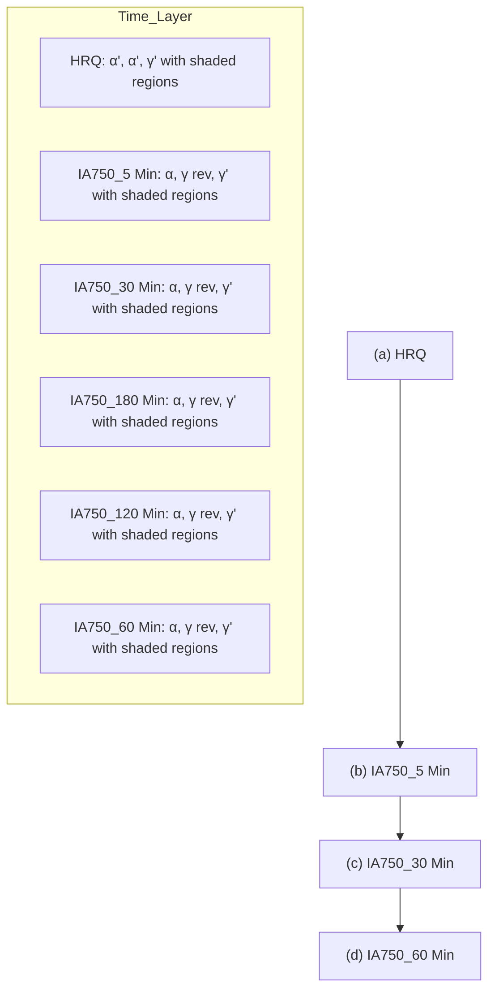

Full Length Article

# Phase transformation and austenite stability during thermomechanical processing of high (\~5%) Al added low-density medium Mn steel

Mukesh Kumar Yadav , Deepak Kumar , Navanit Kumar , Tapas Kumar Bandyopadhyay D

Department of Metallurgical and Materials Engineering, Indian Institute of Technology Kharagpur 721302, India

# A R T I C L E I N F O

Keywords:

Al added medium Mn steel

Delta ferrite

Austenite stability

Phase transformation

Stacking fault energy

# A B S T R A C T

In this study, a high Al added low-density medium Mn steel has been developed by conventional melting casting route in an open-air induction furnace, followed by hot forging and hot rolling in the temperature range of 1050- 800◦C. Finally, it has been intercritically annealed at 750◦C for 5, 30, 60, 120, and 180 minutes. The microstructural analysis shows the presence of dual-phase microstructure of delta ferrite and austenite in cast as well as hot forged specimens. While some of the austenite has been transformed to martensite (lenticular shape) in rolled specimen due to a higher cooling rate (water quenching) immediately after hot rolling. After 5 minutes of annealing, needle shape of reverted austenite and intercritical ferrite forms from martensite. As the annealing time increases to 30 minutes, the reverted austenite coalesces and undergoes further transformation into ferrite. This results in the formation of reverted austenite with needle and globular morphologies at 60 minutes of annealing. This annealing condition reveals the optimum mechanical stability due to its morphology and chemical composition, resulting in enhanced TRIP effect as compared to other annealing conditions. Further increase in annealing time to 120 and 180 minutes, volume fraction of reverted austenite decreases significantly due to more dissolution of reverted austenite to intercritical ferrite, leading to reduced TRIP effect. Specimen annealed for 60 minutes, possessing optimal mechanical stability of austenite, exhibits tensile properties with an ultimate tensile stress of 658.45±6 MPa and total elongation of 12±0.95 $\% ,$ attributed to enhanced TRIP effect.

# Introduction

In recent years, demand for advanced high strength steels (AHSSs) in structural parts of automobiles has been increasing continuously due to its high strength and ductility combination [1]. The stringent global environmental regulation on $\mathrm { C O } _ { 2 }$ emission, force the automobile industries to further reduce the weight of automobiles to improve fuel efficiency [2–4]. In this regard, the medium-Mn steels, $\mathtt { a 3 ^ { r d } }$ generation AHSS are currently best suited as compared to $1 ^ { \mathrm { s t } }$ and $2 ^ { \mathrm { n d } }$ generation AHSS [1,5]. These steels possess the Mn content in the range of 3-12 weight percentage (wt.%). Apart from that, lightweight elements such as Al and Si are also added in order to reduce its density. It is observed that, one of the most practical ways to reduce the density of AHSSs is to increase the addition of Al. Typically, addition of 1 wt.% aluminum (Al) in Fe-Mn-Al-C alloy reduce its density by \~1.5% [2,6]. Thus, currently researchers are focusing on the development of low-density medium Mn steel by adding high amount of Al to the alloy.

The medium Mn steel possess an excellent strength-ductility combination, in the range of 30000-50000 MPa% [7,8]. Generally, it possesses dual phase microstructure of ferrite and austenite. The addition of Al and Si, stabilize the ferrite phase in the microstructure, whereas the Mn and $\mathrm { C } ,$ stabilize austenite phase. However, thermomechanical processing may lead to further transformation of austenite to martensite depending on its thermal and mechanical stability. Further, the addition of high Al and or Si (≥ \~3 wt.%) in Fe-Mn-Al-C alloys may leads to formation of delta ferrite in the microstructure [5, 9,10]. Its high volume fraction in the steel may lead to lower tensile strength and work hardening rate [3,9]. The combination of high strength and ductility of medium Mn steel are mainly derived from transformation-induced plasticity (TRIP) effect that further depends on the mechanical stability of retained/reverted austenite [11]. The chemical composition, grain size, morphology and stress state of retained/reverted austenite are the major factor that affect the mechanical stability of austenite [12,13]. Therefore, understanding the effect of these factor on mechanical stability of austenite is important in Al added low density medium Mn steel. Generally, the two type of deformation mechanism, transformation-induced plasticity (TRIP) and twinning induced plasticity (TWIP) is responsible for high strength-ductility combination in medium Mn steel [2]. The occurrence of these deformation mechanism further depends on stacking fault energy (SFE) of austenite phase in the Fe-Mn-Al-C alloy. The TRIP occurs in medium Mn steel having SFE <20 mJ/m2 ,while TWIP follows in the range of 20-40 mJ/m2 [14,15]. SFE mainly depends on the chemical composition of the alloys. Further, processing temperature, grain size and micro segregation of alloying elements (Suzuki effect) also affect the SFE of austenite [16]. It is reported that the addition of Al increases the SFE of austenite drastically compared to other alloying elements in Fe-Mn-Al-C system [17]. Hence, the addition of Al plays a vital role in deciding the deformation mechanism in medium Mn steel. In that regard, Cai et al. [18] have reported the combined deformation mechanism of TRIP and TWIP in Fe-11Mn-6Al-0.2C steel despite of having high Al addition (i.e. high SFE of austenite). The TRIP and TWIP deformation mechanisms have been reported in the Fe-Mn-Al-C alloys having, even, SFE of 53 mJ/m2 , although this is best suited for partial and perfect dislocation gliding [17,19]. These studies suggested that the deformation mechanism in Fe-Mn-Al-C alloys, may not only depends on SFE but also depends on other factors such as thermo mechanical treatment. Many researchers also suggested that the addition of higher fraction (generally,≥5%) of Al in medium Mn steel may promote the precipitation of kappa (k)-carbide [20–22]. However, it is observed that nano-scale k-carbide may even form in 2.85 wt.% Al containing medium-Mn steel [14], too. It is reported that precipitation of intergranular k-carbide is major reason behind reduced ductility. On the contrary, some researchers have not observed the k-carbide in similar composition of the steel [18,23,24]. This shows that the combination of alloy composition, thermomechanical processing and heat treatment of that steel decide the precipitation of k- carbide [25].

Studies and background suggest that adding high Al to medium Mn steel is a viable option to further reduce its density. However, there are many factors that may deteriorate the mechanical properties of lowdensity medium Mn steel, like the presence of delta (δ) ferrite, precipitation of k-carbide and deformation mechanism in the alloys etc. Therefore, present work aims to develop the low-density high Al (\~5 wt. %) added medium Mn steel using basic thermomechanical processing route and study the phase transformation behavior, microstructural details, and mechanical properties of the developed steel. Further, the deformation mechanism along with phase transformation and austenite stability with respect to thermomechanical processing and intercritical annealing is required to be correlated with properties.

# Materials and method

The proposed/designed Al added low density Fe-8Mn-5Al-0.2C (wt. %) medium Mn steel has been developed by melting-casting route in an open-air induction furnance (Power Trak 250-10 R Inductotherm). The final chemical composition of the developed steel has been measured using XRF (X-ray fluorescence) and OES (optical emission spectroscopy), as presented in Table 1. The cast ingot has been homogenized at 1100 ◦C for 2hr and hot forged to 50% thickness reduction in the temperature range of 1050-800 ◦C following air cooling to room temperature. Hot forged samples have been further hot rolled (soaking, 1100 ◦C, 2hr) in the temperature range of 1050-800 ◦C in two passes (reheating at 1100 ◦C, for 5 min in between passes) with 50% thickness reduction in each pass followed by finally water quenching to room temperature from finish rolling temperature. Surface machining up to 1 mm depth on both side of hot rolled sheet has been done to remove the oxides layer formed on the surface. The hot rolled sheet having thickness of 3 mm has been intercritically annealed at 750 ◦C (IA750) for different duration of annealing time (i.e. 5, 30, 60, 120 and 180 minutes), followed by air cooling to room temperature. The schematic of the thermomechanical processing after casting has been presented in Fig. 1a. The intercritical annealing temperature has been decided based on dual/duplex phase region (i.e. ferrite and austenite) of equilibrium phase fraction plot derived using the thermodynamic software Thermo-Calc as shown in Fig. 1b. The detailed analysis has been given in alloys design section.

Table 1 Chemical composition (wt.%) of Al added medium Mn Steel

<table><tr><td>Fe</td><td>Mn</td><td>Al</td><td>Si</td><td>C</td><td>P</td><td>S</td></tr><tr><td>Bal.</td><td>7.79</td><td>4.88</td><td>0.84</td><td>0.2</td><td>0.03</td><td>0.03</td></tr></table>

The specimens for microstructural characterization have been prepared using standard metallography techniques followed by final colloidal polishing (grain size 0.25 µm). The specimens have been etched by Villella’s Reagent (5 ml HCL+1gm Picric acid+100 ml Ethanol) for 10-15 sec. To investigate the phase presents in the developed steel, XRD has been carried out using Bruker D8 advanced X-ray diffraction instrument equipped with Co-Kα (1.79Å) target with step size of 0.02⁰ and 2θ in the range of 20⁰-120⁰. The microstructural analysis of specimens has been carried out using the optical microscopy (Leica) and Field Emission Gun Scanning electron microscope (ZEISS VP 300). The elemental analysis of individual phase has been investigated by scanning electron microscope (ZEISS VP 300) equipped with Energy Dispersive Xray analysis (EDAX). At least 5-7 areas and 15-20 spots have been taken for elemental mapping of each phase and average of that has been reported with standard deviation. The Electron Back scattered diffraction (EBSD) has been carried out on FEG-SEM (ZEISS VP 300) equipped with EBSD camera operating at 20 kV and step size of 0.5µm. The post processing of EBSD analysis has been carried out in TSL-OIM software. The microstructural characterization of annealed sample has been further examined by high-resolution transmission electron microscopy (HRTEM) (Model: Talos F200X G2) and Atom probe tomography (APT). The sample for HRTEM has been prepared by thinning down to 70-80 µm using silicon carbide papers followed by punching (3 mm disc), dimpling and ion milling. The APT has been done using 3D Atom Probe Microscope. The tip for atom probe microscopy has been prepared by focused ion beam (FIB). The APT has been performed on CAMECA (LEAP 5000XR) with pulse energy of 40 pJ, pulse rate of 200 kHz, detection rate 0.50% and specimen temperature of 60 K.

A dilatometry test has been performed on hot-forged specimen to know critical transformation temperatures using a BAHR DIL 850 dilatometer. Cylindrical sample of 4 mm diameter and 10 mm length has been prepared with the help of wire EDM. The Heating rate, holding temperature, holding time and cooling rate have been taken as 10◦C/s, 1000◦C, 5/15 minutes, and 1◦C/s, respectively. The mechanical properties of the samples have been evaluated by tensile test and hardness test. The tensile test has been carried out on INSTRON (UTM-100 kN) at room temperature using a strain rate of $2 . 6 7 { \times } 1 0 ^ { - 4 } s ^ { - 1 }$ . The tensile test samples have been prepared following the ASTM E8/E8M standard for subsize specimens. The tensile samples have been machined by wire EDM along the rolling direction. At least three samples have been tested for minimal measurement error and average values have been reported. The nano hardness has been carried out on Anton Paar (NHT1000038550) using a diamond Berkovich tip indenter (B-T 50) having tip radius and tip angle of 100 nm and 142.3⁰ respectively. The linear loading rate, unloading rate, and dwell time have been selected as 60 mN/min, 60 mN/min, and 10 seconds, respectively. The indentation load has been set to 30 mN.

# Results & Discussion

# Alloy design

The developed steel has been designed based on the stacking fault energy (SFE) in the range of 20- 40 mJ m− 2 . It shows the TWIP as a major deformation mechanism. The SFE of the developed steel has been calculated based on the thermodynamic model proposed by Olson and Cohen that include the variables of grain size, temperature and alloys composition [14,26].

line

| Time              | Temperature, °C |
| ----------------- | --------------- |
| Homogenization    | 1100            |
| Hot forging       | 2hr             |
| Hot rolling       | 1100            |
| Water quenching   | 2hr             |
| Intercritical Annealing | 5-180 Min      |
| Intercritical Annealing | 750°C        |
| Air cooling       | -               |

line

| Temperature (°C) | BCC_A2 | FCC_A1 | LIQUID | KAPPA_E21 | Cementite | M23C6 | CUB_A13 | FE8S12C | CBCC_A12 |
| ---------------- | ------ | ------ | ------ | --------- | --------- | ----- | ------- | ------- | -------- |
| 0                | 0.9    | 0.0    | 0.0    | 0.0       | 0.0       | 0.0   | 0.0     | 0.0     | 0.0      |
| 200              | 0.9    | 0.0    | 0.0    | 0.0       | 0.0       | 0.0   | 0.0     | 0.0     | 0.0      |
| 400              | 0.9    | 0.0    | 0.0    | 0.0       | 0.0       | 0.0   | 0.0     | 0.0     | 0.0      |
| 600              | 0.7    | 0.3    | 0.0    | 0.0       | 0.0       | 0.0   | 0.0     | 0.0     | 0.0      |
| 800              | 0.5    | 0.5    | 0.0    | 0.0       | 0.0       | 0.0   | 0.0     | 0.0     | 0.0      |
| 1000             | 0.5    | 0.5    | 0.0    | 0.0       | 0.0       | 0.0   | 0.0     | 0.0     | 0.0      |
| 1200             | 0.6    | 0.4    | 0.0    | 0.0       | 0.0       | 0.0   | 0.0     | 0.0     | 0.0      |
| 1400             | 1.0    | 0.1    | 1.0    | 0.0       | 0.0       | 0.0   | 0.0     | 0.0     | 0.0      |
| 1600             | 1.0    | 1.0    | 1.5    | 1.5       | 1.5       | 1.5   | 1.5     | 1.5     | 1.5      |

line

| Temperature (°C) | Change in Length (5 min. holding time) | Change in Length (15 min. holding time) |
| ---------------- | -------------------------------------- | --------------------------------------- |
| 0                | 0                                      | 0                                       |
| 600              | 100                                    | 100                                     |
| 1000             | 180                                    | 180                                     |

Fig. 1. (a) Schematic of thermomechanical processing after casting, (b) Thermo-Calc equilibrium phase fraction plot, (c) Dilatometry heating-cooling curve of hot forged sample.

$$
\gamma_ {\mathrm{SFE}} = 2 \rho \Delta \mathrm{G} ^ {\gamma \rightarrow \varepsilon} + 2 \sigma^ {\gamma / \varepsilon} \tag {1}
$$

Where $\gamma _ { \mathrm { S F E } }$ is the SFE of austenite, $\Delta \mathsf { G } ^ { \gamma \to \varepsilon }$ is Gibbs free energy changes during γ to ε phase transformation, $\sigma ^ { \gamma / \varepsilon } .$ - interfacial surface energy between γ/ε phases, ρ is the molar surface density of a closed packed plane (mol/area) given as

$$
\rho = \frac {4}{\sqrt {3}} \frac {1}{a _ {0} ^ {2} N} \tag {2}
$$

Where N is Avogadro’s number, a is the lattice parameters of austenite calculated by composition dependent equation given as

$$
a _ {0} = 3. 5 9 4 5 + 0. 0 0 1 2 5 (\% M n - 2 0) + 0. 0 0 5 9 4 (\% A l) + 0. 0 2 7 2 (\% C) \tag{3}
$$

Gibbs free energy is given as

$$
\Delta G ^ {\gamma \rightarrow \varepsilon} = \Delta G _ {c h e m} ^ {\gamma \rightarrow \varepsilon} + \Delta G _ {m a g} ^ {\gamma \rightarrow \varepsilon} + \Delta G _ {e x} ^ {\gamma \rightarrow \varepsilon} \tag {4}
$$

Where $\Delta G _ { c h e m } ^ { \gamma  \varepsilon } , \Delta G _ { m a g } ^ { \gamma  \varepsilon }$ and $\Delta G _ { e x } ^ { \gamma \to \varepsilon }$ are molar Gibbs Free energy changes due to compositional difference, Gibbs Free energy changes due to magnetic transition and excess Gibbs free energy changes due to grain size (initially we assume as finer grain of austenite, 40 µm [26]) respectively.

Based on reported literatures [27–33], values of above thermodynamic parameters has been calculated. The obtained value of the following thermodynamics parameters, $\Delta G _ { c h e m } ^ { \gamma  \varepsilon } , \ \Delta G _ { m a g } ^ { \gamma  \varepsilon }$ and $\Delta G _ { e x } ^ { \gamma  \varepsilon }$ are 245.267 J/mole, 0.0029319 J/mole and, 19.6842 J/mole respectively. The molar surface density ρ and interfacial surface energy has been obtained as $2 . 9 3 2 8 { \times } 1 0 ^ { - 5 }$ mo $/ \mathbf { m } ^ { 2 }$ and 10 mJ m− 2 respectively. Generally, the interfacial energy has been reported by the various researchers are in the range of $_ { 5 - 1 5 }$ mJ $\mathbf { m } ^ { - 2 } .$ . Hence, average of that has been considered for calculation of SFE. The theoretical SFE of the designed steel is calculated as \~35 mJ $\mathbf { m } ^ { - 2 }$ . The same lies within the range of 20- 40 mJ $\mathbf { m } ^ { - 2 } .$

In addition, the Thermo-Calc equilibrium phase fraction plot has been generated (Fig. 1b) by using computational software Thermo-Calc (database: TCFE9) to predict critical temperatures and phase fraction. Fig. 1b shows the existence of BCC phase remains in the alloys during cooling from the liquid state $( > \sim 1 5 0 0 ^ { \circ } \mathrm { C } )$ to room temperature. This shows that equilibrium transformation sequence is L → L+δ → L+δ+γ → $\gamma { + } 8 .$ Therefore, the delta ferrite remains in the structure during subsequent cooling to room temperature. However, its fraction may vary along the temperature. The duplex region i.e. ferrite (δ) + austenite (γ) has been measured to be in the range of $\sim 6 5 0 \ ^ { \circ } \mathbf { C } \ \mathrm { t } 0 \sim 1 3 5 0 \ ^ { \circ } \mathbf { C } .$ . The presence of approximately 5 wt.% Al in the designed steel prevents complete austenitization during heating and is also known to enhance the stability of delta ferrite [3]. Considering the dual-phase region temperature, an intercritical annealing temperature of $7 5 0 ^ { \circ } \mathrm { C }$ has been chosen for the designed steel. Approach to define critical temperatures and to select intercritical annealing temperature is shown by us elsewhere [3]. Further, in order to correlate the theoretically calculated critical temperature to actual critical temperature, the dilatometry test has been conducted on the forged sample. The dilatometry curve (Fig. 1c) shows that there is no significant deviation/hump in the change in length during heating and cooling. The only slight deviation during heating and cooling at around \~600◦C has been observed as marked by black ellipse in Fig. 1c. This shows that at this temperature (\~600◦C) during heating, there may be the dissolution of carbide and or cementite present, if any, as per thermo-Calc equilibrium phase diagram. However, there may be chance of dissolution of ferrite too. The same has been analyzed further. Significant changes in dilatation curve appears if noticeable and good amount of ferritic phase transforms to austenitic phase during heating. Generally, significant amount of transformation of ferritic phase into austenitic phase leads to observable contraction in length during dilatation experiment. The same is observed in steels having austenite as single phase at higher temperature. In these steels, austenite transforms to lower transformation product (pearlite or martensite or bainite) during cooling after thermo-mechanical treatment that again revert back to austenite upon heating showing higher contraction in length [34,35]. In duplex steels having very less amount of δ-ferrite as one of the microstructural constituents due to low amount of Al and remaining constituent is comprised of mixture of ferritic (martensite or bainite) and austenitic phases. Such steels generally show relatively low contraction in dilatation curve because of presence of low amount of ferritic phases that dissolves and/or transforms to austenite during heating [14,36]. However, in the present steel, austenite phase does not transform to lower temperature transformation product. Thus, insignificant dissolution of ferritic phase i.e. δ-ferrite may have provided very little deviation during heating. In next section, it can be seen that austenite has not decomposed in α- ferrite phase or martensite at room temperature (RT) after hot forging. Hence, dilatation curve shows insignificant contraction in length.

Adding Al to the developed steel results in a significant increase in the SFE of the alloy, but reduces their density as well [2,26,37]. Based on Archimedes’ principle, the developed steel has a density of 6.91455 g/cc. Reduction in density (\~11.35%) as compared to conventional steel (approx. 7.8g/cc) has been achieved by addition of \~5(wt.%) Al and \~1 (wt.%) of Si [38].

# Microstructural Characterization

Initially XRD analysis has been conducted on samples after casting and hot forging to identify the major phases present in the developed steel. XRD plots as depicted in the Fig. 2a, show the presence of ferrite and austenite in both cast as well as hot forged specimen. Initially we assume ferrite as δ-ferrite based on the Thermo-Calc equilibrium phase fraction plot (Fig. 1b). The optical images as shown in Fig. 2(b-e) confirm the presence of dual phase microstructure in cast as well as hot forged specimen. Further, the SEM and EBSD phase maps superimposed on image quality map (Fig. 2f,g) of forged sample confirms the individual phases of austenite (mostly elongated) in the ferrite (δ) matrix. It has been observed that the austenite in the cast specimen has dendritic type structure (indicated by blue arrow in Fig. 2b,c). It is presumed that the dendrites formed during solidification will be dissolved during soaking at high temperature before hot forging. However, some of the dendritic structure is still visible in hot forged specimen (indicated by blue arrow in Fig. 2e) may be due to insufficient soaking and dissolution before hot forging. The volume fraction of phases has been calculated by rietveld refinement using XRD data [14]. This shows \~26% and \~29% (volume %) of austenite in cast and forged sample, respectively. It represents that there is not much variation in austenite fraction in cast as well as hot forged specimen. However, there may be some elemental partitioning during soaking at higher temperature that may increase the stability of austenite phase. Therefore, the hot forged sample contain slightly (\~3%) higher volume fraction of austenite compare to cast sample.

Literature [3,39] suggested that the presence of δ-ferrite accelerates the C and Mn diffusion into austenite. Therefore, higher fraction of δ-ferrite \~70 (volume%) may stimulate elemental partitioning at isothermal holding and increase the stability of austenite in the developed steel. Moreover, microstructural analysis provide evidence that austenite has not decomposed into low-temperature transformation product after hot forging. Ferrite that is present in the alloy has been formed during solidification itself and has not been consumed by austenite due to addition of high Al content [10,17,37]. Thus, it can be presumed that XRD analysis showing ferrite phase is δ-ferrite.

Fig. 3(a) shows the optical micrograph of hot rolled & quenched (HRQ) specimen. Dendritic structures are completely eliminated in HRQ sample (Fig. 3a), due to further soaking at higher temperature. In addition, grains of both phases are elongated in the rolling direction due to rolling effect. Water quenching of hot-rolled sample from rolling finish temperature (i.e. \~800◦C) leads to transformation of some parts of austenite into martensite (lenticular shape) as shown in Fig. 3b [40,41]. The differential interference contrast (DIC) image inserted into Fig. 3a, also confirm the same. It has been further verified by the EBSD phase map superimposed on IQ map as shown in Fig. 3d. The martensite start temperature (\~350◦C) calculated according to empirical equation given in [4,42] also supports the transformation of austenite to martensite due to water quenching. Remaining austenite after water quenching is called as untransformed austenite, hereafter. The elemental analysis of HRQ sample (Fig. 3c), exhibits the Mn and Al concentration in δ ferrite phase as 7.02±0.25 (wt.%) and 5.61±0.11 (wt.%) respectively, whereas in austenite/martensite phase the Mn and Al concentration are 8.36±0.16 (wt.%) and 4.75±0.11 (wt.%) respectively. This shows the enrichment of Mn and Al in austenite/martensite and δ ferrite phases, respectively.

The HRQ specimen has been subsequently annealed at 750◦C for 5, 30, 60, 120 and 180 minutes, denoted by IA750\_5 Min, IA750\_30 Min, IA750\_60 Min, IA750\_120 Min, and IA750\_180 Min, respectively. The microstructure along with EDAX analysis of all specimens has been presented in the Fig. 4. It has been observed that the structure/ morphology of δ-ferrite remains unchanged after intercritical annealing that confirm the presence of highly stable δ-ferrite (Fig. 3, Fig. 4). The martensite (previously formed in rolled and quenched specimen) has been started dissolving/transforming into intercritical ferrite (α), and needle shape reverted austenite in IA750\_5 Min specimen (represented by red arrow in Fig. 4A2) [43]. The length (major axis) and width (minor axis) of the needle shape of reverted austenite has been measured to be

Fig. 2. (a) x-ray diffraction plot of cast and hot forged specimens (diffraction angle,2θ), (b,c) optical images of cast specimen, (d,e) optical images of hot forged specimen, (f) scanning electron microscopy image of hot forged specimen (g) EBSD phase map superimposed on image quality (IQ) map (δ- delta ferrite, γ- austenite).

Fig. 3. (a) Optical microscopic image (insert: differential interference contrast (DIC) image), (b) scanning electron microscopy image, (c) EDS analysis, (d) EBSD phase map superimposed on IQ map of hot rolled & quenched specimen (ά-martensite, γ-austenite, δ-delta ferrite, RD- rolling direction, ND- normal direction)

2.829±0.30 µm and, 0.350±0.20 µm, respectively. The elemental analysis of IA750\_5 Min specimen (Fig. 4A3), shows that there is not much variation of Al and Mn concentration in δ ferrite and untransformed austenite (marked by white arrow in Fig. 4A1) compared to rolled and quenched specimen. The EDS analysis (Fig. 4A3) of needle shape reverted austenite and α-ferrite region (represented by yellow plus sign in Fig. 4A2) shows the Mn and Al concentration are 8.30±0.20 and 4.43±0.05 (wt.%), respectively. This is close to elemental percentage in untransformed austenite region. Due to the short intercritical annealing time (i.e., 5 minutes), significant elemental partitioning may not occur during the process. However, at 30 minutes (Fig. 4B1), the fraction (area fraction) of this reverted austenite has been decreased compare to IA750\_5 Min specimen. This represents that there is dissolution of reverted austenite into intercritical ferrite (α-ferrite). Thus, fraction of α-ferrite increases and reverted austenite decreases. With a further increase in annealing time to 60 minutes, more reverted austenite dissolves into intercritical ferrite (α-ferrite), as shown in Fig. 4C2. This has been confirmed from austenite fraction from XRD analysis as shown in Fig. 7(c). It can be seen that with increase in annealing time, austenite fraction decreases. The length (major axis) and width (minor axis) of the needle shape of reverted austenite has been measured to be 1.42±0.16 µm and, 0.345±0.40 µm in IA750\_60 Min specimen. Moreover, the aspect ratio (width to length) of needle shape reverted austenite has been increasing as annealing time increases (Fig. 4A2, Fig. 4C2). This leads to formation of globular shaped reverted austenite, too. Therefore, needle shape along with some of globular shape of reverted austenite in IA750\_60 Min specimen (represented by red circle in Fig. 4C2) is observed. The Mn and Al present in reverted austenite start partitioning at the grain boundary of untransformed austenite during isothermal holding [44]. Therefore, the remaining Mn lean reverted austenite transforms to intercritical ferrite. The EDAX analysis of these adjacent

untransformed austenite shows Mn and Al concentration are 9.83±0.37 (wt.%) and 4.04±0.13 (wt.%), respectively (labeled by yellow plus sign in Fig. 4C3). In contrast, the EDAX analysis of the needle-like and globular-shaped reverted austenite shows Mn and Al concentrations of 7.58 ± 0.14 wt.% and 3.96 ± 0.15 wt.%, respectively (indicated by the red star in Fig. 4C3). This supports the hypothesis that the needle-like and globular-shaped reverted austenite are Mn-lean compared to the adjacent untransformed austenite. Furthermore, the IA750\_120 Min specimen shows few needle and globular types of reverted austenite as shown in Fig. 4D2, which has been almost completely dissolved into intercritical ferrite (α) in the IA750\_180 Min specimen, resulting in the presence of mostly intercritical ferrite (α) and untransformed austenite (Fig. 4E2). The EDAX analysis of the IA750\_180 Min (Fig. 4E3) specimen reveals the enrichment of Mn and C in untransformed austenite, confirming the partitioning of Mn from needle/globular reverted austenite. It is notable that no significant changes in elemental distribution of δ-ferrite in rolled as well as annealed specimens (Fig. 3c, Fig. 4(A3, B3, C3, D3, and E3)) is observed. This supports the formation of highly stable δ-ferrite during solidification, probably due to the presence of high aluminum and silicon.

# Mechanical Properties

To correlate the microstructure with mechanical behaviour, nanoindentation test has been conducted on HRQ and intercritical annealed for 5 and 60 minutes specimens. The nano hardness of ferrite (δ) and untransformed austenite is measured to be 4439±206 and 4080 ±360 MPa for HRQ specimen at room temperature. In contrast, the nano hardness of martensite is measured to be 8897±550 MPa. The hardness of martensite is almost two times higher than the untransformed austenite. The load-displacement curve (Fig. 5(A2-A3)) indicates a maximum penetration depth of \~550 nm for untransformed austenite, representing it as a relatively softer phase compared to martensite (α׳(, which exhibits a penetration depth of \~384 nm under the same load condition (30 mN). The hardness of δ-ferrite in IA750\_5 Min and IA750\_60 Min specimens have been measured as 4267±264 MPa and 4150±200 MPa, respectively. This shows that hardness of δ-ferrite does not vary significantly with annealing as compared to HRQ specimen. Furthermore, the nano hardness of untransformed austenite also does not change with annealing, as compared to hot-rolled and quenched specimens, as represented in Table 2. Reverted austenite region of IA750\_5 Min specimen has a nano hardness of 3867±110 MPa. It confirms the dissolution of martensite (hardness \~8897±550 MPa) into needle shape of reverted austenite during initial 5 minutes of annealing. Further increases in annealing time to 60 minutes, the hardness of reverted austenite has been slightly reduced to 3478±334 MPa, may be

text_image

(A1)
IA 750_5 Min
δ
α/γ
10 µm

natural_image

Microscopic view of fibrous material structure with red and yellow highlights, scale bar 2 μm (no text or symbols)

line

| Element | Value       |
|---------|-------------|
| Al (wt%) | 5.37±0.05   |
| Mn (wt%) | 7.09±0.09   |
|        | 4.50±0.14   |
|        | 8.07±0.11   |
|        | 4.43±0.05   |
|        | 8.30±0.20   |
|        | 0.21K       |
|        | 0.63K       |
|        | 0.42K       |
|        | 0.21K       |
|        | 0.00K       |
|        | 1.05K       |
|        | 1.25K       |
|        | 1.47K       |
|        | 1.68K       |
|        | 1.89K       |
|        | 2.10K       |
|        | 2.10K       |
|        | 2.10K       |
|        | 2.10K       |
|        | 2.10K       |
|        | 2.10K       |
|        | 2.10K       |
|        | 2.10K       |
|        | 2.10K       |
|        | 2.10M       |
|        | 2.10M       |
|        | 2.10M       |
|        | 2.10M       |
|        | 2.10M       |
|        | 2.10M       |
|        | 2.10M       |
|        | 2.10M       |
|        | 2.10M       |
|        | 2.10M      |
|        | 2.10M       |
|        | 2.10M       |
|        | 2.10M       |
|        | 2.10M       |
|        | 2.10M       |
|        | 2.10M       |
|        | 2.10M       |
|        | 2.10M       |
|        | 2.10M       |

text_image

(B1)
IA 750_30 Min
δ
α/γ
10 µm

natural_image

Microscopic image showing a textured surface with scattered particles and a scale bar of 2 μm (no text or symbols present)

line

| Element | Value       |
|---------|-------------|
| Al (wt%) | 5.76±0.01   |
| Mn (wt%) | 6.95±0.03   |
| Mn      | 8.21±0.24   |
| Fe      | 6.26±0.15   |

text_image

(C1)
IA 750_60 Min
á/γ
δ
20 µm

natural_image

Microscopic view of fibrous material with scattered yellow and red dots, labeled (C2), showing no text or symbols.

line

(C3)
| Element | Element (wt%) | Intercritical ferrite | Untransformed austenite | Reverted austenite |
|---|---|---|---|---|
| Al | 5.25±0.1 | 5.08±0.22 | 4.04±0.13 | 3.96±0.15 |
| Mn | 7.44±0.4 | 6.50±0.17 | 9.83±0.37 | 7.58±0.14 |
| Si | | | | |
| Mn | | | | |
| Fe | | | | |

text_image

(D1)
IA 750_120 Min
δ
α/γ
10 µm

natural_image

Microscopic view of fibrous material structure with red and blue markers, scale bar 5 μm (no text or symbols)

line

| Element | Value       |
|---------|-------------|
| Al (wt%) | 5.63±0.10   |
| Mn (wt%) | 6.65±0.23   |
| Untransformed austenite | 4.64±0.10    |
| Intercritical ferrite | 6.54±0.08   |

text_image

(E1)
IA 750_180 Min
δ
α/γ
ND
RD
20 µm

natural_image

Microscopic surface texture image with labeled points (E2) and a 5 μm scale bar, showing no readable text or symbols beyond labels.

line

| Element | Wavelength (wt%) | Intensity |
|---------|------------------|---------|
| Al      | 5.85±0.03        | 4.66±0.06|
| Mn      | 6.62±0.22        | 9.42±0.10|
| Untransformed austenite | -              | -          |
| Intercritical ferrite | -            | 7.95±0.25 |

Fig. 4. Scanning electron microscopy images and corresponding EDS analysis of samples annealed at 750◦C for (A1-A3) 5 minutes, (B1-B3) 30 minutes, (C1-C3) 60 minutes, (D1-D3) 120 minutes, (E1-E3) 180 minutes (ά-tempered martensite, γ-austenite, δ-delta ferrite, RD- rolling direction, ND- normal direction)

due to further dissolution of reverted austenite into α-ferrite.

Fig. 6 represents the mechanical properties of the developed steel during tensile loading. The engineering stress-strain curves of HRQ and intercritical annealed at 750◦C for 5, 30, 60, 120, 180 minutes specimens is represented in the Fig. 6(A1). The corresponding tensile properties have been presented in Table 3. The HRQ sample exhibits highest yield strength (YS), ultimate tensile strength (UTS) and lowest total elongation (TE) of 486±6 MPa, 674±20 MPa and 1.5±0.5 % respectively, mainly due to presence of hard martensite along with retained austenite and δ-ferrite in the microstructure (Fig. 3b). IA750 \_5 Min specimen shows slightly lower YS and UTS, whereas slightly increased in TE compared to hot rolled & quenched specimen. This is mainly due to the dissolution of martensite into intercritical ferrite and the needle shape of reverted austenite, as shown in Fig. 4A1. Annealing for 5 minutes reduce the dislocation density [45,46] in the microstructure, resulting in slightly lower stress and formation of reverted austenite may contribute to increase to TE as compared to HRQ specimen. However, elemental partitioning is not significant after 5 minutes of annealing (Fig. 4) and it shows similar trends till the 30-minute annealing, with only a slight increase in UTS and TE observed. However, as the annealing time increases to 60 mins, IA750\_60 Min specimen shows UTS of 658.45±6 MPa along with maximum TE of 12±0.95%. This could be due to the optimum stability of reverted austenite that is responsible for enhanced TRIP effect during tensile loading. Further increase in annealing temperature to 120 minutes, the YS, UTS and TE has been drastically reduced compared to IA750\_60 Min specimen. The microstructural analysis, as presented in Fig. 4D2, reveals that in IA750\_120

line

| Displacement (nm) | Load (mN) |
| ----------------- | --------- |
| 0                 | 0         |
| 100               | 2         |
| 200               | 6         |
| 300               | 12        |
| 400               | 18        |
| 500               | 30        |
| 600               | 30        |
| 700               | 30        |

line

| Displacement (nm) | Load (mN) |
| ----------------- | --------- |
| 0                 | 0         |
| 100               | 5         |
| 200               | 10        |
| 300               | 15        |
| 400               | 20        |
| 500               | 30        |
| 600               | 30        |
| 700               | 30        |

line

| Displacement (nm) | Load (mN) |
| ----------------- | --------- |
| 0                 | 0         |
| 100               | 5         |
| 200               | 10        |
| 300               | 15        |
| 400               | 20        |
| 500               | 30        |
| 600               | 30        |
| 700               | 30        |

line

| Displacement (nm) | Load (mN) - Blue Line | Load (mN) - Green Line | Load (mN) - Purple Line |
| ----------------- | --------------------- | ---------------------- | ----------------------- |
| 0                 | 0                     | 0                      | 0                       |
| 100               | ~5                    | ~5                     | ~5                      |
| 200               | ~10                   | ~10                    | ~10                     |
| 300               | ~18                   | ~18                    | ~18                     |
| 400               | ~30                   | ~30                    | ~30                     |

line

| Displacement (nm) | Load (mN) |
| ----------------- | --------- |
| 0                 | 0         |
| 100               | 2         |
| 200               | 6         |
| 300               | 12        |
| 400               | 18        |
| 500               | 25        |
| 600               | 30        |
| 700               | 30        |

line

| Displacement (nm) | Load (mN) |
| ----------------- | --------- |
| 0                 | 0         |
| 100               | 2         |
| 200               | 5         |
| 300               | 10        |
| 400               | 15        |
| 500               | 25        |
| 600               | 30        |
| 700               | 30        |

line

| Displacement (nm) | Load (mN) - Black Line | Load (mN) - Blue Line | Load (mN) - Red Line |
| ----------------- | ---------------------- | --------------------- | -------------------- |
| 0                 | 0                      | 0                     | 0                    |
| 100               | ~2                     | ~1.5                  | ~1.5                 |
| 200               | ~6                     | ~4                    | ~4                   |
| 300               | ~12                    | ~8                    | ~8                   |
| 400               | ~18                    | ~14                   | ~14                  |
| 500               | ~25                    | ~20                   | ~20                  |
| 600               | ~30                    | ~30                   | ~30                  |
| 700               | ~30                    | ~30                   | ~30                  |

line

| Displacement (nm) | Load (mN) |
| ----------------- | --------- |
| 0                 | 0         |
| 100               | 5         |
| 200               | 10        |
| 300               | 15        |
| 400               | 20        |
| 500               | 25        |
| 600               | 30        |
| 700               | 30        |

line

| Displacement (nm) | Load (mN) |
| ----------------- | --------- |
| 0                 | 0         |
| 100               | 2         |
| 200               | 6         |
| 300               | 12        |
| 400               | 18        |
| 500               | 28        |
| 600               | 30        |
| 700               | 30        |

Fig. 5. Load displacement curves of (A1-A3) hot Rolled & quenched (HRQ) specimen, intercritical annealed at 750 ◦C for (B1-B3) 5 minutes specimen, (C1-C3) 60 minutes specimen.

Table 2 Nano hardness of hot rolled & quenched (HRQ) and annealed specimens

<table><tr><td>Specimens Id</td><td>Ferrite (δ) (MPa)</td><td>Untransformed austenite (MPa)</td><td>Reverted austenite /Martensite (MPa)</td></tr><tr><td>Hot rolled &amp; quenched</td><td>4439±206</td><td>4080±360</td><td>8897±550</td></tr><tr><td>IA750_5 Min</td><td>4267±264</td><td>4351±575</td><td>3867±110</td></tr><tr><td>IA750_60 Min</td><td>4150±200</td><td>4196±324</td><td>3478±334</td></tr></table>

Min specimen, most of reverted austenite has been dissolved to intercritical ferrite (α), owing to a lower TRIP effect. Further increase in time to 180 minutes, dissolution of prior martensite has been almost completed in IA750\_180 Min specimen (Fig. 4E2). Hence, almost similar value of UTS and TE has been observed in both IA750\_180 Min and IA750\_120 Min specimen.

Fig. 6A2 shows true stress-strain curves of HRQ and annealed specimens. The corresponding work- hardening rate curves of IA750\_5 Min, IA750\_30 Min, IA750\_60 Min and, IA750\_180 Min specimens are presented in the Fig. 6(B1-B4). Each work hardening rate curve (WHR) of annealed specimen shows the two stages (S1,S2) of deformation. The stage, S1, represents deformation of δ-ferrite thus, decreasing sharply. Whereas in stage S2, the WHR decreasing linearly as increasing true strain due to simultaneous occurrence of softening and hardening (i.e. TRIP) effect. This is mainly associated with cooperative deformation of intercritical ferrite/untransformed austenite and reverted austenite [2, 38]. Additionally, it has been observed that there is difference in the mean value of WHR in stage S2 for annealed specimens. The IA750\_5 Min specimen shows mean WHR in between 1100-400 MPa. Whereas the IA750\_30 Min specimen has mean WHR in between 1700-1000 MPa. This shows that as the annealing time increases, WHR increases as the annealing time increases from 5 minutes to 30 minutes, resulting in increase in UTS and TE. The IA750\_60 Min shows the highest mean WHR in between 2000-1000 MPa. In IA750\_60 Min specimen, the reverted austenite may have optimum stability, leads to highest fraction of austenite transform into martensite during tensile loading, leading to enhanced TRIP effect (highest PSE). Further increase in annealing time to 180 min (IA750\_180 Min), the mean WHR has been again decreased to 1500-900 MPa, resulting in fracture at lower strain.

line

| Strain (%) | HR   | IA750_5 Min | IA750_30 Min | IA750_60 Min | IA750_120 Min | IA750_180 Min |
| ---------- | ---- | ----------- | ------------ | ------------ | ------------- | ------------- |
| 0          | 0    | 0           | 0            | 0            | 0             | 0             |
| 2          | 700  | 550         | 540          | 530          | 520           | 510           |
| 4          | 720  | 580         | 570          | 560          | 550           | 540           |
| 6          | 730  | 600         | 590          | 580          | 570           | 560           |
| 8          | 740  | 610         | 600          | 590          | 580           | 570           |
| 10         | 750  | 620         | 610          | 600          | 590           | 580           |
| 12         | 760  | 630         | 620          | 610          | 600           | 590           |
| 14         | 770  | 640         | 630          | 620          | 610           | 600           |

line

| True strain | HR   | IA750_5 Min | IA750_30 Min | IA750_60 Min | IA750_120 Min | IA750_180 Min |
| ----------- | ---- | ----------- | ------------ | ------------ | ------------- | ------------- |
| 0.00        | 450  | 450         | 450          | 450          | 450           | 450           |
| 0.02        | 720  | 580         | 560          | 590          | 540           | 520           |
| 0.04        | 720  | 620         | 600          | 630          | 580           | 560           |
| 0.06        | 720  | 640         | 620          | 650          | 600           | 580           |
| 0.08        | 720  | 660         | 640          | 670          | 620           | 600           |
| 0.10        | 720  | 680         | 660          | 690          | 640           | 620           |
| 0.12        | 720  | 700         | 680          | 710          | 660           | 640           |

line

| True strain | Work hardening rate (MPa) |
| ----------- | ------------------------- |
| 0.00        | 4000                      |
| 0.01        | ~1000                     |
| 0.02        | ~800                      |
| 0.03        | ~600                      |
| 0.04        | ~400                      |
| 0.05        | ~200                      |

line

| True strain | Work hardening rate (MPa) |
| ----------- | ------------------------- |
| 0.00        | 6000                      |
| 0.02        | 2000                      |
| 0.06        | 1000                      |
| 0.08        | 500                       |

line

| True strain | Work hardening rate (MPa) |
| ----------- | ------------------------- |
| 0.00        | 6000                      |
| 0.02        | 2000                      |
| 0.11        | 0                         |

line

| True strain | Work hardening rate (MPa) |
| ----------- | ------------------------- |
| 0.00        | 6000                      |
| 0.01        | 2000                      |
| 0.02        | 1500                      |
| 0.03        | 1800                      |
| 0.04        | 1200                      |
| 0.05        | 0                         |

Fig. 6. (A1) Engineering stress- strain curve, (A2) true stress strain curve of hot rolled and annealed specimens, working hardening rate curve of intercritical annealed at 750◦C for (B1) 5 minutes, (B2) 30 minutes, (B3) 60 minutes, (B4) 180 minutes specimens.

# Mechanical stability of austenite

The volume fraction of retained austenite (untransformed + reverted) before and after tensile deformation of HRQ and annealed specimen has been measured by rietveld analysis of XRD data. Fig. 7c represents the volume fraction of austenite before and after tensile test along with mechanical stability parameter (K) and transformation rate of austenite in HRQ and annealed specimens. The mechanical stability of austenite has been calculated by the Sugimoto’s model by following the eq (5) [3,

Table 3 Tensile properties of HRQ and annealed specimens

<table><tr><td>Sample Id</td><td>Yield Strength (MPa)</td><td>Ultimate tensile strength (MPa)</td><td>Total elongation (%)</td><td>PSE (GPa%)</td></tr><tr><td>Hot Rolled</td><td>486±6</td><td>674±20</td><td>1.5±0.5</td><td>1.01</td></tr><tr><td>IA750_5 Min</td><td>460±8</td><td>605±7</td><td>4.15±.80</td><td>2.5</td></tr><tr><td>IA750_30 Min</td><td>450±10</td><td>615±10</td><td>7±1</td><td>4.3</td></tr><tr><td>IA750_60 Min</td><td>465±10</td><td>658.45±6</td><td>12±0.95</td><td>7.9</td></tr><tr><td>IA750_120 Min</td><td>433±4.5</td><td>571±7</td><td>5±0.4</td><td>2.8</td></tr><tr><td>IA750_180 Min</td><td>427±6.5</td><td>570±6</td><td>5.5±0.5</td><td>3.1</td></tr></table>

\*PSE- product of ultimate tensile strength and total elongation.

14,47].

$$
\mathrm{K} \varepsilon = \ln \left(f _ {\gamma_ {0}} / f _ {\gamma}\right) \tag {5}
$$

where, parameter K represents the mechanical stability of austenite, $f _ { \gamma _ { 0 } }$ is the volume fraction of austenite before tensile test, $f _ { \gamma }$ volume fraction of austenite at true strain ε (i.e. after tensile test). A higher K value indicates lower mechanical stability of austenite and a greater driving force for its transformation into martensite, whereas a lower K value signifies higher mechanical stability of austenite and a reduced driving force for its transformation into martensite. The literatures [3,14] suggest that the K value varies from 0.5 to 8 for medium Mn steel.

The HRQ sample contains approximately 19% austenite. After tensile deformation, however, very marginal reduction to \~18% takes place. This shows the presence of very stable austenite that remains almost untransformed during the deformation process. This is probably due to the presence of δ-ferrite that accelerates the C and Mn diffusion into austenite, making austenite thermodynamically more stable. The K value (\~3.26) as calculated following the equation (5) denotes the higher mechanical stability of austenite which further supports the very stable austenite, therefore, \~5.5% austenite transformation results in lowest TE in the sample. The 5 minutes of annealing, however, results in the \~46% austenite volume fraction. This confirms the formation of \~27% of reverted austenite through dissolution of martensite as shown in Fig. 3 and Fig. 4. After tensile test the austenite fraction has been reduced to \~42%. This suggests that a portion of the austenite (reverted austenite) transforms into martensite during tensile loading, driven by the TRIP effect, as indicated by the transformation ratio of 8.7%. Here, K value decreased to approximately 1.93, indicating relatively higher mechanical stability compared to the HRQ specimen. Further increase in annealing time to 30 minutes, the austenite fraction has been decreased to \~40% in IA750\_30 Min specimen. This supports the microstructure (Fig. 4) observation that shows dissolution of needle shape reverted austenite into intercritical ferrite. The K (1.10) value of IA750\_30 Min specimen, suggested relatively higher mechanical stability. Moreover, the IA750\_60 Min specimen exhibits approximately 35% austenite, indicating a further reduction in the retained austenite fraction. During this process, some of the reverted austenite transforms into a globular morphology. This austenite region becomes Mn-lean, as observed in the microstructure (Fig. 4C2). The IA750\_60 Min specimen has Mn lean needle and globular shape of reverted austenite. Therefore, it would have optimum mechanical stability. The K (\~1.92) value of IA750\_60 min specimen supports this claim. Further, it also presents highest transformation ratio (\~20%) of austenite during tensile loading. This supports the tensile results of highest PSE in IA750\_60 Min specimen through enhanced TRIP effect [48]. Furthermore, increasing annealing time to 120 and 180 min, the austenite fraction has been again decreased to \~30%. This is mainly due to further dissolution of reverted austenite to intercritical ferrite as shown in Fig. 4D2. Hence, tensile result exhibits lower PSE in IA750\_120 Min and IA750\_180 Min specimen due to lower TRIP effect.

line

| 2θ(degree) | Intensity (a.u.) | Label        |
| ---------- | ---------------- | ------------ |
| ~50        | ~1.0             | γ₁₁₁         |
| ~55        | ~0.8             | γ₁₁₀         |
| ~60        | ~0.9             | γ₂₀₀         |
| ~70        | ~0.7             | α₂₀₀         |
| ~80        | ~0.6             | γ₂₂₀         |
| ~90        | ~0.5             | α₂₁₁         |
| ~100       | ~0.4             | γ₃₁₁         |
| ~110       | ~0.3             | γ₃₂₂         |

line

| 2θ(degree) | Intensity (a.u.) | Label        |
| ---------- | ---------------- | ------------ |
| ~45        | γ₁₁₁             | α₁₁₀         |
| ~55        | γ₂₀₀             | γ₂₀₀         |
| ~75        | γ₂₂₀             | α₂₀₀         |
| ~95        | γ₂₁₁             | α₂₁₁         |
| ~105       | γ₃₁₁             | γ₃₁₁         |
| ~115       | γ₂₂₂             | γ₂₂₂         |

line

| Time Interval     | YS   | UTS  | TE   | PSE  |
| ----------------- | ---- | ---- | ---- | ---- |
| Hot Rolled        | 485  | 680  | 1.5  | 1.0  |
| IA750_5 Min       | 460  | 600  | 4.0  | 3.0  |
| IA750_30 Min      | 445  | 620  | 6.0  | 5.0  |
| IA750_60 Min      | 465  | 660  | 12.0 | 10.0 |
| IA750_120 Min     | 430  | 570  | 4.0  | 3.0  |
| IA750_180 Min     | 425  | 570  | 5.0  | 4.0  |

Fig. 7. (a) XRD analysis of hot rolled & quenched (HRQ) and annealed specimen (i.e. before tensile loading), (b) XRD analysis of hot rolled & quenched and annealed specimen after tensile test, (c) volume fraction austenite before and after tensile test along with mechanical stability (K) and transformation rate of austenite in rolled & quenched and annealed specimens. (d) mechanical performance of developed steel in hot rolled & quenched and annealed condition

It has been mentioned that the mechanical stability of austenite mainly depends on chemical composition, grain size and morphology of austenite [38,39,44,49]. Generally, the Mn and C rich austenite has higher mechanical stability compare to Mn and C lean austenite. In IA750\_5 Min specimen, the needle shape reverted austenite is having Mn content similar to untransformed austenite due to lower annealing time. Moreover, the reverted austenite may lean in C, as interstitial elements require less annealing time for partitioning compare to substitutional elements [50,51]. Therefore it (IA750\_5 Min) shows higher mechanical stability due to enrichment in Mn leads to low TRIP effect. Further increase in annealing time to 60 minutes, the very fine globular shape of reverted austenite along with intercritical ferrite formed by the dissolution of needle shape of reverted austenite. The aspect ratio (width to length) of needle shape reverted austenite (as mentioned in microstructural characterization section) has been increasing as annealing time increases from 5 minutes to 60 minutes. This shows the decrease in size (decreasing in major axis, i.e. length) of needle shape of reverted austenite as annealing time increases to 60 minutes. This represents the relatively higher mechanical stability of reverted austenite compare to reverted austenite presents in IA750\_5 Min specimen [52]. However, the EDS analysis shows that these fine needle shapes of austenite are lean in Mn due to elemental partitioning of Mn and Al to adjacent untransformed austenite that further decreases its stability. In addition to that globular shape of reverted austenite are very fine (average diameter, 0.0185±0.010 µm) and lean in Mn and C due to elemental partitioning to adjacent untransformed austenite. Therefore, at 60 minutes of annealing duration, the needle and globular shape of reverted austenite has optimum mechanical stability, leads to enhanced TRIP effect. Summarily, it can be said that the balancing effect of size and composition determine the mechanical stability of the reverted austenite. Again, increase in annealing time to 180 minutes, there is complete dissolution of reverted austenite by elemental partitioning of Mn and Al to adjacent untransformed austenite resultant low TRIP effect. Moreover, low fraction of reverted austenite results in reducing the TE in IA750\_180 Min specimen. In addition, the mechanical stability of retained austenite could be correlated to microstructures with the help of schematic shown in Fig. 8. Fig. 8(a) shows presence of martensite surrounded by untransformed austenite in HRQ condition. As steel is heated to 750◦C for 5 minutes of annealing time, martensite transforms to sharp needle shaped austenite and α-ferrite adjacent to it as shown in Fig. 8(b). With increasing annealing time austenite fraction decreases as austenite stabilizing elements diffuses to untransformed austenite. EDS mapping (Fig. 4) also supports this phenomenon. Additionally, sharpness of the reverted austenite also reduced as some globular shaped reverted austenite can be seen in Fig. 8(c, d). With more solute atoms partitioned to untransformed austenite, reverted austenite becomes leaner in austenite stabilizers. This results in lowering of stability of reverted austenite. Hence, it becomes more prone to strain-induced martensite transformation at annealing time to 60 minutes. Such occurrence is seen in the austenite transformation ratio curve (Fig. 7c). With further increase in heat-treatment time to 120 min and 180 min (Fig. 8(e-f)), fraction of reverted austenite decreases resulting in decreases in overall fraction of retained austenite. Hence, availability of reverted austenite for TRIP effect becomes very less or negligible. This results in lowering of austenite transformation ratio. This shows relatively higher mechanical stability of austenite as calculated from the equation 5.

flowchart

Fig. 8. Schematic representation of dissolution/transformation of martensite (ά), present in hot rolled & quenched (HRQ) specimen, into reverted austenite $( \boldsymbol { \gamma } ^ { r e \boldsymbol { \nu } } )$ and intercritical ferrite (α) during intercritical annealing at 750◦C for different durations (δ-delta ferrite, $\eta ^ { 0 } \mathrm { - }$ untransformed austenite)

As tensile result suggested, the IA750\_60 Min specimen exhibits the highest product of ultimate tensile strength and total elongation (i.e. highest PSE) due to enhanced TRIP effect. Moreover, there is also chance of formation of carbide (such as k- carbide) that may contribute to achieve highest PSE in IA750\_60 Min specimen [20–22]. But the microstructural characterization by scanning electron microscope (Fig. 4) has not shown the formation of any carbide in IA750\_60 Min specimen may be due micron scale. Thus, IA750\_60 Min specimen has been further analyzed by the high-resolution transmission electron microscope (HRTEM) and 3D atom probe microscope. Fig. 9 shows the HRTEM analysis of a region marked by red circle in Fig. 4C2 of IA750\_60 Min specimen. Fig. 9a, b shows the bright field and High-angle annular dark-field (HAADF) image of region marked by red circle in Fig. 4C2. Corresponding EDS mapping of each elements (Fig. 9(c-g), shows the enrichment of Mn and depletion of Al in reverted austenite compared to intercritical ferrite (α-ferrite) that confirm the dissolution of martensite into reverted austenite and intercritical ferrite (α) during annealing. However, no such evidence of precipitates or clustering of elements has been found.

The same region as marked by red circle in Fig. 4C2 has been further analyzed by atom probe tomography (APT) for possible segregation and or precipitate present, if any, along with reverted austenite and intercritical ferrite (α). For this a conical tip of 180 nm height and 60 nm base diameter has been prepared by FIB along the region of interest for APT

natural_image

Microscopic view of a material surface with dark inclusions and a 500 nm scale bar (no text or symbols beyond label)

natural_image

Microscopic view of HAADF material showing grain boundaries and crystalline structures (scale bar: 500 nm)

natural_image

Microscopic image showing a red textured surface with 500 nm scale bar, labeled 'Fe' and '(c)'

natural_image

Microscopic image showing green fluorescent particles labeled 'Mn' with a 500 nm scale bar, no textual annotations beyond labels.

natural_image

Microscopic image showing a dark field with scattered bright spots, scale bar indicates 500 nm (no text or symbols present)

natural_image

Microscopic image showing a dense field of yellow particles on a black background, with 500 nm scale bar (no text or symbols beyond scale indicator)

natural_image

Microscopic image showing a dark field with scattered bright spots, scale bar indicates 500 nm (no text or symbols present)

natural_image

Microscopic image of a material surface with elemental mapping legend (HAADF, C, Al, Si, Mn, Fe) and 500 nm scale bar, no textual content beyond labels

Fig. 9. HRTEM analysis of IA750\_60 Min specimen (a) Bright field image, (b) HAADF image, EDS mapping of (c) Fe, (d) Mn, (e) Al, (f) Si, (g) C, (h) EDS mapping of all elements on HAADF image.

analysis.

The three-dimensional atom probe (3DAP) reconstructed image depicts the enrichment of elements in one part compared to the other making an interface as marked by the dashed line as shown in Fig. 10a. In order to analyze quantitatively, a 15 nm diameter virtual cylinder has been generated inside the conical tip along the z axis (Fig. 10a). 1D concentration profile of virtual cylinder generated in Fig. 10a has been presented in Fig. 10b. The upper part of cylinder (above the dashed line) shows the enrichment of Mn and C, compare to other part of cylinder (i. e. below the dashed line). This making an interface between intercritical ferrite and reverted austenite. Quantitively, the atomic concentration (atomic %) of Fe, Mn, Al, Si and C in reverted austenite has been measured to be 72.92±0.33%, 12.41±0.24%, 11.74±0.32%, 1.34 ±0.08% and 1.59±0.09% respectively. Whereas atomic concentration (atomic %) of Fe, Mn, Al, Si and C in intercritical ferrite (α-ferrite) has been measured to be 77.94±0.35%, 5.65±0.36%, 14.41±0.14%, 1.76 ±0.12% and 0.24±0.12% respectively. The interface between intercritical ferrite and reverted austenite represents the atomic concentration of \~65%Fe, \~18%Mn, \~11%Al, \~1.7%Si and 2.40%C. This suggested the enrichment of Mn and C and depletion of Fe and Al at the grain boundary. This confirm the continuous elemental partitioning of C and Mn into adjacent untransformed austenite by the dissolution of reverted austenite into intercritical ferrite (α) during annealing [39,44].

The fractography analysis of tensile tested sample is shown in Fig. 11. The fracture surface of HRQ specimen (Fig. 11a,b) exhibits mainly cleavage and/ or flat facets type of structure represents brittle mode of failure. Further in IA750\_5 Min sample (Fig. 11c), δ ferrite shows the cleavage mode of fracture [53], whereas the retained austenite (untransformed + reverted austenite) indicated by yellow dashed line in Fig. 11c shows the quasi-cleavage mode of fracture. Similar type of fracture surface (quasi-cleavage) has been observed in other samples (i.e IA750\_30 Min, IA750\_60 Min, IA750\_120 Min, IA750\_180 Min) that has been annealed at 750◦C for different time as shown in Fig. 11(d-h).The intercritical ferrite may contribute to cleavage mode of fracture. Whereas the reverted austenite may responsible for dimples in fracture surface represents ductile mode of failure. It has been noted that major portion of fracture surface shows cleavage, represents brittle mode of failure due to high fraction of δ-ferrite in the microstructure.

It has been observed that there is no TWIP effect in such high SFE alloys. The plastic region of stress-strain curve also did not show any serrations that generally found in ferritic steels and austenitic TWIP steel [11]. SFE of austenite mainly depends on its chemical composition. The theoretical SFE of austenite is calculated based on the equilibrium chemical composition of austenite at 750◦C derived using the thermo Calc. The chemical composition of austenite at 750◦C for Al, C, Mn and Si is 4.39%, 0.47%, 11.16% and 1.09%, respectively. However, during intercritical annealing, there is elemental partitioning of C, Mn, Al and Si in ferrite and austenite that change the chemical composition of reverted austenite, hence changes in theoretically calculated SFE of austenite. For example, in case of IA750\_60 Min specimen, the Mn and Al content in reverted austenite by SEM-EDS analysis is measured to be $7 . 5 8 { \pm } 0 . 1 4$ and 3.96±0.15 respectively. With these values of Mn and Al, the SFE has been calculated to be ${ \sim } 2 7 \mathrm { m J / m } ^ { 2 }$ , that is lower than the SFE of austenite with equilibrium composition (\~35 mJ $\mathbf { m } ^ { - 2 } )$ calculated initially (supplementary file). Further, we also expect partitioning of C to adjacent untransformed austenite, as it is interstitial element. The change in content of C to \~0.05 wt%, change the SFE to \~2 mJ/m2 as per thermodynamic model proposed by Olson and Cohen. Further the variables taken in the theoretical calculation and the effect of thermomechanical processing also affect the stacking fault energy [3]. In addition to that, the morphology of austenite (shape and size), processing temperature and micro segregation of alloying elements (Suzuki effect) also affect the SFE of austenite [2,3,16]. Hence, the possible reason behind TRIP as deformation mechanism is change in chemical composition and morphology of reverted austenite that significantly alter the value of SFE. Additionally the literature reported that the SFE solely cannot be used to determine deformation behavior in duplex steel [2,54,55].

# Conclusion

The high Al added low density medium Mn steel (Fe-7.79Mn-4.88Al-0.84Si-0.2C) has been developed by melting-casting route in open air induction furnance followed by hot deformation (forging and rolling) and intercritical annealing. The following notable conclusions can be drawn.

✓ The microstructure analysis shows presence of δ-ferrite, austenite(γ) and martensite (lenticular shape) microstructure in the hot rolled & quenched (HRQ) specimen, while in annealed specimen (750◦C for 5 minutes annealing time), dissolution and/ or transformation of martensite takes place into needle shape of reverted austenite.
✓ As the annealing time increases form 5 minutes to 180 minutes, there is continuous transformation of needle shape of reverted austenite to intercritical ferrite (α) due to elemental partitioning. However, at the annealing time of 60 minutes, the reverted austenite has optimum mechanical stability mainly due to its morphology (needle and globular shape) and chemical composition.
✓ The specimen having optimum mechanical stability of reverted austenite (IA750\_60 Min) exhibits yield stress (YS), ultimate tensile stress (UTS) and total elongation (TE) of 465±10 MPa, 658.45±6 MPa and 12±0.95 % respectively due to enhanced TRIP effect.

# CRediT authorship contribution statement

Mukesh Kumar Yadav: Writing – original draft, Methodology, Formal analysis, Conceptualization. Deepak Kumar: Writing – review & editing, Visualization, Validation. Navanit Kumar: Writing – review & editing, Visualization, Validation, Data curation, Conceptualization.

Tapas Kumar Bandyopadhyay: Writing – review & editing, Visualization, Validation, Supervision, Resources.

# Declaration of competing interest

The authors declare that they have no known competing financial interests or personal relationships that could have appeared to influence the work reported in this paper.

# Supplementary materials

Supplementary material associated with this article can be found, in the online version, at doi:10.1016/j.mtla.2025.102360.
