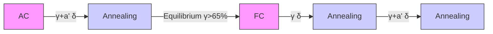

# Tailoring Strength and Ductility of an Fe–Mn–Al–C Low-Density Duplex Steel by Controlling the Cooling Path after Hot Rolling

Zhenlei Li, Rong Chen, Yi Wang, Long Gao, and Xiaowu Li\*

The low-density duplex steels provide a potential for the industrial application owing to their good strength-ductility match and reduced density. In the present work, the microstructure of an Fe–8.03Mn–6.10Al–0.4C (wt%) low-density duplex steel was adjusted by controlling the cooling path after hot rolling, which is a conventional process during the production of steel sheets and strips. A microstructure of ferrite and austenite has been achieved by annealing the air-cooled samples, and the microstructure of furnace-cooled annealed samples consists of banded ferrite, austenite, and martensite. This is mainly due to the fact that the austenite is more stable by refining the grain size via embedding the needle-like α-ferite. The existing of martensite and the banded microstructure in furnacecooled annealed samples induces the occurrence of cracks during deformation, resulting in an abrupt fracture at a relatively lower strain level. However, for air-cooled annealed samples, a good ductility of duplex microstructure ensures that the deformation can be sustained up to a much higher strain level, and the transformation induced plasticity effect plays a positive role at the later deformation stage; this contributes to the occurrence of an extra work hardening rate recovery during deformation and thus to a good strength-ductility match.

# 1. Introduction

Steel materials are widely applied to the vehicle sectors owing to their advantages in mechanical properties, formability, recyclability, and relatively low cost. Recently, low-density steels have

Z. Li, L. Gao

State Key Laboratory of Rolling and Automation

Northeastern University

Shenyang 110819, China

R. Chen

Institute of Metal Research

Chinese Academy of Sciences

Shenyang 110016, China

Y. Wang, X. Li

Department of Materials Physics and Chemistry

School of Materials Science and Engineering

Key Laboratory for Anisotropy and Texture of Materials

(Ministry of Education)

Northeastern University

Shenyang 110819, China

E-mail: xwli@mail.neu.edu.cn

The ORCID identification number(s) for the author(s) of this article can be found under https://doi.org/10.1002/adem.202301595.

DOI: 10.1002/adem.202301595

attracted a lot of attentions for meeting the requirement in vehicle lightweight in order to reduce the greenhouse gas emissions and increase the fuel efficiency. There are normally three categories of the low-density steels according to the matrix phase, e.g., ferritic steels, austenitic steels, and duplex steels.[1] The austenitic lowdensity steels usually take advantage of the precipitation of κ-carbides, and thus high contents of aluminum and carbon are generally required.[2–6] In general, the low-density ferritic steels have a lower strength,[7] but the duplex low-density steels exhibit an excellent strength-ductility match.[8–12] Herein, the high work hardening capability of duplex low-density steels could be regulated by deformation-induced martensitic transformation of retained austenite. Therefore, the stability of austenite is quite critical to the mechanical properties of duplex low-density steels. Some previous studies have tried to adjust the austenite stability for the improvement of mechanical properties.[13–16]

Hot rolling is a conventional process in the production of sheet and strip. Extensive efforts have been made on optimizing the microstructure and mechanical properties of alloy steels by controlling cooling.[17–19] However, the studies on controlling cooling after hot rolling of duplex low-density steels are still rarely reported. In the present work, different cooling rates were adopted in a low-density duplex steel after hot rolling for investigating the relevant influencing mechanism. The microstructure evolution was traced during the cooling and subsequent annealing process, and tensile properties were experimentally tested. This work is expected to provide a new route for the adjustment of microstructures and mechanical properties in duplex lowdensity steels.

# 2. Experimental Section

The studied steel with a chemical composition of Fe–8.03Mn– 6.10Al–0.4C (wt%) was manufactured by using vacuum induction melting with the pressure intensity less than 1 Pa. The cast ingot was heated to 1050 °C and forged into a billet with a crosssectional area of 60 60 mm2 , followed by a homogenization treatment at this temperature for 2 h. The forged billet was reheat treated at 1200 °C for 2 h, and then hot rolled to approximately

line

| Time [h]       | Temperature [°C] |
| -------------- | ---------------- |
| 0              | 0                |
| 1200°C-2 h     | High             |
| Hot Rolling    | Medium           |
| Air Cooling    | Low              |
| Furnace Cooling| Low              |
| Annealing      | High             |

Figure 1. Schematic diagram showing the rolling and annealing schedule for the experimental steel.

4 mm thick sheet by seven passes. The hot rolling was conducted at the temperature range of 900–1100 °C, and the rolled sheets were cooled to ambient temperature by air cooling and furnace cooling, respectively, which are labeled as $^ { \omega } { \mathrm { A C } } ^ { n }$ and “FC”. The hot-rolled sheets were annealed for 30 min at 800, 900, and $1 0 0 0 ^ { \circ } \mathrm { C } ,$ , respectively ( ). The air-cooled samples treated Figure 1by annealing at 800, 900, and 1000 °C, are designated as “AC-A800”, “AC-A900”, and “AC-A1000”, respectively; the other samples are labeled similarly.

The hot-rolled and annealed microstructures and tensile fracture surfaces were observed by scanning electron microscopy (SEM, JSM-7001F). The samples for microstructural observations were prepared by mechanical grinding and polishing, followed by 4% nital etching. The microstructure was also characterized by electron back scattered diffraction (EBSD, Zeiss Gimini300). EBSD data was processed by Channel 5 software to obtain grain boundary distribution, phase maps, and kernel average misorientation (KAM) maps. Samples for the EBSD analysis were electropolished in a solution consisting of 10% perchloric acid and 90% alcohol in volume at room temperature, using an accelerated voltage of 20 kV and a step size of 0.1 μm.

Uniaxial tensile experiments were performed at a strain rate of $1 0 ^ { - 3 } \mathrm { s } ^ { - 1 }$ using an AG-X plus 100 kN mechanical testing device. The tensile samples with a gauge length of 50 mm and a gauge width of 12.5 mm were manufactured along the rolling direction. In addition, X-ray diffraction (XRD) was performed on the samples before and after deformation, which were prepared by the same method with EBSD samples.

# 3. Results and Discussion

# 3.1. Annealed Microstructure Evolution

The microstructure of hot-rolled steels exhibits a banded morphology along the rolling direction, and the banded δ-ferrite and prior austenite are alternately distributed ( ). The Figure 2δ-ferrite was formed by the solidification of liquid phase, and it did not disappear during the whole thermomechanical treatment process owing to the high aluminum addition (Figure 2a,b).[20] The recovery and recrystallization happened in ferrite during the rolling and cooling process, resulting in the existing of a large amount of low-angle grain boundaries in banded δ-ferrite (Figure 2c,d). The prior austenite of two samples was partly transformed into martensite, and the majority fraction of martensite is twin martensite (Figure 2c,d). As seen from the image quality (IQ) maps that reflect the degree of distortion (Figure 2c,d), the darker region in the IQ image is martensite with a large distortion, and more fraction of martensites were observed in the sample AC due to a quicker cooling rate after hot rolling. The fractions of austenite and martensite in the sample AC are 42 and 26 vol%,[10] respectively, but 51 and 2.8 vol% in the sample FC. Besides, more dislocations were introduced into the retained austenite by a martensitic transformation in the sample AC, which could be reflected by the geometrically necessary dislocations (GNDs) (Figure 2c,d). The GNDs are proportional to the KAM,[21,22] and the KAM values of austenite in the samples AC and FC are $0 . 4 8 ^ { \circ }$ and 0.43º, respectively.

text_image

(a)
γ+α
δ
10 µm

natural_image

Microscopic surface texture image showing layered structures with labeled regions (δ, γ) and a 10 μm scale bar (no text beyond labels)

natural_image

Microstructure image of a material showing layered grains and phases, scale bar indicates 50 μm (no text or symbols present)

natural_image

Microstructure image showing layered material with blue and red patterns, scale bar 50 μm (no text or symbols)

Figure 2. SEM micrographs a,b) and KAM of austenite combined with IQ maps c,d) of hot-rolled steels treated by air cooling (a,c) and furnace cooling (b,d). Note that black lines are the high-angle grain boundaries (>15°) and phase boundaries, and red lines are low-angle grain boundaries (>2°), and that α, δ, and γ represent α-ferrite, δ-ferrite, and austenite, respectively.

Two hot-rolled samples were annealed at the temperature range of 800–1000 °C, and the annealed microstructures and corresponding ${ \mathrm { K A M } } + { \mathrm { I Q } }$ maps are, respectively, given in Figure 3and . The microstructures of AC-A800, AC-A900, and AC-4A1000 comprise duplex phase of austenite and ferrite (Figure 3a–c and 4a–c), while a fraction of martensite exists in the annealed microstructure of the FC samples (Figure 3d–f and 4d–f ). For the sample AC with a mixed microstructure of ferrite, austenite, and martensite, a reverse transformation happened during the annealing process, inducing an increase in the fraction of austenite. The austenite volume fractions in the samples AC-A800, AC-A900, and AC-A1000 were measured by XRD to be 58.6%, 61.4%, and 57.1%, respectively ( ). The Figure 5increased fraction of austenite by annealing is attributed to the fact that the equilibrium fraction of austenite at the annealing temperature is higher than that in the sample $\mathsf { A C } . ^ { [ 1 6 ] }$ Besides, the sample AC annealed at $8 0 0 ^ { \circ } \mathrm { C }$ for 5 and 15 min were characterized by SEM for making the microstructure evolution clear, as shown in . The short-time annealed microstructure con-Figure 6sists of tempered martensite, austenite and δ-ferrite, and the twin crystal structure of martensite becomes more obvious after high temperature annealing (Figure 6a). With the annealing persisting, the prior martensite partly degenerates to needle-like α-ferrites (Figure 6b). The high-density dislocation in twin martensite offers the nucleation sites for the ferritic transformation, which facilitates the formation of α-ferrite;[23] the α-ferrite inherits the morphology of the prior martensite. Therefore, a part of prior martensite is degenerated to α-ferrite, and the other part is reversed into austenite during annealing. With the annealing time continuously raising, the film austenite between α-ferrite and/or prior martensite in AC-A800 becomes thickened (Figure 3a and 6), implying an increase in the fraction of austenite. A similar microstructure was obtained in the sample AC-A900 with that in the sample AC-A800. Large amounts of low-angle grain boundaries in δ-ferrite of these two samples exist (Figure 4a,b), and the austenite is separated by the needle-like α-ferrite (Figure 4a,b and 6a,b). The length of low-angle grain boundaries in ferrite of the samples AC-A800 and AC-900 were measured as 4351.1 μm and 2685.4 μm, respectively, implying an obvious recovery during annealing process. However, for the sample AC1000, the reversed transformation of martensite is dominant, and the length of low-angle grain boundaries is 1634.3 μm and just a small fraction of α-ferrite is obtained (Figure 3c and 4c). The austenite in the sample AC-A1000 shows a recrystallized morphology with equiaxed grains, and the δ-ferrite is fully recovered and partially recrystallized. During the annealing process of air-cooled samples, the carbon and manganese that are austenite stabilizers are partitioned into austenite, increasing the chemical stabilization of austenite.[10] The existence of needle-like α-ferrite refines the austenite grain, and further enhances the mechanical stability of the austenite. Considering the contribution of the chemical composition and grain size, the martensitic transformation start temperature (Ms) can be calculated by using following equation[24,25]:

$$
M _ {\mathrm{s}} = 6 9 2 - 3 7 w _ {\mathrm{Mn}} + 2 0 w _ {\mathrm{Al}} - 5 0 2 w _ {\mathrm{C}} ^ {1 / 2} - B V _ {\gamma} ^ {- 1 / 3} \tag {1}
$$

where $w _ { x }$ is the mass percent of Mn, Al, and $\mathrm { C } ,$ B is a size factor that was calculated to be 613 μm $\mathrm { K } ^ { - 1 }$ , and $V _ { \gamma }$ is the austenite grain volume. As shown in a, the austenite grain sizes of Figure 7the annealed samples are nonuniform, which indicates an increase in grain size of austenite with increasing annealing temperature. Thus, the maximum grain size was used for calculating the upper temperature limit of $M _ { \mathrm { s } } \left( M _ { \mathrm { s l i m } } \right)$ , and the relevant temperatures of the samples AC-A800, AC-A900, and AC-A1000 are determined to be 24, 1, and $3 4 ^ { \circ } \mathrm { C } ,$ , respectively. This also verifies that almost no martensite can be formed during the subsequent cooling process after annealing (Figure 4a–c).

The annealed microstructure of FC-A800, FC-A900 and FC-A1000 show a banded morphology that is composed of δ-ferrite and prior austenite (small amount of martensite) (Figure 3d–f and 4d–f ). No needle-like α-ferrite exists in the austenite band, but some fine equiaxed α-ferrite grains were formed. This is different from the annealed microstructure of air-cooled samples, which is determined by the initial hot-rolled microstructure of austenite and δ-ferrite (Figure 2b,d). The majority of microstructural evolution in the sample FC is only manifested by the increase in austenite fraction and the growth of recrystallized grains. Accordingly, the grain sizes are much larger than that of air-cooled annealed samples, which is represented by the grain size distribution of austenite in Figure 7. The average grain sizes of austenite in the samples FC-A800, FC-A900, and FC-A1000 are 9.3, 8.1, and 10.1 μm, respectively, but 3.5, 4.2, and 5.8 μm in the samples AC-A800, AC-A900, and AC-A1000 (Figure 4). This induces a lower stability of austenite, and thus brings about higher $M _ { \mathrm { s } }$ temperatures according to Equation (1). As a result, a small fraction of martensite is obtained in the annealed microstructure, as revealed by the darker region in austenite band (Figure 4d–f ). Besides, the annealed samples exhibit a large distortion in spite of an obvious recovery phenomenon in δ- ferrite, as reflected by the darker IQ maps.

text_image

800
900
1000
(a)
(b)
(c)
AC
10 µm
10 µm
10 µm
(d)
(e)
(f)
α
α
α+γ
α+γ
10 µm
10 µm
10 µm
α
δ
α
δ
α+γ
10 µm

Figure 3. SEM micrographs showing the microstructures in annealed samples. a) AC-A800; b) AC-A900; c) AC-A1000; d) FC-A800; e) FC-A900; f ) FC-A1000. Note that α, α’, δ, and γ represent α-ferrite, martensite, δ-ferrite, and austenite, respectively.

text_image

800
900
1000
(a)
(b)
(c)
50 µm
50 µm
50 µm
AC
(d)
(e)
(f)
50 µm
50 µm
50 µm
FC

Figure 4. KAM maps of austenite combined with IQ maps for AC-A800 a), AC-A900 b), AC-A1000 c), FC-A800 d), FC-A900 e) and FC-A1000 f ). Note that red lines are low-angle grain boundaries, and black lines are high-angle grain boundaries.

bar

| Sample | Before deformation (%) | After deformation (%) |
| :--- | :--- | :--- |
| AC800 | 58.6 | 23.7 |
| AC900 | 61.4 | 44.4 |
| AC1000 | 57.1 | 46.4 |
| FC800 | 62 | 56.5 |
| FC900 | 58.6 | 52.4 |
| FC1000 | 60.6 | 52.1 |

Figure 5. The fraction of austenite in the studied samples before and after deformation measured by XRD.

(a)

natural_image

Microscopic view of crystalline or fibrous material structure with 10 μm scale bar (no text or symbols beyond scale indicator)

natural_image

Microscopic surface texture image showing layered, fibrous structures with a 10 μm scale bar (no text or symbols beyond scale indicator)

Figure 6. SEM micrographs showing the microstructures in the air-cooled samples annealed at $8 0 0 ^ { \circ } \mathsf { C }$ for a) 5 min and b) 15 min.

line

| Austenite grain size / µm | AC-A800 | AC-A900 | AC-A1000 |
| ------------------------- | ------- | ------- | -------- |
| 0                         | 7       | 4       | 1        |
| 2                         | 25      | 15      | 5        |
| 4                         | 28      | 22      | 10       |
| 6                         | 24      | 24      | 15       |
| 8                         | 18      | 23      | 22       |
| 10                        | 12      | 12      | 23       |
| 12                        | 8       | 8       | 15       |
| 14                        | 5       | 5       | 8        |
| 16                        | 3       | 3       | 5        |
| 18                        | 1       | 1       | 2        |
| 20                        | 0       | 0       | 3        |
| 22                        | 0       | 0       | 2        |
| 24                        | 0       | 0       | 1        |

line

| Austenite grain size / µm | FC-A800 | FC-A900 | FC-A1000 |
| ------------------------- | ------- | ------- | -------- |
| 0                         | 6       | 14      | 4        |
| 2                         | 11      | 20      | 7        |
| 4                         | 13      | 18      | 12       |
| 6                         | 17      | 15      | 14       |
| 8                         | 17      | 12      | 16       |
| 10                        | 13      | 10      | 18       |
| 12                        | 12      | 8       | 17       |
| 14                        | 7       | 5       | 12       |
| 16                        | 6       | 5       | 8        |
| 18                        | 5       | 4       | 5        |
| 20                        | 3       | 3       | 5        |
| 22                        | 2       | 2       | 3        |
| 24                        | 1       | 1       | 2        |
| 26                        | 0       | 2       | 1        |
| 28                        | 0       | 1       | 0        |
| 30                        | 0       | 0       | 0        |

Figure 7. The austenite grain size distribution of annealed samples. a) Air cooling; b) furnace cooling.

The microstructural evolution during annealing process of the present duplex low-density steels is summarized in . The Figure 8hot-rolled microstructure in the sample AC consists of δ-ferrite, austenite, and martensite. Part of the martensite was reversely transformed into austenite, and the other part was degraded to α-ferrite during annealing process. This induces needle-like α-ferrite embedded in austenite band that was formed in the annealed microstructure, which refined the grain of austenite. The grain refinement of austenite due to the separating by needle-like α-ferrite, and the partitioning of austenite stabilizing elements through the annealing treatment jointly enhance the stability of austenite, so that no martensitic transformation occurred during the finally cooling process. As a result, the annealed microstructure is composed of δ-ferrite, needle-like α-ferrite and austenite. However, for the sample FC with the microstructure of δ-ferrite and austenite, there are only the enlargement of austenite and the formation of slight fine equiaxed α-ferrite during the annealing process. The lower stability of austenite caused by larger grain size results in the transformation of part of austenite into martensite. Consequently, the δ-ferrite, a small amount of equiaxed α-ferrite, martensite, and austenite are obtained in the annealed microstructure of the furnace-cooled samples.

flowchart

Figure 8. Schematic of the microstructural evolution during the annealing process of the samples treated at different cooling rates after hot rolling.

# 3.2. Effect on the Mechanical Properties

The mechanical properties of hot-rolled and annealed samples were measured by tensile tests, and the relevant engineering stress–strain curves are presented in . The sample AC Figure 9shows a higher tensile strength but a lower ductility than the sample FC, resulting from the existence of martensite and larger internal stress (Figure 2c,d). The air-cooled annealed samples also exhibit a higher yield strength compared with the furnacecooled annealed samples. This is related with the refinement strengthening (ΔσH-P) and dislocation strengthening (Δσd) effects, which could be expressed by

$$
\Delta \sigma_ {\mathrm{P-H}} = k d ^ {1 / 2} \tag {2}
$$

$$
\Delta \sigma_ {\mathrm{d}} = M \alpha G b \rho^ {1 / 2} \tag {3}
$$

where k and d are the Hall–Petch coefficient and grain size, respectively, M is the Taylor factor, a is a constant (0.2 for fcc), G is the shear modulus, b is the Burgers vector, and ρ is the dislocation density. The grain size of austenite is refined from 8–10 μm to 3–6 μm and the increase in the GND density contributes to the enhanced yield strength from 267–419 MPa to 427–513 MPa (Figure 4 and 9). In addition, a much better strength and ductility match can be achieved in the annealed samples treated by air cooling after hot rolling, and their elongations are all larger than 30%, while the elongations of furnacecooled annealed samples are all less than 20% (Figure 9). For example, the elongations are 56.9, 39.5, and 31.1% for the samples AC-A800, AC-A900, and AC-A1000, respectively, but only 19.0, 15.4, and 10.6% for the samples FC-A800, FC-A900, and FC-A1000. This should be closely related to the difference in work hardening capability of annealed samples, as clearly evidenced in . The work hardening rate of all samples Figure 10drops quickly at Stage I, originating from the dominated dynamic recovery of dislocation evolution.[6] Subsequently, the work hardening rate slowly drops at Stage II. The dynamic recovery of dislocation evolution is still the leading factor at this stage, but the dislocation evolution rate becomes gradually decreased. After that, the furnace-cooled annealed samples show an abrupt fracture, and no necking appears. In contrast, there is an extra Stage III for air-cooled annealed samples. The work hardening rate can be recovered at this extra stage, which leads to a much higher work hardening capability and thus to a relatively high tensile strength and particularly to a much higher elongation before fracture (Figure 10a); in this case, a better strengthductility match is achieved.

line

| Engineering strain / % | AC    | AC800 | AC900 | AC1000 |
| ---------------------- | ----- | ----- | ----- | ------ |
| 0                      | 500   | 500   | 500   | 500    |
| 10                     | 700   | 650   | 600   | 620    |
| 20                     | 750   | 700   | 680   | 720    |
| 30                     | 800   | 750   | 720   | 780    |
| 40                     | 850   | 750   | 620   | 780    |
| 50                     | 900   | 750   | 750   | 780    |
| 60                     | 950   | 750   | 750   | 780    |

line

| Engineering strain / % | FC    | FC800 | FC900 | FC1000 |
| ---------------------- | ----- | ----- | ----- | ------ |
| 0                      | 0     | 0     | 0     | 0      |
| 5                      | 600   | 550   | 520   | 480    |
| 10                     | 780   | 650   | 630   | 670    |
| 15                     | 850   | 720   | 680   | 700    |
| 20                     | 900   | 750   | 700   | 720    |

Figure 9. The tensile engineering stress–strain curves of hot-rolled and annealed samples. a) Air cooling; b) furnace cooling.

line

| True strain | AC800 | AC900 | AC1000 |
| ----------- | ----- | ----- | ------ |
| 0.0         | 4000  | 4000  | 4000   |
| 0.1         | 1500  | 1500  | 2000   |
| 0.2         | 1200  | 1200  | 2200   |
| 0.3         | 1100  | 1100  | 2100   |
| 0.4         | 1100  | 1100  | 1100   |
| 0.5         | 1100  | 1100  | 1100   |

line

| True strain | FC800 | FC900 | FC1000 |
| ----------- | ----- | ----- | ------ |
| 0.00        | 4000  | 4000  | 4000   |
| 0.05        | 1500  | 1500  | 2500   |
| 0.10        | 1200  | 1000  | 2000   |
| 0.15        | 1100  | 700   | 1500   |
| 0.20        | 700   | 700   | 700    |

Figure 10. The tensile true stress–strain curves and work hardening rate curves of annealed samples. a) Air cooling; b) furnace cooling.

During the deformation process, a large fraction of austenite was consumed in the air-cooled annealed samples, while just a small part of martensite was formed by deformation-induced transformation in the air-cooled annealed samples (Figure 5). Especially, nearly 60% of austenite was transformed in the sample AC-A800. It could be inferred that the transformation induced plasticity (TRIP) effect of austenite played a critical role in the work hardening rate recovery. Previous work reported that the fraction of austenite was significantly decreased at the Stage III.[10] Carbon and manganese were partitioned in the austenite during the furnace cooling process, which was inherited by the austenite in annealed samples. The martensite transformation during the cooling process after annealing further stabilized the retained austenite. Thereby, most of the austenite in furnacecooled annealed samples can be remained up to fracture. Their microstructures consist of banded ferrite, austenite, and martensite (Figure 3d–f ). Cracks are easily nucleated at the interface between the martensite (formed during cooling) and austenite. With the progress of deformation, the dislocations continually pile-up at the interface, to work as obstacles for the dislocation motion, resulting in the strain concentration at the interface. If the locally accumulated strain at the interface is high enough, cracking tends to commence.[26,27] Therefore, there are a lot of small cracks nucleated at the martensite– austenite interface in addition to the large-sized cracks caused by the delamination of banded microstructure in the fracture of the sample FC800 ( b). The cleavage-dominated brit-Figure 11tle fracture in the sample FC-A800 is consistent with the abrupt fracture without necking (Figure 9b). For the air-cooled annealed samples, the austenite also exhibit a high stability due to the smaller grain size (Figure 4a–c), so that only a small amount of austenite was transformed at the first two deformation stages.[10] The austenite and ferrite in these samples possess a high ductility, as evidenced by numerous dimples formed on the fracture surface (Figure 11a). As the strain is adequately high for the strain-induced martensitic transformation,[28,29] the TRIP effect would contribute to the work hardening rate recovery or stable work hardening process at Stage III.

text_image

(a)
Dimples
Cracking
50 µm

text_image

(b)
Cracking
Cleavage
50 µm

Figure 11. SEM images showing the fracture surface features in the samples a) AC-A800 and b) FC-A800.

In summary, the stable duplex microstructure of ferrite and austenite obtained by air cooling and annealing is beneficial to achieving a better strength-ductility synergy in the duplex lowdensity steel (Figure 2 and 9). Furthermore, such a treatment is a quite short-term process, and it can be easily achieved during the actual production process.

# 4. Conclusions

A low-density duplex steel has been subjected to hot rolling and annealing, and the cooling path after hot rolling was altered for adjusting the microstructure. The microstructural observations and tensile tests were conducted on the hot-rolled and annealed samples. The following conclusions can be drawn: 1) The sample AC has a mixed microstructure of δ-ferrite, austenite, and martensite due to the fast cooling. The partial fraction of martensite was reversely transformed into austenite, and the other was degraded to needle-like α-ferrites. The microstructure of annealed samples is composed of δ-ferrite, needle-like α-ferrite and austenite; 2) For the sample FC, only the enlargement of austenite and the formation of slight fine equiaxed α-ferrite took place during the annealing process. Part of martensite was formed during cooling after annealing, owing to the larger grain size of austenite. Finally, the δ-ferrite, a small amount of equiaxed α-ferrite, martensite and austenite were obtained; and 3) A better strength-ductility match has been achieved in the air-cooled annealed samples, attributing to the occurrence of an extra work hardening rate recovery at Stage III. This is ascribed to the significant TRIP effect of austenite during the deformation. However, a lot of small cracks were nucleated at the martensite–austenite interface in addition to the large-sized cracks caused by the delamination of banded microstructure in the fracture of furnace-cooled annealed samples, resulting in the cleavage-dominated brittle fracture.
