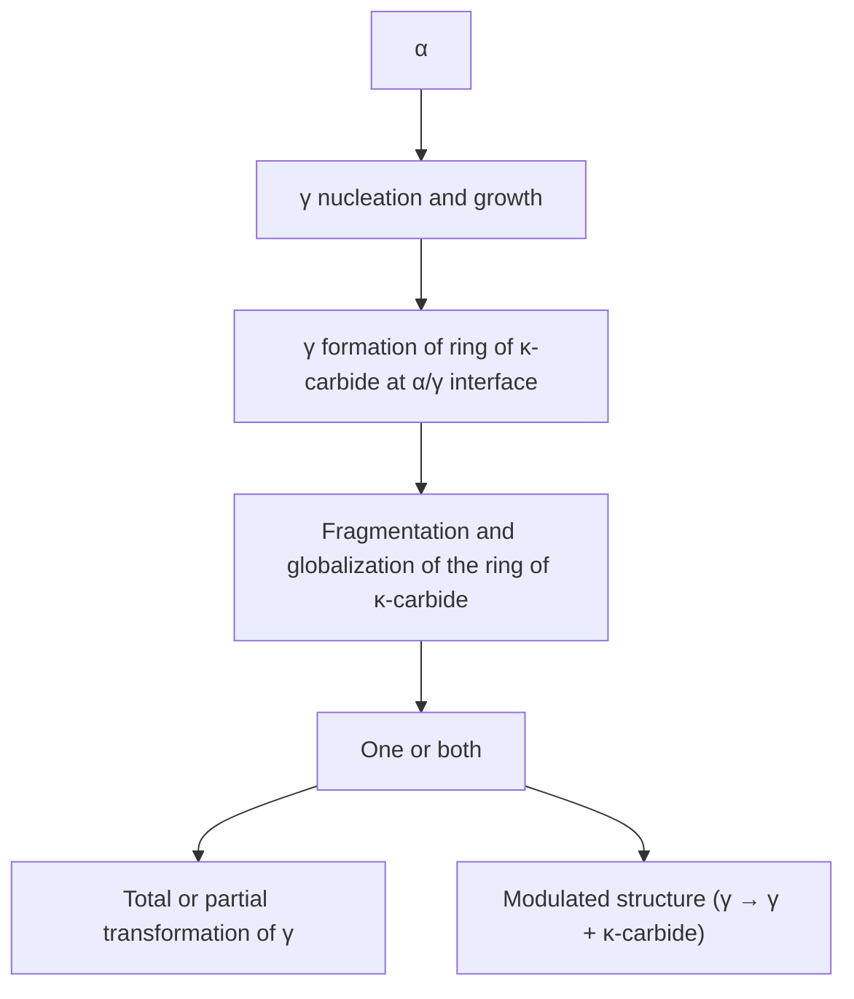
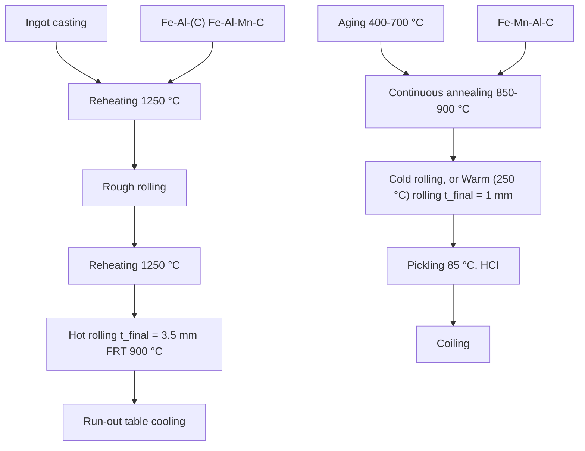

# Overview of Lightweight Ferrous Materials: Strategies and Promises

RADHAKANTA RANA,1,3,4,5 CHRIS LAHAYE,1 and RANJIT KUMAR RAY2

1.—Tata Steel, 1970CA IJmuiden, The Netherlands. 2.—Tata Steel, Jamshedpur 831007, Jharkhand, India. 3.—Present address: Advanced Steel Processing and Products Research Center, Department of Metallurgical and Materials Engineering, Colorado School of Mines, Golden, CO 80401, USA. 4.—e-mail: radrana@mines.edu. 5.—e-mail: rana9433@gmail.com

Reducing the density of steels is a novel approach for weight reduction of automobiles to improve fuel efficiency. In this overview article, strategies for the development of lightweight steels are presented with a focus on bulk ferrous alloys. The metallurgical principles of these steels and their mechanical properties of relevance to automotive applications are discussed. Some of the engineering aspects highlighting the possible problems related to mass production of these steels are also considered. Application prospects of these steels vis-a\`-vis standard automotive steels are shown.

# INTRODUCTION

Steels are engineered materials that are produced in very large quantities and find application in various engineering sectors such as automotive, aerospace, transport, building and construction, heavy equipment, and machinery. Despite the evolution of lightweight materials, such as Al and Mg alloys, various composites, fibers, plastics, and so on, steels are used extensively in the automotive sector because of their excellent combination of strength, formability, affordability, and recyclability. However, because automobiles are the second largest source of greenhouse gas emissions in the world, stringent environmental regulations to control emission have been enacted in recent years all over the world. As for example, CO2 emission in European cars must be reduced to 130 g/km by 2015 and to 95 g/km by 2020 compared with the 2007 fleet average of 158.7 g/km.1 The research on automotive power train and engines suggests a move toward electric vehicles to use alternative energy sources. This calls for weight saving in the body-inwhite (BIW) and other automotive parts to compensate for the additional weight of batteries and electric motors. In contrast, weight saving in the traditional automobiles would maximize the fuel efficiency. In both the scenarios, there is an urgent pressure on the steel producers to innovate new grades of steels that can reduce the weight of automobiles.

Obviously, steels with lower density when used in automobiles would reduce the weight directly. The earliest information on low-density steels dates back to 19332 which was related to the first development of Fe-Mn-Al-C system, and later in 19583 when an effort was made to replace the costly strategic elements Ni and Cr in stainless steels by cheaper Mn and Al. Nevertheless, research on low-density steel sheets did not receive serious attention in the past in the context of automotive applications. In recent years, there has been a conscious scientific effort to develop these steels for the compelling reasons mentioned above.4 Research communities cutting across steel producers, academia, and national laboratories around the globe have been quite active in the past several years in the field of low-density steels. Although a significant amount of work has been published on this topic in recent years, a paper summarizing the various aspects of low density is lacking at the moment. To fill in this gap, this overview was prepared to give an outline of the different possible approaches for reducing the density of steels, with special focus on the metallurgical and application aspects of bulk ferrous alloys.

# STRATEGIES FOR LIGHTWEIGHTSTEELS

The densities of ferrite and austenite in steels are 7.85 and 8.15 g cm-3 respectively.5 These values are quite high compared with the densities of light metals such as Al, Mg, or Ti. Therefore, quite naturally, any strategy for reducing the density of steels must use components with densities lower than those of steels. The published literature points to the following broad strategies for density reduction of steels: Fe-based bulk (monolithic) alloys,4 ferrous composites,6–9 steel foams,10,11 and steelbased laminates.12,13 Although this overview on low-density steels deals mainly with the Fe-based bulk alloys, an introduction to each of the other concepts of achieving lower density in steels is included in the beginning.

# Steel-Based Composites

Steel-based low-density composites use mainly lighter ceramic particles of various carbides, borides, nitrides, and oxides (such as TiC, VC, SiC, TiB2, VB2, Cr2B3, Si3N4, Al2O3, etc.), which are reinforced in the ferritic or austenitic steel matrix.8 The reinforcement of the particles into the matrix can be done by a variety of synthesis and fabrication techniques including liquid metal casting, powder compaction and sintering, self-propagating hightemperature synthesis, injection molding, etc. 9 However, the method of melting and casting, in which the particles form largely during solidification, is considered to be the most viable route for quantity production of these materials. Selection of the particles, on the consideration of their compatibility in a steel matrix, is of paramount importance for the development of a robust steel matrix composite (SMC). A homogeneous distribution of particles, low difference in thermal expansion coefficient between the matrix and the particle, and a clean and strong particle–matrix interface are considered to be essential to obtain good strength properties in SMCs.9 A further advantage of SMCs, in addition to lower density, is that they possess a higher Young’s modulus by virtue of the reinforcement of the usually stiffer particles in the steel matrix.6 This is of enormous technological importance because a higher Young’s modulus of steel sheets can directly affect the stiffness of an automotive component made out of that steel.

# Steel Foams

Steel foams rely on the presence of gas-filled pores in the structure and can be made through both liquid metallurgy (foundry) and powder metallurgy routes, using a skeleton or bubbling/foaming agents.10,11 Because of the presence of large volume fraction (75%–95%) of pores, usually steel foams are of very low density, and therefore these are ultralight materials. In closed-cell foams, the pores are sealed, whereas in open-cell foams, the pores form an interconnected network. In most of the foams, the distribution of porosity is random (stochastic foams) because of the nature of their manufacturing method, whereas regular foams with ordered pore structure is very difficult to produce. Usually, the strength of metal foams follows a power law relationship with its density. Because of their very low density, steel foams possess also a very high specific stiffness. Although commercialization of steel foams is very rare at least for quantity production, these materials are potential candidates for automotive applications particularly for components requiring high energy absorption and sound dampening.

# Steel-Based Laminates

Steel-based laminates are basically hybrid materials containing alternating layers of steel sheets and a lighter material.12,13 These can be of metal– metal or metal-fiber types. Laminates of steel and a suitable aluminum alloy are examples of the first type, with a much reduced density of the composite structure. Fibers that can be used in steel-based laminates include glass, SiC, graphite, etc. The individual layers of a laminate are joined by processes like cladding and roll bonding, or by using heat (welding) and adhesives. These laminates can provide high bending and in-plane stiffness, low density, and high strength. Although not a steelbased material, a typical current use of laminates in automobiles is the windshield, where laminates of glass and plastic are used. Nevertheless, the same concept has been pursued for developing steel-based laminates or sandwich structures primarily for use in powertrain applications, such as transmission covers, oil pans, and drive belt covers. In these sandwich structures, a resin layer is used between steel sheets. This sandwich design has excellent dampening characteristics of structure-borne sound.

# BULK IRON ALLOYS

It is very clear that the strategies for producing low-density steels presented above are not quite suitable for mass production, and therefore the research on those concepts is fairly limited. However, low-density bulk iron alloys that are easier to produce using state-of-the-art mass production route of melting and casting are very promising, and these have been catching the imagination of the ferrous metallurgists. Considering its strong effect in density reduction (density of $\breve { \mathrm { A l } } = 2 . 7 \ \mathrm { g } \ \mathrm { c m } ^ { - 3 } )$ ) as well as the engineering aspects such as alloy making and workability, Al has emerged as the chief alloying element in low-density bulk steels. Sometimes, Si is added in combination with Al, also because of its low density (2.3 g cm-3 ), although processing of steels with high amount of Si poses a problem. As is clear from the Fe-Al phase diagram14 shown in Fig. 1, Al forms disordered solid solution in Fe up to about 11 wt.% of alloying; beyond this amount of Al, various intermetallic phases such as $\mathrm { D } 0 _ { 3 } .$ -based $\mathrm { F e _ { 3 } A l }$ and B2-based FeAl appear. These intermetallics are usually brittle in nature and have been the subject of thorough research15–17 in the last decades of the

Fig. 1. Fe-Al phase diagram.14

20th century, especially for high-temperature applications, with a view to replace stainless steels and Ni-based superalloys. Therefore, these materials will not be considered in this overview.

The effectiveness of Al in lowering the density of steels can be viewed from Fig. 2, where the reductions in density of Fe-Al and Fe-Mn-Al-C alloys are shown as a function of Al content.18,19 Approximately 8 wt.% of Al causes density reduction of 10%. Manganese, which is often added in multiphase low-density steels, also reduces slightly the density of steels.

# Classification of Bulk Iron Alloys

Depending on the presence of the different phases, low-density steels can be classified into various types such as ferritic $( \alpha ) , ^ { 2 0 , 2 1 }$ austenitic $( \gamma ) , ^ { 2 2 , 2 3 }$ duplex phase $( \alpha + \gamma ) , \ L ^ { 2 4 - 2 7 }$ and triplex phase (a + c + jcarbides) steels.5,19 According to the operative strengthening and ductility-enhancing mechanisms, low-density steels can be further classified into following categories. The pure high Al-containing ferritic steels can be interstitial free $( \mathrm { I F } ) ^ { 2 0 }$ and bake hardenable;28 some of the low-density steels containing austenite are precipitation hardenable (by j-carbides).21,29–31 Others could involve transformation-induced plasticity (TRIP; including d-TRIP),32–34 twinning-induced plasticity (TWIP),18,22,35,36 shear band induced plasticity (SIP),1 9 or micro band induced plasticity (MBIP),37,38 depending on the alloy composition and processing parameters. Furthermore, the duplex steels can sometimes contain certain amounts of $\mathrm { F _ { m 3 m } \mathrm { - t y p e } D 0 _ { 3 } }$ or CsCl-type B2 phase formed due to decomposition of L’12 j-carbides during an ordering heat treatment.39 During aging of steels containing j-carbides, the formation of brittle b-Mn phase has also been reported when the Mn content is very high (>35 wt.%).40

line

| Al content (wt.%) | Fe-Al Density (g.cm⁻³) | Fe-Mn-Al-C Density (g.cm⁻³) |
| ----------------- | ---------------------- | --------------------------- |
| 0                 | 7.8                    | -                           |
| 4                 | 7.4                    | -                           |
| 6                 | 7.35                   | 7.1                         |
| 8                 | 7.05                   | 6.95                        |
| 10                | 6.8                    | 6.75                        |

Fig. 2. Density reduction in Fe-Al and Fe-Mn-Al-C systems as a function of Al content.18,19 Mn content in Fe-Al-Mn-C system is 14 wt.%; apart from large effect of Al on density, a slight effect of Mn can also be observed.

# Metallurgy of the Bulk Iron Alloys

# Steels According to Phase Constitution

Ferritic Steels The Fe-Al ferritic steels received the least attention in the literature, probably because of their limitations in relation to strength and ductility.18,20,21 However, these alloys are simpler to process and exhibit mechanical properties suitable for automotive outer panel applications. The ferritic low-density steels contain essentially Al, which being a ferrite stabilizer, reduces the austenitic loop significantly while expanding the ferritic phase field.14 This results in a fully ferritic microstructure at room temperature. Although Al can be added in low-density ferritic steels up to fairly high amount of 11 wt.%,14 it has been suggested that the Al content should be restricted to less than 6.5 wt.%.18 Short-range ordering, which increases brittleness and therefore is detrimental to formability, can take place with higher Al content (>6.5 wt.%) within the ferritic range.

It has also been shown that C content in Al-containing ferritic steels should be minimized to avoid the possible formation of ordered carbides, $\mathrm { F e } _ { 4 - y } \mathrm { \hat { A } l } _ { y } \mathrm { C } _ { x } ( 0 . 8 \leq y \leq 1 . 2 ; 0 \leq x \leq 1 ) , \ l ^ { 4 1 }$ which are detrimental to sheet formability. This has led to the development of high Al-containing low-density IF steels20 with the addition of a stoichiometric amount of stabilizing elements such as Ti, similar to traditional IF steels. The interstitial elements (C, N, and S) in these IF low-density steels are believed to be bound to the microalloying element as its carbide, sulfide, or carbo-sulfide, and therefore they are not amenable to the formation of ordered carbides.

The effect of Al on the grain size of low-density ferritic steels is very interesting. Aluminum, when added to steels in small amounts (<0.04 wt.%) as a deoxidizer, causes grain refinement probably through the Zener drag exerted by AlN particles.42 However, low-density ferritic steels containing high amounts of solute Al exhibit coarser grains than low carbon steels, although the results were a bit mixed up with processing effects.20 On the contrary, presence of free C in the matrix was shown to refine the grain size, possibly by the solute drag effect of C.20 Typical grain sizes obtained in different Fe-Al low C and Fe-Al IF ferritic steels are shown in Fig. 3 compared with a typical traditional IF steel.20

Bake-hardenable low-density steels exploit the presence of free C in ferritic matrix primarily to achieve higher strength after a standard paint baking treatment.28 The mechanism lies on the locking of the dislocations by excess amounts of interstitial elements in the matrix. It has been reported that about 80 MPa yield strength can be gained through bake hardening in these high Alcontaining steels by using a proper alloy design (Fig. 4). 28

Austenitic Steels Austenitic low-density steels are very high (>25 wt.%) Mn-containing Fe-Mn-Al-C alloys.22,23 These steels are concentrated solid solutions of austenite with an atomic fraction of Fe often less than 0.5. Short-range ordering usually takes place in the austenite owing to the thermodynamic factors caused by heavy alloying. Such short-range order exists in steels processed even with a high cooling rate such as water quenching. The j-carbides precipitate in austenitic steels on the existing short-range order. The stacking fault energy of austenite as well as the existence of j-carbides modifies the deformation characteristics of austenitic steels and give rise to different ductilityenhancing mechanisms, such as TWIP, SIP, and MBIP, yielding very attractive mechanical properties in these alloys, as shown in a later section. The abovementioned ductility-enhancing mechanisms are discussed in the section, ‘‘Steels According to Strength- and Ductility-Enhancing Mechanisms.’’

Duplex Steels Duplex low-density steels are basically Fe-Mn-Al-C alloys with the two phases, ferrite and austenite, combining the best features of these two phases. Fe-Al low-density steels are basically ferritic in nature. Therefore, to make phase transformation feasible in these steels, austenite stabilizers such as C and Mn are added, and this is the key aspect for the compositional design of duplex and triplex phase steels. Depending on the relative amounts of Al and Mn + C, in duplex steels, either ferrite (higher Al) or austenite (higher Mn + C) can emerge as the major phase in the microstructure, thus enabling these steels to be subdivided into ferrite-based and austenite-based duplex steels, respectively.6 The ferrite-based duplex steels are more effective in density reduction than the austenite-based ones because of alloying with higher amount of Al than Mn in the former. One interesting feature of duplex Fe-Mn-Al-C alloys, shown in Fig. 5 for a lean alloy duplex steel,5 is that in the intercritical phase field, the austenite (c) content decreases and the ferrite (a) content increases with increase in temperature, in contrast to the case in standard low-carbon steels. During continuous cooling or isothermal transformation, a decomposes into two types of face-centered cubic (fcc) phases—a grain boundary fcc $( \gamma _ { 2 1 } )$ and a grain interior fcc (c22)—and the needle-like particles of 18R martensite $( \gamma _ { 2 } ^ { ' } ) . ^ { 4 3 , 4 4 }$ The transformation of body-centered cubic (bcc) ferrite to the needle-like phase, which possesses a long-period stacking fault structure, is believed to be induced by carbon atoms.45 The 18R martensite, during higher temperature aging, transforms to an fcc structure by introducing pairs of negative dislocations (with Burgers vector equal to negative direction of the lattice invariant shear)46 with concomitant compositional evolution of Mn and ${ \mathrm { A l . } } ^ { 4 7 }$ In addition, the formation of dodecahedron a-Mn phase, which is a solid solution of Fe, Mn and Al, also occurs after prolonged aging of 18R martensite with a cubic-on-cubic matrixprecipitate orientation relationship.47

bar

| Material | Mean grain size (μm) |
| :--- | :--- |
| 9.7Al-0.04C-0.09Ti | 9.7 |
| 8.1Al-0.0015C-0.14Ti | 8.1 |
| 6.8Al-0.0035C-0.10Ti | 6.8 |
| IF | 20 |

Fig. 3. Typical grain size in some Fe-Al ferritic low-density steels in comparison with Al-free ferritic steel.20 Low-density steels with ultralow C and sufficient amount of ‘‘stabilizer’’ (6.8 and 8.1 wt.% Al steels) have larger grain sizes than traditional IF steel, whereas that with higher level of C and insufficient amount of stabilizing element (9.7 wt.% Al steel) possesses fine grain size compared with the size in traditional IF steel.

bar_line

Steels (wt. %):
| Alloys | Yield strength (MPa) - YS (Pre-BH) | Yield strength (MPa) - YS (Post-BH) | ΔYS |
|---|---|---|---|
| 1 | 345 | 425 | 80 |
| 2 | 350 | 428 | 78 |
| 3 | 418 | 498 | 80 |
| 4 | 405 | 485 | 78 |
| 5 | 348 | 425 | 78 |

Fig. 4. Bake hardening (BH) response in Fe-Al ferritic steels after a paint baking treatment (2% deformation + 170C, 20 min).28 Also shown are pre- and post-BH yield strength (YS) of the alloys.

line

| Temperature (°C) | Phase amount (wt.%) |
| ---------------- | ------------------- |
| 0                | 0                   |
| 300              | 0                   |
| 600              | 0                   |
| 900              | 10                  |
| 1200             | 0                   |
| 1500             | 100                 |

Fig. 5. Phase fractions in an Fe-6.57Al-3.3Mn-0.18C (wt.%) alloy as a function of temperature calculated by JMatPro 6.1 software (Sente Software, Ltd., Surrey, UK).5

Triplex Steels Triplex low-density steels are also Fe-Mn-Al-C alloys with basically three phases—ferrite, austenite, and the j-carbides.19 Therefore, the basic metallurgy of duplex steels pertaining to bcc and fcc phase transformations holds true for these steels as well. Depending on the chemistry of steels, the basic process route of producing triplex steels involves a solution annealing usually in a two-phase (a + c) or three-phase (a + c + j-carbide) field and quenching followed by an aging step5,32 or a continuous cooling from the single-phase ferritic domain .48 The j-carbides grow from C-enriched areas of the austenitic matrix formed most probably via spinodal decomposition during quenching and precipitate.49,50 As shown schematically in Fig. 6, $6 , ^ { 4 8 }$ for low Mn-containing steels during continuous cooling, initially austenite forms from ferrite, and then j-carbides form at the interphase boundaries of austenite and ferrite. At lower temperatures, austenite decomposes to ferrite and j-carbide through a eutectoid reaction. If this transformation is partially complete, then j-carbides precipitate in austenite giving rise to a modulated structure.

flowchart

Fig. 6. Schematic presentation of the phase transformation sequences involved in formation of j-carbide from ferrite in lean Mncontaining Fe-Mn-Al-C alloy.48

# Steels According to Strength- and Ductility-Enhancing Mechanisms

The major strengthening mechanisms operative in low-density steels are precipitation hardening, solid-solution strengthening, strain aging, etc. Strain aging has been discussed in the context of bake-hardenable steels, and the solid-solution strengthening will be discussed in a later section pertaining to mechanical properties. The metallurgy of precipitation-hardenable steels is briefly stated below. It can also be noted that the ductilityenhancing mechanisms such as TRIP, TWIP, SIP, and MBIP effects, which are presented next, not only increase the ductility by delaying the plastic instability but also are effective in increasing the strength of the steels by virtue of increase in the work-hardening rate.

Precipitation-Hardenable Steels Precipitation hardening of low-density steels occurs mainly by the formation of j-carbides. These j-carbides can be successfully used in both ferritic and austenitic matrix for strengthening purposes. Carbon, which is a potent austenite former and strengthener, has been used beneficially in Fe-Mn-Al-C alloys as a cheaper alloying element to form j-carbides, $( \mathrm { F e , M n } ) _ { 3 } \mathrm { A l C } _ { x } . ^ { 2 1 , 2 9 }$ –31 This opens up the possibility of further strengthening of austenite through precipitation hardening.29–31 The j-carbides precipitate in austenitic steels usually during aging of Fe-Mn-Al-C alloys at the temperature range of 500–750C. While j-carbides can precipitate both intergranularly and intragranularly in austenite, the intragranular precipitates are believed to be effective in increasing the yield strength of the alloy significantly. As high as 90% increase in yield strength has been reported for an Fe-30Mn-10Al-1C-1Si (wt.%) alloy because of jprecipitation during aging.29 Furthermore, it has been shown that the mode of precipitation in these steels depends strongly on the concentration of alloying elements.51 Investigations on a series of alloys with compositions, $\mathrm { F e - ( \bar { 2 3 } - 3 2 ) M n \mathrm { - } ( 2 \mathrm { - } 1 0 ) A l \mathrm { - } ( 0 . 4 \mathrm { - } }$ 1)C (wt.%) led to the conclusion that intragranular jcarbide cannot precipitate in these alloys only when Al and C contents are lower than about 6.2 and 1 wt.%, respectively. In contrast, intergranular jcarbide precipitation in these alloys is possible if Al and C contents are larger than 5.5 and 0.67 wt.% respectively. Furthermore, the following approximate composition boundary for formation of intragranular precipitates of j-carbide was derived, for the alloys with above composition range, based on calculation of a lower critical lattice constant of austenite below which j-carbide would not form: $0 . 0 9 8 \mathrm { { A l } + 0 . 2 0 8 \mathrm { { C } = 1 - 0 . 0 0 5 4 M n } }$ . Aluminum raises the solvus of both intergranular and intragranular j-carbides, whereas Mn causes a slight reduction of the solvus. These effects in some specific compositions are shown in Fig. 7. 52

In ferritic Fe-Al-C alloys, j-carbide is basically Mn-free $( \mathrm { F e A l C } _ { 0 . 5 } )$ and a potent strengthener of ferrite. Increasing the C content in ferritic steels increases the amount of $\mathrm { F e A l C } _ { 0 . 5 }$ particles, and therefore the strengthening response improves.53 Furthermore, the ferrite in Fe-Al-C alloys can also be strengthened significantly by the presence of small amount of precipitate of the ordered Fe3Al phase by increasing the Al content beyond the disordered solid-solution range.53 However, these strengthening phases have a negative impact on ductility of the material.53

As mentioned, different ductility-enhancing mechanisms such as TRIP, TWIP, SIP, and MBIP can be activated in low-density steels, particularly when austenite is present in the microstructure. Some metallurgical aspects of these effects are given below with appropriate examples.

TRIP Steels Strain-induced displace transformation of austenite to body-centered tetragonal martensite occurs when the stacking fault energy of austenite is less than about 20 mJ $\mathbf { \bar { m } } ^ { - 2 } ;$ above this amount of stacking fault energy, austenite deforms by twinning.54,55 In both the cases, the elongation improves by delaying the onset of plastic instability during tensile deformation. The existence of a TRIP effect was reported in lean Mn-containing duplex steels (e.g., Fe-3.5Mn-5.8Al-0.35C by wt.%).45 The TRIP effect was also found to be dependent on the annealing temperature in the intercritical phase field because it controls the partitioning of elements in austenite and ferrite, and thereby the stability of austenite.

A permanent replacement of allotriomorphic ferrite (a) in the microstructure of low-density steels in lieu of d-ferrite has directed to the development of d-TRIP steels.33,34 In these steels, a large amount of dferrite is retained in the microstructure from the solidification process at all temperatures. The remainder of the microstructure in d-TRIP steels consists of bainitic ferrite and retained austenite. The advantages of retaining d-ferrite instead of allotriomorphic ferrite include avoidance of a fully martensitic structure in the heat-affected zone after resistance spot welding and an adherent fayalite scale during hot rolling. The latter benefit arises because the design of d-TRIP steels uses an addition of somewhat high amount of Al (3–5 wt.%), which makes the d-ferrite thermodynamically stable and suppresses cementite formation. However, in standard TRIP-aided steels without the presence of dferrite as a microstructural component, usually Si is added to inhibit formation of cementite and at the same time Si forms the adherent fayalite scale during hot rolling. That Al is added in d-TRIP steels in relatively high amount results in density reduction of the steel up to about 5%.

line

| Al content (wt.%) | γ    | γ + κ* | γ + κ + κ* |
| ----------------- | ---- | ------ | ---------- |
| 5                 | 730  | -      | -          |
| 6                 | 740  | 550    | -          |
| 7                 | 760  | 650    | -          |
| 8                 | 790  | 690    | -          |
| 9                 | 810  | 720    | -          |
| 10                | 830  | 740    | -          |

line

| Mn content (wt.%) | γ    | γ + κ* | γ + κ + κ* |
| ----------------- | ---- | ------ | ---------- |
| 23                | 800  | 700    | 690        |
| 24                | 795  | 695    | 685        |
| 25                | 790  | 690    | 680        |
| 26                | 785  | 685    | 675        |
| 27                | 780  | 680    | 670        |
| 28                | 775  | 675    | 665        |
| 29                | 770  | 670    | 660        |
| 30                | 765  | 665    | 655        |

Fig. 7. Alloying effect on solvus of $\kappa - \mathsf { p h a s e } ! ^ { 5 2 }$ (a) effect of Al in Fe-30Mn-xAl-1C alloys, and (b) effect of Mn in Fe-xMn-7Al-1C alloys. c = austenite, j = intragranular k-phase, j\* = intergranular j-phase. Alloy contents are in wt.%. x = variable amounts of Al and Mn.

natural_image

Microscopic view of a mineral or rock sample showing layered textures and a 2 μm scale bar (no text or symbols beyond label)

natural_image

Microscopic image showing a dense, grainy surface texture with a 500 nm scale bar (no text or symbols beyond label)

Fig. 8. Microstructure development in Fe-(26-28)Mn-(11-12)Al-(0.9-1.15)C (wt.%) triplex steels, deformed at room temperature by tensile test, showing SIP effect:19 (a) TEM bright-field image exhibiting shear bands on {111} planes in austenite and (b) TEM dark-field image showing the regular arrangement of j-carbides (20–30 nm size) coherent to austenitic matrix. The dark-field image was taken using the superlattice reflection (210) of h001i fcc zone axis.

TWIP Steels It is possible to ensure TWIP effect in low-density steels by virtue of their high Mn content and intercritical annealing.18,36,56 Coherent twin boundaries act as slip obstacles in a manner equivalent to grain boundaries, and the work-hardening rate increases from the interactions between stacking faults and dislocations.57 Transformation of austenite to hexagonal martensite is suppressed with Al addition in Fe-Mn-Al-C alloys and twinning becomes the dominant deformation mechanism. However, a very high amount of Al was found to reduce the deformation twin density in an Fe-30Mn-7Al-0.95C (wt.%) alloy because of the increase in stacking fault energy.57 When stacking fault energy of austenite is low, austenite deforms mainly by planar glide rather than wavy glide. However, there have been several reports where planar glide has been observed even with the very high stacking fault energy of austenite.19,24,37

SIP Steels The SIP effect, which is based on homogeneous shear deformation, has been reported in triplex steels with approximate compositions of Fe-(26–28)Mn-(11–12)Al-(0.9–1.15)C (wt.%).19 A regular distribution of nanosized j-carbides that are coherent in austenite matrix give rise to uniformly arranged shear bands on {111} planes as shown in Fig. 8. 19 It is believed that the SIP deformation mechanism in these triplex steels arises from the very stable austenite that possesses high positive Gibbs energy for austenite to martensitic transformation (1755 J mol-1 ) and relatively high stacking fault energy (110 mJ m-2 ).19

MBIP Steels In contrast to the SIP effect that has been observed in the above triplex steels, MBIP was postulated to be the governing ductility-enhancing mechanism in an Fe-28Mn-9Al-0.8C (wt.%) austenitic steel.37,38 Microbands, consisting of geometrically necessary dislocations, nucleate on domain boundaries and grow progressively with strain causing enhanced dislocation density. A higher strain-hardening rate is obviously linked with the increased dislocation density, effecting a larger elongation.

# Mechanical Properties of Bulk Iron Alloys

The ranges of tensile strength and total elongation of some of the low-density steels are shown in the so-called ‘‘banana diagram’’ in Fig. 9. 20 Also indicated in the plot are the density reductions in these steels. As can be seen, steels containing austenite (duplex and triplex steels) are superior in strength–ductility balance as well as in terms of density reduction than ferritic steels because in the former category of steels (I) different strength and ductility-enhancing mechanisms are operative (as mentioned in the section, ‘‘Metallurgy of the Bulk Iron Alloys’’) and (II) they have a higher alloying content (Al and Mn).

The strength in ferritic alloys originates mainly from the solid-solution strengthening by Al (40 MPa/wt.%Al). Hall–Petch hardening through grain refinement can also be used with benefit by employing proper processing schedule and alloying addition.20 Furthermore, as discussed, strain aging during bake hardening and precipitation hardening are additional sources of strengthening in ferritic steels. However, as has been mentioned, to obtain satisfactory ductility by avoiding preordering, the

scatter

| Material | Ultimate tensile strength (MPa) | Total Elongation (%) |
| -------- | ------------------------------- | -------------------- |
| Fe-Al     | ~550                            | ~25                  |
| Fe-Mn-Al-C | ~650                            | ~45                  |
| Fe-Mn-Al-C (α + γ) | ~700                        | ~50                  |
| Fe-Mn-Al-C PH steels (α + κ) | ~800                        | ~20                  |
| Fe-Al Intermetallics | ~950                        | ~10                  |
| Fe-Mn-Al-C Triplex steels (γ + α + κ) | ~1050                       | ~70                  |

Fig. 9. Strength-elongation plot of some low-density steels.20 Density reductions in these steels are also indicated.

Al content in ferritic steels needs to be below 6.5 wt.%.18 The presence of free C in ferritic steels can cause discontinuous yielding in the tensile curve (Fig. 10),20 which can give rise to surface stretcher marks on sheets after forming, and therefore carbon should preferably be stabilized. The stretching and deep drawing behaviors of ferritic steels were reported to be lower than conventional IF steels because of the weakening of ctexture and a decrease of strain-hardening exponent of ferrite matrix with Al-addition.20

In low-density steels containing austenite, although part of the strength is derived from alloying and j-carbides, the major causes of superior mechanical properties are the existence of the ductility-enhancing mechanisms discussed above, which increase the strain hardening rate during deformation. Therefore, the strain hardening rate is a key mechanical property of these steels affecting strength and ductility. As an example, the true stress–true strain curve and the corresponding strain -hardening rate as a function of true strain are shown in Fig. 11. 37 for an MBIP steel. Clearly, the high work-hardening rate is a main characteristic of these low-density steels containing austenite, which makes it quite distinct, in terms of mechanical properties, from the ferritic steels.

It is important to discuss some examples of mechanical properties of low-density steels vis-a\`-vis traditional automotive steels to throw some light on the potential of these new steels. Typical tensile properties of various low-density steels are given in Table I,20,26,28,32,58 and the same for some traditional steels currently used in automotives are listed in Table II59 for comparison purposes.

Although a high strength of steels would contribute mainly to dent resistance and crash resistance of the components, a high elongation, strain hardening exponent (n), and normal anisotropy factor (r-) are necessary for good formability of the steel sheets.20 Furthermore, the elongation determines the ductility of the steel sheets, whereas the n and r- values are regarded as indices of stretchability and deep drawability, respectively. From Tables I and II, it is evident that the high Al-containing IF ferritic steels possess higher strength than traditional high-strength IF steels (IF-Rephos.) because of the strong solid-solution strengthening by Al. In addition, they have similar ductility, strain hardening exponent, and higher normal anisotropy factor than normally used dual-phase (DP) and highstrength low-alloy (HSLA) steel grades (DP500 and HSLA350), which are of similar strength levels. The low-density bake-hardenable ferritic steels (Table I) are stronger than traditional ultralow-carbon (ULC) bake-hardenable steels (ULC-BH340, Table II), and their elongation is also comparable with traditional steel grades of similar strength such as DP600 or TRIP600.

line

| Engineering strain (%) | Engineering stress (MPa) |
| ---------------------- | ------------------------ |
| 0                      | 0                        |
| 10                     | ~550                     |
| 20                     | ~500                     |
| 30                     | ~450                     |
| 40                     | ~300                     |
| 50                     | ~200                     |

Fig. 10. Tensile curves of ferritic low-density steels showing discontinuous yielding as a result of presence of free C in the matrix in contrast to continuous yielding in high Al-containing and conventional ‘‘interstitial free’’ alloys.20

The austenitic and duplex (ferrite or austenite based) low-density steels exhibit similar levels of tensile strength; however, the austenitic low-density steels are highly ductile because of the various ductility-enhancing mechanisms as discussed previously. In comparison with the commonly used steel grades with even slightly lower strength such as DP800 and TRIP780, these low-density steels are far more ductile and stretchable (Tables I and II). The triplex low-density steels can have slightly lower strength than austenitic or duplex variants; however, the total elongation is still higher than the commercially available steel grades of similar tensile strength.

Therefore, in addition to the lower density (Fig. 2), it appears from the above that the high Alcontaining steels are fairly comparable with better in terms of mechanical properties than the conventional automotive steels currently in use. However, a negative effect of Al addition to steel is that it causes the Young’s modulus of steels to decrease, as shown in Fig. 12.18,20 This can influence the application of low-density steels in automotives in a negative manner because the Young’s modulus of a material controls the stiffness directly.

line

| True strain | Strain hardening rate (MPa) | True stress-true strain (MPa) |
| ----------- | --------------------------- | ----------------------------- |
| 0.0         | 2500                        | 500                           |
| 0.2         | 1600                        | 800                           |
| 0.4         | 1800                        | 1100                          |
| 0.6         | 1900                        | 1400                          |
| 0.8         | 1100                        | 1600                          |

Fig. 11. A typical true stress–true strain curve of an MBIP steel showing very high strain-hardening rate.37

# Processing Routes of Bulk Iron Alloys

The thermomechanical processing steps of lowdensity bulk steels are similar to the ones employed for traditional automotive steels, although as discussed later difficulties in processing of low-density steels exist mainly because of their high alloy content. As an example, the typical processing steps reported in literature for producing Fe-Al-(C) and $\mathrm { F e - A l - M n - C }$ low-density steels in the laboratory are shown in the flow chart of Fig. 13. 6 These processing steps correspond to industrial production routes used for conventional automotive steels, with no additional process step involved.

The thermomechanical parameters (e.g. temperature, cooling rate, rolling reduction etc.) used during the processing steps in Fig. 13 depends on the alloy chemistry and the desired microstructure.5,6,20,26 After hot rolling, the cooling rate of the strips to the coiling temperature in the run-out table is important determining the further processability and formability of the material. It was suggested that for a high-alloyed duplex steel, quenching the material to room temperature with a high cooling rate comparable with water quenching is beneficial in improving the formability of the material in final cold-rolled and annealed condition because a high cooling rate suppresses the precipitation of brittle j-carbides during coiling.26 The selection of coiling temperature also depends on the type of alloy being processed. A fairly high coiling temperature $( 6 5 0 ^ { \circ } \dot { \mathrm { C } } )$ was used for ultralow C or interstitial-free type Fe-Al-(C) alloys,20 whereas a low coiling temperature $( 4 0 0 ^ { \circ } \mathrm { C } ) ^ { 5 }$ and room-temperature coiling26 were employed for lean and rich alloy Fe-Mn-Al-C steels, respectively. The lower coiling temperatures were used possibly to facilitate further processing (cold rolling) and improve formability in the final processed condition by minimizing carbide precipitation in the hot band, particularly for Fe-Mn-Al-C alloys. By controlling the upstream process variables (run out table cooling rate and coiling temperature), a fairly high amount of cold rolling deformation (66.67% thickness reduction) can be applied to multiphase Fe-Mn-Al-C alloys. 5,26 As Al raises the ductile-to-brittle transition temperature (DBTT) in steels, higher Alcontaining ferritic alloys crack during cold rolling, and therefore warm rolling has been applied to reduce the gauge of these steels with Al content greater than 8 wt.%.20

Table I. Typical tensile properties reported in the literature for some low-density steels20,26,28,32,58

<table><tr><td>Steel Type</td><td>Nominal Composition (wt.%)</td><td>Processing Condition</td><td>YS (MPa)</td><td>UTS (MPa)</td><td>UE (%)</td><td>TE (%)</td><td>n</td><td> $\bar{r}$ </td><td>Reference</td></tr><tr><td>Ferritic (IF)</td><td>Fe-6.8Al-0.0035C-0.1Ti</td><td>Cold rolled and annealed</td><td>342</td><td>465</td><td>18.5</td><td>31.1</td><td>0.17</td><td>1.37</td><td>20</td></tr><tr><td>Ferritic (BH)</td><td>Fe-7Al-0.002C-0.01Ti</td><td>Annealed and strain aged</td><td>420</td><td> $460^a$ </td><td>-</td><td> $32^a$ </td><td>-</td><td>-</td><td>28</td></tr><tr><td>Austenitic</td><td>Fe-30.5Mn-8Al-1.2C</td><td>Solutionized and aged</td><td>540</td><td>895</td><td>65</td><td> $73.6^b$ </td><td> $0.29^b$ </td><td>-</td><td>58</td></tr><tr><td>Ferrite-based duplex</td><td>Fe-5.8Al-3.5Mn-0.35C</td><td>Annealed and aged</td><td>553</td><td>830</td><td> $34.7^b$ </td><td>40.0</td><td> $0.27^b$ </td><td>-</td><td>32</td></tr><tr><td>Austenite-based duplex</td><td>Fe-26Mn-9.7Al-0.54C</td><td>Annealed</td><td>608</td><td>882</td><td>26.7</td><td>30.3</td><td>0.23</td><td>-</td><td>26</td></tr><tr><td>Triplex</td><td>Fe-5.8Al-3.5Mn-0.35C</td><td>Annealed and aged</td><td>667</td><td>794</td><td>-</td><td>34.0</td><td> $0.16^b$ </td><td>-</td><td>32</td></tr></table>

from the data provided in the corresponding references. TE Total elongation, UE uniform elongation, UTS ultimate tensile strength, YS yield strength, n is the strain hardening exponent for the whole range of plastic strain and normal
anisotropy factors. The mechanical properties marked with a are for annealed condition. The mechanical properties marked with b symbol were determined by the current authors

Table II. Typical tensile properties of some conventional sheet steels currently used in automotives59

<table><tr><td>Steel</td><td>YS (MPa)</td><td>UTS (MPa)</td><td>UE (%)</td><td>TE (%)</td><td>n</td><td> $\bar{r}$ </td></tr><tr><td>IF-Rephos</td><td>217</td><td>345</td><td>23.9</td><td>41.6</td><td>0.22</td><td>-</td></tr><tr><td>ULC-BH340</td><td>256</td><td>366</td><td>18.0</td><td>34.0</td><td>0.17</td><td>2.1</td></tr><tr><td>HSLA350</td><td>412</td><td>468</td><td>19.1</td><td>30.0</td><td>0.21</td><td>1.1</td></tr><tr><td>DP500</td><td>310</td><td>528</td><td>18.9</td><td>27.5</td><td>0.2</td><td>0.83</td></tr><tr><td>DP600</td><td>379</td><td>624</td><td>16.0</td><td>23.5</td><td>0.18</td><td>0.86</td></tr><tr><td>DP800</td><td>469</td><td>834</td><td>12.3</td><td>17.9</td><td>0.13</td><td>-</td></tr><tr><td>TRIP600</td><td>439</td><td>673</td><td>19.9</td><td>28.6</td><td>0.24</td><td>0.93</td></tr><tr><td>TRIP780</td><td>505</td><td>793</td><td>23.9</td><td>29.4</td><td>0.26</td><td>-</td></tr></table>

Steels are identified here by their commercial names: The literal abbreviations have been defined in the text of the article. The numbers after the letters in the abbreviations stand for the usual tensile strength levels of the steels.

line

| Al content (wt.%) | Young's modulus (GPa) - Rana et al. [6, 20] | Young's modulus (GPa) - Frommeyer et al. [18] |
| ----------------- | ------------------------------------------ | -------------------------------------------- |
| 0                 | 205                                        | -                                              |
| 6                 | 163                                        | 190                                          |
| 8                 | 158                                        | 178                                          |
| 10                | 153                                        | -                                              |

Fig. 12. Reduction of Young’s modulus in low-density steels as a result of Al addition.6,18,20

The low-density bulk steels can be subjected to continuous annealing for the final annealing of cold rolled material.5,6,20,26,32 Selection of the final annealing temperature after cold rolling is very important in achieving the desired microstructures and mechanical properties. Although a broad range

flowchart

Fig. 13. Typical processing steps that have been applied to produce various Fe-Al and Fe-Al-Mn-C ferritic and multiphase sheet steels in the laboratory scale.6

of temperature can be used for annealing of ferritic alloys because of their limited sensitivity of phase transformation to temperature, the temperatures used for operation of commercial continuous annealing facilities (e.g. 800–850C) have been used in laboratory studies.6,20 Furthermore, considerations of recrystallization and grain growth20 can also put a limit on the practical usable range of annealing temperatures for these steels. In case of Fe-Mn-Al-C steels intended for creating different multiphase microstructures (duplex, triplex, etc.), the annealing temperature and cooling after annealing determine the phase transformation characteristics and thus the final phases.26,32 The Fe-Mn-Al-C alloys are sometimes given an aging treatment after continuous annealing to form or change the precipitate state of carbides.5,32 This low-temperature (400–450C) step can be easily performed in the overaging section that exists in most continuous annealing lines of modern sheet steel processing facilities. The overaging has been reported to bring about improvements in mechanical properties.5

# Challenges in Producing Bulk Iron Alloys in Mass Scale

The major challenges of production and commercialization of low-density steels arise from processing difficulties and economic issues. The processing of low-density steels in large scales remains a challenge, and innovative thermomechanical treatments should be tried for this purpose. The castability of high Al-containing steels is poor because of the loss of fluidity of the liquid steel. Hot deformation behavior of these high alloy steels needs to be understood in a better way because oxidation was found to be severe.60 From presence of a high amount of alloying elements, cold deformation was reported to be difficult.20 Alternative solutions such as warm deformation or cold deformation with intermediate annealing treatments should be investigated.

The annealing behavior of a microstructure containing ferrite and austenite in these steels is very complex.27 It has been pointed out that it is very difficult to get both the phases recrystallized at one temperature. The recrystallization stop temperature of austenite was found to be much higher than that of ferrite in a ferrite-dominated duplex steel. Because of the higher stacking fault energy of ferrite, it recovers very fast while austenite lags in recovery. The recrystallization does not initiate in austenite until at a very high temperature (1200C) where recovery gets completed. This complexity of annealing behavior of low-density steels containing ferrite and austenite would certainly have a negative impact on the mechanical and formability properties.

The economic challenge of low-density steels derives mainly from the alloying cost. The fact that low-density steels are high-alloyed steels makes them expensive. Austenitic or multiphase low-density steels are more costly to produce because they contain both the major alloying elements Mn and Al in high amounts. However, ferritic steels will be cheaper because of addition of Al only.

# Application Aspects of Bulk Iron Alloys vis-a\` - vis Traditional Automotive Steels

As mentioned in the Introduction, obviously the low-density steels would provide great benefit in the automotive sector. In automobiles, there are three basic types of performance parameters, namely stiffness, dent resistance, and crash resistance. A lower density of steel sheets will affect all these three performance indices through the thickness of the sheets.5,20 An example is given below of a computer-aided engineering (CAE) study considering the stiffness of a low-density steel vis-a\`-vis some traditional steels.

The CAE virtual simulation involves the car model Golf V, considered in SuperLIGHT-Car (SLC) consortium project of European Commission during 2005–2009. In the study, all the HSLA steel sheets used in the BIW of the car were virtually replaced by a low-density ferrite-based duplex steel containing 6.57Al-3.3Mn by wt.%.5 The BIW components made of HSLA steels are predominantly stiffness controlled, rather than crash resistance controlled, implying that the performance of these components are not dependent on the strength of the material. The selected low-density steel has a density of 7.27 g cm-3 and a Young’s modulus of 181 GPa, which is about 14% lower than that of traditional steels.5 Because Young’s modulus directly influences the stiffness,5,20 this stiffness-related study involving a low-density steel with reduced Young’s modulus can be considered to be very critical. The Young’s modulus and density of HSLA steels, which are basically ferrite-based steels, were assumed to be 210 GPa and 7.85 g cm-3 , respectively.

Torsional stiffness, which is a ratio of applied torsion moment to angle of twist, was tried to be kept constant for the whole BIW after replacement of HSLA steel sheets by low-density steel sheets. The shell thicknesses of different BIW parts, made of HSLA and low-density steels providing the same torsional stiffness values for the whole BIW are shown in Fig. 14. Clearly, to achieve this same level of torsional stiffness, the thickness of the low-density steel sheets needs to change because of its lower Young’s modulus. However, even with the change in thickness, a weight reduction of 14.5% of the BIW was predicted for replacing all HSLA steel sheets by the considered low-density steel sheets. However, although considerations other than torsional stiffness would influence the gauges of the parts and therefore their weight, this analysis definitely provides some insight into the weight-saving potential of using low-density steels without compromising the performance.

# Research Perspective for the Bulk Iron Alloys

Although a good amount of knowledge has been developed, the research efforts on low-density steels need to go a long way before the apparent benefits of such innovative alloys can be realized in practice. The research focus of these steels should concentrate on understanding the thermodynamics of these alloys, the physical metallurgy of heat treatments (annealing and overaging) of duplex alloys, clarifying the fundamentals of the deformation mechanisms operating in multiphase alloys, the alloying and process strategies to improve the Young’s modulus, and formability particularly in ferritic types, along with overcoming the processing challenges (both upstream and downstream).

other

| Shell thickness (mm) |
| --------------------- |
| 0.750                 |
| 1.125                 |
| 1.500                 |
| 1.875                 |
| 2.250                 |
| 2.625                 |
| 3.000                 |

other

| Shell thickness (mm) |
| --------------------- |
| 0.600                 |
| 1.167                 |
| 1.733                 |
| 2.300                 |
| 2.867                 |
| 3.433                 |
| 4.000                 |

Fig. 14. Results of an engineering study for replacing HSLA steels in BIW of Golf V, Volkswagen by a ferrite-based duplex steel:5 (a) shell thickness with HSLA steels and (b) shell thickness with the low-density steel. A shift of shell thickness to lower values is noticeable that was predicted to result in 14.5% weight saving in the BIW (Color figure online).

# CONCLUSION

An overview of low-density steels has been presented with a special emphasis on bulk iron alloys because of their relatively easier fabrication and lower cost. Low-density steels have been divided into four main groups—ferritic, austenitic, duplex, and triplex phase—and their underlying metallurgy has been briefly described. Different strengthening and ductility-enhancing mechanisms operative in low-density steels, such as precipitation hardening, solid solution strengthening, TRIP, TWIP, SIP, and MBIP effects, have been highlighted. The mechanical and physical properties relevant for automotive application for the individual classes of low-density steels have been discussed. Processing and economic issues hindering the possibility of mass production of these steels have been presented, and some application prospects of the steels have been mentioned. Finally, some future directions of research on low-density steels have been proposed.

# ACKNOWLEDGEMENT

The authors are grateful to publishers Elsevier and Wiley for their kind permissions to reuse some of the illustrations in this overview article.
