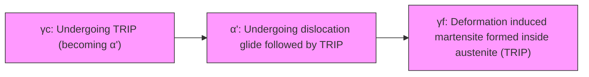

# Factors influencing austenite stability during Inter-critical annealing and effect on mechanical properties of low-density medium Mn steels

Kishan Bharti , Nitin Kumar Sharma \*

Department of Metallurgical and Materials Engineering, Indian Institute of Technology Jodhpur, Karwar, Jodhpur, Rajasthan, 342030, India

# H I G H L I G H T S

• Addition of 3 % Al, with and without 1 % Si, to medium-Mn steel was carried out.
• Si-free steel after IA got PSE value of 61 GPa% vs 41 GPa% for Si-containing steel.
• % of Retained austenite was 45 % for Si-free steel and 19 % for Si-containing steel.
• Local microstructural heterogeneity factors were discussed for austenite stability.
• Better PSE of Si-free steel is attributed to higher % of austenite and slower TRIP.

# A R T I C L E I N F O

# Keywords:

Advanced high strength steels (AHSS)

Low density steel (LDS)

Intercritical annealing (IA)

Retained austenite (RA)

Transformation induced plasticity (TRIP)

# A B S T R A C T

Addition of lightweight elements to medium-Mn steels has been seen as a potential method to reduce the density of advanced high strength steels (AHSS). Reduction in density of steels, especially in the automotive sector, leads to weight reduction of automobile and hence contributes towards improved fuel efficiency and lower emission of harmful gases. Present work investigates the addition of 3 % Al, with and without 1 % Si, to Fe–8Mn-0.2C medium-Mn steel system aiming to not only obtain an improved combination of strength and ductility, but also investigate the austenite stability. Hot-rolled steels were subjected to intercritical annealing (IA) followed by water quenching. Presence of Al and/or Si helped in broadening the IA window, thus allowing flexibility for selection of IA temperature. Uniaxial tensile test results show that the Si-free steel after IA performed better in terms of obtaining a product of strength and elongation (PSE) value of 61 GPa% as compared to PSE value of 41 GPa% for Si-containing steel. Microstructural characterization using electron backscatter diffraction (EBSD) and X-ray diffraction (XRD) revealed the presence of α-ferrite and austenite with negligible amount of martensite in both steels. However, the fraction of retained austenite was found to be significantly higher in Si-free steel (45 %) as compared to the Si-containing steel (19 %). Superior mechanical performance of Si-free steel is attributed to its higher retained austenite fraction and relatively slower TRIP effect. The role of IA temperature in determining the stability of austenite against transformation to martensite during cooling was investigated with the help of thermodynamic equilibrium predictions assisted with Koistinen-Marburger model for retained austenite calculations. Results indicate that additional factors related to local microstructural heterogeneity such as partitioning of elements and grain size differences may have contributed to the higher than expected austenite stability. Further, mechanical response of the obtained microstructural constituents is discussed in terms of the mechanical stability of retained austenite. Analysis related to the transformation kinetics of retained austenite revealed a lower value of mechanical stability parameter for Si-free steel, thus explaining the slower TRIP effect.

# 1. Introduction

There has been an increased attention to reduce weight of materials across industrial sectors to meet the sustainability targets. Steels are one of the highest consumption materials in industries owing to which lightweight steels or low density steels have gained significant attention for their potential to reduce greenhouse gas emissions. In automotive sector, for instance, a 10 % reduction in materials weight can result in a

7 % improvement in fuel efficiency which translates to a significant reduction in the $\mathrm { C O _ { 2 } }$ emissions [1]. Weight reduction strategies include down-gauging the conventional high strength steels and altering the density of such steels by incorporating lightweight elements such as Al and Si. However, the ability to down-gauge the sheet is limited by the dent resistance and stiffness of the steel. On the other hand, the lightweight elements have lower atomic mass and hence their addition would bring change to the lattice parameter and eventually resulting in a reduced density. Addition of 1 % Al and 1 % Si has been shown to reduce the steel density by 1.3 % and 0.8 % respectively [2–5]. Transformation induced plasticity (TRIP) steels are traditionally considered very important for automotive applications owing to their good ductility arising from high amount of retained austenite [6,7]. Addition of Al to high-Mn TRIP steel [i.e. Fe-(16–30)Mn-(3–14)Al-(0–2)C] system offers a significant reduction in density without hampering the promising combination of strength and ductility [8–10]. However, the widespread adoption of such steels in automotive industries is hindered due to challenges like poor weldability and higher cost. More efforts are now centred towards developing lightweight medium-Mn steels, containing 3–12 % Mn, having lower material cost and good combination of strength and ductility [11].

Medium-Mn steels are generally produced through a single step intercritical annealing (IA) heat treatment, resulting in a dual phase microstructure composed of ferrite and austenite [12]. Selection of suitable IA temperature is important to obtain an optimal balance of ferrite and austenite phase fraction. This temperature can be chosen through thermodynamic predictions with the help of Thermo-Calc. Extent of partitioning of elements such as Mn and C across ferrite and austenite at IA temperature determines the stability of austenite and hence effectiveness of TRIP effect to obtain enhanced mechanical properties [13]. A wider intercritical temperature range increases the probability of finding the IA temperature at which austenite fraction is maximum. Addition of Al and Si not only help in reducing the density, but also broaden the IA temperature window. Depending on the exact composition, these elements may also introduce δ-ferrite, which induces partitioning of C and Mn into austenite during IA making austenite stable [14]. Variation in %C due to the change in IA temperature has also been seen to affect the stability of austenite for dual-phase steels $[ 1 5 ,$ 16]. Si also contributes to solid solution strengthening and preventing cementite precipitation during cooling, thus ensuring the partitioning of more C into austenite and resulting in stable austenite [17,18].

Previous works have reported tensile strength and elongation for Aladded medium-Mn steels. For example, Fe-3.5Mn-5.9Al-0.4C exhibited a product of strength and ductility (PSE) of 29 GPa% owing to the TRIP effect [19]. Similarly, a PSE of 61 GPa% was obtained for Fe-7.75Mn-2.78Al-0.5C [20]. PSE was also found to vary between 19.7 and 26 GPa% as a function of IA temperature for Fe–5Mn-0.03Al-0.2- Si-0.04C [21]. Apart from a few examples, the combination of strength and ductility (visualized through PSE) remains significantly lower than high-Mn low density steels. While numerous studies have investigated the mechanical properties of lightweight medium-Mn steel, only a few studies have focused on addition of both Al as well as Si. Moreover, the understanding behind the role of intercritical temperature on the obtained retained austenite is also very limited [22,23]. Hence the present study not only aims to obtain an improved combination of strength and ductility through strategic addition of Al and Si to a medium-Mn steel, but also investigate the austenite stability and provide insights into the factors contributing to retain austenite after intercritical annealing.

# 2. Materials and methods

# 2.1. Alloy design

Selection of alloy composition involved prediction of equilibrium phases through thermodynamic calculations. These calculations were performed with the help of ThermoCalc utilizing the TCFE9 steel database. A systematic addition of Al is carried out to the Fe–8Mn-0.2C system and its effect was looked on various equilibrium phases. Fig. 1 shows the amount of different predicted phases as a function of temperature. Here, lower critical temperature is taken as $6 0 0 ~ ^ { \circ } \mathrm { C }$ for all compositions considering the limited diffusion capacity of Mn at lower temperatures. Base alloy without any Al shows a narrow intercritical temperature (ICT) range (from 600 to 688 ◦C). Addition of Al increases the range of ICT from $8 8 ~ ^ { \circ } \mathrm { C }$ for 0Al to 300 ◦C for 3Al. When the Al is increased to 4 %, δ-ferrite is also introduced as an equilibrium phase in the ICT range. Addition of 1 % Si to the 3Al system also has similar effect wherein δ-ferrite is present in the ICT range. Two compositions were hence selected to understand the effect of Al and Si on the microstructural evolution and mechanical properties. First composition is the maximum Al without any δ-ferrite, i.e. Fe–8Mn–3Al-0.2C and second composition involves addition of Si with associated presence of δ-ferrite, i.e. Fe–8Mn–3Al–1Si-0.2C.

# 2.2. Processing and characterization of materials

The two steel compositions (Fe–8Mn–3Al-0.2C and Fe–8Mn–3Al–1Si-0.2C, referred to M1 and M2 respectively) were fabricated using vacuum arc melting furnace. The melted ingot was undergone remelting 4 times by flipping the ingot before each remelt to ensure complete and uniform melting of the raw materials throughout the ingot. Homogenization of as-cast samples was carried out at 1100 ◦C for $^ { 2 \mathrm { ~ h , ~ } }$ followed by water quenching. Samples were then hot-rolled at 1100 ◦C to reduce the thickness by 50 %, followed by air cooling. Lastly, intercritical annealing (IA) was carried out at the selected temperature for 1 h, followed by water quenching. Selection of intercritical annealing temperature (IAT) was done by analysing the thermodynamically predicted phase fractions and concentration of different elements in austenite phase as a function of IAT, as illustrated in Fig. 2. Equilibrium austenite fractions $( \gamma ^ { e q } )$ and austenite composition for two steels at different IAT are shown in Fig. 2a and b respectively. Fig. 2a shows that the predicted fraction of austenite continuously increases with the increase in IAT. At first, this figure may suggest that selection of a higher IAT would result in higher austenite fraction. However, literature [24] directs that equilibrium concentration of austenite at relatively higher temperatures makes it unstable leading to either partial or complete transformation to martensite during cooling. This is also intuitive because austenite stabilizers like Mn and C also decrease with the increase in $^ { \mathrm { I A T , } }$ as shown in Fig. 2b. Hence there would be a critical concentration of Mn below which austenite would start to show transformation to martensite during cooling. Since phase diagrams would only provide equilibrium information about austenite at IAT and not about its stability during cooling, we have searched for relevant literature on this critical Mn concentration. Literature [25,26] suggested that concentration of Mn greater than or \~11 % typically gives rise to stable austenite and vice-versa. Hence in order to obtain higher fraction of austenite with an expectation of negligible transformation to martensite during cooling, an IAT of 700 ◦C was selected corresponding to Mn11 ˜ % for both the steel compositions.

Fig. 3 displays the schematic representation of all processing steps used in this work. Nomenclature of different sample conditions used in the present work is shown in Table 1. All these samples were undergone standard metallographic preparation steps including grinding, coarse and fine polishing followed by chemical etching to prepare the samples for microstructural analysis. Samples were etched using 2 % Nital solution (2 ml Nitric acid + 98 ml Ethanol) for 10–15 s to reveal the microstructure. Optical microscope (OM) and scanning electron microscope (SEM) were used for obtaining the microstructural images of different samples. Electron back scatter diffraction (EBSD) was used to measure crystal orientation. Analysis of EBSD data was carried out with the help of the post-processing software TSL OIM v8.5. X-ray diffraction (XRD) scans were performed on different samples to carry out phase identification using a PANalytical Empyrean instrument with $\mathtt { C u - } k _ { \alpha } ( \lambda =$

line

| Temperature (°C) | BCC   | CEMENTITE | FCC   | LIQUID | M23C6 |
| ---------------- | ----- | --------- | ----- | ------ | ----- |
| 0                | 1.0   | 0.0       | 0.0   | 0.0    | 0.0   |
| 200              | 0.95  | 0.0       | 0.05  | 0.0    | 0.0   |
| 400              | 0.85  | 0.0       | 0.2   | 0.0    | 0.0   |
| 600-688          | 0.5   | 0.0       | 1.0   | 0.0    | 0.0   |
| 800              | 0.2   | 0.0       | 1.0   | 0.0    | 0.0   |
| 1000             | 0.1   | 0.0       | 1.0   | 0.0    | 0.0   |
| 1200             | 0.05  | 0.0       | 1.0   | 0.0    | 0.0   |
| 1400             | 0.0   | 0.0       | 1.0   | 0.0    | 0.0   |

line

| Temperature (°C) | BCC   | CEMENTITE | FCC   | LIQUID | M23C6 |
| ---------------- | ----- | --------- | ----- | ------ | ----- |
| 0                | 0.9   | 0.0       | 0.0   | 0.0    | 0.0   |
| 200              | 0.9   | 0.0       | 0.0   | 0.0    | 0.0   |
| 400              | 0.85  | 0.0       | 0.1   | 0.0    | 0.0   |
| 600              | 0.7   | 0.0       | 0.5   | 0.0    | 0.0   |
| 800              | 0.5   | 0.0       | 1.0   | 0.0    | 0.0   |
| 1000             | 0.3   | 0.0       | 1.0   | 0.0    | 0.0   |
| 1200             | 0.1   | 0.0       | 1.0   | 0.0    | 0.0   |
| 1400             | 0.0   | 0.0       | 1.0   | 0.0    | 0.0   |

line

| Temperature (°C) | BCC   | CEMENTITE | FCC   | LIQUID | M23C6 |
| ---------------- | ----- | --------- | ----- | ------ | ----- |
| 0                | 0.9   | 0.0       | 0.0   | 0.0    | 0.0   |
| 200              | 0.9   | 0.0       | 0.0   | 0.0    | 0.0   |
| 400              | 0.85  | 0.0       | 0.1   | 0.0    | 0.0   |
| 600              | 0.7   | 0.0       | 0.3   | 0.0    | 0.0   |
| 800              | 0.4   | 0.0       | 1.0   | 0.0    | 0.0   |
| 1000             | 0.2   | 0.0       | 1.0   | 0.0    | 0.0   |
| 1200             | 0.1   | 0.0       | 1.0   | 0.0    | 0.0   |
| 1400             | 0.4   | 0.0       | 1.0   | 0.0    | 0.0   |

line

| Temperature (°C) | BCC   | CEMENTITE | FCC   | LIQUID | M23C6 |
| ---------------- | ----- | ---------- | ----- | ------ | ----- |
| 0                | 0.9   | 0.0        | 0.0   | 0.0    | 0.0   |
| 200              | 0.9   | 0.0        | 0.0   | 0.0    | 0.0   |
| 400              | 0.9   | 0.0        | 0.1   | 0.0    | 0.0   |
| 600              | 0.7   | 0.0        | 0.3   | 0.0    | 0.0   |
| 800              | 0.3   | 0.0        | 1.0   | 0.0    | 0.0   |
| 1000             | 0.1   | 0.0        | 1.0   | 0.0    | 0.0   |
| 1200             | 0.5   | 0.0        | 1.0   | 0.1    | 0.0   |
| 1400             | 1.0   | 0.0        | 0.1   | 0.1    | 0.0   |

line

| Temperature (°C) | BCC | CEMENTITE | FCC | LIQUID | M23C6 |
|---|---|---|---|---|---|
| 150 | 0.9 | 0.0 | 0.0 | 0.0 | 0.0 |
| 200 | 0.9 | 0.0 | 0.0 | 0.0 | 0.0 |
| 400 | 0.9 | 0.0 | 0.0 | 0.0 | 0.0 |
| 600 | 0.7 | 0.0 | 0.3 | 0.0 | 0.0 |
| 800 | 0.5 | 0.0 | 0.5 | 0.0 | 0.0 |
| 1000 | 0.3 | 0.0 | 0.7 | 0.0 | 0.0 |
| 1200 | 0.5 | 0.0 | 0.5 | 0.0 | 0.0 |
| 1400 | 1.0 | 0.0 | 0.1 | 0.0 | 0.0 |
The chart includes a labeled region: '600-980 °C' between the two phases.

line

| Temperature (°C) | BCC | CEMENTITE | FCC | LIQUID | M23C6 |
|---|---|---|---|---|---|
| 0 | 0.95 | 0.0 | 0.0 | 0.0 | 0.0 |
| 200 | 0.95 | 0.0 | 0.0 | 0.0 | 0.0 |
| 400 | 0.95 | 0.0 | 0.1 | 0.0 | 0.0 |
| 600 | 0.85 | 0.0 | 0.3 | 0.0 | 0.0 |
| 800 | 0.75 | 0.0 | 0.5 | 0.0 | 0.0 |
| 1000 | 0.45 | 0.0 | 0.65 | 0.0 | 0.0 |
| 1200 | 0.65 | 0.0 | 0.45 | 0.0 | 0.0 |
| 1400 | 1.0 | 0.0 | 0.0 | 0.0 | 0.0 |
The chart includes two vertical yellow lines: '600-1000 °C' and '3-Al 1-Si'. The y-axis label 'Volume Fraction' indicates the relative volume fraction for each material at each temperature point.

Fig. 1. Fraction of equilibrium phases predicted through thermodynamic calculations as a function of temperature for the addition of a) 0Al, b) 1Al, c) 2Al, d) 3Al, e) 4Al, and f) 3Al–1Si to Fe–8Mn-0.2C system.

line

| Temperature (°C) | Predicted Equilibrium Fraction of Austenite (%) - M1 | Predicted Equilibrium Fraction of Austenite (%) - M2 |
| ---------------- | -------------------------------------------------- | --------------------------------------------------- |
| 700              | 48                                                 | 32                                                  |

line

| Temperature (°C) | M1   | M2   | Al   | Si   | C    |
| ---------------- | ---- | ---- | ---- | ---- | ---- |
| 600              | 2.0  | 2.0  | 2.0  | 2.0  | 0.5  |
| 700              | 2.5  | 12.0 | 2.5  | 2.0  | 0.5  |
| 800              | 3.0  | 10.0 | 3.0  | 2.5  | 0.5  |
| 900              | 3.5  | 8.0  | 3.5  | 3.0  | 0.5  |

Fig. 2. (a) Predicted equilibrium fraction of austenite (γeq) at various intercritical annealing (IA) temperatures, b) Predicted composition of austenite at different temperatures for M1 and M2.

1.542 ˚A) radiation. Range of diffraction angle (2θ) is from 40 to 115◦) and the step size is 0.03◦. The volume fraction of austenite phase was determined using the following equation [27]:

$$
V _ {\gamma} = \left(\frac {1}{A} \sum_ {j = 1} ^ {A} I _ {\gamma j} / R _ {\gamma j}\right) / \left[ \frac {1}{B} \sum_ {j = 1} ^ {B} I _ {\alpha j} / R _ {\alpha j} + \frac {1}{A} \sum_ {j = 1} ^ {A} I _ {\gamma j} / R _ {\gamma j} \right]
$$

Where, A and B are number of austenite and ferrite peaks respectively, $I _ { \alpha j }$ and $I _ { \gamma j }$ are integrated intensity of particular ferrite and austenite peak, $R _ { \alpha j }$ and $R _ { \gamma j }$ are theoretical intensity of particular ferrite and austenite peak.

For tensile testing, dog bone-shaped specimens with a gauge length of 2 mm, a thickness of 1 mm, and a width of 1 mm, were machined using wire electric discharge machining (wire-EDM). The tests were carried out at room temperature with a strain rate of $1 0 ^ { - 3 } s ^ { - 1 }$ on a Tinus-Olsen ST25 universal testing machine (UTM) equipped with a 25 kN load cell. The SEM was also used to carry out fractography of the fractured tensile samples to understand the fracture behaviour.

# 3. Results and discussions

# 3.1. Microstructural evolution during hot-rolling

SEM microstructures of M1-HR and M2-HR samples taken in secondary electron (SE) mode are shown in Fig. 4. HR microstructures of both steels comprise of multiple phases including ferrite, austenite, and martensite. M1 steel exhibits the presence of polygonal α-ferrite and lath-type morphology of martensitic-austenitic $( \alpha ^ { \prime } + \gamma )$ phase. Similarly, the presence of δ-ferrite, α-ferrite, and a very fine martensitic-austenitic $( \alpha ^ { \prime } + \gamma )$ phase is observed for M2 steel. Observation of a significantly higher amount of ferrite, especially δ-ferrite, in M2 steel is expected according to the thermodynamic predictions, as shown in Fig. 1d, f, owing to the presence of Si. It is expected that the formation of α-ferrite in M1 steel occurs when it was subjected to hot rolling with finish rolling temperatures reaching around $9 0 0 ^ { \circ } \mathrm { C } .$ . On the other hand, δ-ferrite in M2 steel forms while soaking at 1100 ◦C before hot rolling and some fraction of α-ferrite forms from γ when it is subjected to finish rolling temperatures.

line

| Sample   | Temperature (°C) |
| -------- | ---------------- |
| M1-AC    | 1100             |
| M1-HQ    | 1100             |
| M1-HR    | 5                |
| M2-HR    | 50               |
| M1-IA    | 3                |
| M2-IA    | 5                |

Fig. 3. Schematic illustration of thermo-mechanical processing along with observed microstructures after each processing.

Table 1 Sample nomenclature of different processing conditions.

<table><tr><td>Sample condition</td><td>Nomenclature for 3Al-0Si (M1)</td><td>Nomenclature for 3Al-1Si (M2)</td></tr><tr><td>As cast</td><td>M1-AC</td><td>M2-AC</td></tr><tr><td>Homogenized (1100 °C for 2 h followed by water quenching)</td><td>M1-HQ</td><td>M2-HQ</td></tr><tr><td>Hot rolled (~50 % thickness reduction at 1100-900 °C)</td><td>M1-HR</td><td>M2-HR</td></tr><tr><td>Inter-critical annealed (700 °C for 1 h followed by water quenching)</td><td>M1-IA</td><td>M2-IA</td></tr></table>

XRD results for both of these samples are also shown in Fig. 4c. The plots confirm the presence of ferrite/martensite and austenite phases in both samples. Based on the phase fraction calculation method described in earlier section, the fraction of γ phase is calculated as 5.1 % and 5.7 % for M1 and M2 steel respectively. To understand the low fraction of austenite and presence of martensitic features observed through SEM images, the martensite start (Ms) temperatures were calculated based on the following equation [28]:

text_image

a)
a₁)
a₂)
a + γ
3 μm
5 μm
b)
b₁)
b₂)
50 μm
α + γ
α + γ
α + γ
5 μm
b₃)
α + γ
500 nm
c)
Intensity (a.u.)
M1-HR
γ111
γ200
α200
α211
α220
fγ = 5.1%
fγ = 5.7%
2θ (°)

Fig. 4. SEM images for (a -a ) M1-HR sample and $\left( \mathbf { b } _ { 1 } { \cdot } \mathbf { b } _ { 3 } \right)$ M2-HR sample showing the presence of different phases; (c) XRD plots for M1-HR and M2-HR samples.

$$
M _ {S} (^ {\circ} C) = 5 3 9 - 4 2 3 C - 3 0. 4 M n - 7. 5 S i + 3 0 A l
$$

All the individual elemental concentrations were taken corresponding to the austenite phase at hot-rolling temperatures in wt.%. The $\mathbf { M } _ { s }$ temperatures for the two HR samples are calculated as 319 and $2 9 6 ~ ^ { \circ } \mathrm { C }$ for M1 and M2 respectively. These values indicate towards the transformation of some austenite into martensite during cooling and hence support the observation of martensite in both samples. Formation of martensite in both steels would have occurred during air cooling after hot rolling.

# 3.2. Microstructural evolution during intercritical annealing

SEM microstructures of M1-IA and M2-IA samples taken in secondary electron (SE) mode are shown in Fig. 5a and 6a. Intercritically annealed microstructures for both the samples also comprise of multiple phases similar to hot rolled microstructures. However, IA microstructures only seem to have a negligible amount of martensite in both the samples. Presence of δ-ferrite is also observed only in M2-IA sample which is expected as per thermodynamic predictions due to the presence of Si. EBSD phase maps for the two samples are shown in Fig. 5b and 6b. While M1-IA sample consists of α-ferrite and austenite, there is presence of α-ferrite, austenite and coarse band-type morphology of δ-ferrite in the M2-IA sample. To confirm the presence of different phases in the two IA samples, XRD scans were also taken and corresponding plots are shown in Fig. 7. Quantitative phase analysis, based on the phase fraction calculation method described in earlier section, reveals that M1-IA and M2-IA has 45 % and 19 % austenite respectively.

When M1-HR microstructure comprising of α-ferrite and martensiticaustenitic (αʹ + γ) phase with \~5 % austenite is heated at the intercritical annealing temperature (IAT), the unstable martensite should first transform into austenite. In addition, some fraction of α-ferrite may also transform to austenite in order to achieve the equilibrium fraction of \~50 % austenite. Resulting microstructure for M1-IA at IAT would be \~50 % austenite with some fraction of ferrite and negligible amount of martensite. However, the observed fraction of austenite is slightly lower $( \sim 4 5 ~ \% )$ than the equilibrium prediction at IAT. Similarly, M2-HR microstructure with α-ferrite, martensitic-austenitic $( \alpha ^ { \prime } + \ \gamma )$ phase, and δ-ferrite is also expected to involve phase transformations during heat treatment at IAT. Firstly, the unstable martensite phase should transform into austenite. Afterwards, the two types of ferrite phases may also transform so that the equilibrium fraction of \~30 % austenite is achieved. Based on these transformations, it is expected that resulting microstructure at IAT would comprise of \~30 % austenite with some fraction of two types of ferrite phases and negligible amount of martensite. However, again the observed fraction of austenite in M2-IA is also lower (\~19 %) than the equilibrium prediction at IAT. These differences in austenite phase fractions would be discussed further in the next section.

# 3.3. Factors affecting austenite stability during intercritical annealing

The observed fraction of austenite in both IA samples are lower than the predicted equilibrium austenite fractions at IAT. Hence this difference needs further discussion. As shown earlier in Fig. 2a, the equilibrium austenite fraction increases with the increase in IAT. At the same time, the stability of austenite also decreases with the increase in IAT. This is due to the decrease in the concentration of austenite stabilizing elements such as Mn and C in austenite (Fig. 2b). Since the stability of austenite with respect to transformation into martensite upon cooling decreases, all the predicted austenite fraction may not be retained at room temperature. Hence one of the plausible reasons why the observed austenite fractions in IA samples are significantly different from the equilibrium predicted austenite fractions could be the transformation of some of the austenite into martensite upon cooling. To verify this, Ms temperatures were calculated using the equation mentioned earlier [28] for the respective steel based upon the austenite composition at IAT. Further, the Koistinen-Marburger model [29] was used to calculate the fraction of austenite retained at RT based on the Ms temperatures calculated using the following equation and the results are shown in Fig. 8 (a -a ).

$$
(1 - f) = \exp \{- 0. 0 1 1 [ M s - T ] \}
$$

In the temperature regime (shaded region in Fig. 8a) where the calculated Ms temperature is lower than RT, the complete austenite fraction, predicted from the equilibrium calculations, would be expected to retain at the room temperature. On the other hand, the calculated Ms temperature is higher than RT for the higher IAT. Hence there exists a critical IAT below which the complete retention of predicted equilibrium austenite fraction is expected and above this critical IAT, the fraction of retained austenite at RT is always lower than the equilibrium predictions at IAT. Since the IAT used in current study for M1 steel (i.e. $7 0 0 ~ ^ { \circ } \mathrm { C } )$ is in fact above the corresponding critical temperature, it is expected that not all the predicted austenite (\~50 %) would be retained at RT. Based on the plot $( { \mathrm { F i g . ~ } } 8 \mathbf { a } _ { 1 } ) _ { : }$ , fraction of retained austenite at RT

text_image

a)
a₁)
α
↓
α' + γ
↓
20 μm
a₂)
α
↓
α' + γ
↓
5 μm
a₃)
α'
α
3 μm
a₄)
α
α' + γ
↓
2 μm
b)
5 μm

Fig. 5. (a –a ) SEM images for M1-IA sample showing the presence of different phases; (b) EBSD phase map for M1-IA sample (coloured phase represents austenite).

text_image

a)
a₁)
α' + γ + α
↓
δ
200 µm
a₂)
α' + γ
↓
δ
α
20 µm
a₃)
α' + γ
↓
α
5 µm
a₃)
α' + γ
α
3 µm
b)
5 µm

Fig. 6. (a1–a4) SEM images for M2-IA sample showing the presence of different phases; (b) EBSD phase map for M2-IA sample (coloured phase represents austenite).

line

| 2θ (°) | Intensity (a.u.) | Label     |
|--------|------------------|-----------|
| ~43    | ~1.0             | α110      |
| ~47    | ~0.8             | γ111      |
| ~50    | ~0.3             | γ200      |
| ~65    | ~0.4             | α200      |
| ~75    | ~0.2             | γ220      |
| ~80    | ~0.3             | α211      |
| ~90    | ~0.2             | γ311      |
| ~95    | ~0.3             | γ222      |
| ~100   | ~0.4             | α220      |
f_T = 45.6% |

Fig. 7. XRD plots for M1-IA and M2-IA samples.

for M1 steel would be \~16 %. However, this calculated fraction is also significantly lower than the observed austenite fraction for M1-IA sample. This leads us to believe that there are some additional factors behind the observed austenite fractions.

Other plausible reasons behind this discrepancy could be related to the local microstructural heterogeneity. One such heterogeneity can be in terms of segregation or local enrichment of elements such as Mn due to elemental partitioning at IAT. This phenomena has strong theoretical foundation which is related to insufficient diffusion of solute elements within austenite grains, owing to the finite annealing time. Experimental observations of such local Mn enrichment during IA has been reported in the literature [30]. In this work by Yu et al. [30], the presence of higher than expected Mn in austenite regions were clearly identified experimentally. If many of the austenite grains have Mn segregation resulting in Mn > 12 %, the stability of those austenite grains would be much higher than expected and hence fraction of retained austenite would be much higher than the calculated fraction based on equilibrium austenite composition (Mn11 ˜ %). This reason could well explain the higher observed fraction of \~45 % as compared to the calculated fraction \~16 %. Further, in addition to the preferential segregation of some elements, difference in austenite grain sizes could also contribute to the local microstructural heterogeneity. Stability of austenite with finer grain size (<0.5 μm) would be much higher as compared to a coarser grain sized austenite [31,32]. The observed grain size distribution for M1-IA sample is shown in Fig. 8b. It is clear that there exists a number of austenite grains with grain size lower than the critical value (0.5 μm), indicating towards higher stability of such austenite grains. Furthermore, finer austenite grains typically have higher carbon concentrations as compared to their coarser counterparts [31], which enhances their stability even further. Presence of austenite grains with sizes <0.5 μm as well as >0.5 μm and corresponding differences in carbon partitioning would mean that the stability of these austenite grains would also be locally distinct resulting in local microstructural heterogeneity. Increased austenite stability due to the presence of a higher fraction of finer grains would result in a fraction of retained austenite higher (\~45 %) than the calculated one (\~16 %). It is believed that a combination of these two factors may be contributing to the higher observed fraction of austenite for M1-IA sample.

In the case of M2-IA sample, the IAT used is also above the critical temperature (Fig. 8a ), which again suggests that not all of the predicted austenite (\~30 %) would be retained at room temperature (RT). The calculated fraction (\~11 %) is also lower than the observed austenite fraction (\~19 %) for the M2-IA sample. This observed discrepancy in austenite fractions can again be explained in terms of local microstructural heterogeneities. The factors can include the preferential segregation of elements (Mn from α-ferrite and δ-ferrite to austenite and Si from austenite to δ-ferrite) [33] and presence of a high fraction of finer grains resulting in austenite stability higher than expected. Fig. 8b also shows the grain size distribution for both IA samples demonstrating that the fraction of finer grains is relatively lower for M2-IA than the M1-IA sample and hence it is believed that the extent of stability of austenite grains would be lower in M2-IA than M1-IA. This could be the reason for a relatively lower difference in observed and calculated austenite fractions for M2-IA as compared to M1-IA. Fig. 8c summarizes the elemental partitioning during intercritical annealing, resulting in the observed fraction of retained austenite for both steels. For both steels, the austenite stabilizers, such as Mn and C, partition from ferrite grains into austenite, as shown by red arrows. In the case of M2, however, an additional partitioning of Si is also observed, where it partitions from austenite to both δ-ferrite and α-ferrite, as shown by black arrows. The number of arrows in each case also denotes the extent of partitioning of different elements across phases.

In summary, the Ms calculations assisted by K-M model were insufficient to fully account for the discrepancies between the observed and equilibrium predicted austenite fractions. Hence it compelled the exploration of additional contributing factors responsible for the observed austenite fractions. The possible impact of local microstructural heterogeneities on austenite stability was investigated and it was found that a combination of all these factors indeed contribute to stability of austenite and hence the observed austenite fractions.

Fig. 8. Fraction of austenite retained at room temperature, calculated with the help of Koistinen-Marburger model, along with calculated $\mathbf { M } _ { s }$ temperatures (corresponding to the austenite compositions) for (a ) M1 and (a ) M2 steel; (b) Grain size distribution of M1 and M2 steel; (c) Schematic explaining the elemental partitioning for M1 and M2 steels.

# 3.4. Partitioning and local enrichment of Mn during intercritical annealing

As discussed in the previous section, Mn partitioning during intercritical annealing is one of the plausible factors in deciding the fraction of retained austenite in IA samples. However, the underlying reasons behind the local enrichment of Mn need further discussion. Fig. 9a shows the schematic of the Mn concentration profile near the $\alpha / \gamma$ interface in the initial condition $\left( \mathrm { t } = 0 \right)$ when the sample is just brought to the IAT. Under this condition, the concentration of Mn will be same as observed in the HR samples and expected to be lower than equilibrium concentration of Mn in austenite phase at IAT. Shaded region in these concentration profiles represent the fraction of $\gamma .$ Fig. 9b shows the concentration profile at time ${ \bf t } = { \bf t } _ { 1 } ,$ , experienced at the IAT. Depending on the equilibrium concentrations of Mn at IAT in α and $\gamma ,$ the concentrations at the interface would change to establish local equilibrium leading to the development of concentration gradients within α and $\gamma .$ Actual concentration gradient would be dependent on the initial concentration far away from the interface $( C _ { M n } ^ { \gamma }$ and $C _ { M n } ^ { \alpha / \delta } \colon$ : i.e. Mn concentration in two phases in the hot-rolled samples) and equilibrium concentrations $( C _ { M n } ^ { \gamma ^ { ( e q ) } }$ q) and Cα/δ(eq)Mn ) $C _ { M n } ^ { \alpha / \delta ^ { ( e q ) } } )$ in the two phases at the IAT. These concentration gradients would gradually diminish as the interface moves towards α phase. Ideally the concentration profile in the final

condition $\left( \mathrm { t } = \infty \right)$ should look like Fig. 9c if the equilibrium is achieved at IAT. However, there will still be concentration gradient existing due to a definite annealing time of 1 h and hence, some parts of γ will remain locally enriched in Mn as compared to the equilibrium concentration of Mn as shown by Yu et al. [30].

# 3.5. Mechanical properties of hot-rolled and intercritically annealed samples

Engineering stress-strain curves for HR and IA conditions of two steels are shown in Fig. 10 While HR samples show a brittle nature with significantly high UTS and very low total elongation, the IA samples exhibit ductile nature with good UTS and significantly higher total elongation. Specifically, the M1 steel in HR condition shows UTS and TE of $1 7 1 2 \pm 1 0$ MPa and 14.8 ± 0.5 % respectively, while it shows 867 ± 10 MPa and $7 1 . 8 \pm 0 . 5$ % respectively in the IA condition. On the other hand, the M2 steel in HR condition shows UTS of 1055 ± 15 MPa and TE of $1 5 . 4 \pm 0 . 8 \ \% ,$ , while it shows 698 ± 20 MPa and $5 9 . 4 \pm \ : 0 . 6$ % respectively in IA condition. High strength and poor elongation of HR samples can be attributed to the presence of martensite for both steels. In contrast, IA samples exhibit a favourable combination of strength and ductility with product of strength and ductility (PSE) values of 61 GPa% and 41 GPa% respectively for M1 and M2 steel. These properties stem from the presence of retained austenite contributing to both strength and TRIP effect. Since stacking fault energy (SFE) values of both steels are below 18 $\mathrm { { m J / m ^ { 2 } } }$ which is a critical SFE value below which the alloys are expected to show TRIP effect, transformation of austenite to martensite is expected during deformation resulting in improved elongation.

Corresponding fractography results of tensile fractured samples are also shown in Fig. 10. Observation of cleavage fracture features such as flat facets and river markings in the fractographs of HR samples also support their brittle nature. These river patterns represent the crack propagation direction and are caused by crack movement through the crystal along several parallel planes, forming a series of plateaus and ledges. Ductile nature of IA samples is confirmed from the small dimple ruptures clearly visible in the fractographs. Austenite present at these regions absorbs strain energy during deformation through transformation into martensite, forming fine dimples [34–36].

Fig. 9. Schematic showing the concentration of Mn in Ferrite and Austenite phases across the moving interface during intercritical annealing at $\mathbf { \rho } ( \mathbf { a } ) \mathbf { t } = 0 ,$ i. e. initial condition when just brought to IAT, $\mathbf { ( b ) } \mathbf { t } = \mathbf { t } _ { 1 } ,$ , and $( { \mathrm { c } } ) { \mathrm { t } } = \infty ,$ i.e. final condition assuming equilibrium is achieved.

Strain hardening rate for the IA samples is plotted along with true stress-strain curves and shown in Fig. 11a. These curves can provide insights into the correlation between mechanical behaviour and microstructural changes during tensile test. Strain hardening rate plots delineate three distinct stages with stage-I showing a notable decline in the strain hardening rate primarily attributed to the deformation of ferrite [37]. Subsequently, the strain hardening rate gradually diminishes in stage-II to 1338 MPa (point A) and 989 MPa (point B) values for M1 and M2 respectively. This gradual decline is associated with the deformation-induced martensite transformation of austenite resulting in TRIP effect [38]. Lastly, stage-III is characterized by a decrease in strain hardening rate beyond point A and B for M1 and M2 respectively. This drop is attributed to the void formation before necking and ultimately resulting in material failure [39]. The EBSD phase maps corresponding to the tensile fractured samples for M1-IA and M2-IA are presented in Fig. 11(c) and (d) respectively. Austenite fractions from these maps are found to be 6.5 % and 3.2 % respectively for M1 and M2. In contrast, the austenite fractions before tensile tests were 45 % and 19 % respectively. This significant reduction in austenite fraction suggests transformation of austenite to martensite during tensile deformation, thus demonstrating the occurrence of TRIP effect.

To understand the kinetics of transformation from retained austenite to martensite, following equation is used to model the transformation as a function of true strain [40]:

$$
f _ {\gamma} = A \times e ^ {- B \varepsilon}
$$

Where $f _ { \gamma }$ is the volume fraction of austenite at any instance as a function of strain, A is the volume fraction of austenite before the tensile test, B is the fitting parameter that characterize the mechanical stability of retained austenite, and ε is the true strain. Based on the values of austenite fractions (before the tensile test, i.e. A and after the tensile fracture, i.e. $. f _ { \gamma }$ corresponding to maximum strain), the equation is fitted yielding the values of fitting parameter B as 3.6 and 3.8 respectively for M1 and M2. A lower value of fitting parameter B indicates higher mechanical stability and lower preference towards transformation into martensite during mechanical straining. The small difference in B values for the two steels suggests high mechanical stability of austenite and hence slower TRIP kinetics for both steels. A lower B value of M1 as compared to M2 means a relatively slower TRIP effect for M1. Slower

Fig. 10. (a, d) Engineering stress – Engineering strain plot of HR and IA samples of (a) M1 and (d) M2 steel; $( \mathbf { b - c } , \mathbf { e - f } )$ SEM images of fractured HR and IA samples of (b–c) M1 and (e–f) M2 steel.

line

| Panel | Material | Peak Stress (MPa) | Strain Strength (e⁻³⁶e) | Retained Austenite (%) |
|-------|----------|-------------------|--------------------------|------------------------|
| a)    | M1-IA   | ~5000             | ~0.05                    | ~0.2                   |
| a)    | M2-IA   | ~4000             | ~0.05                    | ~0.15                  |
| b)    | M1-IA   | ~1000             | ~0.05                    | ~0.05                  |
| b)    | M2-IA   | ~1000             | ~0.05                    | ~0.05                  |
| c)    | Fγ = 6.5% | ~3000             | ~0.1                     | ~0.4                   |
| c)    | δ-ferrite | ~1500            | ~0.3                     | ~0.2                   |
| d)    | Fγ = 3.2% | ~1500             | ~0.3                     | ~0.1                   |
| d)    | Strain Partitioning | -                 | -                        | -                      |
| e)    | -        | ~1500             | ~0.3                     | ~0.1                   |
| g)    | -        | ~1500             | ~0.3                     | ~0.1                   |
| h)    | -        | ~1500             | ~0.3                     | ~0.1                   |

Fig. 11. (a) True stress as well as strain hardening rate as a function of true strain and (b) Fraction of retained austenite as a function of true strain during tensile testing for M1-IA and M2-IA samples; (c–d) EBSD phase maps after tensile tests for (c) M1-IA and (d) M2-IA samples; (e–h) KAM maps (e, g) before and (f, h) after tensile tests for (e, f) M1-IA and (g, h) M2-IA samples.

TRIP in M1 can be attributed to the higher fraction of retained austenite and relatively lower SFE value. On the other hand, despite having a lower fraction of retained austenite, the presence of δ-ferrite in M2 enhances the partitioning of Mn and C at IAT into the austenite, thus making it more stable. As a result, both the steels possess favourable combination of strength and ductility.

Kernel average misorientation (KAM) maps for the two steels in IA condition before and after the tensile test are illustrated in Fig. 11c-f. KAM for each point in the map is the average misorientation relative to its nearest neighbours and hence the map provides insights into the extent of deformation within individual grains. Lower KAM values are usually associated with the regions where untransformed austenite phase is present and conversely, transformed martensite phase regions are corresponding to the higher KAM values [41]. A significant increase in the KAM values is observed for both samples after the tensile testing which is an indication of a good extent of transformation from austenite to martensite. In addition to the increase in KAM after tensile test, the M2 sample also exhibit strain partitioning into two distinct regions, as shown in Fig. 11f. One of these regions is with low KAM indicating lower strain, most likely in δ-ferrite regions, and another region is with high KAM indicating the transformed martensite. Overall, the mechanical stability of retained austenite and its volume fraction collectively decide the mechanical performance of these steels. Moreover, a gradual TRIP effect enables a sufficient increase in flow stress to counter plastic instability and maintain stable deformation [30].

# 3.6. Effect of austenite stability on deformation mechanisms

Fig. 12 shows a schematic summarizing the observed TRIP effect as a function of strain. The figure illustrates the deformation induced transformation from austenite to martensite during the tensile test. As described in earlier section (Fig. 8), local microstructural heterogeneity such as difference in Mn partitioning and austenite grain size affects the austenite stability and eventually determines the fraction of austenite retained at room temperature. Two types of austenite grains are taken for example, one of them is coarser in size $( \gamma _ { c }$ with relatively lower Mn and C concentration) and another one is finer in size $( \gamma _ { f }$ with relatively higher Mn and C concentration). Once deformation is applied, coarser grains begin to transform to martensite earlier due to their lower mechanical stability thus providing the high work hardening at low strain values. On the other hand, finer grains transform to martensite later during deformation due to their higher mechanical stability thus contributing more towards constant work hardening during continuous TRIP effect [31,42]. This constant work hardening region is observed over larger strain values in both IA samples, containing significantly high fraction of fine grains (as seen from the grain size distribution plots in Fig. 8b), thus explaining the high PSE values observed in both steels (61 GPa% for M1 and 41 GPa% for M2). However as discussed before, the relatively higher PSE value of M1 is attributed to the higher fraction of austenite.

flowchart

Fig. 12. Schematic of the TRIP effect as deformation mechanism; red arrows represent the partitioning of Mn from ferrite to austenite. (For interpretation of the references to colour in this figure legend, the reader is referred to the Web version of this article.)

# 4. Conclusions

Addition of Al and Si to medium-Mn steel was carried out with an aim to obtain a good combination of strength and ductility. Based on the present work, following pertinent conclusions can be drawn:

1. Microstructure of hot rolled condition of M1 steel comprised of polygonal α-ferrite and lath-type morphology of martensiticaustenitic $( \alpha ^ { \prime } + \gamma )$ phase. Addition of Si in the case of M2 steel resulted in a microstructure of δ-ferrite, α-ferrite, and a very fine martensitic-austenitic (αʹ + γ) phase.
2. After intercritical annealing, mainly α-ferrite and austenite with negligible amount of martensite were observed for both steels. In addition, a coarse band of δ-ferrite was also observed for M2 steel due to the presence of Si. Quantitative phase analysis using XRD revealed the fraction of austenite as 45 % and 19 % in M1-IA and M2- IA samples respectively.
3. Several factors related to the stability of austenite against transformation to martensite during cooling were found to be responsible for the difference between the observed and predicted austenite fraction. Factors related to local microstructural heterogeneities such as elemental partitioning and grain size differences may have contributed to the higher than expected austenite stability.
4. IA samples showed an excellent combination of strength and ductility with the obtained PSE values for M1 and M2 steels as 61 and 41 GPa% respectively. Higher PSE value for M1 steel is associated with the higher fraction of retained austenite and finer grains, resulting in slower TRIP. These explanations are well supported by the analysis related to transformation kinetics and mechanical stability of austenite.

# CRediT authorship contribution statement

Kishan Bharti: Writing – original draft, Software, Methodology, Investigation, Formal analysis, Data curation, Conceptualization. Nitin Kumar Sharma: Writing – review & editing, Supervision, Project administration, Investigation, Funding acquisition, Formal analysis, Conceptualization.

# Declaration of competing interest

The authors declare that they have no known competing financial interests or personal relationships that could have appeared to influence the work reported in this paper.

# Data availability

Data will be made available on request.

# References

[2] U. Bohnenkamp, R. Sandstrom, ¨ Evaluation of the density of steels, Steel Res. 71 (3) (2000) 88–93.
[3] G. Frommeyer, U. Brüx, Microstructures and mechanical properties of highstrength fe-mn-al-C light-weight TRIPLEX steels, Steel Res. Int. 77 (9–10) (2006) 627–633.
[4] H.W. Lee, G. Kim, S.H. Park, Lightweight steel solutions for automotive industry, in: AIP Conference Proceedings, American Institute of Physics, 2010.
[5] S. Khaple, B.R. Golla, V.S. Prasad, A review on the current status of Fe–Al based ferritic lightweight steel, Defence Technology 26 (2023) 1–22.
[6] A. El-Sherbiny, et al., Studying the effect of manganese content on TRIP advanced high strength steel, in: Materials Science Forum, Trans Tech Publ, 2019.
[7] A. El-Sherbiny, et al., Replacement of silicon by aluminum with the aid of vanadium for galvanized TRIP steel, J. Mater. Res. Technol. 9 (3) (2020) 3578–3589.
[8] R. Baligidad, A. Radhakrishna, Effect of alloying additions on structure and mechanical properties of high carbon Fe-16 wt.% Al alloy, Mater. Sci. Eng., A 287 (1) (2000) 17–24.
[9] K. Choi, et al., Effect of aging on the microstructure and deformation behavior of austenite base lightweight Fe–28Mn–9Al–0.8 C steel, Scr. Mater. 63 (10) (2010) 1028–1031.
[10] L. Fu, et al., Lüders-like deformation induced by delta-ferrite-assisted martensitic transformation in a dual-phase high-manganese steel, Scr. Mater. 67 (3) (2012) 297–300.
[11] D. Raabe, et al., Current challenges and opportunities in microstructure-related properties of advanced high-strength steels, Metall. Mater. Trans. 51 (2020) 5517–5586.
[12] G. Liu, et al., Effect of intercritical annealing temperature on multiphase microstructure evolution in ultra-low carbon medium manganese steel, Mater. Char. 173 (2021) 110920.
[13] Q. Guo, et al., On the mechanism of Mn partitioning during intercritical annealing in medium Mn steels, Acta Mater. 225 (2022) 117601.
[14] B. Sun, et al., Phase transformation behavior of medium manganese steels with 3 wt pct aluminum and 3 wt pct silicon during intercritical annealing, Metall. Mater. Trans. 47 (2016) 4869–4882.
[15] M. Alibeyki, et al., Modification of rule of mixtures for estimation of the mechanical properties of dual-phase steels, J. Mater. Eng. Perform. 26 (2017) 2683–2688.
[16] M. Zamani, H.M. Ghasemi, H. Mirzadeh, Effect of variation of martensite with a constant carbon content on mechanical behavior and sliding wear of dual phase steels, Tribol. Lett. 70 (3) (2022) 73.
[17] M.A. Sohrabizadeh, Y. Mazaheri, M. Sheikhi, The effects of age hardening on tribological behavior of lightweight Fe-Mn-Al-C steel, J. Mater. Eng. Perform. 30 (2021) 4629–4640.
[18] T. Kwok, D. Dye, A review of the processing, microstructure and property relationships in medium Mn steels, Int. Mater. Rev. 68 (8) (2023) 1098–1134.
[19] C.-H. Seo, et al., Deformation behavior of ferrite–austenite duplex lightweight Fe–Mn–Al–C steel, Scr. Mater. 66 (8) (2012) 519–522.
[20] X. Li, et al., An ultrahigh strength and enhanced ductility cold-rolled medium-Mn steel treated by intercritical annealing, Scr. Mater. 154 (2018) 30–33.
[21] H. Liu, et al., Interplay between reversed austenite and plastic deformation in a directly quenched and intercritically annealed 0.04 C-5Mn low-Al steel, J. Alloys Compd. 695 (2017) 2072–2082.
[22] Z. Xie, et al., The determining role of intercritical annealing condition on retained austenite and mechanical properties of a low carbon steel: experimental and theoretical analysis, Mater. Char. 153 (2019) 208–214.
[23] S. Mohapatra, et al., Influence of intercritical annealing temperature on microstructure, microtexture, and tensile behavior of TRIP-Assisted medium manganese steel,Materialia 28 (2023) 101781.
[24] Y.-G. Yang, et al., Impact of intercritical annealing temperature and strain state on mechanical stability of retained austenite in medium Mn steel, Mater. Sci. Eng., A 725 (2018) 389–397.
[25] R. Kalsar, et al., Elemental partitioning in medium Mn steel during short-time annealing: an in-situ study using synchrotron X-rays, Materialia 9 (2020) 100594.
[26] B. Hu, et al., Stabilizing austenite via intercritical Mn partitioning in a medium Mn steel, Scr. Mater. 225 (2023) 115162.
[27] C.F. Jatczak, Retained austenite and its measurement by X-ray diffraction, SAE Trans. (1980) 1657–1676.
[28] J. Mahieu, B. De Cooman, J. Maki, Phase transformation and mechanical properties of Si-free CMnAl transformation-induced plasticity-aided steel, Metall. Mater. Trans. 33 (2002) 2573–2580.
[29] D. Koistinen, R. Marburger, A general equation prescribing the extent of the austenite-martensite transformation in pure non-carbon alloys and plain carbon steels, Acta 7 (1959) 55–69.
[30] C. Yu, et al., High strength-high ductility combination in a low-density medium Mn steel prepared by a highly efficient route, J. Mater. Res. Technol. 28 (2024) 533–545.
[31] B. Hu, et al., Recent progress in medium-Mn steels made with new designing strategies, a review, J. Mater. Sci. Technol. 33 (12) (2017) 1457–1464.
[32] B. He, On the factors governing austenite stability: intrinsic versus extrinsic, Materials 13 (15) (2020) 3440.
[33] B. Sun, et al., The influence of silicon additions on the deformation behavior of austenite-ferrite duplex medium manganese steels, Acta Mater. 148 (2018) 249–262.
[34] G.E. Dieter, D. Bacon, Mechanical Metallurgy, vol. 3, McGraw-hill, New York, 1976.

[35] J. Zhang, et al., Effect of martensite morphology and volume fraction on strain hardening and fracture behavior of martensite–ferrite dual phase steel, Mater. Sci. Eng., A 627 (2015) 230–240.
[36] D. Han, H. Ding, D. Liu, The microstructures and tensile properties of aged Fe-xMn-8Al-0.8 C low-density steels, Mater. Sci. Technol. 36 (6) (2020) 681–689.
[37] J. Shi, et al., Enhanced work-hardening behavior and mechanical properties in ultrafine-grained steels with large-fractioned metastable austenite, Scr. Mater. 63 (8) (2010) 815–818.
[38] X. Qi, et al., Effect of austenite stability on toughness, ductility, and workhardening of medium-Mn steel, Mater. Sci. Technol. 35 (17) (2019) 2134–2142.
